# Camera ISP 与 3A 算法学习文档（sensor / ISP 管线 / 平台 HAL）

> 本文档是相机学习系列的第四份，也是越过 framework/HAService 边界向下的一层：**传感器成像原理、ISP 处理管线、3A 算法，以及高通/联发科平台 HAL 的架构**。
>
> 前三份文档（机制 / 接口 / 源码链路）都能以 AOSP 官方材料逐行核对；本篇所处领域**大量内容是厂商闭源的**，因此采用材料可信度分层体系，全文严格标注：
>
> - **A 层**：可抓取验证的官方资料——Linux 内核文档与 mainline 驱动源码、libcamera 开源算法实现、AOSP 元数据定义、Qualcomm 官方文档站（docs.qualcomm.com 的 RB5 相机文档组）、CodeLinaro 内核仓库；
> - **B 层**：公开通行知识/官方公开材料——行业通用的管线 stage 与算法原理、厂商公开博客与产品页；
> - **C 层**：社区研究——必须给出可访问来源且多源相互印证才采用。
>
> 阅读时请留意每节的层级标注：A 层内容可放心引用，B/C 层内容用于建立心智模型，具体实现细节以你手上的平台代码为准。

## 文档结构

| 章节 | 内容 | 材料层级 |
|---|---|---|
| 第 1 章 Sensor 成像基础 | CMOS 原理、Bayer/CFA、曝光模型与快门、PDAF 像素与数据通路、V4L2 subdev/ media-controller、QCOM CAMSS 驱动、ANDROID_SENSOR_* 元数据 | 以 A 层为主 |
| 第 2 章 ISP 管线与图像处理算法 | ISP 全景管线（BLS→LSC→去马赛克→降噪→AWB/CCM→Gamma→锐化→CSC）、统计模块与 ANDROID_STATISTICS_*、rkisp1 实例、libcamera IPA 框架、tuning 概念 | A 层骨架 + B 层原理 |
| 第 3 章 3A 算法深入 | AE/AWB/AF 的算法原理与 libcamera 开源实现逐函数分析（agc 两段式收敛、AWB 统计域还原与 Bayes 色温估计、ipu3 AF 爬山、闪光灯 precapture、多摄 3A 同步）、Android 3A 控制接口回顾、厂商 3A 与开源差距 | A 层源码 + B 层原理 |
| 第 4 章 平台 HAL：高通与 MTK | CAMX/Chi-CDK 架构（CHI 层/Node 图/Topology XML/Spectra 硬件块/Chromatix）、MTK mtkcam 与 P1、两平台对比、平台 HAL 学习方法 | 4.2 以 Qualcomm 官方文档为 A 层，4.3 多为 C 层多源印证 |

## 与前三份文档的关系

- 前三份讲"**框架内**"：HAL 接口以上、CameraService 上下——本篇从 HAL 边界**向下**：`processCaptureRequest` 进到 vendor 之后，算法和硬件发生了什么。
- 衔接点：`ANDROID_SENSOR_*`/`ANDROID_STATISTICS_*`/`ANDROID_CONTROL_*` 元数据（接口文档第 5 章）在本篇各章反复出现，它们正是框架与 3A/ISP 之间的"协议"。
- 建议阅读顺序：第 1 章（成像基础）→ 第 2 章（管线全景）→ 第 3 章（算法）→ 第 4 章（平台）；有高通/MTK 设备调试经验的读者可直接跳第 4 章再回补前三章。

---

# 第 1 章 Sensor 成像基础

本章面向学习 Android 相机底层 / ISP 的工程师，讲清 Sensor 端"光如何变成 RAW 数据、如何被内核驱动描述、如何交给 ISP 与 HAL"。后续章节的 ISP 处理链（黑电平、去马赛克、3A 统计）都建立在传感器输出之上。

**材料可信度分层约定**（每节标注）：

| 层级 | 含义 | 典型来源 |
|---|---|---|
| A 层 | 可抓取验证的官方资料 | 内核文档（docs.kernel.org）、AOSP 源码与元数据定义（android.googlesource.com）、libcamera 官方文档、本仓库中引用 AOSP 的文档 |
| B 层 | 公开架构资料 | 传感器/芯片厂商公开架构材料与行业通行描述，无单一官方 URL 可指 |
| C 层 | 社区研究 | 论坛、博客等二手资料，须标注具体出处，谨慎采信 |

> 说明：写作期间 android.googlesource.com 的 `platform/kernel/common` 仓库路径不可用（Gitiles 报错），内核源码改用 mainline 镜像（torvalds/linux）与 `kernel/common`（android-mainline 分支）验证，两者文件清单一致；AOSP 元数据定义直接从 googlesource `platform/system/media` main 分支抓取解析。

---

## 1.1 CMOS 图像传感器工作原理

> 来源：像素物理与 PPD 结构为 B 层公开架构资料（传感器行业通行描述）；raw domain 与黑/白电平语义为 A 层，来自 [AOSP metadata_definitions.xml](https://android.googlesource.com/platform/system/media/+/refs/heads/main/camera/docs/metadata_definitions.xml)（main 分支，本文写作时抓取解析）与仓库内文档：Android/Android_Camera_学习文档.md（2.4.3 原始传感器数据支持、6.4 单色相机）

### 1.1.1 从光子到电荷（B 层）

CMOS 图像传感器的基本感光单元是**光电二极管**（photodiode）。曝光期间（积分时间），入射光子经光电效应在耗尽区产生电子-空穴对，电子被收集在光电二极管中，形成与光照度 × 曝光时间成正比的电荷量（这与 1.2 节的曝光模型直接对应）。衡量该环节的关键指标：

- **量子效率（QE）**：每个入射光子平均产生的电子数；
- **满阱容量（full well capacity）**：单像素可存储的最大电荷数，决定单帧动态范围上限（超过即高光饱和/溢出）；
- **读出噪声、暗电流**：决定低照度下限。

以上属于传感器设计的通行描述，具体数值随工艺而异（B 层）。

### 1.1.2 像素结构：PPD 与 4T 像素（B 层）

现代 CIS 普遍采用 **PPD（Pinned Photodiode，钳位光电二极管）** 像素结构：光电二极管完全耗尽、电位被"钳位"，转移电荷时几乎无残留，显著降低暗电流与图像拖影。典型 **4T 像素** 单元如下：

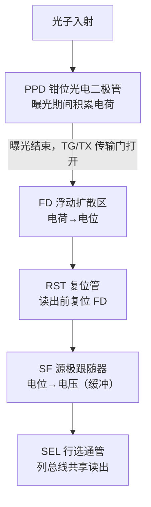

配合**相关双采样（CDS，Correlated Double Sampling）**——先采样复位电平、再采样信号电平，两者相减——可消除复位管 kTC 噪声与列级固定模式噪声（FPN）。PPD + 4T + CDS 是现代 CMOS 像素"低噪声"的三大支柱（B 层）。

### 1.1.3 Bayer / CFA 排列（A 层定义 + B 层背景）

硅光电二极管本身不分辨颜色。在像素表面覆盖**色彩滤波阵列（CFA，Color Filter Array）**后，每个像素只通过一种颜色分量，最常用的是 **Bayer 排列**（Gr/Gb 两个绿色通道错开，是因为人眼对绿色更敏感；Gr 与 Gb 物理上是同类像素，位于不同滤波颜色行）：

| | 列 0 | 列 1 | 列 2 | 列 3 |
|---|---|---|---|---|
| **行 0** | R | G(Gr) | R | G(Gr) |
| **行 1** | G(Gb) | B | G(Gb) | B |
| **行 2** | R | G(Gr) | R | G(Gr) |
| **行 3** | G(Gb) | B | G(Gb) | B |

AOSP 元数据 `android.sensor.info.colorFilterArrangement` 的官方定义为："色彩滤波在传感器上的排列；对 Bayer 相机而言，表示传感器左上 2×2 区域按读取顺序的颜色"，枚举值（A 层，来自 metadata_definitions.xml）：

- `RGGB` / `GRBG` / `GBRG` / `BGGR`：四种 Bayer 相位；
- `RGB`：非 Bayer 传感器，每像素输出 3 个 16-bit 值；
- `MONO`（HAL 3.4+）：无任何 Bayer 滤波的单色传感器，"该值意味着一台 MONOCHROME 相机"；
- `NIR`（HAL 3.4+）：整阵覆盖约 750–1400nm 近红外滤波的传感器，同样意味着 MONOCHROME 相机。

单色/NIR 传感器去掉 CFA 后感光效率更高、低光噪声更好，其在 HAL 层的完整实现要求（必须去掉颜色校正类元数据键、`blackLevelPattern` 等各通道值必须一致等）见仓库内文档：Android/Android_Camera_学习文档.md 第 6.4 节（A 层）。

### 1.1.4 raw domain 概念（A 层）

**raw domain** 指"传感器 ADC 输出、尚未经过任何 ISP 处理（去马赛克、白平衡、降噪、shading 校正等）"的数据域。Android 对 Bayer RAW 输出有明确的支持要求：其目的有二——服务高级相机应用、支持生成 RAW 图片文件（DNG），见仓库内文档：Android/Android_Camera_学习文档.md 第 2.4.3 节（A 层，引自 AOSP HAL3 文档"Raw Sensor Data Support"）。

RAW 帧必须伴随一组传感器校准元数据才能被后处理，AOSP 在 `android.sensor.*` 中标准化的有（A 层，metadata_definitions.xml 定义）：

| Tag | 官方定义（摘要） |
|---|---|
| `sensor.info.whiteLevel` | 传感器输出的最大 raw 值 |
| `sensor.blackLevelPattern` | CFA 各通道的**固定**黑电平偏移 |
| `sensor.dynamicBlackLevel` | 本帧各 CFA 通道的**动态**黑电平（如逐帧温漂补偿） |
| `sensor.opticalBlackRegions` | 传感器上光学屏蔽（不感光）黑像素区域列表，供每帧实测黑电平 |
| `sensor.neutralColorPoint` | 拍摄时刻在传感器原生色彩空间中估计的相机中性色 |
| `sensor.noiseProfile` | 各 CFA 通道的噪声模型系数（喂给 RAW 降噪） |
| `sensor.greenSplit` | Bayer 两个绿通道的最坏离散度 |

黑电平之后的动态范围（`whiteLevel − blackLevel`）就是后续第 2 章黑电平校正、增益归一化的输入基准。

---

## 1.2 曝光模型

> 来源：A 层——[AOSP metadata_definitions.xml](https://android.googlesource.com/platform/system/media/+/refs/heads/main/camera/docs/metadata_definitions.xml)、[内核 V4L2 controls 文档](https://www.kernel.org/doc/html/latest/userspace-api/media/v4l/control.html)、mainline 内核源码 [imx290.c](https://git.kernel.org/pub/scm/linux/kernel/git/torvalds/linux.git/tree/drivers/media/i2c/imx290)；B 层——卷帘/全局快门原理与读出模式分类

### 1.2.1 曝光时间 × 增益（A 层）

AOSP 对三个核心曝光量的官方定义与单位（metadata_definitions.xml 原文）：

| Tag | 官方定义 | 单位 | 归属 |
|---|---|---|---|
| `sensor.exposureTime` | "Duration each pixel is exposed to light"（每个像素受光照射的时长） | 纳秒 | 请求/结果 |
| `sensor.sensitivity` | "The amount of gain applied to sensor data before processing"（处理前施加于传感器数据的增益量） | ISO arithmetic units | 请求/结果 |
| `sensor.frameDuration` | "Duration from start of frame readout to start of next frame readout"（从本帧读出开始到下一帧读出开始的时长） | 纳秒 | 请求/结果 |

注意 `frameDuration` 的锚点是**读出开始**而非曝光开始——这正是 1.2.4 卷帘时序的关键。三者的合法范围分别由静态元数据 `sensor.info.exposureTimeRange`、`sensor.info.sensitivityRange`、`sensor.info.maxFrameDuration` 约束；应用请求 0 帧时长时 HAL 必须钳位到实际最小帧时长并在结果元数据中报告，见仓库内文档：Android/Android_Camera_学习文档.md 第 2.4.1 节（A 层）。手动设置曝光三件套需 `CONTROL_AE_MODE=OFF` 且设备具备 `MANUAL_SENSOR` 能力，见仓库内文档：Android/Android_Camera_接口文档.md 第 1.6 节（A 层）。

### 1.2.2 模拟增益与数字增益（A 层）

ISO 感光度在硬件上是两级增益的合成：

- `sensor.info.maxAnalogSensitivity`：官方定义为 "Maximum sensitivity that is implemented purely through analog gain"（纯粹通过模拟增益实现的最高感光度）。显然可推出：sensitivity 超过该值的部分由数字增益补足——数字增益放大信号的同时等比放大读出噪声，模拟增益则不会，所以 AE 在可调范围内应优先用满模拟增益（前半句 A 层，后一句为通行结论，B 层）。
- `sensor.info.baseGainFactor`："Gain factor from electrons to raw units when ISO=100"（ISO=100 时电子到 raw 单位的增益系数），是 ISO 与物理电子数换算的基准。

内核 V4L2 侧同样区分两级增益：uAPI 文档明确，能区分数字/模拟增益的设备应使用 `V4L2_CID_DIGITAL_GAIN` 与 `V4L2_CID_ANALOGUE_GAIN`，而不是笼统的 `V4L2_CID_GAIN`；且 `V4L2_CID_EXPOSURE` 的单位在 uAPI 层未统一规定，由驱动决定（A 层，[control.html](https://www.kernel.org/doc/html/latest/userspace-api/media/v4l/control.html)）。以 mainline 的 Sony IMX290 驱动为例（A 层，drivers/media/i2c/imx290.c）：它注册了 `V4L2_CID_EXPOSURE`（1–65535）、`V4L2_CID_ANALOGUE_GAIN`、`V4L2_CID_HBLANK`、`V4L2_CID_VBLANK`、`V4L2_CID_LINK_FREQ`、`V4L2_CID_PIXEL_RATE`，并且在 `VBLANK` 变化时联动更新 `EXPOSURE` 的允许上限——曝光行数不能超过一帧行数的约束在驱动内闭环。

### 1.2.3 电子卷帘与全局快门（B 层原理 + A 层元数据）

- **电子卷帘快门（rolling shutter）**：传感器逐行复位/曝光/读出，相邻行曝光起始时刻依次错开。行间错开量由 AOSP 标准化：`sensor.rollingShutterSkew` 官方定义为 "Duration between the start of exposure for the first row of the image sensor, and the start of exposure for one past the last row of the image sensor"（第一行曝光开始到"最后一行再下一行"曝光开始的时长，单位 ns）。卷帘会带来果冻效应（高速运动物体形变）、与频闪（flicker）交互产生 banding，这也是 AE 防闪烁按市电半周期对齐曝光时间的原因（B 层）。
- **全局快门（global shutter）**：所有像素同时曝光、再逐行读出，代价是像素结构更复杂（需要像素内存储节点）。车载/机器视觉 sensor 常采用（B 层）。

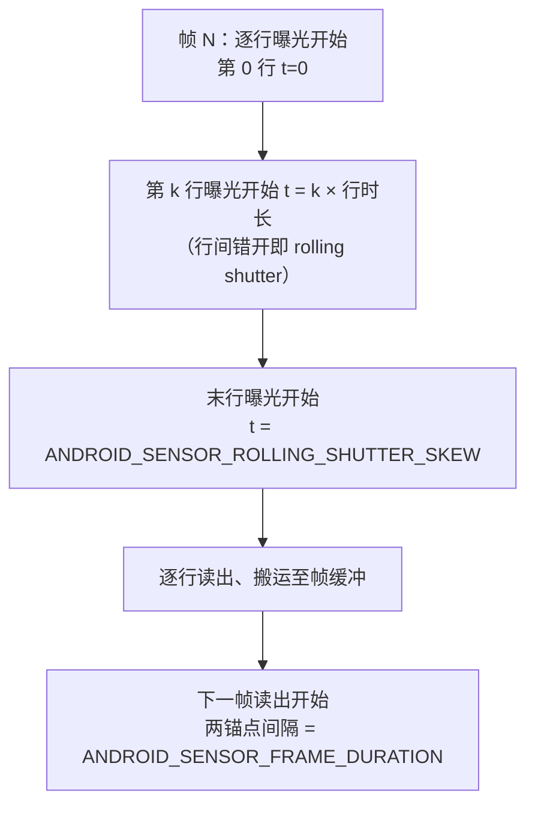

AOSP 进一步用 `sensor.timestampSource`（UNKNOWN / REALTIME，见 1.5.3）规定时间戳时钟基准，并从 Android 13 起增加 `sensor.readoutTimestamp` 能力：官方定义为 "Whether or not the camera device supports readout timestamp and `onReadoutStarted` callback"——把"读出开始"时刻也暴露给框架，用于更精确的运动检测与防抖（A 层）。

### 1.2.4 传感器读出模式（B 层）

按一帧内曝光的组织方式，通行分类为：

- **linear（线性单次曝光）**：全帧一次曝光、一次读出，1.1 节的标准流程；
- **staggered HDR（交错 HDR）**：长/短（或长/中/短）曝光以行为单位交错排布在同一帧中，一次读出即得含多档曝光的单帧（详见 1.6）；
- **ZHDR**：部分厂商对"按行/块交错多档曝光读出"的称呼（如 zigzag 式排列），命名随厂商而异，无统一标准（B 层，注意不同资料中该词含义可能不完全一致）。

---

## 1.3 PDAF 原理

> 来源：B 层——PD 像素类型与数据通路为公开架构资料（无单一官方 URL）；A 层——元数据语义来自 [AOSP metadata_definitions.xml](https://android.googlesource.com/platform/system/media/+/refs/heads/main/camera/docs/metadata_definitions.xml)（本文抓取解析 main 分支）与仓库内文档：Android/Android_Camera_接口文档.md（第 1.6/1.7 节、第 5.5 节）

### 1.3.1 相位差检测原理（B 层）

PDAF（Phase Detection Auto Focus，相位检测自动对焦）把成像光线分成两束（通常对应光瞳左右两半），分别落在成对的 PD 感光单元上。失焦时两路信号出现水平位移（相位差），其符号指示对焦过近/过远，其大小（经标定查表换算为 **defocus 值**，单位通常是镜头行程量）可直接推算对焦马达需要移动的距离——相比反差对焦的"试探爬山"，PDAF 能一步到位地预测对焦方向与幅度，再由反差确认收敛。

### 1.3.2 PD 像素类型（B 层）

公开架构资料中常见的 PD 像素实现（命名随厂商，机理相通）：

| 类型 | 结构 | 特点 |
|---|---|---|
| masked PD（掩蔽式，常与 shielded/metal-shielded 混用） | 在普通像素上用金属遮挡左半或右半，只接收半侧光瞳 | 造低：在像素阵列内稀疏插入成对的左/右遮蔽像素；损失部分感光面积 |
| shielded PD | 同上思路，以屏蔽层/微透镜偏移实现半光瞳取样 | 与 masked 常为同族概念的两种表述 |
| 2PD / Dual Pixel | 单个像素内的光电二极管左右对拆，两个输出都可成像 | 全阵列 100% PD 覆盖、弱光也能对焦；输出数据量翻倍 |
| Octa PD（2×2 OCL，社区资料亦写作 OCTPA） | 2×2 像素簇共享一个片上透镜，四个象限各自引出相位信号 | 兼顾高分辨率与全向相位检测；不同厂商命名不一 |

（以上均 B 层；"OCTPA" 一词在社区资料中更常见，官方多写作 Octa PD / 2×2 OCL——此处按公开架构资料归类，读者以具体 sensor datasheet 为准。）

### 1.3.3 PD 数据如何进入 AF 算法（B 层）

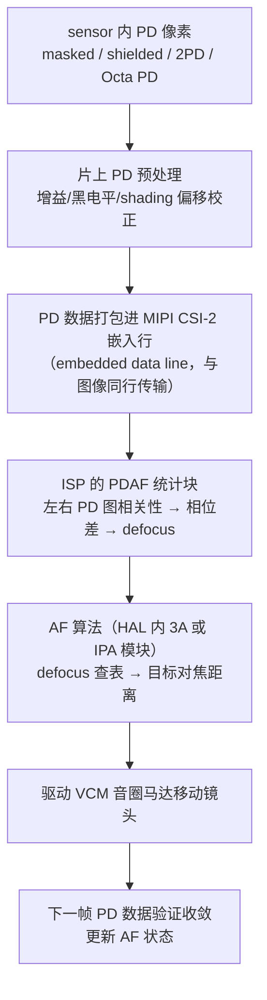

要点：PD 数据通常作为 **CSI-2 嵌入数据行**与像素数据一起传输，由 ISP（而非应用）截取；相位差到 defocus 的换算依赖 sensor+模组标定，属于产线标定数据（B 层）。

### 1.3.4 与 Android 元数据的关系（A 层 + 一处 B 层推断）

**Android 公开元数据没有标准的 PD 原始数据 tag。** 本文写作时解析 main 分支 `metadata_definitions.xml`：`sensor`（50 条）与 `statistics`（35 条）两个 section 中不存在任何 PDAF 数据条目（A 层，可复现验证）。因此 PD 原始数据/defocus 结果的交付走**厂商自定义 vendor tag**（编号 ≥ `0x80000000`、以厂商包名前缀命名的 section），其注册与查询机制见仓库内文档：Android/Android_Camera_接口文档.md 第 5.5 节（A 层）。AF 的"决策侧"则是标准化的：

- `CONTROL_AF_MODE` / `CONTROL_AF_TRIGGER` / `CONTROL_AF_REGIONS` 驱动 AF 行为，`CONTROL_AF_STATE` 报告状态机（`ACTIVE_SCAN` / `FOCUSED_LOCKED` / `PASSIVE_SCAN` 等），见仓库内文档：Android/Android_Camera_接口文档.md 第 1.6/1.7 节（A 层）；
- `LENS_FOCUS_DISTANCE`（屈光度）与 `LENS_STATE`（STATIONARY/MOVING）报告镜头实际位置与马达状态（A 层，同上）。

与 PD 质量相关的两条标准统计（A 层定义，来自 metadata_definitions.xml）：

- `statistics.lensShadingMap`："The shading map is a low-resolution floating-point map that lists the coefficients used to correct for vignetting and color shading, for each Bayer color channel of RAW image data."（对每 Bayer 通道校正渐晕与**色彩阴影**的低分辨率浮点系数表）；`statistics.lensShadingMapMode` 控制是否在结果元数据中输出该表（`OFF` / `ON`）。与 PD 的关系：**色彩阴影（color shading）会使成对 PD 信号产生系统性偏移，降低相位检测信噪比**，所以 AF 算法常需 shading 补偿后再做相关运算（前半句 A 层、后半句为通行做法，B 层推断）。
- `sensor.rollingShutterSkew` 与 `sensor.timestamp`（1.2.3 / 1.5.3）：为多帧 AF 搜索提供帧间时序基准（A 层）。

---

## 1.4 Sensor 驱动与内核层

> 来源：A 层——[V4L2 sub-device API](https://docs.kernel.org/driver-api/media/v4l2-subdev.html)、[Media Controller 核心文档](https://docs.kernel.org/driver-api/media/mc-core.html)、[V4L2 controls](https://www.kernel.org/doc/html/latest/userspace-api/media/v4l/control.html)、[Qualcomm CAMSS](https://docs.kernel.org/admin-guide/media/qcom_camss.html)、mainline 内核源码（drivers/media/platform/qcom/camss/、drivers/media/i2c/ov5645.c、imx290.c）、googlesource kernel/common（android-mainline 分支，camss 目录清单已核对一致）、[libcamera pipeline handler 指南](https://docs.libcamera.org/guides/pipeline-handler.html)（经 GitHub 源文件抓取）

### 1.4.1 V4L2 subdev 模型：sensor 是一个 subdev（A 层）

内核把 sensor、镜头控制器、CSI 接收器等"非 DMA 视频节点"的外设建模为 **V4L2 sub-device**：`struct v4l2_subdev` "describes a V4L2 sub-device"——最常见就是 I2C 器件。sensor 驱动的骨架（以 mainline `drivers/media/i2c/ov5645.c` 为例，A 层源码）：

1. `v4l2_i2c_subdev_init(&ov5645->sd, client, &ov5645_subdev_ops)`：把 `v4l2_subdev` 与 `i2c_client` 双向绑定；
2. `media_entity_pads_init(&sd->entity, npads, pads)`：为 media-controller 集成注册源 pad；
3. `v4l2_async_register_subdev_sensor(&ov5645->sd)`：异步注册；文档指出 sensor 专用变体还会顺带注册来自固件的 lens/flash 关联设备；
4. 设置 `V4L2_SUBDEV_FL_HAS_DEVNODE` 后，`v4l2_device_register_subdev_nodes()` 创建用户态节点 `/dev/v4l-subdevX`。

`struct v4l2_subdev_ops` 按类别分组（kernel 文档原文归纳，A 层）：

| ops 组 | 代表成员 | sensor 用途 |
|---|---|---|
| `core` | `log_status`、`s_power`（已标记 DEPRECATED）、`subscribe_event` | 电源/事件（控制经 `ctrl_handler` 而非 s_ctrl 回调） |
| `video` | `s_stream`（已 DEPRECATED）、`pre_streamon` | 起停流；新驱动应实现 pad ops 的 `enable_streams`/`disable_streams` 并用 `v4l2_subdev_s_stream_helper()` |
| `pad` | `enum_mbus_code`、`get_fmt`/`set_fmt`、`get_selection`、`get_frame_interval`、`link_validate`、`get_mbus_config`、`get_frame_desc` | 协商 sensor 输出的 mbus 格式（如 `MEDIA_BUS_FMT_SRGGB10_1X10`）、尺寸、裁剪 |

ov5645 的 `.s_stream = v4l2_subdev_s_stream_helper` 与 `.set_fmt = ov5645_set_format` 正是上述新接口形态的实例（A 层源码）。

### 1.4.2 media-controller 管线拓扑（A 层）

Media Controller 把硬件建模为**有向图**：硬件块是 **entity**（`struct media_entity`，通常内嵌于 `v4l2_subdev` 或 `video_device`），连接端点是 **pad**（`MEDIA_PAD_FL_SINK` 接收 / `MEDIA_PAD_FL_SOURCE` 产生，"每个 pad 有且只能设置其一"），pad 之间用 **link**（`media_create_pad_link()`）连接，link 标志含 `MEDIA_LNK_FL_ENABLED` / `IMMUTABLE` / `DYNAMIC`。流式传输时 `media_pipeline_start()` 会沿已使能的 link 把整条管线标记为 streaming，并对每个 entity 调用 `link_validate()` 校验格式/尺寸匹配；流传输期间改非 DYNAMIC link 返回 `-EBUSY`。注册后系统出现字符设备 `/dev/mediaN`，用户态通过其 ioctls 遍历拓扑（`topology_version` 随图变化单调递增）（A 层，mc-core.html）。

### 1.4.3 sensor 驱动如何暴露曝光/增益 controls（A 层）

V4L2 控制通过 `v4l2_ctrl_handler` 实现：驱动调用 `v4l2_ctrl_new_std(&ctrls, &ops, V4L2_CID_XXX, min, max, step, def)` 注册控制，在 `ops->s_ctrl` 中写寄存器；用户态经 `VIDIOC_QUERYCTRL / VIDIOC_G_CTRL / VIDIOC_S_CTRL`（subdev 节点同样支持）读写（A 层，control.html + ov5645/imx290 源码）。典型 sensor 控制集（mainline 源码实例）：

| 控制 | 作用 | 出处 |
|---|---|---|
| `V4L2_CID_EXPOSURE` | 积分时间，单位驱动自定义（常为行）；uAPI 不统一规定 | imx290（1–65535，随 VBLANK 联动更新上限） |
| `V4L2_CID_ANALOGUE_GAIN` / `V4L2_CID_DIGITAL_GAIN` | 模拟/数字增益分离（能区分的设备应优先用二者而非 `V4L2_CID_GAIN`） | imx290 注册 ANALOGUE_GAIN；control.html |
| `V4L2_CID_HBLANK` / `V4L2_CID_VBLANK` | 行/帧消隐，决定帧率上限 | imx290 |
| `V4L2_CID_PIXEL_RATE` / `V4L2_CID_LINK_FREQ` | 像素率 / CSI 链路频率（只读型，供推算帧率与 CSI 配置） | ov5645、imx290 |
| `V4L2_CID_TEST_PATTERN` | 传感器测试图案 | ov5645 |

注意对照关系：内核里曝光/增益是逐控制写入的 V4L2 controls；Android HAL 里它们收敛为 `SENSOR_EXPOSURE_TIME` / `SENSOR_SENSITIVITY` 等元数据，由 HAL/ISP 驱动层翻译为内核 controls（该翻译层属于厂商 HAL 实现，Android 不规定其形态——此句为 B 层推断，其余 A 层）。

### 1.4.4 QCOM CAMSS 驱动的 pipeline 描述（A 层）

内核文档 [qcom_camss.html](https://docs.kernel.org/admin-guide/media/qcom_camss.html) 描述的 Qualcomm Camera Subsystem 驱动（位于 `drivers/media/platform/qcom/camss`，支持 MSM8916/MSM8996（8x16/8x96），基于 Code Linaro 的 Android CAMSS 驱动移植）实现了 V4L2、Media controller 与 V4L2 subdev 三类接口。硬件单元与实体数量（8x16 / 8x96）：

| 硬件块 | 数量（8x16/8x96） | 职责 |
|---|---|---|
| CSIPHY | 2 / 3 | CSI-2 物理层（D-PHY），每模块接一个 sensor |
| CSID | 2 / 4 | CSI-2 协议/应用层解码，各含 TG（测试图案发生器） |
| ISPIF | 2 / 4（与 CSID 等量） | 把 CSID 流路由到 VFE 输入 |
| VFE | 1 / 2 | "a pipeline of image processing hardware blocks"；每 VFE 有 1 个 PIX 输入 + 3 个 RDI 输入 |

- **PIX 接口**：喂入 VFE 内部图像处理管线（末端为 scale/crop 模块），支持格式转换（packed YUV 4:2:2 → NV12/NV21/NV16 等）、最多 16 倍下采样与裁剪；
- **RDI 接口**："bypass the image processing pipeline"，旁路直通 raw dump，支持 MIPI RAW8/10/12（8x96 另有 RAW14）与 packed YUV；经 AXI 总线写内存；
- 驱动按硬件单元拆成 subdev（2/3 个 CSIPHY、2/4 个 CSID、2/4 个 ISPIF、4/8 个 VFE subdev——每输入接口一个），"Each VFE sub-device is linked to a separate video device node"；ISPIF 与 CSID 等量使 media graph 保持**线性管线**（双摄场景不出现分叉实体）；
- 全部配置在 STREAMON 时根据活动 link、格式与 controls 一次完成，无需运行时重配置（A 层，qcom_camss.html）。

源码佐证（mainline 与 googlesource `kernel/common` android-mainline 分支文件清单一致，共 40 个文件：camss.c/h、camss-csid*.c/h、camss-csiphy*.c、camss-ispif.c、camss-vfe*.c/h、camss-video.c 等，A 层）：

- `camss.c`：以 `csiphy_res_8x16` / `csid_res_8x16` / `ispif_res_8x16` / `vfe_res_8x16` 等静态表描述每个 subdev 的时钟、寄存器、中断与 hw_ops（如 `csiphy_ops_2ph_1_0`、`csid_ops_4_1`）；
- `camss-vfe.c`：`#define MSM_VFE_NAME "msm_vfe"`，`#define SCALER_RATIO_MAX 16`，`formats_rdi_8x16[]` 表列出 RDI 支持的 mbus→V4L2 像素格式映射（SRGGB10P 等 packed RAW）；
- `camss-csid.c`：`csid_testgen_modes[]`（"Color bars" 等测试图案），与 CSID 内置 TG 对应——正好呼应 AOSP 的 `sensor.testPatternMode` 与 `V4L2_CID_TEST_PATTERN` 两级测试图案。

按文档文字描述绘制的 8x16 级 media graph（文档原图为图片未随文本提供，本图按其正文归纳，A 层）：

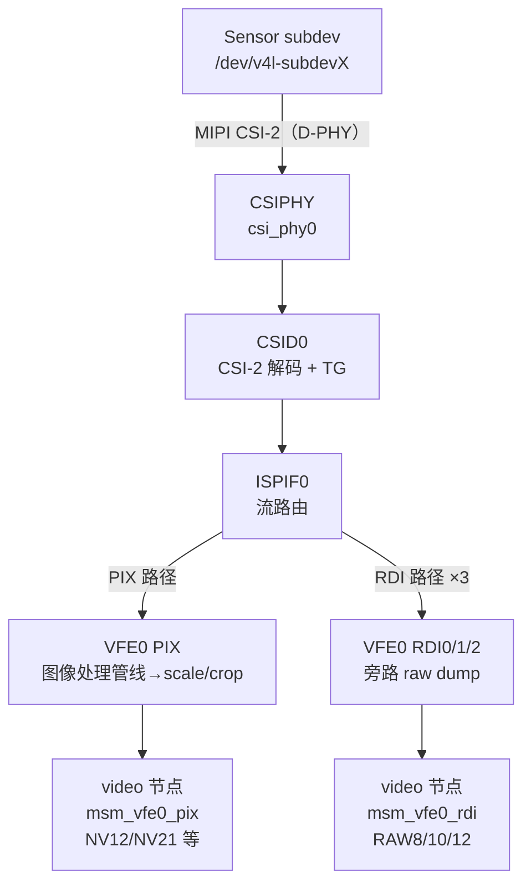

### 1.4.5 libcamera 视角（A 层）

libcamera 官方文档把 **pipeline handler** 定义为"针对特定设备的抽象层"，职责包括：探测并注册相机及其流、按应用配置分配系统资源、起停采集会话、"Apply control settings from applications and IPA algorithms to hardware"、向应用交付帧（A 层，[pipeline-handler 指南](https://docs.libcamera.org/guides/pipeline-handler.html)）。关键方法流：

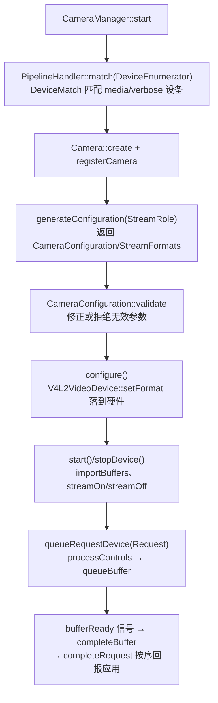

pipeline handler 直接消费 1.4.1–1.4.2 的内核抽象：`MediaDevice`/`DeviceEnumerator` 枚举拓扑，`V4L2VideoDevice` 承载 DMA 缓冲（V4L2_MEMORY_DMABUF），`V4L2Subdevice` 控制 sensor 等 subdev，而 sensor 细节被封装在 `CameraSensor` 类之后；3A 计算由 **IPA 模块**（`IPAInterface`，"the computation of the image processing pipeline tuning parameters"）完成，其输出控件由 pipeline handler 落到硬件。整个模型同样解释了 Android vendor HAL 与内核的对接方式（hal3 厂商实现中普遍存在同构的 pipeline 管理层——此为 B 层推断，其余 A 层）。

---

## 1.5 与 Android HAL 的接口

> 来源：A 层——[AOSP metadata_definitions.xml](https://android.googlesource.com/platform/system/media/+/refs/heads/main/camera/docs/metadata_definitions.xml)（抓取解析 main 分支）；仓库内文档：Android/Android_Camera_学习文档.md（第 1.3 节 HAL3 管道模型）、Android/Android_Camera_接口文档.md（第 1.6/1.7 节、第 4.3 节、第 5 章）

### 1.5.1 数据通路：sensor 输出 → ISP → HAL → 应用（A 层框架 + B 层衔接）

Android HAL3 采用请求-结果（request/result）模型：应用每帧下发 `CaptureRequest`（携带 `SENSOR_EXPOSURE_TIME` 等控制项），HAL 返回填充好的缓冲与 `CaptureResult` 元数据；请求中能设置的所有 Key 都能在结果中查到最终生效值（A 层，仓库内文档：Android/Android_Camera_学习文档.md 第 1.3.2 节、Android/Android_Camera_接口文档.md 第 1.7 节）。

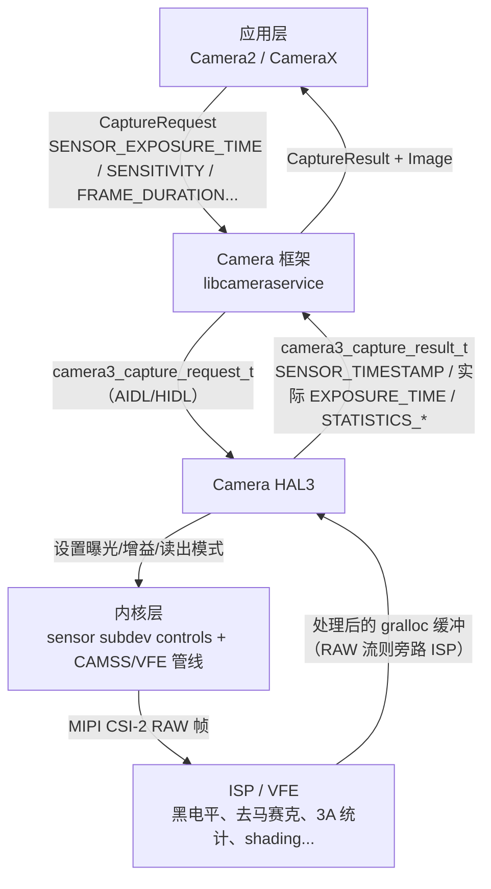

HAL 内部"是否使用内核 ISP 节点（如 CAMSS 的 video 节点）、还是私有 DSP/硬件 ISP"由厂商实现决定，Android 不做规定（B 层推断；CAMSS 文档已证明内核侧确实以 video 节点暴露采集口，A 层）。输出流（预览 YUV、JPEG、RAW Bayer 等）必须在会话配置阶段一次性声明，见仓库内文档：Android/Android_Camera_学习文档.md 第 2.5.1 节（A 层）。

### 1.5.2 ANDROID_SENSOR_* 元数据清单（A 层）

下表按"请求项 / 静态项（info）/ 动态项"分类，定义均摘译自 metadata_definitions.xml。tag 组织上，`SENSOR` 与 `SENSOR_INFO` 两个 section 分别承载动态与静态条目（`*_INFO` 是生成时从主 section 的 `<static>` 内嵌 `<info>` 拆出的，见仓库内文档：Android/Android_Camera_接口文档.md 第 5.3.2 节；`sensor` section 共 50 条 = 6 controls + 33 static + 11 dynamic，见同文档第 5.4 节统计）。

**请求项（controls）**

| Tag | 官方定义（摘译） | 单位/范围 |
|---|---|---|
| `sensor.exposureTime` | 每个像素受光照射的时长 | 纳秒；`sensor.info.exposureTimeRange` |
| `sensor.frameDuration` | 本帧读出开始→下一帧读出开始的时长 | 纳秒；受 `sensor.info.maxFrameDuration` 与流组合约束 |
| `sensor.sensitivity` | 处理前施加于传感器数据的增益量 | ISO arithmetic units；`sensor.info.sensitivityRange` |
| `sensor.testPatternMode` | 使能后传感器输出测试图案而非真实曝光（OFF / SOLID_COLOR / COLOR_BARS…） | 枚举见 `sensor.info.availableTestPatternModes`；可配 `sensor.testPatternData` 指定 `[R, G_even, G_odd, B]` 纯色 |

**静态项（info，配置前可查）**

| Tag | 官方定义（摘译） |
|---|---|
| `sensor.info.activeArraySize` | 经几何畸变校正后的**有效成像区域**（crop/变焦坐标基准） |
| `sensor.info.preCorrectionActiveArraySize` | 几何畸变校正**前**的有效像素区域（HAL 3.2+，供畸变校正使用） |
| `sensor.info.pixelArraySize` | 全像素阵列尺寸，**可能包含黑校准像素**（大于 active array） |
| `sensor.info.physicalSize` | 全像素阵列的物理尺寸（mm） |
| `sensor.info.colorFilterArrangement` | CFA 排列（RGGB/GRBG/GBRG/BGGR/RGB/MONO/NIR，见 1.1.3） |
| `sensor.info.orientation` | "Clockwise angle through which the output image needs to be rotated to be upright on the device screen in its native orientation"（输出图像顺时针旋转多少度才能在原生屏幕方向摆正；API 层取 0/90/180/270，见仓库内文档：Android/Android_Camera_接口文档.md 第 1.3 节） |
| `sensor.info.timestampSource` | 时间戳时钟基准（UNKNOWN / REALTIME，见 1.5.3） |
| `sensor.info.whiteLevel` | 传感器最大 raw 输出值 |
| `sensor.info.maxFrameDuration` | 支持的最大帧时长（最低帧率） |
| `sensor.info.exposureTimeRange` / `sensitivityRange` | 手动曝光的合法范围 |
| `sensor.info.maxAnalogSensitivity` | 纯模拟增益可达的最高 ISO（区分模拟/数字增益的分界，见 1.2.2） |
| `sensor.info.lensShadingApplied` | 该设备输出的 RAW 是否已做过 lens shading 校正（决定应用侧是否需要再补偿） |
| `sensor.info.availableTestPatternModes` | 支持的测试图案列表 |
| `sensor.blackLevelPattern` | CFA 各通道固定黑电平 |
| `sensor.opticalBlackRegions` | 光学屏蔽黑像素区域列表（逐帧实测黑电平的取样区） |
| `sensor.calibrationTransform1/2`、`sensor.colorTransform1/2`、`sensor.forwardMatrix1/2`、`sensor.referenceIlluminant1/2` | RAW→DNG/XYZ 的一组标定矩阵（reference sensor ↔ 设备 sensor ↔ CIE XYZ），1/2 对应两种参考光源；单色相机必须全部缺失（见仓库内文档：Android/Android_Camera_学习文档.md 第 6.4.3 节） |

**动态项（每帧结果）**

| Tag | 官方定义（摘译） |
|---|---|
| `sensor.timestamp` | "Time at start of exposure of first row of the image sensor active array, in nanoseconds"（active array 第一行**曝光开始**时刻，ns） |
| `sensor.rollingShutterSkew` | 首行与末行曝光开始的间隔（见 1.2.3） |
| `sensor.dynamicBlackLevel` / `sensor.dynamicWhiteLevel` | 本帧各 CFA 通道黑电平 / 本帧最大 raw 值 |
| `sensor.neutralColorPoint` | 本帧在传感器原生色彩空间中的相机中性色估计 |
| `sensor.noiseProfile` | 本帧各 CFA 通道噪声模型系数 |
| `sensor.greenSplit` | 两绿通道最坏离散度 |
| `sensor.temperature` | 曝光开始时采样的传感器温度 |
| `sensor.exposureTime` / `frameDuration` / `sensitivity` / `testPatternMode` | 本帧**实际**生效值（HAL 可能对请求做钳位/舍入，必须回报告知应用） |

其中"结果必须回报告际生效值"是 AOSP 明确要求：硬件实际使用的曝光时间、帧时长等必须写入输出元数据，使应用得知钳位/舍入何时发生并补偿（A 层，仓库内文档：Android/Android_Camera_学习文档.md 第 2.4.1 节）。

### 1.5.3 时间戳语义（A 层）

`sensor.timestamp` 锚定在"active array 第一行曝光开始"。其时钟基准由 `sensor.info.timestampSource` 决定（metadata_definitions.xml 枚举原文要点）：

- `UNKNOWN`：单调纳秒时钟，但不能与其他子系统（加速度计、陀螺仪）或其他相机实例的时钟精确对齐；大致与 `SystemClock.uptimeMillis` 同基准，精度足以做 A/V 同步；同一相机实例内，流缓冲与结果元数据的时间戳可比且一致；
- `REALTIME`：与 `SystemClock.elapsedRealtimeNanos` 同基准，可与系统其他时间戳对齐；缓冲直接送视频编码器时框架自动补偿音视频时钟差。

API 层的对应描述是"该帧曝光开始的时间戳（ns）；与 `onCaptureStarted`、Image 时间戳同一时钟"（仓库内文档：Android/Android_Camera_接口文档.md 第 1.7 节）。这组语义是 3A 时序分析、多帧对齐、AR（相机与 IMU 融合）的基石：AR 场景要求 REALTIME 基准与镜头位姿标定（`LENS_POSE_ROTATION` 等，见仓库内文档：Android/Android_Camera_学习文档.md 第 6.5 节运动追踪）。

### 1.5.4 sensor 静态信息如何支撑下游（A 层）

- **裁剪/变焦坐标系**：`SCALER_CROP_REGION` 的合法范围以 `SENSOR_INFO_ACTIVE_ARRAY_SIZE` 为坐标基准，最小宽高由 `SCALER_AVAILABLE_MAX_DIGITAL_ZOOM` 推出（仓库内文档：Android/Android_Camera_学习文档.md 第 2.5.2 节）；
- **RAW 后处理**：`blackLevelPattern` + `dynamicBlackLevel` + `whiteLevel` + `noiseProfile` + shading map（`statistics.lensShadingMap`，定义见 1.3.4）构成 RAW 管线的第一组输入；
- **能力分级**：`MANUAL_SENSOR` 能力开关手动曝光三件套；`DYNAMIC_RANGE_TEN_BIT`、`ULTRA_HIGH_RESOLUTION_SENSOR`（配合 `sensor.info.pixelArraySizeMaximumResolution`、`sensor.binningFactor`）等能力以 sensor 特性为前提（仓库内文档：Android/Android_Camera_接口文档.md 第 1.3 节 Key 速查）。

---

## 1.6 传感器 HDR 能力

> 来源：A 层——AOSP HDR 路线图见仓库内文档：Android/Android_Camera_学习文档.md 第 6.2 节（引自 AOSP"高动态范围（HDR）模式"官方文档）；B 层——单帧 staggered HDR 的传感器机制

### 1.6.1 两条技术路线

HDR 要解决的核心问题是高对比场景下单帧 8-bit 成像丢失高光或阴影细节。Android 平台上分两类实现（A 层，仓库内文档：Android/Android_Camera_学习文档.md 第 6.2 节）：

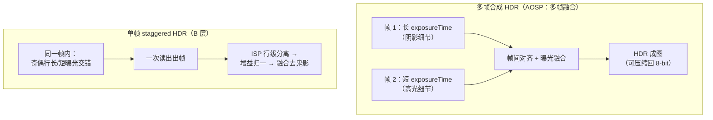

- **多帧合成**：连拍多帧不同 `exposureTime`（必要时不同增益）的帧再融合。Android 的产品化路线有二：HAL 内实现的 HDR 场景模式（对客户端透明、一次请求生效）与框架/应用侧的 Camera Extensions 多帧融合（质量可超出常规请求）；Android 13 起进一步叠加 10-bit 输出管线（`DYNAMIC_RANGE_TEN_BIT` 能力 + `DynamicRangeProfiles`，P010/JPEG_R）承载 HDR 结果（A 层，同上）。
- **单帧 staggered HDR**：sensor 一次曝光读出即产出含多档曝光的单帧（1.2.4 的 staggered 读出模式），因此天然无帧间运动鬼影、无多帧延迟，代价是：分辨率/读出带宽被多档曝光摊薄、需要在 ISP 内做行级分离与融合、逐行曝光差异使噪声与频闪处理更复杂（B 层）。"ZHDR" 是部分厂商对同类行/块交错方案的称呼，命名随厂商而异（B 层）。

### 1.6.2 选择依据与元数据关联

| 维度 | 多帧合成 | 单帧 staggered |
|---|---|---|
| 运动伪影 | 需帧间对齐/去鬼影 | 单帧无鬼影（B 层） |
| 帧率/延迟 | 多帧采集，延迟高 | 单帧出图（B 层） |
| ISP 要求 | 帧级融合 | 行级分离、分档增益与降噪（B 层） |
| AOSP 接口 | HDR scene mode / Camera Extensions / 10-bit 输出（A 层） | 无标准 tag；HAL 通常以普通 RAW 流 + vendor tag 私有通告（B 层推断，机制同 1.3.4 vendor tag） |

无论哪条路线，都会转化为 1.2 节曝光模型的调度问题：多帧路线按帧序列安排 `exposureTime/sensitivity`（受 `frameDuration` 与 `maxFrameDuration` 约束），staggered 路线由 sensor 在单帧内自行完成分档曝光。至于部分资料中出现的 SMEC/DSM 等厂商缩写概念，本文写作时未能从可验证的公开资料确认其统一定义，按要求**省略**，不作 B/C 层展开。

---


# 第 2 章 ISP 管线与图像处理算法

本章面向学习 Android 相机底层 / ISP 的工程师，讲清"RAW 帧如何在 ISP 里一步步变成可用的 YUV/RGB 图像、3A 统计如何驱动参数闭环、以及这一切在 mainline 内核（rkisp1）与 libcamera IPA 框架中的真实形态"。第 1 章的 sensor 输出（RAW Bayer + 黑电平/噪声元数据）正是本章处理链的输入。

**材料可信度分层约定**与第 1 章相同：A 层 = 可验证官方资料（内核文档/源码、AOSP 元数据定义、libcamera 官方文档、仓库内文档），B 层 = 公开架构资料与行业通行描述，C 层 = 社区研究（须标注出处）。

---

## 2.1 ISP 在相机系统中的位置

> 来源：A 层——仓库内文档：Android/Android_Camera_学习文档.md（1.3.3 相机管道虚拟模型、2.5.1 输出流、2.5.3 重新处理）、Android/Android_Camera_接口文档.md（第 1.3 节、1.7 节、第 5.3/5.4 节）、[AOSP metadata_definitions.xml](https://android.googlesource.com/platform/system/media/+/refs/heads/main/camera/docs/metadata_definitions.xml)（main 分支，本文写作时抓取解析）；B 层——sensor→ISP→编码/显示的数据流为行业通行描述

### 2.1.1 数据流全景（B 层）

sensor 按 1.2 节曝光模型出帧后，RAW Bayer 数据经 MIPI CSI-2 进入 ISP；ISP 在 raw domain 完成黑电平、阴影校正、去马赛克、降噪、色彩校正等处理，同时从数据流中"分接"出 3A 统计；处理后的 YUV/RGB 缓冲写入内存（gralloc），再分流给显示（预览）、编码器（视频/JPEG）或应用分析。RAW 流则旁路 ISP 处理链，原样落盘：

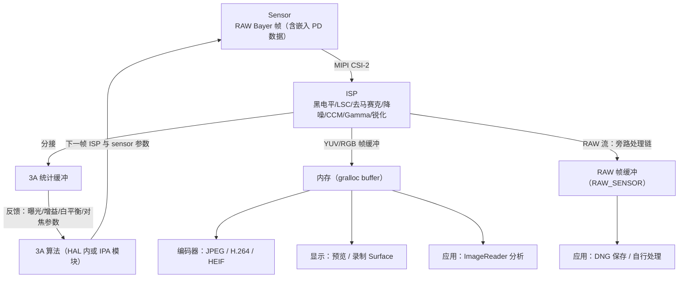

### 2.1.2 AOSP 的虚拟管道模型（A 层）

Android HAL3 文档对相机管道给出的是**虚拟模型**：不直接对应任何真实 ISP，但要足够接近真实处理管道以便映射到硬件。其关键假设（A 层，仓库内文档：Android/Android_Camera_学习文档.md 第 1.3.3 节）：

- RAW Bayer 输出在 ISP 内部不做处理；
- **统计信息（statistics）基于原始传感器数据（raw）生成**——这是 2.3 节所有统计元数据的域基准；
- RAW→YUV 的各处理块可按任意顺序排列（所以 2.2 节的 stage 顺序只是行业通行排布，各厂商实现不同）；
- 处理块有三种模式：OFF（去马赛克、色彩校正、色调曲线**不可停用**）、FAST（不降帧率）、HIGH_QUALITY（允许降帧率换质量）——对应 `NOISE_REDUCTION_MODE` / `EDGE_MODE` / `SHADING_MODE` 等键的模式枚举。

### 2.1.3 能力通告与后处理能力（A 层）

设备"能不能输出 RAW、能不能重处理、后处理能不能手动控制"由 `android.request.availableCapabilities` 通告（A 层，metadata_definitions.xml 官方定义摘译）：

| 能力位 | 官方定义（摘译） |
|---|---|
| `RAW` | "The camera device supports outputting RAW buffers and metadata for interpreting them"——支持 `RAW_SENSOR` 输出格式、可存 DNG、也可由应用直接处理 raw 图像 |
| `MANUAL_POST_PROCESSING` | "The camera device post-processing stages can be manually controlled"——保证支持手动 tonemap（`tonemap.curve`/`gamma`）、手动白平衡（`colorCorrection.transform`/`gains`）、手动 lens shading 等后处理控制。FULL 级设备必须具备（RAW 非必需，见仓库内文档：Android/Android_Camera_学习文档.md 第 1.4.5 节） |
| `PRIVATE_REPROCESSING` | 支持 Zero Shutter Lag 重处理用例：支持 1 个输入流（`maxNumInputStreams == 1`），`ImageFormat.PRIVATE` 可作为输入/输出格式 |
| `YUV_REPROCESSING` | 同上风格，`YUV_420_888` 作为输入/输出格式的重处理用例 |

注意：Android **没有**名为"PROCESS_RAW"的能力位。RAW→YUV 处理是虚拟管道的本体（所有非 LEGACY 设备都必须具备）；`RAW` 能力位只负责"把 raw 输出暴露出来"，而"把重处理输入（YUV/PRIVATE）再喂回管道重新走一遍 RAW→YUV 链"由两个 REPROCESS 能力位承载（A 层，XML 枚举可复现验证）。重处理的输入侧配套机制：应用把之前捕获的 RAW/YUV 缓冲与其结果元数据（`TotalCaptureResult`）交给 `CameraDevice.createReprocessCaptureRequest()` 构造重处理请求（A 层，仓库内文档：Android/Android_Camera_接口文档.md 第 1.7 节末、Android/Android_Camera_学习文档.md 第 2.5.3 节"相机管道可处理之前捕获的 RAW 缓冲区和元数据，生成重新渲染的 YUV 或 JPEG 输出"）；`REPROCESS` 元数据 section 的 `effectiveExposureFactor`/`maxCaptureStall` 承载重处理专属参数（A 层，仓库内文档：Android/Android_Camera_接口文档.md 第 5.3.2 节）。

---

## 2.2 通用 ISP 管线 stage 全景图

> 来源：stage 处理顺序与算法原理为 B 层行业通行描述；各 stage 的块名、寄存器级参数形态以 mainline rkisp1 UAPI（[rkisp1-config.h](https://android.googlesource.com/kernel/common/+/refs/heads/android-mainline/include/uapi/linux/rkisp1-config.h)，android-mainline 分支，本文抓取解析）为 A 层实例

### 2.2.1 管线全景（B 层顺序 + A 层分接）

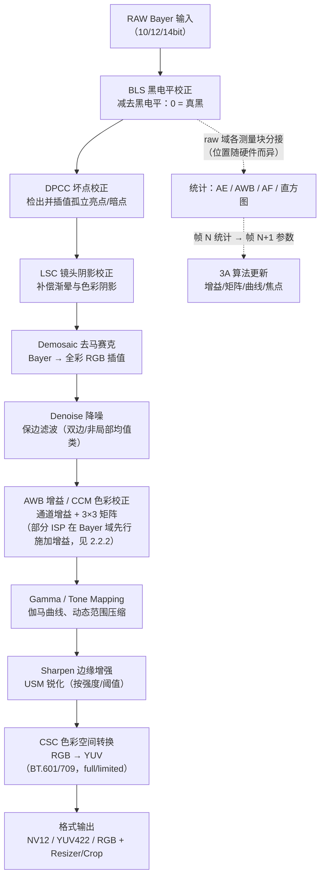

各 stage 的职责与关键调参概念（顺序为通行排布；右列给出 rkisp1 中对应硬件块的官方命名，A 层）：

| Stage | 一句职责 | 关键调参概念 | rkisp1 块（官方注释名） |
|---|---|---|---|
| 黑电平校正 | 减去 sensor 黑电平底偏，使"0"代表真黑，否则暗部发灰、噪声模型失准 | 固定值 vs 光学黑区自动实测（第 1 章 `sensor.opticalBlackRegions`）；per-CFA 通道独立 | `BLS`（Black Level Subtraction）：支持固定值或测量窗口自动模式 |
| 坏点校正 | 检出与邻域严重不符的孤立亮点/暗点并插值替换 | 阈值族（绝对差/梯度/排序邻差）、G 通道与 R/B 通道分开配 | `DPCC`（Defect Pixel Cluster Detection）：多方法集、G/RB 独立阈值 |
| 镜头阴影校正 | 补偿镜头渐晕（亮度衰减）与色彩阴影（color shading，边缘偏色） | 中心到边缘的增益表、按色温分套（2.6 节 tuning 实例） | `LSC`（Lens Shade Control）：4 通道 17×17 采样表 + x/y 尺寸/梯度表 |
| 白平衡增益 | 按通道乘增益，把中性色拉平（通行排布与 CCM 同列于去马赛克后的 RGB 域；rkisp1 等硬件实际在 Bayer 域、去马赛克前施加，见 2.2.2） | 通道增益比、与 AWB 统计闭环（2.3） | `AWB_GAIN`（Auto White Balance Gain）：10bit，`out = (gain×in + 128) >> 8` |
| 去马赛克 | 从单通道 Bayer 插值出全彩 RGB；双线性插值最简单，高质量方案利用色差恒定假设（R-G/B-G 平滑）沿梯度方向插值以减少拉链伪影与彩边 | 纹理/平坦区检测阈值、边缘自适应开关 | `BDM`（Bayer Demosaic）：`demosaic_th` 纹理检测阈值 |
| 降噪 | 去除随增益增大的噪声；双域（空域滤波如双边滤波、非局部均值类）保边降噪，raw 域降噪可利用 `noiseProfile` 噪声模型 | 强度-亮度曲线、色度/亮度分离强度、与锐化的互斥权衡 | `FLT`（Filter）：模糊因子 fac_bl0/bl1 与锐化因子 fac_sh0/sh1 同块；`DPF`（去噪预滤波，demosaic 前，NLF 17 系数 + 空域 6 系数） |
| 白平衡/CCM | 把"sensor 原生色域"变换到目标色域：CCM 3×3 矩阵校正通道串扰与光源偏色 | 按光源/色温多套矩阵、饱和度与色相保持（色彩保真 vs 讨喜风格） | `CTK`（Cross Talk）：3×3 系数 11bit 定点（4 整数位 + 7 小数位）+ 偏移 |
| Gamma/ToneMapping | 线性亮度映射到显示域；同时承担动态范围压缩（tone curve，HDR 场景） | 曲线节点数/形状、log vs 等距采样、与 WDR 曲线关系 | `GOC`（Gamma Out Curve）：17/34 点曲线，LOGARITHMIC/EQUIDISTANT 采样；`WDR`：32 区间 tone curve |
| 锐化 | 增强边缘对比，抵消降噪/去马赛克/OIS 残余的模糊 | 强度、阈值（强边缘少锐化防振铃）、与降噪强度联动 | `FLT` 的 fac_sh0/fac_sh1、thresh_sh0/thresh_sh1 |
| 色彩/对比调整 | YUV 域亮度/饱和度/色相/对比度快速调整 | 对比度、饱和度、色相角度 | `CPROC`（Color Processing）：contrast/brightness/sat/hue |
| 色彩空间转换 | RGB→YUV 矩阵（BT.601/709）与量化范围（full/limited） | 色彩空间标准、range 通告一致性 | rkisp1 经 `rkisp1_isp:2` pad 的 CSC API 设置，limited 为默认（A 层，rkisp1.html） |
| 缩放/格式输出 | Resizer/Crop 与打包输出（NV12/NV21/YUV422/RGB 等） | 缩放质量、crop 与数字变焦/EIS 坐标系（第 1 章 1.5.4） | `rkisp1_resizer_mainpath/selfpath` + capture 节点 |

### 2.2.2 顺序差异：通行排布 ≠ 硬件现实（A 层证据）

rkisp1 UAPI 的模块位序（`RKISP1_CIF_ISP_MODULE_*`，bit 0→17）为：DPCC→BLS→SDG（Sensor De-gamma）→HST（直方图统计配置）→LSC→AWB_GAIN→FLT→BDM→CTK→GOC→CPROC→AFC（AF 统计配置）→AWB（AWB 统计配置）→IE（Image Effects）→AEC（AE 统计配置）→WDR→DPF→DPF_STRENGTH。可见两点与通行排布不同：**AWB 增益施加在去马赛克之前**（Bayer 域），**DPF 是去马赛克前的去噪预滤波**（A 层，rkisp1-config.h）。这正是 2.1.2 节"RAW→YUV 各处理块可按任意顺序排列"的现实注脚——学习时记 stage 的**职责与输入输出域**（raw 域 vs RGB 域 vs YUV 域）比死记顺序更重要。

---

## 2.3 统计模块：AE / AWB / AF / LSC 统计与 ANDROID_STATISTICS_*

> 来源：A 层——[AOSP metadata_definitions.xml](https://android.googlesource.com/platform/system/media/+/refs/heads/main/camera/docs/metadata_definitions.xml)（statistics/statisticsInfo/control section，main 分支抓取解析）、仓库内文档：Android/Android_Camera_学习文档.md（1.3.3）、Android/Android_Camera_接口文档.md（第 1.6/1.7 节、第 5.3 节）、mainline rkisp1 UAPI（本文抓取解析）；"分区测光窗口、白块筛选、对比度对焦"等算法描述为 B 层

### 2.3.1 统计闭环的时序（B 层流程 + A 层锚点）

ISP 的统计块与本帧图像数据并行工作：算法拿帧 N 的统计算出参数，作用于帧 N+1，如此循环收敛。HAL 虚拟模型明确"统计基于 raw 传感器数据生成"（A 层，仓库文档 1.3.3）：

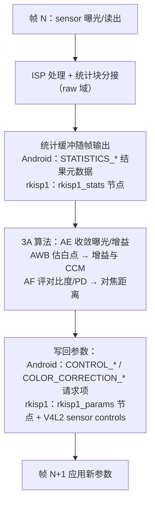

### 2.3.2 AE 统计：直方图与分区测光（A 层定义 + B 层算法）

AE 需要回答"画面有多亮、哪里亮"：**直方图**给全局亮度分布，**分区测光**（把画面切成网格、每区报平均亮度）给空间分布，3A 算法按权重（中央加权、人脸优先等）算出当前 EV 与目标 EV 的偏差，再折算为曝光时间/增益调整（B 层）。

Android 标准化的 AE 相关统计元数据（A 层，XML 定义摘译）：

| Tag | 官方定义 | 备注 |
|---|---|---|
| `statistics.histogram` | "A 3-channel histogram based on the raw sensor data"（基于 raw 传感器数据的 3 通道直方图） | 开关为请求项 `statistics.histogramMode`（boolean 型 OFF/ON）；**注意三者（histogram/histogramMode/sharpnessMapMode）在 XML 中均标 `FUTURE` tag——预留键，实际设备普遍未实现**，主流 3A 统计留在 HAL 内部（见 2.3.5 末段）；桶数由静态 `statisticsInfo.histogramBucketCount`（"Number of histogram buckets supported"）与 `maxHistogramCount` 限定 |
| `control.aeRegions` | "List of metering areas to use for auto-exposure adjustment"（用于自动曝光调整的测光区域列表） | 最多 3 个区域，坐标基于 activeArraySize；权重字段控制该区话语权 |
| `statistics.sceneFlicker` | "The camera device estimated scene illumination lighting frequency"（设备估计的场景照明频率：50Hz/60Hz/NONE） | AE 防闪烁按市电半周期对齐曝光 |

rkisp1 硬件实例（A 层，rkisp1-config.h）：AE 统计 `rkisp1_cif_isp_ae_stat` 为 `exp_mean[]` 分区均值——**V10 是 5×5=25 区、V12 是 9×9=81 区**（注释原文 "Image is divided into 5x5 blocks on V10 and 9x9 blocks on V12"），并附带 `bls_val`（黑电平实测值）；直方图 `rkisp1_cif_isp_hist_stat` 为 16（V10）/32（V12）个 bin，测量窗口切成 5×5/9×9 子窗**独立统计后加权平均**，各子窗权重可配（`rkisp1_cif_isp_hst_config`）——正是"分区测光 + 可调权重"的硬件化。

### 2.3.3 AWB 统计：白块统计（A 层定义 + B 层算法）

AWB 的经典做法是"白块统计"：把画面分成小块，筛掉过亮（接近高光溢出）、过暗、彩度过高的块，剩下的近似灰块的 R/G/B 均值即当前光源色偏，据此推通道增益与 CCM（B 层，灰世界/白块法通行描述）。Android 标准元数据（A 层）：

| Tag | 官方定义 | 备注 |
|---|---|---|
| `control.awbRegions` | "List of metering areas to use for auto-white-balance illuminant estimation"（用于自动白平衡光源估计的测光区域列表） | 同 aeRegions 的区域模型 |
| `statistics.predictedColorGains` | "The best-fit color channel gains calculated by the camera device's statistics units for the current output frame"（设备统计单元为本帧算出的最佳拟合通道增益） | `hidden` 可见性——HAL 内部 3A 使用，不进公开 API |
| `statistics.predictedColorTransform` | "The best-fit color transform matrix estimate ... for the current output frame"（本帧最佳拟合色彩变换矩阵估计） | 同上 hidden |
| `colorCorrection.gains` / `colorCorrection.transform` | 实际生效的白平衡增益/色变换矩阵（结果元数据） | A 层，仓库内文档：Android/Android_Camera_接口文档.md 第 1.7 节 |

rkisp1 硬件实例（A 层）：AWB 统计 `rkisp1_cif_isp_awb_stat` 输出测量窗口内 `cnt`（参与统计的像素数）+ `mean_y_or_g / mean_cb_or_b / mean_cr_or_r`（YCbCr 或 RGB 均值，模式可选）；其配置 `rkisp1_cif_isp_awb_meas_config` 正是白块筛选参数——`min_y/max_y`（亮度上下限）、`max_csum`（Cb+Cr 上限）、`min_c`（最小彩度）、`frames`（跨帧平均帧数 1–8）、`awb_ref_cr/awb_ref_cb`（AWB 调节目标参考值）。

### 2.3.4 AF 统计：对比度曲线与 PD 数据（A 层定义 + B 层算法）

反差对焦靠"对比度曲线"爬坡：统计块对测量窗口持续输出锐度值，算法移动镜头、找锐度峰值再回位（B 层）。Android 标准元数据（A 层）：

- `control.afRegions`："List of metering areas to use for auto-focus"（用于自动对焦的测光区域列表）；
- `statistics.sharpnessMap`："A 3-channel sharpness map, based on the raw sensor data"（基于 raw 数据的 3 通道锐度图；静态 `statisticsInfo.sharpnessMapSize`/`maxSharpnessMapValue` 描述其尺寸与量程，`statistics.sharpnessMapMode` 控制开关）——同样标 `FUTURE`（见 2.3.2）。

rkisp1 硬件实例（A 层）：AF 统计 `rkisp1_cif_isp_af_stat` 在**最多 3 个可配窗口**（`RKISP1_CIF_ISP_AFM_MAX_WINDOWS`）内各输出 `sum`（注释原文 "sharpness value"，锐度和）与 `lum`（亮度值）。

PD 数据方面：第 1 章 1.3.4 已讲明 **Android 公开元数据没有标准 PD 原始数据 tag**，PD/defocus 走厂商 vendor tag；本章补充对应关系：标准侧 AF 只输出区域与锐度类统计，PD 原始数据的搬运、标定查表全部落在厂商 ISP/统计块与 vendor tag 体系内（A 层结论 + B 层推断，同第 1 章）。

### 2.3.5 LSC 统计与其他统计（A 层）

| Tag | 官方定义（摘译） | 与 LSC 块的关系 |
|---|---|---|
| `statistics.lensShadingMap` | "The shading map is a low-resolution floating-point map that lists the coefficients used to correct for vignetting and color shading, for each Bayer color channel of RAW image data"（对每 Bayer 通道校正渐晕与色彩阴影的低分辨率浮点系数表） | RAW 后处理用它反向补偿（RAW 流旁路 ISP 时）；请求项 `statistics.lensShadingMapMode`（"Whether the camera device will output the lens shading map in output result metadata"）控制是否输出，静态 `statisticsInfo.availableLensShadingMapModes` 通告能力 |
| `statistics.lensShadingCorrectionMap` | "The shading map is a low-resolution floating-point map that lists the coefficients used to correct for vignetting, for each Bayer color channel"（仅渐晕版，byte 型） | float 版含 color shading 且面向 RAW 处理，byte 版为 Java 侧简化投影 |

其他标准化统计（A 层，XML 定义摘译）：`statistics.faces`（"List of the faces detected through camera face detection in this capture"，配 `faceDetectMode`（SIMPLE/FULL/OFF）与 `faceIds/faceLandmarks/faceRectangles/faceScores`，静态 `availableFaceDetectModes`/`maxFaceCount`）——人脸检测结果同时反哺 AE/AWB/AF 的测光偏好（B 层通行做法）；`statistics.hotPixelMap`（"List of (x, y) coordinates of hot/defective pixels on the sensor"，坏点坐标表）；`statistics.oisSamples` 等 OIS 位置采样（配 `oisDataMode`），供防抖与多帧对齐分析。

把 2.3.1–2.3.5 串起来看：Android 标准元数据对统计的**直接暴露其实很克制**——直方图与锐度图还是 FUTURE 预留键，应用可见的多是测光区域、人脸、shading 表这类"结果面"；逐帧高频的 AE/AWB/AF 原始统计主要在 HAL/ISP 内部闭环（这正是 vendor tag 与厂商私有统计模块存在的原因，机制见仓库内文档：Android/Android_Camera_接口文档.md 第 5.5 节）。rkisp1 恰好把这条内部路径以标准 V4L2 元数据节点公开了出来，因此成为学习统计设计的最佳公开样本（本段为 B 层归纳，所引定义均为 A 层）。

---

## 2.4 mainline 实例：rkisp1 驱动的管线结构

> 来源：A 层——[内核文档 rkisp1.html](https://docs.kernel.org/admin-guide/media/rkisp1.html)、mainline 驱动源码（drivers/media/platform/rockchip/rkisp1/，android.googlesource kernel/common android-mainline 分支，本文抓取解析；rkisp1-dev.c 顶部注释含框图与拓扑图，本文 Mermaid 图按其注释归纳转绘）

### 2.4.1 驱动与硬件概览（A 层）

rkisp1 驱动位于 `drivers/media/platform/rockchip/rkisp1`，"uses the Media-Controller API"，支持 Rockchip ISP1 系列：`RKISP1_V10`（rk3288/rk3399）、`RKISP1_V11`（"declared in the original vendor code, but not used"）、`RKISP1_V12`（rk3326/px30）、`RKISP1_V13`（rk1808），另有 `RKISP1_V_IMX8MP`（i.MX8MP）；版本号运行期经 `MEDIA_IOC_DEVICE_INFO` 的 `hw_revision` 读出。UAPI 头为 `include/uapi/linux/rkisp1-config.h`。

驱动文件分工（A 层，目录清单）：`rkisp1-dev.c`（平台/基础）、`rkisp1-csi.c`（CSI-2 接收）、`rkisp1-isp.c`（ISP subdev）、`rkisp1-resizer.c`（缩放）、`rkisp1-capture.c`（DMA video 节点）、**`rkisp1-params.c`（参数 video 节点）**、**`rkisp1-stats.c`（统计 video 节点）**、`rkisp1-common.h/regs.h/debug.c`。

### 2.4.2 Media 拓扑：三个 subdev + 四个 video 节点（A 层）

按 rkisp1-dev.c 顶部注释的 Media Topology 归纳转绘（原图为字符画）：

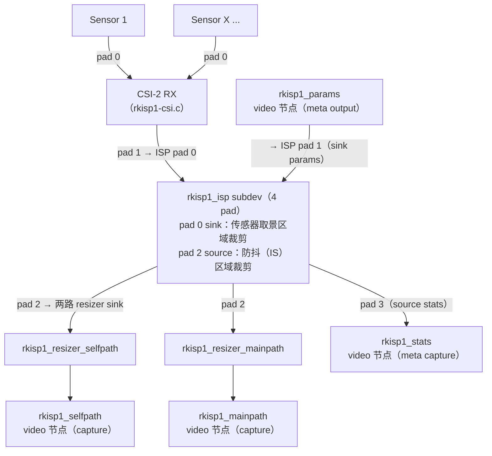

四个 video 节点的角色（A 层，rkisp1.html 原文要点）：

| 节点 | 类型 | 职责与限制 |
|---|---|---|
| `rkisp1_mainpath` | capture | 主路采集，"usually in higher resolution"；支持 Bayer 与 YUV，**不支持 RGB** |
| `rkisp1_selfpath` | capture | 自路采集（小分辨率）；支持 YUV/RGB（内部 YUV→RGB），**不能采集 Bayer** |
| `rkisp1_stats` | metadata capture | 输出 3A 统计 + 直方图；缓冲格式 `struct rkisp1_stat_buffer`，用户态设 `V4L2_META_FMT_RK_ISP1_STAT_3A` |
| `rkisp1_params` | metadata output | 接收用户态参数，流式期间逐帧应用；两种格式：固定式 `struct rkisp1_params_cfg`（`V4L2_META_FMT_RK_ISP1_PARAMS`）与可扩展式 `struct rkisp1_ext_params_cfg`（`V4L2_META_FMT_RK_ISP1_EXT_PARAMS`） |

ISP subdev 共 4 个 pad（A 层，rkisp1-common.h `enum rkisp1_isp_pad`）：0 = `SINK_VIDEO`（接 CSI-2 RX，或直连 sensor 的 parallel 接口经 MUX）、1 = `SINK_PARAMS`（params 节点流入，link 为 IMMUTABLE）、2 = `SOURCE_VIDEO`（**同时**链接到两个 resizer 的 sink，dev.c 的 createLinks 循环建立）、3 = `SOURCE_STATS`（stats 节点流出，IMMUTABLE）。两个 resizer subdev 只工作在 YUV 4:2:2（`MEDIA_BUS_FMT_YUYV8_2X8`），支持缩放（如 4:2:2→4:2:0 采样变更）与 sink pad 裁剪；Bayer 采集时 mainpath resizer 处于旁路（bypass）模式。`rkisp1_isp` 的 sink pad 0 格式必须与 sensor 匹配，否则起流报 `-EPIPE`（A 层，rkisp1.html）。

### 2.4.3 "参数 / 统计"两路 video node 的控制模型（A 层）

rkisp1 把 3A 控制面与数据面分开：图像走 mainpath/selfpath，控制面走两个元数据节点。**统计节点**的缓冲 `struct rkisp1_stat_buffer { meas_type; frame_id; params; }`：`meas_type` 按位报告本帧有效统计（`RKISP1_CIF_ISP_STAT_AWB` / `AUTOEXP` / `AFM` / `HIST`），`frame_id` 用于与图像帧同步，`params` 是 `rkisp1_cif_isp_stat` 联合体（awb/ae/af/hist 四组，见 2.3 节）。**参数节点**的固定式缓冲用三个掩码精确表达"改什么"：

```c
struct rkisp1_params_cfg {
    __u32 module_en_update;   /* 哪些模块的使能位需要更新 */
    __u32 module_ens;         /* 这些模块更新后的使能值 */
    __u32 module_cfg_update;  /* 哪些模块的配置要随本缓冲下发 */
    struct rkisp1_cif_isp_isp_meas_cfg  meas;    /* 4 组统计块配置 */
    struct rkisp1_cif_isp_isp_other_cfg others;  /* 13 组处理块配置 */
};
```

可扩展式 `struct rkisp1_ext_params_cfg { version; data_size; data[]; }` 只携带变化的块，头部与通用 V4L2 参数框架（`v4l2_isp_params_buffer`）二进制兼容（`static_assert` 保证，A 层）。18 个模块使能位（A 层，UAPI 头注释原文）：

| 位 | 宏 | 官方注释 | 位 | 宏 | 官方注释 |
|---|---|---|---|---|---|
| 0 | `MODULE_DPCC` | Defect Pixel Cluster Detection | 9 | `MODULE_GOC` | Gamma Out Curve |
| 1 | `MODULE_BLS` | Black Level Subtraction | 10 | `MODULE_CPROC` | Color Processing |
| 2 | `MODULE_SDG` | Sensor De-gamma | 11 | `MODULE_AFC` | Auto Focus Control statistics configuration |
| 3 | `MODULE_HST` | Histogram statistics configuration | 12 | `MODULE_AWB` | （AWB 测量统计配置） |
| 4 | `MODULE_LSC` | Lens Shade Control | 13 | `MODULE_IE` | （Image Effects） |
| 5 | `MODULE_AWB_GAIN` | Auto White Balance Gain | 14 | `MODULE_AEC` | （AE 测量统计配置） |
| 6 | `MODULE_FLT` | Filter | 15 | `MODULE_WDR` | （宽动态 tone curve） |
| 7 | `MODULE_BDM` | Bayer Demosaic | 16/17 | `MODULE_DPF` / `_DPF_STRENGTH` | （去噪预滤波 / 强度） |
| 8 | `MODULE_CTK` | Cross Talk | | | |

内核文档明确描述了这个闭环：应用从 `rkisp1_stats` 读统计、跑算法、再经 `rkisp1_params` 重参数化以在流式过程中改善画质；并警告若跳过这一步直接采集，"frames will probably won't have a good quality, and can even look dark and greenish"（画面质量差、甚至偏暗偏绿）——这正是 ISP 参数缺席时欠曝光 + 无白平衡的直观症状（A 层，rkisp1.html）。

### 2.4.4 mediatek ISP 驱动的 mainline 状态（如实报告）

截至本文写作时（2026-09），Android mainline 内核 `kernel/common` android-mainline 分支与 torvalds 主线的 `drivers/media/platform/mediatek/` 目录内容一致，仅含：**jpeg、mdp、mdp3、vcodec、vpu** 五个子目录（A 层，两侧 Gitiles/cgit 目录清单均已核对）——即只有 JPEG 编解码、MDP 显示数据通路与视频编解码/VPU 驱动，**没有合入任何相机 ISP（Pass 1 类）驱动**。历史脉络：MediaTek 曾以 RFC 补丁提交基于 V4L2/media-controller 的 ISP Pass 1（P1）驱动（`drivers/staging/media/mtk-isp`，2019–2020 年邮件列表评审，见 C 层出处 [LWN：media: platform: mtk-isp: Add Mediatek ISP Pass 1 driver](https://lwn.net/Articles/795631/)），该 staging 代码未转正、后续从 staging 移除；MediaTek 平台的相机 ISP 至今主要随厂商内核树（Android BSP）交付，不通过 mainline rkisp1 这类路径暴露。因此第 2.4 节以 rkisp1 为 mainline 教学样本（C 层出处仅 LWN 一条，其余为目录清单可复现事实）。

---

## 2.5 libcamera IPA 框架：算法如何以独立模块挂进 pipeline

> 来源：A 层——[libcamera IPA Writer's Guide](https://docs.libcamera.org/master/guides/ipa.html)（v0.7.2，本文抓取）、libcamera 源码（GitHub 镜像 [libcamera-org/libcamera](https://github.com/libcamera-org/libcamera) master 分支：src/ipa/libipa/algorithm.h、src/ipa/rkisp1/、src/libcamera/pipeline/，本文抓取解析）

### 2.5.1 IPA 模块与接口（A 层）

libcamera 官方指南定义："**IPA modules are Image Processing Algorithm modules. They provide functionality that the pipeline handler can use for image processing.**"（IPA 模块是图像处理算法模块，为 pipeline handler 提供图像处理能力）。IPA **接口**定义 pipeline handler 与 IPA 之间的约定：IPA 暴露的函数（Main interface，同步调用如 init/configure/start）、IPA 发出的信号（Event interface，异步回调如统计就绪），以及双方传递的自定义数据结构；接口用 mojom 描述、编译生成 C++ 头（`<libcamera/ipa/rkisp1_ipa_interface.h>` 与专用代理 `IPAProxyRkISP1` 风格的头）。pipeline handler 侧经 `PipelineHandler::createIPA<IPAProxy>()` 构造代理对象，连接 Event 信号槽后像调用普通成员函数一样调用 `init()`/`configure()`/`start()`（A 层，指南原文流程）。同一 IPA 接口可复用于不同平台：指南举例 rkisp1 pipeline handler 同时覆盖 RK3399 与 i.MX8MP——"as they integrate the same ISP"。

### 2.5.2 Algorithm 基类：算法插件的统一骨架（A 层）

`src/ipa/libipa/algorithm.h` 定义了所有具体算法继承的模板基类 `Algorithm<Module>`，五个虚函数钩子覆盖算法生命周期：

| 钩子 | 时机 | 典型工作 |
|---|---|---|
| `init(context, tuningData)` | IPA init | 从 tuning 文件（ValueNode）读本算法参数 |
| `configure(context, configInfo)` | 相机 configure | 按分辨率/格式初始化运行参数 |
| `queueRequest(context, frame, frameContext, controls)` | 每个请求入队 | 解析应用下发的控制项 |
| `prepare(context, frame, frameContext, params)` | 帧参数下发前 | **填 ISP 参数缓冲**（rkisp1 即 RkISP1Params） |
| `process(context, frame, frameContext, stats, metadata)` | 统计到达后 | **消费统计、产出结果元数据**（如算出的曝光/增益） |

算法用 `REGISTER_IPA_ALGORITHM(algorithm, name)` 静态注册进工厂（`AlgorithmFactory`）；`Module` 由 `ipa::Module<IPAContext, IPAFrameContext, ...>` 模板实例化——rkisp1 的实例化是 `ipa::Module<IPAContext, IPAFrameContext, IPACameraSensorInfo, RkISP1Params, rkisp1_stat_buffer>`（A 层，src/ipa/rkisp1/module.h），即：**算法与具体 ISP 解耦，只跟 Context（全局状态）、FrameContext（逐帧状态）、Params（参数缓冲）、Stats（统计缓冲）四个抽象打交道**。

### 2.5.3 rkisp1 IPA 的算法模块清单（A 层）

`src/ipa/rkisp1/algorithms/` 目录（GitHub master 分支清单）共 14 个算法 + 基类头：

| 文件 | 算法 | 对应 2.2 节 stage |
|---|---|---|
| `blc.cpp/.h` | BlackLevelCorrection 黑电平校正 | BLS |
| `dpcc.cpp/.h` | 坏点校正 | DPCC |
| `lsc.cpp/.h` | 镜头阴影校正 | LSC |
| `gsl.cpp/.h` | GammaSensorLinearization（Gamma Sensor Linearization control）：sensor 线性化/去 gamma 曲线 | SDG（Sensor De-gamma） |
| `awb.cpp/.h` | 自动白平衡 | AWB Gain / CCM |
| `ccm.cpp/.h` | 色彩校正矩阵 | CCM |
| `compress.cpp/.h` | Compand 压缩曲线 | Gamma/压缩 |
| `dpf.cpp/.h` | 去噪预滤波 | Denoise（DPF） |
| `filter.cpp/.h` | 滤波（降噪 + 锐化） | Denoise / Sharpen（FLT） |
| `goc.cpp/.h` | Gamma Out 曲线 | Gamma |
| `cproc.cpp/.h` | 色彩处理（对比度/饱和度/亮度） | CPROC |
| `wdr.cpp/.h` | 宽动态 tone curve | ToneMapping（WDR） |
| `agc.cpp/.h` | 自动增益/曝光控制（AE） | 3A：AE |
| `lux.cpp/.h` | 亮度（lux）估计 | 3A 辅助量 |
| `algorithm.h` | 算法基类 | —— |

IPA 模块主文件 `rkisp1.cpp` 的运行流（A 层，源码函数清单）：`init()` 解析 tuning 文件的 `algorithms` 列表并 `createAlgorithms()` 逐个实例化 → `configure()` 逐算法 configure（并禁用不支持当前 raw 格式的算法）→ `queueRequest()` 逐算法透传控制项 → **`computeParams()` 逐算法 `prepare()` 填 RkISP1Params**（即写 2.4.3 节的参数缓冲）→ **`processStats()` 逐算法 `process()` 消费 `rkisp1_stat_buffer` 并产出元数据** → `setControls()` 把 AGC 算出的曝光/增益/vblank 经 V4L2 controls 写到 sensor。libcamera 仓库 `src/libcamera/pipeline/` 现有 pipeline handler：imx8-isi、ipu3、mali-c55、rkisp1、rpi、simple、uvcvideo、vimc、virtual——同一套 IPA 框架跨 ISP 复用（A 层，目录清单）。

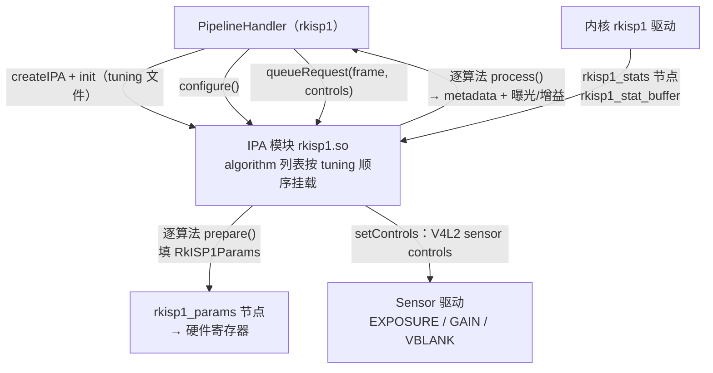

---

## 2.6 Tuning 概念：什么是 tuning、AISP 与 HAL 的关系

> 来源：B 层——tuning 的工程定义与流程为行业通行描述；A 层——libcamera tuning 文件为可验证实例；C 层——"AISP"社区用法标注出处

### 2.6.1 什么是 tuning（B 层 + A 层实例）

同一颗 ISP 换一颗 sensor（或镜头模组），图像质量就完全不同：LSC 增益表、坏点位置、白点/CCM、gamma 曲线、降噪强度、锐化策略都随光学与工艺而变。**tuning 就是针对特定 sensor+镜头+ISP 组合产出整套 ISP 参数包的工程过程**：在标准光源/图卡下逐模块标定（LSC 表、黑电平、坏点表）、按色温抓拍标定 AWB 白点与 CCM（典型按 D65/D50/A/TL84 等光源做几套，运行期插值）、再逐轮主观/客观迭代降噪-锐化-色彩风格，最终固化为一版参数，随固件/HAL 发布（B 层，通行描述）。

可验证的实例（A 层）：libcamera 的 tuning 文件按 sensor 一文件交付（`src/ipa/rkisp1/data/` 下 imx219.yaml、imx258.yaml、ov2685.yaml、ov4689.yaml、ov5640.yaml、ov5695.yaml、ov8858.yaml、uncalibrated.yaml）。以 `imx219.yaml` 为例，顶层即 `algorithms` 列表（`Agc`、`Awb`、`BlackLevelCorrection`、`LensShadingCorrection`），其中 LSC 参数按色温分组（`sets: - ct: 5800` 后跟 r/gr/gb/b 四通道 17×17 增益表）——2.6.1 所述"按色温分套 + 逐模块参数"的最小可读样本，也正是 2.5.3 节 `init(tuningData)` 读入的数据。

### 2.6.2 Tuning 与 HAL 的关系（B 层）

在 Android 生态中，tuning 产出的参数由**厂商 HAL/3A 私有层**加载（HAL 启动或 configureStreams 时初始化），运行期 3A 算法按场景（色温、亮度、人脸、变焦倍率）在参数表之间查表/插值，经标准元数据（`COLOR_CORRECTION_*`、`TONEMAP_*`、`NOISE_REDUCTION_MODE` 等）或 vendor tag 落到 ISP；应用只见标准接口， tuning 细节全部封装在 HAL 内（B 层推断，机制同第 1 章 1.3.4 与仓库内文档 Android/Android_Camera_接口文档.md 第 5.5 节 vendor tag 机制）。libcamera 把这一层显式化：tuning 文件 + IPA 算法模块 + pipeline handler 三者公开可读（A 层），是理解"厂商 HAL 里那套黑盒"的最好参考实现。

### 2.6.3 AISP 调优（B/C 层，点到为止）

近年厂商在传统 ISP 硬件之外引入学习型/AI 参与的图像处理（AI 降噪、超分辨率、夜景多帧融合、人脸/语义分区调色等），社区资料常以"AISP"（AI-ISP）统称。这类模块多运行在 ISP 邻接的 NPU/DSP 上，其标定与模型同样进入厂商 HAL/tuning 体系，但 Android 标准元数据**不暴露其内部**——应用能感知的仍只是 `NOISE_REDUCTION_MODE`、`EDGE_MODE`、scene mode 等标准键或 extensions 接口（B 层）。注意：**"AISP"一词没有统一的官方定义**，不同厂商对 AI 参与的位置（raw 域/RGB 域/YUV 域、在线推理 vs 离线生成参数）叫法不一，且各资料口径差异较大（C 层，社区用法，无单一可引出处；学习时以厂商具体技术材料为准），本文点到为止。

---


# 第 3 章 3A 算法深入（AE / AWB / AF）

本章面向学习 Android 相机底层 / ISP 的工程师，讲清 3A（AE 自动曝光 / AWB 自动白平衡 / AF 自动对焦）"统计采集 → 算法计算 → 参数下发"的闭环如何工作。第 2 章 2.3 节已讲过统计元数据与 rkisp1 统计块，2.5 节已讲过 libcamera IPA 的 Algorithm 框架；本章在此基础上往下钻一层——**直接读开源算法源码**。libcamera 的 rkisp1 / IPU3 IPA 模块是公开生态中少有的"完整可读"的 3A 参考实现，是理解厂商 HAL 里那套黑盒的最佳教材。

**材料可信度分层约定**与第 1、2 章相同：A 层 = 可验证官方资料（libcamera 开源算法源码、内核文档、AOSP API 参考与元数据、仓库内文档），B 层 = 公开通行知识（算法原理、厂商公开材料、公开学术资料），C 层 = 社区研究（须标注出处，谨慎采信）。

> 说明：libcamera rkisp1 IPA 的 `algorithms/` 目录经 GitHub API 目录清单核实**不含 AF 算法**（共 14 个算法：agc、awb、blc、ccm、compress、cproc、dpcc、dpf、filter、goc、gsl、lsc、lux、wdr），因此本章 AF 部分采用 Intel IPU3 IPA 的 `af.cpp`（A 层，同仓库 master 分支抓取）。libcamera 的控制项名与 Android 元数据一一对应（`AeEnable` ↔ `CONTROL_AE_MODE` 等，源出 Android HAL3 规范），行文时两套名字并给出。本章所引 libcamera 源码均抓取于 2026-09（GitHub 镜像 master 分支）；另核实其 `control_ids_core.yaml` 未定义任何闪光灯控制项（A 层，可复现），3.2.7 节闪光灯内容以 Android 元数据体系为准。

---

## 3.1 3A 闭环总览：统计 → 算法 → 参数 的反馈回路

> 来源：A 层——仓库内文档：Android/Android_Camera_学习文档.md（1.3.3 相机管道虚拟模型、2.1 3A 模式和状态转换）、Android/Android_Camera_接口文档.md（1.6/1.7 节、5.3 节）、libcamera 源码（src/ipa/rkisp1/rkisp1.cpp，第 2 章 2.5.3 已引）；B 层——反馈控制/闭环收敛的通行描述

### 3.1.1 反馈回路结构（B 层框架 + A 层锚点）

3A 本质是三个并联的**负反馈控制系统**：ISP 统计块测量"画面当前状态"（亮度分布、白点位置、对焦锐度），算法比较测量值与目标值的偏差，算出下一帧的传感器/ISP 参数。与一般控制系统不同，这个回路有两点特殊性（B 层）：

1. **大延迟**：从"参数生效的那帧曝光"到"该帧统计回到算法手里"至少隔 1–2 帧（曝光 + 读出 + 统计输出 + 算法处理），增益设置过激会震荡；
2. **非平稳场景**：测光对象（场景亮度）本身在变，算法必须区分"场景变了"与"我的参数还没生效"——这也是 Android 为何规定"每个请求的 3A 状态必须逐帧回报"（见 3.4.4）。

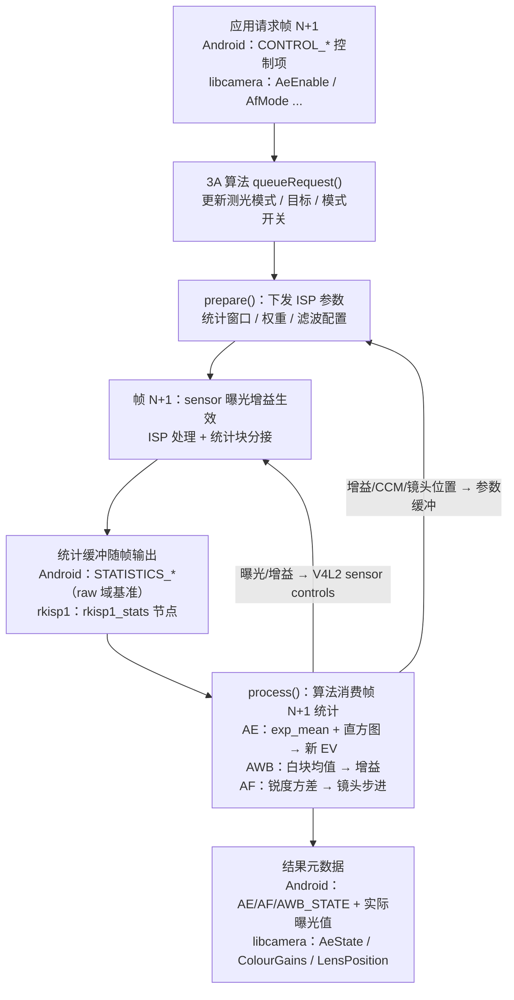

libcamera 侧这条回路的骨架在第 2 章 2.5.3 节已经给出：`rkisp1.cpp` 的 `queueRequest()` → `computeParams()`（逐算法 `prepare()`）→ 硬件 → `rkisp1_stats` → `processStats()`（逐算法 `process()`）→ `setControls()`（AE 结果经 V4L2 controls 写回 sensor）。**逐帧状态**放在 `IPAFrameContext` 里（每帧一份，统计与产生它的参数配对），**跨帧算法状态**放在 `IPAContext.activeState` 里（如 AF 的当前步进/最大方差，AE 的滤波后曝光值）——这两个 context 的分工是读任何 libcamera 算法源码前必须建立的地图（A 层，第 2 章 2.5.2/2.5.3 节）。

### 3.1.2 Android 元数据与 3A 回路的对应（A 层）

Android HAL3 的请求-结果模型天然承载这条回路（仓库内文档：Android/Android_Camera_接口文档.md 1.7 节："请求里能设置的所有 Key 都能在结果里查到最终生效值"）。三段对应关系（A 层定义，详见 3.5 节语义表）：

| 回路段 | Android 控制面（请求） | Android 观测面（结果） | libcamera 对应 |
|---|---|---|---|
| 算法配置 | `CONTROL_AE_MODE` / `AE_REGIONS` / `AF_MODE` / `AWB_MODE` / `AE_TARGET_FPS_RANGE` 等 | —— | `AeEnable` / `AeMeteringMode` / `AfMode` / `AwbMode` 等（control_ids_core.yaml） |
| 参数生效 | `SENSOR_EXPOSURE_TIME` / `SENSOR_SENSITIVITY` / `LENS_FOCUS_DISTANCE` / `COLOR_CORRECTION_GAINS` | ——（HAL 内部写入 sensor/ISP） | `ExposureTime` / `AnalogueGain` / `LensPosition` / `ColourGains` |
| 统计观测 | —— | `STATISTICS_*`（直方图/锐度图为 FUTURE 预留键，见 2.3.5） | `AeState` / `AwbLocked` / `AfState` / `Lux` / `FocusFoM` 等结果元数据 |

注意一个容易误解的点：Android 标准元数据**并不逐帧公开 AE/AWB/AF 的原始统计**（直方图、锐度图是 FUTURE 键，2.3.5 节），应用看到的是 3A 的"状态面"（STATE 枚举）与"结果面"（实际曝光值、增益、白平衡矩阵）。原始统计主要在 HAL/ISP 内部闭环——vendor tag 体系（仓库内文档：Android/Android_Camera_接口文档.md 5.5 节）正是为这类私有数据流存在。而 rkisp1/libcamera 把这条内部路径以 `rkisp1_stats` 节点 + IPA 算法完整公开，这就是本章能"读源码学 3A"的前提（B 层归纳，所引定义均为 A 层）。

---

## 3.2 AE 深入：测光、目标亮度、收敛与曝光表

> 来源：A 层——libcamera 源码（GitHub 镜像 master 分支，本文抓取解析）：src/ipa/rkisp1/algorithms/agc.cpp、src/ipa/libipa/agc_mean_luminance.cpp、src/ipa/libipa/exposure_mode_helper.cpp、src/ipa/libipa/histogram.cpp、src/libcamera/control_ids_core.yaml；B 层——测光/收敛/防闪烁原理为通行描述；仓库内文档：Android/Android_Camera_学习文档.md（2.1.5 AE 模式与状态）

rkisp1 的 AE 算法类名是 **Agc**（"AGC/AEC mean-based control algorithm"，agc.cpp 文件头注释）。核心计算已抽取到 libipa 公共基类 `AgcMeanLuminance`（rkisp1 的 `Agc` 成员 `agc_` 是其上的 `AgcAlgorithm` 包装，rkisp1/agc.h），所以 3.2.2–3.2.4 的逻辑对所有使用该基类的平台通用。

### 3.2.1 测光：分区均值 + 直方图（A 层实现 + B 层原理）

AE 要回答"画面有多亮、哪里亮"。rkisp1 硬件给两份统计（A 层，rkisp1-config.h，第 2 章 2.3.2 节）：**分区亮度均值** `exp_mean[]`（V10 5×5=25 区 / V12 9×9=81 区）与**直方图** `hist_bins`（16/32 bin，5×5/9×9 子窗独立统计后加权平均）。libcamera 在其上做了三件事（A 层，agc.cpp）：

- **测光权重表**：`Agc::parseMeteringModes()` 从 tuning 文件读 `AeMeteringMode` 字典（如 `MeteringCentreWeighted` / `MeteringSpot` / `MeteringMatrix`），每种模式是长度 = 分区数的权重向量（V10 25 个、V12 81 个）；`prepare()` 时按当前 `AeMeteringMode` 把权重写入 `hstConfig->hist_weight`。tuning 缺失时默认 Matrix 全 1（源码："defaulting to matrix"）。控制项枚举 `AeMeteringMode`（CentreWeighted/Spot/Matrix/Custom）由 tuning 实际提供的模式动态生成（`context.ctrlMap[&controls::AeMeteringMode]`）。
- **直方图测窗与预分频**：AE 测量窗口 `measureWindow` 默认覆盖整幅输出；`computeHistogramPredivider()` 按 `ceil(sqrt(width × height × 通道数 / 65536))` 计算预分频值（clamp 到 3–127）——因为硬件每个 bin 计数器只有 16 bit，全图像素 ×3 通道会溢出，预分频按 x/y 方向等比跳采样。直方图选 **RGB_COMBINED 模式**，源码注释解释得很清楚：Y 模式取自 ISP 输出端（gamma 与 WDR 之后，算法难做），RGB 模式取在 CCM（xtalk）之后、与 gamma/WDR 解耦，"在测试中提供了更好的算法稳定性"。
- **直方图小数位**：`hist_bins` 低 4 位是小数（`(x) { return x >> 4; }` 变换丢弃），喂给 libipa 的 `Histogram` 类。

libipa `Histogram`（histogram.cpp）是约束计算的基础设施：以**累积频率表**存储，`quantile(q)` 二分查找分位点，`interQuantileMean(lo, hi)` 计算"两个分位点之间像素的均值"——3.2.3 的约束钳位就靠它。

### 3.2.2 目标亮度与约束系统（A 层）

`AgcMeanLuminance` 类文档把算法概括为"把归一化平均亮度推向目标"的**两段式过程**：第一段对全图均值求初始增益，第二段用直方图约束钳位增益，最后按曝光表把曝光值拆分为时长与增益（A 层，agc_mean_luminance.cpp 类文档原文要点）。

**目标亮度**不是常数，而是随照度变化的 PWL 曲线（B 层通行做法：人眼暗处相对灵敏度不同，暗场景目标亮度可下调）：

- tuning 键 `relativeLuminanceTarget`（lux → 目标亮度 PWL）；缺失时用默认 **0.16**——源码注释："这个值应选得使相机对着灰卡时，成图亮度看起来'正常'"（kDefaultRelativeLuminanceTarget = 0.16，即标准 18% 灰的邻居）；
- 目标上限 kMaxRelativeLuminanceTarget = **0.95**：目标过高会追求饱和，"无法正常调节"（源码原话）；
- EV 补偿直接乘在目标上：`effectiveYTarget()` 返回 `min(luminanceTarget(lux) × exposureCompensation, 0.95)`。libcamera 的 `ExposureValue` 控制项定义为 log2 语义（EV=1 即 2 倍曝光，control_ids_core.yaml 原文）；
- lux 来自 Lux 算法（rkisp1 algorithms/lux.cpp，第 2 章清单），无测量时回退 kDefaultLuxLevel = 500 并告警（源码同时提醒："Lux 算法必须排在 Agc 之前"）。

**约束系统**（AeConstraintMode）：控制项枚举 `ConstraintNormal` / `ConstraintHighlight` / `ConstraintShadows`（control_ids_core.yaml 官方定义：Highlight 模式"调整曝光以避免最亮部分过曝，代价是其他部分欠曝"，Shadows 反之）。tuning 中每个模式由若干约束描述，每个约束是三元组 `{bound: lower/upper, qLo, qHi, yTarget}`——语义是"直方图 [qLo, qHi] 分位区间的均值必须 ≥/≤ yTarget(lux)"。tuning 缺失时有一个内置默认约束（源码注释：集中化之前 IPU3/RkISP1 算法本来就遵守它）：**lower、qLo=0.98、qHi=1.0、yTarget=0.5——"强迫直方图最亮 2% 的均值至少 0.5"**，即高光不过暗。

### 3.2.3 收敛策略：迭代求初始增益 → 约束钳位 → 指数滤波（A 层实现，B 层归类）

`calculateNewEv()` 的完整流程（A 层，函数名均为 agc_mean_luminance.cpp 实名）：

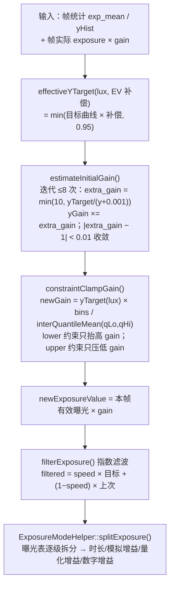

三个值得注意的实现细节：

- **迭代求增益而非一步比例控制**（B 层归类）：因为高光饱和后"乘增益"与"加亮度"不再是线性关系——`AgcTraits::estimateLuminance(gain)`（rkisp1/agc.cpp 匿名命名空间类）对每个分区先做 `min(expMean × gain, 255)` 再加权平均，模拟"调增益后饱和像素不再变亮"。所以循环最多 8 次、每步增益限幅 10 倍、`|extra_gain − 1| < 0.01` 才收敛。这是**带饱和修正的比例收敛**，比朴素"目标/实测 × 旧曝光"更稳（前半句 A 层实现，后半句为通行结论）。
- **约束钳位**：`constraintClampGain()` 对每个约束算 `newGain = yTarget(lux) × bins / interQuantileMean(qLo, qHi)`（"把该分位区间拉到 yTarget 所需的增益"），lower 约束只允许**抬高**增益、upper 约束只允许**压低**增益——初始增益经所有约束后单调修正。
- **指数滤波限速**（B 层归类：一阶低通）：`filterExposure()` 中 speed = 0.2（每次只走 20%）；启动前 kNumStartupFrames = **10** 帧 speed = 1.0（冷启动全速收敛，源码注释："防止大而突兀的逐帧曝光变化"）；当滤波输出距目标 ±20% 以内时 speed = sqrt(0.2) ≈ 0.45（"接近结果时加速，避免多次微调"）。滤波的是**曝光值**（EV 域），拆分后才落到时长/增益。

### 3.2.4 曝光表（exposure table）：时长/增益的拆分策略（A 层）

收敛得到"需要的总曝光值"后，`ExposureModeHelper::splitExposure()` 负责拆成曝光时间与增益。tuning 的 `AeExposureMode` 字典按模式给出 **(曝光时间, 增益) 阶梯数组**（源码文档示例：`exposureTime: [100, 10000, 30000, 60000, 120000]`，`gain: [2.0, 4.0, 6.0, 8.0, 10.0]`），控制项枚举 `ExposureNormal` / `ExposureShort`（"只允许短曝光时间"）/ `ExposureLong`（"允许长曝光时间"）。`splitExposure()` 的阶梯逻辑（A 层，源码文档原文要点）：

1. 增益从 1.0 起；对第 k 级，先看 `stageTime[k] × 上一级增益` 是否够——够则**固定该增益、尽量压曝光时间**；
2. 不够再看 `stageTime[k] × stageGain[k]`——够则**固定该曝光时间、调增益**；仍不够进入下一级；
3. 所有级都不够 → 兜底：先最大化曝光时间、再模拟增益、最后数字增益；
4. tuning 无阶梯（空 stages）时退化为"先把曝光时间拉满再碰增益"（源码："simply driving the exposure time as high as possible before touching gain"）。

两个工程细节：**量化增益**——`clampExposureTime()` 把时长按 sensor 行时长取整（`floor(t/lineDuration) × lineDuration`），损失的比例记为 `quantizationGain` 由数字侧补回；`clampGain()` 经 `CameraSensorHelper::quantizeGain()` 按 sensor 寄存器档位取整。源码特别说明 quantization gain **不并入**数字增益上报（"要精确施加给定曝光，量化增益与数字增益都要应用"，rkisp1 agc.cpp 的 `process()` 把它并入增益时也注明"不含应向用户上报的 HDR 增益"）。

### 3.2.5 flicker 防护（B 层原理 + A 层接口）

市电驱动的光源（白炽/荧光/部分 LED 调光）亮度以**市电频率两倍**波动（50Hz 市电 → 100Hz 亮度波动；60Hz → 120Hz）。曝光时间若不是该波动周期的整数倍，不同行/帧接收的光能不同，成图出现**带状明暗（banding）**，视频里则表现为逐帧闪烁。防闪烁的经典做法就是**把曝光时间钳到波动周期（市电半周期）的整数倍**（B 层，第 1 章 1.2.3 卷帘与 banding 的呼应）。

- libcamera（A 层，control_ids_core.yaml）：`AeFlickerMode` 三态——`FlickerOff` / `FlickerManual`（配合 `AeFlickerPeriod`，微秒；"取消 50Hz 市电闪烁应设 10000 即 100Hz，60Hz 市电设 8333 即 120Hz"）/ `FlickerAuto`（"自动测定最可能的闪烁周期并规避"）；结果元数据 `AeFlickerDetected` 报告检测到的周期（0 = 无闪烁）。
- Android（A 层，CaptureRequest 官方参考）：`CONTROL_AE_ANTIBANDING_MODE` 枚举 `OFF` / `50HZ` / `60HZ` / `AUTO`，官方定义点明其目的——消除由电源频率亮度波动造成的带状伪影（摘译）；请求项 `statistics.sceneFlicker`（第 2 章 2.3.2）由设备报告估计的照明频率，供应用在 antibanding AUTO 失效时自行决策。

### 3.2.6 AE 与帧率、ISO 的权衡（B 层 + A 层接口）

曝光值 = 时间 × 增益，拆分方式就是一组工程权衡：

| 权衡 | 倾向曝光时间 | 倾向增益 |
|---|---|---|
| 帧率 | 长曝光直接压低帧率（帧时长 ≥ 曝光时间） | 增益不影响帧率 |
| 运动模糊 | 拖影随时间增大 | 不引入模糊 |
| 噪声 | 快门越高（时间短）光子越少，但放大前信噪比不变 | 增益放大读出噪声（第 1 章 1.2.2：应先用满模拟增益再数字增益） |
| 频闪 | 长曝光时间易于对齐半周期倍数 | 无帮助 |

曝光表（3.2.4）正是这套权衡的**可调参编码**——ExposureModeHelper 类文档原话："这个方法让用户在'曝光良好的图像'与'可接受的帧率'之间取得平衡"（A 层）。Android 侧的标准接口是请求项 `CONTROL_AE_TARGET_FPS_RANGE`：官方定义为"自动曝光例程为维持良好曝光可调整采集帧率的范围"（摘译），且"只约束 AE 算法，不约束手动设置的 `sensor.exposureTime` 与 `sensor.frameDuration`"（A 层，[CaptureRequest API 参考](https://developer.android.google.cn/reference/android/hardware/camera2/CaptureRequest)）；libcamera 对应概念是 `FrameDurationLimits`（经 `AgcMeanLuminance::setLimits()` 进入 `ExposureModeHelper` 的 min/max 限制）。ISO 权衡则落在 `sensor.info.maxAnalogSensitivity`（第 1 章 1.2.2）与曝光表的增益档位上。

### 3.2.7 闪光灯：AE 闭环的联动子系统（A 层接口 + B 层原理）

> 来源：A 层——[CaptureRequest / CaptureResult 官方参考](https://developer.android.google.cn/reference/android/hardware/camera2/CaptureRequest)（SDK sources android-36 Javadoc，本文摘译）、[AOSP metadata_definitions.xml](https://android.googlesource.com/platform/system/media/+/refs/heads/main/camera/docs/metadata_definitions.xml)（aeMode / aePrecaptureTrigger 条目，本文抓取）；B 层——闪光与环境曝光合成的通行描述；A 层对照——libcamera `control_ids_core.yaml` 经抓取核实**未定义任何闪光灯控制项**（2026-09，可复现）

3A 的文献与开源样本常把第四个参与方略过：**闪光灯**。它不是独立的自动算法，而是 AE 闭环上的一个联动子系统——AE 负责决策"要不要闪、闪多强"，precapture 序列负责在正式拍照前把决策做准。

**AE 模式的三个闪光变体**（A 层，metadata_definitions.xml 摘译）：

| `CONTROL_AE_MODE` 值 | 官方定义（摘译） |
|---|---|
| `ON_AUTO_FLASH` | "与 ON 相同，此外相机设备还控制闪光单元，在低照度条件下出光" |
| `ON_ALWAYS_FLASH` | "与 ON 相同，此外相机设备还控制闪光单元，静拍时总是出光" |
| `ON_AUTO_FLASH_REDEYE` | "与 ON_AUTO_FLASH 相同，但带自动红眼消除"；"若设备判定必要，红眼消除预闪会在 precapture 序列中出光" |

**"要不要闪"的判定落点**是 `CONTROL_AE_STATE`：官方状态转移表明确——AE 扫描或 precapture 序列完成后，"已收敛但**无闪光会太暗**"（"Converged but too dark w/o flash"）即进入 `FLASH_REQUIRED`，场景变亮后经新扫描回到 `CONVERGED`（A 层，CaptureResult 参考）。应用据此可在零快门延迟队列里预判"这一帧需不需要闪光"。

**precapture 序列**（`CONTROL_AE_PRECAPTURE_TRIGGER`）的官方语义（A 层，CaptureRequest 参考）：

- **目的**："在启动高质量静拍之前触发……以做出最终测光决策；闪光使能时，还会**出预闪脉冲以估计场景亮度与正式拍摄所需的闪光功率**"——序列本身就是 AE 为闪光曝光做的标定阶段；
- **序列中闪光使能的三种情况**：`AE_MODE=ON_ALWAYS_FLASH`；`ON_AUTO_FLASH` 且场景"无闪光过暗"；`AE_MODE=ON` 且 `flash.mode=TORCH/SINGLE`；
- **使用规则**：`START` 只在单个请求中设置，应用**须等序列完成**（`AE_STATE` 离开 `PRECAPTURE`）再提交静拍；序列完成后设备"可能在内部锁定 AE，以精确曝光随后的静拍"（`captureIntent=STILL_CAPTURE`）——若应用最终不拍照，需用 `AE_LOCK=true→false` 或 `CANCEL`（API 23+）解锁，否则 AE 可能停在锁定态不恢复扫描；
- **LEGACY 设备**不支持该触发：拍摄高分辨率 JPEG 时框架自动代触发 precapture（含预闪）；
- **与 `AF_TRIGGER` 并发**：允许同请求下发，设备按最优顺序处理（可能推迟处理后到的触发）。

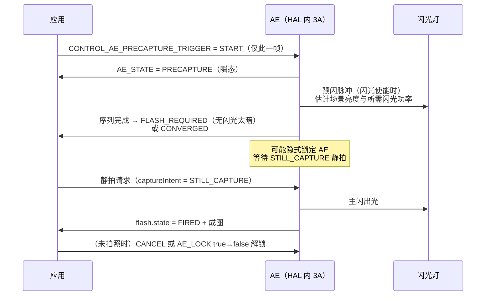

**执行侧元数据**（A 层，CaptureRequest/CaptureResult 参考；`firingPower/firingTime` 存在于 AOSP 元数据定义但未进入公开 Java/NDK API——SDK sources 与 NDK 头文件核实均无，属 HAL 层条目）：

| Key | 方向 | 语义（摘译） |
|---|---|---|
| `flash.mode` | 请求 | `OFF`（本次不出光）/ `SINGLE`（**无视 AE 结论**出光，官方提醒"应配合 precapture 序列使用，否则图像可能曝光错误"）/ `TORCH`（持续点亮，供预览/对焦辅助/录像）。仅在 `AE_MODE=ON/OFF` 时生效，AE 的闪光变体会覆盖它 |
| `flash.state` | 结果 | `UNAVAILABLE` / `CHARGING`（充电中不可出光）/ `READY` / `FIRED`（本次已出光）/ `PARTIAL`（部分出光）；无闪光设备恒为 UNAVAILABLE；LEGACY 设备仅 `TORCH` 与 `ON_ALWAYS_FLASH` 恒报 `FIRED` |
| `flash.firingPower` / `flash.firingTime` | 非公开 | 闪光出光功率（0 = 未出光）与出光时刻（相机时间戳域），供上层对齐闪光事件与曝光窗口（键存在性 A 层可复现；通行语义为 B 层描述） |

对照开源参考实现：libcamera 的核心控制清单（`control_ids_core.yaml`）没有任何闪光灯/手电筒控制项（A 层，2026-09 抓取核实）——预闪标定、功率决策、红眼消除这条成熟链条是厂商 HAL 的私有资产，学习时以官方元数据语义 + 手上平台实现为准（B 层收束）。

---

## 3.3 AWB 深入：灰世界、白块统计与增益计算

> 来源：A 层——libcamera 源码（GitHub 镜像 master 分支，本文抓取解析）：src/ipa/rkisp1/algorithms/awb.cpp、src/ipa/libipa/awb.cpp、awb.h、awb_grey.cpp、colours.cpp、control_ids_core.yaml；B 层——灰世界假设、色温（Planckian 轨迹）与 McCamy 公式为公开色彩科学知识；仓库内文档：Android/Android_Camera_学习文档.md（2.1.6 AWB 模式与状态）

libcamera 的 AWB 被拆成三层（A 层）：平台层 `rkisp1/algorithms/awb.cpp`（硬件统计 + 域还原）→ 公共调度层 `libipa/awb.cpp` 的 `AwbAlgorithmBase`（模式/手动控制/平滑）→ 具体算法层 `libipa/awb_grey.cpp`（GreyWorld）与 `awb_bayes.cpp`（Bayes）。tuning 键 `algorithm: grey|bayes` 选择实现，缺省 grey（awb.cpp 源码："No AWB algorithm specified, using grey world"）。本节先以 GreyWorld 为主线，3.3.5 节再以同样深度展开 Bayes 实现。

### 3.3.1 灰世界假设与白块筛选（B 层原理 + A 层硬件参数）

**灰世界假设**：一般场景中物体的反射率平均接近中性灰，因此整幅图的 R、G、B 均值应大致相等；若实测 R/G 均值比 ≠ 1，则把该比值视为光源色偏，反向施加通道增益（如 `gain.r = G均值/R均值`）。它的**局限**同样著名：大面积单色场景（绿草地、蓝天、夕阳）的均值本身不是灰色，灰世界会"纠正"出灾难性偏色；因此工程上从不裸用全图均值，而是先筛选"可能真的是灰色的像素"（B 层，通行描述）。

**白块统计**（第 2 章 2.3.3 节的硬件化）：rkisp1 AWB 统计块按阈值筛掉过亮（高光溢出）、过暗（噪声主导）、彩度过高（真正彩色物体）的像素，只对剩下的近似灰块累加均值。libcamera rkisp1 awb.cpp 的实测配置（A 层，`prepare()` 函数）：

- 测量窗口：居中矩形，宽高各 **3/4**（`configure()`：`h_offs = w/8`，`h_size = 3w/4`）；
- **YCbCr 模式**（默认）：`min_y = 16`、`max_y = 250`（亮度窗）、`min_c = 16`、`max_csum = 250`（彩度上限）、参考白 `awb_ref_cb/cr = 128`；源码注释明确"可接受亮度为 [16, 250] 区间、彩度以 Cb+Cr 总和上限 250 约束"；
- **RGB 模式**：三个阈值（`awb_ref_cr` / `min_y` / `awb_ref_cb`）全部设 250 作各通道上限（源码注释：RGB 模式下这些字段充当最大值阈值）；
- 统计 `cnt == 0`（没有像素通过筛选）时直接放弃本帧（`process()` 的 "AWB statistics are empty"），`frames` 跨帧平均设为 0（即单帧）。

### 3.3.2 rkisp1 awb.cpp 的实现要点：统计域还原（A 层）

硬件给出的均值是**处理过的**：先施加了白平衡增益、又过了 CCM。若直接拿它算增益，反馈回路会把增益重复叠加。`calculateRgbMeans()` 因此做了两步逆变换（A 层，函数实名，注释原文）：

1. **YCbCr → RGB**：硬件定点公式按 limited-range BT.601（Q1.6 精度）计算（源码列出系数：`Y = 16 + 0.25R + 0.5G + 0.1094B` 等），算法侧用其逆矩阵转换；因硬件舍入可能得到负均值，`max(0.0)` 钳位；
2. **除以 CCM 逆矩阵、再除以本帧增益**：`rgbMeans = ccm⁻¹ × rgbMeans` 之后 `rgbMeans /= frameContext.awb.gains.max(0.01)`——"ISP 在施加增益与 CCM **之后**计算 AWB 均值，我们要还原施加前的 raw 均值"（源码注释转述）。除零保护取 0.01。

还原出的 RGB 均值封装为 `RkISP1AwbStats`（实现 libipa 的 `AwbStats` 接口），预计算 `rg = R/G`、`bg = B/G`，并提供 `computeColourError(gains) = (gain.r×rg − 1)² + (gain.b×bg − 1)²`——"非灰度"（non-greyness）平方误差，即"施加该增益后场景离灰世界多远"，注释说明它对应贝叶斯估计中的对数似然项。`valid()` 要求均值 > 2.0（"AWB 无法在更低信号下工作"）。

### 3.3.3 libipa AwbGrey：增益计算、色温估计与平滑（A 层）

`AwbGrey::calculateAwb()` 是灰世界增益的最小实现（A 层，awb_grey.cpp）：

```
result.gains.r() = means.g() / max(means.r(), 1.0);   // 除零保护
result.gains.g() = 1.0;                               // 绿通道锚定
result.gains.b() = means.g() / max(means.b(), 1.0);
result.colourTemperature = estimateCCT(means);        // 色温只是估计输出
```

`estimateCCT()`（colours.cpp）演示色温的工程估计：RGB 先乘矩阵转到 CIE XYZ、归一化得 xy 色度坐标，再用**麦克亚当（McCamy）三次多项式近似** `CCT = 449n³ + 3525n² + 6823.3n + 5520.33`（其中 `n = (x − 0.3320)/(0.1858 − y)`）。McCamy 公式是公开色彩科学中对普朗克轨迹窄区间的通行近似（B 层，源码注释引用 Color temperature 近似条目）。注意在 GreyWorld 里色温**只用于元数据报告，不参与增益计算**（源码："The colour temperature is not taken into account when calculating the gains"）。

公共调度层 `AwbAlgorithmBase`（libipa/awb.cpp）补齐工程闭环（A 层）：

- **增益钳位与平滑**：`process()` 把结果 clamp 到 `[gainMin_, gainMax_]`（来自平台量化位宽/能力），然后做 `speed = 0.2` 的指数平滑——`gains = 新值×0.2 + 旧值×0.8`（源码："Smooth color gains adjustments"），色温同样平滑。这与 AE 的 `filterExposure()` 同型（B 层归类：一阶低通，防白平衡逐帧跳变）。
- **模式与手动控制**：`queueRequest()` 消费 `AwbEnable` / `AwbMode` / `ColourGains` / `ColourTemperature`。`AwbEnable=false` 后 `ColourGains`（R/B 增益对）或 `ColourTemperature`（经 `gainsFromColourTemperature()` 反查增益）生效；`AwbMode` 的每个枚举在 tuning 中是 `{lo, hi}` 色温搜索范围（源码文档示例：`AwbAuto: lo 2500 hi 8000`），**但源码注明 AwbModes 仅被 Bayes 实现使用**，GreyWorld 固定使用 `AwbGreyMode {0,0}`（源码："AwbGrey does not support modes"）。
- **色温→增益曲线**：`AwbGrey::init()` 从 tuning 读 `colourGains`（`ct → gains` 插值表，`Interpolator`），即第 2 章 2.6 节 tuning 概念中的"白点按色温分套 + 运行期插值"的最小实例；曲线缺失时手动色温不可用（源码告警："manual colour temperature will not work properly"）。

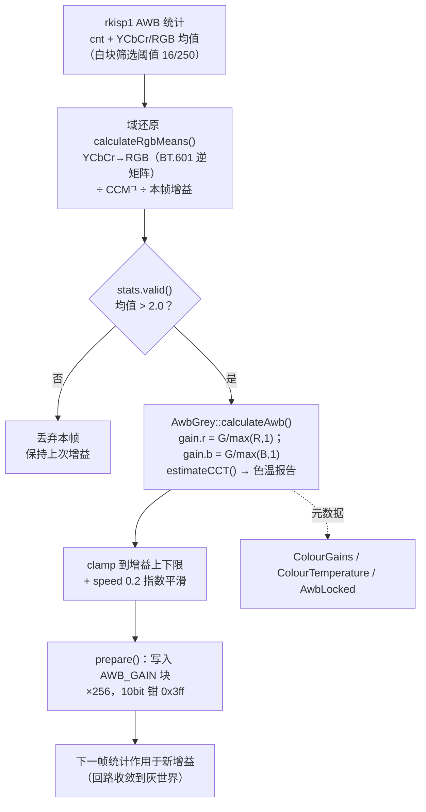

### 3.3.4 色温曲线与预设模式（B 层理论 + A 层对照）

色温（CCT）描述与给定光源色度最接近的黑体辐射体温度（开尔文）：烛光 ~1900K、白炽灯 ~2700K、日光 ~5500–6500K、阴天 ~6500–7500K、蓝天阴影 ~7500K 以上——这些正是 Android `CONTROL_AWB_MODE` 预设枚举的标定锚点（仓库内文档：Android/Android_Camera_学习文档.md 2.1.6：`INCANDESCENT` 约 2700K、`FLUORESCENT` 约 5000K、`DAYLIGHT` 约 5500K、`CLOUDY_DAYLIGHT` 约 6500K、`SHADE` 约 7500K、`TWILIGHT` 约 15000K）。tuning 中的 `colourGains` 曲线即"沿色温轴采样的白点标定表"：产线在若干标准光源下标出白点增益，运行期按估计色温插值——这是所有商用 AWB 共用的骨架，区别只在"白点估计"与"增益合成"的精细度（B 层，通行描述）。

作为对照：libcamera tuning 文件里 `src/ipa/rkisp1/data/imx219.yaml` 的 `Awb:` 段是**空的**（本文抓取核实）——即 imx219 直接运行"无 tuning 的 GreyWorld 默认行为"；而 Bayes 实现用贝叶斯推断把"灰世界证据"与"色温曲线先验"加权融合，属于灰世界局限的通行改进方向，其完整实现在 3.3.5 节逐函数展开（B 层通行描述）。

### 3.3.5 AWB Bayes：色温轴上的贝叶斯估计（A 层）

> 来源：A 层——libcamera 源码（GitHub 镜像 master 分支，2026-09 抓取解析）：src/ipa/libipa/awb_bayes.cpp、src/ipa/libipa/awb.cpp（公共调度层，3.3.3 已引）；B 层——"目标函数 = 对数似然"与普朗克轨迹两侧偏移的通行解释

3.3.3 的 GreyWorld 把色温当"附赠报告"；Bayes 把色温变成**决策变量**。`AwbBayes` 类文档开宗明义（A 层，原文摘译）："贝叶斯 AWB 在估计中引入**基于 lux 的光源可能性**——例如画面很亮时，可以假设在户外，优先考虑 6500K 附近的色温"；并强调"没有先验时搜索本身效果已经很好"。

**tuning 输入**（A 层，init()/readPriors()）：

- `colourGains`（与 3.3.3 同键）：`ct → [gain_r, gain_b]` 插值表（绿通道锚 1.0）。Bayes 从它构建两条**逆增益曲线** `ctR_`（ct→1/g_r）与 `ctB_`（ct→1/g_b）及其反函数——搜索在逆增益域进行，最终增益由取倒数得到；
- `priors`：每组先验绑定一个 `lux`（不可重复），内含平行的 `ct` / `probability` 数组构成 ct→probability 的 Pwl 曲线；"先验概率必须大于 1e-6"；tuning 未提供 priors 时 init 返回 -EINVAL（Bayes 必须有先验表，无默认）。

**计算流程**（A 层，函数实名）：

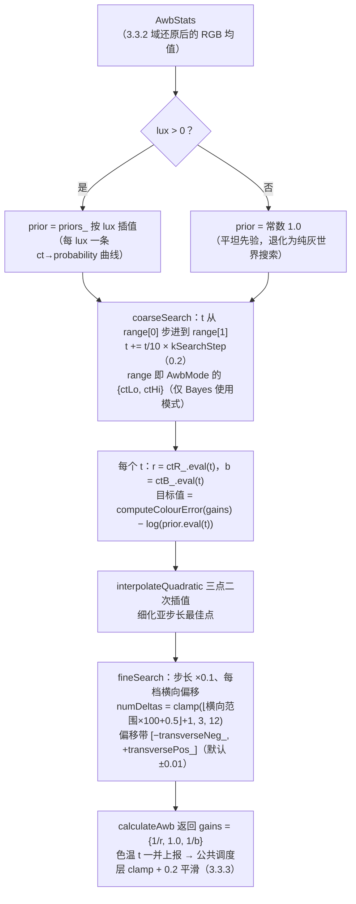

三个实现要点：

- **目标函数的含义**（表达式 A 层，解释 B 层）：`computeColourError(gains)` 正是 3.3.2 的"非灰度"平方误差——施加候选增益后场景偏离灰世界的程度；`− log(prior)` 是对数先验。两者相加取最小 = 最大化"灰世界似然 × 光源先验"，即最大后验（MAP）估计在色温一维轴上的实现；
- **横向偏移搜索**是 Bayes 的独门细节：真实光源色度并不严格落在普朗克轨迹（CCT 轴）上，fineSearch 的 transverse 方向取 CT 曲线切向的单位正交向量，`transversePos_` 官方注释为"偏离 CT 曲线向'更紫'"、`transverseNeg_` 为"向'更绿'"（默认各 0.01）——允许最终白点在轨迹两侧的窄带内游走（A 层注释；背景为 B 层色彩科学：荧光灯偏绿、部分 LED 偏紫红，不在黑体轨迹上）；
- **诚实边界**：源码 todo 区如实列出继承自 Raspberry Pi 原版**未实现**的部分——`min_pixels`（有效区域最小像素占比）、`min_g`（G 最小值）、`min_regions`（最少有效区域数）、`deltaLimit`（颜色误差钳位）、`bias_proportion`/`bias_ct`（搜索偏置）、`sensitivityR/B`（传感器响应比校正）。即**像素级白块质量筛选不在此算法内**，仍依赖 3.3.1 的硬件统计阈值；另注意 `gainsFromColourTemperature()` 纯查表无统计参与（手动色温路径，源码注明 Raspberry Pi 原版在白点倒数域插值而本版改在增益域）。

与 GreyWorld 的对照（A 层实现归纳）：

| 维度 | AwbGrey（3.3.3） | AwbBayes（本节） |
|---|---|---|
| 决策变量 | 直接算通道增益 | 色温 t（经 ctR_/ctB_ 曲线映射回增益） |
| 先验 | 无 | lux → ct 概率表（tuning priors） |
| 搜索 | 一步比值 | 色温范围粗搜 + 轨迹横向带细搜 |
| 色温的角色 | 只用于元数据报告 | 决策变量 + 报告 |
| AwbMode 模式 | 固定 {0,0}（源码注明不支持） | {ctLo, ctHi} 即搜索范围 |

对 3.6 节"厂商 AWB = 多白点证据融合 + 色温曲线先验"而言，AwbBayes 就是这句话的**最小可读样本**：证据 = 灰世界误差，先验 = 按照度挑选的色温分布，融合 = 对数域相加取最小。厂商实现把"证据"换成多区域/多光源统计、把"先验"做得更细，骨架不变（B 层归纳）。

---

## 3.4 AF 深入：反差对焦、PDAF 算法侧与 AF 状态机

> 来源：A 层——libcamera 源码（GitHub 镜像 master 分支，本文抓取解析）：src/ipa/ipu3/algorithms/af.cpp（rkisp1 算法目录经 GitHub API 清单核实无 AF 算法）、control_ids_core.yaml；仓库内文档：Android/Android_Camera_学习文档.md（2.1.3/2.1.4 AF 模式与状态转换表）；B 层——反差对焦与 PDAF 算法通行描述（像素原理见第 1 章 1.3 节）

### 3.4.1 反差对焦与锐度度量（B 层原理 + A 层硬件）

反差对焦（contrast AF / CDAF）依据一个观察：**清晰图像的局部对比度高于模糊图像**（af.cpp 类注释原话："for a clear image, it has a relatively higher contrast than a blurred one"）。算法沿镜头行程逐点测量"对焦品质函数"（FoM，figure of merit——方差、梯度能量、拉普拉斯能量等，属 B 层通行术语），FoM–镜头位置曲线在对焦点附近呈单峰，找峰即对焦。

IPU3 的 AF 硬件统计（A 层，af.cpp 与其引用的 ipu3 UAPI）：可配置 **AF 网格**（宽 16–32 块、高 16–24 块，每块 2^4×2^3 像素起），libcamera 的 `Af::configure()` 用最小网格 16×16 并**居中放置在 BDS 输出上**（源码："Position the AF grid in the center of the BDS output"）；每块输出**两路滤波值 y1/y2**——`afFilterConfigDefault` 配置两组 7 抽头系数（y1 粗评、y2 细评，源码注释："Y1 and Y2 filters ... to support coarse (Y1) and fine (Y2) calculations of the contrast"）。这组常数的出处源码注释如实交代：取自 ChromiumOS Intel Camera HAL 与 ia_imaging 库（af.cpp 顶部引用 chromium.googlesource.com 链接，A 层）。

### 3.4.2 两段扫描算法：粗扫 + 细扫（A 层）

IPU3 `Af::process()` 每帧执行 `afEstimateVariance()`：对整格 y 值表求均值再求方差（FoM = 方差），然后按稳定性分流（A 层，函数实名）：

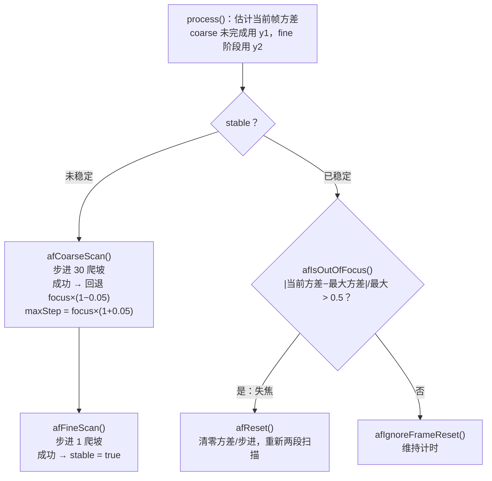

核心爬坡 `afScan(min_step)` 的判据（A 层，源码原式）：

- 若 `(currentVariance − maxVariance) ≥ −(maxVariance × 0.1)`：视为**上升或持平**（10% 容差吸收统计抖动）→ 记录 `bestFocus_ = focus_`，`focus_ += min_step`，更新 `maxVariance`；
- 否则为**负导数**——"方差开始下降，说明上一步刚越过峰值"（源码注释）→ 回移到 `bestFocus_` 并返回成功。

两段参数与保护机制（均为 af.cpp 顶部常量，A 层）：`kMaxFocusSteps = 1023`（VCM 行程上限，源码 `\todo should be obtained from the VCM driver`——即该实现目前把步进直接当马达驱动值）、粗扫步长 `kCoarseSearchStep = 30`、细扫步长 `kFineSearchStep = 1`、细扫范围 `kFineRange = 0.05`（在粗扫峰值 ±5% 内细找）、失焦判据 `kMaxChange = 0.5`、**扫描启动后忽略 kIgnoreFrame = 10 帧**（`afNeedIgnoreFrame()`——等镜头机械到位与统计流水线排空，B 层注解）。爬坡思想的出处源码注释直接引用 Hill Climbing Algorithm（Wikipedia 词条，A 层源码注释原文）。注意这个实现是**纯反差 AF**：PD 数据未参与（ipu3 平台的 PD 支持不在本算法内，B 层观察）。

### 3.4.3 PDAF 算法侧：从 PD 数据到镜头步进（B 层为主）

第 1 章 1.3 节已讲 PD 像素与数据通路；本节补算法侧的通行流程（B 层，公开架构资料与行业通行描述）：

1. **PD 统计提取**：ISP（或 sensor 内建）对成对 PD 信号做预处理（黑电平/shading/增益一致性校正——色彩阴影会使左右 PD 产生系统性偏移，第 1 章 1.3.4），再按窗口做互相关，得相位差与**置信度**；
2. **散焦估计（defocus）**：相位差经模组标定查表换算为 defocus 值（镜头行程单位）；低置信度窗口（低照度、低纹理、大面积运动）被剔除或降权，多窗口按置信度/测光权重融合出单一散焦估计；
3. **镜头步进融合**：目标镜头位置 = 当前位置 + defocus 换算步数，VCM 一步到位（或分两步大步+小步）；随后用 CDAF FoM 做确认/微调——PDAF 负责"方向与距离"，CDAF 负责"最后一微米"与无 PD 场景兜底。这与 3.4.2 的纯爬山形成互补：PDAF 把 O(行程/步长) 次试探压缩为 1–2 次，代价是依赖标定与 PD 信号质量（B 层）。

工程现实（呼应第 1 章 1.3.4，A 层结论）：Android 标准元数据没有 PD 原始数据 tag，PD/defocus 数据流与算法全部落在厂商 ISP 与 vendor tag 体系内；公开代码库里能读到的 PDAF 算法侧实现极少（各家旗舰 PDAF 调优属核心竞争力）。社区对 PDAF 工作方式的了解多来自拆解与逆向分析二手资料（C 层，如 GCam/HDR+ 移植社区对多摄与对焦行为的经验性记录，出处：[GCam 移植社区站 celsoazevedo.com](https://www.celsoazevedo.com/files/android/google-camera/)，谨慎采信）。

### 3.4.4 AF 状态机（A 层，引仓库内文档）

Android 在元数据层面标准化了 AF 的"决策状态面"，算法内部怎么爬山由 HAL 自定（仓库内文档：Android/Android_Camera_学习文档.md 2.1.1："HAL 实现负责控制 3A 模式设置和状态转换的 3A 算法"）。**AF 模式**（`CONTROL_AF_MODE`）六种：`OFF`（应用直接控镜头）、`AUTO`/`MACRO`（单次扫描，触发驱动）、`CONTINUOUS_VIDEO`/`CONTINUOUS_PICTURE`（连续对焦，前者平顺后者快切）、`EDOF`（无扫描）；**状态**（`CONTROL_AF_STATE`）七种：`INACTIVE`、`PASSIVE_SCAN`、`PASSIVE_FOCUSED`、`PASSIVE_UNFOCUSED`、`ACTIVE_SCAN`、`FOCUSED_LOCKED`、`NOT_FOCUSED_LOCKED`；触发 `CONTROL_AF_TRIGGER`：`IDLE`/`START`/`CANCEL`。按仓库文档 2.1.4 节 AF 状态转换表（节选）转绘：

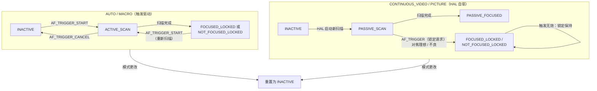

配套的镜头状态在 `LENS_STATE`（`STATIONARY`/`MOVING`）与 `LENS_FOCUS_DISTANCE`（屈光度）上报（仓库内文档：Android/Android_Camera_接口文档.md 1.7 节）。libcamera 的对应控制集（A 层，control_ids_core.yaml，源自同一 Android 规范传统）：`AfMode`（Manual/Auto/Continuous）、`AfTrigger`（Start/Cancel）、`AfState`（Idle/Scanning/Focused/Failed）、外加 Android 之外的控制：`AfRange`（Normal/Macro/Full）、`AfSpeed`、`AfMetering`/`AfWindows`（多对焦窗，多窗时"典型实现为每窗找最优焦距，最后选离相机最近的那个"——源码文档原话）、连续模式专用的 `AfPause`（Immediate/Deferred/Resume）与 `AfPauseState`、`LensPosition`（屈光度，默认值建议为超焦距）。对照可发现：Android 的 `PASSIVE_*` 前缀对应 libcamera Continuous 模式的自驱扫描，`ACTIVE_SCAN` 对应 Auto 模式的触发扫描——两套状态机同构（前半句 A 层定义对照，后半句为归纳）。

---

## 3.5 Android 3A 控制接口回顾

> 来源：A 层——仓库内文档：Android/Android_Camera_学习文档.md（2.1 3A 模式和状态转换、1.3.5 3A 控件与管道交互）、Android/Android_Camera_接口文档.md（1.6/1.7 节、5.3 节）、[CaptureRequest / CaptureResult API 参考](https://developer.android.google.cn/reference/android/hardware/camera2/CaptureRequest)（本文抓取）；B 层——控制项到 ISP 统计/算法参数的映射推断

### 3.5.1 AE 控制项与状态（A 层）

| Key | 类型 | 语义（官方定义要点） |
|---|---|---|
| `CONTROL_AE_MODE` | enum | `OFF`（手动曝光三件套前提，需 `MANUAL_SENSOR` 能力）/ `ON` / `ON_AUTO_FLASH` / `ON_ALWAYS_FLASH` / `ON_AUTO_FLASH_REDEYE` / `ON_LOW_LIGHT_BOOST_BRIGHTNESS_PRIORITY`（弱光增强，帧率须 ≥10fps）（仓库内文档：学习文档 2.1.5） |
| `CONTROL_AE_LOCK` | bool | "将 AE 锁定在最近一次计算值上"；官方给出的手动切换流程：先 `AE_LOCK=true`，等结果中 `AE_STATE=LOCKED`，再把锁定值复制进手动参数（[CaptureRequest 参考](https://developer.android.google.cn/reference/android/hardware/camera2/CaptureRequest)） |
| `CONTROL_AE_PRECAPTURE_TRIGGER` | enum | `IDLE`/`START`：拍照前预拍序列（如闪光预闪测光）触发，对应 `AE_STATE=PRECAPTURE`（仓库内文档：学习文档 2.1.5/2.1.7） |
| `CONTROL_AE_TARGET_FPS_RANGE` | int32×2 | "AE 例程为维持良好曝光可调整采集帧率的范围"；只约束 AE，不约束手动 `sensor.exposureTime/frameDuration`（A 层，API 参考） |
| `CONTROL_AE_REGIONS` | 区域数组 | "用于自动曝光调整的测光区域列表"，最多 3 个，坐标基于 activeArraySize，权重 0–1000（A 层，API 参考 + 第 2 章 2.3.2） |
| `CONTROL_AE_EXPOSURE_COMPENSATION` | int | EV 步数补偿，范围查 `CONTROL_AE_COMPENSATION_RANGE`（仓库内文档：接口文档 1.6） |
| `CONTROL_AE_ANTIBANDING_MODE` | enum | `OFF`/`50HZ`/`60HZ`/`AUTO`：3.2.5 节防闪烁的标准开关（A 层，API 参考） |
| `CONTROL_AE_STATE`（结果） | enum | `INACTIVE`/`SEARCHING`/`CONVERGED`/`LOCKED`/`FLASH_REQUIRED`/`PRECAPTURE`（仓库内文档：学习文档 2.1.5） |

### 3.5.2 AWB 控制项与状态（A 层）

| Key | 语义 |
|---|---|
| `CONTROL_AWB_MODE` | `OFF` + `AUTO` + 七个色温预设（`INCANDESCENT` ~2700K … `SHADE` ~7500K，见 3.3.4）（仓库内文档：学习文档 2.1.6） |
| `CONTROL_AWB_LOCK` | 冻结当前白平衡估计；状态机与 AE 同构（`AWB_STATE`：INACTIVE/SEARCHING/CONVERGED/LOCKED）（仓库内文档：学习文档 2.1.7） |
| `CONTROL_AWB_REGIONS` | "用于自动白平衡光源估计的测光区域列表"（第 2 章 2.3.3） |
| `COLOR_CORRECTION_GAINS` / `COLOR_CORRECTION_TRANSFORM`（结果） | AWB 计算结果的实际落地：通道增益 + 3×3 矩阵（仓库内文档：接口文档 1.7；libcamera 对应 `ColourGains` / `ColourCorrectionMatrix`） |

### 3.5.3 AF 控制项与状态（A 层）

`CONTROL_AF_MODE` / `CONTROL_AF_TRIGGER` / `CONTROL_AF_STATE` / `CONTROL_AF_REGIONS` / `LENS_FOCUS_DISTANCE` / `LENS_STATE` 的语义见 3.4.4 节，不再重复。

### 3.5.4 从控制项到 ISP 统计与算法参数（B 层映射 + A 层实例）

一帧请求里的 3A 控制项，在 HAL 内部翻译为三类动作（B 层推断，各厂商实现不同；右列给 libcamera rkisp1 实例）：

| 控制项 | 翻译为 | libcamera rkisp1 实例（A 层） |
|---|---|---|
| `AE_REGIONS` / `AWB_REGIONS` / `AF_REGIONS` | 统计块测量窗口/子窗权重重配 | AWB 测窗固定中心 3/4（awb.cpp `configure()`）；**注意**：rkisp1 Agc 与 ipu3 Af 目前都不解析区域类控制——af.cpp 留有 `\todo Set the ROI based on any input controls`（如实说明：测光区域在开源实现中尚未闭环，属已知 TODO） |
| `AE_METERING` 类偏好（libcamera `AeMeteringMode`） | 直方图子窗权重表 | agc.cpp `prepare()` 写 `hist_weight` |
| `AE_MODE=OFF` + 手动三件套 | 直写 sensor controls | rkisp1.cpp `setControls()` 同路径；`ExposureTimeMode/AnalogueGainMode=Manual` 跳过算法 |
| `AE_LOCK` / `AWB_LOCK` | 冻结算法输出（保持滤波器状态） | libcamera：AE 冻结的等价操作是把 `ExposureTimeMode`/`AnalogueGainMode` 切到 Manual（libipa/agc.cpp `AgcAlgorithm::queueRequest()` 消费，A 层）；AWB 冻结的等价操作是 `AwbEnable=false`（`AwbLocked` 只作结果报告） |
| `AE_TARGET_FPS_RANGE` | 约束曝光分配上限 | `AgcMeanLuminance::setLimits()` → `ExposureModeHelper`（3.2.4） |
| `AF_TRIGGER` | 启动/取消一次扫描 | ipu3 af.cpp 未消费 `AfTrigger` 控制（该算法为连续自驱 + 失焦重扫，A 层源码如实观察） |
| `AF_MODE=OFF` + `LENS_FOCUS_DISTANCE` | 直写镜头马达 | libcamera `LensPosition`（屈光度） |

另一个横切项是 `CONTROL_CAPTURE_INTENT`：官方语义为"向相机设备 3A 例程提供信息……帮助决定最优 3A 策略"（A 层，[CaptureRequest 参考](https://developer.android.google.cn/reference/android/hardware/camera2/CaptureRequest)）——预览/录像/拍照/ZSL 各模板预置不同 intent（仓库内文档：接口文档 1.4 节 Template 一览），3A 据此调收敛速度与偏好（如录像避免激进曝光跳变，B 层通行做法）。

### 3.5.5 多摄场景下的 3A：同步元数据与变焦切换（A 层 + B 层）

> 来源：A 层——[CameraCharacteristics / CaptureRequest 官方参考](https://developer.android.google.cn/reference/android/hardware/camera2/CameraCharacteristics)（SDK sources android-36 Javadoc 摘译）、[AOSP 多摄像头支持文档](https://source.android.google.cn/docs/core/camera/multi-camera?hl=zh-cn)（本文抓取）；仓库内文档：Android/Android_Camera_学习文档.md 第 7.1 节（逻辑多摄像头概念）；B 层——跨相机 3A 一致性的通行描述

逻辑多摄像头（学习文档 7.1：多个物理相机挂在同一个 `CameraDevice` 下）把 3A 从"单回路"变成"多回路协同"：变焦跨越物理相机切换点时，AE/AWB/AF 要从一颗 sensor 的参数连续过渡到另一颗。Android 标准化的只有**能力通告与坐标语义**，协同算法本身在 HAL 内。

**物理相机时间戳同步能力**：静态元数据 `logicalMultiCamera.sensorSyncType`（A 层，官方定义摘译）：

| 值 | 官方语义（摘译） |
|---|---|
| `APPROXIMATE` | 帧时间戳同步精度较低——两 sensor 通常运行在 **leader/leader** 模式，"各自使用自己的时序发生器，曝光开始之间可能存在偏移"；AOSP 文档概括为"主主模式下不执行硬件快门/曝光同步" |
| `CALIBRATED` | 帧时间戳同步精度高——通常运行在 **leader/follower** 模式，"一个 sensor 为另一个产生时序信号，使快门时刻同步"；AOSP 文档概括为"主辅模式下执行硬件快门/曝光同步" |

官方同时强调：无论哪种模式，"同一 capture request 生成的所有图像仍携带相同的时间戳"（供查帧号与 `onCaptureStarted` 回调）；该键仅在逻辑相机支持多物理相机并发流时适用。对应用的意义（B 层归纳）：双摄融合类用例（景深、双景录像、变焦中段拼接）在 `CALIBRATED` 设备上可假设两路帧近似同时曝光，`APPROXIMATE` 设备则须容忍帧间偏移——这是 1.5.3 时间戳语义在多摄下的延伸。

**一个常见误读**（A 层定义辨析）：`sync.maxLatency` 与 `sync.frameNumber` 名字里带 sync，但与多摄时间戳同步**无关**——官方定义分别是"新控制提交后、结果状态完全同步前最多经过的帧数"（枚举 `PER_FRAME_CONTROL` / `UNKNOWN`）与"该结果的全部控制与缓冲已完全对齐到的帧号"（`CONVERGING` / 非负帧号 / `UNKNOWN`，@hide）。它们描述的是**请求→结果的管线同步延迟**，不是物理相机间的时间戳对齐。

**变焦切换时框架规定的 3A 相关义务**（A 层，AOSP 多摄像头文档）：`CONTROL_ZOOM_RATIO` 变化时 HAL 必须**换算** crop 区域、AE/AWB/AF 测光区域与人脸框坐标系；若超广角固定对焦而长焦支持 AF，逻辑相机必须**模拟超广角的 AF 状态机**使应用透明；配置了 RAW 流时"不得切换到传感器尺寸不同的物理子相机"。3A 参数本身（两颗模组的曝光表、白点曲线、对焦行程）在切换瞬间的连续性无标准元数据承载——全部封装在 HAL 内部（B 层，与 3.6 节、4.2.6 节"3A 在用户态 HAL"的边界一致）。

---

## 3.6 厂商 3A 与开源 3A 的差距

> 来源：B 层——厂商 HAL/tuning 通行描述、厂商公开材料与公开学术资料（见文内标注）；A 层——Android 接口边界（仓库内文档：Android/Android_Camera_接口文档.md 5.5 节 vendor tag 机制）；C 层——社区研究（文内标注出处）

把本章读过的 libcamera 算法与商用旗舰的 3A 放在一起，差距大致在四层（B 层归纳）：

1. **算法复杂度**：开源参考实现刻意保持最小可用——单目标亮度均值 AE、GreyWorld AWB、纯反差 AF。商用 HAL 的 AE 通常叠加多区域智能测光（人脸/主体优先、场景分类）、AEB/HDR 曝光序列决策；AWB 是多白点证据融合 + 色温曲线先验（3.3.5 节的 Bayes 实现是其最小公开样本）；AF 是 CDAF+PDAF+OIS 三系统协同的调度问题。Android 只标准化接口语义（3.5 节），实现全部封装在 HAL 内——学习文档 2.1.1 的"HAL 实现负责控制 3A 算法"一句即此边界（A 层）。
2. **统计与数据流**：厂商 ISP 的统计块远比公开的 rkisp1 丰富（多区直方图阵列、场景亮度/频闪检测、PD 数据链路），并通过 vendor tag 在 HAL 内私有流转（A 层机制，接口文档 5.5 节；2.3.5 节已总结"原始统计主要在 HAL 内部闭环"）。
3. **tuning 体量**：libcamera 的 tuning 文件是"每个 sensor 一个 YAML、每算法几十个参数"的量级（第 2 章 2.6 节），厂商 tuning 是"数百参数 × 场景矩阵 × 模组个体差异"的产线工程，且常伴量产老化/温漂补偿——这部分没有公开样本，是开源与商用最实质的差距（B 层通行描述）。
4. **AI 3A 趋势**：近年厂商把学习型模型引入 3A 与其邻接环节——语义分割驱动的分区测光/白平衡（如 Qualcomm 官方对 Snapdragon 8 Gen 2 "Cognitive ISP" 语义分割实时运行的宣传，B 层，厂商公开材料）、多帧计算摄影重塑 AE 策略（Google 的 HDR+ 以欠曝光短帧 + 后期融合替代单帧长曝光决策，Hasinoff et al., "Burst photography for high dynamic range and low-light imaging on mobile cameras", SIGGRAPH Asia 2016，B 层公开学术资料）。社区围绕移植这些闭源算法的生态（GCam ports）也反向证明：相机产品力的核心在 HAL 内的 3A/后处理算法而非接口（C 层，社区现象观察，出处：GCam 移植社区站 celsoazevedo.com，谨慎采信）。对学习者而言，本章这样的开源参考实现教会的是**反馈控制的结构与工程细节**（约束、滤波、量化、状态机）；至于旗运气质，仍然只能在厂商 tuning 与私有算法的黑盒之外体会（B 层收束）。

---


# 第 4 章 平台 HAL：高通 CAMX/Chi-CDK 与 MTK mtkcam

本章面向学习 Android 相机底层 / ISP 的工程师，讲清"AOSP provider 接口之上，高通与 MTK 各自的平台 HAL 如何组织管线、3A、tuning 与扩展"。前三章的 sensor、ISP 管线与 3A 知识在这里落地为真实平台形态：第 1 章 CAMSS 内核驱动、第 2 章统计闭环与 tuning 概念、第 3 章 3A 接口语义，都是本章各层的"通用原理参照物"。

**本章材料可信度声明**（阅读前必读）：平台 HAL 的**用户态实现是闭源/半开源的**（CAMX、mtkcam 均随厂商 BSP 交付，不在 AOSP 主线），因此本章严格分层，且比前三章更克制：

| 层级 | 本章含义 | 本章中的实例 |
|---|---|---|
| A 层 | 可抓取验证的官方资料 | [Qualcomm 官方文档站（RB5 相机文档组）](https://docs.qualcomm.com/doc/80-88500-4/topic/122_Camera.html)、[CodeLinaro 官方托管的相机内核驱动](https://git.codelinaro.org/clo/la/kernel/msm-extra_group/camera-kernel)（cam_req_mgr/cam_isp/cam_icp 等目录与 UAPI 头已逐一核对）、[AOSP camera provider 与 Camera Extensions 官方文档](https://source.android.com/docs/core/camera/camerax-vendor-extensions)、[AOSP 相机调试官方文档](https://source.android.com/docs/core/camera/debugging)、[内核 CAMSS 文档](https://www.kernel.org/doc/html/latest/admin-guide/media/qcom_camss.html)（第 1 章已引）、mainline mediatek 目录清单（第 2 章已核实） |
| B 层 | 公开架构资料 | Qualcomm 官方新闻/博客（Spectra ISP、Cognitive ISP）、厂商发布会材料、行业通行结构描述（无单一 URL 可指） |
| C 层 | 社区研究 | 全部给出 URL；只采用多来源相互印证的模块名/概念，单源孤证一律不用 |

> 本章主动**不写**的内容（宁缺毋滥，读者勿自行脑补）：CAMX/mtkcam 内部具体类名、函数名、文件路径（闭源，仅社区镜像流传，无法核验）；`UsecaseQuadRT` 之类的具体 usecase 名（本文写作时未能在可验证的公开资料中确认，不采用）；mtkcam 的 Pipeline Policy/HwInfo 细节划分与"mtkcam6"目录演进（公开资料无可靠来源，见 4.3.3 的如实说明）；MTK tuning 工具名与参数文件格式（无公开文档）；CAMX 调试属性/开关的具体取值（社区口径混乱，不给出来源就不写）。凡本章给出的模块名，要么出自 A 层源码/文档，要么给出 C 层出处。

---

## 4.1 为什么会有平台 HAL

> 来源：A 层——[AOSP camera/provider README](https://android.googlesource.com/platform/hardware/interfaces/+/refs/heads/main/camera/provider/README.md)、[AOSP camera/README.md](https://android.googlesource.com/platform/hardware/interfaces/+/refs/heads/main/camera/README.md)、[AOSP 相机版本支持文档](https://source.android.com/docs/core/camera/versioning)（以上均为本文写作时抓取）；仓库内文档：Android/Android_Camera_学习文档.md（1.3 节 HAL3 管道模型）；B 层——provider 进程加载厂商 SO 的通行结构、平台 HAL 内容物归类

### 4.1.1 AOSP 留给厂商的空间（A 层边界）

第 1 章 1.5 节已讲明 HAL3 的请求-结果模型：Android 只规定**接口语义**（每个 CaptureRequest 控制什么、每个 CaptureResult 必须回报什么、统计基于 raw 生成等），不规定 ISP 内部结构、3A 算法与 tuning 数据形态（A 层，仓库内文档第 1.3.3 节与第 2 章 2.1.2 节）。AOSP 对"Camera HAL"的官方定义也点明了归属："The camera module layer implemented by SoC vendors"（由 SoC 厂商实现的相机模块层）——AOSP 相机版本支持文档原文（A 层）。这就是平台 HAL 存在的原因：**同一套 HAL3 接口语义之下，ISP 硬件、管线组织、3A 算法、tuning 数据全部是厂商私有资产**，需要一层"平台 HAL"把它们装进 Android 的进程与接口结构里。

### 4.1.2 provider 进程与厂商实现（A 层接口 + B 层结构）

Treble 之后，相机 HAL 运行在独立的 **camera provider 进程**（vendor 分区）里，与系统框架经 HIDL/AIDL binder 通信：AOSP `hardware/interfaces/camera/provider/` 下的接口版本清单为 2.4/2.5/2.6/2.7 + `aidl`（A 层，本文写作时核对目录清单）；provider README 的官方描述是："The camera.provider HAL is used by the Android camera service to discover, query, and open individual camera devices"（相机服务用它来发现、查询并打开各个相机设备），另含手电筒（torch mode）控制（A 层）。

在此接口之上，厂商如何填充是自由的。通行结构（B 层）是：

- provider 进程由厂商自己的可执行程序承载，**进程内加载厂商相机实现库（.so）**——高通平台为 CAMX/Chi-CDK 一族，MTK 平台为 mtkcam 一族；
- 厂商实现库内部完成：HAL3 会话/流管理、管线构建、逐帧请求调度、3A 算法、tuning 数据加载、vendor tag 元数据扩展；
- 库再向下驱动内核（KMD），向上通过标准 ICameraProvider/ICameraDeviceSession 回调框架。

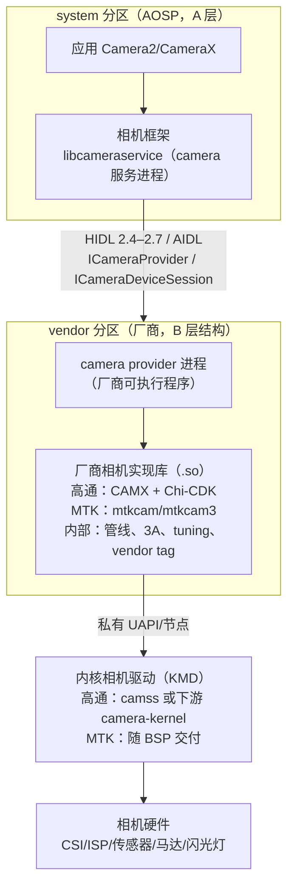

一个重要的现实（B 层）：高通官方对 CAMX 的定位在官方仓库 README 中可直接验证—— Qualcomm Linux 的 camera-service 项目自述为"loads the CamX libraries to interact with the camera hardware module"，并说明其"utilizing HAL3 API to interact with the camera backend (CamX) and camera driver for hardware configuration"（经 HAL3 API 与相机后端 CamX 及相机驱动交互）（A 层，[qualcomm/camera-service](https://github.com/qualcomm/camera-service) README，Qualcomm 官方 GitHub 组织）。即：**HAL3 之下是 CAMX，CAMX 之下是相机内核驱动**——这一句官方自述就是 4.2 节分层图的骨架。

### 4.1.3 平台 HAL 的内容物（B 层归类）

对比第 2、3 章的 rkisp1/libcamera 开源参考实现，平台 HAL 多出的"私货"大致四类（B 层通行归纳，与第 3 章 3.6 节的差距分析一致）：

1. **图/管线管理**：把 HAL3 流配置翻译成内部管线拓扑（CAMX 用 topology XML 描述 DAG，mtkcam 用 Pipeline Model，见 4.2/4.3）；
2. **3A 算法库**：第 3 章讲过商用 3A 的复杂度远超开源参考实现，算法以私有库形态链接进平台 HAL；
3. **tuning 数据体系**：产线标定 + 调优工具产出的参数包（高通 Chromatix，见 4.2.7）；
4. **厂商扩展**：vendor tag 元数据（第 1 章 1.3.4、第 2 章 2.3.5 的机制）+ 多帧计算摄影 feature + Camera Extensions 实现（见 4.2.5）。

---

## 4.2 高通 CAMX/Chi-CDK 架构

> 来源：A 层——Qualcomm 官方文档站 RB5 软件参考手册相机组（[Camera](https://docs.qualcomm.com/doc/80-88500-4/topic/122_Camera.html)、[Qualcomm Spectra 480](https://docs.qualcomm.com/doc/80-88500-4/topic/124_Qualcomm_Spectra_480.html)、[ISP tuning process](https://docs.qualcomm.com/doc/80-88500-4/topic/125_ISP_tuning_process.html)、[CHI](https://docs.qualcomm.com/doc/80-88500-4/topic/126_CHI.html)、[CHI architecture model](https://docs.qualcomm.com/doc/80-88500-4/topic/127_CHI_architecture_model.html)、[Topology graph XML](https://docs.qualcomm.com/doc/80-88500-4/topic/128_Topology_graph_XML.html)、[CamX](https://docs.qualcomm.com/doc/80-88500-4/topic/129_CamX.html)，均本文写作时抓取原文）、[CodeLinaro camera-kernel 源码树](https://git.codelinaro.org/clo/la/kernel/msm-extra_group/camera-kernel)、[内核 CAMSS 文档](https://www.kernel.org/doc/html/latest/admin-guide/media/qcom_camss.html)；C 层——[RidgeRun RB5 捕获子系统 wiki](https://developer.ridgerun.com/wiki/index.php/Qualcomm_Robotics_RB5/Capture_Subsystem/Hardware_Capture_Components)（数据通路描述，与官方文档相互印证）；B 层——用户态内部机制（Node 调度、Metadata 管理细节）为公开架构资料通行描述

### 4.2.1 官方文档里的分层：camx + chicdk（A 层）

Qualcomm 官方文档（RB5 平台软件参考手册）对组件分层的原话极少而关键（A 层）：

- "The **CamX** component contains the **camx** and **chicdk** layers. Feature2 is added in the chicdk layer."（CamX 组件包含 camx 与 chicdk 两层，Feature2 加在 chicdk 层）——[CamX](https://docs.qualcomm.com/doc/80-88500-4/topic/129_CamX.html)；
- "The camera HAL interface (**CHI**) API aims to separate the Camera2/HAL3 interface for using a camera and supplement it with a fully flexible image processing driver... a **thin HAL3 driver** converts HAL3 calls into the appropriate CHI calls. The HAL3 driver works on generating a **camera use case** that is implemented via the CHI API calls."（CHI API 旨在把"使用相机的 Camera2/HAL3 接口"与"完全灵活的图像处理驱动"分离；一个薄的 HAL3 驱动把 HAL3 调用翻译为相应的 CHI 调用，并生成经 CHI API 实现的相机用例）——[CHI](https://docs.qualcomm.com/doc/80-88500-4/topic/126_CHI.html)；
- 相机子系统组件清单（[Camera](https://docs.qualcomm.com/doc/80-88500-4/topic/122_Camera.html)）：QMMF（多媒体框架服务）、Camera adaptation layers、**Camera HAL3**、**CamX**、Codec2、VPU、"Feature-rich ISP drivers"。

据此可画出官方口径下的分层（图按官方文字归纳转绘，A 层；"Node/Topology/Usecase"术语本身来自官方 128 号文档，见 4.2.3）：

```mermaid
flowchart TD
    subgraph US["用户态（vendor 分区）"]
        APP["Camera2/HAL3 应用"] --> THIN["thin HAL3 driver<br/>（provider 内，翻译 HAL3 调用）"]
        THIN --> CHI["CHI 层（chicdk）<br/>usecase 生成 / topology 选择 / override<br/>Feature2 加在这一层（官方原文）"]
        CHI --> CORE["camx 层<br/>Node 图执行 / 管线调度 / 元数据维护<br/>（内部细节闭源，B 层）"]
        CHI -->|"CHI API：自定义节点、<br/>自定义 pipeline、3A 覆盖"| EXT["OEM 扩展模块"]
    end
    CORE -->|"私有 UAPI"| KMD["KMD：camera-kernel（见 4.2.4）"]
    KMD --> HW["Qualcomm Spectra ISP 硬件块<br/>（见 4.2.2）"]
```

注意两点（B 层说明，避免过度解读）：其一，官方文档把 CHI 表述为"camera HAL interface (CHI) API"（A 层引文），社区资料常展开为 Camera Hardware Interface（C 层，如 [知乎 camx HAL 架构笔记](https://zhuanlan.zhihu.com/p/258453407)）；其二，camx 层内部的请求调度、缓冲管理、元数据（metadata）维护细节**没有官方公开文档**，社区文章普遍以"Node 图 + Metadata 管理"描述其结构（B 层通行描述），本文不引任何内部类名。

### 4.2.2 硬件块与 Spectra 480 管线（A 层）

Qualcomm 的 ISP 硬件在官方文档中称为 **Qualcomm Spectra ISP**。RB5 平台（QRB5165，Snapdragon 865 同代）的 Spectra 480 官方架构构成（A 层，[Qualcomm Spectra 480](https://docs.qualcomm.com/doc/80-88500-4/topic/124_Qualcomm_Spectra_480.html) 原文清单）：

- **CSID**（Camera Serial Interface Decoder）：CSI 解码；
- **IFE（Image Front End）×2**：实时图像前端，官方规格"2x full IFE processing – 25 MP (4:3)"；
- **IFE_Lite ×5**：面向机器视觉的小型前端（"Mono/YUV interface for miscellaneous CV use cases"）；
- **BPS（Bayer Processing Segment）**：官方明确其定位是 **"Snapshot path only"（仅拍照路径）**，职责为"Bayer processing, for example, demosaic, PDAF pixel correction (including 2x1/2x2 OCL), lens shading correction, and so on"+"Downscaling for registration and alignment of sequential frames for multi-frame processing"（Bayer 域处理——去马赛克、PDAF 像素校正、镜头阴影校正；以及为多帧处理做逐帧下采样配准），并注明 "No HNR in BPS"；
- **IPE（Image Processing Engine）**：图像处理引擎（YUV 域后处理）；
- **VPU**（编解码）、**DPU**（显示）；
- 其他画质特性（官方规格表）：PDPC（PD 像素校正，R/B/G）、PDLib（2PD/sparse PD）、机器学习人脸检测硬件、MCTF（运动补偿时域滤波）、自适应镜头阴影校正、binning 校正、视频超分、quadCFA binning 等。

第三方 RidgeRun wiki 对同一子系统的数据通路描述与官方一致（C 层，[RidgeRun RB5 wiki](https://developer.ridgerun.com/wiki/index.php/Qualcomm_Robotics_RB5/Capture_Subsystem/Hardware_Capture_Components)）：sensor → CSID（在 IFE 内）→ IFE 输出三路——RAW 给 Hexagon DSP 的 HVX 流、RAW 直写内存、YUV420 直写内存/送 IPE；**RAW 拍照帧送 BPS → BPS 输出 YUV/ARGB/RAW 给 IPE → IPE 输出给 VPU（编码）与 DPU（显示）**。

```mermaid
flowchart TD
    SEN["Sensor<br/>MIPI CSI-2（DPHY/CPHY 1.2）"] --> CSID["CSID<br/>CSI 解码（A 层）"]
    CSID --> IFE["IFE ×2（实时前端）<br/>+ IFE_Lite ×5（CV 用）"]
    IFE -->|"YUV420 直写内存 /<br/>直送 IPE"| MEM0["内存"]
    IFE -->|"RAW 拍照帧"| BPS["BPS（仅拍照路径）<br/>demosaic / PDAF 校正 / LSC<br/>多帧下采样配准（官方原文）"]
    BPS -->|"YUV420 / ARGB14 / RAW14"| IPE["IPE<br/>YUV 域后处理"]
    IPE --> VPU["VPU 编码"]
    IPE --> DPU["DPU 显示"]
    IFE -.->|"raw 域 3A 统计<br/>（AOSP 虚拟模型：统计基于 raw）"| ST["统计 → 3A 算法（4.2.6）"]
```

对应关系（与第 2 章通用 ISP stage 对照，B 层归纳）：IFE 承担 raw 域实时处理与统计分接；BPS 承担拍照路径的 Bayer 域重处理（第 2 章 2.2 节的 demosaic/LSC 等 stage 落点）；IPE 承担 YUV 域后处理（降噪/锐化/色彩调整等 stage 落点）。块名在不同代平台沿用（社区资料中 IFE/BPS/IPE 是 CAMX 节点名的常见来源，B 层）。

### 4.2.3 UseCase → Pipeline → Node：topology XML（A 层）

CAMX 最核心的公开设计是**用 XML 描述的 DAG 拓扑**。官方 [Topology graph XML](https://docs.qualcomm.com/doc/80-88500-4/topic/128_Topology_graph_XML.html) 的完整表述（A 层，摘译/原文）：

- "The hardware and software image processing nodes are required to produce desired output, and the connections between those nodes determine how data flows through the camera subsystem. This set of nodes and connections is called a **topology**."（硬件与软件图像处理节点及其连接关系称为拓扑）；
- "A **use case** is defined by a set of targets to be processed, and a set of per-session settings... Each use case is represented by a topology... The list of all the use cases and their corresponding topologies are encoded in an **XML file**. A use case is selected during **configure_streams** based on two sections in the XML and an XSD schema... Tools are provided to package the XML files as an **offline binary** for consumption by the CHI driver."（每个 use case 由一张拓扑表示；全部 use case 及拓扑编入 XML 文件，configure_streams 时按 XML 的两个 section 选择；另有工具把 XML 打包为离线二进制供 CHI 驱动消费）；
- 官方同时给出参考文档编号：*Qualcomm Spectra ISP Camera CHI API Reference*（80-PC212-1）与 *CHI Customization Guide*（80-PN984-4）（A 层，编号为官方引用，正文未公开）。

[CHI architecture model](https://docs.qualcomm.com/doc/80-88500-4/topic/127_CHI_architecture_model.html) 补充（A 层原文要点）：CHI topology XML 是"单个 XML，集合了不同相机用例的拓扑"，在 **HAL 进程初始化时加载**；本质是"Key + Data 存储"——**数据是 DAG（拓扑），键是 per-session 设置 + 流集合**；Qualcomm 为常见用例提供默认拓扑，厂商"可编辑默认 XML 并创建包含自定义拓扑的 topology XML"，CHI API 提供显式选择自定义拓扑的接口。

```mermaid
flowchart TD
    CFG["configure_streams（HAL3）<br/>流集合 + per-session 设置"] --> KEY{"以二者为 Key<br/>查 topology XML（HAL init 时加载）"}
    KEY --> TOPO["选中一张 DAG 拓扑<br/>= UseCase → Pipeline → Node 的组装结果<br/>（A 层官方机制）"]
    TOPO --> N1["Node：IFE（实时前段）"]
    TOPO --> N2["Node：BPS（拍照 raw 域）"]
    TOPO --> N3["Node：IPE（YUV 后段）"]
    TOPO --> N4["Node：自定义节点<br/>CPU/GPU/DSP（官方 CHI node extensions）"]
    N1 --> N2 --> N3
    TOPO --> RUN["camx 层逐帧调度执行<br/>（内部机制 B 层）"]
```

**CHI 的五大可定制组件**（A 层，[CHI](https://docs.qualcomm.com/doc/80-88500-4/topic/126_CHI.html) 原文归纳）——这就是 OEM 在 CAMX 里插入自有算法的公开机制：

1. **CHI override module**：补充 Google HAL3 接口，允许"显式的图像处理管线生成、显式引擎选择、多帧控制"（供任何 HAL3 应用使用）；
2. **CHI pipeline**：可构造任意计算管线，成员可以是高通提供的"fixed function ISP (FF-ISP) blocks"，也可以是"extended nodes"；Camera2/HAL3 实现下由 XML helper 文件描述图；
3. **CHI node extensions**：为 CPU、GPU（OpenCL/OpenGL ES）、DSP 编写的自定义节点提供挂钩；"Custom nodes can specify the private vendor tags"（自定义节点可指定私有 vendor tag）；
4. **CHI stats overrides including 3A**："allow mechanisms to override any of the default stats algorithms without the need for driver changes. External stats algorithms can store private data, which is also accessible by custom nodes."（**无需改驱动即可覆盖任何默认统计算法**；外部统计算法可存私有数据供自定义节点访问）；
5. **CHI sensor XML**：让设备厂商为相机模组、image sensor、actuator（马达）、EEPROM、flash 等部件定义"参数驱动的驱动"。

### 4.2.4 内核侧：mainline camss 与下游 camera-kernel（A 层）

高通相机内核驱动有**两套形态**，第 1 章 1.4.4 已讲过第一套：

- **mainline CAMSS**（drivers/media/platform/qcom/camss，V4L2/Media Controller 标准 UAPI）：只覆盖 MSM8916/MSM8996 等旧平台，块为 CSIPHY/CSID/ISPIF/VFE，mainline 文档**不含 ICP**（A 层，[qcom_camss.html](https://www.kernel.org/doc/html/latest/admin-guide/media/qcom_camss.html) 与源码目录，第 1 章核对）——这是内核社区维护的**教学/上游样本**，不是手机平台实际使用的驱动；
- **下游 camera-kernel**（随高通 LA/BSP 交付，Qualcomm 官方 CodeLinaro 站可见）：本文写作时核对 [clo/la/kernel/msm-extra_group/camera-kernel](https://git.codelinaro.org/clo/la/kernel/msm-extra_group/camera-kernel) 源码树（A 层，目录与 UAPI 头逐一核对），结构为：

| KMD 模块（drivers/ 下目录名，A 层） | 内容（按目录清单归纳） |
|---|---|
| `cam_req_mgr` | **CRM（Camera Request Manager）**：请求跨设备调度核心；含 cam_mem_mgr（内存管理）、cam_req_mgr_dev（设备节点）等 |
| `cam_isp` | ISP 硬件管理（isp_hw_mgr、cam_ife_hw_mgr），对应实时前端 |
| `cam_icp` | **ICP 协处理器**子目录 icp_hw 下含 **a5_hw、bps_hw、ipe_hw**（A 层目录名）——即 BPS/IPE 引擎经 ICP 管理 |
| `cam_cpas` | 相机子系统资源/性能管理（camss_top、cpas_top 子目录） |
| `cam_sensor_module` | 传感器外设族：cam_actuator（马达）、cam_cci（I2C 控制接口）、cam_csiphy、cam_eeprom、cam_flash、cam_ois、cam_sensor 等 |
| `cam_cdm`、`cam_sync`、`cam_lrme`、`cam_fd`、`cam_jpeg`、`cam_cust` | CDM（命令/数据搬运）、sync（跨进程缓冲同步）、LRME、人脸检测、JPEG 等 |
| `include/uapi/media/` | UAPI 头：cam_req_mgr.h、cam_defs.h、cam_isp.h（含 ife/tfe/vfe 变体）、cam_icp.h、cam_ope.h、cam_cpas.h、cam_sensor.h、cam_sync.h 等（A 层清单） |

UAPI 的形态也验证了"CAMX 用户态 ↔ KMD"的契约（A 层，cam_defs.h/cam_req_mgr.h 原文）：设备类型枚举覆盖 `CAM_VNODE/SENSOR/IFE/ICP/LRME/JPEG/FD/CPAS/CSIPHY/ACTUATOR/CCI/FLASH/EEPROM/OIS/CUSTOM`；操作码为 `CAM_QUERY_CAP / CAM_ACQUIRE_DEV / CAM_START_DEV / CAM_STOP_DEV / CAM_CONFIG_DEV / CAM_RELEASE_DEV / CAM_FLUSH_REQ`（以及 v2 的 `CAM_ACQUIRE_HW/CAM_RELEASE_HW`）；CRM 设备节点名为 `cam-req-mgr-devnode`。**可见 KMD 的抽象不是"一个 video 节点出图"，而是"一个请求管理器 + 多个硬件域设备"**——HAL3 的逐帧请求语义在 KMD 由 CRM 统一编排（模块分工为 A 层目录/头文件事实；"CRM 编排请求"的机制描述为 B 层通行归纳）。

```mermaid
flowchart TD
    UM["CAMX 用户态（camx 层）"] -->|"UAPI：ACQUIRE/CONFIG/START/STOP/FLUSH"| CRM["cam_req_mgr（CRM）<br/>cam-req-mgr-devnode"]
    CRM --> ISP["cam_isp（isp_hw_mgr）<br/>IFE/实时前端"]
    CRM --> ICP["cam_icp（icp_hw：<br/>a5_hw / bps_hw / ipe_hw）"]
    CRM --> SENS["cam_sensor_module<br/>actuator / cci / csiphy / eeprom / flash / ois / sensor"]
    CRM --> CPAS["cam_cpas<br/>camss_top / cpas_top"]
    ISP --> HW1["IFE 硬件"]
    ICP --> HW2["ICP + BPS / IPE 引擎"]
    SENS --> HW3["Sensor / 马达 / 闪光灯 / OIS"]
```

### 4.2.5 扩展机制：CHI 扩展与 Camera Extensions（A 层）

OEM 自有 feature 对外暴露有两条公开通道，层级不同：

1. **CHI 层内部扩展**（4.2.3 的五大组件）：自定义 topology XML、自定义节点（CPU/GPU/DSP）、3A 覆盖——影响的是 HAL 内部管线（A 层机制 + B 层实现）；
2. **Camera Extensions 接口**（AOSP 官方定义）：让第三方应用用到厂商私有算法。AOSP 官方文档（[Camera extensions](https://source.android.com/docs/core/camera/camerax-vendor-extensions)，A 层）明确：设备厂商通过 **OEM vendor library** 实现 `extensions-interface`，向 Camera2 Extensions API 与 CameraX Extensions API 暴露 bokeh（虚化）、night（夜景）、HDR、face retouch（美颜）、auto 等扩展；厂商需实现 `ExtensionVersionImpl`/`InitializerImpl` 及各扩展的 Extender 类（Basic Extender 或 Advanced Extender 两种类型）；官方特别注明"the OEM vendor library runs as part of a third-party app process"（OEM 库运行在第三方应用进程内，不得要求系统权限）。

两条通道的关系（B 层归纳）：CHI 内部扩展负责"在 CAMX 管线里实现算法"，Camera Extensions 负责"把算法能力以标准接口卖给应用"——同一夜景算法往往两头都要写。这正是第 3 章 3.6 节"AI 3A/多帧计算摄影封装在 HAL 内"的接口落点。

### 4.2.6 3A 在 CAMX 中的位置（A 层接口 + B 层实现）

把第 3 章的 3A 闭环放进 CAMX 地图（分层标注）：

- **统计采集**：实时前端 IFE 在 raw 域产生 3A 统计（AOSP 虚拟模型"统计基于 raw 生成"的落地，第 2 章 2.3 节；IFE 为实时前端为 A 层官方文档）。统计经 CAMX 内部通路送到算法（内部通路 B 层）；
- **算法运行位置**：**用户态 CAMX/CHI 内**。官方证据是 CHI stats override 机制本身——"override any of the default stats algorithms without the need for driver changes"（A 层，126 号文档引文，见 4.2.3）：默认 3A 统计算法存在、且可被外部算法整体替换，外部算法还能存私有数据——这只有算法跑在用户态、与硬件驱动解耦时才可能（A 层文档 + B 层推论）；
- **算法本体**：私有算法库闭源（B 层）。Qualcomm 官方对 3A/画质能力的公开表述见其新闻与博客：如 Snapdragon 8 Gen 2 起"Cognitive ISP"宣传为"first ever AI-powered camera processor"，支持实时语义分割（人像/头发/衣服/背景分区优化）（B 层，厂商公开材料：[Snapdragon 8 Gen 2 发布新闻稿](https://www.qualcomm.com/news/releases/2022/11/snapdragon-8-gen-2-defines-a-new-standard-for-premium-smartphone)、[OnQ 博客 Meet the Snapdragon 8 Gen 2 Super Cameras](https://www.qualcomm.com/news/onq/2023/07/meet-the-snapdragon-8-gen-2-super-cameras)；本文写作时 qualcomm.com 产品页原 URL 已 404，内容以新闻稿/博客为准）；
- **参数下发**：算法输出经 CAMX 节点配置写入硬件，sensor 曝光/增益经 KMD 传感器模块下发（机制同第 3 章 3.1 图的闭环，落点换成本章各层，B 层归纳）。

### 4.2.7 Tuning：Chromatix（A 层流程 + B 层数据形态）

Qualcomm 的 ISP 调优体系官方名称是 **Chromatix**。官方 [ISP tuning process](https://docs.qualcomm.com/doc/80-88500-4/topic/125_ISP_tuning_process.html) 描述的流程（A 层，原文归纳）：

- "The camera tuning is done using an image signal processor (ISP) and an **on-device image tuning tool**"——调优用 **Qualcomm Chromatix Camera Calibration Tool**（官方名称）在设备上迭代进行；
- 流程：前提条件（建项目、把设置装入设备、抓图）→ 初始调优（多轮迭代，随时用**仿真功能**看某组参数对 raw 图的影响，逐模块定位问题）→ 图像质量评估（客观量化测量）→ "generate **binary files** that contain tuned parameters and load the settings on the device"（**生成包含调优参数的二进制文件**装载到设备）。

即高通 tuning 的交付物是 Chromatix 工程产出的**二进制参数包**（具体文件格式、模块参数明细未公开，B 层）。这印证了第 2 章 2.6 节的 tuning 概念：参数按模块组织、随模组标定、在 HAL 内加载；libcamera 的 YAML tuning 文件正是这条工程链的"开源极简版"。

---

## 4.3 MTK mtkcam 架构

> 来源：C 层——社区研究为主（多来源相互印证后才采用）：[知乎 MTK Cam3 架构学习](https://zhuanlan.zhihu.com/p/258924699)、[GitHub wjky2014/AndroidStudy：Mtk-Camera MtkCam3 架构学习](https://github.com/wjky2014/AndroidStudy/blob/master/Mtk-Camera-MtkCam3%25E6%259E%25B6%25E6%259E%2584%25E5%25AD%25A6%25E4%25B9%25A0.md)、[CSDN：Mtk Camera MtkCam3 架构学习](https://blog.csdn.net/TaylorPotter/article/details/105707181)、[CSDN：MTK camera 打开流程](https://blog.csdn.net/frank_zyp/article/details/104433977)（PipelineModel 三份独立资料口径一致）；P1 概念另有官方补丁佐证（C 层转引：[LWN：media: platform: mtk-isp: Add Mediatek ISP Pass 1 driver](https://lwn.net/Articles/795631/)，MediaTek 主线 RFC 补丁系列报道，第 2 章 2.4.4 已引）；A 层——mainline mediatek 目录无 ISP 驱动的结论（第 2 章 2.4.4，可复现）；C 层——内核模块公开镜像 [MiCode/mtkcam-kernel_device_modules](https://github.com/MiCode/mtkcam-kernel_device_modules)（小米官方 GitHub 组织镜像，目录清单本文核对）

### 4.3.1 分层与源码位置（C 层）

MTK 平台 HAL 通称 **mtkcam**。多份独立社区资料口径一致（C 层，引文见节首）：HAL3 时代的实现位于 vendor 树 `vendor/mediatek/proprietary/hardware/mtkcam3/`（旧实现为 `.../mtkcam/`），在其中实现 AOSP 的 ICameraProvider/ICameraDevice/ICameraDeviceSession 接口族——即 4.1 节"B 层通行结构"的 MTK 实例。公开资料对更细的目录/类名各家摘录不一，本文不复述（宁缺毋滥）。

```mermaid
flowchart TD
    subgraph MTKHAL["MTK 平台 HAL（vendor 分区，C 层结构）"]
        PROV["provider 实现<br/>ICameraProvider / ICameraDeviceSession（C 层）"]
        PM["Pipeline Model<br/>（见 4.3.3）"]
        NODES["管线节点族<br/>P1Node / P2 节点 / JpegNode（见 4.3.2）"]
        PROV --> PM --> NODES
    end
    FWK["AOSP 相机框架"] -->|"HIDL/AIDL provider 接口"| PROV
    NODES --> KMD["MTK 相机内核驱动<br/>（随 BSP 交付，mainline 无，A 层结论）"]
    KMD --> HW["ISP Pass 1 等硬件<br/>（概念见 4.3.2）"]
```

### 4.3.2 P1/P2：Pass 1 硬件与管线节点（C 层 + 官方补丁佐证）

"**P1（Pass 1）**"指 MTK 的 ISP 前端处理硬件——这一命名有超出社区的依据：MediaTek 向主线提交的 ISP 驱动 RFC 补丁系列标题即"Add Mediatek **ISP Pass 1** driver"（2019–2020 年 linux-media 邮件列表评审，C 层转引 [LWN 报道](https://lwn.net/Articles/795631/)；该 staging 驱动未转正，第 2 章 2.4.4 已核实 mainline 至今无 MTK 相机 ISP 驱动，A 层目录清单可复现）。社区资料对软件侧节点族的描述相互印证（C 层，三份独立资料口径一致）：

- **P1Node**：包住 ISP Pass 1 硬件的节点，负责从 sensor 接收并输出 **RAW 帧**（raw 域前段，对应第 2 章 2.2 节 raw domain 各 stage 的硬件承担者）；
- **P2 系列节点**：Pass 2 后处理概念，社区资料普遍列出 **P2CaptureNode**（拍照路径处理）与 **P2StreamingNode**（预览/录像流处理），及 **JpegNode**（主图 + 缩略图编码 JPEG）；
- 三方算法以"小节点"挂载在管线节点内（C 层，知乎/社区笔记口径）。

上述节点分工与高通 IFE/BPS/IPE 的角色划分同构（实时 raw 前段 / 拍照后处理 / 编码输出），差异在组织方式（见 4.4）。

### 4.3.3 Pipeline Model（C 层，多源印证）

mtkcam3 公开资料中被引用最多、且多份独立资料口径一致的构件是 **Pipeline Model**（C 层）：

- **open/close 阶段**：负责 sensor 的上电/下电（power on/off）；
- **config 阶段**：根据应用 `createCaptureSession` 传入的 surface 列表**推断输出配置、据此构建 pipeline**；
- 定位概括："向上暴露用于 Pipeline 创建和操作的 API，向下构建 Pipeline 并管理其生命周期"（C 层，[CSDN frank_zyp](https://blog.csdn.net/frank_zyp/article/details/104433977)）。

**如实说明**：社区资料中还常见"Pipeline Policy""HwInfo（硬件信息查询）"等更细的构件划分，以及"mtkcam6"这样的目录演进说法——这些**没有**能与 mtkcam 官方文档或多个独立来源相互印证的可靠公开出处（本文写作时检索未获），按要求**不展开、不给细节**。读者在真实源码中自会见到相应结构，届时以源码为准。

### 4.3.4 与 AOSP 的对接、内核与 tuning（C 层 + A 层结论）

- **对接**：mtkcam3 以标准 provider 接口接入 AOSP（4.3.1），扩展能力同样经 Camera Extensions OEM 库暴露（A 层机制同 4.2.5，MTK 侧实现细节无公开文档）；vendor tag 承载 MTK 私有元数据（机制同第 1 章 1.3.4，A 层机制 + C 层实例）；
- **内核**：mainline 无 MTK 相机 ISP 驱动（A 层结论，第 2 章 2.4.4）。真实的 MTK 相机 KMD 随 BSP 交付；小米在其官方 GitHub 组织公开的内核模块镜像 [MiCode/mtkcam-kernel_device_modules](https://github.com/MiCode/mtkcam-kernel_device_modules)（C 层镜像，目录清单本文核对）可见 `camsys`、`imgsys`、`imgsensor`、`cam_cal`、`mtk-aie`（AI 引擎）、`mtk-dpe`、`mtk-hcp`、`mtk-ipesys-me` 等模块目录——可与 4.3.2 的 P1 概念互为印证（模块与硬件块的对应关系无官方文档，不展开）；
- **tuning**：MTK 同样存在模组级标定与调优工程（第 2 章 2.6 节通用流程），但其工具名、参数文件格式**无公开可靠来源，本文不写**（B 层仅确认"私有 tuning 体系存在"这一通行事实）。

---

## 4.4 两平台对比

> 来源：B/C 层——公开架构资料与社区研究的通行对比归纳；每格标注层级，A 层可验证事实单独注明

| 维度 | 高通 CAMX/Chi-CDK | MTK mtkcam |
|---|---|---|
| 架构思想 | **拓扑（DAG）驱动**：usecase → topology XML 描述的 Node 图，configure_streams 时按 Key 选择拓扑（A 层官方机制，4.2.3） | **管线模型驱动**：Pipeline Model 按 app 流配置推断并构建 pipeline，节点族（P1/P2/Jpeg）串接（C 层，4.3.3/4.3.2） |
| 图描述载体 | topology XML（可编辑、可自定义，构建期可打包为离线 binary）（A 层官方） | 代码内构建 pipeline（公开资料未显示有等价 XML 描述层；不确定的不写）（C 层口径） |
| 硬件块命名 | IFE/IFE_Lite/BPS/IPE/CSID + KMD 域 SENSOR/ICP/CPAS 等（A 层，4.2.2/4.2.4） | P1（ISP Pass 1）硬件 + P2 后处理概念；内核模块 camsys/imgsys 等（C 层 + A 层镜像目录名） |
| 扩展机制 | CHI 五大可定制组件：override module、自定义 pipeline、自定义节点（CPU/GPU/DSP）、3A 覆盖、sensor XML（A 层官方，4.2.3） | 三方算法以节点形式挂载（C 层）；对外统一走 Camera Extensions OEM 库（A 层机制） |
| 对第三方应用的扩展接口 | Camera Extensions OEM vendor library（A 层 AOSP 机制） | 同左（A 层机制） |
| 3A 位置 | 用户态 CAMX/CHI；统计在 IFE（raw 域）；官方支持外部算法整体覆盖默认统计算法（A 层接口 + B 层实现闭源） | 用户态 mtkcam 内；节点挂载三方算法（C 层）；细节无公开文档 |
| Tuning 交付物 | Chromatix 调优工具 → 二进制参数包装载设备（A 层官方流程，4.2.7） | 私有 tuning 体系（存在为通行事实，B 层；工具与格式不写） |
| 内核驱动 | mainline camss（旧平台、V4L2 标准接口，教学样本）+ 下游 camera-kernel（CRM/ISP/ICP/CPAS 私有 UAPI）（A 层，4.2.4） | mainline 无 ISP 驱动（A 层结论）；KMD 随 BSP，公开镜像 MiCode/mtkcam-kernel_device_modules（C 层镜像） |
| 官方公开文档量 | 较多：docs.qualcomm.com 相机组 + 官方 GitHub（camera-service 等） | 极少：仅主线补丁系列（未合入）与零散社区资料 |

一张图总结两种"图"的差别（B/C 层归纳，节点名取自上文已标注来源）：

```mermaid
flowchart TD
    subgraph QCOM["高通：拓扑 XML 驱动的 DAG（A 层机制）"]
        direction TB
        X["topology XML<br/>（usecase → DAG，构建期打包 binary）"] --> Q1["IFE 节点"] --> Q2["BPS 节点"] --> Q3["IPE 节点"]
        X -.->|"自定义节点/3A 覆盖"| Q4["OEM 扩展"]
    end
    subgraph MTK["MTK：Pipeline Model 构建（C 层结构）"]
        direction TB
        CFG["createCaptureSession 流配置<br/>→ Pipeline Model 推断构建"] --> M1["P1Node（RAW）"] --> M2["P2Capture / P2Streaming"] --> M3["JpegNode"]
        CFG -.->|"三方算法小节点"| M4["OEM 算法挂载"]
    end
```

学习提示（B 层归纳）：两家的差异是**配置面**的差异大于**能力面**的差异——能把"usecase/流配置 → 硬件管线"这段映射放在 XML（数据驱动）还是代码（逻辑驱动），决定了 OEM 调整产品形态的成本结构；而 3A、tuning、多帧计算摄影这些核心资产在两家都是闭源黑盒。

---

## 4.5 如何学习平台 HAL

> 来源：A 层——[AOSP 相机调试官方文档](https://source.android.com/docs/core/camera/debugging)、[Camera extensions 官方文档](https://source.android.com/docs/core/camera/camerax-vendor-extensions)；C 层——logtag 与社区资源出处见文内 URL；B 层——公司环境工程习惯为通行做法

### 4.5.1 在有设备的公司环境拿到代码、找到入口（B 层 + C 层路径）

- **代码位置**：平台 HAL 不在 AOSP 树里，随厂商 BSP/SDK 交付，通常在 vendor 树：高通为 `vendor/qcom/proprietary/` 下的 `camx`、`chi-cdk` 等目录（C 层，社区镜像广泛存在此结构，如 [知乎 camx 笔记](https://zhuanlan.zhihu.com/p/258453407) 引用的 chi-cdk topology/usecase XML 路径），MTK 为 `vendor/mediatek/proprietary/hardware/mtkcam3/`（C 层，4.3.1 出处）。公司环境里向系统组/BSP 组要 **BSP 源码包或对应的 vendor 分区源码**；
- **从接口往下读**：入口固定是 provider——先读 ICameraProvider 实现（枚举相机、打开设备），再顺 ICameraDeviceSession 的 `configure_streams` / `processCaptureRequest` 往下，找到"流配置 → 内部管线构建"的翻译点（高通即 topology 选择，MTK 即 Pipeline Model 构建处）——具体类名以手中源码为准（B 层方法；各平台命名不同，本文不给未验证类名）；
- **读配置**：高通平台找 topology/usecase XML 与 sensor XML（CHI sensor XML 覆盖 sensor/actuator/EEPROM/flash 参数化驱动，A 层机制见 4.2.3），它们是理解"产品支持哪些 usecase"的地图；MTK 平台对照 Pipeline Model 的构建逻辑；
- **对照硬件文档**：读 SoC 的 ISP 硬件概述（本章 Spectra 480 官方文档即是范本），把块名（IFE/BPS/IPE 或 P1/P2）与第 2 章的 ISP stage、第 3 章的 3A 统计落点对上。

### 4.5.2 日志与调试（A 层官方命令 + C 层 logtag）

AOSP 官方文档给出了不依赖厂商资料的标准调试手段（A 层，[Camera debugging](https://source.android.com/docs/core/camera/debugging)，Android 13+）：

```bash
# 监视指定 tag 的请求/结果元数据（3a 是 android.control.* 中 AE/AF/AWB 的简写）
adb shell cmd media.camera watch start -m 3a -c com.google.android.GoogleCamera
adb shell cmd media.camera watch dump      # 输出缓存与活动客户端的监视记录
adb shell cmd media.camera watch live -n 250   # 实时预览（250ms 刷新）
# dumpsys 相机服务信息（官方文档与 watch 并列提及）
adb shell dumpsys media.camera
```

厂商侧 logtag（C 层，社区通行做法）：高通平台常以 `CAMX`/`CHI` 关键字过滤 logcat（如 [知乎 camx 笔记](https://zhuanlan.zhihu.com/p/258453407)、[CSDN Camera high level Software Architecture](https://blog.csdn.net/weixin_39732855/article/details/139448049) 等社区资料的使用习惯）；MTK 平台社区资料记录的 HAL3 日志 tag 如 `mtkcam-dev3`（C 层，[博客园：MTK 平台 Camera 基本流程与日志](https://www.cnblogs.com/york-zhou/p/18055193)）。各厂商的日志开关/级别属性名社区口径不一，本文不列具体属性，使用时以手中平台资料验证（宁缺毋滥）。

### 4.5.3 公开资源清单（全部为本文写作时核实过可访问或内容可查证的 URL）

**A 层（官方，可抓取验证）**

- Qualcomm 官方文档·RB5 相机组（CHI/topology/tuning/Spectra 480）：[Camera](https://docs.qualcomm.com/doc/80-88500-4/topic/122_Camera.html)、[124 Spectra 480](https://docs.qualcomm.com/doc/80-88500-4/topic/124_Qualcomm_Spectra_480.html)、[125 ISP tuning process](https://docs.qualcomm.com/doc/80-88500-4/topic/125_ISP_tuning_process.html)、[126 CHI](https://docs.qualcomm.com/doc/80-88500-4/topic/126_CHI.html)、[127 CHI architecture model](https://docs.qualcomm.com/doc/80-88500-4/topic/127_CHI_architecture_model.html)、[128 Topology graph XML](https://docs.qualcomm.com/doc/80-88500-4/topic/128_Topology_graph_XML.html)、[129 CamX](https://docs.qualcomm.com/doc/80-88500-4/topic/129_CamX.html)
- Qualcomm 官方 GitHub：[qualcomm/camera-service](https://github.com/qualcomm/camera-service)（CamX 作为 HAL3 后端的官方自述）
- Qualcomm 官方源码托管（CodeLinaro）：[camera-kernel 内核驱动](https://git.codelinaro.org/clo/la/kernel/msm-extra_group/camera-kernel)（cam_* 模块树与 `include/uapi/media/cam_*.h`）；站点内检索关键词 `camera-kernel`、`camera-devicetree`
- 内核文档：[qcom_camss.html](https://www.kernel.org/doc/html/latest/admin-guide/media/qcom_camss.html)（第 1 章 1.4.4 的教学样本）；mainline mediatek 目录（无 ISP 驱动，第 2 章 2.4.4）
- AOSP：[Camera extensions](https://source.android.com/docs/core/camera/camerax-vendor-extensions)、[Camera debugging](https://source.android.com/docs/core/camera/debugging)、[Camera version support](https://source.android.com/docs/core/camera/versioning)、[Camera HAL3](https://source.android.com/docs/core/camera/camera3)、[hardware/interfaces/camera/provider](https://android.googlesource.com/platform/hardware/interfaces/+/refs/heads/main/camera/provider/README.md)

**B 层（厂商公开材料）**

- [Snapdragon 8 Gen 2 发布新闻稿（Cognitive ISP / 语义分割）](https://www.qualcomm.com/news/releases/2022/11/snapdragon-8-gen-2-defines-a-new-standard-for-premium-smartphone)、[OnQ：Meet the Snapdragon 8 Gen 2 Super Cameras](https://www.qualcomm.com/news/onq/2023/07/meet-the-snapdragon-8-gen-2-super-cameras)、[Qualcomm Spectra ISP 摄影综述](https://www.qualcomm.com/snapdragon/news/How-Snapdragon-technology-is-revolutionizing-smartphone-photography-with-the-Qualcomm-Spectra-ISP)

**C 层（社区研究，多源印证）**

- CAMX：[知乎：camx HAL 架构知识点](https://zhuanlan.zhihu.com/p/258453407)、[CSDN：Camera high level Software Architecture description](https://blog.csdn.net/weixin_39732855/article/details/139448049)、[RidgeRun RB5 Capture Subsystem wiki](https://developer.ridgerun.com/wiki/index.php/Qualcomm_Robotics_RB5/Capture_Subsystem/Hardware_Capture_Components)
- mtkcam：[知乎：MTK Cam3 架构学习](https://zhuanlan.zhihu.com/p/258924699)、[GitHub：Mtk-Camera MtkCam3 架构学习笔记](https://github.com/wjky2014/AndroidStudy/blob/master/Mtk-Camera-MtkCam3%25E6%259E%25B6%25E6%259E%2584%25E5%25AD%25A6%25E4%25B9%25A0.md)、[CSDN：Mtk Camera MtkCam3 架构学习](https://blog.csdn.net/TaylorPotter/article/details/105707181)、[CSDN：MTK camera 打开流程（PipelineModel）](https://blog.csdn.net/frank_zyp/article/details/104433977)、[博客园：MTK Camera 流程与日志](https://www.cnblogs.com/york-zhou/p/18055193)、[LWN：mtk-isp Pass 1 主线补丁报道](https://lwn.net/Articles/795631/)
- 源码镜像检索（GitHub 搜索关键词）：`mtkcam`（如 [MiCode/mtkcam-kernel_device_modules](https://github.com/MiCode/mtkcam-kernel_device_modules)——小米官方组织公开的 MTK 相机内核模块镜像）、`vendor/mediatek/proprietary`、`chi-cdk`、`vendor/qcom/proprietary camx`；镜像仅供学习对照，无法保证与商用版本一致（C 层）。

最后回到第 2 章结尾的话：rkisp1/libcamera 教你"机制"，本章教你"地图"——真实平台 HAL 里每一层都有开源世界的一个对照物（topology XML ↔ tuning/配置文件、Node 图 ↔ Algorithm 模块、CRM ↔ request 调度、Chromatix ↔ tuning 文件），拿着对照物进黑盒，才知道该在哪一层找答案。

---


