# Android Camera 框架学习文档

> 本文档依据 Android 开源项目（AOSP）官方文档（中文版）"摄像头（Camera）"板块的全部页面整理而成，覆盖概览、架构、核心概念、性能、相机功能、版本控制六大板块共 32 个页面，面向希望系统学习 Android Camera 框架的工程师。
>
> 官方文档入口：<https://source.android.google.cn/docs/core/camera?hl=zh-cn>
> 整理日期：2026-08-30（AOSP 文档持续更新，细节请以官方页面为准）

## 文档结构

| 章节 | 内容 | 对应官方板块 |
|---|---|---|
| 第 1 章 概览与架构 | 相机软件栈分层架构、HAL 演进、HAL3 管线模型、HAL 子系统运作机制 | 概览、架构 |
| 第 2 章 核心概念 | 3A 状态机、调试、错误处理、元数据、剪裁缩放、请求提交、流配置 | 核心概念 |
| 第 3 章 性能优化 | 缓冲区管理 API、会话参数、单生产方多使用方（共享流） | 性能 |
| 第 4 章 版本控制 | API1/API2 与 HAL 版本对照、硬件级别、各 Android 版本新特性 | 版本控制 |
| 第 5 章 相机功能（上） | 10 位输出、Bokeh、并发流、相机扩展、扩展验证工具、预览防抖 | 相机功能 |
| 第 6 章 相机功能（中） | USB 外接摄像头、HDR、HEIF、单色相机、运动追踪 | 相机功能 |
| 第 7 章 相机功能（下） | 多摄像头、系统相机、手电筒强度、Ultra HDR、Webcam、广色域 | 相机功能 |

## 建议学习路径

1. **先建立整体图景**：读第 1 章，理解"应用框架 → CameraService → HAL"的分层与进程边界，以及 HAL3 的"请求/结果"管线模型——这是后面所有章节的基础。
2. **掌握框架核心机制**：第 2 章的元数据体系、请求提交方法、流配置规则是日常开发/调试最常接触的内容；3A 状态机是理解相机行为的关键。
3. **进阶性能与兼容性**：第 3 章的缓冲区管理与共享流是内存/延迟优化的重点；第 4 章的版本对照表在做设备适配时查阅频率最高。
4. **按需选学功能专题**：第 5–7 章相互独立，可按工作需要选读；每节均给出"功能定位 → 实现方式 → OEM 要求 → CTS/VTS 验证"的统一脉络。

---

# 第 1 章 概览与架构

> 本章内容整理自 AOSP 官方文档（中文版）Camera 板块的三个页面：
> [概览](https://source.android.google.cn/docs/core/camera)、
> [相机 HAL](https://source.android.google.cn/docs/core/camera/camera3)、
> [HAL 子系统](https://source.android.google.cn/docs/core/camera/camera3_requests_hal)。
> 面向希望系统学习 Android Camera 框架的工程师。

## 1.1 概览

> 来源：[概览](https://source.android.google.cn/docs/core/camera?hl=zh-cn)

### 1.1.1 这一页讲什么

AOSP 相机概览页回答一个核心问题：Android 相机硬件抽象层（Camera HAL，Hardware Abstraction Layer）如何把高层框架 API（Camera 2 / `android.hardware.camera2`）连接到底层的相机驱动程序和硬件，以及实现一个相机 HAL 需要满足哪些要求。它给出了整条相机软件栈的分层架构图、跨进程通信的 Binder 接口清单，以及 HAL 接口的演进（旧版接口 → HIDL 化）。

### 1.1.2 核心架构（图 1：相机架构）


自上而下的分层结构如下：

- **应用框架（Application framework）**：应用代码通过 Camera 2 API 与相机硬件交互，内部经由 Binder 接口访问原生代码。
- **AIDL**：与 CameraService 关联的 Binder 接口位于 `frameworks/av/camera/aidl/android/hardware`，生成的代码调用低层原生代码访问实体相机，返回用于创建 `CameraDevice` 和 `CameraCaptureSession` 的数据。
- **原生框架（Native framework）**：位于 `frameworks/av/`，提供与 `CameraDevice` / `CameraCaptureSession` 对应的原生类（另有 NDK `camera2` 参考文档）。
- **Binder IPC 接口**：实现跨进程边界通信，关键接口（均在 `frameworks/av/camera` 下）：

  | 接口 | 作用 |
  |---|---|
  | `ICameraService` | 相机服务接口 |
  | `ICameraDeviceUser` | 已打开的特定相机设备接口 |
  | `ICameraServiceListener` | 对应用框架的 CameraService 回调 |
  | `ICameraDeviceCallbacks` | 对应用框架的 CameraDevice 回调 |

- **相机服务（CameraService）**：位于 `frameworks/av/services/camera/libcameraservice/CameraService.cpp`，是实际与 HAL 交互的代码。
- **HAL**：由相机服务调用、由实现者实现的标准接口，保证相机硬件正常工作。
- **内核驱动程序 / 硬件**（旧版架构图中明确列出该层）。

### 1.1.3 进程边界与安全模型

架构中有两个重要的进程边界：

- 应用 ↔ CameraService：通过 Binder IPC 通信，应用传来的参数被视为**不可信且未经排错**；
- CameraService ↔ HAL：这一边界被视为**安全边界（security boundary）**，HAL 必须自行验证参数（检查缓冲区长度范围、使用前排错/前置净化），以防止权限提升或越权数据访问漏洞。

### 1.1.4 旧版相机架构（图 2：Legacy）


旧版链路为：应用框架使用旧 API `android.hardware.Camera` → JNI（`frameworks/base/core/jni/android_hardware_Camera.cpp`）→ 原生框架（`frameworks/av/camera/Camera.cpp`）→ 三个 Binder IPC 代理类（`ICameraService`、`ICamera`、`ICameraClient`）→ 相机服务 → HAL → 内核驱动。旧架构要求相机和驱动支持 **YV12 与 NV21** 图像格式以支持预览显示和视频录制。

### 1.1.5 关键术语

- 相机硬件抽象层 Camera HAL
- 相机服务 CameraService
- 相机设备 CameraDevice / 相机捕获会话 CameraCaptureSession
- Binder 进程间通信 Binder IPC
- 绑定式 HAL Binderized HAL / 旧版 HAL 组件 Legacy HAL components
- 相机提供程序 ICameraProvider / 设备会话 ICameraDeviceSession

### 1.1.6 HAL 接口形态

- **旧版（legacy）接口**：定义在 `hardware/libhardware/include/hardware/camera.h` 与 `camera_common.h`。`camera_common.h` 定义 `camera_module` 标准结构（枚举相机 ID、前/后置等通用属性）；`camera.h` 声明 `camera_device` 结构，内含函数指针表 `camera_device_ops`，参数通过 `set_parameters()`（字符串键值对，见 `CameraParameters.h`）设置。参考实现：Galaxy Nexus 的 `hardware/ti/omap4xxx/camera`。
- **HIDL 化要求**：Android 8.0 起，相机 HAL 必须使用 HIDL 接口，不再支持旧版接口。需实现三个核心接口：`ICameraProvider`（provider/2.4，枚举设备并管理状态）、`ICameraDevice`（device/3.2）、`ICameraDeviceSession`（device/3.2），定义位于 `hardware/interfaces/camera`。官方参考 HIDL 实现是对仍使用旧版 API（`camera3.h`）的旧 HAL3 的封装。
- 旧版 HAL 共享库需命名为 `camera.<device_name>`，`LOCAL_MODULE_RELATIVE_PATH := hw`；并通过功能 XML（如 `android.hardware.camera.flash-autofocus.xml`）、`media_profiles.xml`、`media_codecs.xml` 声明能力和编解码配置。

## 1.2 相机 HAL

> 来源：[相机 HAL](https://source.android.google.cn/docs/core/camera/camera3?hl=zh-cn)

### 1.2.1 这一页讲什么

"相机 HAL" 页介绍 Camera HAL 如何将 `android.hardware.camera2` 框架 API 连接到相机驱动和硬件，重点对比了 HAL3 的**管道（pipeline）功能模型**与 HAL1 的**黑盒模型**，并说明了接口的演进主线：Android 8.0（Treble）切换到 HIDL 稳定接口，Android 13 起改用 **AIDL**，此后新增的相机功能只能通过 AIDL 接口使用，厂商要用新功能必须从 HIDL 迁移到 AIDL。

### 1.2.2 HAL3 管道模型（图 1：相机核心操作模型）


HAL3 把相机子系统建模为一条**管道**：按 1:1 的基准，把每个传入的帧捕获请求（capture request）转化为一帧输出。工作流程：

1. 输出 Surface 组需要**预先配置**（stream configuration），一次只能配置少量输出 Surface（约 3 个）；
2. 应用框架发出捕获请求：可单次 `capture()`，也可无限重复 `setRepeatingRequest()`；**单次捕获优先级高于重复请求**；
3. 每个请求产生：① 一个携带捕获元数据（metadata，含色彩空间、镜头遮蔽等）的 **Result 对象**；② 1 到 N 个图像数据缓冲区，各自进入自己的目标 Surface。

HAL3 将多种运行模式整合为统一视图，可以支持连拍（burst）等模式，并且对聚焦、曝光以及降噪、对比度、锐化等后处理提供更细粒度的控制。

### 1.2.3 HAL1 黑盒模型（图 2：相机组件）


HAL1 被设计为黑盒，仅有三种运行模式：**预览（preview）、视频录制（recording）、静态拍摄（still capture）**。三种模式之间功能互相重叠，难以实现介于两种模式之间的新功能（例如连拍）。这正是 HAL3 引入统一 request/result 管道模型的动因。

### 1.2.4 版本差异与演进

| 版本 | 模型 | 状态 |
|---|---|---|
| HAL1 | 黑盒，三种固定模式，扩展性差 | 已弃用；Android 7.0 起仅为兼容旧设备继续支持，Android 9+ 设备建议使用 HAL3 |
| HAL2 | 模块版本 2；模块版本必须 ≥ 设备版本，模块内可混合包含不同版本的设备 | 过渡形态，文档着墨少 |
| HAL3 | 统一管道视图、request/result 模型、细粒度控制 | 当前推荐版本 |

注意两点：一是相机服务**可同时支持 HAL1 和 HAL3**，实践中可以单独用 HAL1 支持性能要求较低的前置摄像头，用 HAL3 支持高级后置摄像头；二是每个 HAL 模块有自己的**模块版本号**，模块内列出的每个相机设备又有各自的**设备版本号**。

### 1.2.5 关键术语

- 捕获请求 capture request / 捕获 capture() / 重复请求 setRepeatingRequest()
- 结果对象 Result / 元数据 metadata / 输出流 output stream / 数据流配置 stream configuration
- 3A 模式 3A modes（AE 自动曝光、AF 自动对焦、AWB 自动白平衡）
- 会话参数 session parameters / 缓冲区管理 API buffer management API
- 单一生产方多个使用方 single producer, multiple consumer
- HIDL / AIDL / VTS（供应商测试套件）/ CTS（兼容性测试套件）

### 1.2.6 AIDL 相机 HAL 与验证

AIDL 参考实现位于 `hardware/google/camera/common/hal/aidl_service/`，接口分布在：

- 相机提供程序：`hardware/interfaces/camera/provider/aidl/`
- 相机设备：`hardware/interfaces/camera/device/aidl/`
- 相机元数据：`hardware/interfaces/camera/metadata/aidl/`
- 公共数据类型：`hardware/interfaces/camera/common/aidl/`

迁移到 AIDL 时可能需要修改 SELinux 政策（sepolicy）和 RC 文件（取决于代码结构）。验证方面，HAL 必须通过全部 CTS 和 VTS 测试；Android 13 引入了 AIDL VTS 测试 `VtsAidlHalCameraProvider_TargetTest.cpp`。

### 1.2.7 Treble 与进程边界

Android 8.0 的 Treble 架构将相机框架（框架进程）与 HAL 实现（供应商进程）通过稳定的 HIDL/AIDL 接口解耦，这使框架与 vendor 分区可以独立升级。HAL 请求/结果的具体时序细节由子页面（如"HAL 子系统"）展开。

## 1.3 HAL 子系统

> 来源：[HAL 子系统](https://source.android.google.cn/docs/core/camera/camera3_requests_hal?hl=zh-cn)

### 1.3.1 这一页讲什么

"HAL 子系统"页是 HAL3 文档的核心页之一，描述应用框架如何通过**捕获请求（capture request）**与相机 HAL/相机子系统交互：请求模型、HAL 与相机管道的**虚拟模型**、启动与运行的完整操作顺序、硬件级别（hardware level）以及 3A 控件与处理管道的交互规则。


### 1.3.2 请求模型（request/result 模型的运行规则）


- 一个请求 = 一次捕获的全部配置：分辨率与像素格式、手动传感器/镜头/闪光灯控件、3A 模式、RAW→YUV 处理控件、统计信息生成开关等；一个请求对应一组结果。
- 可同时提交多个请求且**提交不阻塞**；HAL 必须**按接收顺序（FIFO）**处理请求，每个请求生成输出结果元数据和一个或多个输出图像缓冲区。
- 同一请求的所有输出必须使用**完全相同的时间戳**，便于框架把结果与请求匹配。
- 除 3A 例程外，所有捕获配置和状态都封装在请求和结果中（即"设置随请求走，状态随结果回"）。
- 并发**在途请求（in-flight requests）**数量由**管道深度（pipeline depth）**决定；由于流水线延迟，结果的返回会滞后于请求。

### 1.3.3 相机管道（图 2：相机管道）


相机子系统内含 3A 算法和处理控件的实现，HAL 提供实现这些组件的接口。**管道是虚拟模型**：不直接对应任何真实 ISP，但要足够接近真实处理管道以便映射到硬件，又要足够抽象以支持多种算法和运算顺序。管道支持框架触发的**触发器（trigger，如启动自动对焦）**，并通过**通知（notify，如对焦锁定、错误）**把事件回传给框架。管道的关键假设：

- RAW Bayer 输出在 ISP 内部不做处理；
- 统计信息（statistics）基于原始传感器数据生成；
- RAW→YUV 的各处理块可按任意顺序排列；
- 多个缩放/剪裁单元共享输出区域控件（数字缩放），但各单元可有不同的输出分辨率和像素格式。

处理块有三种模式：**OFF**（停用；去马赛克、色彩校正、色调曲线调整不可停用）、**FAST**（不降帧率下尽量最佳质量，常用于预览/录制/连拍）、**HIGH_QUALITY**（允许降帧率换取最佳质量，常用于优质静态拍摄）。

### 1.3.4 操作顺序（图 4：相机操作流程）


从启动到收帧的完整序列：

1. 框架监听实现 `ICameraProvider` 接口的相机提供程序并连接；
2. `ICameraProvider::getCameraIdList()` 枚举设备；
3. `getCameraDeviceInterface_VX_X()` 实例化 `ICameraDevice`；
4. `ICameraDevice::open()` 创建有效会话 `ICameraDeviceSession`；
5. `configureStreams()` 传入输入/输出流列表；
6. `constructDefaultRequestSettings()` 获取用例默认设置；
7. 框架构造第一个捕获请求，经 `processCaptureRequest()` 发送；HAL 必须阻塞该调用直到准备好接收下一个请求；
8. 捕获开始曝光时，HAL 调用 `ICameraDeviceCallback::notify()` 发送 **SHUTTER 消息**（含帧号 frame number 与曝光开始时间戳 timestamp）；SHUTTER 不必先于结果，但在 `notify()` 之前结果不会提供给应用；
9. 经流水线延迟后，HAL 通过 `processCaptureResult()` 按请求提交顺序返回完成捕获。

会话结束、流重配与错误处理：框架可停止提交新请求，等现有捕获完成后再次 `configureStreams()` 重配（部分流可复用；若至少还有一个已注册输出流，可从第一个捕获请求继续）；`close()` 可能阻塞至所有捕获完成，返回后 HAL 不得再调用回调；发生严重设备级错误时，HAL 应先取消/完成待处理捕获再 `notify()`，此后除 `close()` 外的方法应返回 `-ENODEV` 或 NULL。

### 1.3.5 3A 控件与管道交互

依据 3A 设置，管道会**忽略请求中的某些参数**、改用 3A 值，但 3A 选定的值必须在输出元数据中报告：

- AE 开启时，`android.sensor.exposureTime` / `frameDuration` / `sensitivity` 及 `aperture`、`filterDensity`（如支持）由平台 3A 控制；
- `android.control.aeMode`：OFF / ON / ON_AUTO_FLASH / ON_ALWAYS_FLASH / ON_AUTO_FLASH_RED_EYE；
- `awbMode`：OFF / WHITE_BALANCE_* → 映射到 `android.colorCorrection.transform`；
- `afMode`：OFF / FOCUS_MODE_* → 映射到 `android.lens.focusDistance`；
- `videoStabilization`：可通过调整 `android.scaler.cropRegion` 实现防抖；
- `control.mode`：OFF / AUTO / SCENE_MODE_*，场景模式可替换所有 3A 参数并停用各 3A 控件。

### 1.3.6 带宽与帧率模型

- 最大帧率的限制因素：输出流分辨率、成像器像素合并/跳过（binning/skipping）模式可用性、成像器接口带宽、各 ISP 处理块带宽。
- 带宽抽象模型：传感器被配置为输出满足请求的最大流所需的最小分辨率；由于任一请求可能使用任意/全部已配置输出流，传感器和 ISP 必须支持单次捕获同时扩展到所有流。
- 不含 JPEG 流的请求中，JPEG 流表现得像经处理的 YUV 流；JPEG 处理器可与管道其余部分并行运行，但一次只能处理一个捕获。

### 1.3.7 关键术语

- 请求队列 request queue（FIFO）/ 在途请求 in-flight requests / 管道深度 pipeline depth
- SHUTTER 通知（帧号 frame number + 时间戳 timestamp）
- 流配置 stream configuration / 缓冲区 buffer / 信息流 stream
- 3A：AE 自动曝光、AWB 自动白平衡、AF 自动对焦
- 硬件级别 hardware level（`INFO_SUPPORTED_HARDWARE_LEVEL`）
- ISP 图像信号处理器 / RAW Bayer / YUV / JPEG 流

### 1.3.8 与 sync framework 的关系

本页正文对同步机制只提出时间戳一致性要求（同一请求所有输出时间戳必须相同）；缓冲区的跨进程生命周期同步（fence / sync framework）由 HAL3 缓冲区管理 API（buffer management API）与图形栈的 sync framework 承担：框架在向 HAL 传递输入/输出缓冲区时以 acquire/release fence 标记缓冲区就绪与消费完成的时机，从而实现 CPU/GPU/ISP 之间的异步流水线并行，避免帧间阻塞。学习时可结合"缓冲区管理 API"与图形章节的 sync framework 文档深入。

### 1.3.9 API 用途摘要

枚举相机设备 → 打开设备并连接监听器 → 配置输出（流）→ 创建请求 → 单次/重复捕获与连拍 → 接收结果元数据和图像数据 → 切换用例时回到配置输出步骤。


# 第 2 章 核心概念

本章基于 Android AOSP 官方文档（中文版）"Camera 板块 → 核心概念"组页面整理，涵盖 3A 模式与状态机、相机调试、错误与信息流处理、元数据与控件、输出流剪裁与缩放、请求的创建与提交、数据流配置共七个主题。

## 2.1 3A 模式和状态转换

> 来源：[3A 模式和状态转换](https://source.android.google.cn/docs/core/camera/camera3_3Amodes?hl=zh-cn)

### 2.1.1 概述与基本规则

相机 HAL 接口在抽象层面定义了 3A（自动曝光 AE、自动对焦 AF、自动白平衡 AWB）的状态机，用于 HAL 实现与 Android 框架之间传达当前 3A 状态并触发 3A 事件；HAL 实现负责控制 3A 模式设置和状态转换的 3A 算法。关键规则：

- 设备开启时，所有 3A 状态必须为 `STATE_INACTIVE`。
- 流配置（`configure()`）**不会重置** 3A，例如在整个 configure 调用期间必须保持焦点锁定。
- 触发 3A 操作只需在下一个请求设置中设置相关触发条目：例如将 `ANDROID_CONTROL_AF_TRIGGER` 设为 `AF_TRIGGER_START` 启动 AF 扫描，设为 `AF_TRIGGER_CANCEL` 取消扫描；否则条目不存在或为 `AF_TRIGGER_IDLE`。任何触发条目为非 IDLE 值的请求都被视为独立触发事件。

### 2.1.2 顶层控制模式（ANDROID_CONTROL_MODE）

| 模式 | 行为 |
| --- | --- |
| `OFF` | 单个 AF/AE/AWB 模式均有效关闭，任何拍摄控件都不会被 3A 例程覆盖 |
| `AUTO` | AF、AE、AWB 各自运行独立算法，拥有自己的模式、状态和触发元数据条目 |
| `USE_SCENE_MODE` | 由 `ANDROID_CONTROL_SCENE_MODE` 决定 3A 行为。除 `FACE_PRIORITY` 外，HAL 必须将 AE/AWB/AF_MODE 替换为该场景偏好的模式（如 NIGHT 场景偏好 CONTINUOUS_FOCUS）；`FACE_PRIORITY` 下控件行为与 AUTO 相同，但 3A 必须偏向对场景中检测到的人脸测光和对焦 |

### 2.1.3 AF（自动对焦）模式与状态

| 元数据条目 | 说明 |
| --- | --- |
| `AF_MODE_OFF` | AF 停用；框架/应用直接控制镜头位置 |
| `AF_MODE_AUTO` | 单相扫描自动对焦，镜头除触发外不移动 |
| `AF_MODE_MACRO` | 单相扫描近距离自动对焦 |
| `AF_MODE_CONTINUOUS_VIDEO` | 流畅连续对焦（录制视频）；触发后立刻锁定焦点，取消后恢复连续对焦 |
| `AF_MODE_CONTINUOUS_PICTURE` | 快速连续对焦（零快门延迟静像）；当前扫描结束后触发锁定 |
| `AF_MODE_EDOF` | 扩展景深，无扫描，触发/取消均无效 |

AF 状态（`ANDROID_CONTROL_AF_STATE`）：`INACTIVE`（初始，仅用于 OFF/EDOF）、`PASSIVE_SCAN`、`PASSIVE_FOCUSED`、`PASSIVE_UNFOCUSED`、`ACTIVE_SCAN`、`FOCUSED_LOCKED`、`NOT_FOCUSED_LOCKED`。触发条目 `ANDROID_CONTROL_AF_TRIGGER`：`IDLE` / `START` / `CANCEL`。

### 2.1.4 AF 状态转换表（节选）

| 模式 | 状态 | 转换原因 | 新状态 |
| --- | --- | --- | --- |
| AUTO/MACRO | 无效 | AF_TRIGGER | ACTIVE_SCAN（开始 AF 扫描） |
| AUTO/MACRO | ACTIVE_SCAN | AF 扫描完成 | FOCUSED_LOCKED 或 NOT_FOCUSED_LOCKED |
| AUTO/MACRO | ACTIVE_SCAN | AF_CANCEL | 无效（取消/重置） |
| AUTO/MACRO | FOCUSED/NOT_FOCUSED_LOCKED | AF_TRIGGER | ACTIVE_SCAN（开始新扫描） |
| CONTINUOUS_VIDEO/PICTURE | 无效 | HAL 启动新扫描 | PASSIVE_SCAN |
| CONTINUOUS_VIDEO/PICTURE | 无效 | AF_TRIGGER | NOT_FOCUSED_LOCKED（AF 状态查询） |
| CONTINUOUS_VIDEO/PICTURE | PASSIVE_SCAN | HAL 完成扫描 | PASSIVE_FOCUSED |
| CONTINUOUS_VIDEO/PICTURE | PASSIVE_SCAN | AF_TRIGGER | FOCUSED_LOCKED（对焦理想）或 NOT_FOCUSED_LOCKED（对焦不良） |
| CONTINUOUS_VIDEO/PICTURE | FOCUSED/NOT_FOCUSED_LOCKED | AF_TRIGGER | 无效果（锁定状态保持） |
| 所有模式 | 所有状态 | 模式更改 | 无效（重置为 INACTIVE） |

### 2.1.5 AE（自动曝光）模式与状态

AE 模式（`ANDROID_CONTROL_AE_MODE`）：`OFF`（用户手动控制曝光/增益/帧时长/闪光）、`ON`、`ON_AUTO_FLASH`、`ON_ALWAYS_FLASH`、`ON_AUTO_FLASH_REDEYE`、`ON_LOW_LIGHT_BOOST_BRIGHTNESS_PRIORITY`（弱光增强，厂商须保证帧速率不低于 10 fps）。

AE 状态（`ANDROID_CONTROL_AE_STATE`）：`INACTIVE`、`SEARCHING`、`CONVERGED`、`LOCKED`、`FLASH_REQUIRED`（已聚焦曝光但需闪光保证亮度，用于判断零快门延迟帧可用性）、`PRECAPTURE`（正在处理预拍序列）。触发条目 `ANDROID_CONTROL_AE_PRECAPTURE_TRIGGER`：`IDLE` / `START`。其他控件：`AE_LOCK`、`AE_EXPOSURE_COMPENSATION`、`AE_TARGET_FPS_RANGE`、`AE_REGIONS`。

### 2.1.6 AWB（自动白平衡）模式与状态

AWB 模式（`ANDROID_CONTROL_AWB_MODE`）：`OFF`、`AUTO`，以及固定色温预设——`INCANDESCENT`（约 2700K）、`FLUORESCENT`（约 5000K）、`WARM_FLUORESCENT`（约 3000K）、`DAYLIGHT`（约 5500K）、`CLOUDY_DAYLIGHT`（约 6500K）、`TWILIGHT`（约 15000K）、`SHADE`（约 7500K）。AWB 状态：`INACTIVE`、`SEARCHING`、`CONVERGED`、`LOCKED`。其他控件：`AWB_LOCK`、`AWB_REGIONS`。

### 2.1.7 AE/AWB 状态机与手动控制

AE 与 AWB 状态机大致相同，AE 多出 `FLASH_REQUIRED` 和 `PRECAPTURE` 两个状态。开启 `AE_MODE_ON_*` / `AWB_MODE_AUTO` 时：无效 → SEARCHING（HAL 启动扫描）→ CONVERGED（完成）；任意状态开启 `AE/AWB_LOCK` → LOCKED；LOCKED 状态下关闭 LOCK → SEARCHING / CONVERGED（视值是否理想）；所有 AE 状态收到 `PRECAPTURE_START` → PRECAPTURE → 序列完成后进入 CONVERGED 或 LOCKED。

手动控制：每个请求中 HAL 检查 3A 控制字段，若启用了某 3A 例程则覆盖相关控制变量，并在结果元数据中体现（例如应用请求帧时长为 0，HAL 限制到实际最小值并上报）。`android.control.mode=OFF` 时 HAL 启用的 3A 控件全部停用，应用须直接设置 `android.lens.focusDistance`、`android.sensor.exposureTime/.sensitivity/.frameDuration` 等字段。

## 2.2 相机调试

> 来源：[相机调试](https://source.android.google.cn/docs/core/camera/debugging?hl=zh-cn)

相机服务内置了 **watch 命令** 和 **dumpsys 命令** 两类调试工具，用于查看发送到/来自相机 HAL（Camera HAL）的拍摄请求（capture request）和结果值的变化。

### 2.2.1 watch 命令（Android 13+）

**开始监控 tags：**

```bash
adb shell cmd media.camera watch start -m <tags> [-c <clients>]
```

示例：

```bash
adb shell cmd media.camera watch start \
  -m android.control.effectMode,android.control.aeMode \
  -c com.google.android.GoogleCamera,com.android.chrome
```

- `tags`：要监控的 tag 逗号分隔列表，支持简写 `3a`，即所有 AF/AE/AWB 相关的 `android.control.*` tag 集合（完整列表见 `TagMonitor.cpp`）。
- `clients`：可选，客户端包名逗号分隔列表；不传或传 `all` 则监控所有客户端。
- 未调用 start 时，相机服务不会监控任何客户端 tag，也不会缓存转储；start 之后关闭的客户端，其转储会被缓存。

**转储监控信息：**

```bash
adb shell cmd media.camera watch dump
```

输出自 start（或上次 clear）以来关闭客户端的缓存转储以及打开客户端的最新转储，输出形如：

```text
Client: com.android.chrome (active)
1:com.android.chrome f0:...ns: REQ:android.control.aeMode: [ON] output stream ids: 0
```

**实时预览：**

```bash
adb shell cmd media.camera watch live [-n refresh_interval_ms]
```

默认刷新间隔 1000 ms，例如 `adb shell cmd media.camera watch live -n 250`，按回车退出。输出包含 `REQ:`（请求）与 `RES:`（结果）行，如 `RES:android.control.aeState: [SEARCHING]`、`RES:android.control.afState: [PASSIVE_SCAN]`。

**清除缓存与停止：**

```bash
adb shell cmd media.camera watch clear   # 清除缓存转储，不停止监控
adb shell cmd media.camera watch stop    # 停止监控所有客户端并清除所有缓存缓冲区
```

### 2.2.2 dumpsys 命令

```bash
adb shell dumpsys media.camera            # 完整调试转储
adb shell dumpsys media.camera -m 3a | grep -A50 Monitored
```

限制：dumpsys 只能捕获来自**打开客户端**的 tag 监控转储，**不提供关闭客户端的转储**。可配合 Linux `watch` 命令做实时预览：`watch -n 1 -c 'adb shell dumpsys media.camera -m 3a | grep -A50 Monitored'`。

### 2.2.3 术语对照

| 中文 | 英文 |
| --- | --- |
| 相机调试 | camera debugging |
| 相机服务 | camera service |
| 拍摄请求 | capture request |
| 代码（标签） | tag |
| 客户端 | client |
| 转储 | dump |
| 打开/关闭的客户端 | active / cached client |

## 2.3 错误和信息流处理

> 来源：[错误和信息流处理](https://source.android.google.cn/docs/core/camera/camera3_error_stream?hl=zh-cn)

该页面规定相机 HIDL 接口的错误管理与信息流管理基本要求。

### 2.3.1 错误管理（Error Management）

- 与摄像头交互的 HIDL 接口方法必须生成相应的**摄像头特定状态**（camera-specific status）。
- **设备级错误的后果**：一旦调用了 `ICameraDeviceCallbacks::notify()` 且返回 `ERROR_DEVICE`，就只允许成功调用 `ICameraDeviceSession::close()`，其他所有方法都将返回 `INTERNAL_ERROR`。
- **瞬时错误（transient errors）**：图片拍摄过程中的瞬时错误必须通过 `ICameraDeviceCallbacks::notify()` 报告并返回相应错误代码（参见 device/3.2 types.hal）。发生各类瞬时失败时，HAL 仍必须调用 `ICameraDeviceCallbacks::processCaptureResult()` 并返回相应的**捕获结果**（capture result，参见 types.hal），即"失败也要带回结果元数据"。

### 2.3.2 信息流管理（Stream Management）

HAL 客户端必须通过调用 `ICameraDeviceSession::configureStreams()` 来配置摄像头信息流（camera streams）。缓冲区管理细节见"Camera HAL3 缓冲区管理 API"页面，数据流配置规则见 2.7 节。

### 2.3.3 关键术语

| 术语 | 英文 |
| --- | --- |
| 设备错误 | `ERROR_DEVICE` |
| 内部错误 | `INTERNAL_ERROR` |
| 错误通知回调 | `notify()` |
| 捕获结果回调 | `processCaptureResult()` |
| 信息流配置 | `configureStreams()` |
| 会话关闭 | `close()` |

## 2.4 元数据和控件

> 来源：[元数据和控件](https://source.android.google.cn/docs/core/camera/camera3_metadata?hl=zh-cn)

该页面是相机 HAL3 文档的概念概述，分三部分说明元数据与控件体系（具体的元数据条目命名空间如 `android.request.*`、`android.control.*`、`android.lens.*`、`android.sensor.*` 及其枚举值定义在相机 HAL 参考文档中）。

### 2.4.1 元数据支持（Metadata Support）

- 要支持通过 Android 框架保存**原始图片文件**（RAW），需要大量关于**传感器特性**的元数据，包括**色彩空间**（color space）和**镜头遮蔽**（lens shading）相关信息。这些大多是相机子系统的**静态属性**，可在配置任何输出流水线或提交任何捕获请求**之前**查询；新相机 API 大幅扩展了 `getCameraInfo()` 所能提供的信息。
- **动态元数据要求**：手动控制相机子系统需要设备反馈其当前状态及捕获指定帧时**实际使用的参数**。硬件实际使用的曝光时间（exposure time）、帧时长（frame duration）、感光度（sensitivity）等实际值必须包含在**输出元数据**中——这样应用才知道限制（clamp）或舍入何时发生，并可补偿用于图片拍摄的实际设置。例如应用请求帧时长为 0 时，HAL 必须限制到该请求的实际最小帧时长并在结果元数据中报告该值。
- 典型用例：应用实现**自定义 3A 例程**（如为 HDR 连拍正确测量）时，需要知道捕获最近一组结果所用的设置，以更新下一个请求。
- 因此每个捕获的帧带有大量**动态每帧元数据**：已请求参数（requested parameters）、实际参数（actual parameters）、**时间戳**（timestamps）、**统计信息生成器输出**（statistics generator output）等。

### 2.4.2 每个设置的控件（Per-Setting Controls）

- 对大多数设置应能**随每一帧变化**，且不给输出帧流带来明显卡顿或延迟；理想情况下输出帧速率仅由捕获请求的**帧时长字段**控制，不受处理块配置变化影响。
- 已知变化较慢的控件：相机流水线的**输出分辨率**（output resolution）、**输出格式**（output format），以及影响**实体设备**的控件（如**镜头焦距** lens focal distance）。

### 2.4.3 原始传感器数据支持（Raw Sensor Data Support）

除旧 API 支持的像素格式外，新 API 增加对**原始传感器数据（Bayer RAW）**的支持要求，目的有二：服务高级相机应用、支持原始图片文件（RAW image files）。

## 2.5 输出流、剪裁和缩放

> 来源：[输出流、剪裁和缩放](https://source.android.google.cn/docs/core/camera/camera3_crop_reprocess?hl=zh-cn)

### 2.5.1 输出流（Output Streams）

- 相机子系统对所有分辨率和输出格式都仅在基于 **ANativeWindow** 的管道上运行。
- 可一次配置**多个流**，将单帧发送至多个目标：GPU、视频编码器、RenderScript、应用可见缓冲区（RAW Bayer、处理后 YUV、JPEG）。
- 输出流必须**提前配置**，且可同时存在的输出流数量有限，以便预分配内存缓冲区并配置相机硬件，避免提交请求时出现请求延迟执行。
- 受硬件级别保证的流输出组合请参阅 `createCaptureSession()`。

### 2.5.2 剪裁（Crop）

- 完整像素阵列的剪裁（用于数字变焦等需要更小 FOV 的场景）通过 `ANDROID_SCALER_CROP_REGION` 设置，可按需更改，这是实现平滑数字变焦的关键。
- 剪裁区域为矩形 `(x, y, width, height)`，在传感器有源像素阵列坐标系中定义，`(0,0)` 对应有源阵列左上角；宽高不得超过 `ANDROID_SENSOR_ACTIVE_PIXEL_ARRAY` 报告的尺寸。允许的最小宽高由 `ANDROID_SCALER_MAX_DIGITAL_ZOOM` 推出：

```text
{width, height} = { floor(activePixelArray[0] / maxDigitalZoom),
                    floor(activePixelArray[1] / maxDigitalZoom) }
```

- HAL 可按约束（如坐标为偶数）做必要舍入，并必须在输出结果元数据中写出最终剪裁区域；实现视频防抖时须调整结果剪裁区域以反映防抖后实际包含的区域。
- 剪裁区域适用于所有流；各流宽高比可能与剪裁区域不同，此时流应保持方形像素，**在水平或垂直单一方向**上进一步剪裁（宽高比大于剪裁区域则垂直剪裁，小于则水平剪裁），且流剪裁必须位于剪裁区域**中心**。
- 示例（传感器 2000x1500，剪裁区域 (500, 375, 1000, 750) 即 4:3）：640x480 流剪裁 = (500, 375, 1000, 750)（相同）；1280x720 流剪裁 = (500, 469, 1000, 562)（垂直收窄）。若剪裁区域为 16:9 或 1:1，则各流按上述规则相应收窄。


### 2.5.3 重新处理（Reprocess）

支持对 **RAW Bayer 数据**进行重新处理：相机管道可处理之前捕获的 RAW 缓冲区和元数据（整个已记录帧），生成重新渲染的 YUV 或 JPEG 输出。

### 2.5.4 缩放（Zoom Ratio，Android 11+）

- 应用可用 `ANDROID_CONTROL_ZOOM_RATIO`（浮点）控制缩放，而非仅用 `ANDROID_SCALER_CROP_REGION` 剪裁缩放。优势：
  - 广角→长焦：浮点比率比整数值剪裁精确度更高；
  - 广角→超广角：`zoomRatio` 支持**缩小（<1.0f）**，而 `CROP_REGION` 不支持。
- 使用 `zoomRatio` 时，剪裁区域坐标系更改为有效缩放后的视野范围 `(0, 0, activeArrayWidth, activeArrayHeight)`，同样适用于 AE/AWB/AF 区域和人脸坐标；该坐标系更改**不适用于** RAW 拍摄及其相关元数据（如 `intrinsicCalibration`、`lensShadingMap`）。
- 等效性示例（取景器流 640x480 实现 2 倍变焦）：`zoomRatio=2.0, cropRegion=(0,0,2000,1500)` 等价于 `zoomRatio=1.0, cropRegion=(500,375,1000,750)`；对应的 `android.control.aeRegions` 分别为 `(0,0,1000,750)` 与 `(500,375,1000,750)`。


## 2.6 创建和提交请求

> 来源：[创建和提交请求](https://source.android.google.cn/docs/core/camera/camera3_requests_methods?hl=zh-cn)

该页面列出相机 HIDL 会话接口中与拍摄请求相关的方法：

### 2.6.1 方法总览

| 方法 | 用途 |
| --- | --- |
| `ICameraDeviceSession::constructDefaultRequestSettings()` | 构建**默认拍摄请求**（default request settings），为指定 `CaptureRequest` 类型生成默认设置 |
| `ICameraDeviceSession::processCaptureRequest()` | **提交**相机拍摄请求（capture request），是请求进入 HAL 的核心入口 |
| `ICameraDeviceSession::getCaptureRequestMetadataQueue()` | 查询请求元数据**快速消息队列**（FMQ），降低请求元数据 IPC 开销 |
| `ICameraDeviceSession::getCaptureResultMetadataQueue()` | 查询结果元数据快速消息队列，降低结果元数据 IPC 开销 |
| `ICameraDeviceSession::flush()` | **刷新**（丢弃）任何待处理的拍摄请求 |

### 2.6.2 要点

- **快速消息队列（Fast Message Queue, FMQ）**：相机拍摄结果和请求的 IPC 开销可通过 FMQ 进一步优化，请求/结果元数据不再全部走普通 Binder 传输。
- `flush()` 用于刷新任何待处理的拍摄请求，常见于会话配置切换、应用急停等场景。

## 2.7 数据流配置

> 来源：[数据流配置](https://source.android.google.cn/docs/core/camera/stream-config?hl=zh-cn)

### 2.7.1 概念与参考实现

- **数据流配置**（stream configuration）：在摄像头设备中配置的单个摄像头数据流；**数据流组合**（stream combination）：在设备中配置的一组或多组数据流。Android 提供两项能力：推荐的数据流配置、用于查询功能组合的 API。供应商端参考实现位于 `QCamera3HWI.cpp`。

### 2.7.2 推荐的数据流配置（Recommended Stream Configurations）

- 摄像头供应商可向相机客户端发布针对特定使用情形推荐的数据流配置，它是 `StreamConfigurationMap` 的**子集**。`StreamConfigurationMap` 提供详尽的配置信息但不包含效率、耗电量、性能方面的取舍信息，任意选择可能导致次优配置与耗时的穷举搜索。例如某些必需的 YUV 格式设备可能无原生支持，需要额外格式转换处理；尺寸与宽高比同样影响耗电与性能。
- 推荐配置映射**不必详尽**，必须遵循实现要求，可以包括 `StreamConfigurationMap` 中存在的任何可用格式/尺寸/值；不得包含 `StreamConfigurationMap` 中不存在的隐藏值。所有既有测试保持不变、不放宽要求；该功能是**可选**的，客户端可忽略。

**元数据条目：**

| 条目 | 说明 |
| --- | --- |
| `android.scaler.availableRecommendedStreamConfigurations` | 推荐数据流配置子集，用位图 `[1 << PREVIEW | 1 << RECORD ..]` 表示推荐用例；禁止使用不存在的公开用例或 `[PUBLIC_END, VENDOR_START]` 范围内的位 |
| `android.depth.availableRecommendedDepthStreamConfigurations` | （可选）推荐的深度数据空间数据流配置 |
| `android.scaler.availableRecommendedInputOutputFormatsMap` | （可选）推荐输入数据流图片格式到相应输出格式的映射 |

客户端通过 `RecommendedStreamConfigurationMap` API 使用这些信息。示例（仅支持 4K 和 1080p 的设备，两种分辨率均推荐用于录制，但仅建议用 1080p 预览）：

```text
[3840, 2160, HAL_PIXEL_FORMAT_IMPLEMENTATION_DEFINED, OUTPUT,
  (1 << RECORD | 1 << SNAPSHOT | 1 << VIDEO_SNAPSHOT),
 1920, 1080, HAL_PIXEL_FORMAT_IMPLEMENTATION_DEFINED, OUTPUT,
  (1 << PREVIEW | 1 << RECORD | 1 << SNAPSHOT | 1 << VIDEO_SNAPSHOT)]
```

**必需的使用情形：**

| 用例 | 要求 |
| --- | --- |
| `PREVIEW` | 仅包含非停滞（non-stalling）处理式数据流配置，输出格式如 `YUV_420_888`、`IMPLEMENTATION_DEFINED` |
| `RECORD` | 包含与已发布受支持媒体配置文件匹配的 `IMPLEMENTATION_DEFINED` 格式数据流配置 |
| `VIDEO_SNAPSHOT` | 至少与最大 RECORD 分辨率一样大，仅 BLOB + `DATASPACE_JFIF`（JPEG）；不应引起预览故障，应以 30fps 运行 |
| `SNAPSHOT` | 至少一个尺寸接近 `android.sensor.info.activeArraySize` 的 BLOB + JPEG 配置；最大建议尺寸面积不应小于传感器阵列面积的 97% |
| `ZSL`（如果支持） | 推荐输入数据流配置仅与其他已处理或停滞的输出格式一起发布 |
| `RAW`（如果支持） | 推荐原始数据流配置仅包括基于 RAW 的输出格式 |

此外可针对实现特定用例提供其他推荐配置。验证测试：CTS `ExtendedCameraCharacteristicsTest.java`；VTS `VtsHalCameraProviderV2_4TargetTest.cpp`。

### 2.7.3 用于查询功能组合的 API（Android 15+）

- 背景：camera2 API 将 4K、60fps、HDR 视频、UltraHDR、超广角变焦、防抖等功能建模为正交控件，客户端需要查询设备是否支持指定的**功能组合**。
- 要求：摄像头 HAL 必须实现 `ICameraDevice` 接口版本 3；预览防抖必须与其他功能正交（`isStreamCombinationWithSettingsSupported` 的返回值在防抖开/关时必须相同）。媒体性能等级 15 的主后置摄像头必须支持 1080p/720p 预览及最大尺寸 JPEG 的 10 位 HLG10 预览的预览防抖（见 CDD 2.2.7.2 摄像头部分）。
- HAL 侧实现要点：

| API | 作用 |
| --- | --- |
| `constructDefaultRequestSettings` | 为指定 `CaptureRequest` 类型创建默认设置（可复用 `ICameraDeviceSession::constructDefaultRequestSettings`） |
| `isStreamCombinationWithSettingsSupported` | 检查设备是否支持包含会话参数及其他 `CaptureRequest` 键的数据流组合；支持返回 `true`，不支持返回 `false` |
| `getSessionCharacteristics` | 接受含会话参数的受支持数据流组合，返回会话特定特征 |
| `INFO_SESSION_CONFIGURATION_QUERY_VERSION` | 列出所有常用的会话配置（经合规性测试验证） |

低于 `ICameraDevice` v3 的版本，HAL 应实现 `isStreamCombinationSupported` 方法。详细定义见 `system/media/camera/docs/metadata_definitions.xml` 中的 `sessionConfigurationQueryVersion`，参考实现在 `hardware/google/camera/devices/EmulatedCamera/hwl/`。

- 应用侧公共 API：`CameraDevice.CameraDeviceSetup`（`CameraDevice` 的有限表示，无需 `CameraDevice` 实例即可查询功能组合）、`getCameraDeviceSetup`（当 `isCameraDeviceSetupSupported` 返回 `true` 时获取）、`INFO_SESSION_CONFIGURATION_QUERY_VERSION`（值为 `VANILLA_ICE_CREAM` 或更高表示支持功能组合查询）、`OutputConfiguration`（可含延迟 surface，实现低延迟功能组合查询）、`SessionConfiguration`（描述含数据流组合与会话参数的会话配置）。

- 验证测试：VTS `VtsAidlHalCameraProvider_TargetTest.cpp`；CTS `FeatureCombinationTest.java`、`CameraDeviceSetupTest.java`；相机 ITS `test_feature_combination.py`、`test_session_characteristics_zoom.py`。

### 2.7.4 术语对照

| 中文 | 英文 |
| --- | --- |
| 数据流配置 | stream configuration |
| 数据流组合 | stream combination |
| 推荐的数据流配置 | recommended stream configurations |
| 功能组合查询 | feature combination query |
| 停滞数据流 | stalling stream |
| 快速消息队列 | Fast Message Queue (FMQ) |


# 第 3 章 性能优化

本章对应 AOSP 官方文档"摄像头 → 性能"组页面，涵盖三个主题：Camera HAL3 缓冲区管理 API、会话参数（Session Parameters）、以及单一生产方/多个使用方（共享流）。三者共同的优化目标是：降低内存占用、减少处理延迟、提升流式传输效率。

## 3.1 Camera HAL3 缓冲区管理 API

> 来源：[Camera HAL3 缓冲区管理 API](https://source.android.google.cn/docs/core/camera/buffer-management-api?hl=zh-cn)

### 3.1.1 背景与要解决的问题

相机 HAL（Hardware Abstraction Layer，硬件抽象层）需要排队 N 个请求（N 为管道深度 `REQUEST_PIPELINE_DEPTH`），但在旧机制下，请求进入 HAL 排队时框架就已经为所有请求分配好了输出缓冲区（Output Buffer）。实际上 HAL 通常并不需要同时持有全部 N 组缓冲区——例如管道中排队 8 个请求时，可能只需要管道末端 2 个请求的缓冲区。Android 9 及更低版本中，这会导致 HAL 中积压大量"未使用"的缓冲区。


**Camera HAL3 缓冲区管理 API（Buffer Management API）** 是 Android 10 引入的**可选** API，它把"输出缓冲区的分配"从请求下发流程中**分离（decouple）**出来：HAL 需要时主动向框架请求缓冲区，用不完的及时归还。高端设备可借此节省数百 MB 内存，对低内存设备尤其有价值。

### 3.1.2 启用条件

1. 实现 HIDL `ICameraDevice@3.5`（3.5 版本的设备回调与会话接口）。
2. 将相机特征键 `android.info.supportedBufferManagementVersion` 设置为 `HIDL_DEVICE_3_5`。

> 注意：在 Android 9 及更低版本的设备上实现这些 API 时，HAL 仍必须兼容旧的"缓冲区随请求下发"协定。

### 3.1.3 三个核心方法

| 方法 | 定义位置 | 调用方向 | 作用 |
|---|---|---|---|
| `requestStreamBuffers` | `ICameraDeviceCallback.hal` | HAL → 框架 | HAL 主动请求输出缓冲区。一次调用可跨多个输出流请求多个缓冲区，减少 HIDL IPC 次数；但一次请求越多，耗时越长，可能增加请求到结果的总延迟。该调用在相机服务中是串行化的，**建议 HAL 使用专用高优先级线程**发起请求 |
| `returnStreamBuffers` | `ICameraDeviceCallback.hal` | HAL → 框架 | 归还多余缓冲区。HAL 通过 `processCaptureResult` 只能返回已下发请求的缓冲区；若通过 `requestStreamBuffers` 持有的缓冲区超出需求，用此方法归还。若持有量从不超过需求量，可不实现 |
| `signalStreamFlush` | `ICameraDeviceSession.hal` | 框架 → HAL | 框架通知 HAL 归还当前所有可用缓冲区，通常在即将调用 `configureStreams`、需要**排空管道（drain the pipeline）**时调用。调用后框架停止下发新请求，直到全部缓冲区归还 |

启用缓冲区管理后，拍摄请求中的 `StreamBuffer` 不再携带缓冲区，其 `bufferId` 字段为 0。

**`signalStreamFlush` 与 `flush` 的语义区别**：

- `flush`：HAL 终止待处理拍摄请求并上报 `ERROR_REQUEST`，尽快排空管道；
- `signalStreamFlush`：HAL 必须**正常完成**所有待处理请求并归还全部缓冲区。

**异步时序问题与 `streamConfigCounter`**：`signalStreamFlush` 是单向（one-way）HIDL 方法，其他阻塞型 API（特别是 `configureStreams`）可能先于 HAL 收到该调用而执行，导致到达顺序与框架调用顺序不一致。为此 `StreamConfiguration` 新增 `streamConfigCounter` 字段并作为参数传入 `signalStreamFlush`，HAL 应利用该计数器识别"迟到（late-arriving）"的调用。


### 3.1.4 错误处理

`requestStreamBuffers` 可能失败的常见原因与 HAL 的应对方式：

| 失败原因 | HAL 应对 |
|---|---|
| 应用与输出流断开连接 | 非严重（non-fatal）错误；对以已断开流为目标的请求发送 `ERROR_REQUEST`，正常处理后续请求 |
| 超时（应用忙于密集处理、占用缓冲区） | 对未能完成的请求发送 `ERROR_REQUEST`，正常处理后续请求 |
| 框架正在准备新的输出流配置 | 等下一次 `configureStreams` 完成后再重新调用 `requestStreamBuffers` |
| 达到缓冲区上限（`maxBuffers` 字段） | 等该输出流归还至少一个缓冲区后再重新调用 |

### 3.1.5 启用后的行为变更

- **请求到达更快、更频繁**：传统模式下框架先取缓冲区再发请求；新模式下请求无需等待缓冲区分配即可提前送达。同时，传统模式"某输出流达到 `HalStream::maxBuffers` 上限即停发请求"的节流不再存在——HAL 若排队的请求过多，**不得接受 `processCaptureRequest` 调用**。
- **`requestStreamBuffers` 延迟波动较大**，原因包括：新建输出流的前几个缓冲区需要分配内存、耗时较长；耗时与单次请求的缓冲区数量大致成正比；应用占用缓冲区且 CPU 繁忙时，请求可能降速或超时。

### 3.1.6 缓冲区管理策略

| 策略 | 做法 | 优缺点 |
|---|---|---|
| 向后兼容（Backward compatible） | 在 `processCaptureRequest` 期间为请求取缓冲区 | 不节省内存，但改动最小，适合作为首个实现 |
| 最大限度节省内存（Max memory savings） | 仅在即将填充缓冲区之前才请求输出缓冲区 | 最省内存，但取缓冲区耗时过长时管道卡顿风险更高 |
| 已缓存（Cached） | HAL 缓存少量缓冲区 | 降低偶发取缓冲区慢的影响 |

HAL 可按场景混用策略（例如高内存场景用"最大限度节省内存"，其他场景用"向后兼容"）。参考实现位于 `hardware/interfaces/camera/device/3.5/`，其中外部相机 HAL 的 `ExternalCameraDeviceSession.cpp` 用几百行 C++ 代码实现了"最大限度节省内存"策略。

### 3.1.7 传统模式与缓冲区管理模式对比

| 维度 | 传统模式（Android 9 及以下） | 缓冲区管理模式（Android 10+） |
|---|---|---|
| 缓冲区分配时机 | 请求进入 HAL 排队时框架即分配 | HAL 通过 `requestStreamBuffers` 主动请求 |
| 拍摄请求内容 | 携带输出缓冲区 | 不携带（`bufferId = 0`） |
| 闲置缓冲区 | HAL 中积压多组未使用缓冲区 | 可释放闲置缓冲区，显著节省内存 |
| 请求下发节流 | 流达到 `maxBuffers` 时框架停发请求 | 无此限制；HAL 需自行拒绝过多请求 |
| 归还缓冲区 | 仅通过 `processCaptureResult` | `processCaptureResult` + `returnStreamBuffers` |


### 3.1.8 关键术语

| 中文 | 英文 |
|---|---|
| 管道深度 | Pipeline Depth（`REQUEST_PIPELINE_DEPTH`） |
| 输出缓冲区 | Output Buffer |
| 分离/解耦缓冲区 | Decouple Buffers |
| 缓冲区上限 | maxBuffers |
| 排空管道 | Drain the Pipeline |
| 单向 HIDL 方法 | One-way HIDL Method |
| 非严重错误 | Non-fatal Error |
| 外部相机 HAL | External Camera HAL |

## 3.2 会话参数

> 来源：[会话参数](https://source.android.google.cn/docs/core/camera/session-parameters?hl=zh-cn)

### 3.2.1 概念与作用

**会话参数（Session Parameters）** 是指在拍摄会话（Capture Session）初始化阶段，由相机客户端主动配置的一部分**耗时较长的请求参数**。其目的是减少延迟：HAL 在**信息流（流）配置阶段**（而不是第一个捕获请求期间）就接收到这些参数，从而可以根据参数值更高效地准备和构建内部流水线（pipeline）。

这与普通请求参数的区别在于：普通参数逐帧生效，而会话参数属于"难以按帧应用"的参数——修改它们可能需要重新配置硬件或内部相机流水线，带来意外延迟。典型例子如需要重新配置 ISP/传感器的参数。

### 3.2.2 客户端 API 与 HAL 实现

- 客户端可通过 `getAvailableSessionKeys()` 查询所有受支持的会话参数键，并通过 `setSessionParameters()` 设置初始值。
- HAL 实现必须在静态相机元数据中填充 `ANDROID_REQUEST_AVAILABLE_SESSION_KEYS`，它是 `ANDROID_REQUEST_AVAILABLE_REQUEST_KEYS` 的一个子集。
- 如果 HAL 将可用会话参数列表留空，此功能将无效（即该功能完全由 HAL 自定义）。
- 使用 HIDL API 的绑定式 CameraHal 必须通过 `configureStreams` 传入的 HIDL `sessionParams` 条目在流配置期间访问会话参数。

### 3.2.3 框架行为

框架会监控所有传入请求，一旦检测到会话参数的值发生变化，就在**内部重新配置相机**：新的流配置中会包含更新后的会话参数值，用于更高效地配置相机流水线。会话参数仍然可以在捕获请求中发挥作用，但客户端应预期会出现延迟。

### 3.2.4 使用注意事项

选择会话参数必须谨慎：不应在流配置之间频繁更改会话参数的值。如果某参数频繁更改（例如捕获 intent），不适合作为会话参数——将其加入会话参数列表会因内部重新配置过多而导致性能问题甚至 CTS 问题。

### 3.2.5 会话重新配置查询（Android 10+）

会话参数值被修改时触发的内部流重新配置本身会降低性能。为此，Android 10 引入了**可选**的会话重新配置查询功能：HIDL `ICameraDeviceSession` 3.5 及以上版本支持 `isReconfigurationRequired` 方法，对重新配置逻辑进行精细控制。

工作方式：当客户端更改任何已通告的会话参数时，框架调用 `isReconfigurationRequired(oldSessionParams, newSessionParams)`；HAL 根据新值决定是否需要完整重新配置流——返回 `true` 则框架重新配置流并传入新参数值，返回 `false` 则框架**跳过**内部重新配置。

- 该方法只涉及相机服务和相机 HAL，**没有面向公众的 API**。
- 框架可在使用新参数的请求提交给 HAL **之前**调用该方法（此时请求仍可被取消），因此 **HAL 不得借助此方法调用以任何方式改变自身行为**。
- HAL 要求：配置活跃会话后框架可随时调用；不得对待处理请求产生故障或延迟；不得更改硬件/软件相机设置；不得对相机性能造成用户可见影响。
- 返回状态码：`OK`（查询成功）、`METHOD_NOT_SUPPORTED`（不支持重新配置查询）、`INTERNAL_ERROR`（内部错误）。
- 若想忽略该功能，HAL 应返回 `METHOD_NOT_SUPPORTED` 或 `false`，即恢复"每次会话参数变化都触发流重新配置"的默认行为。

### 3.2.6 验证

CTS 用例：

- `CameraDeviceTest#testSessionConfiguration`
- `CameraDeviceTest#testCreateSessionWithParameters`
- `CameraDeviceTest#testSessionParametersStateLeak`
- `NativeCameraDeviceTest#testCameraDevicePreviewWithSessionParameters`

会话重新配置查询功能可通过 VTS 测试用例 `CameraHidlTest#configureStreamsWithSessionParameters` 验证。

### 3.2.7 关键术语

| 中文 | 英文 |
|---|---|
| 会话参数 | Session Parameters |
| 拍摄/捕获会话 | Capture Session |
| 会话密钥 | Session Key |
| 流（信息流）配置 | Stream Configuration（`configureStreams`） |
| 会话重新配置查询 | Session Reconfiguration Query |
| 绑定式 HAL | Binderized HAL |

## 3.3 单一生产方，多个使用方

> 来源：[单一生产方，多个使用方](https://source.android.google.cn/docs/core/camera/singleprod-multiconsum?hl=zh-cn)

### 3.3.1 场景与核心思路

**单一生产方，多个使用方（Single Producer, Multiple Consumers）** 描述的是这样一种能力：当拍摄会话处于活动状态且相机正在流式传输时，相机客户端可以**动态添加和移除输出 Surface（Output Surface）**，并且新添加的 Surface 可以映射到用户选定的特定共享相机流——通过 `OutputConfiguration.enableSurfaceSharing()` 创建的共享流。

核心思路是：在多个输出 Surface 之间**共享**与特定相机流关联的缓冲区。缓冲区在消费方（Consumer）端准备进一步处理时，内部的**引用计数器（Reference Counter）** 开始跟踪该缓冲区；只有当**所有**消费方都完成各自处理后，缓冲区才离开队列（dequeue）并交还给相机使用。这样可避免数据竞争和缓冲区泄漏。

典型用例：多个消费方共享同一路相机流输出，例如预览 + 录像（或多个预览视图）共用一个流，各自作为消费方处理同一份缓冲区数据，从而降低功耗和内存开销。


### 3.3.2 实现机制

- 核心实现位于 **Camera3StreamSplitter** 模块（`services/camera/libcameraservice/device3/Camera3StreamSplitter.cpp`），即相机服务内部专用共享输出流中的"信息流分流器（Stream Splitter）"组件，负责对缓冲区引用进行计数和管理。
- **相机 HAL 端无需任何实现**——该功能完全在框架端实现，不影响供应商 HAL。

### 3.3.3 相关 API

| API | 所属类 | 说明 |
|---|---|---|
| `updateOutputConfiguration()` | `CameraCaptureSession` | 更新输出配置 |
| `addSurface()` | `OutputConfiguration` | 向输出配置添加 Surface |
| `removeSurface()` | `OutputConfiguration` | 移除 Surface；Surface 添加后可随时移除 |

### 3.3.4 验证要求

实现必须通过以下 CTS 测试：

- **MultiViewTest** 模块：`tests/camera/src/android/hardware/camera2/cts/MultiViewTest.java`
- 原生 API 的 **原生 JNI 库**：`tests/camera/libctscamera2jni/native-camera-jni.cpp`

### 3.3.5 关键术语

| 中文 | 英文 |
|---|---|
| 单一生产方，多个使用方 | Single Producer, Multiple Consumers |
| 共享流 | Shared Camera Stream（Surface Sharing） |
| 信息流分流器 | Stream Splitter（Camera3StreamSplitter） |
| 引用计数器 | Reference Counter |
| 输出 Surface | Output Surface |
| 生产方 / 使用方（消费方） | Producer / Consumer |
| 缓冲区出队 | Buffer Dequeue |
| 兼容性测试套件 | CTS (Compatibility Test Suite) |


# 第 4 章 版本控制

本章对应 AOSP 官方文档"摄像头 → 版本控制"组页面，核心是"相机版本支持"：梳理相机 API、相机 HAL（Hardware Abstraction Layer）版本与 Android 版本之间的对应关系，以及 camera2 API 的硬件支持级别。

## 4.1 相机版本支持

> 来源：[相机版本支持](https://source.android.google.cn/docs/core/camera/versioning?hl=zh-cn)

### 4.1.1 相机 API 版本

| 相机 API | 引入的 Android 版本 | 说明 |
|---|---|---|
| 相机 API1（`android.hardware.Camera`） | Android 4.4 及更低版本 | Android 5.0 中已弃用，但会在一段时间内继续支持：包括供应用使用的 API1 接口，以及对相机 HAL1.0 的支持 |
| 相机 API2（`android.hardware.camera2`） | Android 5.0 及更高版本 | 提供更接近底层的相机控制，包括零复制（zero-copy）连拍/视频流，以及曝光、增益、白平衡等每帧（per-frame）控件 |

### 4.1.2 camera2 API 硬件支持级别

通过 `android.info.supportedHardwareLevel` 属性通告：

| 级别 | 说明 |
|---|---|
| LEGACY | 通过 API2 公开的功能与 API1 大致相同；旧版框架代码将 API2 调用转换为 API1 调用；不支持每帧控件等 API2 功能 |
| LIMITED | 支持部分（非全部）API2 功能；必须使用相机 HAL 3.2 或更高版本 |
| FULL | 支持 API2 的所有主要功能；必须使用 HAL 3.2 或更高版本以及 Android 5.0 或更高版本 |
| LEVEL_3 | 在 FULL 基础上额外支持 YUV 重新处理和 RAW 图片拍摄，以及其他输出流配置 |
| EXTERNAL | 类似于 LIMITED，但某些传感器或镜头信息可能未报告或帧速率较不稳定；用于外部相机（如 USB 网络摄像头） |

补充说明：

- 设备功能通过 `android.request.availableCapabilities` 属性公开。FULL 设备需具备 `MANUAL_SENSOR` 和 `MANUAL_POST_PROCESSING` 功能（`RAW` 非必需）；LIMITED 设备可提供任意功能子集；`BACKWARD_COMPATIBLE` 必须始终定义。
- Google Play 过滤使用的功能标志包括：`android.hardware.camera.hardware_level.full`、`android.hardware.camera.capability.raw`、`android.hardware.camera.capability.manual_sensor`、`android.hardware.camera.capability.manual_post_processing`。

### 4.1.3 相机 HAL 版本与 Android 版本对应关系

| HAL 版本 | 对应 Android 版本 | 主要特性 |
|---|---|---|
| 1.0 | Android 4.0（初始 HAL，camera.h） | 从 C++ CameraHardwareInterface 抽象层转换而来；支持 `android.hardware.Camera` API |
| 2.0 | Android 4.2（camera2.h，扩展功能 HAL 初始版本） | 足以实现现有 `android.hardware.Camera` API；允许相机服务层中的 ZSL（零快门延迟）队列；未针对手动捕获控制、Bayer RAW 等新功能进行测试 |
| 3.0 | 扩展功能 HAL 首次修订 | ABI 完全不同；重新设计输入请求和流队列接口；包含同步框架（sync framework）支持；触发器移入请求、通知移入结果；双向数据流取代 `STREAM_FROM_STREAM` |
| 3.1 | 扩展功能 HAL 小修订 | `configure_streams` 向 HAL 传递使用方（消费方）使用情况标志；新增 flush 调用以快速丢弃传输中的请求/缓冲区 |
| 3.2 | Android 5.0 | 弃用 `get_metadata_vendor_tag_ops` 和 `register_stream_buffers`；新增部分结果（partial result）支持；`camera3_request_template` 新增手动模板；重新制定双向流和输入流规范；输入缓冲区改在 `process_capture_result` 中返回 |
| 3.3 | 随 Android 8.0 HIDL 化收录的小修订 | OPAQUE 和 YUV 重新处理 API 更新；深度（depth）输出缓冲区基本支持；`camera3_stream_t` 新增 `data_space` 和旋转字段；新增数据流配置操作模式 |
| 3.4 | Android 8.0/9（HIDL） | 支持 RAW_OPAQUE 时强制添加 `ANDROID_SENSOR_OPAQUE_RAW_SIZE`；支持任何 RAW 格式时强制添加 `POST_RAW_SENSITIVITY_BOOST_RANGE`；`data_space` 字段采用更灵活定义；元数据新增 LEVEL_3、动态黑/白电平等。Android 9 中 `configureStreams_3_4` 和 `processCaptureRequest_3_4` 增加对会话参数（sessionParameters）、逻辑相机（logical camera）及实体相机 ID 的支持；`processCaptureResult_3_4` 在结果中加入实体相机元数据 |
| 3.5 | Android 10 | `ICameraDevice` 新增 `getPhysicalCameraCharacteristics` 和 `isStreamCombinationSupported`；`ICameraDeviceSession` 新增 `isReconfigurationNeeded`、HAL 缓冲区管理 API、`signalStreamFlush`、`configureStreams_3_5`（含 `streamConfigCounter`）；回调新增 `requestStreamBuffers` 和 `returnStreamBuffers` |

### 4.1.4 相机模块版本历史

| 模块版本 | 主要更新 |
|---|---|
| 1.0 | 初始相机模块 HAL 接口；所有设备仅支持版本 1 的设备 HAL；`device_version` 和 `static_camera_characteristics` 字段无效 |
| 2.0 | 模块 HAL 接口第二版；设备可支持 1.0 或 2.0 版本设备 HAL；`device_version` 为 2.0+ 时 `static_camera_characteristics` 有效 |
| 2.1 | 新增从相机 HAL 模块到框架的异步回调支持；提供 `set_callbacks()` 的模块必须至少报告此版本号 |
| 2.2 | 新增模块供应商标记（vendor tag）支持；弃用旧版 `vendor_tag_query_ops` |
| 2.3 | 支持将同一设备作为较低版本 HAL 设备打开 |
| 2.4 | 手电筒模式支持（无需打开相机设备）；外部相机（如 USB 热插拔）支持；相机仲裁提示（`resource_cost` 和 `conflicting_devices` 字段）；模块初始化方法。Android 10 补充：API 级别 29+ 启动的设备必须对 `isTorchModeSupported` 报告 `true` |
| 2.5 | Android 10 引入 `notifyDeviceStateChange`，在物理形态变化（如折叠）影响相机和路由时通知 HAL |

### 4.1.5 各 Android 版本相机新特性

**Android 9**：

- 引入多相机 API（逻辑相机，支持散景和无缝变焦）；引入会话参数以减少处理延迟；新增 OIS 数据键（`STATISTICS_OIS_SAMPLES`）；外部闪存支持；动作跟踪 intent；弃用 `LENS_RADIAL_DISTORTION` 改用 `LENS_DISTORTION`；失真校正模式；外部 USB/UVC 相机支持。
- 元数据新键：`LOGICAL_MULTI_CAMERA`、`MOTION_TRACKING`、`MONOCHROME` 等功能，以及 `LOGICAL_MULTI_CAMERA_PHYSICAL_IDS`、`LENS_POSE_REFERENCE`、OIS 数据系列键等。

**Android 8.0（引入 Treble）**：

- 供应商相机 HAL 必须为绑定式（binderized）HAL。
- 共享 surface：一组缓冲区驱动两个输出（如预览 + 视频编码），降低功耗和内存；要求 HAL 和 gralloc HAL 支持多使用方缓冲区。
- 自定义相机模式系统 API：模式是传递到 `configure_streams` 的整数，自定义模式必须以整数值 0x8000 开头；Android 8.1 中应用须预装到系统映像才能访问此 API。
- `onCaptureQueueEmpty`：通过在请求队列为空时通知框架来缩短控制更改（如变焦）延迟；属于无需 HAL 参与的框架端补充。
- 相机 HIDL 接口全面改造，旧版 HAL 3.4 和模块 2.4 的功能均纳入 HIDL 定义。

**Android 10**：

- API：多相机改进（隐藏物理相机 ID、借助逻辑相机使用）；`isSessionConfigurationSupported` 避免会话创建开销；`getRecommendedStreamConfigurationMap` 推荐数据流配置；深度 JPEG（动态深度规范）；HEIC 图片格式；隐私改进（部分 CameraCharacteristics 键需要 CAMERA 权限）。
- HAL 3.4 元数据新键：RAW10/RAW12/Y8 格式；`RECOMMENDED_STREAM_CONFIGURATIONS` 系列；HEIC 系列；动态深度系列；`SECURE_IMAGE_DATA` 功能；`COLOR_FILTER_ARRANGEMENT` 新增 MONO 和 NIR 值等。

### 4.1.6 相机框架强化（Android 7.0/8.0 架构更改）

- Android 7.0 将相机服务从 mediaserver 中移出；Android 8.0 起每个绑定式相机 HAL 在与相机服务不同的进程中运行。
- API1 + HAL3：相机服务使用 BufferQueue 跨进程传递缓冲区，无需供应商更新。
- API1 + HAL1：若支持在视频缓冲区中传递元数据，HAL 必须改用 `kMetadataBufferTypeNativeHandleSource` 和 `VideoNativeHandleMetadata`（Android 7.0 不再支持 `kMetadataBufferTypeCameraSource`）。


- API2：HAL1 不受影响；HAL3 受影响但同样无需供应商更新。


- 其他要求：IPC 额外带宽可能影响 120/240 FPS 高速录制（可用 PerformanceTest 和 Google 相机衡量）；HAL3 不能用缓冲区句柄地址识别缓冲区（地址可能被复用存储其他句柄），必须用缓冲区句柄本身标识；需更新 cameraserver 的 SELinux 政策（不建议照搬 mediaserver 策略，应仅授予相机所需权限并移除 mediaserver 中不必要的相机权限）；相机 HAL 与 cameraserver 分离后，IPC 通过 HIDL 定义的接口进行。

### 4.1.7 CTS / VTS 验证要求

- Android 5.0+ 设备必须通过相机 API1 CTS、API2 CTS 和 CTS 验证程序（CTS Verifier）相机测试。
- 没有 HAL3.2、无法完整支持 API2 的设备仍须通过 API2 CTS，以 LEGACY 模式运行（API2 调用映射到 API1），API1 未涵盖特性的测试会自动跳过。
- Android 8.0+ 采用绑定式 HAL 实现的设备必须通过相机 VTS（供应商测试套件）测试。

### 4.1.8 关键术语

| 中文 | 英文 |
|---|---|
| 相机硬件抽象层 | Camera HAL (Hardware Abstraction Layer) |
| 零复制 | Zero-copy |
| 每帧控件 | Per-frame Controls |
| 零快门延迟 | ZSL (Zero Shutter Lag) |
| 逻辑相机 / 实体相机 | Logical Camera / Physical Camera |
| 绑定式 HAL | Binderized HAL |
| 供应商标记 | Vendor Tag |
| 硬件支持级别 | Supported Hardware Level |
| 供应商测试套件 | VTS (Vendor Test Suite) |


# 第 5 章 相机功能（上）

> 本章内容整理自 AOSP 官方文档（中文版）"相机功能"组页面的上半部分，面向希望学习 Android Camera 框架的工程师。涵盖：10 位相机输出、相机焦外成像（Bokeh）、并发相机流式传输、相机扩展（CameraX/Camera2 Vendor Extensions）、相机扩展验证工具、相机预览防抖共 6 个功能主题。

## 5.1 10 位相机输出

> 来源：[10 位相机输出](https://source.android.google.cn/docs/core/camera/10-bit-camera-output?hl=zh-cn)

### 5.1.1 功能概述

Android 13 及更高版本通过**动态范围配置文件（Dynamic Range Profiles）**支持 10 位相机输出。相机客户端在配置输出流时指定所需的动态范围配置文件，从而让第三方应用（Camera2 API 客户端）能够录制接近原生相机应用效果的 HDR 10 位视频——更亮的高光、更大的动态范围。

支持的配置文件包括：

- **HLG10**（HLG 10-bit，**强制支持**）
- HDR 10
- HDR 10+
- 杜比视界（Dolby Vision）

### 5.1.2 客户端 API 与使用流程

1. **发现**：调用 `getSupportedProfiles()` 获取 `DynamicRangeProfiles` 实例，其中包含设备支持的配置文件及对应的拍摄请求限制条件。
2. **推荐配置**：框架通过 `REQUEST_RECOMMENDED_TEN_BIT_DYNAMIC_RANGE_PROFILE` 字段返回推荐的动态范围配置文件。
3. **配置输出流**：调用 `OutputConfiguration.setDynamicRangeProfile(long)` 设置输出流组合。强制性的输出流组合见 `CameraDevice` 文档中"常规拍摄（regular capture）"的"10 位输出的其他有保证配置"表。

### 5.1.3 实现（相机 AIDL HAL / 元数据）

设备制造商需要完成如下相机 AIDL HAL 集成：

1. 在相机功能中添加 `ANDROID_REQUEST_AVAILABLE_CAPABILITIES_DYNAMIC_RANGE_TEN_BIT`。
2. 用所有支持的动态范围配置文件及其限制条件的位图填充 `ANDROID_REQUEST_AVAILABLE_DYNAMIC_RANGE_PROFILES_MAP`；其中 **HLG10 必须支持**，且必须添加一个推荐的动态范围配置文件。
3. 确保在输出流配置期间，采用 **P010** 格式（`ImageFormat.YCBCR_P010`）或实现定义格式（`ImageFormat.PRIVATE`）的输出流支持该动态范围配置文件值。
4. 根据动态范围配置文件，在通知相机服务之前，为已处理的 **Gralloc 4** 缓冲区设置静态或动态元数据缓冲区。

相关元数据定义（`metadata_definitions.xml`）：

| 元数据/标签 | 说明 |
| --- | --- |
| `DYNAMIC_RANGE_TEN_BIT` | 10 位输出能力定义 |
| `availableDynamicRangeProfilesMap` | 支持的动态范围配置文件位图 |
| `recommendedTenBitDynamicRangeProfile` | 推荐的 10 位动态范围配置文件 |
| `10BIT_OUTPUT` | 10 位输出相关定义 |

参考实现在 `hardware/google/camera/devices/EmulatedCamera/hwl`（Cuttlefish 模拟相机）。

### 5.1.4 对 OEM 的要求

- **硬件前提**：设备必须具备 10 位或更高色深的相机传感器，以及相应的 ISP 支持。
- **合规**：需满足 CDD（兼容性定义文档）中"7.5 摄像头"章节的兼容性要求。
- **强制**：HLG10 配置文件必须支持。

### 5.1.5 验证（三个阶段）

**1. 测试 API 功能正确性**

- VTS：`hardware/interfaces/camera/provider/aidl/vts/`，测试基本发现、配置和流式传输，按需检查 HDR 元数据。
- CTS：`cts/tests/camera/src/android/hardware/camera2/cts/`，确认相机行为符合 AOSP API 规范。
- Camera ITS：`cts/apps/CameraITS`，确认使用 HDR 配置文件时常规视频行为一致，具体测试为 `tests/scene4/test_video_aspect_ratio_and_crop.py`。

**2. 比较原生相机与第三方应用**

使用 GitHub 上的 Camera2Video 示例应用。建议场景：

- 中等到弱光场景，含蜡烛或明亮小灯（验证自动曝光和动态范围）。
- 明亮户外场景，色彩鲜艳并有反光物体如铬合金保险杠（验证明亮高光呈现）。
- 普通低动态范围室内场景（验证非极端光照下的行为）。
- 所有场景建议包含人物和人脸，验证曝光、色彩和肤色处理。

**3. 比较 SDR 与 HDR**

视觉验证前提：设备支持 HDR 显示（1000 尼特以上屏幕），且视频应用（如 Google 相册）支持 HDR 播放。关键验证点（数值仅为示例）：

- **弱光场景**：HDR 片段中明亮高光可达屏幕最大亮度（可能高达 1000 尼特），SDR 片段约为 100 尼特，SDR 应显得反差较小、亮度较低。
- **明亮户外**：HDR 片段整体亮度更高（例如高达 800 尼特），高光部位接近屏幕最大亮度。
- **普通 SDR 室内场景**：HDR 和 SDR 色彩、色调相似，HDR 亮度不应低于 SDR；若因微调选择做不到，应确保第三方应用与原生相机行为一致。

### 5.1.6 关键术语

| 中文 | 英文 |
| --- | --- |
| 动态范围配置文件 | Dynamic Range Profile |
| 10 位相机输出 | 10-bit Camera Output |
| HLG10（强制支持） | HLG10 |
| HDR 10 / HDR 10+ / 杜比视界 | HDR10 / HDR10+ / Dolby Vision |
| P010 格式 | `ImageFormat.YCBCR_P010` |
| 实现定义格式 | `ImageFormat.PRIVATE` |
| 相机 AIDL HAL | Camera AIDL HAL |
| Gralloc 4 缓冲区 | Gralloc 4 buffer |
| 推荐的动态范围配置文件 | `REQUEST_RECOMMENDED_TEN_BIT_DYNAMIC_RANGE_PROFILE` |
| 兼容性定义文档 | CDD (Compatibility Definition Document) |
| 标准动态范围 / 高动态范围 | SDR / HDR |
| 尼特 | Nit（亮度单位） |

## 5.2 相机焦外成像（Bokeh）

> 来源：[相机焦外成像（Bokeh）](https://source.android.google.cn/docs/core/camera/bokeh?hl=zh-cn)

### 5.2.1 功能概述

**焦外成像（Bokeh）**是一种浅景深（shallow depth of field）效果，通过对场景中非聚焦部分进行模糊处理实现。移动设备上的深度信息来源主要有两种：

- **双摄立体视觉（Stereo Vision）**
- **单摄像头双光电二极管（Dual PD, photodiode）**

从 **Android 11** 开始，平台原生支持焦外成像并提供 API，使该功能可被第三方应用调用（此前由各厂商私有实现）。

### 5.2.2 实现（相机 HAL 静态元数据）

需在相机 HAL 中播发（advertise）以下三项静态元数据：

**1. `ANDROID_CONTROL_AVAILABLE_EXTENDED_SCENE_MODE_MAX_SIZES`**

- 格式：三整数元组数组 `{mode, maxWidth, maxHeight}`。
- 除 `{ANDROID_CONTROL_EXTENDED_SCENE_MODE_DISABLED, 0, 0}` 外，HAL 必须列出 `ANDROID_CONTROL_EXTENDED_SCENE_MODE_BOKEH_STILL_CAPTURE`（静态拍照焦外模式）和/或 `ANDROID_CONTROL_EXTENDED_SCENE_MODE_BOKEH_CONTINUOUS`（连续焦外模式）及其对应的最大流尺寸。

**2. `ANDROID_CONTROL_AVAILABLE_EXTENDED_SCENE_MODE_ZOOM_RATIO_RANGES`**

- 格式：`{minZoomRatio, maxZoomRatio}` 数组，顺序须与上一条元数据对应；`[1.0, 1.0]` 表示不支持缩放。

**3. `ANDROID_CONTROL_AVAILABLE_MODES`** 中填入 `ANDROID_CONTROL_USE_EXTENDED_SCENE_MODE`。

### 5.2.3 触发方式与会话参数优化

**应用侧触发**：将 `ANDROID_CONTROL_MODE` 设为 `ANDROID_CONTROL_USE_EXTENDED_SCENE_MODE`，并将 `ANDROID_CONTROL_EXTENDED_SCENE_MODE` 设为受支持的扩展取景模式之一。注意：由于需要立体视觉计算，此实现会消耗额外内存。

**会话参数优化（避免重新配置）**：若该模式不能逐帧应用、启用/停用时会出现意外延迟，应将 `ANDROID_CONTROL_EXTENDED_SCENE_MODE` 加入 `ANDROID_REQUEST_AVAILABLE_SESSION_KEYS`，并实现 `ICameraDeviceSession::isReconfigurationRequired()`，避免对无需重新配置的模式重复重配。

### 5.2.4 对 OEM 的要求与验证

| 要求 | 内容 |
| --- | --- |
| 静态元数据 | 播发上述两个 `EXTENDED_SCENE_MODE` 元数据标记及 `USE_EXTENDED_SCENE_MODE` 模式 |
| 会话处理 | 视需要把 `EXTENDED_SCENE_MODE` 声明为会话参数，并实现 `isReconfigurationRequired()` |
| 验证测试 | 通过 `CtsCameraTestCases`、`VtsHalCameraProviderV2_4TargetTest`、CTS 验证程序中的 `CameraBokehTest` |

### 5.2.5 关键术语

| 中文 | 英文 |
| --- | --- |
| 相机焦外成像 | Camera Bokeh |
| 浅景深 | shallow depth of field |
| 立体视觉 | stereo vision |
| 双光电二极管 | Dual PD (photodiode) |
| 扩展取景模式 | Extended Scene Mode |
| 静态拍照焦外 | `BOKEH_STILL_CAPTURE` |
| 连续焦外 | `BOKEH_CONTINUOUS` |
| 缩放比例范围 | zoom ratio range |
| 重新配置 | reconfiguration |

## 5.3 并发相机流式传输

> 来源：[并发相机流式传输](https://source.android.google.cn/docs/core/camera/concurrent-streaming?hl=zh-cn)

### 5.3.1 功能概述

从 **Android 11** 开始，Android 允许设备支持摄像头设备的并发流式传输，例如同时运行前置和后置摄像头。Camera2 API 提供两个查询方法：

- **`getConcurrentCameraIds()`**：获取一组当前连接的摄像头设备标识符组合，这些标识符支持同时配置摄像头设备会话。
- **`isConcurrentSessionConfigurationSupported()`**：检查能否同时配置给定的摄像头设备集合及其相应会话配置。

### 5.3.2 解决的问题：ISP 等硬件资源有限时的分配冲突

**问题示例**：设备有两个 ISP；摄像头 ID 0 是由广角+超广角组成的逻辑摄像头（各占一个 ISP），摄像头 ID 1 占一个 ISP。若单独打开 ID 0，HAL 可能预留两个 ISP，导致前置摄像头（ID 1）无法配置任何数据流。

**解决方案**：

- 相机框架须在配置会话**之前**打开所有摄像头设备（`@3.2::ICameraDevice::open`），向 HAL 提供并发操作提示，以便正确分配资源。
- 并发使用时，应用只能将 `ZOOM_RATIO` 控制设为 **1x 到 MAX_DIGITAL_ZOOM**，而非完整 `ZOOM_RATIO_RANGE`（避免内部切换物理摄像头需要更多 ISP 资源）。

**向后兼容问题**：`MultiViewTest.java#testDualCameraPreview` 允许在 `openCamera` 时出现 `ERROR_MAX_CAMERAS_IN_USE` 失败，第三方应用可能依赖此行为。因此，HAL 在无法支持所有摄像头并行运行的完整流配置时，应使 `openCamera` 失败并返回 `ERROR_MAX_CAMERAS_IN_USE`。

**约束**：通告的摄像头 ID 组合中各 ID 不得冲突。例如通告 `{0,1}`、`{2,1}` 时，0 与 1、1 与 2 不能同时出现冲突组合。

### 5.3.3 实现（HAL 接口）

- 实现 **`ICameraProvider@2.6`** HAL 接口，包含两个方法：
  - `getConcurrentStreamingCameraIds`
  - `isConcurrentStreamCombinationSupported`
- 强制流组合通过摄像头特性属性 **`SCALER_MANDATORY_CONCURRENT_STREAM_COMBINATIONS`** 通告。
- 参考实现：模拟相机 HAL 库 `EmulatedCameraProviderHWLImpl.cpp`。

### 5.3.4 强制并发流组合

若通告支持并发操作，则每个摄像头组合必须支持以下强制性流配置：

| 目标 1 类型 | 目标 1 最大大小 | 目标 2 类型 | 目标 2 最大大小 | 用例示例 |
| --- | --- | --- | --- | --- |
| YUV | s1440p | — | — | 应用内视频或图片处理 |
| PRIV | s1440p | — | — | 应用内取景器分析 |
| JPEG | s1440p | — | — | 无取景器静态图片拍摄 |
| YUV / PRIV | s720p | JPEG | s1440p | 标准静态成像 |
| YUV / PRIV | s720p | YUV / PRIV | s1440p | 应用内视频或使用预览进行视频处理 |

**附加要求**：

- 具有 MONOCHROME 能力（`REQUEST_AVAILABLE_CAPABILITIES` 包含 `REQUEST_AVAILABLE_CAPABILITIES_MONOCHROME`）且支持 Y8 的设备，须在所有保证组合中将 YUV 流替换为 Y8 流。
- 不具备 `ANDROID_REQUEST_AVAILABLE_CAPABILITIES_BACKWARD_COMPATIBLE` 能力的设备，并发操作期间须至少支持一个 Y16 流（`Dataspace::DEPTH`），分辨率为 sVGA（即给定格式最大输出分辨率与 640x480 中的较小者）。

**分辨率定义**：

- **s720p** = 720p (1280x720) 或 `StreamConfigurationMap.getOutputSizes()` 对该格式返回的最大分辨率。
- **s1440p** = 1440p (1920x1440) 或上述方法返回的最大分辨率。

### 5.3.5 对 OEM 的要求与验证

1. 如通告支持并发操作，须实现 `ICameraProvider@2.6` 的两个查询方法。
2. 通告的每个摄像头组合须满足上述强制性流配置表。
3. 须支持 `SCALER_MANDATORY_CONCURRENT_STREAM_COMBINATIONS` 元数据属性。
4. HAL 须保持向后兼容，在资源不足时通过 `ERROR_MAX_CAMERAS_IN_USE` 使 `openCamera` 失败。
5. 并发模式下缩放范围限制在 1x – MAX_DIGITAL_ZOOM。
6. 使用 CTS 测试 `ConcurrentCameraTest.java` 验证，并使用能同时打开并运行多个摄像头的应用进行实测。

### 5.3.6 关键术语

| 中文 | 英文 |
| --- | --- |
| 并发相机流式传输 | Concurrent camera streaming |
| 摄像头提供程序接口 | ICameraProvider@2.6 HAL |
| 强制并发流组合 | Mandatory concurrent stream combinations |
| 图像信号处理器 | ISP (Image Signal Processor) |
| 逻辑摄像头 | Logical camera |
| 物理摄像头切换 | Internal camera ID switching |
| 最大摄像头占用错误 | `ERROR_MAX_CAMERAS_IN_USE` |
| 缩放比范围 | `ZOOM_RATIO_RANGE` |
| 最大数字变焦 | MAX_DIGITAL_ZOOM |
| 相机会话配置 | Session configuration |
| 向后兼容能力 | BACKWARD_COMPATIBLE capability |
| 单色能力 | MONOCHROME capability |
| 兼容性测试套件 | CTS (Compatibility Test Suite) |

## 5.4 相机扩展（CameraX/Camera2 厂商扩展）

> 来源：[相机扩展（CameraX/Camera2 厂商扩展）](https://source.android.google.cn/docs/core/camera/camerax-vendor-extensions?hl=zh-cn)

### 5.4.1 功能概述

设备制造商（OEM）可以通过 **OEM 供应商库（OEM vendor library）**提供的相机扩展接口，向第三方开发者提供**焦外成像、夜间模式、HDR、自动、脸部照片修复**等扩展效果。开发者可以使用 **Camera2 Extensions API** 和 **CameraX Extensions API** 访问在 OEM 供应商库中实现的扩展（两者的支持扩展列表一致）。扩展接口本身称为 `extensions-interface`。

### 5.4.2 架构

- OEM 供应商库实现 `extensions-interface` 接口。
- CameraX Extensions API 与 Camera2 Extensions API 分别供 CameraX 应用和 Camera2 应用访问供应商扩展。
- 供应商库**不内置在应用中**，而是在运行时由 Camera2/X 从设备上加载：CameraX 通过 `<uses-library>` 声明依赖 `androidx.camera.extensions.impl` 库；Camera2 中由框架加载的扩展服务做同样声明。OEM 库被标记为可选，应用可以在没有该库的设备上正常运行。

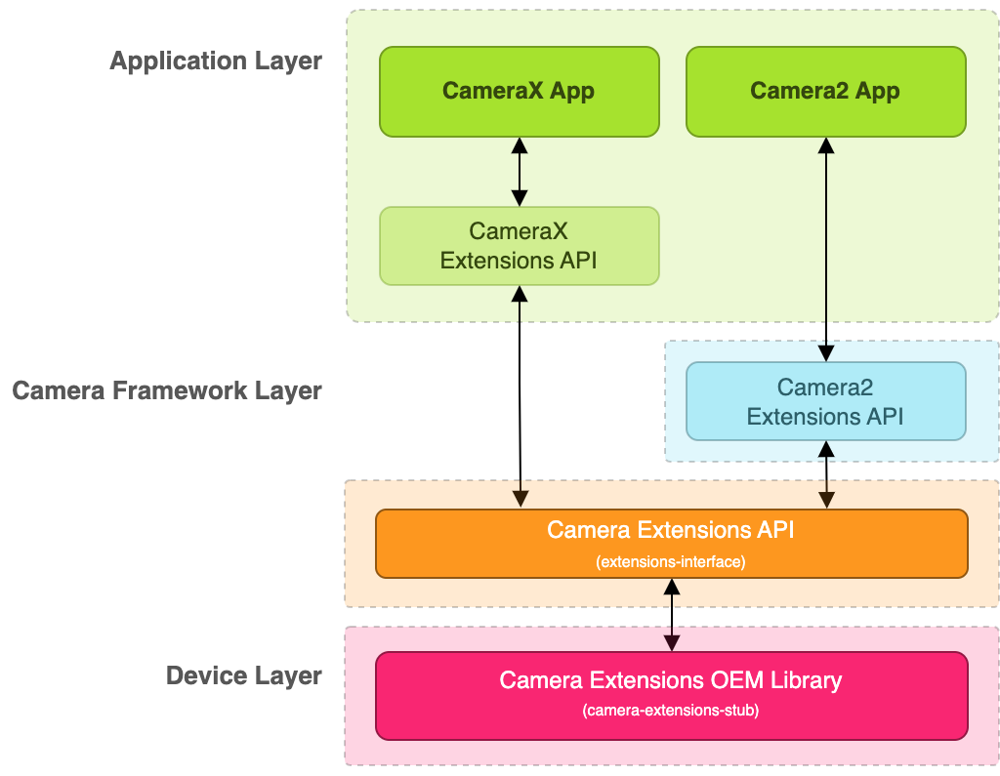

### 5.4.3 实现 OEM 供应商库

以 `camera-extensions-stub` 中的文件为基础：

- **基本接口文件（请勿修改）**：`PreviewExtenderImpl`、`ImageCaptureExtenderImpl`、`ExtenderStateListener`、`ProcessorImpl`、`PreviewImageProcessorImpl`、`CaptureProcessorImpl`、`CaptureStageImpl`、`RequestUpdateProcessorImpl`、`ProcessResultImpl`，以及 `advanced/` 包下的 `AdvancedExtenderImpl`、`SessionProcessorImpl`、`RequestProcessorImpl`、各种 `Camera2OutputConfigImpl` 等。
- **强制性实现**：`ExtensionVersionImpl`（版本验证）、`InitializerImpl`（库初始化）。
- **各扩展的扩展器类**（按需实现）：焦外成像 `Bokeh*ExtenderImpl`、夜间模式 `Night*ExtenderImpl`、自动 `Auto*ExtenderImpl`、HDR `Hdr*ExtenderImpl`、脸部照片修复 `Beauty*ExtenderImpl`（含 Preview/ImageCapture/Advanced 三类变体）。
- 不实现某个扩展时，将 `isExtensionAvailable()` 返回 `false` 或移除相应扩展器类，Camera2/X 会向应用报告该扩展不可用。

### 5.4.4 端到端流程（以夜间模式为例）

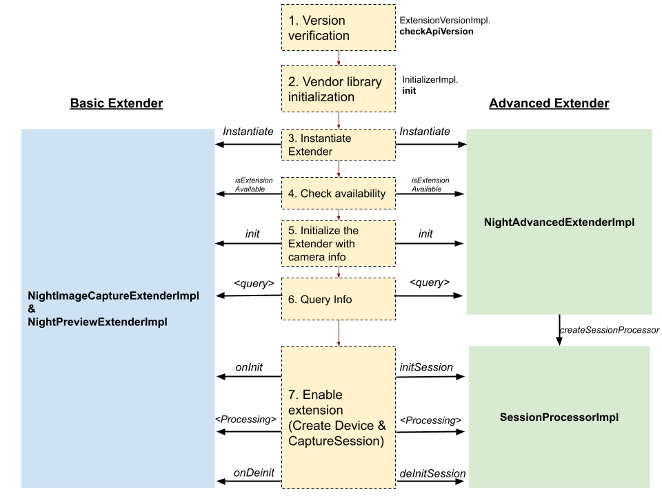

1. **版本验证**：Camera2/X 调用 `ExtensionVersionImpl.checkApiVersion()`，确保 OEM 实现的 `extensions-interface` 版本与 Camera2/X 支持的版本兼容。
2. **供应商库初始化**：`InitializerImpl.init()` 初始化供应商库；在回调 `OnExtensionsInitializedCallback.onSuccess()` 之前，Camera2/X 不会进行其他调用（版本检查除外）。从 `extensions-interface` 1.1.0 起必须实现 `InitializerImpl`；1.0.0 实现会跳过此步骤。
3. **实例化扩展器类**：扩展器分**基本扩展器**和**高级扩展器**两种类型，每种扩展程序须实现其中一种。Camera2/X 可能多次实例化扩展器类，因此不要在构造函数或 `init()` 中做繁重初始化，而应在 `onInit()`（基本）或 `initSession()`（高级）时进行。
4. **检查可用性**：通过 `isExtensionAvailable()` 检查扩展对指定相机 ID 是否可用（基本扩展器要求 Preview 与 ImageCapture 两个扩展器类都返回 `true`）。
5. **用相机信息初始化扩展器**：传入相机 ID 和 `CameraCharacteristics`。
6. **查询信息**：支持的分辨率、预计静态拍摄延迟时间、支持的拍摄请求密钥/结果密钥等。
7. **启用扩展**：基本扩展器通过钩子将 OEM 实现接入 Camera2 管道（注入拍摄请求参数、启用后期处理处理器）；高级扩展器通过 `SessionProcessorImpl` 启用。

**版本兼容性规则**：

- **主要版本不同** → 视为不兼容，停用扩展。
- **向后兼容**：主要版本相同时，Camera2/X 向后兼容旧版供应商库（例如支持 1.3.0 的 Camera2/X 可兼容实现 1.0.0/1.1.0/1.2.0 的库）。
- **向前兼容**：取决于 OEM 自身；若 Camera2/X 版本不满足要求，可返回不兼容版本（如 99.0.0）以停用扩展。

### 5.4.5 基本扩展器与高级扩展器对比

|  | 基本扩展器 | 高级扩展器 |
| --- | --- | --- |
| 数据流配置 | **固定**：预览 `PRIVATE` 或 `YUV_420_888`（有处理器时）；静态拍摄 `JPEG` 或 `YUV_420_888`（有处理器时） | **可由 OEM 自定义** |
| 发送拍摄请求 | 只有 Camera2/X 发送请求，OEM 可为其设置参数；提供处理器时 Camera2/X 可发送多个请求并交给处理器 | OEM 获得 `RequestProcessorImpl` 实例，可自行执行 Camera2 拍摄请求并获取结果和图片；Camera2/X 通过 `startRepeating`/`startCapture` 指示 OEM 发起请求 |
| 相机管道中的钩子 | `onPresetSession`（会话参数）、`onEnableSession`（会话配置后发单个请求）、`onDisableSession`（会话关闭前发单个请求） | `initSession`（返回自定义会话配置）、`onCaptureSessionStart`、`onCaptureSessionEnd` |
| 适用情形 | 在相机 HAL 或处理 YUV 图片的处理器中实现的扩展 | 基于 Camera2 的实现；需要自定义数据流配置（如 RAW 流）；需要交互式拍摄序列 |
| 支持的 API 版本 | Camera2 扩展：Android 13+；CameraX 扩展：`camera-extensions` 1.1.0+ | Camera2 扩展：Android 12L+；CameraX 扩展：1.2.0-alpha03+ |

**基本扩展器的三个应用流程**：


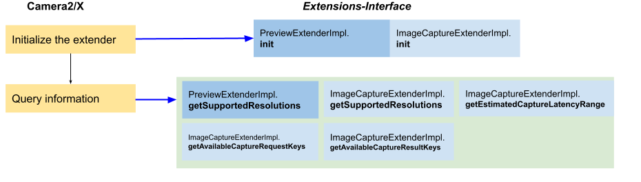

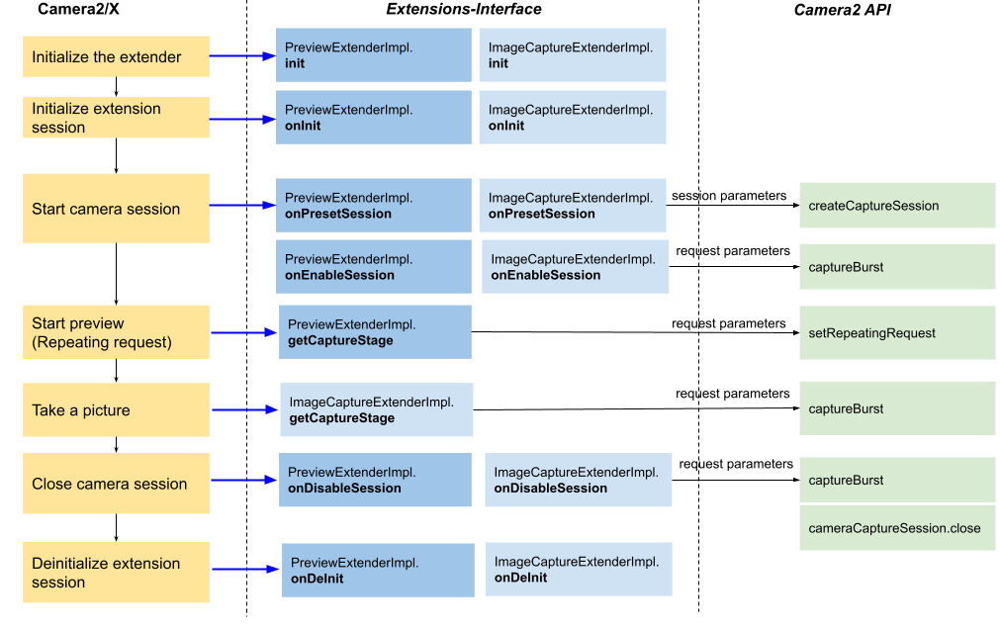

**处理器类型（基本扩展器）**：通过 `PreviewExtenderImpl.getProcessorType` 指定——

- `PROCESSOR_TYPE_NONE`：无处理器，图片在相机 HAL 中处理。
- `PROCESSOR_TYPE_REQUEST_UPDATE_ONLY`：根据最新 `TotalCaptureResult` 更新重复请求参数（`RequestUpdateProcessorImpl`）。
- `PROCESSOR_TYPE_IMAGE_PROCESSOR`：处理 `YUV_420_888` 图片并输出到 `PRIVATE` surface（`PreviewImageProcessorImpl`）。

静态拍摄可通过 `ImageCaptureExtenderImpl.getCaptureProcessor` 返回 `CaptureProcessorImpl`：`getCaptureStages()` 返回的每个 `CaptureStageImpl` 对应一个拍摄请求（如 3 个则通过 `captureBurst` 发送 3 个请求），图片与 `TotalCaptureResult` 配对送入处理器，结果写入 `YUV_420_888` surface，由 Camera2/X 按需转成 JPEG。

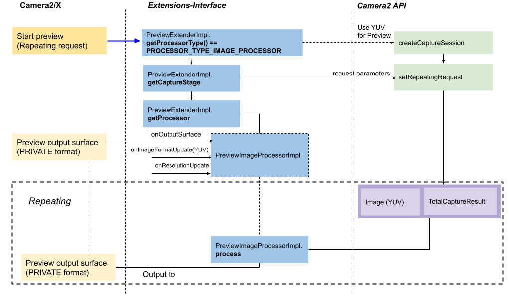

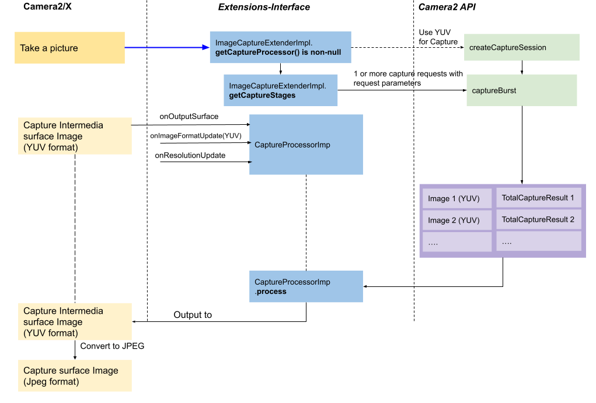

### 5.4.6 支持拍摄请求/结果密钥（1.3.0 起）

应用可能设置缩放、点按对焦、闪光灯、曝光补偿等参数，但 OEM 实现未必兼容。`extensions-interface` 1.3.0 起可通过 `getAvailableCaptureRequestKeys()` / `getAvailableCaptureResultKeys()` 公开自己支持的参数；CameraX/Camera2 只支持返回列表中的密钥。建议至少支持：

| 操作 | 建议支持的密钥 |
| --- | --- |
| 缩放 | `CONTROL_ZOOM_RATIO`、`SCALER_CROP_REGION` |
| 点按对焦 | `CONTROL_AF_MODE`、`CONTROL_AF_TRIGGER`、`CONTROL_AF_REGIONS`、`CONTROL_AE_REGIONS`、`CONTROL_AWB_REGIONS` |
| 闪光灯 | `CONTROL_AE_MODE`、`CONTROL_AE_PRECAPTURE_TRIGGER`、`FLASH_MODE` |
| 曝光补偿 | `CONTROL_AE_EXPOSURE_COMPENSATION` |

### 5.4.7 高级扩展器要点

- `ExtensionVersionImpl.isAdvancedExtenderImplemented()` 返回 `true` 时启用高级扩展器。
- 每种扩展类型实现 `advanced/*AdvancedExtenderImpl`；核心在 `SessionProcessorImpl`：
  - `initSession()`：分配资源，返回 `Camera2SessionConfigImpl`（含 `Camera2OutputConfigImpl` 列表与会话参数）。输出可选方式：直接添加输出 surface（`SurfaceOutputConfigImpl`，由 HAL 处理）、添加中间 `ImageReader` surface（`ImageReaderOutputConfigImpl`，自行处理后写入输出）、或使用 Camera2 surface 共享。
  - `onCaptureSessionStart()`：获得 `RequestProcessorImpl`，可执行拍摄请求并检索图片（需 `setImageProcessor()` 注册回调）。
  - `startRepeating()` / `startCapture()` / `setParameters()`：发起预览/拍照、设置请求参数（必须至少支持 `JPEG_ORIENTATION` 和 `JPEG_QUALITY`）。
  - `startTrigger()`（1.3.0 起）：支持 `CONTROL_AF_TRIGGER`、`CONTROL_AE_PRECAPTURE_TRIGGER` 等触发请求，实现点按对焦和闪光灯。
- 分辨率要求：预览必须至少支持 `PRIVATE`；静态拍摄必须同时支持 `JPEG` 与 `YUV_420_888`；图片分析 YUV 流不支持时 `getSupportedYuvAnalysisResolutions()` 返回空列表/null。
- **应用流程（三种）**：查询扩展可用性 → 查询信息（延迟范围、分辨率、请求/结果密钥）→ 启用扩展进行预览与静态拍摄。


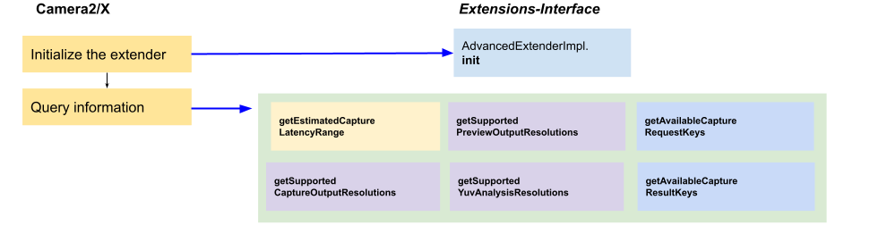

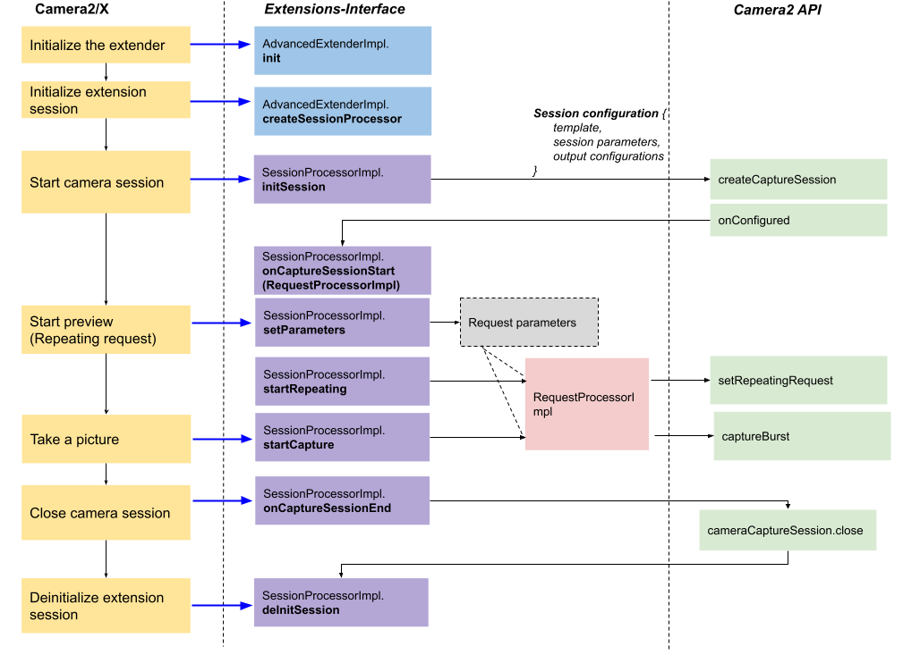
- **支持预览、静态拍摄和图片分析**：若实现处理器，必须支持 3 个 `YUV_420_888` 流的组合；高级扩展器需保证预览与拍摄输出有效，图片分析输出仅在非 null 时工作。
- **视频拍摄**：当前架构仅支持预览与静态拍摄用例，不支持在 `MediaCodec`/`MediaRecorder` surface 上启用扩展（应用可录制预览输出）。

### 5.4.8 Android 14 新特性（extensions-interface 1.4.0）

- **特定于扩展的元数据**：
  - `EXTENSION_STRENGTH` 拍摄请求参数（0–100）控制后期处理强度：BOKEH 控制模糊程度；HDR/NIGHT 控制融合程度与亮度；FACE_RETOUCH 控制美颜程度。
  - `EXTENSION_CURRENT_TYPE` 拍摄结果指明当前启用的扩展类型（AUTO 扩展会在 HDR/NIGHT 等间动态切换）。
- **实时预估静态拍摄延迟**：`getRealtimeStillCaptureLatency()`（基本扩展器实现 `getRealtimeCaptureLatency()`，高级扩展器在 `SessionProcessorImpl` 实现），返回 `captureLatency` 与 `processingLatency`，比静态的 `getEstimatedCaptureLatencyRangeMillis()` 更准确。
- **拍摄处理进度回调**：`onCaptureProcessProgressed()`（0–100），基本扩展器经 `ProcessResultImpl`、高级扩展器经 `CaptureCallback` 上报。
- **postview 静态拍摄**：处理延迟较长时先显示 postview 占位图，最终图片可用后替换。基本扩展器实现 `CaptureProcessorImpl.onPostviewOutputSurface` 与 `processWithPostview`；高级扩展器实现 `SessionProcessorImpl.startCaptureWithPostview`。
- **SurfaceView 输出**：重复请求预览输出注册 `SurfaceView`，走功耗与性能优化的预览渲染路径。
- **特定于供应商的会话类型**：基本扩展器经 `ExtenderStateListener.onSessionType()`、高级扩展器经 `Camera2SessionConfigImpl.getSessionType()` 选择内部会话类型，对客户端 API 无影响。

### 5.4.9 扩展程序接口版本记录

| 版本 | 添加的功能 |
| --- | --- |
| 1.0.0 | 版本验证（`ExtensionVersionImpl`）；基本扩展器（`PreviewExtenderImpl`、`ImageCaptureExtenderImpl`）；处理器（`PreviewImageProcessorImpl`、`CaptureProcessorImpl`、`RequestUpdateProcessorImpl`） |
| 1.1.0 | 库初始化（`InitializerImpl`）；公开支持的分辨率（`getSupportedResolutions`） |
| 1.2.0 | 高级扩展器（`AdvancedExtenderImpl`、`SessionProcessorImpl`）；获取预计拍摄延迟（`getEstimatedCaptureLatencyRange`） |
| 1.3.0 | 公开支持的拍摄请求/结果密钥；带 `ProcessResultImpl` 的新 `process()` 调用；触发器请求（`startTrigger`） |
| 1.4.0 | 特定于扩展的元数据；动态预估静态拍摄延迟；拍摄处理进度回调；postview 静态拍摄；支持 `SurfaceView` 输出；特定于供应商的会话类型 |

### 5.4.10 在设备上部署供应商库

1. 添加权限文件（如 `/etc/permissions/camera_extensions.xml`），将 `<uses-library>` 指定的库映射到设备上的实际文件路径：

   ```xml
   <?xml version="1.0" encoding="utf-8"?>
   <permissions>
       <library name="androidx.camera.extensions.impl"
                file="OEM_IMPLEMENTED_JAR" />
   </permissions>
   ```

   其中 `name` 必须为 `androidx.camera.extensions.impl`（CameraX 搜索该库名），`file` 为实现 jar 的绝对路径（如 `/system/framework/androidx.camera.extensions.impl.jar`）。
2. 在 **Android 12 及以上**支持 CameraX 扩展的设备，必须在设备 makefile 中设置系统属性：

   ```make
   PRODUCT_VENDOR_PROPERTIES += \
       ro.camerax.extensions.enabled=true \
   ```

3. 参考实现位于 `frameworks/ex`：`sample`（基本扩展器）、`advancedSample`（高级扩展器）、`service_based_sample`（在 Service 中承载相机扩展，含 `oem_library` 直通库与 `extensions_service` 扩展服务示例）。

### 5.4.11 扩展取景模式与相机扩展的关系

对于焦外成像，既可以通过相机扩展公开，也可以通过扩展场景模式（`CONTROL_EXTENDED_SCENE_MODE`，见 5.2 节）公开：

- **扩展取景模式限制更少**：可在支持灵活数据流组合和请求参数的常规 `CameraCaptureSession` 中启用；但只能在相机 HAL 中实现，且必须对应用可用的所有正交控件进行验证。
- **相机扩展**：仅支持一组固定的数据流类型，对拍摄请求参数支持有限；但适合无法在 HAL 中实现（需在应用层用后处理处理器处理图片）的场景。
- **官方建议**：同时使用扩展取景模式和相机扩展来公开焦外成像，因为应用可能倾向于使用特定 API。

### 5.4.12 关键术语

| 中文 | 英文 |
| --- | --- |
| 相机扩展 | Camera Extensions |
| OEM 供应商库 | OEM vendor library |
| 扩展程序接口 | `extensions-interface` |
| 基本扩展器 | Basic Extender |
| 高级扩展器 | Advanced Extender |
| 会话处理器 | `SessionProcessorImpl` |
| 请求处理器 | `RequestProcessorImpl` |
| 拍摄阶段 | `CaptureStageImpl` |
| 扩展强度 | `EXTENSION_STRENGTH` |
| 当前扩展类型 | `EXTENSION_CURRENT_TYPE` |
| postview 静态拍摄 | Postview still capture |
| 静态拍摄延迟 | Still capture latency |

## 5.5 相机扩展验证工具

> 来源：[相机扩展验证工具](https://source.android.google.cn/docs/core/camera/camerax-vendor-extensions-validation-tool?hl=zh-cn)

### 5.5.1 工具定位与解决的问题

相机扩展验证工具（Camera Extensions Validation Tool）供设备制造商（OEM）验证其"相机扩展 OEM 供应商库"实现是否正确。包含两类测试：

- **自动验证测试**：验证供应商库接口实现是否正确。例如，若图片拍摄需要 CaptureProcessor，测试会验证 `ImageCaptureExtenderImpl#getCaptureStages()` 是否返回所需的 `CaptureStage` 实例。
- **手动验证测试**：验证预览与拍摄图片的效果和画质，如脸部照片修复是否正确应用、焦外成像（bokeh）强度是否足够。

源代码位于 Android Jetpack 代码库中的扩展测试应用（`androidx-main/camera/integration-tests/extensionstestapp/`）。

### 5.5.2 构建

```bash
# 1. 下载 Android Jetpack 库源代码（参考 Jetpack README 的检出代码部分）
cd path/to/checkout/frameworks/support/

# 2. 构建测试用 APK（支持手动验证）
./gradlew camera:integration-tests:camera-testapp-extensions:assembleDebug
# 输出：.../out/androidx/camera/integration-tests/camera-testapp-extensions/build/outputs/apk/debug/camera-testapp-extensions-debug.apk

# 3. 构建 androidTest APK（支持自动验证）
./gradlew camera:integration-tests:camera-testapp-extensions:assembleAndroidTest
# 输出：.../build/outputs/apk/androidTest/debug/camera-testapp-extensions-debug-androidTest.apk
```

### 5.5.3 运行自动测试

先安装两个 APK（`adb install -r <apk路径>`），然后：

```bash
# 运行全部自动化测试（全部通过返回 OK，否则输出失败报告）
adb shell am instrument -w -r \
  androidx.camera.integration.extensions.test/androidx.test.runner.AndroidJUnitRunner

# 针对特定类运行（以 ImageCaptureTest 为例）
adb shell am instrument -w -r \
  -e class androidx.camera.integration.extensions.ImageCaptureTest \
  androidx.camera.integration.extensions.test/androidx.test.runner.AndroidJUnitRunner
```

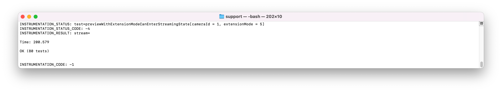

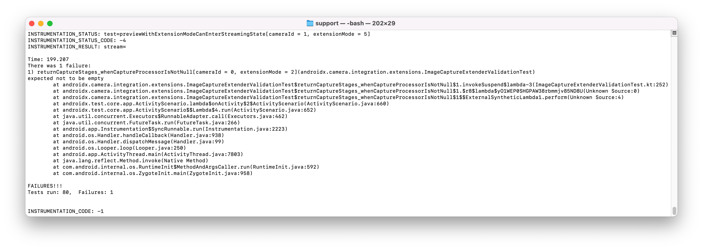

### 5.5.4 运行手动测试

- 安装并启动扩展测试应用后，点按右上角菜单项**切换到验证工具模式**。
- 首页列出所有含 `REQUEST_AVAILABLE_CAPABILITIES_BACKWARD_COMPATIBLE` 功能的摄像头；不支持任何扩展模式的相机显示为灰色。
- 选择相机后可见其可测试的扩展模式（不支持的显示为灰色）。

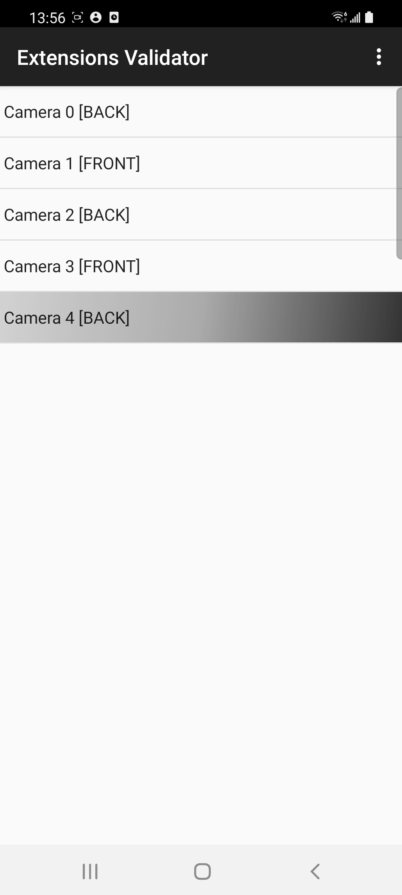

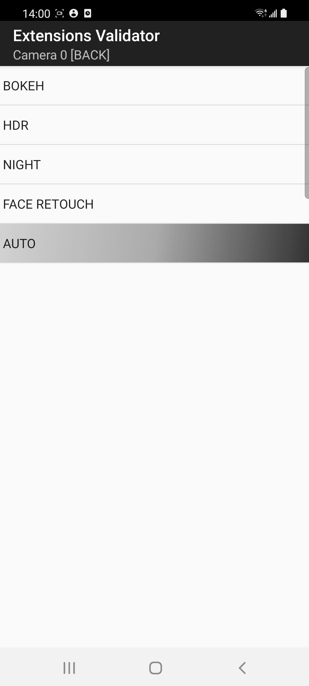

**验证预览**：点按扩展模式进入图片拍摄 activity，支持缩放、点按对焦、闪光灯模式切换、增/减曝光值、启用/停用扩展切换按钮；需验证这些功能在预览中正常工作。

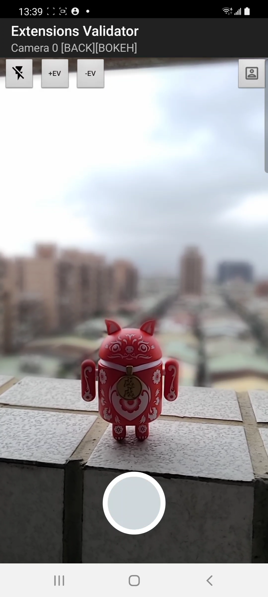

**验证拍摄图片**：点按拍摄按钮后进入图片验证 activity，支持双指缩放、左右滑动切换图片、重新拍摄、保存图片；需验证图片正确且与拍摄时的缩放/对焦/闪光灯/曝光设置相符。结果正确点 PASS（对勾），否则点失败按钮（感叹号）。

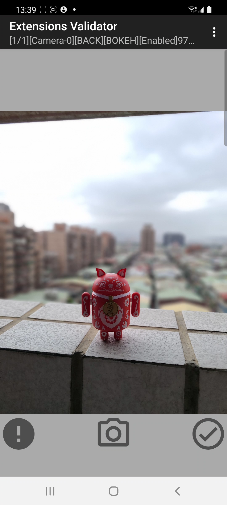

**测试结果颜色指示**：

| 背景颜色 | 含义 |
| --- | --- |
| 白色 | 相机至少支持一种扩展模式，尚未全部验证 |
| 绿色 | 所有受支持的扩展模式均已验证且全部通过 |
| 红色 | 所有模式已验证，但至少一种失败 |
| 灰色 | 该功能不可用 |

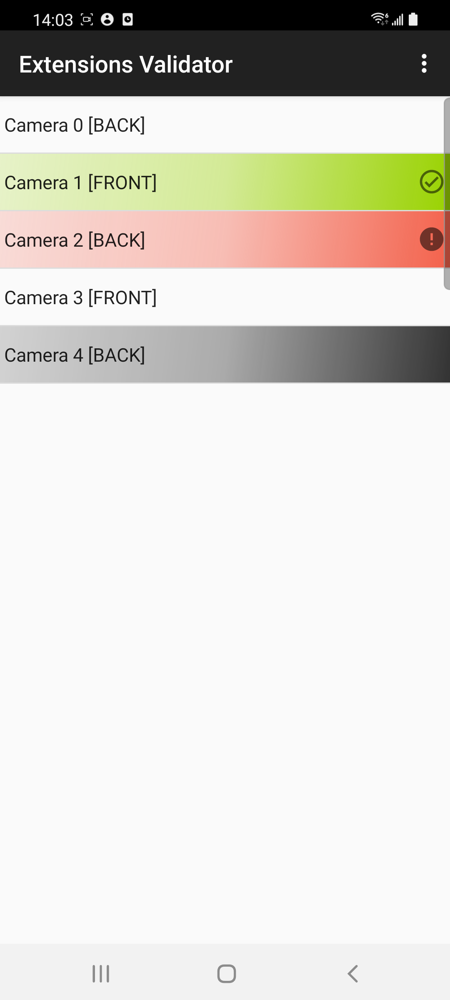

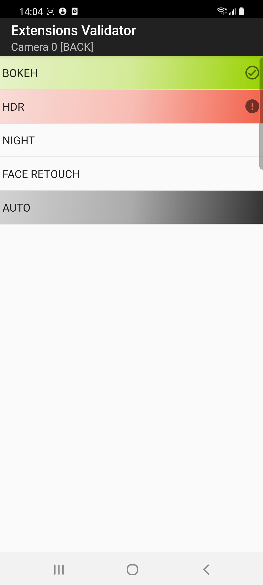

**其他功能**：

- **导出测试结果**：以 CSV 文件导出到 `Documents/ExtensionsValidation` 文件夹。
- **重置**：清除所有缓存的测试结果。
- **扩展程序示例应用**：切换回示例应用模式。

若发现问题并发布新版供应商库，应先重置结果，再对全部摄像头重新运行所有受支持的扩展模式以确认修复。

### 5.5.5 对 OEM 的要求

- 正确实现相机扩展供应商库接口（如 `ImageCaptureExtenderImpl`、`CaptureStage`、`CaptureProcessor` 等）。
- 通过自动与手动测试确认效果质量（如人像修复、焦外成像强度）。
- 可导出 CSV 结果作为验证记录。

### 5.5.6 关键术语

| 中文 | 英文 |
| --- | --- |
| 相机扩展验证工具 | Camera Extensions Validation Tool |
| 相机扩展 OEM 供应商库 | Camera Extensions OEM vendor library |
| 自动/手动验证测试 | Automatic / Manual validation tests |
| 图片拍摄 activity / 图片验证 activity | Image capture activity / Image validation activity |
| 验证工具模式 | Validation tool mode |
| 向后兼容能力 | `REQUEST_AVAILABLE_CAPABILITIES_BACKWARD_COMPATIBLE` |
| 焦外成像 | Bokeh |

## 5.6 相机预览防抖

> 来源：[相机预览防抖](https://source.android.google.cn/docs/core/camera/camera-preview-stabilization?hl=zh-cn)

### 5.6.1 功能概述

面向 **Android 13 及以上**设备，相机框架对捕获会话中的**预览流及其他非 RAW 流**提供视频防抖支持。此功能让第三方应用在对比相机预览与录制内容时，实现所见即所得（WYSIWYG）的体验。

### 5.6.2 解决的问题

传统上预览与录制（视频）的防抖处理可能不一致，导致用户在预览中看到的效果与最终录制结果不同。此功能让预览流也应用视频防抖，从而使预览效果与录制内容一致，实现 WYSIWYG。

### 5.6.3 实现（HAL / 元数据）

设备制造商需要在相机 HAL 中通告支持并实现防抖算法，涉及两个 Camera2 元数据键：

| 键（Camera2 元数据） | 作用 |
| --- | --- |
| `CONTROL_AVAILABLE_VIDEO_STABILIZATION_MODES` | 在相机特性（`CameraCharacteristics`）中通告支持 |
| `CONTROL_VIDEO_STABILIZATION_MODE_PREVIEW_STABILIZATION` | 表示预览防抖模式（`CameraMetadata`） |

- 如需修改默认设置：在通过 `createCaptureRequest` 创建拍摄请求时，在拍摄请求模板中分配默认值。
- 更多细节参见 `CONTROL_VIDEO_STABILIZATION_MODE` 文档。
- 参考实现：Cuttlefish 虚拟设备中的 EmulatedCamera 代码，位于 `hardware/google/camera/devices/EmulatedCamera/hwl/EmulatedSensor.cpp`。

### 5.6.4 对 OEM 的要求与验证

1. 在相机 HAL 中通告上述两个元数据键的支持。
2. 实现视频防抖算法本身。
3. 通过以下验证测试：
   - **CTS**：`RobustnessTest.java#testMandatoryPreviewStabilizationOutputCombinations`
   - **ITS（测试视野范围 FOV 与防抖效果）**：
     - `scene4/test_preview_Stabilization_fov.py`
     - `sensor_fusion/test_preview_stabilization.py`

### 5.6.5 关键术语

| 中文 | 英文 |
| --- | --- |
| 相机预览防抖 | Camera Preview Stabilization |
| 视频防抖 | Video Stabilization |
| 预览流 | Preview stream |
| 非 RAW 流 | Non-RAW stream |
| 所见即所得 | WYSIWYG (What You See Is What You Get) |
| 捕获会话 | Capture session |
| 拍摄请求 / 拍摄请求模板 | Capture request / Capture request template |
| 视野范围 | FOV (Field of View) |
| 传感器融合 | Sensor fusion |
| 兼容性测试套件 / 图像测试套件 | CTS / ITS |


# 第 6 章 相机功能（中）

> 本章对应 AOSP 官方文档"相机功能"组的中段五篇：外接 USB 摄像头、高动态范围（HDR）模式、HEIF 图片处理、单色相机、运动追踪。内容面向希望系统学习 Android Camera 框架的工程师，重点讲清"每个功能是什么、解决什么问题、如何在 HAL/元数据层面实现、OEM 需要做什么"。

## 6.1 外接 USB 摄像头

> 来源：[外接 USB 摄像头](https://source.android.google.cn/docs/core/camera/external-usb-cameras?hl=zh-cn)

### 6.1.1 功能定位

Android 平台支持**即插即用（plug-and-play）的 USB 网络摄像头（webcam）**，前提是这些摄像头通过标准的 Android Camera2 API 和相机 HAL 接口接入。网络摄像头通常支持 **USB 视频类（UVC，USB Video Class）** 驱动；在 Linux 内核侧，UVC 摄像头由标准的 **Video4Linux（V4L）** 驱动控制。

它解决的问题是：让设备可以低成本接入通用 USB 摄像头，用于**视频聊天、照片冲印机**等轻量级用例。官方文档明确指出，此功能**不能替代**手机上典型的内置相机 HAL，也不是为高分辨率高速流式传输、AR、手动 ISP/传感器控制等性能敏感的复杂任务设计的。

### 6.1.2 架构与实现

- USB 相机 HAL 进程是**外接摄像头提供程序（external camera provider）**的一部分，该提供程序监听 USB 设备的可用性并相应地枚举外接摄像头设备；其权限和 SE 策略与内置相机 HAL 进程类似。
- 参考实现位于 `ExternalCameraProvider`，外接摄像头设备与会话实现分别在 `ExternalCameraDevice` 和 `ExternalCameraDeviceSession` 中。
- 从 **API 级别 28** 开始，Java 客户端 API 引入了 `EXTERNAL` 硬件级别（hardware level）。
- 第三方网络相机应用直接访问 UVC 设备时所需的相机权限，与所有常规相机应用相同。

### 6.1.3 对 OEM 的要求

1. 系统必须支持 `android.hardware.usb.host` 系统功能。
2. 内核必须启用 UVC 支持，在对应的 `defconfig` 中添加：
   - `CONFIG_USB_VIDEO_CLASS=y`
   - `CONFIG_MEDIA_USB_SUPPORT=y`
3. 在设备 build 中启用外接摄像头提供程序：
   - 在 `device.mk` 中加入 `android.hardware.camera.provider-V1-external-service`，并复制 `external_camera_config.xml` 到 vendor 分区；
   - 在 Treble HAL 清单中为 `android.hardware.camera.provider`（AIDL）添加 `external/0` 实例；
   - 若设备运行在 Treble 直通（passthrough）模式，需更新 `sepolicy`，允许 `cameraserver` 访问 `device`、`video_device` 目录与字符设备。

### 6.1.4 external_camera_config.xml 关键配置

| 配置项 | 含义 |
| --- | --- |
| `Provider/ignore/id` | 需要被外接相机 HAL 忽略的内部视频节点编号 |
| `MaxJpegBufferSize` | JPEG 缓冲区最大字节数（示例为 3MB，约等于 1080p YUV420） |
| `NumVideoBuffers` | 流式传输 ≥ 30fps 时 v4l2 缓冲队列长度（越大请求缓存越多、越流畅，但内存占用更高） |
| `NumStillBuffers` | 流式传输 < 30fps 时 v4l2 缓冲队列长度 |
| `FpsList/Limit` | 各输出尺寸的最大帧率上限：尺寸小于某行 `width/height` 的图片可上报最高 `fpsBound`；宽高需递增、fpsBound 需递减；超过最后一行的尺寸不受支持 |

示例中的帧率上限：640x480 → 30fps，1280x720 → 15fps，1920x1080 → 10fps。

### 6.1.5 自定义与优化

- **常规自定义**（改 `external_camera_config.xml`）：排除内部摄像头的视频节点、支持的图片尺寸与帧率上限、inflight 缓冲区数量（流畅度与内存的权衡）。
- **设备专用优化**：
  - 缓冲区复制/缩放及 JPEG 编解码：通用实现用 CPU（libyuv/libjpeg），可替换为设备专用加速；
  - HAL 输出格式：通用实现视频 `IMPLEMENTATION_DEFINED` 缓冲区用 `YUV_420_888`、其余用 `YUV12`，可替换为设备高效格式并支持更多格式。

### 6.1.6 验证与限制

- 必须通过相机 CTS；整个测试期间外接 USB 摄像头必须始终插在设备上，否则部分用例会失败。
- 注意：`media_profiles` 条目不适用于外接 USB 网络摄像头，因此**没有 camcorder（摄像机）配置文件**。

### 6.1.7 关键术语

| 中文 | 英文 |
| --- | --- |
| 外接 USB 摄像头 | External USB camera |
| USB 视频类 | UVC (USB Video Class) |
| 视频4Linux 驱动 | V4L (Video4Linux) |
| 外接摄像头提供程序 | External camera provider |
| 外接硬件级别 | EXTERNAL hardware level |
| HAL 清单 | Treble HAL manifest |

## 6.2 高动态范围（HDR）模式

> 来源：[高动态范围（HDR）模式](https://source.android.google.cn/docs/core/camera/hdr-modes?hl=zh-cn)

### 6.2.1 功能定位

Camera2 API 中提供了多种**高动态范围（HDR，High Dynamic Range）**拍摄形式。HDR 解决的核心问题是：普通 8 位成像在明暗对比强烈（高对比度）场景下会丢失高光或阴影细节。本页将 HDR 分为两大类：**HDR 静态拍摄**与 **HDR 视频录制**。

### 6.2.2 HDR 静态拍摄

HDR 静态拍摄封装了各种用于**改善移动相机动态范围**的算法。按 Android 版本分为两条技术路线：

| 路线 | 适用版本 | 说明 |
| --- | --- | --- |
| 10 位相机输出 | Android 13 及以上 | 通过 10 位相机输出 `capability` 与 HDR 动态范围配置文件实现，生成真实 10 位像素格式和对应 10 位传递函数（transfer function）的帧；仅支持扩展后的物理位深 |
| 多帧融合 | Android 12 及以下 | 捕获多个不同曝光的帧并融合各图片生成最终 HDR 结果，有时会压缩到标准 8 位动态范围 |

Android 13+ 的 10 位相机输出（使用 HDR 动态范围配置文件 `DynamicRangeProfiles` 类配置）可与 HDR 场景模式结合，支持：

- 使用 **P010** 像素格式的 10 位未压缩静态拍摄；
- 按 **Ultra HDR** 规范、使用 **`JPEG_R`** 像素格式的 HDR 压缩静态拍摄。

Android 12 及以下的多帧融合 HDR 有两种方法：

1. **HDR 场景模式（HDR scene mode）**：在**相机 HAL 层**实现。如果受支持，相机客户端可在常规相机拍摄请求中设置此模式（即 `android.control.sceneMode` 中的 HDR 模式）。
2. **HDR 扩展（Camera Extensions）**：建议用于高对比度场景；可使用功能受限的拍摄会话（与常规拍摄会话相比）。在同一设备上，相机扩展程序生成的图片质量可能高于常规拍摄请求。

### 6.2.3 HDR 视频录制

与 HDR 静态拍摄相比，**HDR 视频**仅指 HDR 视频拍摄，即 **10 位视频录制**（同样基于 10 位相机输出 / `DynamicRangeProfiles` 机制）。相关细节可延伸阅读"10 位相机输出"与"Ultra HDR"章节。

### 6.2.4 对工程师的意义

- 学习时应区分三个层次：HAL 内实现的 HDR 场景模式（对客户端透明、一次请求生效）、框架/应用层的多帧融合扩展（Camera Extensions，质量可超出常规请求）、以及 Android 13 起原生 10 位管线（P010 / JPEG_R + 传递函数）。
- OEM 若宣称支持 HDR，需要明确自己走的是哪条路线，并在静态元数据（capability、scene mode、`DynamicRangeProfiles`）中如实通告。

### 6.2.5 关键术语

| 中文 | 英文 |
| --- | --- |
| 高动态范围 | HDR (High Dynamic Range) |
| HDR 场景模式 | HDR scene mode |
| 相机扩展程序 | Camera Extensions |
| HDR 动态范围配置文件 | DynamicRangeProfiles |
| 传递函数 | Transfer function |
| 10 位相机输出 | 10-bit camera output |
| P010 像素格式 | P010 pixel format |
| HDR 压缩静态拍摄 | JPEG_R (HDR compressed still capture) |
| 多帧融合 | Multi-frame fusion |

## 6.3 HEIF 图片处理

> 来源：[HEIF 图片处理](https://source.android.google.cn/docs/core/camera/heif?hl=zh-cn)

### 6.3.1 功能定位

搭载 **Android 10** 的设备支持 **HEIC** 压缩图片格式——它是 ISO/IEC 23008-12 规定的**高效图片文件格式（HEIF，High Efficiency Image File Format）**的 HEVC（高效视频编码）特定品牌。相比 JPEG，HEIC 图片"质量更好且文件更小"，解决的是静态图片压缩效率不足的问题。

### 6.3.2 生成流程

HEIC 图片由相机框架生成：向相机 HAL 请求**未压缩图片**，然后送入媒体子系统，由 HEIC 或 HEVC 编码器编码。因此它不是由相机 HAL 直接输出 HEIC 文件，而是"HAL 出原始帧 + 媒体编码器出 HEIC"的协作产物。

### 6.3.3 硬件前提

设备必须拥有支持以下之一的硬件编码器：

- `MIMETYPE_IMAGE_ANDROID_HEIC`，或
- `MIMETYPE_VIDEO_HEVC` 且具有**恒定质量模式**（`BITRATE_MODE_CQ`）。

### 6.3.4 实现方式

**媒体（编码器）侧**：

- HEVC 类型编解码器：使用带 `GRALLOC_USAGE_HW_VIDEO_ENCODER` 用法的 IMPLEMENTATION_DEFINED 格式或 `HAL_PIXEL_FORMAT_YCBCR_420_888` 格式（取决于图片大小）；
- HEIC 类型编解码器：使用带 `GRALLOC_USAGE_HW_IMAGE_ENCODER` 用法的 IMPLEMENTATION_DEFINED 格式。

**相机 HAL 侧**：

- 静态元数据：`ANDROID_HEIC_INFO_SUPPORTED = true`；`ANDROID_HEIC_INFO_MAX_JPEG_APP_SEGMENTS_COUNT` 取 [1, 16] 区间内的值。
- 流组合：对每个必要的流组合（mandatory stream combinations），设备必须支持用**相同大小的 HEIC 流替换 JPEG 流**。
- 对公共 API 上的 HEIC 输出流（`ImageFormat.HEIC`），相机服务会创建**两个 HAL 内部流**：
  1. 带 `JPEG_APPS_SEGMENT` 使用标志的 BLOB 流，存储应用细分（app segments，含 EXIF 与缩略图细分）；
  2. 根据目标编解码器（IMPLEMENTATION_DEFINED 或 YCBCR_420_888）与 HEIC 流大小确定的流。
- 框架根据 `ANDROID_HEIC_INFO_MAX_JPEG_APP_SEGMENTS_COUNT` 为 HAL 分配足够大的缓冲区以填充 JPEG 应用细分；**APP1 细分为必填**，APP2 及以上为可选。
- 框架可覆盖 APP1 中的 EXIF 标记（可派生自捕获结果元数据或与主图比特流相关），并发送至 **MediaMuxer**。

**方向（orientation）规则**：媒体编码器将方向嵌入输出图片的元数据，以保证主图与缩略图方向一致；因此**相机 HAL 不得根据 `android.jpeg.orientation` 旋转缩略图**；框架将方向写入 EXIF 元数据和 HEIC 容器。

**元数据复用**：与 JPEG 相关的静态、控制和动态元数据同样适用于 HEIC——例如捕获请求中的 `android.jpeg.orientation` 和 `android.jpeg.quality` 同样控制 HEIC 的方向和质量。

### 6.3.5 限制事项

- **无法同时配置 JPEG 和 HEIC 流**；
- HEIC 流替换 JPEG 流要求大小一致；
- HAL 不得自行旋转缩略图；应用细分数量上限为 16（APP1 必填）。

### 6.3.6 验证

- 使用 TestingCamera2 测试应用；
- CTS：`NativeImageReaderTest#testHeic`、`ImageReaderTest#testHeic`、`ImageReaderTest#testRepeatingHeic`、`ReprocessCaptureTest#testBasicYuvToHeicReprocessing`、`ReprocessCaptureTest#testBasicOpaqueToHeicReprocessing`、`RobustnessTest#testMandatoryOutputCombinations`、`StillCaptureTest#testHeicExif`；
- VTS：`VtsHalCameraProviderV2_4TargetTest.cpp`。

### 6.3.7 关键术语

| 中文 | 英文 |
| --- | --- |
| 高效图片文件格式 | HEIF (High Efficiency Image File Format) |
| HEIF 的 HEVC 特定品牌 | HEIC |
| 高效视频编码 | HEVC (High Efficiency Video Coding) |
| 恒定质量模式 | Constant Quality (CQ) mode |
| 应用细分 | JPEG app segments (APP1/APP2...) |
| 媒体复用器 | MediaMuxer |

## 6.4 单色相机

> 来源：[单色相机](https://source.android.google.cn/docs/core/camera/monochrome?hl=zh-cn)

### 6.4.1 功能定位

自 **Android 9** 起，设备可以支持**单色相机（monochrome camera）**。**Android 10** 进一步增加了：

- **Y8** 流格式支持（相比 YUV_420_888 每像素 1.5 字节，Y8 每像素仅 1 字节，**减少内存使用**）；
- 单色和**近红外（NIR，Near-Infrared）色彩滤波阵列（CFA）**静态元数据；
- 单色摄像头的 `DngCreator`（DNG 文件生成）支持。

它解决的问题是：让 OEM 能实现真正的单色或 NIR 摄像头设备（去掉色彩滤波阵列的传感器，感光效率更高、低光噪声更好），并可作为**逻辑多摄像头（logical multi-camera）**设备中的物理摄像头参与变焦/低光融合。

### 6.4.2 硬件要求

设备必须配备单色摄像头传感器，以及处理传感器输出的**图像信号处理器（ISP）**。

### 6.4.3 HAL 元数据实现要求

要将相机设备播发为单色相机，HAL 须满足：

1. `android.sensor.info.colorFilterArray` 设为 **MONO** 或 **NIR**；
2. 支持 BACKWARD_COMPATIBLE 必需键，**不支持** MANUAL_POST_PROCESSING；
3. `android.control.awbAvailableModes` 只包含 AUTO，且 `android.control.awbState` 为 CONVERTED 或 LOCKED（取决于 `android.control.awbLock`）；
4. `android.colorCorrection.mode`、`android.colorCorrection.transform`、`android.colorCorrection.gains` 不在可用请求和结果键中 → 因此单色相机设备最高只能是 **LIMITED** 硬件级别；
5. 不得存在以下颜色相关静态元数据键：`android.sensor.referenceIlluminant*`、`android.sensor.calibrationTransform*`、`android.sensor.colorTransform*`、`android.sensor.forwardMatrix*`、`android.sensor.neutralColorPoint`、`android.sensor.greenSplit`；
6. 以下键所有颜色通道的值必须相同：`android.sensor.blackLevelPattern`、`android.sensor.dynamicBlackLevel`、`android.statistics.lensShadingMap`、`android.tonemap.curve`；
7. `android.sensor.noiseProfile` 只有一个颜色通道；
8. 支持 Y8 的单色设备：HAL 必须支持在强制性流组合中（含重新处理 reprocessing）**以 Y8 替代 YUV_420_888** 格式。

### 6.4.4 公共 API

| API | 说明 |
| --- | --- |
| `ImageFormat.Y8` | Y8 图片格式（Android 10） |
| `SENSOR_INFO_COLOR_FILTER_ARRANGEMENT_MONO` | 单色 CFA 通告 |
| `SENSOR_INFO_COLOR_FILTER_ARRANGEMENT_NIR` | 近红外 CFA 通告（Android 10） |
| `REQUEST_AVAILABLE_CAPABILITIES_MONOCHROME` | 单色相机能力（Android 9 引入） |

### 6.4.5 验证与限制

- CTS：`testMonochromeCharacteristics`、`CaptureRequestTest`、`CaptureResultTest`、`StillCaptureTest`、`DngCreatorTest`；VTS：`getCameraCharacteristics`、`processMultiCaptureRequestPreview`。
- 限制小结：最高 LIMITED 硬件级别、无 MANUAL_POST_PROCESSING、无颜色校正/色温类元数据键、AWB 仅 AUTO。

### 6.4.6 关键术语

| 中文 | 英文 |
| --- | --- |
| 单色相机 | Monochrome camera |
| 近红外 | NIR (Near-Infrared) |
| 色彩滤波阵列 | CFA (Color Filter Array) |
| 图像信号处理器 | ISP |
| 逻辑多摄像头 | Logical multi-camera |
| 重新处理 | Reprocessing |
| 强制性流组合 | Mandatory stream combinations |

## 6.5 运动追踪

> 来源：[运动追踪](https://source.android.google.cn/docs/core/camera/motion-tracking?hl=zh-cn)

### 6.5.1 功能定位

自 **Android 9** 起，相机设备可以通告**运动追踪（Motion Tracking）**功能。需要特别理解其定位：**相机本身不生成运动追踪数据**，而是作为数据源供下游使用方进行场景分析，典型使用方包括：

- **ARCore**（增强现实）；
- **图像稳定算法**；
- 与**其他传感器**（如 IMU）配合使用。

换言之，相机在此角色中提供的是"带精确几何标定、短曝光"的视频流，追踪运算由上层完成。

### 6.5.2 关键行为约束

当捕获请求包含 motion tracking 捕获意图（capture intent）时，相机必须**将曝光时间限制在 20 毫秒以内**，以减少运动模糊——这是该功能最明确的一条行为级限制，保证 AR 场景下帧间匹配的质量。

### 6.5.3 OEM 实现要求

1. **能力通告**：启用 `ANDROID_REQUEST_AVAILABLE_CAPABILITIES_MOTION_TRACKING`；
2. **捕获意图支持**：支持 `ANDROID_CONTROL_CAPTURE_INTENT_MOTION_TRACKING`（对应 API 层的 `CONTROL_CAPTURE_INTENT_MOTION_TRACKING`），且该 intent 出现在捕获请求中时将曝光时间限制为 ≤ 20ms；
3. **镜头校准数据**：必须在静态信息和逐帧（动态）元数据字段中准确报告：
   - `ANDROID_LENS_POSE_ROTATION`（镜头姿态旋转）
   - `ANDROID_LENS_POSE_TRANSLATION`（镜头姿态平移）
   - `ANDROID_LENS_INTRINSIC_CALIBRATION`（镜头内参校准）
   - `ANDROID_LENS_RADIAL_DISTORTION`（镜头径向畸变）
   - `ANDROID_LENS_POSE_REFERENCE`（镜头姿态参考）

这些标定字段使相机帧可以与世界坐标系及其他传感器数据对齐，是 AR/图像稳定算法正确工作的前提。文档未要求使用 vendor tag——校准数据全部通过**标准 Camera 元数据字段**报告。

### 6.5.4 参考实现与验证

- HAL 参考实现：高通相机 HAL `QCamera3HWI.cpp`（msm8998，`hardware/qcom/camera` 仓库）；
- 元数据定义：`hardware/interfaces/camera/metadata/` 下 `types.hal`（3.2 与 3.3 版本）；
- 支持此功能的相机设备必须通过**相机 CTS** 测试。

### 6.5.5 关键术语

| 中文 | 英文 |
| --- | --- |
| 运动追踪 | Motion Tracking |
| 捕获意图 | Capture Intent |
| 曝光时间 | Exposure time |
| 镜头姿态旋转 / 平移 | Lens Pose Rotation / Translation |
| 镜头内参校准 | Lens Intrinsic Calibration |
| 镜头径向畸变 | Lens Radial Distortion |
| 镜头姿态参考 | Lens Pose Reference |

---

> 学习提示：本章五个功能的共同脉络是"能力通告（capability/静态元数据）+ 行为约束（控制/动态元数据）+ CTS/VTS 验证"。建议结合第 3 章（相机 HAL 与元数据）与"相机功能（上/下）"章节对照阅读，理解框架如何通过元数据契约把 OEM 能力暴露给应用层。


# 第 7 章 相机功能（下）

本章继续介绍 Android 相机功能组页面的后半部分：多摄像头支持、系统相机、手电筒强度控制、Ultra HDR、将设备用作摄像头（Webcam）以及广色域拍摄。内容依据 AOSP 中文官方文档（source.android.google.cn）整理，面向希望系统学习 Android Camera 框架的工程师。

---

## 7.1 多摄像头支持

> 来源：[多摄像头支持](https://source.android.google.cn/docs/core/camera/multi-camera?hl=zh-cn)

### 7.1.1 功能定位与要解决的问题

多摄像头支持（Multi-Camera Support）由 Android 9 引入，核心概念是**逻辑摄像头设备（logical camera device）**：由两个或更多朝向同一方向的物理摄像头组成，对外以单个 `CameraDevice` / `CaptureSession` 的形式呈现给应用。它解决了两个问题：

- 应用无需自己管理多个摄像头会话，即可获得融合输出（变焦、景深、双目立体视觉、动作追踪、光学变焦等）。
- 应用仍可选择**直接访问底层物理摄像头**：同时从多个物理摄像头流式传输 RAW 缓冲区、分别设置控件、分别接收元数据。


### 7.1.2 应用侧 API（Java 层）

- 通过 `CameraMetadata` 中的 `REQUEST_AVAILABLE_CAPABILITIES_LOGICAL_MULTI_CAMERA` 功能播发逻辑多摄像头。
- `getPhysicalCameraIds()`：查询构成逻辑摄像头的物理摄像头 ID。
- `OutputConfiguration.setPhysicalCameraId()`：单独控制某个物理设备。
- `TotalCaptureResult.getPhysicalCameraResults()`：查询单个物理请求的结果。
- `getAvailablePhysicalCameraRequestKeys()`：获取物理摄像头支持的有限参数列表。
- 约束：仅支持非重新处理（non-reprocessing）请求；仅单色（monochrome）和 Bayer 传感器支持物理流。

### 7.1.3 HAL 侧实现要点（OEM 检查清单）

1. 为逻辑设备添加 `ANDROID_REQUEST_AVAILABLE_CAPABILITIES_LOGICAL_MULTI_CAMERA` 功能。
2. 填充静态元数据 `ANDROID_LOGICAL_MULTI_CAMERA_PHYSICAL_IDS`。
3. 填充深度相关静态元数据（建立物理流像素间的关联）：`ANDROID_LENS_POSE_ROTATION`、`ANDROID_LENS_POSE_TRANSLATION`、`ANDROID_LENS_INTRINSIC_CALIBRATION`、`ANDROID_LENS_DISTORTION`、`ANDROID_LENS_POSE_REFERENCE`。
4. 设置 `ANDROID_LOGICAL_MULTI_CAMERA_SENSOR_SYNC_TYPE`：
   - `APPROXIMATE`：主主模式（master-master），无硬件快门/曝光同步；
   - `CALIBRATED`：主辅模式（master-slave），执行硬件快门/曝光同步。
5. 填充 `ANDROID_REQUEST_AVAILABLE_PHYSICAL_CAMERA_REQUEST_KEYS`（不支持物理级请求时可为空）。
6. HAL 3.5 及以上（Android 10+）：必须在结果中填充 `ANDROID_LOGICAL_MULTI_CAMERA_ACTIVE_PHYSICAL_ID`，报告当前有效物理摄像头。

### 7.1.4 Camera ID 与流组合逻辑

- 逻辑摄像头的强制性流组合与其硬件级别在 `CameraDevice.createCaptureSession` 中要求一致；映射中的所有流必须是**逻辑流**。
- Android 9 特殊要求：必须支持将一个逻辑 YUV/RAW 流替换为两个大小与格式相同的物理流（RAW 不适用替换）；Android 10 起不再强制。用物理流替代逻辑流时，若最小帧时长相同，不得降低帧速率。
- Android 10 / HAL 3.5+：必须支持 `isStreamCombinationSupported` 查询包含**物理流**的组合；同时 HAL 可选择不在 `getCameraIdList` 中播发部分或全部物理 ID（隐藏物理子摄像头），但 `getPhysicalCameraCharacteristics` 必须能返回其特性。
- 逻辑摄像头和物理摄像头都必须满足各自硬件级别的强制流组合；建议逻辑设备的特征集是物理摄像头特征集的超集。

### 7.1.5 API 版本要求摘要

| 版本 | 关键要求 |
|---|---|
| Android 9（HAL ≤3.4） | 逻辑流可替换为物理流；不强制 `isStreamCombinationSupported` |
| Android 10（HAL 3.5+） | 必须支持 `isStreamCombinationSupported`（含物理流）；新增 `ACTIVE_PHYSICAL_ID` 结果键；可隐藏物理 ID |
| Android 11+ | 建议实现 `ANDROID_CONTROL_ZOOM_RATIO`；建议用 surface group、`discardFreeBuffers()` 优化内存 |

### 7.1.6 最佳实践

- Android 10+ 建议从 `getCameraIdList` 隐藏物理子摄像头，简化应用选择逻辑。
- Android 11+ 支持光学变焦的逻辑设备应实现 `ANDROID_CONTROL_ZOOM_RATIO`，`ANDROID_SCALER_CROP_REGION` 只用于裁剪宽高比；HAL 需相应调整 `CROP_REGION`、`AE/AWB/AF_REGIONS`、`FACE_RECTANGLES`、`FACE_LANDMARKS` 的坐标系。
- 逻辑摄像头播发的控件能力必须在全缩放范围内成立（例如超广角不支持 4K60，逻辑摄像头就不得播发 4K60；超广角为固定焦距时 HAL 需模拟 AF 状态机）。
- 物理活跃数组（active array）不同时，HAL 必须做物理→逻辑活跃数组的坐标映射。

### 7.1.7 验证

- 相机 CTS：`LogicalCameraDeviceTest` 模块。
- 相机 ITS：
  - `scene1/test_multi_camera_match.py` —— 两个摄像头同时启用时图像中心亮度匹配；
  - `scene4/test_multi_camera_alignment.py` —— 摄像头间距、方向、失真参数正确；
  - `sensor_fusion/test_multi_camera_frame_sync.py` —— 陀螺仪与图像传感器时间戳匹配、多摄像头帧同步。

### 7.1.8 关键术语

| 中文 | 英文 |
|---|---|
| 逻辑摄像头设备 | logical camera device |
| 物理摄像头 / 物理流 | physical camera / physical stream |
| 逻辑流 | logical stream |
| 流组合 | stream combination |
| 传感器同步类型 | sensor sync type（APPROXIMATE / CALIBRATED） |
| 主主 / 主辅模式 | master-master / master-slave |
| 活跃数组 | active array |
| 光学变焦 | optical zoom |

---

## 7.2 系统相机

> 来源：[系统相机](https://source.android.google.cn/docs/core/camera/system-cameras?hl=zh-cn)

### 7.2.1 功能定位与要解决的问题

在搭载 Android 11 或更高版本的设备上，Android 框架支持**系统相机（System Camera）**：这类相机设备**仅对同时具备 SYSTEM_CAMERA 权限和常规相机权限的进程可见**，普通第三方应用完全无法发现它们。典型场景是：OEM 需要实现访问相机的功能，但希望该功能**仅限于特权应用或系统应用**使用——即提供一种对公开应用生态隐藏的专用相机资源。

### 7.2.2 实现方式

1. **SYSTEM_CAMERA 权限**
   - `android.permission.SYSTEM_CAMERA` 在 Android 11 中引入，保护级别为 **system|signature**：只有安装在系统分区、且使用平台证书（或由其签名）的应用才能获得。
   - 持有 SYSTEM_CAMERA 的系统应用**还必须持有** `android.permission.CAMERA`；因此用户可以撤消常规 CAMERA 权限，从而阻止该应用访问设备相机——保留了用户控制手段。
2. **HAL 元数据**
   - 相机 HAL 必须在其功能列表中声明 `ANDROID_REQUEST_AVAILABLE_CAPABILITIES_SYSTEM_CAMERA`（定义于 `hardware/interfaces` 的 `camera/metadata/3.5/types.hal`）。
3. **特权应用许可名单**
   - 要创建可访问系统相机的应用，必须在**设备专属的 privapp-permissions.xml 文件**中将该应用列入许可名单，指明向其授予 `android.permission.SYSTEM_CAMERA`（权限声明位于 `frameworks/base` 的 `core/res/AndroidManifest.xml`）。

### 7.2.3 对 OEM 的要求汇总

| 方面 | 要求 |
|---|---|
| Android 版本 | Android 11+ |
| 相机 HAL | 在 available capabilities 中声明 SYSTEM_CAMERA 功能 |
| 应用资质 | 安装在系统分区、平台签名 |
| 权限配置 | 在设备专属 privapp-permissions.xml 中列入许可名单 |
| 双重权限 | SYSTEM_CAMERA 与 CAMERA 权限同时持有 |

### 7.2.4 验证

- CTS 测试 `android.permission.cts.Camera2PermissionTest.testSystemCameraDiscovery` 验证公开应用无法发现设备上的任何系统相机。
- **所有**相机 CTS 测试都会针对系统相机设备运行。

### 7.2.5 关键术语

| 中文 | 英文 |
|---|---|
| 系统相机 | System Camera |
| 可用功能列表 | Available Capabilities |
| 权限保护级别 | Protection Level |
| 特权应用 / 系统应用 | Privileged App / System App |
| 特权应用许可名单 | privapp-permissions.xml allowlist |
| 兼容性测试套件 | CTS (Compatibility Test Suite) |

---

## 7.3 手电筒强度控制

> 来源：[手电筒强度控制](https://source.android.google.cn/docs/core/camera/torch-strength-control?hl=zh-cn)

### 7.3.1 功能定位与要解决的问题

对搭载 Android 13 或更高版本的设备，Android 框架为手电筒（torch mode）提供**多级强度控制**。Android 12 及更早版本只能开/关手电筒，无法调节亮度。多级控制支持以下场景：

- 根据环境光照条件调节手电筒亮度；
- 通过连续快速闪烁光束发送求救信号；
- 延长电池续航并提升性能——以最大强度常开可能导致热节流（thermal throttling），多级控制可避免手电筒总是全功率运行。

### 7.3.2 公共 API（无需相机权限）

- `CameraManager.turnOnTorchWithStrengthLevel(String cameraId, int torchStrength)`：设置指定 cameraId 对应的手电筒亮度；若手电筒当前关闭且 torchStrength ≥ 1，则按指定强度直接开启。
- `CameraManager.getTorchStrengthLevel(String cameraId)`：返回与 cameraId 关联的闪光灯元件当前亮度。
- `CameraCharacteristics` 特征键：
  - `FLASH_INFO_STRENGTH_MAXIMUM_LEVEL`：最大亮度；HAL 通过设置大于 1 的值来通告支持此功能；
  - `FLASH_INFO_STRENGTH_DEFAULT_LEVEL`：默认手电筒亮度。
- 值得注意的设计：这些公共 API **不需要相机权限**，因为它们只控制闪光灯，不访问相机本身。

### 7.3.3 HAL 实现（面向 OEM）

需实现相机 AIDL HAL 接口 `camera/device/aidl/android/hardware/camera/device/ICameraDevice.aidl` 中的：

- `void turnOnTorchWithStrengthLevel(int torchStrength)`
- `int getTorchStrengthLevel()`

同时 HAL 必须通告上述两个特征键。AOSP 参考实现：模拟相机 HAL 的 `EmulatedCameraDeviceHWLImpl.cpp`（位于 `hardware/google/camera/devices/EmulatedCamera/hwl/`）。

### 7.3.4 验证

| 测试类型 | 测试文件 |
|---|---|
| VTS | `/camera/provider/aidl/vts/VtsAidlHalCameraProvider_TargetTest.cpp` |
| CTS | `/platform/cts/tests/camera/src/android/hardware/camera2/cts/FlashlightTest.java` |

### 7.3.5 关键术语

| 中文 | 英文 |
|---|---|
| 手电筒强度控制 | Torch strength control |
| 手电筒模式 | Torch mode |
| 闪光灯元件 | Flash unit |
| 相机特征键 | Camera characteristics keys |
| 热节流 | Thermal throttling |

---

## 7.4 Ultra HDR

> 来源：[Ultra HDR](https://source.android.google.cn/docs/core/camera/ultra-hdr?hl=zh-cn)

### 7.4.1 功能定位与要解决的问题

Android 14 开始支持以 **JPEG_R** 图片格式拍摄 Ultra HDR 压缩图片。该格式**向后兼容 SDR JPEG**：旧设备/旧软件仍可将其当作普通 JPEG 读取；而在支持 HDR 的设备上，可借助内嵌的**恢复图（gain map / recovery map）**对内容进行 HDR 渲染。格式规范见 Android 开发者文档的 "Ultra HDR 图片格式 v1.0"。

### 7.4.2 实现方式

- **参考实现**：AOSP 相机框架与相机服务内置 `JpegRCompositeStream`（JPEG_R 复合流）实现。
- **HAL 直接实现**：相机 HAL 也可以像其他输出流一样通告 JPEG_R 输出支持，自行生成恢复图和最终 JPEG_R 图片，并符合 Ultra HDR 规范，从而针对设备硬件/软件能力做优化。
- **开关控制**：
  - 将 build 属性 `ro.camera.disableJpegR` 设为 `true` 可停用 JpegRCompositeStream；
  - 若未设置或为 `false`：在支持 10 位输出功能（`REQUEST_AVAILABLE_CAPABILITIES_DYNAMIC_RANGE_TEN_BIT`）且支持并发 10 位与 8 位拍摄（`DynamicRangeProfiles.getProfileCaptureRequestConstraints`）的设备上，Ultra HDR 默认经 JpegRCompositeStream 启用。

### 7.4.3 OEM 的三档实现选项

| 级别 | 实现方式 | 特点 |
|---|---|---|
| 极简（Minimal） | 启用相机服务的 JpegRCompositeStream 参考实现（系统属性 `ro.camera.enableCompositeAPI0JpegR` 设为 `true`） | 全流程与编码均在软件中执行，可能带来延迟增加与性能下降 |
| 中等（Moderate） | JpegRCompositeStream 使用 HAL 提供的 SDR JPEG 作为基础图片，并用 **P010 帧**计算恢复图（gain map） | 数据路径仍含软件处理，但比极简方案少 |
| 完整（Full） | 相机 HAL 直接通告并支持 JPEG_R 输出流 | 厂商可做设备专属优化，图像质量可显著提升 |

### 7.4.4 验证

CTS 测试：

| 测试 | 来源文件 |
|---|---|
| testImageReaderBuilderWithBLOBAndJpegR | ImageReaderTest.java |
| testJpegR | ImageReaderTest.java |
| testJpegRDisplayP3 | ImageReaderTest.java |
| testSingleCapture | PerformanceTest.java |
| testJpegRCapture | StillCaptureTest.java |

ITS 测试：`scene4#test_aspect_ratio_and_crop`（CameraITS/tests/scene4）。另有官方示例（platform-samples 仓库 PR #56）演示以 JPEG_R 格式配置并拍摄 Ultra HDR。

### 7.4.5 关键术语

| 中文 | 英文 |
|---|---|
| 超动态范围图片格式 | Ultra HDR |
| 含恢复图的 JPEG 格式 | JPEG_R |
| 恢复图 / 增益图 | Recovery map / Gain map |
| 标准动态范围 JPEG | SDR JPEG |
| JPEG_R 复合流参考实现 | JpegRCompositeStream |
| 10 位 YUV 帧格式 | P010 |
| 10 位输出功能 | `REQUEST_AVAILABLE_CAPABILITIES_DYNAMIC_RANGE_TEN_BIT` |
| 相机影像测试套件 | ITS (Camera Image Test Suite) |

---

## 7.5 将设备用作摄像头（Webcam）

> 来源：[将设备用作摄像头（Webcam）](https://source.android.google.cn/docs/core/camera/webcam?hl=zh-cn)

### 7.5.1 功能定位与要解决的问题

Android 14-QPR1 起支持**将 Android 设备用作 USB 网络摄像头**：系统将设备通告为 **UVC 设备（USB Video Device Class）**，使搭载 Linux、macOS、Windows、ChromeOS 等不同操作系统的 USB 主机可以把该设备的摄像头当作外接网络摄像头即插即用，无需第三方 App 或驱动。该功能由 AOSP 的 **DeviceAsWebcam 服务**实现。

预览 activity（`DeviceAsWebcamPreview.java`）提供取景与控制能力：串流开始前预览主机上呈现的画面、选择前置/后置摄像头、滑块调节缩放、点按画面聚焦/取消聚焦；并与 TalkBack、开关控制、Voice Access 等无障碍功能兼容。


### 7.5.2 实现方式（架构与流程）

用户在"设置"中选择 USB 摄像头选项后：

1. 设置应用通过 **UsbManager** 向 system_server 发送 binder 调用，通知选择了 **FUNCTION_UVC**。
2. system_server 通过 **setUsbFunctions HAL 接口**通知 USB Gadget HAL 检索 UVC Gadget 函数，并使用 **ConfigFs** 配置 UVC Gadget 驱动程序。
3. 收到 Gadget HAL 回调后，system_server 向框架发送广播，由 DeviceAsWebcam 服务接收。
4. USB Gadget 驱动程序通过 `/dev/video*` 处的 **V4L2 节点**接收主机配置命令后，启动摄像头串流。


### 7.5.3 对 OEM 的要求

1. **内核**：Android 14+ 的 GKI 默认启用 UVC Gadget 驱动程序；注意 2024 年 2 月版本存在严重稳定性问题（串流抖动/坏帧），修复已提交上游与 GKI 分支，缺失时需提交 GKI respin 请求。
2. **Gadget HAL**：从 Android 14 起，UVC 函数包含在 `GadgetFunction.aidl` 中，UVC Gadget 装载到 ConfigFS 的方式与 MTP/ADB 相同（`linkFunction("uvc.0")`）；需确保通告正确的 VID/PID 组合；UVC 逻辑都在供应商 init 或 DeviceAsWebcam 服务中，HAL 中除符号链接到 ConfigFS 外无需其他 UVC 专用逻辑。
3. **ConfigFS 配置**：通过 vendor init 脚本配置格式、分辨率、帧速率，参考内核的 ConfigFS UVC Gadget ABI 文档。配置准则：
   - 支持两种串流格式：**MJPEG** 和未压缩 **YUYV**；
   - USB 2.0 带宽 480 Mbps（约 60 MBps）：30fps 时每帧不超过 2 MB，60fps 时不超过 1 MB；
   - YUYV（每像素 2 字节）30fps 下最大支持 720p；MJPEG 按 1:10 压缩率可支持 4K；
   - 主要前置和后置摄像头都必须支持所通告的所有帧大小与帧速率（用户可在预览中切换摄像头 ID）；建议通告 480p、720p、1080p，并强烈建议支持 30fps。
4. **启用开关**：在 device.mk 中设置 `ro.usb.uvc.enabled=true`（通过 `PRODUCT_VENDOR_PROPERTIES`）；启用后设置应用的 USB 偏好设置下出现摄像头选项，也可用 `adb shell svc usb setFunctions uvc` 测试。
5. **功耗与发热**：摄像头可能长时间开启，首选在 DeviceAsWebcam 中启用 **STREAM_USE_CASE_VIDEO_CALL**；若仍有问题，可用 RRO（运行时资源叠加层）指定物理摄像头串流（如逻辑 ID 0 改用物理 ID 3），但画质明显下降，仅作最后手段。
6. **已知限制**：受 Apple UVC 驱动 bug 影响，Android 设备在 **macOS 主机的 USB 3.0+** 下无法作为摄像头使用。

启用后，设置应用的 USB 偏好设置下会出现摄像头选项：


### 7.5.4 验证

- CTS 验证程序（CTS Verifier）的 webcam 测试：验证支持的格式、大小、帧速率。
- 手动测试：在多种主机 OS 与主机应用上验证。

### 7.5.5 关键术语

| 中文 | 英文 |
|---|---|
| USB 视频设备类 | UVC (USB Video Device Class) |
| USB 外设（Gadget）HAL | USB Gadget HAL |
| 配置文件系统 | ConfigFS |
| Linux 视频框架 | V4L2 (Video4Linux2) |
| UVC 功能模式 | FUNCTION_UVC |
| 供应商 ID / 产品 ID | VID / PID |
| 通用内核映像 | GKI (Generic Kernel Image) |
| 运行时资源叠加层 | RRO (Runtime Resource Overlay) |
| 视频通话流用例 | STREAM_USE_CASE_VIDEO_CALL |

---

## 7.6 广色域拍摄

> 来源：[广色域拍摄](https://source.android.google.cn/docs/core/camera/wide-gamut?hl=zh-cn)

### 7.6.1 功能定位与要解决的问题

自 Android 14 起，Android 支持 **Display P3 广色域拍摄（Wide Gamut Photography）**：设备可用 `ImageReader` 拍摄 JPEG 格式的广色域图片，**无需借助 10 位 HDR 输出路径**。它解决的问题是在标准 8 位 JPEG 流程下即可捕获超出 sRGB 的色彩范围（Display P3）。应用通过 `SessionConfiguration.setColorSpace` 参数向 Camera2 框架请求广色域空间的相机拍摄。

### 7.6.2 实现方式（HAL 侧）

支持 Display P3 广色域拍摄请求需要做到：

1. 读取 `Stream.aidl` 中的 `colorSpace` 字段并应用于输出流；
2. 实现 `android.request.availableColorSpaceProfilesMap` 元数据条目；
3. 在 `android.request.availableCapabilities` 中报告 **COLOR_SPACE_PROFILES** 功能。

参考实现位于模拟相机 HAL 配置文件 `emu_camera_back.json`（涉及 `availableCapabilities` 和 `availableColorSpaceProfilesMap` 两个字段）；元数据定义详见 `metadata_definitions.xml` 中的 `availableColorSpaceProfiles`、`availableColorSpaceProfilesMap` 与 `COLOR_SPACE_PROFILES`。

### 7.6.3 应用侧 API（Android 14+）

- `ColorSpaceProfiles`
- `SessionConfiguration.setColorSpace`

`ColorSpace` 取值来自 `ColorSpace.Named`。Android 14 支持：**SRGB**、**DISPLAY_P3**、**BT2020_HLG**。

### 7.6.4 对 OEM 的要求与验证

硬件前提：设备必须配备支持广色域色彩的相机。

- CTS 测试：
  - `ExtendedCameraCharacteristicsTest` 的 `test8BitColorSpaceOutputCharacteristics`、`test10BitColorSpaceOutputCharacteristics`、`testColorSpaceProfileMap`；
  - `ImageReaderTest` 的 `testDisplayP3Jpeg`、`testDisplayP3JpegRepeating`、`testDisplayP3Heic`、`testDisplayP3HeicRepeating`。
- 相机 ITS 验证两项：图片的 **ICC 配置文件**存在且**色度坐标**正确；图片包含 sRGB 色域之外的像素数据。

### 7.6.5 关键术语

| 中文 | 英文 |
|---|---|
| 广色域拍摄 | Wide gamut photography |
| 色彩空间（配置文件） | Color space (profiles) |
| 输出流 | Output stream |
| 元数据条目 | Metadata entry |
| ICC 配置文件 | ICC profile |
| 色度坐标 | Chromaticity coordinates |

---

## 本章小结

| 功能 | 引入版本 | 核心机制 | OEM 关键动作 |
|---|---|---|---|
| 多摄像头支持 | Android 9 | 逻辑摄像头 + 物理流，HAL 3.5 起增强 | 填充逻辑多摄元数据、隐藏物理 ID、支持 `isStreamCombinationSupported` |
| 系统相机 | Android 11 | SYSTEM_CAMERA 权限（system\|signature）+ HAL 功能声明 | 声明 capability、privapp-permissions 许可名单 |
| 手电筒强度控制 | Android 13 | CameraManager API + 相机 AIDL HAL 接口 | 实现 `turnOnTorchWithStrengthLevel` 等接口、通告 FLASH_INFO 特征键 |
| Ultra HDR | Android 14 | JPEG_R（SDR JPEG + 恢复图） | 三档实现：软件复合流 / P010 混合 / HAL 直接输出 |
| Webcam | Android 14-QPR1 | UVC Gadget + ConfigFS + V4L2 | GKI 内核、Gadget HAL、`ro.usb.uvc.enabled`、功耗优化 |
| 广色域拍摄 | Android 14 | `colorSpace` 流字段 + `availableColorSpaceProfilesMap` 元数据 | 实现 COLOR_SPACE_PROFILES，支持 Display P3 相机硬件 |


