# Android Camera 源码链路学习文档（framework / CameraService）

> 本文档是相机学习系列的第三份：前两份分别讲机制（《Android_Camera_学习文档.md》）与接口（《Android_Camera_接口文档.md》），本份深入 **framework 与 CameraService 的源码实现**，把"一次 openCamera → 建会话 → 下发请求 → 收回结果 → 出错恢复"的完整调用链从 AOSP main 分支源码中逐段讲清。
>
> 官方没有专门讲述 CameraService 内部实现的文档，本文全部结论直接出自 AOSP 源码（main 分支，2026-09 时点），每节附 googlesource 来源链接与行号，函数名均经源码核对。所有流程图/时序图使用 Mermaid 语法。

## 文档结构

| 章节 | 内容 | 关键源码 |
|---|---|---|
| 第 1 章 进程模型、源码地图与服务启动 | 三进程模型、源码目录地图、cameraserver 启动、provider 注册与设备枚举、ICameraService.aidl 方法表 | main_cameraserver.cpp、CameraService.cpp、CameraProviderManager.cpp、AidlProviderInfo.cpp |
| 第 2 章 openCamera 完整调用链 | Java 层 openCamera → connectDevice → 权限/优先级仲裁与驱逐 → CameraDeviceClient/Camera3Device 创建 → HAL open | CameraManager.java、CameraService.cpp、ClientManager.h、CameraDeviceImpl.java |
| 第 3 章 createCaptureSession 与请求提交 | 会话创建、流构建与 configureStreams、请求下发、RequestThread 线程模型 | CameraDeviceImpl.java、CameraDeviceClient.cpp、Camera3Device.cpp |
| 第 4 章 结果返回、缓冲区与错误恢复 | shutter/结果双通道、in-flight 匹配、partial result、缓冲区全生命周期、错误分类与恢复 | Camera3OutputUtils.cpp、InFlightRequest.h、AidlCamera3Device.cpp |

## main 分支与旧资料的主要差异（阅读提示）

1. `CameraProviderManager` 移至 `common/`，ProviderInfo 按 HIDL/AIDL 拆分为 `common/hidl/HidlProviderInfo` 与 `common/aidl/AidlProviderInfo`；
2. 框架↔HAL 传输适配独立成类：`libcameraservice/{aidl,hidl}/`、`device3/{aidl,hidl,deprecated}/`；
3. 结果回程管线从 Camera3Device.cpp 抽到 `device3/Camera3OutputUtils.cpp`（`camera3::processCaptureResult/notify/notifyShutter` 等）；
4. `UidPolicy` 并入 CameraService.cpp/h；`CameraDeviceImpl.java` 移入 `camera2/impl/` 子目录；
5. `ICameraService.aidl` 中没有 `getCameraIdList`——API2 的设备列表来自 `addListener` 快照 + 状态回调；
6. `hardware/interfaces/camera/provider/default/` 只剩外接 USB provider，内置 provider 实现下沉到各设备树。

## 建议阅读路径

- 第一次读：按章顺序通读，重点消化第 1 章的三进程模型和第 2 章 openCamera 全链；
- 排障查阅：第 4 章的 in-flight 匹配与错误分类流程图适合对照 dumpsys/log 定位问题；
- 与前两份文档配合：遇到接口签名细节查《接口文档》第 1/4 章，遇到 HAL 协议语义查《学习文档》第 1~3 章。

---

# 第 1 章 进程模型、源码地图与服务启动

> 本章基于 AOSP main 分支（2026-09 时点）真实源码整理，所有函数名、行为均出自所列源文件。与旧资料的一个显著差异是：main 分支上 libcameraservice 完成了"HIDL/AIDL 双栈适配"重构，文件布局与 Android 11~13 时代差别较大，文中会明确标注。流程图均为 Mermaid 语法。

## 1.1 三个进程模型

Android 相机系统的运行时由三个关键进程组成，每层之间用 Binder 通信，形成"客户端 → 服务 → HAL"的两段 IPC 链：

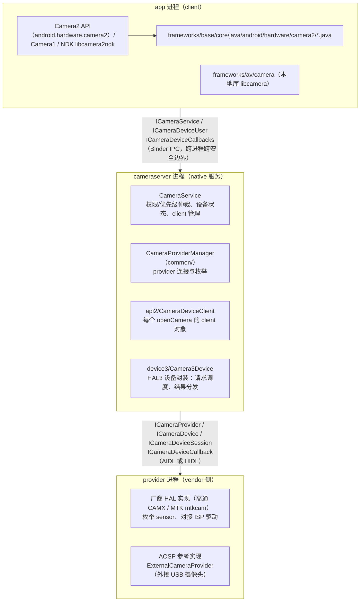
```mermaid
flowchart TB
    subgraph APP["app 进程（client）"]
        A1["Camera2 API（android.hardware.camera2）/ Camera1 / NDK libcamera2ndk"]
        A2["frameworks/base/core/java/android/hardware/camera2/*.java"]
        A3["frameworks/av/camera（本地库 libcamera）"]
    end
    subgraph CS["cameraserver 进程（native 服务）"]
        C1["CameraService<br/>权限/优先级仲裁、设备状态、client 管理"]
        C2["CameraProviderManager（common/）<br/>provider 连接与枚举"]
        C3["api2/CameraDeviceClient<br/>每个 openCamera 的 client 对象"]
        C4["device3/Camera3Device<br/>HAL3 设备封装：请求调度、结果分发"]
    end
    subgraph VP["provider 进程（vendor 侧）"]
        P1["厂商 HAL 实现（高通 CAMX / MTK mtkcam）<br/>枚举 sensor、对接 ISP 驱动"]
        P2["AOSP 参考实现<br/>ExternalCameraProvider（外接 USB 摄像头）"]
    end
    A1 --> A2
    APP -- "ICameraService / ICameraDeviceUser<br/>ICameraDeviceCallbacks（Binder IPC，跨进程跨安全边界）" --> CS
    CS -- "ICameraProvider / ICameraDevice / ICameraDeviceSession<br/>ICameraDeviceCallback（AIDL 或 HIDL）" --> VP
```

- **app 进程**只持有两个远端代理：`ICameraService`（服务入口）和 `ICameraDeviceUser`（每台已打开相机的会话句柄）；同时暴露一个回调 `ICameraDeviceCallbacks` 供 cameraserver 回调结果。
- **cameraserver 进程**是权力中心：所有权限检查（`CAMERA` 权限、appops）、client 优先级仲裁（前后台）、设备状态广播都发生在这里。它向下通过 `CameraProviderManager` 与一个或多个 provider 进程通信。
- **provider 进程**运行厂商 HAL，负责把 sensor/ISP 驱动包装成 `ICameraProvider/ICameraDevice/ICameraDeviceSession` 接口。它与 cameraserver 之间同样有反向回调 `ICameraDeviceCallback`（帧结果、shutter、错误）。

> 进程边界即安全边界：应用永远无法直接触碰 HAL，cameraserver 挡在中间做沙箱隔离与资源仲裁。

## 1.2 源码地图

| 目录 | 职责 | 代表文件 |
|---|---|---|
| `frameworks/base/core/java/android/hardware/camera2` | Java 框架层：Camera2 API 的实现本体 | `CameraManager.java`（内含 `CameraManagerGlobal` 单例）、`CameraDeviceImpl.java`、`CameraCaptureSessionImpl.java` |
| `frameworks/av/camera` | 相机本地库 `libcamera`：Binder 代理、元数据封送、Camera1 实现 | `aidl/android/hardware/ICameraService.aidl`、`CameraMetadata.cpp`、`Camera.cpp`（API1） |
| `frameworks/av/camera/ndk` | NDK libcamera2ndk 实现 | `NdkCameraManager.cpp` 等 |
| `frameworks/av/services/camera/libcameraservice` | cameraserver 服务本体（见下） | `CameraService.cpp/h` |
| └ `common/` | 跨 API 层复用的公共组件 | `CameraProviderManager.cpp/h`、`common/aidl/AidlProviderInfo.*`、`common/hidl/HidlProviderInfo.*`、`Camera2ClientBase.*`、`CameraDeviceBase.*` |
| └ `aidl/`、`hidl/` | **main 分支新增**：框架↔HAL 的 AIDL/HIDL 双栈适配器 | `aidl/AidlCameraDeviceUser.cpp`、`hidl/HidlCameraDeviceUser.cpp` |
| └ `api1/`、`api2/` | Camera1 / Camera2 两种 client 实现 | `api2/CameraDeviceClient.cpp`、`api1/Camera2Client.cpp` |
| └ `device3/` | HAL3 设备的框架侧封装 | `Camera3Device.cpp/h`、`device3/aidl/`、`device3/hidl/`、`device3/deprecated/` |
| `hardware/interfaces/camera` | HAL 接口定义（AIDL + HIDL 兼容层） | `provider/aidl/android/hardware/camera/provider/ICameraProvider.aidl`、`device/aidl/...` |
| `system/media/camera` | 元数据定义与 C API | `include/system/camera_metadata*.h`、`docs/metadata_definitions.xml` |

**main 分支重构要点**（阅读旧资料时需注意）：

1. `CameraProviderManager` 从 libcameraservice 根目录移到了 `common/` 子目录；HIDL/AIDL 两套 `ProviderInfo` 拆分为 `common/hidl/HidlProviderInfo.*` 与 `common/aidl/AidlProviderInfo.*`。
2. HAL 的 AIDL/HIDL 差异被封装进独立的适配器类（`aidl/`、`hidl/` 子目录，以及 `device3/aidl`、`device3/hidl`、`device3/deprecated`），`Camera3Device` 本体不再直接感知传输层。
3. `hardware/interfaces/camera/provider/default/` 现在**只剩外接 USB 摄像头 provider**（`ExternalCameraProvider` + `external-service.cpp`）；内置摄像头的 provider 默认实现已下沉到各设备/厂商树（模拟器、Pixel 均有各自实现）。
4. 新增 `FwkOnlyMetadataTags.h`：框架私有的元数据 tag 集中在此。

## 1.3 cameraserver 进程启动

来源：[main_cameraserver.cpp](https://android.googlesource.com/platform/frameworks/av/+/refs/heads/main/camera/cameraserver/main_cameraserver.cpp)、[CameraService.cpp](https://android.googlesource.com/platform/frameworks/av/+/refs/heads/main/services/camera/libcameraservice/CameraService.cpp)

`main_cameraserver.cpp` 全文不到 50 行，流程一目了然：

```cpp
int main(int argc, char** argv) {
    signal(SIGPIPE, SIG_IGN);
    hardware::configureRpcThreadpool(5, /*willjoin*/ false);   // HIDL binder 线程池：5 线程
    ABinderProcess_setThreadPoolMaxThreadCount(5);             // AIDL binder 线程池：5 线程

    sp<ProcessState> proc(ProcessState::self());               // 初始化 binder 进程状态
    sp<IServiceManager> sm = defaultServiceManager();
    CameraService::instantiate();                              // 核心：注册 "media.camera" 服务
    ProcessState::self()->startThreadPool();                   // 启动 HIDL binder 线程池
    ABinderProcess_startThreadPool();                          // 启动 AIDL binder 线程池

    IPCThreadState::self()->joinThreadPool();                  // 主线程加入 HIDL 线程池
    ABinderProcess_joinThreadPool();                           // 主线程加入 AIDL 线程池
}
```

要点：

- **双栈线程池**：cameraserver 同时服务 HIDL 与 AIDL 两种 binder 调用（HIDL 面向旧 vendor HAL 与 VNDK 客户端，AIDL 面向框架与新一代 HAL），各配 5 个线程。
- `CameraService::instantiate()`（CameraService.cpp:211）只是调用 `CameraService::publish(true)`——`BinderService` 模板把 `new CameraService()` 并以 **`"media.camera"`** 为名 `addService` 到 servicemanager；`publish(true)` 允许隔离 AID（isolated 进程）的 binder 调用。
- `instantiate()` 触发首次强引用 → **`CameraService::onFirstRef()`**（CameraService.cpp:224）执行真正的初始化，见下一节。

`onFirstRef()` 的关键步骤（CameraService.cpp:224-275）：


```mermaid
flowchart TD
    A["CameraService::onFirstRef()"] --> B["BnCameraService::onFirstRef()"]
    A --> C["BatteryNotifier::noteResetCamera/Flashlight<br/>服务重启时重置电量统计"]
    A --> D["enumerateProviders()<br/>★ 初始化 provider 管理器并枚举设备（见 1.4）"]
    A --> E["mUidPolicy->registerSelf()<br/>注册 UidObserver：跟踪前后台 → client 优先级"]
    A --> F["mSensorPrivacyPolicy->registerSelf()<br/>摄像头物理隐私开关监听"]
    A --> G["mInjectionStatusListener = new InjectionStatusListener(this)"]
    A --> H["checkService(appops)<br/>失败则 registerForNotifications 等待"]
    A --> I["HidlCameraService::registerAsService()<br/>VNDK HIDL 接口 2.2（已废弃，失败仅告警）"]
    A --> J["AidlCameraService::registerService()<br/>VNDK AIDL 接口（vendor 客户端用）"]
    A --> K["pingCameraServiceProxy()<br/>源码注释：刻意放最后，尽量贴近 addService 时刻"]
```

## 1.4 provider 注册与设备枚举链路（本章重点）

来源：[CameraService.cpp](https://android.googlesource.com/platform/frameworks/av/+/refs/heads/main/services/camera/libcameraservice/CameraService.cpp)、[CameraProviderManager.cpp](https://android.googlesource.com/platform/frameworks/av/+/refs/heads/main/services/camera/libcameraservice/common/CameraProviderManager.cpp)、[AidlProviderInfo.cpp](https://android.googlesource.com/platform/frameworks/av/+/refs/heads/main/services/camera/libcameraservice/common/aidl/AidlProviderInfo.cpp)、[external-service.cpp](https://android.googlesource.com/platform/hardware/interfaces/+/refs/heads/main/camera/provider/default/external-service.cpp)

### 1.4.1 provider 侧：服务如何注册

以 AOSP 自带的外接摄像头 provider 为例（`external-service.cpp`，内置摄像头 provider 的注册方式完全相同）：

```cpp
int main() {
    ABinderProcess_setThreadPoolMaxThreadCount(6);
    std::shared_ptr<ExternalCameraProvider> defaultProvider =
            ndk::SharedRefBase::make<ExternalCameraProvider>();
    const std::string serviceName =
            std::string(ExternalCameraProvider::descriptor) + "/external/0";
    // 普通服务 or lazy 服务（LAZY_SERVICE 宏控制，lazy HAL 空闲时可被杀、用时拉起）
    AServiceManager_addService(defaultProvider->asBinder().get(), serviceName.c_str());
    ABinderProcess_joinThreadPool();
}
```

服务名格式为 **`接口描述符/实例名`**，例如：
- `android.hardware.camera.provider.ICameraProvider/external/0`（外接）
- `android.hardware.camera.provider.ICameraProvider/internal/0`（内置，由各设备树实现）
- HIDL 时代则是 `android.hardware.camera.provider@2.6/legacy/0` 等旧格式，框架同时兼容。

### 1.4.2 框架侧：发现与连接 provider

`onFirstRef()` → `enumerateProviders()`（CameraService.cpp:277）触发整条链：

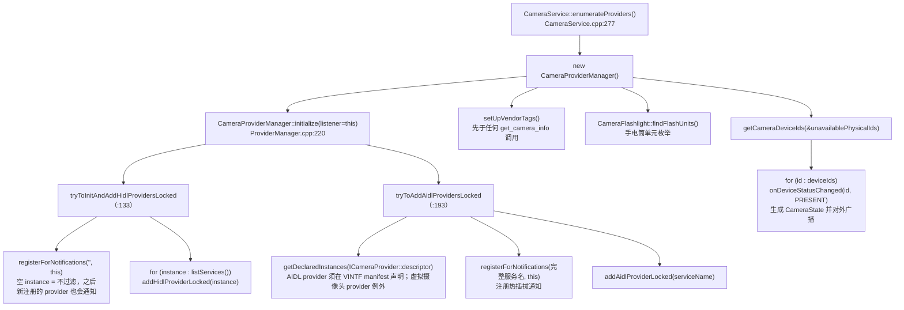
```mermaid
flowchart TD
    EP["CameraService::enumerateProviders()<br/>CameraService.cpp:277"] --> PM["new CameraProviderManager()"]
    PM --> INIT["CameraProviderManager::initialize(listener=this)<br/>ProviderManager.cpp:220"]
    INIT --> HIDL["tryToInitAndAddHidlProvidersLocked（:133）"]
    HIDL --> H1["registerForNotifications('', this)<br/>空 instance = 不过滤，之后新注册的 provider 也会通知"]
    HIDL --> H2["for (instance : listServices())<br/>addHidlProviderLocked(instance)"]
    INIT --> AIDL["tryToAddAidlProvidersLocked（:193）"]
    AIDL --> A1["getDeclaredInstances(ICameraProvider::descriptor)<br/>AIDL provider 须在 VINTF manifest 声明；虚拟摄像头 provider 例外"]
    AIDL --> A2["registerForNotifications(完整服务名, this)<br/>注册热插拔通知"]
    AIDL --> A3["addAidlProviderLocked(serviceName)"]
    PM --> VT["setUpVendorTags()<br/>先于任何 get_camera_info 调用"]
    PM --> FL["CameraFlashlight::findFlashUnits()<br/>手电筒单元枚举"]
    PM --> IDS["getCameraDeviceIds(&unavailablePhysicalIds)"]
    IDS --> ST["for (id : deviceIds)<br/>onDeviceStatusChanged(id, PRESENT)<br/>生成 CameraState 并对外广播"]
```

`addAidlProviderLocked`（ProviderManager.cpp:2471）的处理值得细读：

- 为防 provider 升级期间新旧实例短暂并存，每个实例名追加 `"-<序号>"` 后缀（`mProviderInstanceId` 计数）；
- 同名 provider 已存在时：懒加载 HAL（external lazy HAL）或已知 binder 直接返回 `ALREADY_EXISTS`，否则等待旧实例移除后再初始化新实例；
- 真正的连接在 `tryToInitializeAidlProviderLocked`（:2409）：**`tryGetService`（非阻塞）** 而非 `waitForService`——懒加载 provider 不在此处唤醒；拿到 `ICameraProvider` binder 后调用 `AidlProviderInfo::initializeAidlProvider(interface, mDeviceState)`，并（在 watchdog flag 打开时）记录 provider 进程 pid 供 CameraServiceWatchdog 监控。

### 1.4.3 与单个 provider 的握手：枚举相机设备

`AidlProviderInfo::initializeAidlProvider`（AidlProviderInfo.cpp:109）是与一个 provider 完整握手的全过程：

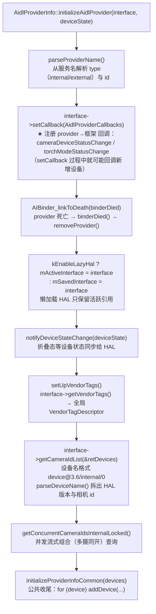
```mermaid
flowchart TD
    A["AidlProviderInfo::initializeAidlProvider(interface, deviceState)"] --> B["parseProviderName()<br/>从服务名解析 type（internal/external）与 id"]
    B --> C["interface->setCallback(AidlProviderCallbacks)<br/>★ 注册 provider→框架 回调：<br/>cameraDeviceStatusChange / torchModeStatusChange<br/>（setCallback 过程中就可能回调新增设备）"]
    C --> D["AIBinder_linkToDeath(binderDied)<br/>provider 死亡 → binderDied() → removeProvider()"]
    D --> E["kEnableLazyHal ? mActiveInterface = interface<br/>: mSavedInterface = interface<br/>懒加载 HAL 只保留活跃引用"]
    E --> F["notifyDeviceStateChange(deviceState)<br/>折叠态等设备状态同步给 HAL"]
    F --> G["setUpVendorTags()<br/>interface->getVendorTags() → 全局 VendorTagDescriptor"]
    G --> H["interface->getCameraIdList(&retDevices)<br/>设备名格式 device@3.6/internal/0<br/>parseDeviceName() 拆出 HAL 版本与相机 id"]
    H --> I["getConcurrentCameraIdsInternalLocked()<br/>并发流式组合（多摄同开）查询"]
    I --> J["initializeProviderInfoCommon(devices)<br/>公共收尾：for (device) addDevice(...)"]
```

`addDevice`（ProviderManager.cpp:2637）为每个设备名创建对应的 `DeviceInfo3`（AIDL 栈为 `AidlDeviceInfo3`），通过 `getCameraDeviceInterface` 取到 `ICameraDevice` 句柄并拉取 `CameraCharacteristics`，最终挂入 `provider->mDevices`。`getCameraDeviceIds()`（ProviderManager.cpp:274）遍历所有 provider 的 `mUniqueCameraIds` 汇总成全局设备表——这就是 `onDeviceStatusChanged(id, PRESENT)` 的数据来源。

### 1.4.4 热插拔与 provider 死亡

- **新 provider 出现**（如插入 USB 摄像头、lazy HAL 首次启动）：servicemanager 的通知回调 `onRegistration` → `addAidlProviderLocked/addHidlProviderLocked` → 初始化成功后回调 `CameraService::onNewProviderRegistered()`（CameraService.cpp:369）→ **重新执行 `enumerateProviders()`**，把增量设备以 `PRESENT` 状态广播给所有 listener。
- **provider 进程死亡**：`AIBinder_linkToDeath` 注册的 `binderDied()`（AidlProviderInfo.cpp:203）→ `removeProvider()` → 该 provider 名下所有设备状态变为 `NOT_PRESENT`，正在使用它们的 client 收到断连错误（详见第 4 章）。
- **provider 回调新增/移除设备**：`setCallback` 注册的 `AidlProviderCallbacks` 在收到 `cameraDeviceStatusChange` 时直接触发 `addDevice`（ProviderManager.cpp:2919）或状态变更，无需重新枚举。

## 1.5 ICameraService.aidl：app 进程看到的服务接口

来源：[ICameraService.aidl](https://android.googlesource.com/platform/frameworks/av/+/refs/heads/main/camera/aidl/android/hardware/ICameraService.aidl)

这是 `CameraManager`（Java）与 `libcamera2ndk`（NDK）在 app 进程中持有的服务代理。main 分支全部方法如下：

| 方法 | 作用 | 典型调用方 |
|---|---|---|
| `getNumberOfCameras(type, attribution, devicePolicy)` | API1 相机数量（type: CAMERA_TYPE_ALL/FIRST/BACKWARD…） | Camera1 API |
| `getCameraInfo(cameraId, rotationOverride, attribution)` | API1 相机朝向等信息 | Camera1 API |
| `connect(ICameraClient, …)` | **API1** 打开相机，返回 `ICamera` | Camera1 |
| `connectDevice(ICameraDeviceCallbacks, cameraId, …)` | **API2/NDK** 打开相机，返回 `ICameraDeviceUser` | Camera2 / NDK |
| `addListener(ICameraServiceListener)` | 注册状态监听，**返回值即当前全部设备状态快照** | CameraManager / NDK |
| `removeListener(listener)` | 注销监听 | 同上 |
| `getCameraCharacteristics(cameraId, targetSdkVersion, rotationOverride, attribution)` | 静态元数据（能力查询） | CameraManager.getCameraCharacteristics |
| `getCameraVendorTagDescriptor()` / `getCameraVendorTagCache()` | vendor tag 描述符 | 框架元数据层 |
| `supportsCameraApi(cameraId, apiVersion)` | 该 id 是否支持 CAMERA2/API |
| `isHiddenPhysicalCamera(cameraId)` | 是否为隐藏物理摄像头 | 多摄支持 |
| `getConcurrentCameraIds()` | 可并发流式打开的相机组合 | 多摄同开 |
| `isConcurrentSessionConfigurationSupported(…)` | 并发会话配置检查 | 同上 |
| `setTorchMode(cameraId, enabled, clientBinder, attributions)` | 手电筒（无需 openCamera） | CameraManager.setTorchMode |
| `turnOnTorchWithStrengthLevel(...)` / `getTorchStrengthLevel(...)` | 手电筒亮度调节 | Android 13+ |
| `injectCamera(packageName, internalCamId, externalCamId, client, callback)` / `injectSessionParams(...)` | 相机注入（测试/虚拟设备） | CTS / 虚拟摄像头 |
| `notifySystemEvent(eventId, args)` | 系统事件广播（oneway） | 框架内部 |
| `notifyDisplayConfigurationChange()` | 屏幕配置变化通知（oneway） | 框架内部 |
| `notifyDeviceStateChange(newState)` | 折叠屏等设备状态变化（oneway） | 框架内部 |
| `createDefaultRequest(cameraId, templateId, …)` | 在服务侧构造某 template 的默认请求 | 隐藏 API（快速路径） |
| `isSessionConfigurationWithParametersSupported(...)` / `getSessionCharacteristics(...)` | 会话参数预检查 | Android 15+ |

**一个容易误解的点**：`ICameraService.aidl` 中**没有 `getCameraIdList` 方法**。API2 应用调用 `CameraManager.getCameraIdList()` 时，数据并不来自一次 binder 查询，而是来自 `CameraManagerGlobal` 在 `registerListener()` 时调用 `addListener()` 拿到的**状态快照**（`addListenerHelper` 返回 `CameraStatus[]`，CameraService.cpp:3423），再加上此后持续收到的 `onStatusChanged` 回调维护的本地缓存。`getNumberOfCameras`/`getCameraInfo` 则是 API1 专用的独立查询（CameraService.cpp:808）。

---

> 下一章（第 2 章）将从 `openCamera()` 出发，沿 `connectDevice` 深入 cameraserver 的 client 创建与优先级仲裁。


# 第 2 章 openCamera 完整调用链

> 本章基于 AOSP main 分支（2026-09 时点）真实源码整理，所有函数名、行号均出自所列源文件。沿一次 `openCamera()` 从 Java 层一路走到 provider 进程的 HAL `ICameraDevice::open`，并完整拆解 cameraserver 的权限校验、优先级仲裁与驱逐逻辑。流程图均为 Mermaid 语法。

## 2.1 Java 层：CameraManager.openCamera 与 openCameraDeviceUserAsync

> 来源：[CameraManager.java](https://android.googlesource.com/platform/frameworks/base/+/refs/heads/main/core/java/android/hardware/camera2/CameraManager.java)、[CameraDeviceImpl.java](https://android.googlesource.com/platform/frameworks/base/+/refs/heads/main/core/java/android/hardware/camera2/impl/CameraDeviceImpl.java)

应用可用的 `openCamera` 是一组重载，全部收敛到 `openCameraImpl`：

| 公开/隐藏入口 | 行号 | 说明 |
|---|---|---|
| `openCamera(String, StateCallback, Handler)` | CameraManager.java:1261 | Handler 版；`checkAndWrapHandler` 把 Handler 包成 Executor |
| `openCamera(String, Executor, StateCallback)` | CameraManager.java:1344 | Executor 版（公开 API 主路径） |
| `openSharedCamera(String, Executor, StateCallback)` | CameraManager.java:1389 | SystemApi，shared 模式打开（多 client 共享） |
| `openCamera(String, int oomScoreOffset, Executor, StateCallback)` | CameraManager.java:1456 | SystemApi，可主动降低自身仲裁优先级 |
| `openCameraImpl(cameraId, callback, executor, oomScoreOffset, rotationOverride, sharedMode)` | CameraManager.java:1493 | 全部重载的汇合点 |

**入参校验**（按代码实际顺序）：

1. Executor 版与 shared 版在入口处检查 `executor == null` 抛 `IllegalArgumentException`（CameraManager.java:1348）；`oomScoreOffset < 0` 直接抛异常（:1462，注释明确"cannot increase priority of camera client"）。
2. Handler 版经 `CameraDeviceImpl.checkAndWrapHandler(handler)`（CameraDeviceImpl.java:2770）→ `checkHandler`（:2782）：handler 为 null 时取当前线程 `Looper.myLooper()`，当前线程没有 Looper 则抛 `IllegalArgumentException`；随后包装成 `CameraHandlerExecutor`。
3. `openCameraImpl`（:1498）检查 `cameraId == null`、`callback == null`；`CameraManagerGlobal.sCameraServiceDisabled` 为 true（系统属性 `config.disable_cameraservice`）则抛 `"No cameras available on device"`（:1503）。

`openCameraDeviceUserAsync`（CameraManager.java:1095）是 Java 层核心，全程持有 `mLock`：

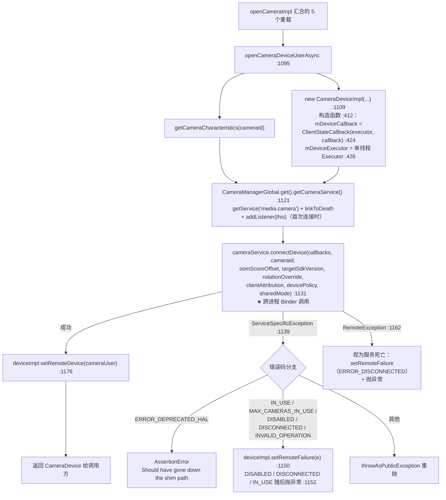
```mermaid
flowchart TD
    A["openCameraImpl 汇合的 5 个重载"] --> B["openCameraDeviceUserAsync :1095"]
    B --> C["getCameraCharacteristics(cameraId)"]
    B --> D["new CameraDeviceImpl(...) :1109<br/>构造函数 :412：mDeviceCallback =<br/>ClientStateCallback(executor, callback) :424<br/>mDeviceExecutor = 单线程 Executor :426"]
    C --> E["CameraManagerGlobal.get().getCameraService() :1121<br/>getService('media.camera') + linkToDeath<br/>+ addListener(this)（首次连接时）"]
    D --> E
    E --> F["cameraService.connectDevice(callbacks, cameraId,<br/>oomScoreOffset, targetSdkVersion, rotationOverride,<br/>clientAttribution, devicePolicy, sharedMode) :1131<br/>★ 跨进程 Binder 调用"]
    F -->|成功| G["deviceImpl.setRemoteDevice(cameraUser) :1176"]
    F -->|ServiceSpecificException :1139| H{"错误码分支"}
    H -->|ERROR_DEPRECATED_HAL| I["AssertionError<br/>Should have gone down the shim path"]
    H -->|IN_USE / MAX_CAMERAS_IN_USE /<br/>DISABLED / DISCONNECTED / INVALID_OPERATION| J["deviceImpl.setRemoteFailure(e) :1150<br/>DISABLED / DISCONNECTED / IN_USE 随后抛异常 :1152"]
    H -->|其他| K["throwAsPublicException 重抛"]
    F -->|RemoteException :1162| L["视为服务死亡：setRemoteFailure<br/>（ERROR_DISCONNECTED）+ 抛异常"]
    G --> M["返回 CameraDevice 给调用方"]
```

`CameraManagerGlobal` 是进程内单例（`gCameraManager` 静态常量，CameraManager.java:2258；`get()` :2314），内部持有 `mCameraService` 并实现 `ICameraServiceListener.Stub`。`getCameraService()`（:2357）→ `connectCameraServiceLocked()`（:2373）：按服务名 `"media.camera"`（:2264）`getService`、对 binder `linkToDeath`、然后 `addListener(this)` 拿设备状态快照——所以打开相机前服务代理通常已就绪，`openCamera` 只是调用它。

**onOpened / onDisconnected / onError 的触发时机**（全部在 app 进程内、经 `mDeviceExecutor` 单线程串行派发）：

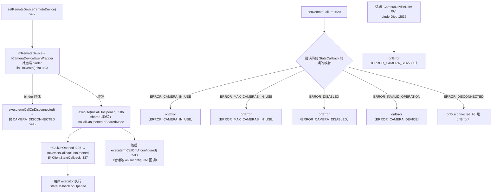
```mermaid
flowchart TD
    A["setRemoteDevice(remoteDevice) :477"] --> B["mRemoteDevice = ICameraDeviceUserWrapper<br/>对远端 binder linkToDeath(this) :493"]
    B -->|binder 已死| C["execute(mCallOnDisconnected) +<br/>抛 CAMERA_DISCONNECTED :495"]
    B -->|正常| D["execute(mCallOnOpened) :506<br/>shared 模式为 mCallOnOpenedInSharedMode"]
    D --> E["mCallOnOpened :206 → mDeviceCallback.onOpened<br/>即 ClientStateCallback :337"]
    E --> F["用户 executor 执行 StateCallback.onOpened"]
    D --> G["随后 execute(mCallOnUnconfigured) :508<br/>（会话级 onUnconfigured 回调）"]
    H["setRemoteFailure :520"] --> I{"错误码到 StateCallback 错误的映射"}
    I -->|ERROR_CAMERA_IN_USE| J["onError（ERROR_CAMERA_IN_USE）"]
    I -->|ERROR_MAX_CAMERAS_IN_USE| K["onError（ERROR_MAX_CAMERAS_IN_USE）"]
    I -->|ERROR_DISABLED| L["onError（ERROR_CAMERA_DISABLED）"]
    I -->|ERROR_INVALID_OPERATION| M["onError（ERROR_CAMERA_DEVICE）"]
    I -->|ERROR_DISCONNECTED| N["onDisconnected（不是 onError）"]
    O["远端 ICameraDeviceUser 死亡<br/>binderDied :2836"] --> P["onError（ERROR_CAMERA_SERVICE）"]
```

要点：

- **onOpened 的时机在 `connectDevice` 返回之后**：`setRemoteDevice` 把返回的 `ICameraDeviceUser` 包一层 `ICameraDeviceUserWrapper`，注册死亡监听，然后投递 `mCallOnOpened`。所以"打开成功"的回调永远晚于 binder 返回，且与后续所有设备回调共享同一个单线程 executor。
- **onDisconnected** 有两个来源：`setRemoteFailure` 收到 `ERROR_DISCONNECTED`（例如设备被拔出、被更高优先级驱逐后服务拒绝），或 `setRemoteDevice` 中 `linkToDeath` 立刻失败。
- **onError** 映射由 `setRemoteFailure`（:524-544）的 switch 完成；`binderDied`（:2836，远端 cameraserver 侧对象死亡）固定上报 `ERROR_CAMERA_SERVICE`。
- `onError` 与异常并不互斥：`ERROR_DISABLED/DISCONNECTED/CAMERA_IN_USE` 这三种既触发回调又抛 `CameraAccessException`（源码注释："Per API docs, these failures call onError and throw"）。

## 2.2 跨进程：ICameraService.connectDevice 的参数与返回值

> 来源：[ICameraService.aidl](https://android.googlesource.com/platform/frameworks/av/+/refs/heads/main/camera/aidl/android/hardware/ICameraService.aidl)

main 分支的实际签名（ICameraService.aidl:162）：

```aidl
ICameraDeviceUser connectDevice(ICameraDeviceCallbacks callbacks,
        @utf8InCpp String cameraId,
        int oomScoreOffset,
        int targetSdkVersion,
        int rotationOverride,
        in AttributionSourceState clientAttribution,
        int devicePolicy,
        boolean sharedMode);
```

| 参数 | 方向 | 含义 |
|---|---|---|
| `callbacks` | app → service | app 侧 `CameraDeviceImpl` 内的 `CameraDeviceCallbacks` stub，cameraserver 用它回调错误/结果 |
| `cameraId` | app → service | 字符串相机 id（可能为虚拟设备映射前的 id，服务侧会 resolve） |
| `oomScoreOffset` | app → service | 请求服务侧给本 client 的 oom score 偏移，必须 ≥ 0 |
| `targetSdkVersion` | app → service | 应用 targetSdk，服务侧按版本走兼容行为 |
| `rotationOverride` | app → service | `ROTATION_OVERRIDE_NONE/ROTATION_OVERRIDE_OVERRIDE_TO_PORTRAIT/ROTATION_OVERRIDE_ROTATION_ONLY`（:88-90） |
| `clientAttribution` | app → service | `AttributionSourceState`：uid、pid、packageName、attributionTag、deviceId 等（旧版的 packageName+featureId 已被它取代） |
| `devicePolicy` | app → service | 上下文设备策略，决定虚拟相机是否可见 |
| `sharedMode` | app → service | 是否以 shared 模式打开（需 SYSTEM_CAMERA 权限，仅 system-only 相机支持，见 2.3） |

**返回值与错误传播**：成功返回 `ICameraDeviceUser`；失败不通过返回值，而是以 AIDL service-specific error 传出，Java 侧表现为 `ServiceSpecificException`，错误码即 ICameraService.aidl:48-57 的常量：

| 错误码 | 值 | 典型场景 |
|---|---|---|
| `ERROR_PERMISSION_DENIED` | 1 | 无 CAMERA/SYSTEM_CAMERA 权限 |
| `ERROR_ALREADY_EXISTS` | 2 | 资源已存在 |
| `ERROR_ILLEGAL_ARGUMENT` | 3 | cameraId 非法、oomScoreOffset < 0 |
| `ERROR_DISCONNECTED` | 4 | 设备不存在/已断连 |
| `ERROR_TIMED_OUT` | 5 | 连接超时 |
| `ERROR_DISABLED` | 6 | 设备策略禁用、后台 uid、隐私开关 |
| `ERROR_CAMERA_IN_USE` | 7 | 更高优先级 client 占用 |
| `ERROR_MAX_CAMERAS_IN_USE` | 8 | 资源总量超限 |
| `ERROR_DEPRECATED_HAL` | 9 | 旧 HAL（main 分支已直接拒绝） |
| `ERROR_INVALID_OPERATION` | 10 | 其他异常 |

服务侧 native 实现中这些码经 `STATUS_ERROR` 宏变成 `Status::fromServiceSpecificError`。返回的 `ICameraDeviceUser` 实体就是 cameraserver 里的 `CameraDeviceClient` 对象——`CameraDeviceClientBase : public CameraService::BasicClient, public hardware::camera2::BnCameraDeviceUser`（CameraDeviceClient.h:48-51），即框架自动生成的 binder stub。

## 2.3 cameraserver 侧完整链路：connectDevice → HAL ICameraDevice::open

> 来源：[CameraService.cpp](https://android.googlesource.com/platform/frameworks/av/+/refs/heads/main/services/camera/libcameraservice/CameraService.cpp)、[CameraService.h](https://android.googlesource.com/platform/frameworks/av/+/refs/heads/main/services/camera/libcameraservice/CameraService.h)、[CameraDeviceClient.cpp](https://android.googlesource.com/platform/frameworks/av/+/refs/heads/main/services/camera/libcameraservice/api2/CameraDeviceClient.cpp)、[Camera2ClientBase.cpp](https://android.googlesource.com/platform/frameworks/av/+/refs/heads/main/services/camera/libcameraservice/common/Camera2ClientBase.cpp)、[Camera3Device.cpp](https://android.googlesource.com/platform/frameworks/av/+/refs/heads/main/services/camera/libcameraservice/device3/Camera3Device.cpp)、[AidlCamera3Device.cpp](https://android.googlesource.com/platform/frameworks/av/+/refs/heads/main/services/camera/libcameraservice/device3/aidl/AidlCamera3Device.cpp)、[CameraProviderManager.cpp](https://android.googlesource.com/platform/frameworks/av/+/refs/heads/main/services/camera/libcameraservice/common/CameraProviderManager.cpp)

main 分支把入口拆成三层：`connectDevice`（:2287，framework 客户端）与 `connectDeviceVendor`（:2299，VNDK vendor 客户端）都只是给 `connectDeviceImpl`（:2311）传不同的 `isVendorClient`。

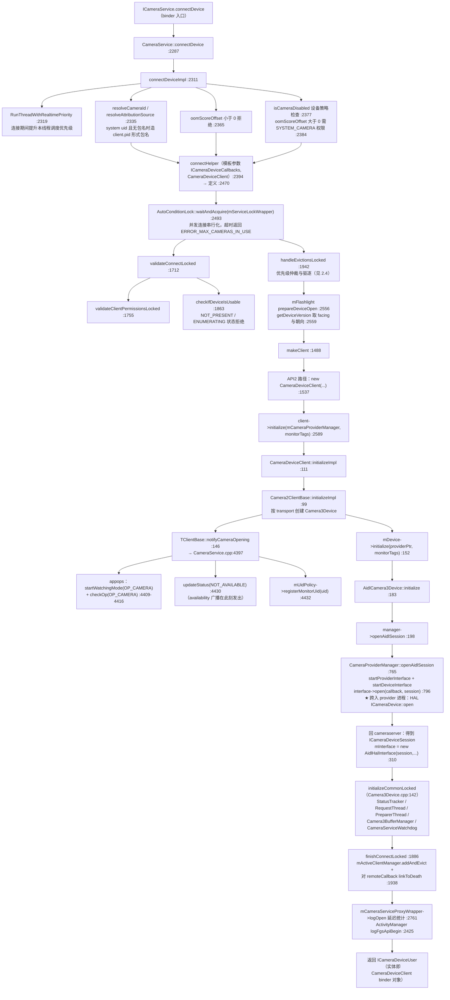
```mermaid
flowchart TD
    A["ICameraService.connectDevice（binder 入口）"] --> B["CameraService::connectDevice :2287"]
    B --> C["connectDeviceImpl :2311"]
    C --> C0["RunThreadWithRealtimePriority :2319<br/>连接期间提升本线程调度优先级"]
    C --> C1["resolveCameraId / resolveAttributionSource :2335<br/>system uid 且无包名时造 client.pid 形式包名"]
    C --> C2["oomScoreOffset 小于 0 拒绝 :2365"]
    C --> C3["isCameraDisabled 设备策略检查 :2377<br/>oomScoreOffset 大于 0 需 SYSTEM_CAMERA 权限 :2384"]
    C1 --> D["connectHelper（模板参数 ICameraDeviceCallbacks,<br/>CameraDeviceClient）:2394 → 定义 :2470"]
    C2 --> D
    C3 --> D
    D --> E["AutoConditionLock::waitAndAcquire(mServiceLockWrapper) :2493<br/>并发连接串行化，超时返回 ERROR_MAX_CAMERAS_IN_USE"]
    E --> F["validateConnectLocked :1712"]
    F --> F1["validateClientPermissionsLocked :1755"]
    F --> F2["checkIfDeviceIsUsable :1863<br/>NOT_PRESENT / ENUMERATING 状态拒绝"]
    E --> G["handleEvictionsLocked :1942<br/>优先级仲裁与驱逐（见 2.4）"]
    G --> H["mFlashlight prepareDeviceOpen :2556<br/>getDeviceVersion 取 facing 与朝向 :2559"]
    H --> I["makeClient :1488"]
    I --> I1["API2 路径：new CameraDeviceClient(...) :1537"]
    I1 --> J["client->initialize(mCameraProviderManager,<br/>monitorTags) :2589"]
    J --> K["CameraDeviceClient::initializeImpl :111"]
    K --> K1["Camera2ClientBase::initializeImpl :99<br/>按 transport 创建 Camera3Device"]
    K1 --> L["TClientBase::notifyCameraOpening :146<br/>→ CameraService.cpp:4397"]
    L --> L1["appops：startWatchingMode(OP_CAMERA)<br/>+ checkOp(OP_CAMERA) :4409-4416"]
    L --> L2["updateStatus(NOT_AVAILABLE) :4430<br/>（availability 广播在此刻发出）"]
    L --> L3["mUidPolicy->registerMonitorUid(uid) :4432"]
    K1 --> M["mDevice->initialize(providerPtr, monitorTags) :152"]
    M --> N["AidlCamera3Device::initialize :183"]
    N --> O["manager->openAidlSession :198"]
    O --> P["CameraProviderManager::openAidlSession :765<br/>startProviderInterface + startDeviceInterface<br/>interface->open(callback, session) :796<br/>★ 跨入 provider 进程：HAL ICameraDevice::open"]
    P --> Q["回 cameraserver：得到 ICameraDeviceSession<br/>mInterface = new AidlHalInterface(session,...) :310"]
    Q --> R["initializeCommonLocked（Camera3Device.cpp:142）<br/>StatusTracker / RequestThread / PreparerThread /<br/>Camera3BufferManager / CameraServiceWatchdog"]
    R --> S["finishConnectLocked :1886<br/>mActiveClientManager.addAndEvict +<br/>对 remoteCallback linkToDeath :1938"]
    S --> T["mCameraServiceProxyWrapper->logOpen 延迟统计 :2761<br/>ActivityManager logFgsApiBegin :2425"]
    T --> U["返回 ICameraDeviceUser<br/>（实体即 CameraDeviceClient binder 对象）"]
```

分步说明：

1. **validateConnectLocked → validateClientPermissionsLocked**（CameraService.cpp:1712、:1755）。前者先做权限，再查 `mInitialized`、`getCameraState(cameraId)` 是否存在、`checkIfDeviceIsUsable`（:1863：状态为 `NOT_PRESENT` 返回 `-ENODEV`、`ENUMERATING` 返回 `-EBUSY`）。后者按序检查：
   - `shouldRejectSystemCameraConnection` / `getSystemCameraKind`：system-only 相机的准入（:1765-1776）；
   - `flags::camera_multi_client() && sharedMode` 时设备必须是 `SYSTEM_ONLY_CAMERA`（:1778）；
   - **CAMERA 权限**：`hasPermissionsForCamera(cameraId, clientAttributionWithDeviceId)`，非 cameraserver 自身调用（`callingPid != getpid()`）且非 system-only 设备时，无权限返回 `ERROR_PERMISSION_DENIED`（:1794-1802）；
   - **uid 状态检查**：`mUidPolicy->isUidActive(callingUid, clientName)`，不活跃（后台）直接 `ERROR_DISABLED`，日志附带当前 proc state（:1805-1814）；
   - **sensor privacy**：隐私开关打开时拒绝（automotive 例外，:1819-1826）；
   - **多用户**：`mAllowedUsers` 白名单检查（:1835-1843）；headless system user 模式额外要求 `CAMERA_HEADLESS_SYSTEM_USER` 权限（:1845-1858）。
   > 注意：appops 的 `OP_CAMERA` 不在这里查，而在 client 创建后的 `notifyCameraOpening`（:4397）里 `checkOp`，权限被 appops 忽略/报错时连接直接失败。

2. **handleEvictionsLocked**（:1942）：优先级仲裁主战场，详见 2.4。API1 的 MediaRecorder 同 binder 重复 connect 会直接返回既有 client（:1958-1972），API2 没有这条捷径。

3. **makeClient**（:1488）：HIDL 栈先校验设备版本（3.0~3.7 可用，1.0 返回 `ERROR_DEPRECATED_HAL`）；API2 路径 `new CameraDeviceClient(cameraService, tmp, ..., rotationOverride, originalCameraId, sharedMode, isVendorClient)`（:1537），构造函数（CameraDeviceClient.cpp:81）委托 `Camera2ClientBase`（Camera2ClientBase.cpp:55，打印 `Camera %s: Opened. Client: ...`）。

4. **client->initialize**（:2589）内部两层：
   - `Camera2ClientBase::initializeImpl`（Camera2ClientBase.cpp:99）：先 `getCameraIdIPCTransport` 问清该设备走 HIDL 还是 AIDL，据此创建 `HidlCamera3Device` 或 `AidlCamera3Device`（shared 模式为 `AidlCamera3SharedDevice`，:112-133）；然后 `notifyCameraOpening`（:146）、`mDevice->initialize`（:152）、`setNotifyCallback`（:161）。
   - `CameraDeviceClient::initializeImpl`（CameraDeviceClient.cpp:111）：基类成功后启动 `FrameProcessorBase` 线程（:121-123）并注册监听，读取 physical request keys 等静态能力。

5. **AidlCamera3Device::initialize**（AidlCamera3Device.cpp:183）：
   - `manager->openAidlSession(mId, mCallbacks, &session)`（:198），其中 `mCallbacks` 是框架侧 `AidlCameraDeviceCallbacks`（HAL → 框架的反向回调封装，:180）。
   - `CameraProviderManager::openAidlSession`（CameraProviderManager.cpp:765）：`startProviderInterface` → `startDeviceInterface` 拿到 HAL 的 `ICameraDevice`，然后 **`interface->open(callback, session)`（:796）——这就是跨入 provider 进程的那一次 binder 调用**，返回 `ICameraDeviceSession`。HIDL 栈对称：`openHidlSession`（:847）同样调用 `interface->open`。
   - 拿到 session 后：拉取 `getCameraCharacteristics`（:209）、与 HAL 交换请求/结果 FMQ 元数据队列（:264-291）、创建 `AidlHalInterface`（:310），最后 `initializeCommonLocked`（:352 → Camera3Device.cpp:142）。
   - `initializeCommonLocked`：启动 `StatusTracker` 线程（:145）、创建 `Camera3BufferManager`（:159）、启动请求队列线程 `RequestThread`（:194-198，线程名 `C3Dev-<id>-ReqQueue`）、创建 `PreparerThread`（:209）、状态置 `STATUS_UNCONFIGURED`（:211）、启动 `CameraServiceWatchdog`（:260）。

6. **finishConnectLocked**（:1886）：`makeClientDescriptor(client, partial, oomScoreOffset, systemNativeClient)` 构造正式描述符 → `mActiveClientManager.addAndEvict`（:1893，此时驱逐列表应为空，否则视为内部状态错误并 FATAL）→ camera_multi_client 打开时做 primary/secondary 仲裁（:1909-1929）→ 最后对 `remoteCallback`（app 侧回调 binder）`linkToDeath`（:1938），client 进程死亡才能被服务感知。

整个流程中 `mServiceLock` 只在 `connectHelper` 的花括号作用域内持有（:2491-2754），驱逐与 disconnect 刻意放到锁外执行，避免慢速 HAL 清理阻塞其他连接。

## 2.4 client 优先级体系：UidPolicy 前后台监听、优先级分数与驱逐

> 来源：[CameraService.cpp](https://android.googlesource.com/platform/frameworks/av/+/refs/heads/main/services/camera/libcameraservice/CameraService.cpp)（UidPolicy :4783-5080、handleEvictionsLocked :1942）、[CameraService.h](https://android.googlesource.com/platform/frameworks/av/+/refs/heads/main/services/camera/libcameraservice/CameraService.h)（UidPolicy :833-889）、[ClientManager.h](https://android.googlesource.com/platform/frameworks/av/+/refs/heads/main/services/camera/libcameraservice/utils/ClientManager.h)

### 2.4.1 优先级分数

优先级由 `resource_policy::ClientPriority`（ClientManager.h:63）表达：**score（即 oom_adj，数值越小优先级越高）+ state（proc state）+ isVendorClient 标记**。比较规则（:107-113）：先比 score，score 相同比 state。两个要点：

- `setScore`（:81-92）：`INVALID_ADJ` 一律折算为 `UNKNOWN_ADJ`（1001）；app 传入的 `oomScoreOffset` 直接加到 score 上（`mScore = mScoreOffset + score`），这正是"主动降级"的实现。
- system native client（vndk 直连 cameraserver 的进程）固定使用 `kSystemNativeClientScore = PERCEPTIBLE_APP_ADJ`（200）与 `PROCESS_STATE_PERSISTENT_UI`（CameraService.cpp:175-177）。

ClientManager.h:39-61 罗列了与 `frameworks/base/services/core/java/com/android/server/am/ProcessList.java` 对齐的 oom_adj 常量谱系：`FOREGROUND_APP_ADJ = 0`、`VISIBLE_APP_ADJ = 100`、`PERCEPTIBLE_APP_ADJ = 200`、`CACHED_APP_MIN_ADJ = 900`、`NATIVE_ADJ = -1000` 等——分数体系完全就是 AMS 的进程分级。

### 2.4.2 两套状态来源：UidPolicy 与 ProcessInfoService

- **UidPolicy**（前后台准入与监控）：`CameraService::onFirstRef` 时 `mUidPolicy->registerSelf()`（:4811），`checkService("activity")` 不可用则 `registerForNotifications` 等服务就绪，最终 `registerWithActivityManager`（:4783）调用 `registerUidObserverForUids`，订阅 `UID_OBSERVER_GONE | IDLE | ACTIVE | PROCSTATE | PROC_OOM_ADJ` 五类事件。
- **ProcessInfoService**（逐 client 的 oom score）：`handleEvictionsLocked` 每次连接时对所有活跃 client pid + 新 client pid 批量查询 `getProcessStatesScoresFromPids`（:2008），并 `mActiveClientManager.updatePriorities`（:2023，ClientManager.h:688）刷新存量 client 的分数——保证驱逐决策用的是实时值而非连接时的旧值。

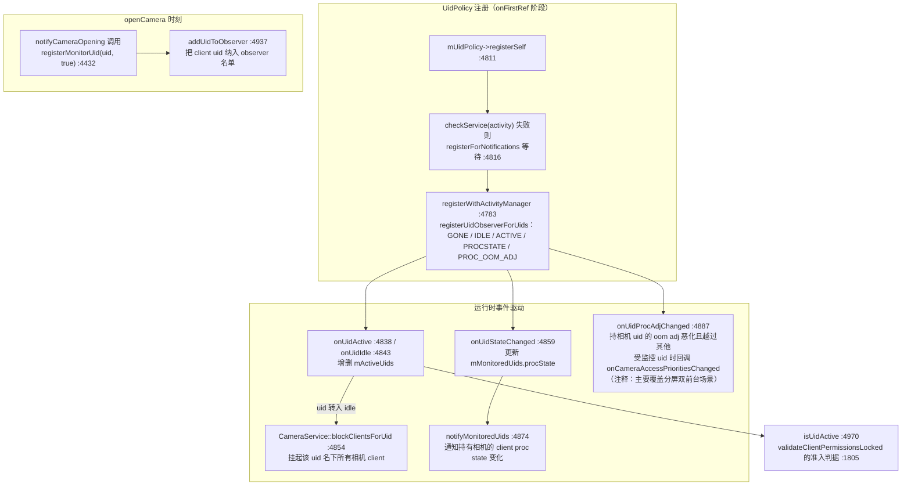
```mermaid
flowchart TD
    subgraph REG["UidPolicy 注册（onFirstRef 阶段）"]
        A["mUidPolicy->registerSelf :4811"] --> B["checkService(activity) 失败则<br/>registerForNotifications 等待 :4816"]
        B --> C["registerWithActivityManager :4783<br/>registerUidObserverForUids：<br/>GONE / IDLE / ACTIVE / PROCSTATE / PROC_OOM_ADJ"]
    end
    subgraph RUN["运行时事件驱动"]
        C --> D["onUidActive :4838 / onUidIdle :4843<br/>增删 mActiveUids"]
        D -->|uid 转入 idle| E["CameraService::blockClientsForUid :4854<br/>挂起该 uid 名下所有相机 client"]
        C --> F["onUidStateChanged :4859<br/>更新 mMonitoredUids.procState"]
        F --> G["notifyMonitoredUids :4874<br/>通知持有相机的 client proc state 变化"]
        C --> H["onUidProcAdjChanged :4887<br/>持相机 uid 的 oom adj 恶化且越过其他<br/>受监控 uid 时回调 onCameraAccessPrioritiesChanged<br/>（注释：主要覆盖分屏双前台场景）"]
    end
    subgraph OPEN["openCamera 时刻"]
        I["notifyCameraOpening 调用<br/>registerMonitorUid(uid, true) :4432"] --> J["addUidToObserver :4937<br/>把 client uid 纳入 observer 名单"]
    end
    D --> K["isUidActive :4970<br/>validateClientPermissionsLocked 的准入判据 :1805"]
```

`isUidActiveLocked`（:4978）的判定顺序：uid < `FIRST_APPLICATION_UID` 或 observer 未注册 → 视为活跃；`mOverrideUids` 命中 → 用覆盖值；`mActiveUids` 命中 → 活跃；否则进入一段**最长 300ms 的轮询兜底**（50ms 间隔直接问 `am.isUidActive`，:4994-5014）——源码注释自嘲是 hack（b/109950150）：修 uid 转前台与 Activity resume 之间的竞态，保证活跃应用第一次 openCamera 就能成功。

### 2.4.3 驱逐链路（handleEvictionsLocked + ClientManager）

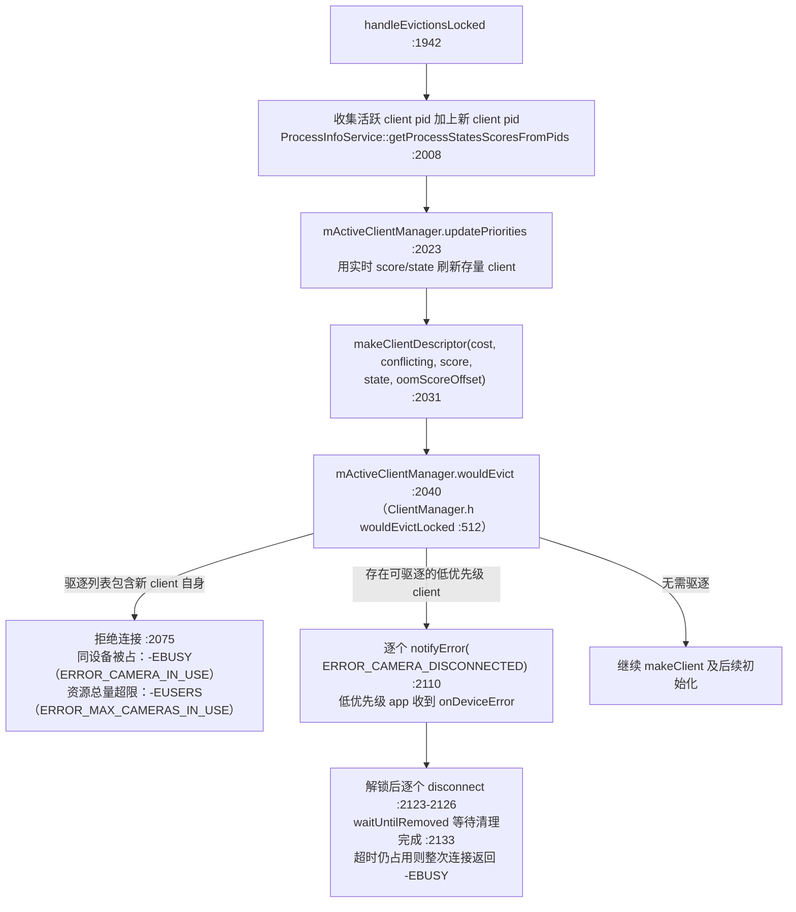
```mermaid
flowchart TD
    A["handleEvictionsLocked :1942"] --> B["收集活跃 client pid 加上新 client pid<br/>ProcessInfoService::getProcessStatesScoresFromPids :2008"]
    B --> C["mActiveClientManager.updatePriorities :2023<br/>用实时 score/state 刷新存量 client"]
    C --> D["makeClientDescriptor(cost, conflicting, score,<br/>state, oomScoreOffset) :2031"]
    D --> E["mActiveClientManager.wouldEvict :2040<br/>（ClientManager.h wouldEvictLocked :512）"]
    E -->|驱逐列表包含新 client 自身| F["拒绝连接 :2075<br/>同设备被占：-EBUSY（ERROR_CAMERA_IN_USE）<br/>资源总量超限：-EUSERS（ERROR_MAX_CAMERAS_IN_USE）"]
    E -->|存在可驱逐的低优先级 client| G["逐个 notifyError(<br/>ERROR_CAMERA_DISCONNECTED) :2110<br/>低优先级 app 收到 onDeviceError"]
    G --> H["解锁后逐个 disconnect :2123-2126<br/>waitUntilRemoved 等待清理完成 :2133<br/>超时仍占用则整次连接返回 -EBUSY"]
    E -->|无需驱逐| I["继续 makeClient 及后续初始化"]
```

`wouldEvictLocked`（ClientManager.h:512-623）的判定规则，逐条对照源码：

1. **冲突定义**（:556-563）：同 key（同一相机）或互为 conflicting（设备声明的互斥相机集合）；`camera_multi_client` 打开时 shared 模式两端都为 shared 则同 key 不冲突。
2. **同 owner**（:568-581）：同 pid 再次打开同一设备 → 新开替换旧开（MRU wins，旧 client 进驱逐列表）；同 pid 打开另一台冲突设备 → 反向拒绝新 client。
3. **冲突且对方优先级更高**（:582-586，`curPriority < priority` 即对方 score/state 更小）→ 把新 client 自身放进"驱逐列表"表示拒绝。
4. **需要驱逐存量**（:587-598）：与己冲突，或"加入后总 cost 超过 `mMaxCost` 且对方 cost 非零、优先级不高于己、且不是同 owner 最高优先级" → 对方进驱逐列表。
5. **总量兜底**（:615-619）：算完所有驱逐后总 cost 仍超限、且新 client 不是最高优先级 owner → 拒绝自身。
6. `getIncompatibleClients`（:504，`wouldEvictLocked` 的 `returnIncompatibleClients` 分支）专用于拒绝时生成诊断信息：逐个列出"Blocked by existing device ... (score/state)"写入事件日志（CameraService.cpp:2053-2069）。

真正落地的驱逐在 `handleEvictionsLocked`：先对每个待驱逐 client 调 `clientSp->notifyError(ERROR_CAMERA_DISCONNECTED, ...)`（:2110）——这是**被驱逐应用收到 `onDeviceError(0)` / `onDisconnected` 的时刻**——随后释放 `mServiceLock`、`clearCallingIdentity` 后逐个 `disconnect()`（:2123-2126，阻塞直到 HAL 清理完毕），并 `waitUntilRemoved` 确认 client 从 `mActiveClientManager` 摘除（:2133）。

另有两条相邻机制容易混淆，一并澄清：

- **finishConnectLocked 时的 addAndEvict**（:1893）：正常流程中该驱逐已完成，若此处再出现驱逐项说明 disconnect 漏删，直接 `LOG_ALWAYS_FATAL`（:1905）。
- **CameraClientManager::remove**（:5360）：client 正常断开时，若它正巧是 shared 模式的 primary client，会在剩余 client 中挑最高优先级者接班并回调 `notifyClientSharedAccessPriorityChanged`（:5386-5387）。

## 2.5 ICameraDeviceUser.aidl 与 ICameraDeviceCallbacks.aidl 接口方法表

> 来源：[ICameraDeviceUser.aidl](https://android.googlesource.com/platform/frameworks/av/+/refs/heads/main/camera/aidl/android/hardware/camera2/ICameraDeviceUser.aidl)、[ICameraDeviceCallbacks.aidl](https://android.googlesource.com/platform/frameworks/av/+/refs/heads/main/camera/aidl/android/hardware/camera2/ICameraDeviceCallbacks.aidl)

`openCamera` 成功后 app 持有的就是 `ICameraDeviceUser` 的代理（`CameraDeviceImpl.mRemoteDevice`，外面包一层 `ICameraDeviceUserWrapper`）。main 分支全部方法：

| 方法 | 作用 |
|---|---|
| `disconnect()` | 断开相机（对应 `CameraDevice.close()` 的服务侧入口） |
| `submitRequest(request, streaming)` | 提交单条 CaptureRequest，返回 `SubmitInfo`（requestId 与最后一帧号） |
| `submitRequestList(requestList, streaming)` | 批量提交请求 |
| `cancelRequest(requestId)` | 取消 repeating 请求，返回其最后一帧号；无帧产出返回常量 `NO_IN_FLIGHT_REPEATING_FRAMES = -1` |
| `beginConfigure()` | 开始流配置（须先于 create/deleteStream，且设备非 busy） |
| `endConfigure(operatingMode, sessionParams, startTimeMs)` | 结束流配置；返回可用于 offline 模式的 stream id 列表 |
| `isSessionConfigurationSupported(sessionConfiguration)` | 预检某会话配置是否被设备支持 |
| `deleteStream(streamId)` | 删除流 |
| `createStream(outputConfiguration)` | 创建输出流，返回新 stream id |
| `createInputStream(width, height, format, isMultiResolution)` | 创建输入流（reprocessing 用） |
| `getInputSurface()` | 取输入流的 Surface（须在 endConfigure 成功之后） |
| `createDefaultRequest(templateId)` | 生成某 template 的默认请求元数据 |
| `getCameraInfo()` | 取设备元数据 |
| `waitUntilIdle()` | 阻塞等待设备空闲 |
| `flush()` | 冲刷全部在途请求，返回最近帧号 |
| `prepare(streamId)` / `prepare2(maxCount, streamId)` | 预分配流缓冲（prepare2 可限制预分配上限） |
| `tearDown(streamId)` | 释放 prepare 预分配的缓冲 |
| `updateOutputConfiguration(streamId, outputConfiguration)` | 更新输出流配置（如可变分辨率 Surface） |
| `finalizeOutputConfigurations(streamId, outputConfiguration)` | 固化延迟配置的 Surface |
| `getCaptureResultMetadataQueue()` | 取结果元数据 FMQ 描述符（大元数据免 binder 拷贝的快速通道） |
| `setCameraAudioRestriction(mode)` / `getGlobalAudioRestriction()` | 设置/查询本设备音频限制；后者是全局查询 |
| `switchToOffline(callbacks, offlineOutputIds)` | 把指定输出流转入 offline 会话，返回 `ICameraOfflineSession` |
| `isPrimaryClient()` | shared 模式下本 client 是否 primary |

文件内常量：`NORMAL_MODE = 0`、`CONSTRAINED_HIGH_SPEED_MODE = 1`、`SHARED_MODE = 2`、`VENDOR_MODE_START = 0x8000`；`TEMPLATE_PREVIEW/STILL_CAPTURE/RECORD/VIDEO_SNAPSHOT/ZERO_SHUTTER_LAG/MANUAL`（1~6）；`AUDIO_RESTRICTION_NONE/VIBRATION/VIBRATION_SOUND`（0/1/3）。

反向回调 `ICameraDeviceCallbacks`（app 侧 `CameraDeviceImpl.CameraDeviceCallbacks` 实现，全部 oneway）：

| 方法 | 作用 |
|---|---|
| `onDeviceError(errorCode, resultExtras)` | 设备级错误；错误码 `ERROR_CAMERA_DISCONNECTED=0`、`ERROR_CAMERA_DEVICE=1`、`ERROR_CAMERA_SERVICE=2`、`ERROR_CAMERA_REQUEST=3`、`ERROR_CAMERA_RESULT=4`、`ERROR_CAMERA_BUFFER=5`、`ERROR_CAMERA_DISABLED=6`、`ERROR_CAMERA_INVALID_ERROR=-1` |
| `onDeviceIdle()` | 设备回到 idle（无在途请求） |
| `onCaptureStarted(resultExtras, timestamp)` | 一帧开始曝光（shutter 通知） |
| `onResultReceived(resultInfo, resultExtras, physicalCaptureResultInfos)` | 收到一帧结果（含物理相机结果） |
| `onPrepared(streamId)` | prepare 预分配完成 |
| `onRepeatingRequestError(lastFrameNumber, repeatingRequestId)` | repeating 请求出错停止 |
| `onRequestQueueEmpty()` | 请求队列清空 |
| `onClientSharedAccessPriorityChanged(primaryClient)` | shared 模式下 primary/secondary 角色切换通知 |

被驱逐时低优先级 client 收到的正是 `onDeviceError(ERROR_CAMERA_DISCONNECTED)`（CameraService.cpp:2110），Java 层由此进入 `onDisconnected` 流程。

## 2.6 全链路时序图：从 openCamera 到 onOpened

> 来源：同 2.1-2.4 所列文件

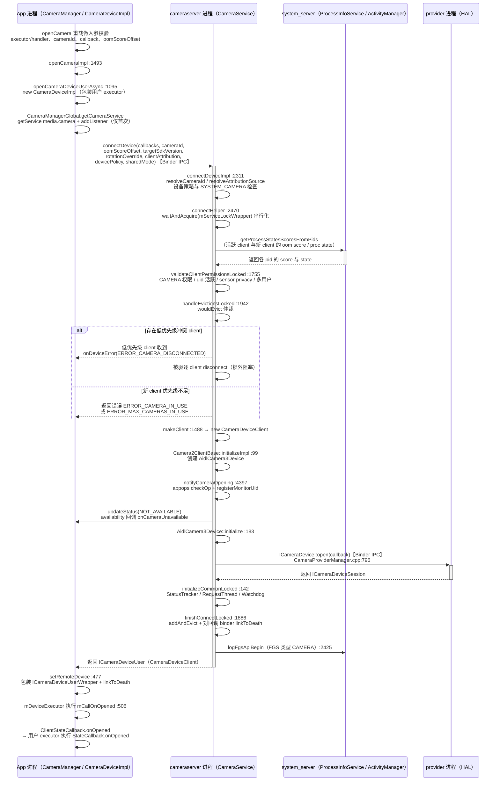
```mermaid
sequenceDiagram
    participant APP as App 进程（CameraManager / CameraDeviceImpl）
    participant CS as cameraserver 进程（CameraService）
    participant AM as system_server（ProcessInfoService / ActivityManager）
    participant VP as provider 进程（HAL）

    APP->>APP: openCamera 重载做入参校验<br/>executor/handler、cameraId、callback、oomScoreOffset
    APP->>APP: openCameraImpl :1493
    APP->>APP: openCameraDeviceUserAsync :1095<br/>new CameraDeviceImpl（包装用户 executor）
    APP->>APP: CameraManagerGlobal.getCameraService<br/>getService media.camera + addListener（仅首次）
    APP->>+CS: connectDevice(callbacks, cameraId,<br/>oomScoreOffset, targetSdkVersion,<br/>rotationOverride, clientAttribution,<br/>devicePolicy, sharedMode) 【Binder IPC】
    CS->>CS: connectDeviceImpl :2311<br/>resolveCameraId / resolveAttributionSource<br/>设备策略与 SYSTEM_CAMERA 检查
    CS->>CS: connectHelper :2470<br/>waitAndAcquire(mServiceLockWrapper) 串行化
    CS->>+AM: getProcessStatesScoresFromPids<br/>（活跃 client 与新 client 的 oom score / proc state）
    AM-->>-CS: 返回各 pid 的 score 与 state
    CS->>CS: validateClientPermissionsLocked :1755<br/>CAMERA 权限 / uid 活跃 / sensor privacy / 多用户
    CS->>CS: handleEvictionsLocked :1942<br/>wouldEvict 仲裁
    alt 存在低优先级冲突 client
        CS-->>APP: 低优先级 client 收到<br/>onDeviceError(ERROR_CAMERA_DISCONNECTED)
        CS->>CS: 被驱逐 client disconnect（锁外阻塞）
    else 新 client 优先级不足
        CS-->>APP: 返回错误 ERROR_CAMERA_IN_USE<br/>或 ERROR_MAX_CAMERAS_IN_USE
    end
    CS->>CS: makeClient :1488 → new CameraDeviceClient
    CS->>CS: Camera2ClientBase::initializeImpl :99<br/>创建 AidlCamera3Device
    CS->>CS: notifyCameraOpening :4397<br/>appops checkOp + registerMonitorUid
    CS->>APP: updateStatus(NOT_AVAILABLE)<br/>availability 回调 onCameraUnavailable
    CS->>CS: AidlCamera3Device::initialize :183
    CS->>+VP: ICameraDevice::open(callback)【Binder IPC】<br/>CameraProviderManager.cpp:796
    VP-->>-CS: 返回 ICameraDeviceSession
    CS->>CS: initializeCommonLocked :142<br/>StatusTracker / RequestThread / Watchdog
    CS->>CS: finishConnectLocked :1886<br/>addAndEvict + 对回调 binder linkToDeath
    CS->>AM: logFgsApiBegin（FGS 类型 CAMERA）:2425
    CS-->>-APP: 返回 ICameraDeviceUser（CameraDeviceClient）
    APP->>APP: setRemoteDevice :477<br/>包装 ICameraDeviceUserWrapper + linkToDeath
    APP->>APP: mDeviceExecutor 执行 mCallOnOpened :506
    APP->>APP: ClientStateCallback.onOpened<br/>→ 用户 executor 执行 StateCallback.onOpened
```

阅读这份时序图时的几个关键点：

- **进程边界共三次跨过**：app → cameraserver 的 `connectDevice`；cameraserver → system_server 的 score 查询（以及 UidPolicy 的事件注册，图中省略）；cameraserver → provider 的 `ICameraDevice::open`。
- **onCameraUnavailable 早于 onOpened**：`notifyCameraOpening` 在 HAL open 之前就把该设备状态置为 `NOT_AVAILABLE` 并广播（CameraService.cpp:4430），所以其他进程的 AvailabilityCallback 先动，本进程的 `onOpened` 要等 binder 返回后才触发。
- **失败的形态有两种**：优先级不足时 `connectDevice` 直接返回错误码（Java 层 `setRemoteFailure` → `onError` + 抛异常）；而被驱逐方是被动收到 `onDeviceError(ERROR_CAMERA_DISCONNECTED)`，走 `onDisconnected` 清理。
- `connectDevice` 返回的是 `CameraDeviceClient` 本体（`BnCameraDeviceUser` 子类），app 侧再包一层 `ICameraDeviceUserWrapper` 做 wrapper 化的异常翻译——app 与 cameraserver 之间从此只有这一个会话句柄加一条回调通道（`ICameraDeviceCallbacks`）。

---

> 下一章将从会话建立出发：`createCaptureSession` → `endConfigure` → 流创建与 HAL `configureStreams`。


# 第 3 章 createCaptureSession 与请求提交链路

> 本章基于 AOSP main 分支真实源码整理，函数名与行为均出自所列源文件，行号为当前 main 分支时点。所有图为 Mermaid 语法。

## 3.1 Java 层：createCaptureSession

来源：[CameraDeviceImpl.java](https://android.googlesource.com/platform/frameworks/base/+/refs/heads/main/core/java/android/hardware/camera2/impl/CameraDeviceImpl.java)

应用层的所有会话创建重载最终都汇入一条私有路径：

- `createCaptureSession(List<Surface>)`（:727）、`createCaptureSessionByOutputConfigurations`（:740）、带输入流的 reprocess 版本（:771、:800）、`SessionConfiguration` 版本（:886）→ 全部调用 **`createCaptureSessionInternal`**（:912）。

`createCaptureSessionInternal` 的关键动作：

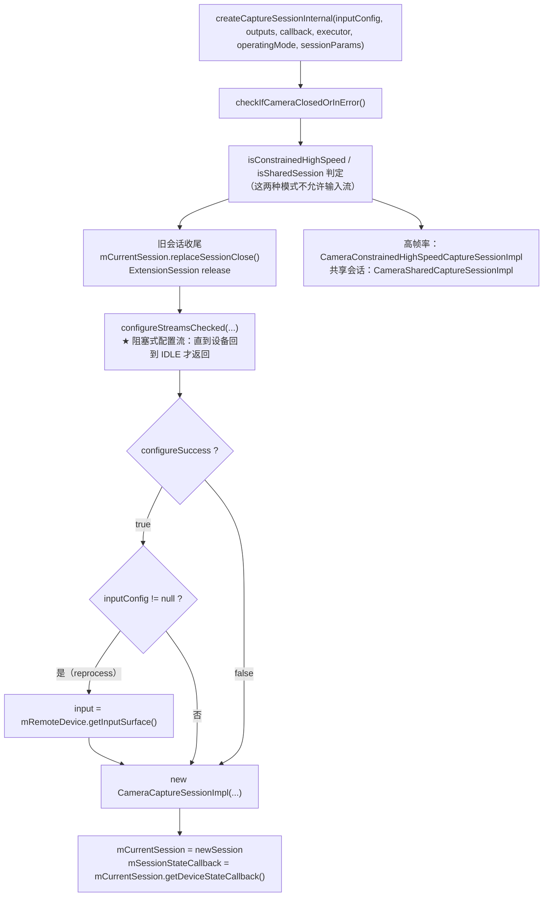
```mermaid
flowchart TD
    A["createCaptureSessionInternal(inputConfig, outputs, callback, executor, operatingMode, sessionParams)"] --> B["checkIfCameraClosedOrInError()"]
    B --> C["isConstrainedHighSpeed / isSharedSession 判定<br/>（这两种模式不允许输入流）"]
    C --> D["旧会话收尾<br/>mCurrentSession.replaceSessionClose()<br/>ExtensionSession release"]
    D --> E["configureStreamsChecked(...)<br/>★ 阻塞式配置流：直到设备回到 IDLE 才返回"]
    E --> F{"configureSuccess ?"}
    F -- true --> G{"inputConfig != null ?"}
    G -- 是（reprocess） --> H["input = mRemoteDevice.getInputSurface()"]
    G -- 否 --> I["new CameraCaptureSessionImpl(...)"]
    F -- false --> I
    H --> I
    C --> J["高帧率：CameraConstrainedHighSpeedCaptureSessionImpl<br/>共享会话：CameraSharedCaptureSessionImpl"]
    I --> K["mCurrentSession = newSession<br/>mSessionStateCallback = mCurrentSession.getDeviceStateCallback()"]
```

`configureStreamsChecked`（:602）内部顺序：先 `stopRepeating()`（:642，配置变更前必须停掉旧重复请求），然后对每个 `OutputConfiguration` 调 `mRemoteDevice.createStream(outConfig)`（:680），最后 `mRemoteDevice.endConfigure(operatingMode, sessionParams, ...)`（:687）阻塞等待配置结果。

会话对象分三种实现：普通 `CameraCaptureSessionImpl`、受限高帧率 `CameraConstrainedHighSpeedCaptureSessionImpl`、共享会话 `CameraSharedCaptureSessionImpl`；`onConfigured/onConfigureFailed` 回调由 `CameraCaptureSessionImpl` 构造函数依据 `configureSuccess` 直接分发（CameraCaptureSessionImpl.java:125-129）。

> 注意：Java 层的会话**不是**跨进程对象——真正配置流发生在 `configureStreamsChecked` 阻塞期间；`CameraCaptureSessionImpl` 只是持有回调与引用计数的本地包装。

## 3.2 cameraserver 侧：流构建与 configureStreams

来源：[CameraDeviceClient.cpp](https://android.googlesource.com/platform/frameworks/av/+/refs/heads/main/services/camera/libcameraservice/api2/CameraDeviceClient.cpp)、[Camera3Device.cpp](https://android.googlesource.com/platform/frameworks/av/+/refs/heads/main/services/camera/libcameraservice/device3/Camera3Device.cpp)

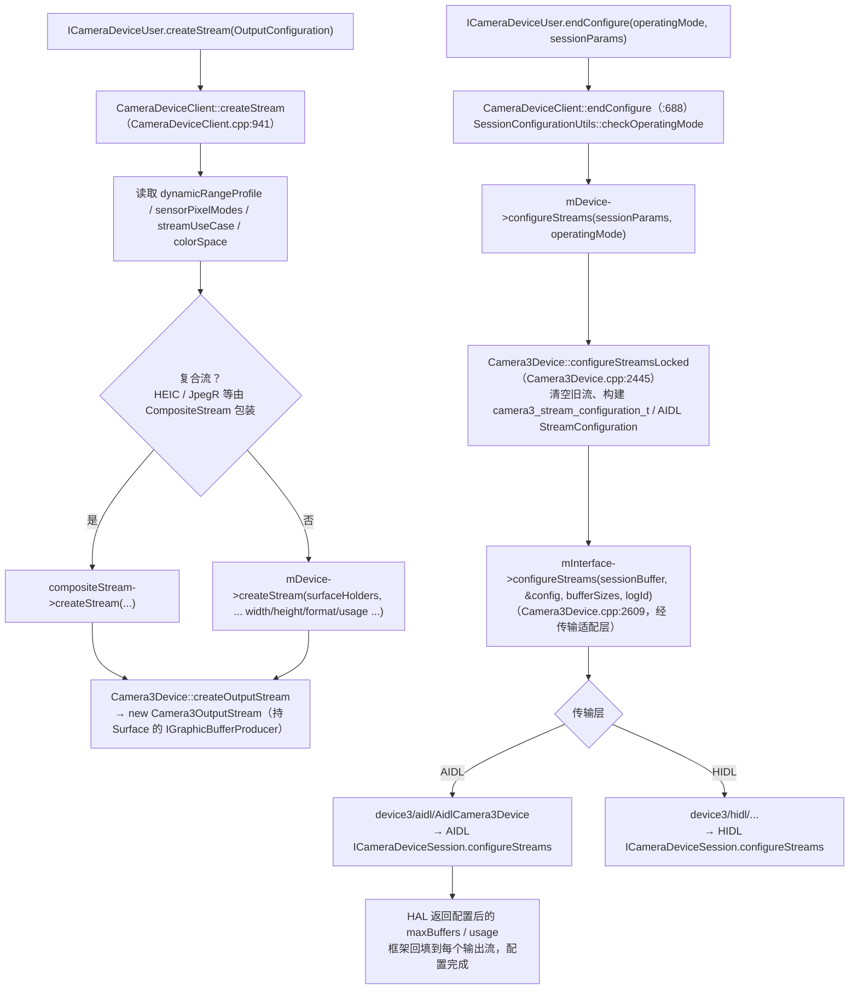
```mermaid
flowchart TD
    A["ICameraDeviceUser.createStream(OutputConfiguration)"] --> B["CameraDeviceClient::createStream（CameraDeviceClient.cpp:941）"]
    B --> B1["读取 dynamicRangeProfile / sensorPixelModes / streamUseCase / colorSpace"]
    B1 --> B2{"复合流？<br/>HEIC / JpegR 等由 CompositeStream 包装"}
    B2 -- 是 --> B3["compositeStream->createStream(...)"]
    B2 -- 否 --> B4["mDevice->createStream(surfaceHolders, ... width/height/format/usage ...)"]
    B3 --> C["Camera3Device::createOutputStream<br/>→ new Camera3OutputStream（持 Surface 的 IGraphicBufferProducer）"]
    B4 --> C
    A2["ICameraDeviceUser.endConfigure(operatingMode, sessionParams)"] --> D["CameraDeviceClient::endConfigure（:688）<br/>SessionConfigurationUtils::checkOperatingMode"]
    D --> E["mDevice->configureStreams(sessionParams, operatingMode)"]
    E --> F["Camera3Device::configureStreamsLocked（Camera3Device.cpp:2445）<br/>清空旧流、构建 camera3_stream_configuration_t / AIDL StreamConfiguration"]
    F --> G["mInterface->configureStreams(sessionBuffer, &config, bufferSizes, logId)<br/>（Camera3Device.cpp:2609，经传输适配层）"]
    G --> H{"传输层"}
    H -- AIDL --> H1["device3/aidl/AidlCamera3Device<br/>→ AIDL ICameraDeviceSession.configureStreams"]
    H -- HIDL --> H2["device3/hidl/...<br/>→ HIDL ICameraDeviceSession.configureStreams"]
    H1 --> I["HAL 返回配置后的 maxBuffers / usage<br/>框架回填到每个输出流，配置完成"]
```

要点：

- `createStream` 阶段（binder 调用逐个进行）只做**流对象构建**；真正的 HAL 重配置集中在 `endConfigure` 一次性触发，这就是官方文档"会话参数只在 configure 时生效"的由来。
- `configureStreamsLocked`（:2445）负责：按 operatingMode（NORMAL/HIGH_SPEED/SHARED…）组装流配置、处理输入流（reprocess）、把框架侧的 `dynamicRangeProfile/streamUseCase` 写入流配置，最后经 `mInterface`（AIDL/HIDL 适配器）下发 HAL。
- main 分支传输适配独立成类：AIDL 栈在 `device3/aidl/AidlCamera3Device`，HIDL 栈在 `device3/hidl/`，旧 API1 栈在 `device3/deprecated/`。

## 3.3 请求提交：从 capture() 到 HAL

来源：[CameraDeviceImpl.java](https://android.googlesource.com/platform/frameworks/base/+/refs/heads/main/core/java/android/hardware/camera2/impl/CameraDeviceImpl.java)、[CameraDeviceClient.cpp](https://android.googlesource.com/platform/frameworks/av/+/refs/heads/main/services/camera/libcameraservice/api2/CameraDeviceClient.cpp)、[Camera3Device.cpp](https://android.googlesource.com/platform/frameworks/av/+/refs/heads/main/services/camera/libcameraservice/device3/Camera3Device.cpp)

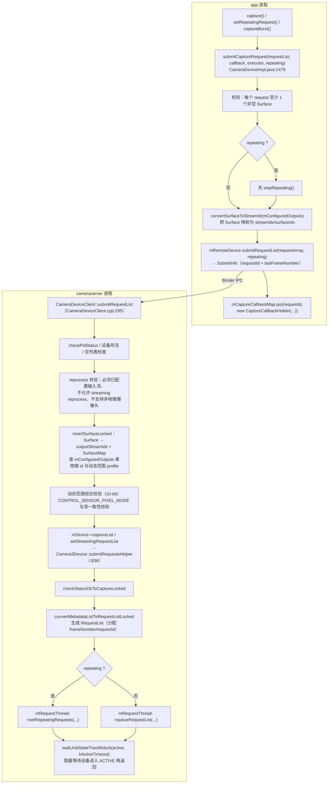
```mermaid
flowchart TD
    subgraph APP["app 进程"]
        J1["capture() / setRepeatingRequest() / captureBurst()"] --> J2["submitCaptureRequest(requestList, callback, executor, repeating)<br/>CameraDeviceImpl.java:1479"]
        J2 --> J3["校验：每个 request 至少 1 个非空 Surface"]
        J3 --> J4{"repeating ?"}
        J4 -- 是 --> J5["先 stopRepeating()"]
        J4 -- 否 --> J6["convertSurfaceToStreamId(mConfiguredOutputs)<br/>把 Surface 映射为 streamIdx/surfaceIdx"]
        J5 --> J6
        J6 --> J7["mRemoteDevice.submitRequestList(requestArray, repeating)<br/>→ SubmitInfo（requestId + lastFrameNumber）"]
        J7 --> J8["mCaptureCallbackMap.put(requestId,<br/>new CaptureCallbackHolder(...))"]
    end
    subgraph CS["cameraserver 进程"]
        N1["CameraDeviceClient::submitRequestList<br/>（CameraDeviceClient.cpp:295）"] --> N2["checkPidStatus / 设备存活 / 空列表检查"]
        N2 --> N3["reprocess 校验：必须已配置输入流、<br/>不允许 streaming reprocess、不支持多物理摄像头"]
        N3 --> N4["insertSurfaceLocked：Surface → outputStreamIds + SurfaceMap<br/>查 mConfiguredOutputs 拿物理 id 与动态范围 profile"]
        N4 --> N5["动态范围组合校验（10-bit）<br/>CONTROL_SENSOR_PIXEL_MODE 与流一致性校验"]
        N5 --> N6["mDevice->captureList / setStreamingRequestList<br/>→ Camera3Device::submitRequestsHelper（:836）"]
        N6 --> N7["checkStatusOkToCaptureLocked"]
        N7 --> N8["convertMetadataListToRequestListLocked<br/>生成 RequestList（分配 frameNumber/requestId）"]
        N8 --> N9{"repeating ?"}
        N9 -- 是 --> N10["mRequestThread->setRepeatingRequests(...)"]
        N9 -- 否 --> N11["mRequestThread->queueRequestList(...)"]
        N10 --> N12["waitUntilStateThenRelock(active, kActiveTimeout)<br/>阻塞等待设备进入 ACTIVE 再返回"]
        N11 --> N12
    end
    J7 -- "Binder IPC" --> N1
```

## 3.4 RequestThread：单线程请求泵与关键机制

来源：[Camera3Device.cpp](https://android.googlesource.com/platform/frameworks/av/+/refs/heads/main/services/camera/libcameraservice/device3/Camera3Device.cpp)

`Camera3Device` 内部有一个专职的 **RequestThread** 线程，所有请求都经它下发 HAL：

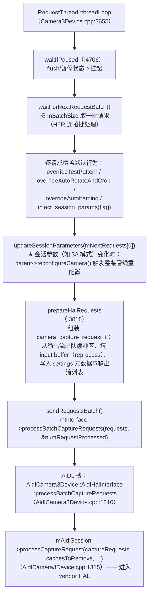
```mermaid
flowchart TD
    A["RequestThread::threadLoop（Camera3Device.cpp:3655）"] --> B["waitIfPaused（:4706）<br/>flush/暂停状态下挂起"]
    B --> C["waitForNextRequestBatch()<br/>按 mBatchSize 取一批请求（HFR 连拍批处理）"]
    C --> D["逐请求覆盖默认行为：<br/>overrideTestPattern / overrideAutoRotateAndCrop /<br/>overrideAutoframing / inject_session_params(flag)"]
    D --> E["updateSessionParameters(mNextRequests[0])<br/>★ 会话参数（如 3A 模式）变化时：<br/>parent->reconfigureCamera() 触发整条管线重配置"]
    E --> F["prepareHalRequests（:3818）<br/>组装 camera_capture_request_t：<br/>从输出流出队缓冲区、填 input buffer（reprocess）、<br/>写入 settings 元数据与输出流列表"]
    F --> G["sendRequestsBatch()<br/>mInterface->processBatchCaptureRequests(requests, &numRequestProcessed)"]
    G --> H["AIDL 栈：AidlCamera3Device::AidlHalInterface<br/>::processBatchCaptureRequests（AidlCamera3Device.cpp:1210）"]
    H --> I["mAidlSession->processCaptureRequest(captureRequests, cachesToRemove, ...)<br/>（AidlCamera3Device.cpp:1315）—— 进入 vendor HAL"]
```

关键机制（均在源码中核实）：

- **线程模型**：应用 `submitRequestList` 只是把请求入队并等待设备切到 ACTIVE；真正与 HAL 的交互全部在 RequestThread 单线程内串行进行，避免多线程竞态。
- **queue 与 repeating 双队列**：单发请求走 `queueRequestList`，重复请求由 `setRepeatingRequests` 替换 `mRepeatingRequests` 列表——每次循环取"最新单发请求优先 + 最新 repeating 请求垫底"（`waitForNextRequestBatch` 的注释明确说明了稳态单 repeating 的优化路径）。
- **会话参数热更新**：`updateSessionParameters` 检测到无法旁路的会话参数变化时，会调用 `parent->reconfigureCamera()` 走完整重配置（这解释了部分参数为何"改了没反应"——它们本质是会话参数）。
- **标识符语义**：`requestId`（Java 回调匹配，`mCaptureCallbackMap` 的 key）、`frameNumber`（该设备单调递增，结果与 shutter 匹配的 key）、`sequenceId`（一个 repeating 序列的标识，repeating 停止时经 `onRepeatingRequestEnd(sequenceId, lastFrameNumber)` 通知 Java 层清理回调表）。
- **异常路径**：`prepareHalRequests` 取输出缓冲区超时只清理该批请求（`cleanUpFailedRequests(sendRequestError=true)`）并 `checkAndStopRepeatingRequest()`，不杀死线程；`cleanUpFailedRequests` 内部会清空 `mRepeatingRequests`（:3258、:3296）。

## 3.5 全链路时序图

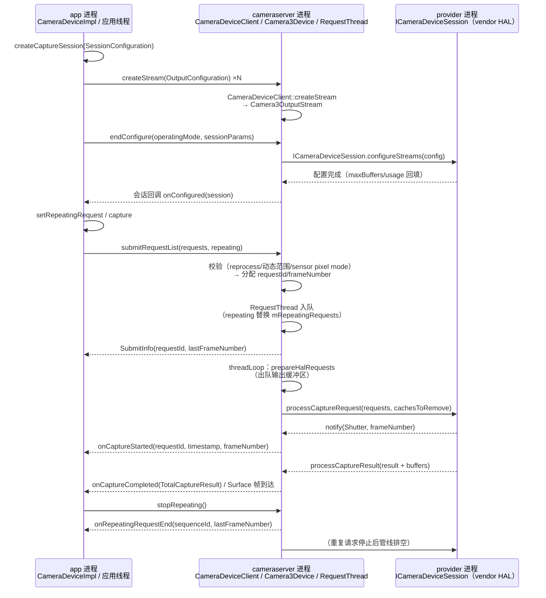
```mermaid
sequenceDiagram
    participant App as app 进程<br/>CameraDeviceImpl / 应用线程
    participant CS as cameraserver 进程<br/>CameraDeviceClient / Camera3Device / RequestThread
    participant HAL as provider 进程<br/>ICameraDeviceSession（vendor HAL）

    App->>App: createCaptureSession(SessionConfiguration)
    App->>CS: createStream(OutputConfiguration) ×N
    CS->>CS: CameraDeviceClient::createStream<br/>→ Camera3OutputStream
    App->>CS: endConfigure(operatingMode, sessionParams)
    CS->>HAL: ICameraDeviceSession.configureStreams(config)
    HAL-->>CS: 配置完成（maxBuffers/usage 回填）
    CS-->>App: 会话回调 onConfigured(session)

    App->>App: setRepeatingRequest / capture
    App->>CS: submitRequestList(requests, repeating)
    CS->>CS: 校验（reprocess/动态范围/sensor pixel mode）<br/>→ 分配 requestId/frameNumber
    CS->>CS: RequestThread 入队<br/>（repeating 替换 mRepeatingRequests）
    CS-->>App: SubmitInfo(requestId, lastFrameNumber)
    CS->>CS: threadLoop：prepareHalRequests<br/>（出队输出缓冲区）
    CS->>HAL: processCaptureRequest(requests, cachesToRemove)
    HAL-->>CS: notify(Shutter, frameNumber)
    CS-->>App: onCaptureStarted(requestId, timestamp, frameNumber)
    HAL-->>CS: processCaptureResult(result + buffers)
    CS-->>App: onCaptureCompleted(TotalCaptureResult) / Surface 帧到达
    App->>CS: stopRepeating()
    CS-->>App: onRepeatingRequestEnd(sequenceId, lastFrameNumber)
    CS->>HAL: （重复请求停止后管线排空）
```

---

> 下一章（第 4 章）讲结果的回程：`processCaptureResult`/`notify` 如何穿过 RequestThread 与 Camera3Device 回到应用回调，缓冲区的出队与归还全生命周期，以及错误处理与恢复机制。


# 第 4 章 结果返回链路、缓冲区管理与错误恢复

> 本章基于 AOSP main 分支（2026-09 时点）真实源码整理，函数名与行为均出自所列源文件，行号为当前 main 分支时点。承接第 3 章：请求已经由 RequestThread 下发 HAL，本章沿同一帧走完回程——shutter/结果两条回调通道、in-flight 匹配、缓冲区出队与归还全生命周期，以及错误分类与恢复机制。所有图为 Mermaid 语法。

## 4.1 结果回程总览：notify 与 processCaptureResult 双通道 + in-flight 匹配

> 来源：[ICameraDeviceCallback.aidl](https://android.googlesource.com/platform/hardware/interfaces/+/refs/heads/main/camera/device/aidl/android/hardware/camera/device/ICameraDeviceCallback.aidl)、[ICameraDeviceCallbacks.aidl](https://android.googlesource.com/platform/frameworks/av/+/refs/heads/main/camera/aidl/android/hardware/camera2/ICameraDeviceCallbacks.aidl)、[AidlCamera3Device.cpp](https://android.googlesource.com/platform/frameworks/av/+/refs/heads/main/services/camera/libcameraservice/device3/aidl/AidlCamera3Device.cpp)、[Camera3OutputUtils.cpp](https://android.googlesource.com/platform/frameworks/av/+/refs/heads/main/services/camera/libcameraservice/device3/Camera3OutputUtils.cpp)、[InFlightRequest.h](https://android.googlesource.com/platform/frameworks/av/+/refs/heads/main/services/camera/libcameraservice/device3/InFlightRequest.h)

HAL → 框架的回调接口是 AIDL 的 `ICameraDeviceCallback`（@VintfStability，hardware/interfaces 仓库），方法表只有 4 个：

| 方法 | 行号 | 语义 |
|---|---|---|
| `notify(in NotifyMsg[] msgs)` | ICameraDeviceCallback.aidl:69 | 异步消息：SHUTTER / ERROR。契约要求框架 5ms 内处理完每条消息 |
| `processCaptureResult(in CaptureResult[] results)` | ICameraDeviceCallback.aidl:151 | 结果：元数据 + 输出缓冲（可多次、可部分；同一流缓冲必须 FIFO 顺序返回） |
| `requestStreamBuffers(...)` / `returnStreamBuffers(...)` | ICameraDeviceCallback.aidl:189/:201 | HAL 缓冲区管理模式下的主动取/还缓冲（见 4.3） |

关键契约（源码注释原文摘要）：**缓冲区在收到该帧的 SHUTTER notify 之前不得派发给应用层**（:42-46）；一次请求可对应多次 `processCaptureResult`（元数据+低分辨率缓冲先回、JPEG 后回，:76-83）；同一流的缓冲与元数据必须按帧号 FIFO（:92-97）；整体失败时也必须用 STATUS_ERROR 缓冲 + 空元数据调用本方法，并 notify(ERROR_REQUEST)（:132-138）。

app 进程侧对应的 AIDL 是 `ICameraDeviceCallbacks`（frameworks/av 的 camera/aidl）：`onDeviceError`（:37）、`onDeviceIdle`（:38）、`onCaptureStarted`（:39）、`onResultReceived`（:40）、`onPrepared`（:43）、`onRepeatingRequestError`（:51）、`onRequestQueueEmpty`（:53，即历史上的"capture queue empty"，main 分支已更名）等。

**两条通道在 cameraserver 的入口**（AIDL 栈，HIDL 栈结构对称在 device3/hidl/）：

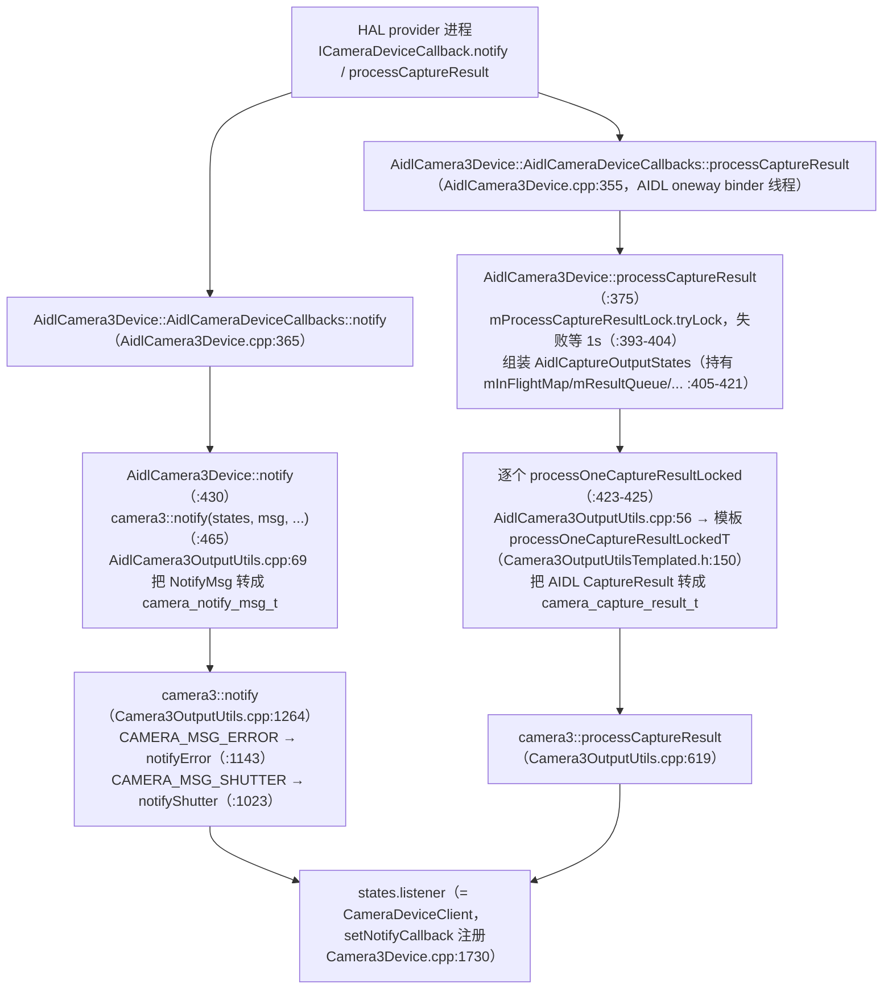
```mermaid
flowchart TD
    HAL["HAL provider 进程<br/>ICameraDeviceCallback.notify / processCaptureResult"]
    HAL --> CB1["AidlCamera3Device::AidlCameraDeviceCallbacks::processCaptureResult<br/>（AidlCamera3Device.cpp:355，AIDL oneway binder 线程）"]
    HAL --> CB2["AidlCamera3Device::AidlCameraDeviceCallbacks::notify<br/>（AidlCamera3Device.cpp:365）"]
    CB1 --> P1["AidlCamera3Device::processCaptureResult（:375）<br/>mProcessCaptureResultLock.tryLock，失败等 1s（:393-404）<br/>组装 AidlCaptureOutputStates（持有 mInFlightMap/mResultQueue/... :405-421）"]
    P1 --> P2["逐个 processOneCaptureResultLocked（:423-425）<br/>AidlCamera3OutputUtils.cpp:56 → 模板 processOneCaptureResultLockedT<br/>（Camera3OutputUtilsTemplated.h:150）把 AIDL CaptureResult 转成 camera_capture_result_t"]
    P2 --> P3["camera3::processCaptureResult（Camera3OutputUtils.cpp:619）"]
    CB2 --> N1["AidlCamera3Device::notify（:430）<br/>camera3::notify(states, msg, ...)（:465）<br/>AidlCamera3OutputUtils.cpp:69 把 NotifyMsg 转成 camera_notify_msg_t"]
    N1 --> N2["camera3::notify（Camera3OutputUtils.cpp:1264）<br/>CAMERA_MSG_ERROR → notifyError（:1143）<br/>CAMERA_MSG_SHUTTER → notifyShutter（:1023）"]
    N2 --> L["states.listener（= CameraDeviceClient，setNotifyCallback 注册<br/>Camera3Device.cpp:1730）"]
    P3 --> L
```

**in-flight map：frameNumber → 一切**。请求下发时 `RequestThread::prepareHalRequests` 按帧注册：`registerInFlight(...)`（调用点 Camera3Device.cpp:4213，实现 :2888）把 `InFlightRequest` 放入 `mInFlightMap`（`KeyedVector<uint32_t frameNumber, InFlightRequest>`，InFlightRequest.h:263）。`InFlightRequest`（InFlightRequest.h:106-260）持有：`resultExtras`（requestId/burstId/subsequenceId——requestId 正是 Java 回调匹配键）、`numBuffersLeft`、`shutterTimestamp`、`pendingMetadata`（shutter 未到前缓存的最终元数据）、`collectedPartialResult`、`pendingOutputBuffers`（shutter 未到前缓存的缓冲）、`errorBufStrategy`、`outputSurfaces`（Surface 共享映射）等。

匹配过程（Camera3OutputUtils.cpp）：

- **shutter 通道**：`notifyShutter`（:1023）用 `msg.frame_number` 查 `inflightMap`（:1035），先做顺序校验（reprocess/ZSL/普通帧分别维护 `nextReprocShutterFrameNum`/`nextZslShutterFrameNum`/`nextShutterFrameNum`，:1043-1067），写入 `r.shutterTimestamp`，随后若该帧有回调（`hasCallback`，HFR 批处理中间帧为 false）→ `states.listener->notifyShutter(...)`（:1099）→ **`CameraDeviceClient::notifyShutter` → `remoteCb->onCaptureStarted`**（CameraDeviceClient.cpp:2265-2270）。之后补发"先到结果"：`sendCaptureResult(r.pendingMetadata, ...)`（:1105）+ `collectAndRemovePendingOutputBuffers`（:1112）。
- **结果通道**：`processCaptureResult`（:619）同样用 `result->frame_number` 查 `inflightMap`（:655）；查不到即 fatal（`SET_ERR("Unknown frame number...")`，:656-660）。收到最终元数据则 `request.haveResultMetadata = true` 并把 `errorBufStrategy` 升级为 `ERROR_BUF_RETURN_NOTIFY`（:782-783）；`numBuffersLeft` 按 `num_output_buffers`（+input buffer）递减（:786-801）。完成判定在 `removeInFlightRequestIfReadyLocked`（:511）：**所有缓冲返回且（跳过元数据 或 元数据+shutter 都已到）才从 map 移除**（:527-529）。
- 元数据并不会直接发给 app：`sendCaptureResult`/`sendPartialCaptureResult` 最终都走 `insertResultLocked`（:213）把 `CaptureResult` 追加进 `mResultQueue`。真正送到 app 的是另一个线程——`FrameProcessorBase::threadLoop`（FrameProcessorBase.cpp:119，10ms 轮询 `waitForNextFrame`，FrameProcessorBase.h:61）→ `processNewFrames` 循环 `device->getNextResult()`（:146，实现在 Camera3Device.cpp:1761）→ `processListeners` 回调 `onResultAvailable`（:233）→ **`CameraDeviceClient::onResultAvailable` → `remoteCb->onResultReceived`**（CameraDeviceClient.cpp:2401/2428）。

> 小结：**shutter/错误走 binder 线程直发（onCaptureStarted/onDeviceError），元数据先进 mResultQueue 再由 FrameProcessorBase 线程异步派发（onResultReceived）**；缓冲区则不经 Java，直接在 native 侧归还 Surface。Java 层再用 `frameNumber`/`requestId` 双键匹配：`onCaptureStarted`/`onResultReceived` 先 `mCaptureCallbackMap.get(requestId)` 拿到 `CaptureCallbackHolder`（CameraDeviceImpl.java:2370/:2504），并利用 extras 里的 `lastCompletedRegularFrameNumber` 等三项清理已完成的回调表（`removeCompletedCallbackHolderLocked`，:2366）。

## 4.2 partial/total result 语义与缓冲区流回 Surface

> 来源：[Camera3OutputUtils.cpp](https://android.googlesource.com/platform/frameworks/av/+/refs/heads/main/services/camera/libcameraservice/device3/Camera3OutputUtils.cpp)、[Camera3OutputStream.cpp](https://android.googlesource.com/platform/frameworks/av/+/refs/heads/main/services/camera/libcameraservice/device3/Camera3OutputStream.cpp)、[CameraDeviceClient.cpp](https://android.googlesource.com/platform/frameworks/av/+/refs/heads/main/services/camera/libcameraservice/api2/CameraDeviceClient.cpp)、[CameraDeviceImpl.java](https://android.googlesource.com/platform/frameworks/base/+/refs/heads/main/core/java/android/hardware/camera2/impl/CameraDeviceImpl.java)

**partial/total 判定**（Camera3OutputUtils.cpp:728-749）：支持 partial 时（`usePartialResult`，`numPartialResults` 来自 HAL 特性），`result->partial_result < numPartialResults` 即 partial。partial 元数据累积进 `request.collectedPartialResult`（:742），且只要该帧有回调就**立即**经 `sendPartialCaptureResult`（:256，带 `partialResultCount`）入队发给 app；`partial_result == numPartialResults` 才是最终结果：把收集到的 partial 拼接到完整结果（`sendCaptureResult` :350-352），校验 `ANDROID_SENSOR_TIMESTAMP`（:357-363），依次做畸变校正/变焦比/rotate-and-crop/闪光灯强度/autoframing/黑白等元数据修正（:376-488），最后 `insertResultLocked` 入队。不支持的 HAL 上 `partial_result != 1` 直接 fatal（:632-639）。

Java 侧的对应语义（CameraDeviceImpl.java:2454-2651）：`isPartialResult = resultExtras.getPartialResultCount() < mTotalPartialCount`（:2507-2508）——partial 分发 `onCaptureProgressed`（:2573），total 分发 `TotalCaptureResult` + `onCaptureCompleted`（:2597-2629），total 时用 `mFrameNumberTracker.popPartialResults(frameNumber)` 把之前收到的 partial 附进 TotalCaptureResult（:2584），并 `updateTracker` + `checkAndFireSequenceComplete()` 触发 `onCaptureSequenceCompleted`（:2644-2648）。

**缓冲区回程（与元数据并行）**：`processCaptureResult` 携带的输出缓冲先暂存 `request.pendingOutputBuffers`，**只有 shutter 已到才取出发还**（:810-820）；发还动作是 `collectReturnableOutputBuffers`（:876，把每个缓冲包成 `BufferToReturn`，同时处理 STATUS_ERROR 的上报策略）+ `finishReturningOutputBuffers`（:940）。后者调用 `stream->returnBuffer(...)`，进入流层：

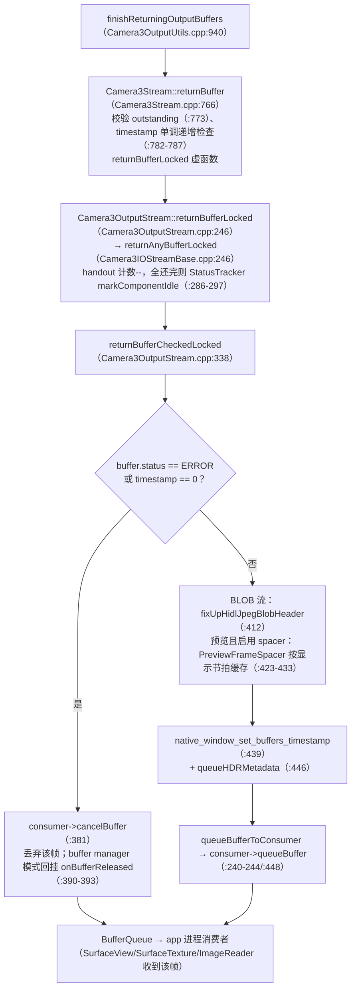
```mermaid
flowchart TD
    A["finishReturningOutputBuffers（Camera3OutputUtils.cpp:940）"] --> B["Camera3Stream::returnBuffer（Camera3Stream.cpp:766）<br/>校验 outstanding（:773）、timestamp 单调递增检查（:782-787）<br/>returnBufferLocked 虚函数"]
    B --> C["Camera3OutputStream::returnBufferLocked（Camera3OutputStream.cpp:246）<br/>→ returnAnyBufferLocked（Camera3IOStreamBase.cpp:246）<br/>handout 计数--，全还完则 StatusTracker markComponentIdle（:286-297）"]
    C --> D["returnBufferCheckedLocked（Camera3OutputStream.cpp:338）"]
    D --> E{"buffer.status == ERROR<br/>或 timestamp == 0？"}
    E -- 是 --> F["consumer->cancelBuffer（:381）<br/>丢弃该帧；buffer manager 模式回挂 onBufferReleased（:390-393）"]
    E -- 否 --> G["BLOB 流：fixUpHidlJpegBlobHeader（:412）<br/>预览且启用 spacer：PreviewFrameSpacer 按显示节拍缓存（:423-433）"]
    G --> H["native_window_set_buffers_timestamp（:439）<br/>+ queueHDRMetadata（:446）"]
    H --> I["queueBufferToConsumer → consumer->queueBuffer（:240-244/:448）"]
    F --> J["BufferQueue → app 进程消费者<br/>（SurfaceView/SurfaceTexture/ImageReader 收到该帧）"]
    I --> J
```

要点：

- **应用"收帧"与"收结果"是两条独立路径**：缓冲经 BufferQueue 直接到消费者；元数据经 `onResultReceived`。`onCaptureCompleted` 携带的是 `TotalCaptureResult` 元数据，不携带图像。
- 错误缓冲若此时 HAL 元数据未失败（`errorBufStrategy == ERROR_BUF_RETURN_NOTIFY`，即最终结果已到，:783），会在 `collectReturnableOutputBuffers` 里主动 `notifyError(ERROR_CAMERA_BUFFER)` 并带上 `errorStreamId`（:892-901）。
- `return_buffers_outside_locks`（aconfig flag）为 true 时，归还缓冲被挪到 inflightLock 之外执行（:845-854、:1096-1099、:1130-1139），避免 Surface 阻塞拖住 in-flight 处理。
- 共享 Surface 场景下 `returnBuffer` 超时会 cancel 缓冲并发 `ERROR_CAMERA_BUFFER`（:969-987）。

## 4.3 缓冲区全生命周期：出队 → HAL 填充 → 归还 → queue 到 Surface

> 来源：[Camera3Device.cpp](https://android.googlesource.com/platform/frameworks/av/+/refs/heads/main/services/camera/libcameraservice/device3/Camera3Device.cpp)、[Camera3Stream.cpp](https://android.googlesource.com/platform/frameworks/av/+/refs/heads/main/services/camera/libcameraservice/device3/Camera3Stream.cpp)、[Camera3OutputStream.cpp](https://android.googlesource.com/platform/frameworks/av/+/refs/heads/main/services/camera/libcameraservice/device3/Camera3OutputStream.cpp)、[Camera3BufferManager.cpp](https://android.googlesource.com/platform/frameworks/av/+/refs/heads/main/services/camera/libcameraservice/device3/Camera3BufferManager.cpp)、[AidlCamera3OutputUtils.cpp](https://android.googlesource.com/platform/frameworks/av/+/refs/heads/main/services/camera/libcameraservice/device3/aidl/AidlCamera3OutputUtils.cpp)

**Camera3BufferManager 仍然存在且在用**（并非废弃）：`Android.bp` 仍在编译 `device3/Camera3BufferManager.cpp`（Android.bp:170）；`Camera3Device` 构造时 `mBufferManager = new Camera3BufferManager()`（Camera3Device.cpp:159），每个新输出流创建后 `newStream->setBufferManager(mBufferManager)` 注入（:1223），`disconnectImpl` 时释放（:368）。

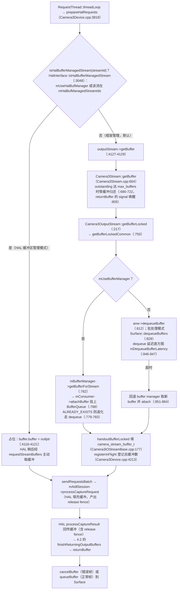
```mermaid
flowchart TD
    S1["RequestThread::threadLoop → prepareHalRequests（Camera3Device.cpp:3818）"] --> S2{"isHalBufferManagedStream(streamId)？<br/>HalInterface::isHalBufferManagedStream（:3048）：<br/>mUseHalBufManager 或该流在 mHalBufManagedStreamIds"}
    S2 -- "是（HAL 缓冲区管理模式）" --> S3["占位：buffer.buffer = nullptr（:4116-4121）<br/>HAL 稍后经 requestStreamBuffers 主动取缓冲"]
    S2 -- "否（框架管理，默认）" --> S4["outputStream->getBuffer（:4127-4129）"]
    S4 --> S5["Camera3Stream::getBuffer（Camera3Stream.cpp:664）<br/>outstanding 达 max_buffers 时等缓冲归还（:690-722，<br/>returnBuffer 的 signal 唤醒 :805）"]
    S5 --> S6["Camera3OutputStream::getBufferLocked（:217）<br/>→ getBufferLockedCommon（:750）"]
    S6 --> S7{"mUseBufferManager？"}
    S7 -- 是 --> S8["mBufferManager->getBufferForStream（:762）<br/>→ mConsumer->attachBuffer 挂上 BufferQueue（:768）<br/>ALREADY_EXISTS 则退化走 dequeue（:779-783）"]
    S7 -- 否 --> S9["anw->dequeueBuffer（:812）；批处理模式 Surface::dequeueBuffers（:828）<br/>dequeue 延迟直方图 mDequeueBufferLatency（:846-847）"]
    S9 -- 超时 --> S10["回退 buffer manager 取新 buffer 并 attach（:851-864）"]
    S8 --> S11["handoutBufferLocked 填 camera_stream_buffer_t（Camera3IOStreamBase.cpp:177）<br/>registerInFlight 登记总缓冲数（Camera3Device.cpp:4213）"]
    S10 --> S11
    S3 --> S12["sendRequestsBatch → mAidlSession->processCaptureRequest<br/>（HAL 填充缓冲，产出 release fence）"]
    S11 --> S12
    S12 --> S13["HAL processCaptureResult 回传缓冲（含 release fence）<br/>→ 4.2 的 finishReturningOutputBuffers → returnBuffer"]
    S13 --> S14["cancelBuffer（错误帧）或 queueBuffer（正常帧）到 Surface"]
```

- **超时语义**：`getBuffer` 等待时长来自请求的超时预算（`waitDuration`）；dequeue 超时常见原因是消费者（app）长时间不释放缓冲——这正是 4.2 末尾"共享 Surface 归还超时→cancel+上报"的镜像场景。
- **HAL 缓冲区管理模式（AIDL）按源码实际流程**：仅当设备声明支持（`INFO_SUPPORTED_BUFFER_MANAGEMENT_VERSION`）且流加入 `mHalBufManagedStreamIds` 时可用。HAL 经 `ICameraDeviceCallback.requestStreamBuffers`（同步双向 binder）取缓冲：`AidlCamera3Device::requestStreamBuffers`（AidlCamera3Device.cpp:698）→ `camera3::requestStreamBuffers`（AidlCamera3OutputUtils.cpp:131），实现要点：按流校验（重复/未开启该模式的流直接 `FAILED_ILLEGAL_ARGUMENTS`，:166-181）；`reqBufferIntf.startRequestBuffer()` 与 configureStreams 互斥，配置期间返回 `FAILED_CONFIGURING`（:183-188）；逐缓冲 `outputStream->getBuffer`（:239），累计 outstanding 超过 `max_buffers` 报 `MAX_BUFFER_EXCEEDED`（:214-226）；取到的 buffer 用 `pushInflightRequestBuffer` 登记（:292，此后经 `getInflightRequestBufferKeys`/`popInflightRequestBuffer` 可在 flush 时找回，见 4.4）。整体状态返回 `OK / FAILED_PARTIAL / FAILED_UNKNOWN`（:337-339）。这类缓冲不绑定具体帧，HAL 若用于某帧输出，随该帧的 `processCaptureResult` 返回；其余经 `returnStreamBuffers` 归还（`AidlCamera3Device.cpp:726` → `camera3::returnStreamBuffers` → 模板 `returnStreamBuffersT`，Camera3OutputUtilsTemplated.h:300），此时 timestamp 为 0，在 Surface 侧按丢弃处理（AidlCamera3OutputUtils.cpp:123-130 注释明确说明）。

## 4.4 错误处理与恢复：错误分类、provider 死亡、flush 与 Watchdog

> 来源：[Camera3OutputUtils.cpp](https://android.googlesource.com/platform/frameworks/av/+/refs/heads/main/services/camera/libcameraservice/device3/Camera3OutputUtils.cpp)、[Camera3Device.cpp](https://android.googlesource.com/platform/frameworks/av/+/refs/heads/main/services/camera/libcameraservice/device3/Camera3Device.cpp)、[CameraDeviceClient.cpp](https://android.googlesource.com/platform/frameworks/av/+/refs/heads/main/services/camera/libcameraservice/api2/CameraDeviceClient.cpp)、[CameraDeviceImpl.java](https://android.googlesource.com/platform/frameworks/base/+/refs/heads/main/core/java/android/hardware/camera2/impl/CameraDeviceImpl.java)、[CameraService.cpp](https://android.googlesource.com/platform/frameworks/av/+/refs/heads/main/services/camera/libcameraservice/CameraService.cpp)、[AidlProviderInfo.cpp](https://android.googlesource.com/platform/frameworks/av/+/refs/heads/main/services/camera/libcameraservice/common/aidl/AidlProviderInfo.cpp)、[CameraServiceWatchdog.cpp](https://android.googlesource.com/platform/frameworks/av/+/refs/heads/main/services/camera/libcameraservice/CameraServiceWatchdog.cpp)

**HAL 错误上报**：`NotifyMsg.error` → `camera3::notify` → `notifyError`（Camera3OutputUtils.cpp:1143）。先用静态表 `halErrorMap` 把 HAL 错误码映射为 `ICameraDeviceCallbacks` 错误码（:1147-1158）：`CAMERA_MSG_ERROR_DEVICE/REQUEST/RESULT/BUFFER`（InFlightRequest.h:80-85）→ `ERROR_CAMERA_DEVICE/REQUEST/RESULT/BUFFER`。分类处置：

- **ERROR_CAMERA_DEVICE（设备级，杀会话）**：走 `SET_ERR("Camera HAL reported serious device error")`（:1182）——宏最终调 `Camera3Device::setErrorStateLockedV`（Camera3Device.cpp:2855）：记录 `mErrorCause`、`mRequestThread->setPaused(true)`、状态切 `STATUS_ERROR`、`listener->notifyError(ERROR_CAMERA_DEVICE)`（:2874）、`CameraTraces::saveTrace()`。此后设备不可用，app 只能关闭重开。**框架自检发现的不一致（未知 frameNumber、乱序 shutter/result、畸形 partial 等）也一律 SET_ERR 走同一条致死路径**（如 :656-660、:1043-1067、:756-766）。
- **ERROR_CAMERA_REQUEST / ERROR_CAMERA_RESULT（单帧失败）**：在 inflight 表中标记 `r.requestStatus`、`skipResultMetadata = true`（:1213），并把 `errorBufStrategy` 设为 `ERROR_BUF_RETURN` / `ERROR_BUF_RETURN_NOTIFY`（:1216-1220），随后 `removeInFlightRequestIfReadyLocked` 归还该帧已到缓冲并尝试移除条目（:1224），最后 `listener->notifyError(errorCode, resultExtras)`（:1246）。物理摄像头子结果失败则只标记对应物理 id（:1196-1210）。
- **ERROR_CAMERA_BUFFER（缓冲丢失）**：**HAL 的这条 notify 被故意忽略**（:1253-1256 注释："Do not depend on HAL ERROR_CAMERA_BUFFER..."）；app 的 buffer-lost 回调改为由**缓冲的 STATUS_ERROR 状态**驱动（4.2 中 `collectReturnableOutputBuffers` :892-901）。
- 错误缓冲的三种策略枚举 `ERROR_BUF_CACHE / ERROR_BUF_RETURN / ERROR_BUF_RETURN_NOTIFY`（InFlightRequest.h:96-104）：请求/结果失败时错误缓冲也要还回 buffer queue，避免缓冲泄漏卡死流。

**Java 层错误分发**（CameraDeviceImpl.java）：`onDeviceError`（:2055，由 BinderCallback :2278 转发）分支处理——`ERROR_CAMERA_DISCONNECTED` → `mDeviceExecutor.execute(mCallOnDisconnected)` 触发 `StateCallback.onDisconnected`（:2076-2083）；`REQUEST/RESULT/BUFFER` → `onCaptureErrorLocked`（:2088/:2123）：BUFFER 按流找 Surface 逐个分发 `onCaptureBufferLost`（:2140-2176）；REQUEST/RESULT 构造 `CaptureFailure`，**reason 取决于会话是否正在 abort**（`mCurrentSession.isAborting()` → `REASON_FLUSHED`，否则 `REASON_ERROR`，:2184-2194），分发 `onCaptureFailed`（:2200），并更新 `mFrameNumberTracker` 触发 `onCaptureSequenceCompleted`（:2211-2224）；`ERROR_CAMERA_DEVICE/DISABLED` → `scheduleNotifyError`（:2091/:2094/:2103）在 `mDeviceExecutor` 上回调 `onError`（:2114-2118）。cameraserver 侧源头是 `CameraDeviceClient::notifyError`（CameraDeviceClient.cpp:2201）：先让复合流（HEIC/JpegR）内部消化 `onError`（可能 `skipClientNotification`），再 `remoteCb->onDeviceError`（:2219）。

**provider 死亡 → client 断连的完整链路**（已逐行核实）：

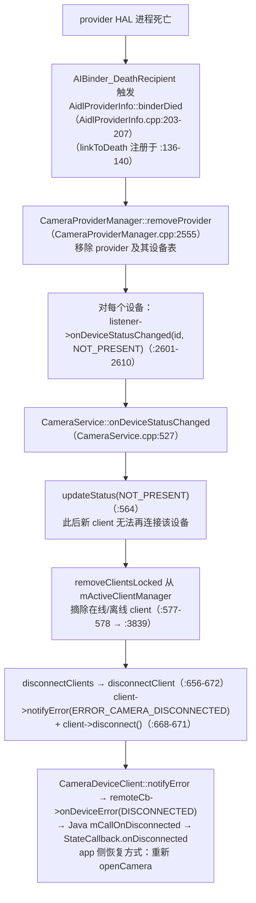
```mermaid
flowchart TD
    A["provider HAL 进程死亡"] --> B["AIBinder_DeathRecipient 触发<br/>AidlProviderInfo::binderDied（AidlProviderInfo.cpp:203-207）<br/>（linkToDeath 注册于 :136-140）"]
    B --> C["CameraProviderManager::removeProvider<br/>（CameraProviderManager.cpp:2555）<br/>移除 provider 及其设备表"]
    C --> D["对每个设备：<br/>listener->onDeviceStatusChanged(id, NOT_PRESENT)（:2601-2610）"]
    D --> E["CameraService::onDeviceStatusChanged<br/>（CameraService.cpp:527）"]
    E --> F["updateStatus(NOT_PRESENT)（:564）<br/>此后新 client 无法再连接该设备"]
    F --> G["removeClientsLocked 从 mActiveClientManager<br/>摘除在线/离线 client（:577-578 → :3839）"]
    G --> H["disconnectClients → disconnectClient（:656-672）<br/>client->notifyError(ERROR_CAMERA_DISCONNECTED)<br/>+ client->disconnect()（:668-671）"]
    H --> I["CameraDeviceClient::notifyError → remoteCb->onDeviceError(DISCONNECTED)<br/>→ Java mCallOnDisconnected → StateCallback.onDisconnected<br/>app 侧恢复方式：重新 openCamera"]
```

补充与勘误：

- **恢复**：provider 重启后由服务注册回调重新枚举（AIDL 走 `CameraService::onServiceRegistration` → `addAidlProviderLocked`，CameraProviderManager.cpp:953-968），设备状态翻回 PRESENT（CameraService.cpp:586-591），此后可重新打开；USB 外置摄像头走 `usbDeviceDetached` → `removeAllDevices` → 同样的 NOT_PRESENT 链路（:709 起）。
- main 分支的 `CameraService` 中**没有名为 `serviceDied` 的方法**：服务/进程死亡场景分别是（1）app client 的回调 binder 死亡 → `CameraService::binderDied`（CameraService.cpp:5858，linkToDeath 注册在 connect 完成时 :1938）→ `evictClientIdByRemote`（:3779）清理 client；（2）provider 死亡即上面的 `AidlProviderInfo::binderDied`；（3）Java 侧 CameraService 本体死亡由 CameraManagerGlobal 的 binderDied 兜底（第 2 章已述，ERROR_CAMERA_SERVICE）。
- `CameraService` 的 UidPolicy/SensorPrivacyPolicy 也已并入 CameraService.cpp（如 `UidPolicy::binderDied` :5054 监听 ActivityManager 死亡），与结果链路无直接交互。

**flush 语义**：`CameraDeviceClient::detachDevice`（断连/关闭前）会先 `mDevice->flush()` + `waitUntilDrained()`（CameraDeviceClient.cpp:2330-2337）。`Camera3Device::flush`（Camera3Device.cpp:1846）：`mRequestThread->clear(frameNumber)` 清掉排队请求并返回 lastFrameNumber（:1860，Java 侧由此收到 `onRepeatingRequestError`，CameraDeviceClient.cpp:2223）→ `mCameraServiceWatchdog->WATCH(mRequestThread->flush())`（:1866）→ `AidlCamera3Device::AidlHalInterface::flush`（AidlCamera3Device.cpp:766）调 `ICameraDeviceSession.flush()` 通知 HAL 立即作废在途请求。随后在回调侧由 `flushInflightRequests`（Camera3Device.cpp:2962 → Camera3OutputUtils.cpp:1280）兜底回收：把 in-flight 表中暂存的 pending 缓冲全部按错误归还、清空 `mInFlightMap`（:1307）、再通过 `popInflightBuffer`/`popInflightRequestBuffer` 找回已交给 HAL 但未归还的缓冲（:1316-1351），全部以 `CAMERA_BUFFER_STATUS_ERROR` 还给流（:1361-1376）。app 感知即 `CaptureFailure.REASON_FLUSHED` + Surface 不再出帧。

**CameraServiceWatchdog（卡死自愈）**：每台设备在 `Camera3Device::initializeCommonLocked` 里创建并启动（Camera3Device.cpp:260-262），开关由 `connectDevice` 时 `client->setCameraServiceWatchdog(...)` 决定（CameraService.cpp:2637-2638，可用 `cmd media.camera set-watchdog [0/1]` 动态切换，:6220）。`WATCH` 宏（CameraServiceWatchdog.h:43）包裹被监控调用（目前是 flush :1866 与 close :358 两处慢调用）：threadLoop 每 `kCycleLengthMs=100ms` 给该线程的 cycle +1（CameraServiceWatchdog.cpp:44-49），连续 `kMaxCycles=650` 个周期（约 65s）未结束即 `android_set_abort_message` + **abort() 整个 cameraserver 进程**（:53-63，可选地对 provider pid 发 SIGABRT，受 `enable_hal_abort_from_cameraservicewatchdog` flag 控制），由系统重启服务实现自愈；无监控对象时线程休眠（:18-24）。它与 4.1 的 in-flight 超时告警互补：`checkInflightMapLengthLocked`（Camera3Device.cpp:2932，阈值 Camera3Device.h:390-392：总时长 >5s 且帧数 >30/HighSpeed >256）只是打 warning，不做强杀。

## 4.5 一帧的完整回程（sequenceDiagram）

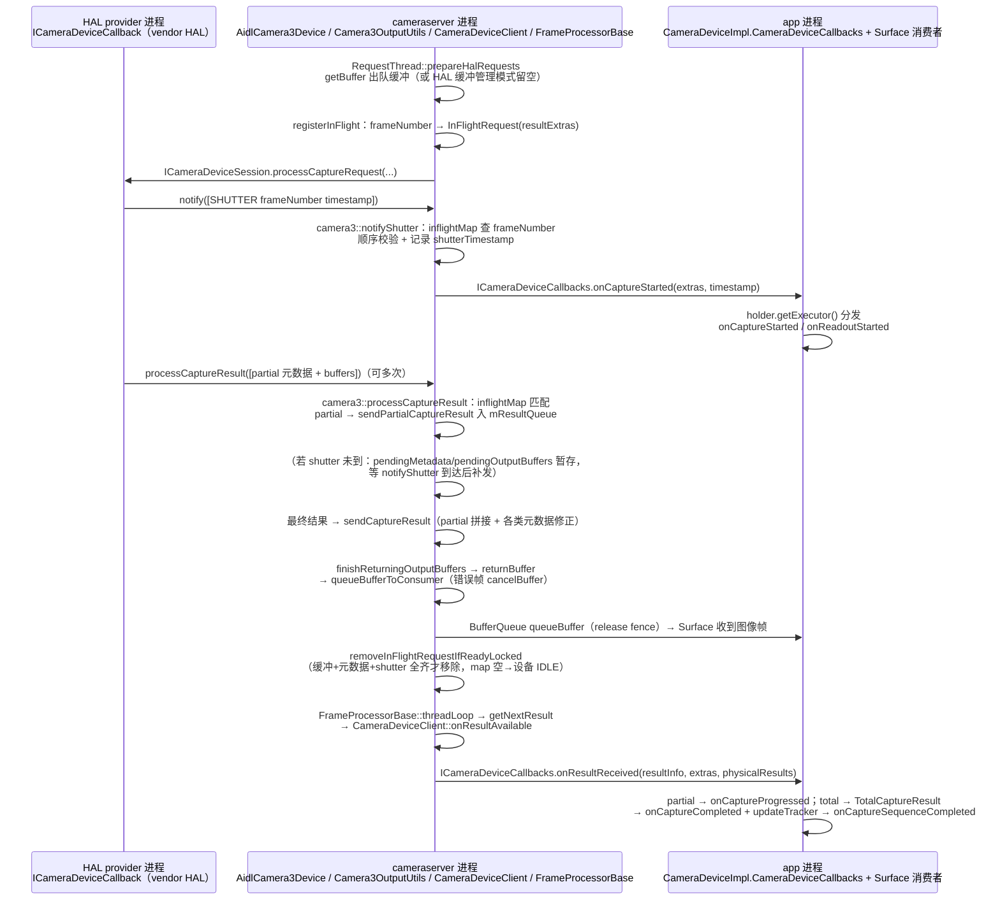
```mermaid
sequenceDiagram
    participant HAL as HAL provider 进程<br/>ICameraDeviceCallback（vendor HAL）
    participant CS as cameraserver 进程<br/>AidlCamera3Device / Camera3OutputUtils / CameraDeviceClient / FrameProcessorBase
    participant App as app 进程<br/>CameraDeviceImpl.CameraDeviceCallbacks + Surface 消费者

    CS->>CS: RequestThread::prepareHalRequests<br/>getBuffer 出队缓冲（或 HAL 缓冲管理模式留空）
    CS->>CS: registerInFlight：frameNumber → InFlightRequest(resultExtras)
    CS->>HAL: ICameraDeviceSession.processCaptureRequest(...)
    HAL->>CS: notify([SHUTTER frameNumber timestamp])
    CS->>CS: camera3::notifyShutter：inflightMap 查 frameNumber<br/>顺序校验 + 记录 shutterTimestamp
    CS->>App: ICameraDeviceCallbacks.onCaptureStarted(extras, timestamp)
    App->>App: holder.getExecutor() 分发<br/>onCaptureStarted / onReadoutStarted
    HAL->>CS: processCaptureResult([partial 元数据 + buffers])（可多次）
    CS->>CS: camera3::processCaptureResult：inflightMap 匹配<br/>partial → sendPartialCaptureResult 入 mResultQueue
    CS->>CS: （若 shutter 未到：pendingMetadata/pendingOutputBuffers 暂存，<br/>等 notifyShutter 到达后补发）
    CS->>CS: 最终结果 → sendCaptureResult（partial 拼接 + 各类元数据修正）
    CS->>CS: finishReturningOutputBuffers → returnBuffer<br/>→ queueBufferToConsumer（错误帧 cancelBuffer）
    CS->>App: BufferQueue queueBuffer（release fence）→ Surface 收到图像帧
    CS->>CS: removeInFlightRequestIfReadyLocked<br/>（缓冲+元数据+shutter 全齐才移除，map 空→设备 IDLE）
    CS->>CS: FrameProcessorBase::threadLoop → getNextResult<br/>→ CameraDeviceClient::onResultAvailable
    CS->>App: ICameraDeviceCallbacks.onResultReceived(resultInfo, extras, physicalResults)
    App->>App: partial → onCaptureProgressed；total → TotalCaptureResult<br/>→ onCaptureCompleted + updateTracker → onCaptureSequenceCompleted
```

## 4.6 错误分类决策（flowchart）

```mermaid
flowchart TD
    A["HAL NotifyMsg.error / 结果缓冲 STATUS_ERROR / 框架自检失败"] --> B{"notifyError 映射<br/>（Camera3OutputUtils.cpp:1143 halErrorMap）"}
    B -->|"CAMERA_MSG_ERROR_DEVICE"| C["SET_ERR → setErrorStateLockedV<br/>（Camera3Device.cpp:2855）<br/>setPaused + STATUS_ERROR + 保存 trace"]
    B -->|"REQUEST / RESULT"| D["标记 inflight：requestStatus +<br/>skipResultMetadata + errorBufStrategy（:1213-1220）"]
    B -->|"BUFFER notify"| E["忽略 HAL 的 ERROR_CAMERA_BUFFER（:1253）<br/>app 通知改由缓冲 STATUS_ERROR 驱动"]
    C --> F["notifyError(ERROR_CAMERA_DEVICE)<br/>→ CameraDeviceClient::notifyError<br/>→ onDeviceError"]
    D --> G["归还该帧缓冲 + notifyError(REQUEST/RESULT)"]
    E --> H["collectReturnableOutputBuffers 发现<br/>STATUS_ERROR 缓冲 → notifyError(ERROR_CAMERA_BUFFER)<br/>（errorStreamId，:892-901）"]
    F --> I["Java onDeviceError<br/>ERROR_CAMERA_DEVICE → scheduleNotifyError<br/>→ mDeviceExecutor 回调 onError（设备不可用）<br/>★ 杀会话：只能关闭后重新 openCamera"]
    G --> J["Java onCaptureErrorLocked（CameraDeviceImpl.java:2123）<br/>CaptureFailure（REASON_ERROR，<br/>会话 abort 中则 REASON_FLUSHED）→ onCaptureFailed"]
    H --> K["Java onCaptureErrorLocked<br/>按 Surface 逐个 onCaptureBufferLost（:2160-2176）<br/>★ 单帧失败：设备继续出流"]
    L["消费者断开 → 流 isAbandoned /<br/>getBuffer 返回 DEAD_OBJECT"] --> M["该请求跳过（prepareHalRequests 返回 TIMED_OUT）<br/>reconfigureCamera 检测 checkAbandonedStreamsLocked<br/>（Camera3Device.cpp:2382）→ 触发整条管线重配置"]
    N["请求卡死（HAL 不返回）/ close 超时"] --> O["CameraServiceWatchdog：flush/close 被 WATCH 包裹<br/>65s 无响应 → abort cameraserver 进程（自愈重启）"]
    P["flush / abortCaptures"] --> Q["RequestThread::clear + HAL flush<br/>flushInflightRequests 按错误归还全部在途缓冲<br/>app 收 REASON_FLUSHED 的 onCaptureFailed"]
```

---

> 本章把"结果怎么回来、缓冲怎么流转、出错怎么办"三条线收拢到 in-flight 表上：frameNumber 是贯穿 HAL→cameraserver→app 的唯一主线，requestId 只在 Java 回调匹配时才登场。配合第 3 章的请求下行链路，Camera2 API2 的一次完整拍帧闭环至此讲完。


