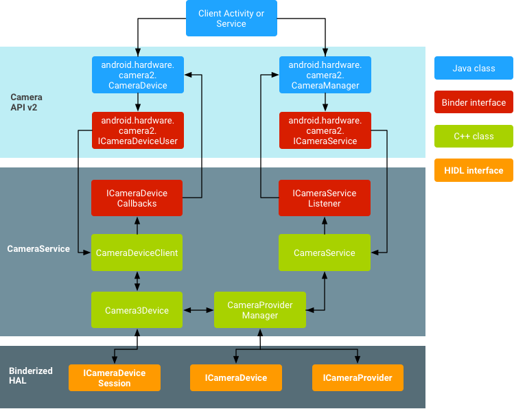
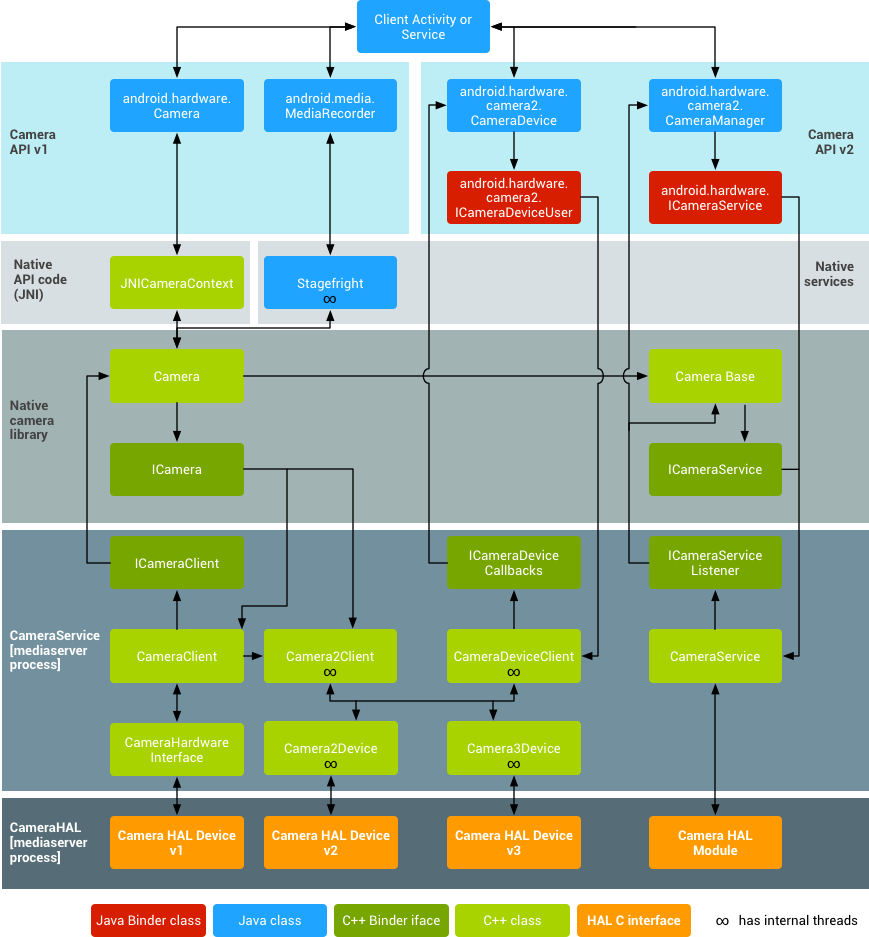
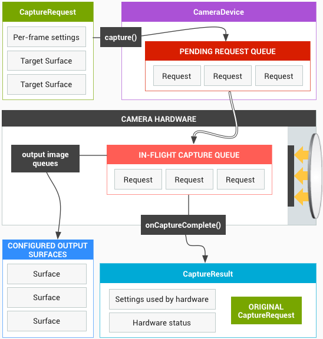
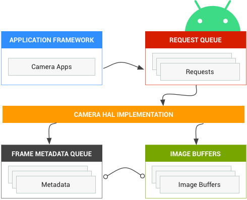
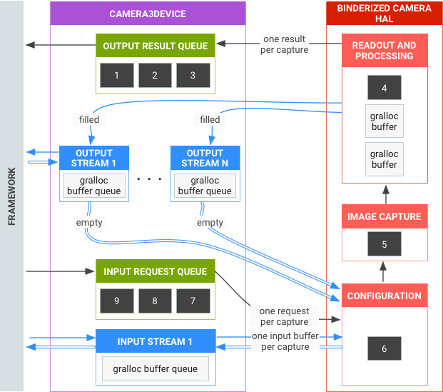
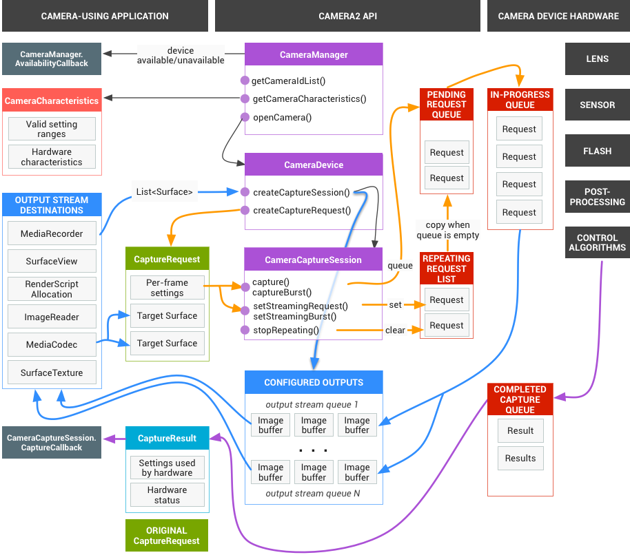
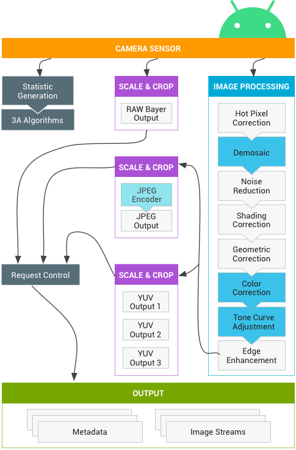
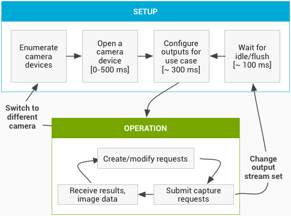

# 第 1 章 概览与架构

> 本章内容整理自 AOSP 官方文档（中文版）Camera 板块的三个页面：
> [概览](https://source.android.google.cn/docs/core/camera)、
> [相机 HAL](https://source.android.google.cn/docs/core/camera/camera3)、
> [HAL 子系统](https://source.android.google.cn/docs/core/camera/camera3_requests_hal)。
> 面向希望系统学习 Android Camera 框架的工程师。

## 1.1 概览

> 来源：[概览](https://source.android.google.cn/docs/core/camera?hl=zh-cn)

### 1.1.1 这一页讲什么

AOSP 相机概览页回答一个核心问题：Android 相机硬件抽象层（Camera HAL，Hardware Abstraction Layer）如何把高层框架 API（Camera 2 / `android.hardware.camera2`）连接到底层的相机驱动程序和硬件，以及实现一个相机 HAL 需要满足哪些要求。它给出了整条相机软件栈的分层架构图、跨进程通信的 Binder 接口清单，以及 HAL 接口的演进（旧版接口 → HIDL 化）。

### 1.1.2 核心架构（图 1：相机架构）

自上而下的分层结构如下：

- **应用框架（Application framework）**：应用代码通过 Camera 2 API 与相机硬件交互，内部经由 Binder 接口访问原生代码。
- **AIDL**：与 CameraService 关联的 Binder 接口位于 `frameworks/av/camera/aidl/android/hardware`，生成的代码调用低层原生代码访问实体相机，返回用于创建 `CameraDevice` 和 `CameraCaptureSession` 的数据。
- **原生框架（Native framework）**：位于 `frameworks/av/`，提供与 `CameraDevice` / `CameraCaptureSession` 对应的原生类（另有 NDK `camera2` 参考文档）。
- **Binder IPC 接口**：实现跨进程边界通信，关键接口（均在 `frameworks/av/camera` 下）：

  | 接口 | 作用 |
  |---|---|
  | `ICameraService` | 相机服务接口 |
  | `ICameraDeviceUser` | 已打开的特定相机设备接口 |
  | `ICameraServiceListener` | 对应用框架的 CameraService 回调 |
  | `ICameraDeviceCallbacks` | 对应用框架的 CameraDevice 回调 |

- **相机服务（CameraService）**：位于 `frameworks/av/services/camera/libcameraservice/CameraService.cpp`，是实际与 HAL 交互的代码。
- **HAL**：由相机服务调用、由实现者实现的标准接口，保证相机硬件正常工作。
- **内核驱动程序 / 硬件**（旧版架构图中明确列出该层）。

### 1.1.3 进程边界与安全模型

架构中有两个重要的进程边界：

- 应用 ↔ CameraService：通过 Binder IPC 通信，应用传来的参数被视为**不可信且未经排错**；
- CameraService ↔ HAL：这一边界被视为**安全边界（security boundary）**，HAL 必须自行验证参数（检查缓冲区长度范围、使用前排错/前置净化），以防止权限提升或越权数据访问漏洞。

### 1.1.4 旧版相机架构（图 2：Legacy）

旧版链路为：应用框架使用旧 API `android.hardware.Camera` → JNI（`frameworks/base/core/jni/android_hardware_Camera.cpp`）→ 原生框架（`frameworks/av/camera/Camera.cpp`）→ 三个 Binder IPC 代理类（`ICameraService`、`ICamera`、`ICameraClient`）→ 相机服务 → HAL → 内核驱动。旧架构要求相机和驱动支持 **YV12 与 NV21** 图像格式以支持预览显示和视频录制。

### 1.1.5 关键术语

- 相机硬件抽象层 Camera HAL
- 相机服务 CameraService
- 相机设备 CameraDevice / 相机捕获会话 CameraCaptureSession
- Binder 进程间通信 Binder IPC
- 绑定式 HAL Binderized HAL / 旧版 HAL 组件 Legacy HAL components
- 相机提供程序 ICameraProvider / 设备会话 ICameraDeviceSession

### 1.1.6 HAL 接口形态

- **旧版（legacy）接口**：定义在 `hardware/libhardware/include/hardware/camera.h` 与 `camera_common.h`。`camera_common.h` 定义 `camera_module` 标准结构（枚举相机 ID、前/后置等通用属性）；`camera.h` 声明 `camera_device` 结构，内含函数指针表 `camera_device_ops`，参数通过 `set_parameters()`（字符串键值对，见 `CameraParameters.h`）设置。参考实现：Galaxy Nexus 的 `hardware/ti/omap4xxx/camera`。
- **HIDL 化要求**：Android 8.0 起，相机 HAL 必须使用 HIDL 接口，不再支持旧版接口。需实现三个核心接口：`ICameraProvider`（provider/2.4，枚举设备并管理状态）、`ICameraDevice`（device/3.2）、`ICameraDeviceSession`（device/3.2），定义位于 `hardware/interfaces/camera`。官方参考 HIDL 实现是对仍使用旧版 API（`camera3.h`）的旧 HAL3 的封装。
- 旧版 HAL 共享库需命名为 `camera.<device_name>`，`LOCAL_MODULE_RELATIVE_PATH := hw`；并通过功能 XML（如 `android.hardware.camera.flash-autofocus.xml`）、`media_profiles.xml`、`media_codecs.xml` 声明能力和编解码配置。

## 1.2 相机 HAL

> 来源：[相机 HAL](https://source.android.google.cn/docs/core/camera/camera3?hl=zh-cn)

### 1.2.1 这一页讲什么

"相机 HAL" 页介绍 Camera HAL 如何将 `android.hardware.camera2` 框架 API 连接到相机驱动和硬件，重点对比了 HAL3 的**管道（pipeline）功能模型**与 HAL1 的**黑盒模型**，并说明了接口的演进主线：Android 8.0（Treble）切换到 HIDL 稳定接口，Android 13 起改用 **AIDL**，此后新增的相机功能只能通过 AIDL 接口使用，厂商要用新功能必须从 HIDL 迁移到 AIDL。

### 1.2.2 HAL3 管道模型（图 1：相机核心操作模型）

HAL3 把相机子系统建模为一条**管道**：按 1:1 的基准，把每个传入的帧捕获请求（capture request）转化为一帧输出。工作流程：

1. 输出 Surface 组需要**预先配置**（stream configuration），一次只能配置少量输出 Surface（约 3 个）；
2. 应用框架发出捕获请求：可单次 `capture()`，也可无限重复 `setRepeatingRequest()`；**单次捕获优先级高于重复请求**；
3. 每个请求产生：① 一个携带捕获元数据（metadata，含色彩空间、镜头遮蔽等）的 **Result 对象**；② 1 到 N 个图像数据缓冲区，各自进入自己的目标 Surface。

HAL3 将多种运行模式整合为统一视图，可以支持连拍（burst）等模式，并且对聚焦、曝光以及降噪、对比度、锐化等后处理提供更细粒度的控制。

### 1.2.3 HAL1 黑盒模型（图 2：相机组件）

HAL1 被设计为黑盒，仅有三种运行模式：**预览（preview）、视频录制（recording）、静态拍摄（still capture）**。三种模式之间功能互相重叠，难以实现介于两种模式之间的新功能（例如连拍）。这正是 HAL3 引入统一 request/result 管道模型的动因。

### 1.2.4 版本差异与演进

| 版本 | 模型 | 状态 |
|---|---|---|
| HAL1 | 黑盒，三种固定模式，扩展性差 | 已弃用；Android 7.0 起仅为兼容旧设备继续支持，Android 9+ 设备建议使用 HAL3 |
| HAL2 | 模块版本 2；模块版本必须 ≥ 设备版本，模块内可混合包含不同版本的设备 | 过渡形态，文档着墨少 |
| HAL3 | 统一管道视图、request/result 模型、细粒度控制 | 当前推荐版本 |

注意两点：一是相机服务**可同时支持 HAL1 和 HAL3**，实践中可以单独用 HAL1 支持性能要求较低的前置摄像头，用 HAL3 支持高级后置摄像头；二是每个 HAL 模块有自己的**模块版本号**，模块内列出的每个相机设备又有各自的**设备版本号**。

### 1.2.5 关键术语

- 捕获请求 capture request / 捕获 capture() / 重复请求 setRepeatingRequest()
- 结果对象 Result / 元数据 metadata / 输出流 output stream / 数据流配置 stream configuration
- 3A 模式 3A modes（AE 自动曝光、AF 自动对焦、AWB 自动白平衡）
- 会话参数 session parameters / 缓冲区管理 API buffer management API
- 单一生产方多个使用方 single producer, multiple consumer
- HIDL / AIDL / VTS（供应商测试套件）/ CTS（兼容性测试套件）

### 1.2.6 AIDL 相机 HAL 与验证

AIDL 参考实现位于 `hardware/google/camera/common/hal/aidl_service/`，接口分布在：

- 相机提供程序：`hardware/interfaces/camera/provider/aidl/`
- 相机设备：`hardware/interfaces/camera/device/aidl/`
- 相机元数据：`hardware/interfaces/camera/metadata/aidl/`
- 公共数据类型：`hardware/interfaces/camera/common/aidl/`

迁移到 AIDL 时可能需要修改 SELinux 政策（sepolicy）和 RC 文件（取决于代码结构）。验证方面，HAL 必须通过全部 CTS 和 VTS 测试；Android 13 引入了 AIDL VTS 测试 `VtsAidlHalCameraProvider_TargetTest.cpp`。

### 1.2.7 Treble 与进程边界

Android 8.0 的 Treble 架构将相机框架（框架进程）与 HAL 实现（供应商进程）通过稳定的 HIDL/AIDL 接口解耦，这使框架与 vendor 分区可以独立升级。HAL 请求/结果的具体时序细节由子页面（如"HAL 子系统"）展开。

## 1.3 HAL 子系统

> 来源：[HAL 子系统](https://source.android.google.cn/docs/core/camera/camera3_requests_hal?hl=zh-cn)

### 1.3.1 这一页讲什么

"HAL 子系统"页是 HAL3 文档的核心页之一，描述应用框架如何通过**捕获请求（capture request）**与相机 HAL/相机子系统交互：请求模型、HAL 与相机管道的**虚拟模型**、启动与运行的完整操作顺序、硬件级别（hardware level）以及 3A 控件与处理管道的交互规则。

### 1.3.2 请求模型（request/result 模型的运行规则）

- 一个请求 = 一次捕获的全部配置：分辨率与像素格式、手动传感器/镜头/闪光灯控件、3A 模式、RAW→YUV 处理控件、统计信息生成开关等；一个请求对应一组结果。
- 可同时提交多个请求且**提交不阻塞**；HAL 必须**按接收顺序（FIFO）**处理请求，每个请求生成输出结果元数据和一个或多个输出图像缓冲区。
- 同一请求的所有输出必须使用**完全相同的时间戳**，便于框架把结果与请求匹配。
- 除 3A 例程外，所有捕获配置和状态都封装在请求和结果中（即"设置随请求走，状态随结果回"）。
- 并发**在途请求（in-flight requests）**数量由**管道深度（pipeline depth）**决定；由于流水线延迟，结果的返回会滞后于请求。

### 1.3.3 相机管道（图 2：相机管道）

相机子系统内含 3A 算法和处理控件的实现，HAL 提供实现这些组件的接口。**管道是虚拟模型**：不直接对应任何真实 ISP，但要足够接近真实处理管道以便映射到硬件，又要足够抽象以支持多种算法和运算顺序。管道支持框架触发的**触发器（trigger，如启动自动对焦）**，并通过**通知（notify，如对焦锁定、错误）**把事件回传给框架。管道的关键假设：

- RAW Bayer 输出在 ISP 内部不做处理；
- 统计信息（statistics）基于原始传感器数据生成；
- RAW→YUV 的各处理块可按任意顺序排列；
- 多个缩放/剪裁单元共享输出区域控件（数字缩放），但各单元可有不同的输出分辨率和像素格式。

处理块有三种模式：**OFF**（停用；去马赛克、色彩校正、色调曲线调整不可停用）、**FAST**（不降帧率下尽量最佳质量，常用于预览/录制/连拍）、**HIGH_QUALITY**（允许降帧率换取最佳质量，常用于优质静态拍摄）。

### 1.3.4 操作顺序（图 4：相机操作流程）

从启动到收帧的完整序列：

1. 框架监听实现 `ICameraProvider` 接口的相机提供程序并连接；
2. `ICameraProvider::getCameraIdList()` 枚举设备；
3. `getCameraDeviceInterface_VX_X()` 实例化 `ICameraDevice`；
4. `ICameraDevice::open()` 创建有效会话 `ICameraDeviceSession`；
5. `configureStreams()` 传入输入/输出流列表；
6. `constructDefaultRequestSettings()` 获取用例默认设置；
7. 框架构造第一个捕获请求，经 `processCaptureRequest()` 发送；HAL 必须阻塞该调用直到准备好接收下一个请求；
8. 捕获开始曝光时，HAL 调用 `ICameraDeviceCallback::notify()` 发送 **SHUTTER 消息**（含帧号 frame number 与曝光开始时间戳 timestamp）；SHUTTER 不必先于结果，但在 `notify()` 之前结果不会提供给应用；
9. 经流水线延迟后，HAL 通过 `processCaptureResult()` 按请求提交顺序返回完成捕获。

会话结束、流重配与错误处理：框架可停止提交新请求，等现有捕获完成后再次 `configureStreams()` 重配（部分流可复用；若至少还有一个已注册输出流，可从第一个捕获请求继续）；`close()` 可能阻塞至所有捕获完成，返回后 HAL 不得再调用回调；发生严重设备级错误时，HAL 应先取消/完成待处理捕获再 `notify()`，此后除 `close()` 外的方法应返回 `-ENODEV` 或 NULL。

### 1.3.5 3A 控件与管道交互

依据 3A 设置，管道会**忽略请求中的某些参数**、改用 3A 值，但 3A 选定的值必须在输出元数据中报告：

- AE 开启时，`android.sensor.exposureTime` / `frameDuration` / `sensitivity` 及 `aperture`、`filterDensity`（如支持）由平台 3A 控制；
- `android.control.aeMode`：OFF / ON / ON_AUTO_FLASH / ON_ALWAYS_FLASH / ON_AUTO_FLASH_RED_EYE；
- `awbMode`：OFF / WHITE_BALANCE_* → 映射到 `android.colorCorrection.transform`；
- `afMode`：OFF / FOCUS_MODE_* → 映射到 `android.lens.focusDistance`；
- `videoStabilization`：可通过调整 `android.scaler.cropRegion` 实现防抖；
- `control.mode`：OFF / AUTO / SCENE_MODE_*，场景模式可替换所有 3A 参数并停用各 3A 控件。

### 1.3.6 带宽与帧率模型

- 最大帧率的限制因素：输出流分辨率、成像器像素合并/跳过（binning/skipping）模式可用性、成像器接口带宽、各 ISP 处理块带宽。
- 带宽抽象模型：传感器被配置为输出满足请求的最大流所需的最小分辨率；由于任一请求可能使用任意/全部已配置输出流，传感器和 ISP 必须支持单次捕获同时扩展到所有流。
- 不含 JPEG 流的请求中，JPEG 流表现得像经处理的 YUV 流；JPEG 处理器可与管道其余部分并行运行，但一次只能处理一个捕获。

### 1.3.7 关键术语

- 请求队列 request queue（FIFO）/ 在途请求 in-flight requests / 管道深度 pipeline depth
- SHUTTER 通知（帧号 frame number + 时间戳 timestamp）
- 流配置 stream configuration / 缓冲区 buffer / 信息流 stream
- 3A：AE 自动曝光、AWB 自动白平衡、AF 自动对焦
- 硬件级别 hardware level（`INFO_SUPPORTED_HARDWARE_LEVEL`）
- ISP 图像信号处理器 / RAW Bayer / YUV / JPEG 流

### 1.3.8 与 sync framework 的关系

本页正文对同步机制只提出时间戳一致性要求（同一请求所有输出时间戳必须相同）；缓冲区的跨进程生命周期同步（fence / sync framework）由 HAL3 缓冲区管理 API（buffer management API）与图形栈的 sync framework 承担：框架在向 HAL 传递输入/输出缓冲区时以 acquire/release fence 标记缓冲区就绪与消费完成的时机，从而实现 CPU/GPU/ISP 之间的异步流水线并行，避免帧间阻塞。学习时可结合"缓冲区管理 API"与图形章节的 sync framework 文档深入。

### 1.3.9 API 用途摘要

枚举相机设备 → 打开设备并连接监听器 → 配置输出（流）→ 创建请求 → 单次/重复捕获与连拍 → 接收结果元数据和图像数据 → 切换用例时回到配置输出步骤。

