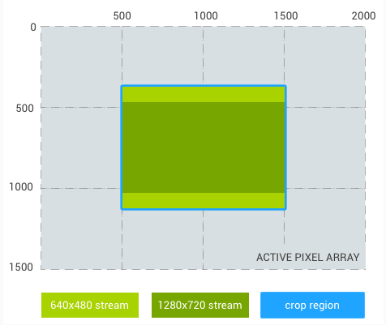
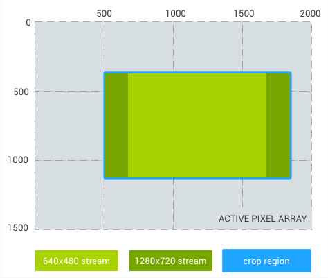
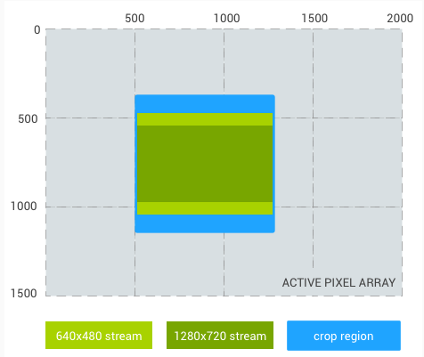
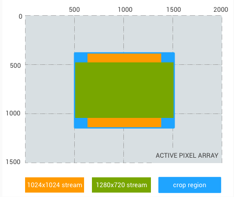
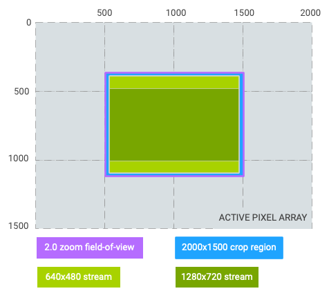
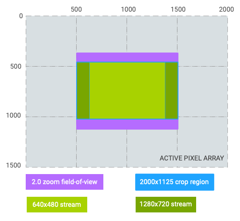
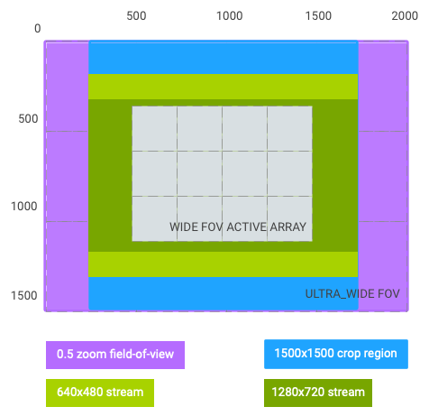

# 第 2 章 核心概念

本章基于 Android AOSP 官方文档（中文版）"Camera 板块 → 核心概念"组页面整理，涵盖 3A 模式与状态机、相机调试、错误与信息流处理、元数据与控件、输出流剪裁与缩放、请求的创建与提交、数据流配置共七个主题。

## 2.1 3A 模式和状态转换

> 来源：[3A 模式和状态转换](https://source.android.google.cn/docs/core/camera/camera3_3Amodes?hl=zh-cn)

### 2.1.1 概述与基本规则

相机 HAL 接口在抽象层面定义了 3A（自动曝光 AE、自动对焦 AF、自动白平衡 AWB）的状态机，用于 HAL 实现与 Android 框架之间传达当前 3A 状态并触发 3A 事件；HAL 实现负责控制 3A 模式设置和状态转换的 3A 算法。关键规则：

- 设备开启时，所有 3A 状态必须为 `STATE_INACTIVE`。
- 流配置（`configure()`）**不会重置** 3A，例如在整个 configure 调用期间必须保持焦点锁定。
- 触发 3A 操作只需在下一个请求设置中设置相关触发条目：例如将 `ANDROID_CONTROL_AF_TRIGGER` 设为 `AF_TRIGGER_START` 启动 AF 扫描，设为 `AF_TRIGGER_CANCEL` 取消扫描；否则条目不存在或为 `AF_TRIGGER_IDLE`。任何触发条目为非 IDLE 值的请求都被视为独立触发事件。

### 2.1.2 顶层控制模式（ANDROID_CONTROL_MODE）

| 模式 | 行为 |
| --- | --- |
| `OFF` | 单个 AF/AE/AWB 模式均有效关闭，任何拍摄控件都不会被 3A 例程覆盖 |
| `AUTO` | AF、AE、AWB 各自运行独立算法，拥有自己的模式、状态和触发元数据条目 |
| `USE_SCENE_MODE` | 由 `ANDROID_CONTROL_SCENE_MODE` 决定 3A 行为。除 `FACE_PRIORITY` 外，HAL 必须将 AE/AWB/AF_MODE 替换为该场景偏好的模式（如 NIGHT 场景偏好 CONTINUOUS_FOCUS）；`FACE_PRIORITY` 下控件行为与 AUTO 相同，但 3A 必须偏向对场景中检测到的人脸测光和对焦 |

### 2.1.3 AF（自动对焦）模式与状态

| 元数据条目 | 说明 |
| --- | --- |
| `AF_MODE_OFF` | AF 停用；框架/应用直接控制镜头位置 |
| `AF_MODE_AUTO` | 单相扫描自动对焦，镜头除触发外不移动 |
| `AF_MODE_MACRO` | 单相扫描近距离自动对焦 |
| `AF_MODE_CONTINUOUS_VIDEO` | 流畅连续对焦（录制视频）；触发后立刻锁定焦点，取消后恢复连续对焦 |
| `AF_MODE_CONTINUOUS_PICTURE` | 快速连续对焦（零快门延迟静像）；当前扫描结束后触发锁定 |
| `AF_MODE_EDOF` | 扩展景深，无扫描，触发/取消均无效 |

AF 状态（`ANDROID_CONTROL_AF_STATE`）：`INACTIVE`（初始，仅用于 OFF/EDOF）、`PASSIVE_SCAN`、`PASSIVE_FOCUSED`、`PASSIVE_UNFOCUSED`、`ACTIVE_SCAN`、`FOCUSED_LOCKED`、`NOT_FOCUSED_LOCKED`。触发条目 `ANDROID_CONTROL_AF_TRIGGER`：`IDLE` / `START` / `CANCEL`。

### 2.1.4 AF 状态转换表（节选）

| 模式 | 状态 | 转换原因 | 新状态 |
| --- | --- | --- | --- |
| AUTO/MACRO | 无效 | AF_TRIGGER | ACTIVE_SCAN（开始 AF 扫描） |
| AUTO/MACRO | ACTIVE_SCAN | AF 扫描完成 | FOCUSED_LOCKED 或 NOT_FOCUSED_LOCKED |
| AUTO/MACRO | ACTIVE_SCAN | AF_CANCEL | 无效（取消/重置） |
| AUTO/MACRO | FOCUSED/NOT_FOCUSED_LOCKED | AF_TRIGGER | ACTIVE_SCAN（开始新扫描） |
| CONTINUOUS_VIDEO/PICTURE | 无效 | HAL 启动新扫描 | PASSIVE_SCAN |
| CONTINUOUS_VIDEO/PICTURE | 无效 | AF_TRIGGER | NOT_FOCUSED_LOCKED（AF 状态查询） |
| CONTINUOUS_VIDEO/PICTURE | PASSIVE_SCAN | HAL 完成扫描 | PASSIVE_FOCUSED |
| CONTINUOUS_VIDEO/PICTURE | PASSIVE_SCAN | AF_TRIGGER | FOCUSED_LOCKED（对焦理想）或 NOT_FOCUSED_LOCKED（对焦不良） |
| CONTINUOUS_VIDEO/PICTURE | FOCUSED/NOT_FOCUSED_LOCKED | AF_TRIGGER | 无效果（锁定状态保持） |
| 所有模式 | 所有状态 | 模式更改 | 无效（重置为 INACTIVE） |

### 2.1.5 AE（自动曝光）模式与状态

AE 模式（`ANDROID_CONTROL_AE_MODE`）：`OFF`（用户手动控制曝光/增益/帧时长/闪光）、`ON`、`ON_AUTO_FLASH`、`ON_ALWAYS_FLASH`、`ON_AUTO_FLASH_REDEYE`、`ON_LOW_LIGHT_BOOST_BRIGHTNESS_PRIORITY`（弱光增强，厂商须保证帧速率不低于 10 fps）。

AE 状态（`ANDROID_CONTROL_AE_STATE`）：`INACTIVE`、`SEARCHING`、`CONVERGED`、`LOCKED`、`FLASH_REQUIRED`（已聚焦曝光但需闪光保证亮度，用于判断零快门延迟帧可用性）、`PRECAPTURE`（正在处理预拍序列）。触发条目 `ANDROID_CONTROL_AE_PRECAPTURE_TRIGGER`：`IDLE` / `START`。其他控件：`AE_LOCK`、`AE_EXPOSURE_COMPENSATION`、`AE_TARGET_FPS_RANGE`、`AE_REGIONS`。

### 2.1.6 AWB（自动白平衡）模式与状态

AWB 模式（`ANDROID_CONTROL_AWB_MODE`）：`OFF`、`AUTO`，以及固定色温预设——`INCANDESCENT`（约 2700K）、`FLUORESCENT`（约 5000K）、`WARM_FLUORESCENT`（约 3000K）、`DAYLIGHT`（约 5500K）、`CLOUDY_DAYLIGHT`（约 6500K）、`TWILIGHT`（约 15000K）、`SHADE`（约 7500K）。AWB 状态：`INACTIVE`、`SEARCHING`、`CONVERGED`、`LOCKED`。其他控件：`AWB_LOCK`、`AWB_REGIONS`。

### 2.1.7 AE/AWB 状态机与手动控制

AE 与 AWB 状态机大致相同，AE 多出 `FLASH_REQUIRED` 和 `PRECAPTURE` 两个状态。开启 `AE_MODE_ON_*` / `AWB_MODE_AUTO` 时：无效 → SEARCHING（HAL 启动扫描）→ CONVERGED（完成）；任意状态开启 `AE/AWB_LOCK` → LOCKED；LOCKED 状态下关闭 LOCK → SEARCHING / CONVERGED（视值是否理想）；所有 AE 状态收到 `PRECAPTURE_START` → PRECAPTURE → 序列完成后进入 CONVERGED 或 LOCKED。

手动控制：每个请求中 HAL 检查 3A 控制字段，若启用了某 3A 例程则覆盖相关控制变量，并在结果元数据中体现（例如应用请求帧时长为 0，HAL 限制到实际最小值并上报）。`android.control.mode=OFF` 时 HAL 启用的 3A 控件全部停用，应用须直接设置 `android.lens.focusDistance`、`android.sensor.exposureTime/.sensitivity/.frameDuration` 等字段。

## 2.2 相机调试

> 来源：[相机调试](https://source.android.google.cn/docs/core/camera/debugging?hl=zh-cn)

相机服务内置了 **watch 命令** 和 **dumpsys 命令** 两类调试工具，用于查看发送到/来自相机 HAL（Camera HAL）的拍摄请求（capture request）和结果值的变化。

### 2.2.1 watch 命令（Android 13+）

**开始监控 tags：**

```bash
adb shell cmd media.camera watch start -m <tags> [-c <clients>]
```

示例：

```bash
adb shell cmd media.camera watch start \
  -m android.control.effectMode,android.control.aeMode \
  -c com.google.android.GoogleCamera,com.android.chrome
```

- `tags`：要监控的 tag 逗号分隔列表，支持简写 `3a`，即所有 AF/AE/AWB 相关的 `android.control.*` tag 集合（完整列表见 `TagMonitor.cpp`）。
- `clients`：可选，客户端包名逗号分隔列表；不传或传 `all` 则监控所有客户端。
- 未调用 start 时，相机服务不会监控任何客户端 tag，也不会缓存转储；start 之后关闭的客户端，其转储会被缓存。

**转储监控信息：**

```bash
adb shell cmd media.camera watch dump
```

输出自 start（或上次 clear）以来关闭客户端的缓存转储以及打开客户端的最新转储，输出形如：

```text
Client: com.android.chrome (active)
1:com.android.chrome f0:...ns: REQ:android.control.aeMode: [ON] output stream ids: 0
```

**实时预览：**

```bash
adb shell cmd media.camera watch live [-n refresh_interval_ms]
```

默认刷新间隔 1000 ms，例如 `adb shell cmd media.camera watch live -n 250`，按回车退出。输出包含 `REQ:`（请求）与 `RES:`（结果）行，如 `RES:android.control.aeState: [SEARCHING]`、`RES:android.control.afState: [PASSIVE_SCAN]`。

**清除缓存与停止：**

```bash
adb shell cmd media.camera watch clear   # 清除缓存转储，不停止监控
adb shell cmd media.camera watch stop    # 停止监控所有客户端并清除所有缓存缓冲区
```

### 2.2.2 dumpsys 命令

```bash
adb shell dumpsys media.camera            # 完整调试转储
adb shell dumpsys media.camera -m 3a | grep -A50 Monitored
```

限制：dumpsys 只能捕获来自**打开客户端**的 tag 监控转储，**不提供关闭客户端的转储**。可配合 Linux `watch` 命令做实时预览：`watch -n 1 -c 'adb shell dumpsys media.camera -m 3a | grep -A50 Monitored'`。

### 2.2.3 术语对照

| 中文 | 英文 |
| --- | --- |
| 相机调试 | camera debugging |
| 相机服务 | camera service |
| 拍摄请求 | capture request |
| 代码（标签） | tag |
| 客户端 | client |
| 转储 | dump |
| 打开/关闭的客户端 | active / cached client |

## 2.3 错误和信息流处理

> 来源：[错误和信息流处理](https://source.android.google.cn/docs/core/camera/camera3_error_stream?hl=zh-cn)

该页面规定相机 HIDL 接口的错误管理与信息流管理基本要求。

### 2.3.1 错误管理（Error Management）

- 与摄像头交互的 HIDL 接口方法必须生成相应的**摄像头特定状态**（camera-specific status）。
- **设备级错误的后果**：一旦调用了 `ICameraDeviceCallbacks::notify()` 且返回 `ERROR_DEVICE`，就只允许成功调用 `ICameraDeviceSession::close()`，其他所有方法都将返回 `INTERNAL_ERROR`。
- **瞬时错误（transient errors）**：图片拍摄过程中的瞬时错误必须通过 `ICameraDeviceCallbacks::notify()` 报告并返回相应错误代码（参见 device/3.2 types.hal）。发生各类瞬时失败时，HAL 仍必须调用 `ICameraDeviceCallbacks::processCaptureResult()` 并返回相应的**捕获结果**（capture result，参见 types.hal），即"失败也要带回结果元数据"。

### 2.3.2 信息流管理（Stream Management）

HAL 客户端必须通过调用 `ICameraDeviceSession::configureStreams()` 来配置摄像头信息流（camera streams）。缓冲区管理细节见"Camera HAL3 缓冲区管理 API"页面，数据流配置规则见 2.7 节。

### 2.3.3 关键术语

| 术语 | 英文 |
| --- | --- |
| 设备错误 | `ERROR_DEVICE` |
| 内部错误 | `INTERNAL_ERROR` |
| 错误通知回调 | `notify()` |
| 捕获结果回调 | `processCaptureResult()` |
| 信息流配置 | `configureStreams()` |
| 会话关闭 | `close()` |

## 2.4 元数据和控件

> 来源：[元数据和控件](https://source.android.google.cn/docs/core/camera/camera3_metadata?hl=zh-cn)

该页面是相机 HAL3 文档的概念概述，分三部分说明元数据与控件体系（具体的元数据条目命名空间如 `android.request.*`、`android.control.*`、`android.lens.*`、`android.sensor.*` 及其枚举值定义在相机 HAL 参考文档中）。

### 2.4.1 元数据支持（Metadata Support）

- 要支持通过 Android 框架保存**原始图片文件**（RAW），需要大量关于**传感器特性**的元数据，包括**色彩空间**（color space）和**镜头遮蔽**（lens shading）相关信息。这些大多是相机子系统的**静态属性**，可在配置任何输出流水线或提交任何捕获请求**之前**查询；新相机 API 大幅扩展了 `getCameraInfo()` 所能提供的信息。
- **动态元数据要求**：手动控制相机子系统需要设备反馈其当前状态及捕获指定帧时**实际使用的参数**。硬件实际使用的曝光时间（exposure time）、帧时长（frame duration）、感光度（sensitivity）等实际值必须包含在**输出元数据**中——这样应用才知道限制（clamp）或舍入何时发生，并可补偿用于图片拍摄的实际设置。例如应用请求帧时长为 0 时，HAL 必须限制到该请求的实际最小帧时长并在结果元数据中报告该值。
- 典型用例：应用实现**自定义 3A 例程**（如为 HDR 连拍正确测量）时，需要知道捕获最近一组结果所用的设置，以更新下一个请求。
- 因此每个捕获的帧带有大量**动态每帧元数据**：已请求参数（requested parameters）、实际参数（actual parameters）、**时间戳**（timestamps）、**统计信息生成器输出**（statistics generator output）等。

### 2.4.2 每个设置的控件（Per-Setting Controls）

- 对大多数设置应能**随每一帧变化**，且不给输出帧流带来明显卡顿或延迟；理想情况下输出帧速率仅由捕获请求的**帧时长字段**控制，不受处理块配置变化影响。
- 已知变化较慢的控件：相机流水线的**输出分辨率**（output resolution）、**输出格式**（output format），以及影响**实体设备**的控件（如**镜头焦距** lens focal distance）。

### 2.4.3 原始传感器数据支持（Raw Sensor Data Support）

除旧 API 支持的像素格式外，新 API 增加对**原始传感器数据（Bayer RAW）**的支持要求，目的有二：服务高级相机应用、支持原始图片文件（RAW image files）。

## 2.5 输出流、剪裁和缩放

> 来源：[输出流、剪裁和缩放](https://source.android.google.cn/docs/core/camera/camera3_crop_reprocess?hl=zh-cn)

### 2.5.1 输出流（Output Streams）

- 相机子系统对所有分辨率和输出格式都仅在基于 **ANativeWindow** 的管道上运行。
- 可一次配置**多个流**，将单帧发送至多个目标：GPU、视频编码器、RenderScript、应用可见缓冲区（RAW Bayer、处理后 YUV、JPEG）。
- 输出流必须**提前配置**，且可同时存在的输出流数量有限，以便预分配内存缓冲区并配置相机硬件，避免提交请求时出现请求延迟执行。
- 受硬件级别保证的流输出组合请参阅 `createCaptureSession()`。

### 2.5.2 剪裁（Crop）

- 完整像素阵列的剪裁（用于数字变焦等需要更小 FOV 的场景）通过 `ANDROID_SCALER_CROP_REGION` 设置，可按需更改，这是实现平滑数字变焦的关键。
- 剪裁区域为矩形 `(x, y, width, height)`，在传感器有源像素阵列坐标系中定义，`(0,0)` 对应有源阵列左上角；宽高不得超过 `ANDROID_SENSOR_ACTIVE_PIXEL_ARRAY` 报告的尺寸。允许的最小宽高由 `ANDROID_SCALER_MAX_DIGITAL_ZOOM` 推出：

```text
{width, height} = { floor(activePixelArray[0] / maxDigitalZoom),
                    floor(activePixelArray[1] / maxDigitalZoom) }
```

- HAL 可按约束（如坐标为偶数）做必要舍入，并必须在输出结果元数据中写出最终剪裁区域；实现视频防抖时须调整结果剪裁区域以反映防抖后实际包含的区域。
- 剪裁区域适用于所有流；各流宽高比可能与剪裁区域不同，此时流应保持方形像素，**在水平或垂直单一方向**上进一步剪裁（宽高比大于剪裁区域则垂直剪裁，小于则水平剪裁），且流剪裁必须位于剪裁区域**中心**。
- 示例（传感器 2000x1500，剪裁区域 (500, 375, 1000, 750) 即 4:3）：640x480 流剪裁 = (500, 375, 1000, 750)（相同）；1280x720 流剪裁 = (500, 469, 1000, 562)（垂直收窄）。若剪裁区域为 16:9 或 1:1，则各流按上述规则相应收窄。









### 2.5.3 重新处理（Reprocess）

支持对 **RAW Bayer 数据**进行重新处理：相机管道可处理之前捕获的 RAW 缓冲区和元数据（整个已记录帧），生成重新渲染的 YUV 或 JPEG 输出。

### 2.5.4 缩放（Zoom Ratio，Android 11+）

- 应用可用 `ANDROID_CONTROL_ZOOM_RATIO`（浮点）控制缩放，而非仅用 `ANDROID_SCALER_CROP_REGION` 剪裁缩放。优势：
  - 广角→长焦：浮点比率比整数值剪裁精确度更高；
  - 广角→超广角：`zoomRatio` 支持**缩小（<1.0f）**，而 `CROP_REGION` 不支持。
- 使用 `zoomRatio` 时，剪裁区域坐标系更改为有效缩放后的视野范围 `(0, 0, activeArrayWidth, activeArrayHeight)`，同样适用于 AE/AWB/AF 区域和人脸坐标；该坐标系更改**不适用于** RAW 拍摄及其相关元数据（如 `intrinsicCalibration`、`lensShadingMap`）。
- 等效性示例（取景器流 640x480 实现 2 倍变焦）：`zoomRatio=2.0, cropRegion=(0,0,2000,1500)` 等价于 `zoomRatio=1.0, cropRegion=(500,375,1000,750)`；对应的 `android.control.aeRegions` 分别为 `(0,0,1000,750)` 与 `(500,375,1000,750)`。







## 2.6 创建和提交请求

> 来源：[创建和提交请求](https://source.android.google.cn/docs/core/camera/camera3_requests_methods?hl=zh-cn)

该页面列出相机 HIDL 会话接口中与拍摄请求相关的方法：

### 2.6.1 方法总览

| 方法 | 用途 |
| --- | --- |
| `ICameraDeviceSession::constructDefaultRequestSettings()` | 构建**默认拍摄请求**（default request settings），为指定 `CaptureRequest` 类型生成默认设置 |
| `ICameraDeviceSession::processCaptureRequest()` | **提交**相机拍摄请求（capture request），是请求进入 HAL 的核心入口 |
| `ICameraDeviceSession::getCaptureRequestMetadataQueue()` | 查询请求元数据**快速消息队列**（FMQ），降低请求元数据 IPC 开销 |
| `ICameraDeviceSession::getCaptureResultMetadataQueue()` | 查询结果元数据快速消息队列，降低结果元数据 IPC 开销 |
| `ICameraDeviceSession::flush()` | **刷新**（丢弃）任何待处理的拍摄请求 |

### 2.6.2 要点

- **快速消息队列（Fast Message Queue, FMQ）**：相机拍摄结果和请求的 IPC 开销可通过 FMQ 进一步优化，请求/结果元数据不再全部走普通 Binder 传输。
- `flush()` 用于刷新任何待处理的拍摄请求，常见于会话配置切换、应用急停等场景。

## 2.7 数据流配置

> 来源：[数据流配置](https://source.android.google.cn/docs/core/camera/stream-config?hl=zh-cn)

### 2.7.1 概念与参考实现

- **数据流配置**（stream configuration）：在摄像头设备中配置的单个摄像头数据流；**数据流组合**（stream combination）：在设备中配置的一组或多组数据流。Android 提供两项能力：推荐的数据流配置、用于查询功能组合的 API。供应商端参考实现位于 `QCamera3HWI.cpp`。

### 2.7.2 推荐的数据流配置（Recommended Stream Configurations）

- 摄像头供应商可向相机客户端发布针对特定使用情形推荐的数据流配置，它是 `StreamConfigurationMap` 的**子集**。`StreamConfigurationMap` 提供详尽的配置信息但不包含效率、耗电量、性能方面的取舍信息，任意选择可能导致次优配置与耗时的穷举搜索。例如某些必需的 YUV 格式设备可能无原生支持，需要额外格式转换处理；尺寸与宽高比同样影响耗电与性能。
- 推荐配置映射**不必详尽**，必须遵循实现要求，可以包括 `StreamConfigurationMap` 中存在的任何可用格式/尺寸/值；不得包含 `StreamConfigurationMap` 中不存在的隐藏值。所有既有测试保持不变、不放宽要求；该功能是**可选**的，客户端可忽略。

**元数据条目：**

| 条目 | 说明 |
| --- | --- |
| `android.scaler.availableRecommendedStreamConfigurations` | 推荐数据流配置子集，用位图 `[1 << PREVIEW | 1 << RECORD ..]` 表示推荐用例；禁止使用不存在的公开用例或 `[PUBLIC_END, VENDOR_START]` 范围内的位 |
| `android.depth.availableRecommendedDepthStreamConfigurations` | （可选）推荐的深度数据空间数据流配置 |
| `android.scaler.availableRecommendedInputOutputFormatsMap` | （可选）推荐输入数据流图片格式到相应输出格式的映射 |

客户端通过 `RecommendedStreamConfigurationMap` API 使用这些信息。示例（仅支持 4K 和 1080p 的设备，两种分辨率均推荐用于录制，但仅建议用 1080p 预览）：

```text
[3840, 2160, HAL_PIXEL_FORMAT_IMPLEMENTATION_DEFINED, OUTPUT,
  (1 << RECORD | 1 << SNAPSHOT | 1 << VIDEO_SNAPSHOT),
 1920, 1080, HAL_PIXEL_FORMAT_IMPLEMENTATION_DEFINED, OUTPUT,
  (1 << PREVIEW | 1 << RECORD | 1 << SNAPSHOT | 1 << VIDEO_SNAPSHOT)]
```

**必需的使用情形：**

| 用例 | 要求 |
| --- | --- |
| `PREVIEW` | 仅包含非停滞（non-stalling）处理式数据流配置，输出格式如 `YUV_420_888`、`IMPLEMENTATION_DEFINED` |
| `RECORD` | 包含与已发布受支持媒体配置文件匹配的 `IMPLEMENTATION_DEFINED` 格式数据流配置 |
| `VIDEO_SNAPSHOT` | 至少与最大 RECORD 分辨率一样大，仅 BLOB + `DATASPACE_JFIF`（JPEG）；不应引起预览故障，应以 30fps 运行 |
| `SNAPSHOT` | 至少一个尺寸接近 `android.sensor.info.activeArraySize` 的 BLOB + JPEG 配置；最大建议尺寸面积不应小于传感器阵列面积的 97% |
| `ZSL`（如果支持） | 推荐输入数据流配置仅与其他已处理或停滞的输出格式一起发布 |
| `RAW`（如果支持） | 推荐原始数据流配置仅包括基于 RAW 的输出格式 |

此外可针对实现特定用例提供其他推荐配置。验证测试：CTS `ExtendedCameraCharacteristicsTest.java`；VTS `VtsHalCameraProviderV2_4TargetTest.cpp`。

### 2.7.3 用于查询功能组合的 API（Android 15+）

- 背景：camera2 API 将 4K、60fps、HDR 视频、UltraHDR、超广角变焦、防抖等功能建模为正交控件，客户端需要查询设备是否支持指定的**功能组合**。
- 要求：摄像头 HAL 必须实现 `ICameraDevice` 接口版本 3；预览防抖必须与其他功能正交（`isStreamCombinationWithSettingsSupported` 的返回值在防抖开/关时必须相同）。媒体性能等级 15 的主后置摄像头必须支持 1080p/720p 预览及最大尺寸 JPEG 的 10 位 HLG10 预览的预览防抖（见 CDD 2.2.7.2 摄像头部分）。
- HAL 侧实现要点：

| API | 作用 |
| --- | --- |
| `constructDefaultRequestSettings` | 为指定 `CaptureRequest` 类型创建默认设置（可复用 `ICameraDeviceSession::constructDefaultRequestSettings`） |
| `isStreamCombinationWithSettingsSupported` | 检查设备是否支持包含会话参数及其他 `CaptureRequest` 键的数据流组合；支持返回 `true`，不支持返回 `false` |
| `getSessionCharacteristics` | 接受含会话参数的受支持数据流组合，返回会话特定特征 |
| `INFO_SESSION_CONFIGURATION_QUERY_VERSION` | 列出所有常用的会话配置（经合规性测试验证） |

低于 `ICameraDevice` v3 的版本，HAL 应实现 `isStreamCombinationSupported` 方法。详细定义见 `system/media/camera/docs/metadata_definitions.xml` 中的 `sessionConfigurationQueryVersion`，参考实现在 `hardware/google/camera/devices/EmulatedCamera/hwl/`。

- 应用侧公共 API：`CameraDevice.CameraDeviceSetup`（`CameraDevice` 的有限表示，无需 `CameraDevice` 实例即可查询功能组合）、`getCameraDeviceSetup`（当 `isCameraDeviceSetupSupported` 返回 `true` 时获取）、`INFO_SESSION_CONFIGURATION_QUERY_VERSION`（值为 `VANILLA_ICE_CREAM` 或更高表示支持功能组合查询）、`OutputConfiguration`（可含延迟 surface，实现低延迟功能组合查询）、`SessionConfiguration`（描述含数据流组合与会话参数的会话配置）。

- 验证测试：VTS `VtsAidlHalCameraProvider_TargetTest.cpp`；CTS `FeatureCombinationTest.java`、`CameraDeviceSetupTest.java`；相机 ITS `test_feature_combination.py`、`test_session_characteristics_zoom.py`。

### 2.7.4 术语对照

| 中文 | 英文 |
| --- | --- |
| 数据流配置 | stream configuration |
| 数据流组合 | stream combination |
| 推荐的数据流配置 | recommended stream configurations |
| 功能组合查询 | feature combination query |
| 停滞数据流 | stalling stream |
| 快速消息队列 | Fast Message Queue (FMQ) |
