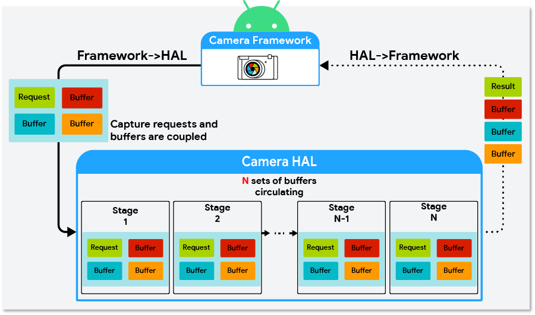
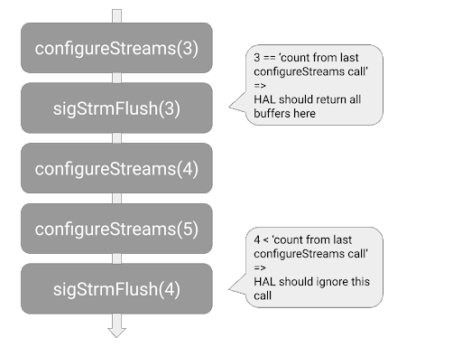
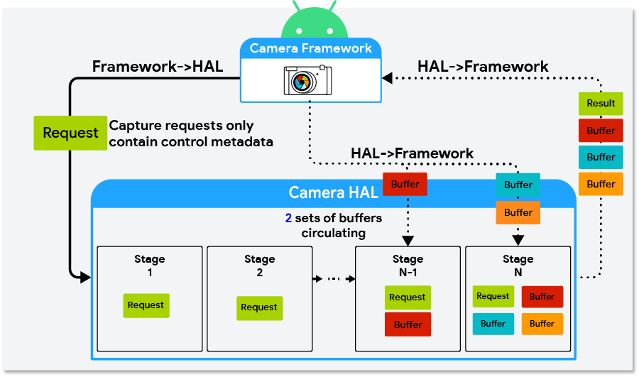
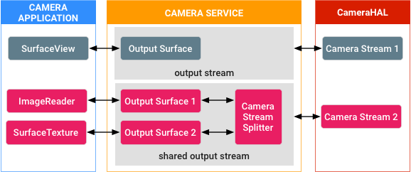

# 第 3 章 性能优化

本章对应 AOSP 官方文档"摄像头 → 性能"组页面，涵盖三个主题：Camera HAL3 缓冲区管理 API、会话参数（Session Parameters）、以及单一生产方/多个使用方（共享流）。三者共同的优化目标是：降低内存占用、减少处理延迟、提升流式传输效率。

## 3.1 Camera HAL3 缓冲区管理 API

> 来源：[Camera HAL3 缓冲区管理 API](https://source.android.google.cn/docs/core/camera/buffer-management-api?hl=zh-cn)

### 3.1.1 背景与要解决的问题

相机 HAL（Hardware Abstraction Layer，硬件抽象层）需要排队 N 个请求（N 为管道深度 `REQUEST_PIPELINE_DEPTH`），但在旧机制下，请求进入 HAL 排队时框架就已经为所有请求分配好了输出缓冲区（Output Buffer）。实际上 HAL 通常并不需要同时持有全部 N 组缓冲区——例如管道中排队 8 个请求时，可能只需要管道末端 2 个请求的缓冲区。Android 9 及更低版本中，这会导致 HAL 中积压大量"未使用"的缓冲区。

**Camera HAL3 缓冲区管理 API（Buffer Management API）** 是 Android 10 引入的**可选** API，它把"输出缓冲区的分配"从请求下发流程中**分离（decouple）**出来：HAL 需要时主动向框架请求缓冲区，用不完的及时归还。高端设备可借此节省数百 MB 内存，对低内存设备尤其有价值。

### 3.1.2 启用条件

1. 实现 HIDL `ICameraDevice@3.5`（3.5 版本的设备回调与会话接口）。
2. 将相机特征键 `android.info.supportedBufferManagementVersion` 设置为 `HIDL_DEVICE_3_5`。

> 注意：在 Android 9 及更低版本的设备上实现这些 API 时，HAL 仍必须兼容旧的"缓冲区随请求下发"协定。

### 3.1.3 三个核心方法

| 方法 | 定义位置 | 调用方向 | 作用 |
|---|---|---|---|
| `requestStreamBuffers` | `ICameraDeviceCallback.hal` | HAL → 框架 | HAL 主动请求输出缓冲区。一次调用可跨多个输出流请求多个缓冲区，减少 HIDL IPC 次数；但一次请求越多，耗时越长，可能增加请求到结果的总延迟。该调用在相机服务中是串行化的，**建议 HAL 使用专用高优先级线程**发起请求 |
| `returnStreamBuffers` | `ICameraDeviceCallback.hal` | HAL → 框架 | 归还多余缓冲区。HAL 通过 `processCaptureResult` 只能返回已下发请求的缓冲区；若通过 `requestStreamBuffers` 持有的缓冲区超出需求，用此方法归还。若持有量从不超过需求量，可不实现 |
| `signalStreamFlush` | `ICameraDeviceSession.hal` | 框架 → HAL | 框架通知 HAL 归还当前所有可用缓冲区，通常在即将调用 `configureStreams`、需要**排空管道（drain the pipeline）**时调用。调用后框架停止下发新请求，直到全部缓冲区归还 |

启用缓冲区管理后，拍摄请求中的 `StreamBuffer` 不再携带缓冲区，其 `bufferId` 字段为 0。

**`signalStreamFlush` 与 `flush` 的语义区别**：

- `flush`：HAL 终止待处理拍摄请求并上报 `ERROR_REQUEST`，尽快排空管道；
- `signalStreamFlush`：HAL 必须**正常完成**所有待处理请求并归还全部缓冲区。

**异步时序问题与 `streamConfigCounter`**：`signalStreamFlush` 是单向（one-way）HIDL 方法，其他阻塞型 API（特别是 `configureStreams`）可能先于 HAL 收到该调用而执行，导致到达顺序与框架调用顺序不一致。为此 `StreamConfiguration` 新增 `streamConfigCounter` 字段并作为参数传入 `signalStreamFlush`，HAL 应利用该计数器识别"迟到（late-arriving）"的调用。

### 3.1.4 错误处理

`requestStreamBuffers` 可能失败的常见原因与 HAL 的应对方式：

| 失败原因 | HAL 应对 |
|---|---|
| 应用与输出流断开连接 | 非严重（non-fatal）错误；对以已断开流为目标的请求发送 `ERROR_REQUEST`，正常处理后续请求 |
| 超时（应用忙于密集处理、占用缓冲区） | 对未能完成的请求发送 `ERROR_REQUEST`，正常处理后续请求 |
| 框架正在准备新的输出流配置 | 等下一次 `configureStreams` 完成后再重新调用 `requestStreamBuffers` |
| 达到缓冲区上限（`maxBuffers` 字段） | 等该输出流归还至少一个缓冲区后再重新调用 |

### 3.1.5 启用后的行为变更

- **请求到达更快、更频繁**：传统模式下框架先取缓冲区再发请求；新模式下请求无需等待缓冲区分配即可提前送达。同时，传统模式"某输出流达到 `HalStream::maxBuffers` 上限即停发请求"的节流不再存在——HAL 若排队的请求过多，**不得接受 `processCaptureRequest` 调用**。
- **`requestStreamBuffers` 延迟波动较大**，原因包括：新建输出流的前几个缓冲区需要分配内存、耗时较长；耗时与单次请求的缓冲区数量大致成正比；应用占用缓冲区且 CPU 繁忙时，请求可能降速或超时。

### 3.1.6 缓冲区管理策略

| 策略 | 做法 | 优缺点 |
|---|---|---|
| 向后兼容（Backward compatible） | 在 `processCaptureRequest` 期间为请求取缓冲区 | 不节省内存，但改动最小，适合作为首个实现 |
| 最大限度节省内存（Max memory savings） | 仅在即将填充缓冲区之前才请求输出缓冲区 | 最省内存，但取缓冲区耗时过长时管道卡顿风险更高 |
| 已缓存（Cached） | HAL 缓存少量缓冲区 | 降低偶发取缓冲区慢的影响 |

HAL 可按场景混用策略（例如高内存场景用"最大限度节省内存"，其他场景用"向后兼容"）。参考实现位于 `hardware/interfaces/camera/device/3.5/`，其中外部相机 HAL 的 `ExternalCameraDeviceSession.cpp` 用几百行 C++ 代码实现了"最大限度节省内存"策略。

### 3.1.7 传统模式与缓冲区管理模式对比

| 维度 | 传统模式（Android 9 及以下） | 缓冲区管理模式（Android 10+） |
|---|---|---|
| 缓冲区分配时机 | 请求进入 HAL 排队时框架即分配 | HAL 通过 `requestStreamBuffers` 主动请求 |
| 拍摄请求内容 | 携带输出缓冲区 | 不携带（`bufferId = 0`） |
| 闲置缓冲区 | HAL 中积压多组未使用缓冲区 | 可释放闲置缓冲区，显著节省内存 |
| 请求下发节流 | 流达到 `maxBuffers` 时框架停发请求 | 无此限制；HAL 需自行拒绝过多请求 |
| 归还缓冲区 | 仅通过 `processCaptureResult` | `processCaptureResult` + `returnStreamBuffers` |

### 3.1.8 关键术语

| 中文 | 英文 |
|---|---|
| 管道深度 | Pipeline Depth（`REQUEST_PIPELINE_DEPTH`） |
| 输出缓冲区 | Output Buffer |
| 分离/解耦缓冲区 | Decouple Buffers |
| 缓冲区上限 | maxBuffers |
| 排空管道 | Drain the Pipeline |
| 单向 HIDL 方法 | One-way HIDL Method |
| 非严重错误 | Non-fatal Error |
| 外部相机 HAL | External Camera HAL |

## 3.2 会话参数

> 来源：[会话参数](https://source.android.google.cn/docs/core/camera/session-parameters?hl=zh-cn)

### 3.2.1 概念与作用

**会话参数（Session Parameters）** 是指在拍摄会话（Capture Session）初始化阶段，由相机客户端主动配置的一部分**耗时较长的请求参数**。其目的是减少延迟：HAL 在**信息流（流）配置阶段**（而不是第一个捕获请求期间）就接收到这些参数，从而可以根据参数值更高效地准备和构建内部流水线（pipeline）。

这与普通请求参数的区别在于：普通参数逐帧生效，而会话参数属于"难以按帧应用"的参数——修改它们可能需要重新配置硬件或内部相机流水线，带来意外延迟。典型例子如需要重新配置 ISP/传感器的参数。

### 3.2.2 客户端 API 与 HAL 实现

- 客户端可通过 `getAvailableSessionKeys()` 查询所有受支持的会话参数键，并通过 `setSessionParameters()` 设置初始值。
- HAL 实现必须在静态相机元数据中填充 `ANDROID_REQUEST_AVAILABLE_SESSION_KEYS`，它是 `ANDROID_REQUEST_AVAILABLE_REQUEST_KEYS` 的一个子集。
- 如果 HAL 将可用会话参数列表留空，此功能将无效（即该功能完全由 HAL 自定义）。
- 使用 HIDL API 的绑定式 CameraHal 必须通过 `configureStreams` 传入的 HIDL `sessionParams` 条目在流配置期间访问会话参数。

### 3.2.3 框架行为

框架会监控所有传入请求，一旦检测到会话参数的值发生变化，就在**内部重新配置相机**：新的流配置中会包含更新后的会话参数值，用于更高效地配置相机流水线。会话参数仍然可以在捕获请求中发挥作用，但客户端应预期会出现延迟。

### 3.2.4 使用注意事项

选择会话参数必须谨慎：不应在流配置之间频繁更改会话参数的值。如果某参数频繁更改（例如捕获 intent），不适合作为会话参数——将其加入会话参数列表会因内部重新配置过多而导致性能问题甚至 CTS 问题。

### 3.2.5 会话重新配置查询（Android 10+）

会话参数值被修改时触发的内部流重新配置本身会降低性能。为此，Android 10 引入了**可选**的会话重新配置查询功能：HIDL `ICameraDeviceSession` 3.5 及以上版本支持 `isReconfigurationRequired` 方法，对重新配置逻辑进行精细控制。

工作方式：当客户端更改任何已通告的会话参数时，框架调用 `isReconfigurationRequired(oldSessionParams, newSessionParams)`；HAL 根据新值决定是否需要完整重新配置流——返回 `true` 则框架重新配置流并传入新参数值，返回 `false` 则框架**跳过**内部重新配置。

- 该方法只涉及相机服务和相机 HAL，**没有面向公众的 API**。
- 框架可在使用新参数的请求提交给 HAL **之前**调用该方法（此时请求仍可被取消），因此 **HAL 不得借助此方法调用以任何方式改变自身行为**。
- HAL 要求：配置活跃会话后框架可随时调用；不得对待处理请求产生故障或延迟；不得更改硬件/软件相机设置；不得对相机性能造成用户可见影响。
- 返回状态码：`OK`（查询成功）、`METHOD_NOT_SUPPORTED`（不支持重新配置查询）、`INTERNAL_ERROR`（内部错误）。
- 若想忽略该功能，HAL 应返回 `METHOD_NOT_SUPPORTED` 或 `false`，即恢复"每次会话参数变化都触发流重新配置"的默认行为。

### 3.2.6 验证

CTS 用例：

- `CameraDeviceTest#testSessionConfiguration`
- `CameraDeviceTest#testCreateSessionWithParameters`
- `CameraDeviceTest#testSessionParametersStateLeak`
- `NativeCameraDeviceTest#testCameraDevicePreviewWithSessionParameters`

会话重新配置查询功能可通过 VTS 测试用例 `CameraHidlTest#configureStreamsWithSessionParameters` 验证。

### 3.2.7 关键术语

| 中文 | 英文 |
|---|---|
| 会话参数 | Session Parameters |
| 拍摄/捕获会话 | Capture Session |
| 会话密钥 | Session Key |
| 流（信息流）配置 | Stream Configuration（`configureStreams`） |
| 会话重新配置查询 | Session Reconfiguration Query |
| 绑定式 HAL | Binderized HAL |

## 3.3 单一生产方，多个使用方

> 来源：[单一生产方，多个使用方](https://source.android.google.cn/docs/core/camera/singleprod-multiconsum?hl=zh-cn)

### 3.3.1 场景与核心思路

**单一生产方，多个使用方（Single Producer, Multiple Consumers）** 描述的是这样一种能力：当拍摄会话处于活动状态且相机正在流式传输时，相机客户端可以**动态添加和移除输出 Surface（Output Surface）**，并且新添加的 Surface 可以映射到用户选定的特定共享相机流——通过 `OutputConfiguration.enableSurfaceSharing()` 创建的共享流。

核心思路是：在多个输出 Surface 之间**共享**与特定相机流关联的缓冲区。缓冲区在消费方（Consumer）端准备进一步处理时，内部的**引用计数器（Reference Counter）** 开始跟踪该缓冲区；只有当**所有**消费方都完成各自处理后，缓冲区才离开队列（dequeue）并交还给相机使用。这样可避免数据竞争和缓冲区泄漏。

典型用例：多个消费方共享同一路相机流输出，例如预览 + 录像（或多个预览视图）共用一个流，各自作为消费方处理同一份缓冲区数据，从而降低功耗和内存开销。

### 3.3.2 实现机制

- 核心实现位于 **Camera3StreamSplitter** 模块（`services/camera/libcameraservice/device3/Camera3StreamSplitter.cpp`），即相机服务内部专用共享输出流中的"信息流分流器（Stream Splitter）"组件，负责对缓冲区引用进行计数和管理。
- **相机 HAL 端无需任何实现**——该功能完全在框架端实现，不影响供应商 HAL。

### 3.3.3 相关 API

| API | 所属类 | 说明 |
|---|---|---|
| `updateOutputConfiguration()` | `CameraCaptureSession` | 更新输出配置 |
| `addSurface()` | `OutputConfiguration` | 向输出配置添加 Surface |
| `removeSurface()` | `OutputConfiguration` | 移除 Surface；Surface 添加后可随时移除 |

### 3.3.4 验证要求

实现必须通过以下 CTS 测试：

- **MultiViewTest** 模块：`tests/camera/src/android/hardware/camera2/cts/MultiViewTest.java`
- 原生 API 的 **原生 JNI 库**：`tests/camera/libctscamera2jni/native-camera-jni.cpp`

### 3.3.5 关键术语

| 中文 | 英文 |
|---|---|
| 单一生产方，多个使用方 | Single Producer, Multiple Consumers |
| 共享流 | Shared Camera Stream（Surface Sharing） |
| 信息流分流器 | Stream Splitter（Camera3StreamSplitter） |
| 引用计数器 | Reference Counter |
| 输出 Surface | Output Surface |
| 生产方 / 使用方（消费方） | Producer / Consumer |
| 缓冲区出队 | Buffer Dequeue |
| 兼容性测试套件 | CTS (Compatibility Test Suite) |
