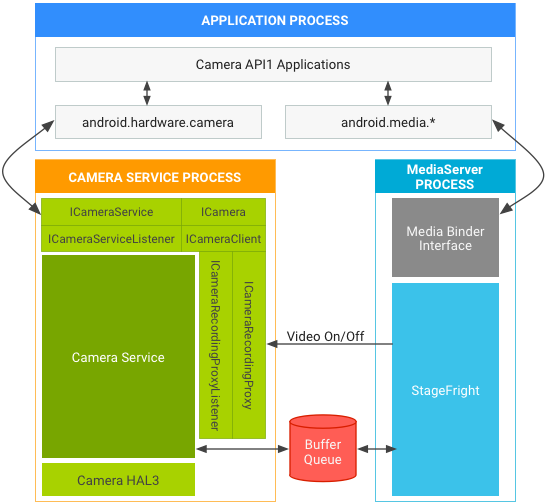
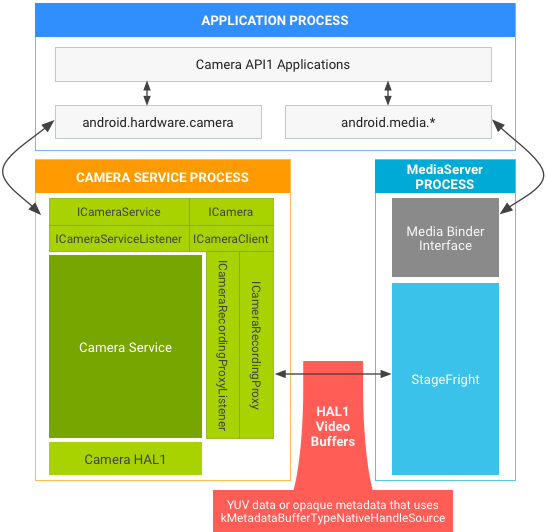
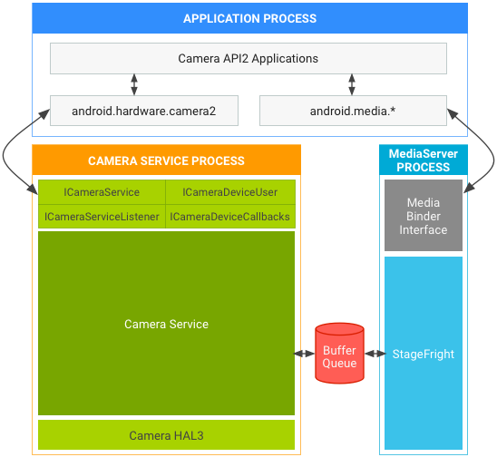

# 第 4 章 版本控制

本章对应 AOSP 官方文档"摄像头 → 版本控制"组页面，核心是"相机版本支持"：梳理相机 API、相机 HAL（Hardware Abstraction Layer）版本与 Android 版本之间的对应关系，以及 camera2 API 的硬件支持级别。

## 4.1 相机版本支持

> 来源：[相机版本支持](https://source.android.google.cn/docs/core/camera/versioning?hl=zh-cn)

### 4.1.1 相机 API 版本

| 相机 API | 引入的 Android 版本 | 说明 |
|---|---|---|
| 相机 API1（`android.hardware.Camera`） | Android 4.4 及更低版本 | Android 5.0 中已弃用，但会在一段时间内继续支持：包括供应用使用的 API1 接口，以及对相机 HAL1.0 的支持 |
| 相机 API2（`android.hardware.camera2`） | Android 5.0 及更高版本 | 提供更接近底层的相机控制，包括零复制（zero-copy）连拍/视频流，以及曝光、增益、白平衡等每帧（per-frame）控件 |

### 4.1.2 camera2 API 硬件支持级别

通过 `android.info.supportedHardwareLevel` 属性通告：

| 级别 | 说明 |
|---|---|
| LEGACY | 通过 API2 公开的功能与 API1 大致相同；旧版框架代码将 API2 调用转换为 API1 调用；不支持每帧控件等 API2 功能 |
| LIMITED | 支持部分（非全部）API2 功能；必须使用相机 HAL 3.2 或更高版本 |
| FULL | 支持 API2 的所有主要功能；必须使用 HAL 3.2 或更高版本以及 Android 5.0 或更高版本 |
| LEVEL_3 | 在 FULL 基础上额外支持 YUV 重新处理和 RAW 图片拍摄，以及其他输出流配置 |
| EXTERNAL | 类似于 LIMITED，但某些传感器或镜头信息可能未报告或帧速率较不稳定；用于外部相机（如 USB 网络摄像头） |

补充说明：

- 设备功能通过 `android.request.availableCapabilities` 属性公开。FULL 设备需具备 `MANUAL_SENSOR` 和 `MANUAL_POST_PROCESSING` 功能（`RAW` 非必需）；LIMITED 设备可提供任意功能子集；`BACKWARD_COMPATIBLE` 必须始终定义。
- Google Play 过滤使用的功能标志包括：`android.hardware.camera.hardware_level.full`、`android.hardware.camera.capability.raw`、`android.hardware.camera.capability.manual_sensor`、`android.hardware.camera.capability.manual_post_processing`。

### 4.1.3 相机 HAL 版本与 Android 版本对应关系

| HAL 版本 | 对应 Android 版本 | 主要特性 |
|---|---|---|
| 1.0 | Android 4.0（初始 HAL，camera.h） | 从 C++ CameraHardwareInterface 抽象层转换而来；支持 `android.hardware.Camera` API |
| 2.0 | Android 4.2（camera2.h，扩展功能 HAL 初始版本） | 足以实现现有 `android.hardware.Camera` API；允许相机服务层中的 ZSL（零快门延迟）队列；未针对手动捕获控制、Bayer RAW 等新功能进行测试 |
| 3.0 | 扩展功能 HAL 首次修订 | ABI 完全不同；重新设计输入请求和流队列接口；包含同步框架（sync framework）支持；触发器移入请求、通知移入结果；双向数据流取代 `STREAM_FROM_STREAM` |
| 3.1 | 扩展功能 HAL 小修订 | `configure_streams` 向 HAL 传递使用方（消费方）使用情况标志；新增 flush 调用以快速丢弃传输中的请求/缓冲区 |
| 3.2 | Android 5.0 | 弃用 `get_metadata_vendor_tag_ops` 和 `register_stream_buffers`；新增部分结果（partial result）支持；`camera3_request_template` 新增手动模板；重新制定双向流和输入流规范；输入缓冲区改在 `process_capture_result` 中返回 |
| 3.3 | 随 Android 8.0 HIDL 化收录的小修订 | OPAQUE 和 YUV 重新处理 API 更新；深度（depth）输出缓冲区基本支持；`camera3_stream_t` 新增 `data_space` 和旋转字段；新增数据流配置操作模式 |
| 3.4 | Android 8.0/9（HIDL） | 支持 RAW_OPAQUE 时强制添加 `ANDROID_SENSOR_OPAQUE_RAW_SIZE`；支持任何 RAW 格式时强制添加 `POST_RAW_SENSITIVITY_BOOST_RANGE`；`data_space` 字段采用更灵活定义；元数据新增 LEVEL_3、动态黑/白电平等。Android 9 中 `configureStreams_3_4` 和 `processCaptureRequest_3_4` 增加对会话参数（sessionParameters）、逻辑相机（logical camera）及实体相机 ID 的支持；`processCaptureResult_3_4` 在结果中加入实体相机元数据 |
| 3.5 | Android 10 | `ICameraDevice` 新增 `getPhysicalCameraCharacteristics` 和 `isStreamCombinationSupported`；`ICameraDeviceSession` 新增 `isReconfigurationNeeded`、HAL 缓冲区管理 API、`signalStreamFlush`、`configureStreams_3_5`（含 `streamConfigCounter`）；回调新增 `requestStreamBuffers` 和 `returnStreamBuffers` |

### 4.1.4 相机模块版本历史

| 模块版本 | 主要更新 |
|---|---|
| 1.0 | 初始相机模块 HAL 接口；所有设备仅支持版本 1 的设备 HAL；`device_version` 和 `static_camera_characteristics` 字段无效 |
| 2.0 | 模块 HAL 接口第二版；设备可支持 1.0 或 2.0 版本设备 HAL；`device_version` 为 2.0+ 时 `static_camera_characteristics` 有效 |
| 2.1 | 新增从相机 HAL 模块到框架的异步回调支持；提供 `set_callbacks()` 的模块必须至少报告此版本号 |
| 2.2 | 新增模块供应商标记（vendor tag）支持；弃用旧版 `vendor_tag_query_ops` |
| 2.3 | 支持将同一设备作为较低版本 HAL 设备打开 |
| 2.4 | 手电筒模式支持（无需打开相机设备）；外部相机（如 USB 热插拔）支持；相机仲裁提示（`resource_cost` 和 `conflicting_devices` 字段）；模块初始化方法。Android 10 补充：API 级别 29+ 启动的设备必须对 `isTorchModeSupported` 报告 `true` |
| 2.5 | Android 10 引入 `notifyDeviceStateChange`，在物理形态变化（如折叠）影响相机和路由时通知 HAL |

### 4.1.5 各 Android 版本相机新特性

**Android 9**：

- 引入多相机 API（逻辑相机，支持散景和无缝变焦）；引入会话参数以减少处理延迟；新增 OIS 数据键（`STATISTICS_OIS_SAMPLES`）；外部闪存支持；动作跟踪 intent；弃用 `LENS_RADIAL_DISTORTION` 改用 `LENS_DISTORTION`；失真校正模式；外部 USB/UVC 相机支持。
- 元数据新键：`LOGICAL_MULTI_CAMERA`、`MOTION_TRACKING`、`MONOCHROME` 等功能，以及 `LOGICAL_MULTI_CAMERA_PHYSICAL_IDS`、`LENS_POSE_REFERENCE`、OIS 数据系列键等。

**Android 8.0（引入 Treble）**：

- 供应商相机 HAL 必须为绑定式（binderized）HAL。
- 共享 surface：一组缓冲区驱动两个输出（如预览 + 视频编码），降低功耗和内存；要求 HAL 和 gralloc HAL 支持多使用方缓冲区。
- 自定义相机模式系统 API：模式是传递到 `configure_streams` 的整数，自定义模式必须以整数值 0x8000 开头；Android 8.1 中应用须预装到系统映像才能访问此 API。
- `onCaptureQueueEmpty`：通过在请求队列为空时通知框架来缩短控制更改（如变焦）延迟；属于无需 HAL 参与的框架端补充。
- 相机 HIDL 接口全面改造，旧版 HAL 3.4 和模块 2.4 的功能均纳入 HIDL 定义。

**Android 10**：

- API：多相机改进（隐藏物理相机 ID、借助逻辑相机使用）；`isSessionConfigurationSupported` 避免会话创建开销；`getRecommendedStreamConfigurationMap` 推荐数据流配置；深度 JPEG（动态深度规范）；HEIC 图片格式；隐私改进（部分 CameraCharacteristics 键需要 CAMERA 权限）。
- HAL 3.4 元数据新键：RAW10/RAW12/Y8 格式；`RECOMMENDED_STREAM_CONFIGURATIONS` 系列；HEIC 系列；动态深度系列；`SECURE_IMAGE_DATA` 功能；`COLOR_FILTER_ARRANGEMENT` 新增 MONO 和 NIR 值等。

### 4.1.6 相机框架强化（Android 7.0/8.0 架构更改）

- Android 7.0 将相机服务从 mediaserver 中移出；Android 8.0 起每个绑定式相机 HAL 在与相机服务不同的进程中运行。
- API1 + HAL3：相机服务使用 BufferQueue 跨进程传递缓冲区，无需供应商更新。
- API1 + HAL1：若支持在视频缓冲区中传递元数据，HAL 必须改用 `kMetadataBufferTypeNativeHandleSource` 和 `VideoNativeHandleMetadata`（Android 7.0 不再支持 `kMetadataBufferTypeCameraSource`）。

- API2：HAL1 不受影响；HAL3 受影响但同样无需供应商更新。

- 其他要求：IPC 额外带宽可能影响 120/240 FPS 高速录制（可用 PerformanceTest 和 Google 相机衡量）；HAL3 不能用缓冲区句柄地址识别缓冲区（地址可能被复用存储其他句柄），必须用缓冲区句柄本身标识；需更新 cameraserver 的 SELinux 政策（不建议照搬 mediaserver 策略，应仅授予相机所需权限并移除 mediaserver 中不必要的相机权限）；相机 HAL 与 cameraserver 分离后，IPC 通过 HIDL 定义的接口进行。

### 4.1.7 CTS / VTS 验证要求

- Android 5.0+ 设备必须通过相机 API1 CTS、API2 CTS 和 CTS 验证程序（CTS Verifier）相机测试。
- 没有 HAL3.2、无法完整支持 API2 的设备仍须通过 API2 CTS，以 LEGACY 模式运行（API2 调用映射到 API1），API1 未涵盖特性的测试会自动跳过。
- Android 8.0+ 采用绑定式 HAL 实现的设备必须通过相机 VTS（供应商测试套件）测试。

### 4.1.8 关键术语

| 中文 | 英文 |
|---|---|
| 相机硬件抽象层 | Camera HAL (Hardware Abstraction Layer) |
| 零复制 | Zero-copy |
| 每帧控件 | Per-frame Controls |
| 零快门延迟 | ZSL (Zero Shutter Lag) |
| 逻辑相机 / 实体相机 | Logical Camera / Physical Camera |
| 绑定式 HAL | Binderized HAL |
| 供应商标记 | Vendor Tag |
| 硬件支持级别 | Supported Hardware Level |
| 供应商测试套件 | VTS (Vendor Test Suite) |
