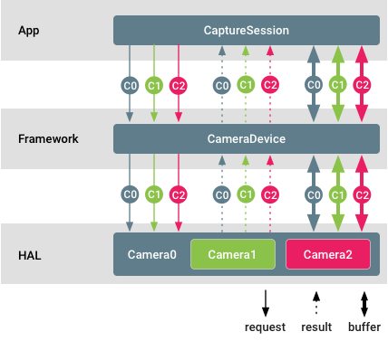
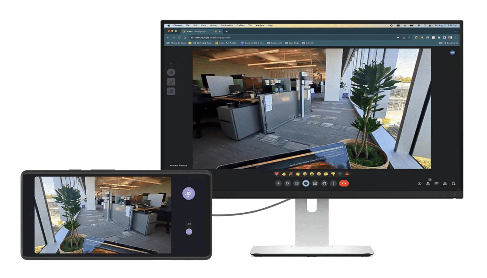
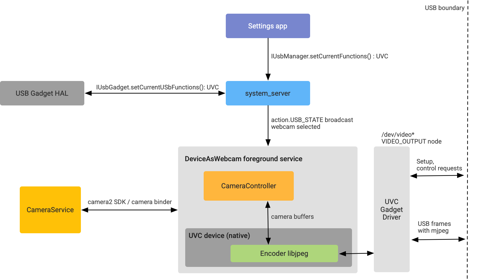
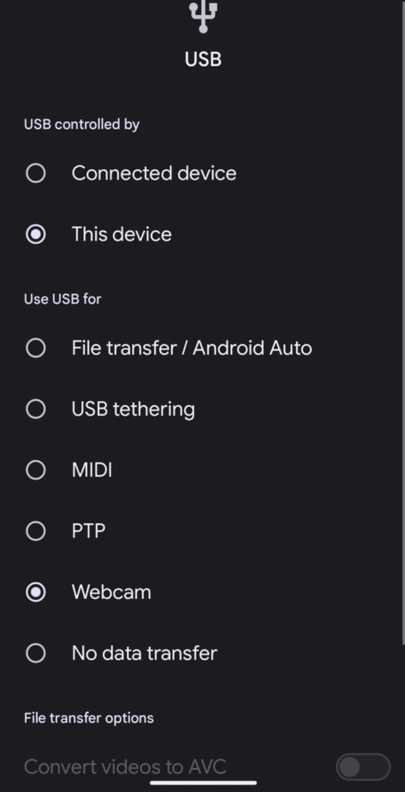

# 第 7 章 相机功能（下）

本章继续介绍 Android 相机功能组页面的后半部分：多摄像头支持、系统相机、手电筒强度控制、Ultra HDR、将设备用作摄像头（Webcam）以及广色域拍摄。内容依据 AOSP 中文官方文档（source.android.google.cn）整理，面向希望系统学习 Android Camera 框架的工程师。

---

## 7.1 多摄像头支持

> 来源：[多摄像头支持](https://source.android.google.cn/docs/core/camera/multi-camera?hl=zh-cn)

### 7.1.1 功能定位与要解决的问题

多摄像头支持（Multi-Camera Support）由 Android 9 引入，核心概念是**逻辑摄像头设备（logical camera device）**：由两个或更多朝向同一方向的物理摄像头组成，对外以单个 `CameraDevice` / `CaptureSession` 的形式呈现给应用。它解决了两个问题：

- 应用无需自己管理多个摄像头会话，即可获得融合输出（变焦、景深、双目立体视觉、动作追踪、光学变焦等）。
- 应用仍可选择**直接访问底层物理摄像头**：同时从多个物理摄像头流式传输 RAW 缓冲区、分别设置控件、分别接收元数据。

### 7.1.2 应用侧 API（Java 层）

- 通过 `CameraMetadata` 中的 `REQUEST_AVAILABLE_CAPABILITIES_LOGICAL_MULTI_CAMERA` 功能播发逻辑多摄像头。
- `getPhysicalCameraIds()`：查询构成逻辑摄像头的物理摄像头 ID。
- `OutputConfiguration.setPhysicalCameraId()`：单独控制某个物理设备。
- `TotalCaptureResult.getPhysicalCameraResults()`：查询单个物理请求的结果。
- `getAvailablePhysicalCameraRequestKeys()`：获取物理摄像头支持的有限参数列表。
- 约束：仅支持非重新处理（non-reprocessing）请求；仅单色（monochrome）和 Bayer 传感器支持物理流。

### 7.1.3 HAL 侧实现要点（OEM 检查清单）

1. 为逻辑设备添加 `ANDROID_REQUEST_AVAILABLE_CAPABILITIES_LOGICAL_MULTI_CAMERA` 功能。
2. 填充静态元数据 `ANDROID_LOGICAL_MULTI_CAMERA_PHYSICAL_IDS`。
3. 填充深度相关静态元数据（建立物理流像素间的关联）：`ANDROID_LENS_POSE_ROTATION`、`ANDROID_LENS_POSE_TRANSLATION`、`ANDROID_LENS_INTRINSIC_CALIBRATION`、`ANDROID_LENS_DISTORTION`、`ANDROID_LENS_POSE_REFERENCE`。
4. 设置 `ANDROID_LOGICAL_MULTI_CAMERA_SENSOR_SYNC_TYPE`：
   - `APPROXIMATE`：主主模式（master-master），无硬件快门/曝光同步；
   - `CALIBRATED`：主辅模式（master-slave），执行硬件快门/曝光同步。
5. 填充 `ANDROID_REQUEST_AVAILABLE_PHYSICAL_CAMERA_REQUEST_KEYS`（不支持物理级请求时可为空）。
6. HAL 3.5 及以上（Android 10+）：必须在结果中填充 `ANDROID_LOGICAL_MULTI_CAMERA_ACTIVE_PHYSICAL_ID`，报告当前有效物理摄像头。

### 7.1.4 Camera ID 与流组合逻辑

- 逻辑摄像头的强制性流组合与其硬件级别在 `CameraDevice.createCaptureSession` 中要求一致；映射中的所有流必须是**逻辑流**。
- Android 9 特殊要求：必须支持将一个逻辑 YUV/RAW 流替换为两个大小与格式相同的物理流（RAW 不适用替换）；Android 10 起不再强制。用物理流替代逻辑流时，若最小帧时长相同，不得降低帧速率。
- Android 10 / HAL 3.5+：必须支持 `isStreamCombinationSupported` 查询包含**物理流**的组合；同时 HAL 可选择不在 `getCameraIdList` 中播发部分或全部物理 ID（隐藏物理子摄像头），但 `getPhysicalCameraCharacteristics` 必须能返回其特性。
- 逻辑摄像头和物理摄像头都必须满足各自硬件级别的强制流组合；建议逻辑设备的特征集是物理摄像头特征集的超集。

### 7.1.5 API 版本要求摘要

| 版本 | 关键要求 |
|---|---|
| Android 9（HAL ≤3.4） | 逻辑流可替换为物理流；不强制 `isStreamCombinationSupported` |
| Android 10（HAL 3.5+） | 必须支持 `isStreamCombinationSupported`（含物理流）；新增 `ACTIVE_PHYSICAL_ID` 结果键；可隐藏物理 ID |
| Android 11+ | 建议实现 `ANDROID_CONTROL_ZOOM_RATIO`；建议用 surface group、`discardFreeBuffers()` 优化内存 |

### 7.1.6 最佳实践

- Android 10+ 建议从 `getCameraIdList` 隐藏物理子摄像头，简化应用选择逻辑。
- Android 11+ 支持光学变焦的逻辑设备应实现 `ANDROID_CONTROL_ZOOM_RATIO`，`ANDROID_SCALER_CROP_REGION` 只用于裁剪宽高比；HAL 需相应调整 `CROP_REGION`、`AE/AWB/AF_REGIONS`、`FACE_RECTANGLES`、`FACE_LANDMARKS` 的坐标系。
- 逻辑摄像头播发的控件能力必须在全缩放范围内成立（例如超广角不支持 4K60，逻辑摄像头就不得播发 4K60；超广角为固定焦距时 HAL 需模拟 AF 状态机）。
- 物理活跃数组（active array）不同时，HAL 必须做物理→逻辑活跃数组的坐标映射。

### 7.1.7 验证

- 相机 CTS：`LogicalCameraDeviceTest` 模块。
- 相机 ITS：
  - `scene1/test_multi_camera_match.py` —— 两个摄像头同时启用时图像中心亮度匹配；
  - `scene4/test_multi_camera_alignment.py` —— 摄像头间距、方向、失真参数正确；
  - `sensor_fusion/test_multi_camera_frame_sync.py` —— 陀螺仪与图像传感器时间戳匹配、多摄像头帧同步。

### 7.1.8 关键术语

| 中文 | 英文 |
|---|---|
| 逻辑摄像头设备 | logical camera device |
| 物理摄像头 / 物理流 | physical camera / physical stream |
| 逻辑流 | logical stream |
| 流组合 | stream combination |
| 传感器同步类型 | sensor sync type（APPROXIMATE / CALIBRATED） |
| 主主 / 主辅模式 | master-master / master-slave |
| 活跃数组 | active array |
| 光学变焦 | optical zoom |

---

## 7.2 系统相机

> 来源：[系统相机](https://source.android.google.cn/docs/core/camera/system-cameras?hl=zh-cn)

### 7.2.1 功能定位与要解决的问题

在搭载 Android 11 或更高版本的设备上，Android 框架支持**系统相机（System Camera）**：这类相机设备**仅对同时具备 SYSTEM_CAMERA 权限和常规相机权限的进程可见**，普通第三方应用完全无法发现它们。典型场景是：OEM 需要实现访问相机的功能，但希望该功能**仅限于特权应用或系统应用**使用——即提供一种对公开应用生态隐藏的专用相机资源。

### 7.2.2 实现方式

1. **SYSTEM_CAMERA 权限**
   - `android.permission.SYSTEM_CAMERA` 在 Android 11 中引入，保护级别为 **system|signature**：只有安装在系统分区、且使用平台证书（或由其签名）的应用才能获得。
   - 持有 SYSTEM_CAMERA 的系统应用**还必须持有** `android.permission.CAMERA`；因此用户可以撤消常规 CAMERA 权限，从而阻止该应用访问设备相机——保留了用户控制手段。
2. **HAL 元数据**
   - 相机 HAL 必须在其功能列表中声明 `ANDROID_REQUEST_AVAILABLE_CAPABILITIES_SYSTEM_CAMERA`（定义于 `hardware/interfaces` 的 `camera/metadata/3.5/types.hal`）。
3. **特权应用许可名单**
   - 要创建可访问系统相机的应用，必须在**设备专属的 privapp-permissions.xml 文件**中将该应用列入许可名单，指明向其授予 `android.permission.SYSTEM_CAMERA`（权限声明位于 `frameworks/base` 的 `core/res/AndroidManifest.xml`）。

### 7.2.3 对 OEM 的要求汇总

| 方面 | 要求 |
|---|---|
| Android 版本 | Android 11+ |
| 相机 HAL | 在 available capabilities 中声明 SYSTEM_CAMERA 功能 |
| 应用资质 | 安装在系统分区、平台签名 |
| 权限配置 | 在设备专属 privapp-permissions.xml 中列入许可名单 |
| 双重权限 | SYSTEM_CAMERA 与 CAMERA 权限同时持有 |

### 7.2.4 验证

- CTS 测试 `android.permission.cts.Camera2PermissionTest.testSystemCameraDiscovery` 验证公开应用无法发现设备上的任何系统相机。
- **所有**相机 CTS 测试都会针对系统相机设备运行。

### 7.2.5 关键术语

| 中文 | 英文 |
|---|---|
| 系统相机 | System Camera |
| 可用功能列表 | Available Capabilities |
| 权限保护级别 | Protection Level |
| 特权应用 / 系统应用 | Privileged App / System App |
| 特权应用许可名单 | privapp-permissions.xml allowlist |
| 兼容性测试套件 | CTS (Compatibility Test Suite) |

---

## 7.3 手电筒强度控制

> 来源：[手电筒强度控制](https://source.android.google.cn/docs/core/camera/torch-strength-control?hl=zh-cn)

### 7.3.1 功能定位与要解决的问题

对搭载 Android 13 或更高版本的设备，Android 框架为手电筒（torch mode）提供**多级强度控制**。Android 12 及更早版本只能开/关手电筒，无法调节亮度。多级控制支持以下场景：

- 根据环境光照条件调节手电筒亮度；
- 通过连续快速闪烁光束发送求救信号；
- 延长电池续航并提升性能——以最大强度常开可能导致热节流（thermal throttling），多级控制可避免手电筒总是全功率运行。

### 7.3.2 公共 API（无需相机权限）

- `CameraManager.turnOnTorchWithStrengthLevel(String cameraId, int torchStrength)`：设置指定 cameraId 对应的手电筒亮度；若手电筒当前关闭且 torchStrength ≥ 1，则按指定强度直接开启。
- `CameraManager.getTorchStrengthLevel(String cameraId)`：返回与 cameraId 关联的闪光灯元件当前亮度。
- `CameraCharacteristics` 特征键：
  - `FLASH_INFO_STRENGTH_MAXIMUM_LEVEL`：最大亮度；HAL 通过设置大于 1 的值来通告支持此功能；
  - `FLASH_INFO_STRENGTH_DEFAULT_LEVEL`：默认手电筒亮度。
- 值得注意的设计：这些公共 API **不需要相机权限**，因为它们只控制闪光灯，不访问相机本身。

### 7.3.3 HAL 实现（面向 OEM）

需实现相机 AIDL HAL 接口 `camera/device/aidl/android/hardware/camera/device/ICameraDevice.aidl` 中的：

- `void turnOnTorchWithStrengthLevel(int torchStrength)`
- `int getTorchStrengthLevel()`

同时 HAL 必须通告上述两个特征键。AOSP 参考实现：模拟相机 HAL 的 `EmulatedCameraDeviceHWLImpl.cpp`（位于 `hardware/google/camera/devices/EmulatedCamera/hwl/`）。

### 7.3.4 验证

| 测试类型 | 测试文件 |
|---|---|
| VTS | `/camera/provider/aidl/vts/VtsAidlHalCameraProvider_TargetTest.cpp` |
| CTS | `/platform/cts/tests/camera/src/android/hardware/camera2/cts/FlashlightTest.java` |

### 7.3.5 关键术语

| 中文 | 英文 |
|---|---|
| 手电筒强度控制 | Torch strength control |
| 手电筒模式 | Torch mode |
| 闪光灯元件 | Flash unit |
| 相机特征键 | Camera characteristics keys |
| 热节流 | Thermal throttling |

---

## 7.4 Ultra HDR

> 来源：[Ultra HDR](https://source.android.google.cn/docs/core/camera/ultra-hdr?hl=zh-cn)

### 7.4.1 功能定位与要解决的问题

Android 14 开始支持以 **JPEG_R** 图片格式拍摄 Ultra HDR 压缩图片。该格式**向后兼容 SDR JPEG**：旧设备/旧软件仍可将其当作普通 JPEG 读取；而在支持 HDR 的设备上，可借助内嵌的**恢复图（gain map / recovery map）**对内容进行 HDR 渲染。格式规范见 Android 开发者文档的 "Ultra HDR 图片格式 v1.0"。

### 7.4.2 实现方式

- **参考实现**：AOSP 相机框架与相机服务内置 `JpegRCompositeStream`（JPEG_R 复合流）实现。
- **HAL 直接实现**：相机 HAL 也可以像其他输出流一样通告 JPEG_R 输出支持，自行生成恢复图和最终 JPEG_R 图片，并符合 Ultra HDR 规范，从而针对设备硬件/软件能力做优化。
- **开关控制**：
  - 将 build 属性 `ro.camera.disableJpegR` 设为 `true` 可停用 JpegRCompositeStream；
  - 若未设置或为 `false`：在支持 10 位输出功能（`REQUEST_AVAILABLE_CAPABILITIES_DYNAMIC_RANGE_TEN_BIT`）且支持并发 10 位与 8 位拍摄（`DynamicRangeProfiles.getProfileCaptureRequestConstraints`）的设备上，Ultra HDR 默认经 JpegRCompositeStream 启用。

### 7.4.3 OEM 的三档实现选项

| 级别 | 实现方式 | 特点 |
|---|---|---|
| 极简（Minimal） | 启用相机服务的 JpegRCompositeStream 参考实现（系统属性 `ro.camera.enableCompositeAPI0JpegR` 设为 `true`） | 全流程与编码均在软件中执行，可能带来延迟增加与性能下降 |
| 中等（Moderate） | JpegRCompositeStream 使用 HAL 提供的 SDR JPEG 作为基础图片，并用 **P010 帧**计算恢复图（gain map） | 数据路径仍含软件处理，但比极简方案少 |
| 完整（Full） | 相机 HAL 直接通告并支持 JPEG_R 输出流 | 厂商可做设备专属优化，图像质量可显著提升 |

### 7.4.4 验证

CTS 测试：

| 测试 | 来源文件 |
|---|---|
| testImageReaderBuilderWithBLOBAndJpegR | ImageReaderTest.java |
| testJpegR | ImageReaderTest.java |
| testJpegRDisplayP3 | ImageReaderTest.java |
| testSingleCapture | PerformanceTest.java |
| testJpegRCapture | StillCaptureTest.java |

ITS 测试：`scene4#test_aspect_ratio_and_crop`（CameraITS/tests/scene4）。另有官方示例（platform-samples 仓库 PR #56）演示以 JPEG_R 格式配置并拍摄 Ultra HDR。

### 7.4.5 关键术语

| 中文 | 英文 |
|---|---|
| 超动态范围图片格式 | Ultra HDR |
| 含恢复图的 JPEG 格式 | JPEG_R |
| 恢复图 / 增益图 | Recovery map / Gain map |
| 标准动态范围 JPEG | SDR JPEG |
| JPEG_R 复合流参考实现 | JpegRCompositeStream |
| 10 位 YUV 帧格式 | P010 |
| 10 位输出功能 | `REQUEST_AVAILABLE_CAPABILITIES_DYNAMIC_RANGE_TEN_BIT` |
| 相机影像测试套件 | ITS (Camera Image Test Suite) |

---

## 7.5 将设备用作摄像头（Webcam）

> 来源：[将设备用作摄像头（Webcam）](https://source.android.google.cn/docs/core/camera/webcam?hl=zh-cn)

### 7.5.1 功能定位与要解决的问题

Android 14-QPR1 起支持**将 Android 设备用作 USB 网络摄像头**：系统将设备通告为 **UVC 设备（USB Video Device Class）**，使搭载 Linux、macOS、Windows、ChromeOS 等不同操作系统的 USB 主机可以把该设备的摄像头当作外接网络摄像头即插即用，无需第三方 App 或驱动。该功能由 AOSP 的 **DeviceAsWebcam 服务**实现。

预览 activity（`DeviceAsWebcamPreview.java`）提供取景与控制能力：串流开始前预览主机上呈现的画面、选择前置/后置摄像头、滑块调节缩放、点按画面聚焦/取消聚焦；并与 TalkBack、开关控制、Voice Access 等无障碍功能兼容。

### 7.5.2 实现方式（架构与流程）

用户在"设置"中选择 USB 摄像头选项后：

1. 设置应用通过 **UsbManager** 向 system_server 发送 binder 调用，通知选择了 **FUNCTION_UVC**。
2. system_server 通过 **setUsbFunctions HAL 接口**通知 USB Gadget HAL 检索 UVC Gadget 函数，并使用 **ConfigFs** 配置 UVC Gadget 驱动程序。
3. 收到 Gadget HAL 回调后，system_server 向框架发送广播，由 DeviceAsWebcam 服务接收。
4. USB Gadget 驱动程序通过 `/dev/video*` 处的 **V4L2 节点**接收主机配置命令后，启动摄像头串流。

### 7.5.3 对 OEM 的要求

1. **内核**：Android 14+ 的 GKI 默认启用 UVC Gadget 驱动程序；注意 2024 年 2 月版本存在严重稳定性问题（串流抖动/坏帧），修复已提交上游与 GKI 分支，缺失时需提交 GKI respin 请求。
2. **Gadget HAL**：从 Android 14 起，UVC 函数包含在 `GadgetFunction.aidl` 中，UVC Gadget 装载到 ConfigFS 的方式与 MTP/ADB 相同（`linkFunction("uvc.0")`）；需确保通告正确的 VID/PID 组合；UVC 逻辑都在供应商 init 或 DeviceAsWebcam 服务中，HAL 中除符号链接到 ConfigFS 外无需其他 UVC 专用逻辑。
3. **ConfigFS 配置**：通过 vendor init 脚本配置格式、分辨率、帧速率，参考内核的 ConfigFS UVC Gadget ABI 文档。配置准则：
   - 支持两种串流格式：**MJPEG** 和未压缩 **YUYV**；
   - USB 2.0 带宽 480 Mbps（约 60 MBps）：30fps 时每帧不超过 2 MB，60fps 时不超过 1 MB；
   - YUYV（每像素 2 字节）30fps 下最大支持 720p；MJPEG 按 1:10 压缩率可支持 4K；
   - 主要前置和后置摄像头都必须支持所通告的所有帧大小与帧速率（用户可在预览中切换摄像头 ID）；建议通告 480p、720p、1080p，并强烈建议支持 30fps。
4. **启用开关**：在 device.mk 中设置 `ro.usb.uvc.enabled=true`（通过 `PRODUCT_VENDOR_PROPERTIES`）；启用后设置应用的 USB 偏好设置下出现摄像头选项，也可用 `adb shell svc usb setFunctions uvc` 测试。
5. **功耗与发热**：摄像头可能长时间开启，首选在 DeviceAsWebcam 中启用 **STREAM_USE_CASE_VIDEO_CALL**；若仍有问题，可用 RRO（运行时资源叠加层）指定物理摄像头串流（如逻辑 ID 0 改用物理 ID 3），但画质明显下降，仅作最后手段。
6. **已知限制**：受 Apple UVC 驱动 bug 影响，Android 设备在 **macOS 主机的 USB 3.0+** 下无法作为摄像头使用。

启用后，设置应用的 USB 偏好设置下会出现摄像头选项：

### 7.5.4 验证

- CTS 验证程序（CTS Verifier）的 webcam 测试：验证支持的格式、大小、帧速率。
- 手动测试：在多种主机 OS 与主机应用上验证。

### 7.5.5 关键术语

| 中文 | 英文 |
|---|---|
| USB 视频设备类 | UVC (USB Video Device Class) |
| USB 外设（Gadget）HAL | USB Gadget HAL |
| 配置文件系统 | ConfigFS |
| Linux 视频框架 | V4L2 (Video4Linux2) |
| UVC 功能模式 | FUNCTION_UVC |
| 供应商 ID / 产品 ID | VID / PID |
| 通用内核映像 | GKI (Generic Kernel Image) |
| 运行时资源叠加层 | RRO (Runtime Resource Overlay) |
| 视频通话流用例 | STREAM_USE_CASE_VIDEO_CALL |

---

## 7.6 广色域拍摄

> 来源：[广色域拍摄](https://source.android.google.cn/docs/core/camera/wide-gamut?hl=zh-cn)

### 7.6.1 功能定位与要解决的问题

自 Android 14 起，Android 支持 **Display P3 广色域拍摄（Wide Gamut Photography）**：设备可用 `ImageReader` 拍摄 JPEG 格式的广色域图片，**无需借助 10 位 HDR 输出路径**。它解决的问题是在标准 8 位 JPEG 流程下即可捕获超出 sRGB 的色彩范围（Display P3）。应用通过 `SessionConfiguration.setColorSpace` 参数向 Camera2 框架请求广色域空间的相机拍摄。

### 7.6.2 实现方式（HAL 侧）

支持 Display P3 广色域拍摄请求需要做到：

1. 读取 `Stream.aidl` 中的 `colorSpace` 字段并应用于输出流；
2. 实现 `android.request.availableColorSpaceProfilesMap` 元数据条目；
3. 在 `android.request.availableCapabilities` 中报告 **COLOR_SPACE_PROFILES** 功能。

参考实现位于模拟相机 HAL 配置文件 `emu_camera_back.json`（涉及 `availableCapabilities` 和 `availableColorSpaceProfilesMap` 两个字段）；元数据定义详见 `metadata_definitions.xml` 中的 `availableColorSpaceProfiles`、`availableColorSpaceProfilesMap` 与 `COLOR_SPACE_PROFILES`。

### 7.6.3 应用侧 API（Android 14+）

- `ColorSpaceProfiles`
- `SessionConfiguration.setColorSpace`

`ColorSpace` 取值来自 `ColorSpace.Named`。Android 14 支持：**SRGB**、**DISPLAY_P3**、**BT2020_HLG**。

### 7.6.4 对 OEM 的要求与验证

硬件前提：设备必须配备支持广色域色彩的相机。

- CTS 测试：
  - `ExtendedCameraCharacteristicsTest` 的 `test8BitColorSpaceOutputCharacteristics`、`test10BitColorSpaceOutputCharacteristics`、`testColorSpaceProfileMap`；
  - `ImageReaderTest` 的 `testDisplayP3Jpeg`、`testDisplayP3JpegRepeating`、`testDisplayP3Heic`、`testDisplayP3HeicRepeating`。
- 相机 ITS 验证两项：图片的 **ICC 配置文件**存在且**色度坐标**正确；图片包含 sRGB 色域之外的像素数据。

### 7.6.5 关键术语

| 中文 | 英文 |
|---|---|
| 广色域拍摄 | Wide gamut photography |
| 色彩空间（配置文件） | Color space (profiles) |
| 输出流 | Output stream |
| 元数据条目 | Metadata entry |
| ICC 配置文件 | ICC profile |
| 色度坐标 | Chromaticity coordinates |

---

## 本章小结

| 功能 | 引入版本 | 核心机制 | OEM 关键动作 |
|---|---|---|---|
| 多摄像头支持 | Android 9 | 逻辑摄像头 + 物理流，HAL 3.5 起增强 | 填充逻辑多摄元数据、隐藏物理 ID、支持 `isStreamCombinationSupported` |
| 系统相机 | Android 11 | SYSTEM_CAMERA 权限（system\|signature）+ HAL 功能声明 | 声明 capability、privapp-permissions 许可名单 |
| 手电筒强度控制 | Android 13 | CameraManager API + 相机 AIDL HAL 接口 | 实现 `turnOnTorchWithStrengthLevel` 等接口、通告 FLASH_INFO 特征键 |
| Ultra HDR | Android 14 | JPEG_R（SDR JPEG + 恢复图） | 三档实现：软件复合流 / P010 混合 / HAL 直接输出 |
| Webcam | Android 14-QPR1 | UVC Gadget + ConfigFS + V4L2 | GKI 内核、Gadget HAL、`ro.usb.uvc.enabled`、功耗优化 |
| 广色域拍摄 | Android 14 | `colorSpace` 流字段 + `availableColorSpaceProfilesMap` 元数据 | 实现 COLOR_SPACE_PROFILES，支持 Display P3 相机硬件 |
