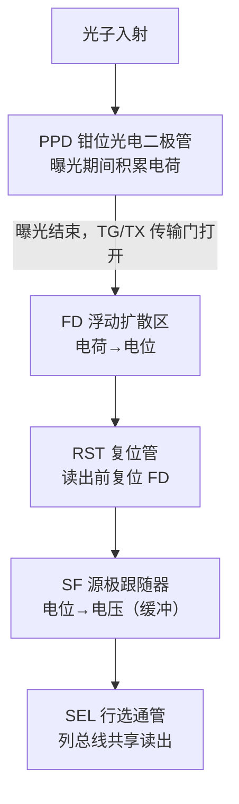
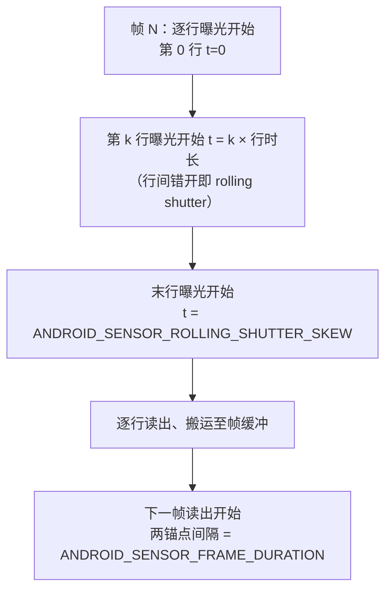
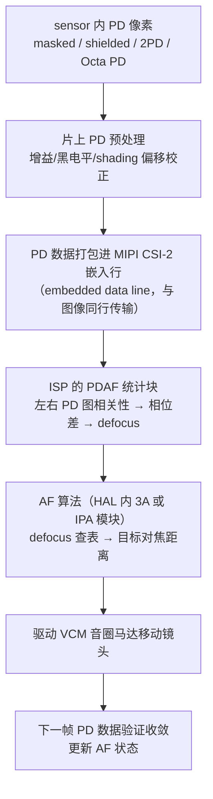
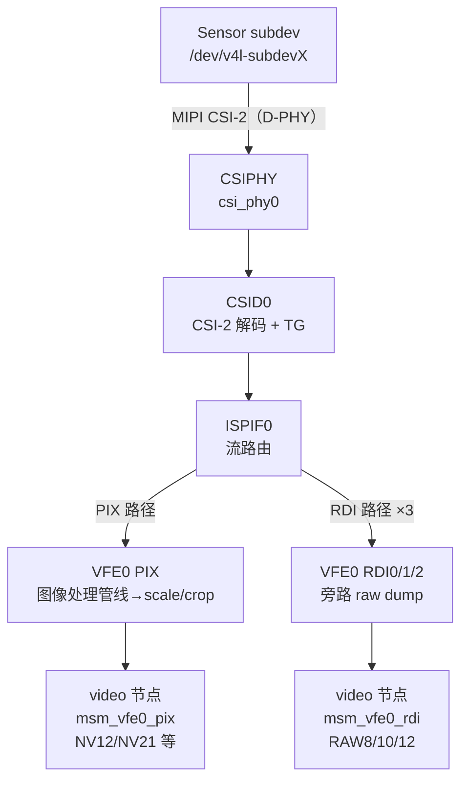
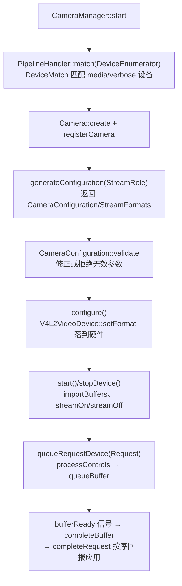
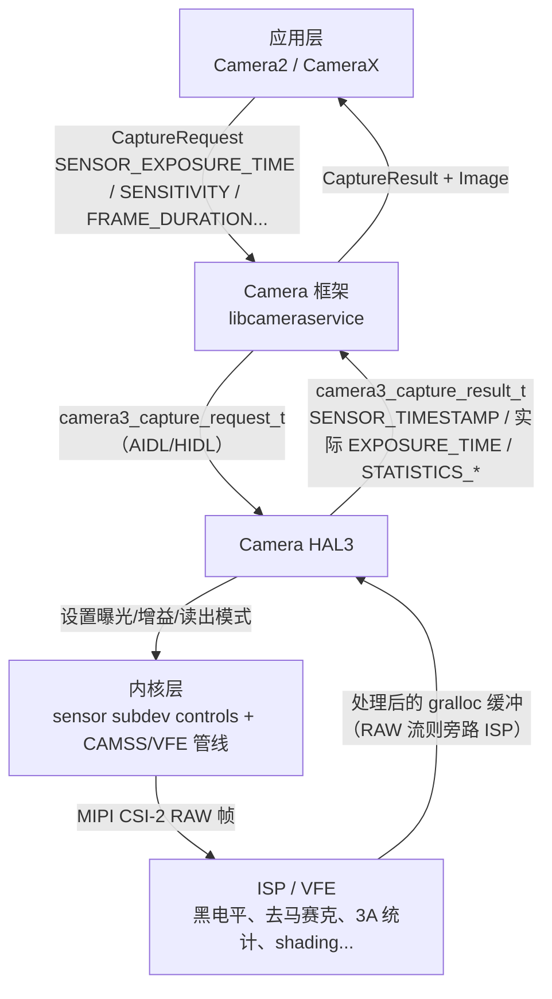
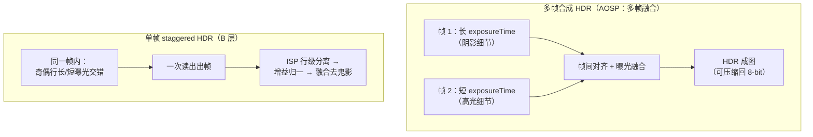

# 第 1 章 Sensor 成像基础

> 本文为分章源文件，供单章阅读；若与主文档不一致，以主文档最新版为准。

本章面向学习 Android 相机底层 / ISP 的工程师，讲清 Sensor 端"光如何变成 RAW 数据、如何被内核驱动描述、如何交给 ISP 与 HAL"。后续章节的 ISP 处理链（黑电平、去马赛克、3A 统计）都建立在传感器输出之上。

**材料可信度分层约定**（每节标注）：

| 层级 | 含义 | 典型来源 |
|---|---|---|
| A 层 | 可抓取验证的官方资料 | 内核文档（docs.kernel.org）、AOSP 源码与元数据定义（android.googlesource.com）、libcamera 官方文档、本仓库中引用 AOSP 的文档 |
| B 层 | 公开架构资料 | 传感器/芯片厂商公开架构材料与行业通行描述，无单一官方 URL 可指 |
| C 层 | 社区研究 | 论坛、博客等二手资料，须标注具体出处，谨慎采信 |

> 说明：写作期间 android.googlesource.com 的 `platform/kernel/common` 仓库路径不可用（Gitiles 报错），内核源码改用 mainline 镜像（torvalds/linux）与 `kernel/common`（android-mainline 分支）验证，两者文件清单一致；AOSP 元数据定义直接从 googlesource `platform/system/media` main 分支抓取解析。

---

## 1.1 CMOS 图像传感器工作原理

> 来源：像素物理与 PPD 结构为 B 层公开架构资料（传感器行业通行描述）；raw domain 与黑/白电平语义为 A 层，来自 [AOSP metadata_definitions.xml](https://android.googlesource.com/platform/system/media/+/refs/heads/main/camera/docs/metadata_definitions.xml)（main 分支，本文写作时抓取解析）与仓库内文档：Android/Android_Camera_学习文档.md（2.4.3 原始传感器数据支持、6.4 单色相机）

### 1.1.1 从光子到电荷（B 层）

CMOS 图像传感器的基本感光单元是**光电二极管**（photodiode）。曝光期间（积分时间），入射光子经光电效应在耗尽区产生电子-空穴对，电子被收集在光电二极管中，形成与光照度 × 曝光时间成正比的电荷量（这与 1.2 节的曝光模型直接对应）。衡量该环节的关键指标：

- **量子效率（QE）**：每个入射光子平均产生的电子数；
- **满阱容量（full well capacity）**：单像素可存储的最大电荷数，决定单帧动态范围上限（超过即高光饱和/溢出）；
- **读出噪声、暗电流**：决定低照度下限。

以上属于传感器设计的通行描述，具体数值随工艺而异（B 层）。

### 1.1.2 像素结构：PPD 与 4T 像素（B 层）

现代 CIS 普遍采用 **PPD（Pinned Photodiode，钳位光电二极管）** 像素结构：光电二极管完全耗尽、电位被"钳位"，转移电荷时几乎无残留，显著降低暗电流与图像拖影。典型 **4T 像素** 单元如下：

配合**相关双采样（CDS，Correlated Double Sampling）**——先采样复位电平、再采样信号电平，两者相减——可消除复位管 kTC 噪声与列级固定模式噪声（FPN）。PPD + 4T + CDS 是现代 CMOS 像素"低噪声"的三大支柱（B 层）。

### 1.1.3 Bayer / CFA 排列（A 层定义 + B 层背景）

硅光电二极管本身不分辨颜色。在像素表面覆盖**色彩滤波阵列（CFA，Color Filter Array）**后，每个像素只通过一种颜色分量，最常用的是 **Bayer 排列**（Gr/Gb 两个绿色通道错开，是因为人眼对绿色更敏感；Gr 与 Gb 物理上是同类像素，位于不同滤波颜色行）：

| | 列 0 | 列 1 | 列 2 | 列 3 |
|---|---|---|---|---|
| **行 0** | R | G(Gr) | R | G(Gr) |
| **行 1** | G(Gb) | B | G(Gb) | B |
| **行 2** | R | G(Gr) | R | G(Gr) |
| **行 3** | G(Gb) | B | G(Gb) | B |

AOSP 元数据 `android.sensor.info.colorFilterArrangement` 的官方定义为："色彩滤波在传感器上的排列；对 Bayer 相机而言，表示传感器左上 2×2 区域按读取顺序的颜色"，枚举值（A 层，来自 metadata_definitions.xml）：

- `RGGB` / `GRBG` / `GBRG` / `BGGR`：四种 Bayer 相位；
- `RGB`：非 Bayer 传感器，每像素输出 3 个 16-bit 值；
- `MONO`（HAL 3.4+）：无任何 Bayer 滤波的单色传感器，"该值意味着一台 MONOCHROME 相机"；
- `NIR`（HAL 3.4+）：整阵覆盖约 750–1400nm 近红外滤波的传感器，同样意味着 MONOCHROME 相机。

单色/NIR 传感器去掉 CFA 后感光效率更高、低光噪声更好，其在 HAL 层的完整实现要求（必须去掉颜色校正类元数据键、`blackLevelPattern` 等各通道值必须一致等）见仓库内文档：Android/Android_Camera_学习文档.md 第 6.4 节（A 层）。

### 1.1.4 raw domain 概念（A 层）

**raw domain** 指"传感器 ADC 输出、尚未经过任何 ISP 处理（去马赛克、白平衡、降噪、shading 校正等）"的数据域。Android 对 Bayer RAW 输出有明确的支持要求：其目的有二——服务高级相机应用、支持生成 RAW 图片文件（DNG），见仓库内文档：Android/Android_Camera_学习文档.md 第 2.4.3 节（A 层，引自 AOSP HAL3 文档"Raw Sensor Data Support"）。

RAW 帧必须伴随一组传感器校准元数据才能被后处理，AOSP 在 `android.sensor.*` 中标准化的有（A 层，metadata_definitions.xml 定义）：

| Tag | 官方定义（摘要） |
|---|---|
| `sensor.info.whiteLevel` | 传感器输出的最大 raw 值 |
| `sensor.blackLevelPattern` | CFA 各通道的**固定**黑电平偏移 |
| `sensor.dynamicBlackLevel` | 本帧各 CFA 通道的**动态**黑电平（如逐帧温漂补偿） |
| `sensor.opticalBlackRegions` | 传感器上光学屏蔽（不感光）黑像素区域列表，供每帧实测黑电平 |
| `sensor.neutralColorPoint` | 拍摄时刻在传感器原生色彩空间中估计的相机中性色 |
| `sensor.noiseProfile` | 各 CFA 通道的噪声模型系数（喂给 RAW 降噪） |
| `sensor.greenSplit` | Bayer 两个绿通道的最坏离散度 |

黑电平之后的动态范围（`whiteLevel − blackLevel`）就是后续第 2 章黑电平校正、增益归一化的输入基准。

---

## 1.2 曝光模型

> 来源：A 层——[AOSP metadata_definitions.xml](https://android.googlesource.com/platform/system/media/+/refs/heads/main/camera/docs/metadata_definitions.xml)、[内核 V4L2 controls 文档](https://www.kernel.org/doc/html/latest/userspace-api/media/v4l/control.html)、mainline 内核源码 [imx290.c](https://git.kernel.org/pub/scm/linux/kernel/git/torvalds/linux.git/tree/drivers/media/i2c/imx290)；B 层——卷帘/全局快门原理与读出模式分类

### 1.2.1 曝光时间 × 增益（A 层）

AOSP 对三个核心曝光量的官方定义与单位（metadata_definitions.xml 原文）：

| Tag | 官方定义 | 单位 | 归属 |
|---|---|---|---|
| `sensor.exposureTime` | "Duration each pixel is exposed to light"（每个像素受光照射的时长） | 纳秒 | 请求/结果 |
| `sensor.sensitivity` | "The amount of gain applied to sensor data before processing"（处理前施加于传感器数据的增益量） | ISO arithmetic units | 请求/结果 |
| `sensor.frameDuration` | "Duration from start of frame readout to start of next frame readout"（从本帧读出开始到下一帧读出开始的时长） | 纳秒 | 请求/结果 |

注意 `frameDuration` 的锚点是**读出开始**而非曝光开始——这正是 1.2.4 卷帘时序的关键。三者的合法范围分别由静态元数据 `sensor.info.exposureTimeRange`、`sensor.info.sensitivityRange`、`sensor.info.maxFrameDuration` 约束；应用请求 0 帧时长时 HAL 必须钳位到实际最小帧时长并在结果元数据中报告，见仓库内文档：Android/Android_Camera_学习文档.md 第 2.4.1 节（A 层）。手动设置曝光三件套需 `CONTROL_AE_MODE=OFF` 且设备具备 `MANUAL_SENSOR` 能力，见仓库内文档：Android/Android_Camera_接口文档.md 第 1.6 节（A 层）。

### 1.2.2 模拟增益与数字增益（A 层）

ISO 感光度在硬件上是两级增益的合成：

- `sensor.info.maxAnalogSensitivity`：官方定义为 "Maximum sensitivity that is implemented purely through analog gain"（纯粹通过模拟增益实现的最高感光度）。显然可推出：sensitivity 超过该值的部分由数字增益补足——数字增益放大信号的同时等比放大读出噪声，模拟增益则不会，所以 AE 在可调范围内应优先用满模拟增益（前半句 A 层，后一句为通行结论，B 层）。
- `sensor.info.baseGainFactor`："Gain factor from electrons to raw units when ISO=100"（ISO=100 时电子到 raw 单位的增益系数），是 ISO 与物理电子数换算的基准。

内核 V4L2 侧同样区分两级增益：uAPI 文档明确，能区分数字/模拟增益的设备应使用 `V4L2_CID_DIGITAL_GAIN` 与 `V4L2_CID_ANALOGUE_GAIN`，而不是笼统的 `V4L2_CID_GAIN`；且 `V4L2_CID_EXPOSURE` 的单位在 uAPI 层未统一规定，由驱动决定（A 层，[control.html](https://www.kernel.org/doc/html/latest/userspace-api/media/v4l/control.html)）。以 mainline 的 Sony IMX290 驱动为例（A 层，drivers/media/i2c/imx290.c）：它注册了 `V4L2_CID_EXPOSURE`（1–65535）、`V4L2_CID_ANALOGUE_GAIN`、`V4L2_CID_HBLANK`、`V4L2_CID_VBLANK`、`V4L2_CID_LINK_FREQ`、`V4L2_CID_PIXEL_RATE`，并且在 `VBLANK` 变化时联动更新 `EXPOSURE` 的允许上限——曝光行数不能超过一帧行数的约束在驱动内闭环。

### 1.2.3 电子卷帘与全局快门（B 层原理 + A 层元数据）

- **电子卷帘快门（rolling shutter）**：传感器逐行复位/曝光/读出，相邻行曝光起始时刻依次错开。行间错开量由 AOSP 标准化：`sensor.rollingShutterSkew` 官方定义为 "Duration between the start of exposure for the first row of the image sensor, and the start of exposure for one past the last row of the image sensor"（第一行曝光开始到"最后一行再下一行"曝光开始的时长，单位 ns）。卷帘会带来果冻效应（高速运动物体形变）、与频闪（flicker）交互产生 banding，这也是 AE 防闪烁按市电半周期对齐曝光时间的原因（B 层）。
- **全局快门（global shutter）**：所有像素同时曝光、再逐行读出，代价是像素结构更复杂（需要像素内存储节点）。车载/机器视觉 sensor 常采用（B 层）。

AOSP 进一步用 `sensor.timestampSource`（UNKNOWN / REALTIME，见 1.5.3）规定时间戳时钟基准，并从 Android 13 起增加 `sensor.readoutTimestamp` 能力：官方定义为 "Whether or not the camera device supports readout timestamp and `onReadoutStarted` callback"——把"读出开始"时刻也暴露给框架，用于更精确的运动检测与防抖（A 层）。

### 1.2.4 传感器读出模式（B 层）

按一帧内曝光的组织方式，通行分类为：

- **linear（线性单次曝光）**：全帧一次曝光、一次读出，1.1 节的标准流程；
- **staggered HDR（交错 HDR）**：长/短（或长/中/短）曝光以行为单位交错排布在同一帧中，一次读出即得含多档曝光的单帧（详见 1.6）；
- **ZHDR**：部分厂商对"按行/块交错多档曝光读出"的称呼（如 zigzag 式排列），命名随厂商而异，无统一标准（B 层，注意不同资料中该词含义可能不完全一致）。

---

## 1.3 PDAF 原理

> 来源：B 层——PD 像素类型与数据通路为公开架构资料（无单一官方 URL）；A 层——元数据语义来自 [AOSP metadata_definitions.xml](https://android.googlesource.com/platform/system/media/+/refs/heads/main/camera/docs/metadata_definitions.xml)（本文抓取解析 main 分支）与仓库内文档：Android/Android_Camera_接口文档.md（第 1.6/1.7 节、第 5.5 节）

### 1.3.1 相位差检测原理（B 层）

PDAF（Phase Detection Auto Focus，相位检测自动对焦）把成像光线分成两束（通常对应光瞳左右两半），分别落在成对的 PD 感光单元上。失焦时两路信号出现水平位移（相位差），其符号指示对焦过近/过远，其大小（经标定查表换算为 **defocus 值**，单位通常是镜头行程量）可直接推算对焦马达需要移动的距离——相比反差对焦的"试探爬山"，PDAF 能一步到位地预测对焦方向与幅度，再由反差确认收敛。

### 1.3.2 PD 像素类型（B 层）

公开架构资料中常见的 PD 像素实现（命名随厂商，机理相通）：

| 类型 | 结构 | 特点 |
|---|---|---|
| masked PD（掩蔽式，常与 shielded/metal-shielded 混用） | 在普通像素上用金属遮挡左半或右半，只接收半侧光瞳 | 造低：在像素阵列内稀疏插入成对的左/右遮蔽像素；损失部分感光面积 |
| shielded PD | 同上思路，以屏蔽层/微透镜偏移实现半光瞳取样 | 与 masked 常为同族概念的两种表述 |
| 2PD / Dual Pixel | 单个像素内的光电二极管左右对拆，两个输出都可成像 | 全阵列 100% PD 覆盖、弱光也能对焦；输出数据量翻倍 |
| Octa PD（2×2 OCL，社区资料亦写作 OCTPA） | 2×2 像素簇共享一个片上透镜，四个象限各自引出相位信号 | 兼顾高分辨率与全向相位检测；不同厂商命名不一 |

（以上均 B 层；"OCTPA" 一词在社区资料中更常见，官方多写作 Octa PD / 2×2 OCL——此处按公开架构资料归类，读者以具体 sensor datasheet 为准。）

### 1.3.3 PD 数据如何进入 AF 算法（B 层）

要点：PD 数据通常作为 **CSI-2 嵌入数据行**与像素数据一起传输，由 ISP（而非应用）截取；相位差到 defocus 的换算依赖 sensor+模组标定，属于产线标定数据（B 层）。

### 1.3.4 与 Android 元数据的关系（A 层 + 一处 B 层推断）

**Android 公开元数据没有标准的 PD 原始数据 tag。** 本文写作时解析 main 分支 `metadata_definitions.xml`：`sensor`（50 条）与 `statistics`（35 条）两个 section 中不存在任何 PDAF 数据条目（A 层，可复现验证）。因此 PD 原始数据/defocus 结果的交付走**厂商自定义 vendor tag**（编号 ≥ `0x80000000`、以厂商包名前缀命名的 section），其注册与查询机制见仓库内文档：Android/Android_Camera_接口文档.md 第 5.5 节（A 层）。AF 的"决策侧"则是标准化的：

- `CONTROL_AF_MODE` / `CONTROL_AF_TRIGGER` / `CONTROL_AF_REGIONS` 驱动 AF 行为，`CONTROL_AF_STATE` 报告状态机（`ACTIVE_SCAN` / `FOCUSED_LOCKED` / `PASSIVE_SCAN` 等），见仓库内文档：Android/Android_Camera_接口文档.md 第 1.6/1.7 节（A 层）；
- `LENS_FOCUS_DISTANCE`（屈光度）与 `LENS_STATE`（STATIONARY/MOVING）报告镜头实际位置与马达状态（A 层，同上）。

与 PD 质量相关的两条标准统计（A 层定义，来自 metadata_definitions.xml）：

- `statistics.lensShadingMap`："The shading map is a low-resolution floating-point map that lists the coefficients used to correct for vignetting and color shading, for each Bayer color channel of RAW image data."（对每 Bayer 通道校正渐晕与**色彩阴影**的低分辨率浮点系数表）；`statistics.lensShadingMapMode` 控制是否在结果元数据中输出该表（`OFF` / `ON`）。与 PD 的关系：**色彩阴影（color shading）会使成对 PD 信号产生系统性偏移，降低相位检测信噪比**，所以 AF 算法常需 shading 补偿后再做相关运算（前半句 A 层、后半句为通行做法，B 层推断）。
- `sensor.rollingShutterSkew` 与 `sensor.timestamp`（1.2.3 / 1.5.3）：为多帧 AF 搜索提供帧间时序基准（A 层）。

---

## 1.4 Sensor 驱动与内核层

> 来源：A 层——[V4L2 sub-device API](https://docs.kernel.org/driver-api/media/v4l2-subdev.html)、[Media Controller 核心文档](https://docs.kernel.org/driver-api/media/mc-core.html)、[V4L2 controls](https://www.kernel.org/doc/html/latest/userspace-api/media/v4l/control.html)、[Qualcomm CAMSS](https://docs.kernel.org/admin-guide/media/qcom_camss.html)、mainline 内核源码（drivers/media/platform/qcom/camss/、drivers/media/i2c/ov5645.c、imx290.c）、googlesource kernel/common（android-mainline 分支，camss 目录清单已核对一致）、[libcamera pipeline handler 指南](https://docs.libcamera.org/guides/pipeline-handler.html)（经 GitHub 源文件抓取）

### 1.4.1 V4L2 subdev 模型：sensor 是一个 subdev（A 层）

内核把 sensor、镜头控制器、CSI 接收器等"非 DMA 视频节点"的外设建模为 **V4L2 sub-device**：`struct v4l2_subdev` "describes a V4L2 sub-device"——最常见就是 I2C 器件。sensor 驱动的骨架（以 mainline `drivers/media/i2c/ov5645.c` 为例，A 层源码）：

1. `v4l2_i2c_subdev_init(&ov5645->sd, client, &ov5645_subdev_ops)`：把 `v4l2_subdev` 与 `i2c_client` 双向绑定；
2. `media_entity_pads_init(&sd->entity, npads, pads)`：为 media-controller 集成注册源 pad；
3. `v4l2_async_register_subdev_sensor(&ov5645->sd)`：异步注册；文档指出 sensor 专用变体还会顺带注册来自固件的 lens/flash 关联设备；
4. 设置 `V4L2_SUBDEV_FL_HAS_DEVNODE` 后，`v4l2_device_register_subdev_nodes()` 创建用户态节点 `/dev/v4l-subdevX`。

`struct v4l2_subdev_ops` 按类别分组（kernel 文档原文归纳，A 层）：

| ops 组 | 代表成员 | sensor 用途 |
|---|---|---|
| `core` | `log_status`、`s_power`（已标记 DEPRECATED）、`subscribe_event` | 电源/事件（控制经 `ctrl_handler` 而非 s_ctrl 回调） |
| `video` | `s_stream`（已 DEPRECATED）、`pre_streamon` | 起停流；新驱动应实现 pad ops 的 `enable_streams`/`disable_streams` 并用 `v4l2_subdev_s_stream_helper()` |
| `pad` | `enum_mbus_code`、`get_fmt`/`set_fmt`、`get_selection`、`get_frame_interval`、`link_validate`、`get_mbus_config`、`get_frame_desc` | 协商 sensor 输出的 mbus 格式（如 `MEDIA_BUS_FMT_SRGGB10_1X10`）、尺寸、裁剪 |

ov5645 的 `.s_stream = v4l2_subdev_s_stream_helper` 与 `.set_fmt = ov5645_set_format` 正是上述新接口形态的实例（A 层源码）。

### 1.4.2 media-controller 管线拓扑（A 层）

Media Controller 把硬件建模为**有向图**：硬件块是 **entity**（`struct media_entity`，通常内嵌于 `v4l2_subdev` 或 `video_device`），连接端点是 **pad**（`MEDIA_PAD_FL_SINK` 接收 / `MEDIA_PAD_FL_SOURCE` 产生，"每个 pad 有且只能设置其一"），pad 之间用 **link**（`media_create_pad_link()`）连接，link 标志含 `MEDIA_LNK_FL_ENABLED` / `IMMUTABLE` / `DYNAMIC`。流式传输时 `media_pipeline_start()` 会沿已使能的 link 把整条管线标记为 streaming，并对每个 entity 调用 `link_validate()` 校验格式/尺寸匹配；流传输期间改非 DYNAMIC link 返回 `-EBUSY`。注册后系统出现字符设备 `/dev/mediaN`，用户态通过其 ioctls 遍历拓扑（`topology_version` 随图变化单调递增）（A 层，mc-core.html）。

### 1.4.3 sensor 驱动如何暴露曝光/增益 controls（A 层）

V4L2 控制通过 `v4l2_ctrl_handler` 实现：驱动调用 `v4l2_ctrl_new_std(&ctrls, &ops, V4L2_CID_XXX, min, max, step, def)` 注册控制，在 `ops->s_ctrl` 中写寄存器；用户态经 `VIDIOC_QUERYCTRL / VIDIOC_G_CTRL / VIDIOC_S_CTRL`（subdev 节点同样支持）读写（A 层，control.html + ov5645/imx290 源码）。典型 sensor 控制集（mainline 源码实例）：

| 控制 | 作用 | 出处 |
|---|---|---|
| `V4L2_CID_EXPOSURE` | 积分时间，单位驱动自定义（常为行）；uAPI 不统一规定 | imx290（1–65535，随 VBLANK 联动更新上限） |
| `V4L2_CID_ANALOGUE_GAIN` / `V4L2_CID_DIGITAL_GAIN` | 模拟/数字增益分离（能区分的设备应优先用二者而非 `V4L2_CID_GAIN`） | imx290 注册 ANALOGUE_GAIN；control.html |
| `V4L2_CID_HBLANK` / `V4L2_CID_VBLANK` | 行/帧消隐，决定帧率上限 | imx290 |
| `V4L2_CID_PIXEL_RATE` / `V4L2_CID_LINK_FREQ` | 像素率 / CSI 链路频率（只读型，供推算帧率与 CSI 配置） | ov5645、imx290 |
| `V4L2_CID_TEST_PATTERN` | 传感器测试图案 | ov5645 |

注意对照关系：内核里曝光/增益是逐控制写入的 V4L2 controls；Android HAL 里它们收敛为 `SENSOR_EXPOSURE_TIME` / `SENSOR_SENSITIVITY` 等元数据，由 HAL/ISP 驱动层翻译为内核 controls（该翻译层属于厂商 HAL 实现，Android 不规定其形态——此句为 B 层推断，其余 A 层）。

### 1.4.4 QCOM CAMSS 驱动的 pipeline 描述（A 层）

内核文档 [qcom_camss.html](https://docs.kernel.org/admin-guide/media/qcom_camss.html) 描述的 Qualcomm Camera Subsystem 驱动（位于 `drivers/media/platform/qcom/camss`，支持 MSM8916/MSM8996（8x16/8x96），基于 Code Linaro 的 Android CAMSS 驱动移植）实现了 V4L2、Media controller 与 V4L2 subdev 三类接口。硬件单元与实体数量（8x16 / 8x96）：

| 硬件块 | 数量（8x16/8x96） | 职责 |
|---|---|---|
| CSIPHY | 2 / 3 | CSI-2 物理层（D-PHY），每模块接一个 sensor |
| CSID | 2 / 4 | CSI-2 协议/应用层解码，各含 TG（测试图案发生器） |
| ISPIF | 2 / 4（与 CSID 等量） | 把 CSID 流路由到 VFE 输入 |
| VFE | 1 / 2 | "a pipeline of image processing hardware blocks"；每 VFE 有 1 个 PIX 输入 + 3 个 RDI 输入 |

- **PIX 接口**：喂入 VFE 内部图像处理管线（末端为 scale/crop 模块），支持格式转换（packed YUV 4:2:2 → NV12/NV21/NV16 等）、最多 16 倍下采样与裁剪；
- **RDI 接口**："bypass the image processing pipeline"，旁路直通 raw dump，支持 MIPI RAW8/10/12（8x96 另有 RAW14）与 packed YUV；经 AXI 总线写内存；
- 驱动按硬件单元拆成 subdev（2/3 个 CSIPHY、2/4 个 CSID、2/4 个 ISPIF、4/8 个 VFE subdev——每输入接口一个），"Each VFE sub-device is linked to a separate video device node"；ISPIF 与 CSID 等量使 media graph 保持**线性管线**（双摄场景不出现分叉实体）；
- 全部配置在 STREAMON 时根据活动 link、格式与 controls 一次完成，无需运行时重配置（A 层，qcom_camss.html）。

源码佐证（mainline 与 googlesource `kernel/common` android-mainline 分支文件清单一致，共 40 个文件：camss.c/h、camss-csid*.c/h、camss-csiphy*.c、camss-ispif.c、camss-vfe*.c/h、camss-video.c 等，A 层）：

- `camss.c`：以 `csiphy_res_8x16` / `csid_res_8x16` / `ispif_res_8x16` / `vfe_res_8x16` 等静态表描述每个 subdev 的时钟、寄存器、中断与 hw_ops（如 `csiphy_ops_2ph_1_0`、`csid_ops_4_1`）；
- `camss-vfe.c`：`#define MSM_VFE_NAME "msm_vfe"`，`#define SCALER_RATIO_MAX 16`，`formats_rdi_8x16[]` 表列出 RDI 支持的 mbus→V4L2 像素格式映射（SRGGB10P 等 packed RAW）；
- `camss-csid.c`：`csid_testgen_modes[]`（"Color bars" 等测试图案），与 CSID 内置 TG 对应——正好呼应 AOSP 的 `sensor.testPatternMode` 与 `V4L2_CID_TEST_PATTERN` 两级测试图案。

按文档文字描述绘制的 8x16 级 media graph（文档原图为图片未随文本提供，本图按其正文归纳，A 层）：

### 1.4.5 libcamera 视角（A 层）

libcamera 官方文档把 **pipeline handler** 定义为"针对特定设备的抽象层"，职责包括：探测并注册相机及其流、按应用配置分配系统资源、起停采集会话、"Apply control settings from applications and IPA algorithms to hardware"、向应用交付帧（A 层，[pipeline-handler 指南](https://docs.libcamera.org/guides/pipeline-handler.html)）。关键方法流：

pipeline handler 直接消费 1.4.1–1.4.2 的内核抽象：`MediaDevice`/`DeviceEnumerator` 枚举拓扑，`V4L2VideoDevice` 承载 DMA 缓冲（V4L2_MEMORY_DMABUF），`V4L2Subdevice` 控制 sensor 等 subdev，而 sensor 细节被封装在 `CameraSensor` 类之后；3A 计算由 **IPA 模块**（`IPAInterface`，"the computation of the image processing pipeline tuning parameters"）完成，其输出控件由 pipeline handler 落到硬件。整个模型同样解释了 Android vendor HAL 与内核的对接方式（hal3 厂商实现中普遍存在同构的 pipeline 管理层——此为 B 层推断，其余 A 层）。

---

## 1.5 与 Android HAL 的接口

> 来源：A 层——[AOSP metadata_definitions.xml](https://android.googlesource.com/platform/system/media/+/refs/heads/main/camera/docs/metadata_definitions.xml)（抓取解析 main 分支）；仓库内文档：Android/Android_Camera_学习文档.md（第 1.3 节 HAL3 管道模型）、Android/Android_Camera_接口文档.md（第 1.6/1.7 节、第 4.3 节、第 5 章）

### 1.5.1 数据通路：sensor 输出 → ISP → HAL → 应用（A 层框架 + B 层衔接）

Android HAL3 采用请求-结果（request/result）模型：应用每帧下发 `CaptureRequest`（携带 `SENSOR_EXPOSURE_TIME` 等控制项），HAL 返回填充好的缓冲与 `CaptureResult` 元数据；请求中能设置的所有 Key 都能在结果中查到最终生效值（A 层，仓库内文档：Android/Android_Camera_学习文档.md 第 1.3.2 节、Android/Android_Camera_接口文档.md 第 1.7 节）。

HAL 内部"是否使用内核 ISP 节点（如 CAMSS 的 video 节点）、还是私有 DSP/硬件 ISP"由厂商实现决定，Android 不做规定（B 层推断；CAMSS 文档已证明内核侧确实以 video 节点暴露采集口，A 层）。输出流（预览 YUV、JPEG、RAW Bayer 等）必须在会话配置阶段一次性声明，见仓库内文档：Android/Android_Camera_学习文档.md 第 2.5.1 节（A 层）。

### 1.5.2 ANDROID_SENSOR_* 元数据清单（A 层）

下表按"请求项 / 静态项（info）/ 动态项"分类，定义均摘译自 metadata_definitions.xml。tag 组织上，`SENSOR` 与 `SENSOR_INFO` 两个 section 分别承载动态与静态条目（`*_INFO` 是生成时从主 section 的 `<static>` 内嵌 `<info>` 拆出的，见仓库内文档：Android/Android_Camera_接口文档.md 第 5.3.2 节；`sensor` section 共 50 条 = 6 controls + 33 static + 11 dynamic，见同文档第 5.4 节统计）。

**请求项（controls）**

| Tag | 官方定义（摘译） | 单位/范围 |
|---|---|---|
| `sensor.exposureTime` | 每个像素受光照射的时长 | 纳秒；`sensor.info.exposureTimeRange` |
| `sensor.frameDuration` | 本帧读出开始→下一帧读出开始的时长 | 纳秒；受 `sensor.info.maxFrameDuration` 与流组合约束 |
| `sensor.sensitivity` | 处理前施加于传感器数据的增益量 | ISO arithmetic units；`sensor.info.sensitivityRange` |
| `sensor.testPatternMode` | 使能后传感器输出测试图案而非真实曝光（OFF / SOLID_COLOR / COLOR_BARS…） | 枚举见 `sensor.info.availableTestPatternModes`；可配 `sensor.testPatternData` 指定 `[R, G_even, G_odd, B]` 纯色 |

**静态项（info，配置前可查）**

| Tag | 官方定义（摘译） |
|---|---|
| `sensor.info.activeArraySize` | 经几何畸变校正后的**有效成像区域**（crop/变焦坐标基准） |
| `sensor.info.preCorrectionActiveArraySize` | 几何畸变校正**前**的有效像素区域（HAL 3.2+，供畸变校正使用） |
| `sensor.info.pixelArraySize` | 全像素阵列尺寸，**可能包含黑校准像素**（大于 active array） |
| `sensor.info.physicalSize` | 全像素阵列的物理尺寸（mm） |
| `sensor.info.colorFilterArrangement` | CFA 排列（RGGB/GRBG/GBRG/BGGR/RGB/MONO/NIR，见 1.1.3） |
| `sensor.info.orientation` | "Clockwise angle through which the output image needs to be rotated to be upright on the device screen in its native orientation"（输出图像顺时针旋转多少度才能在原生屏幕方向摆正；API 层取 0/90/180/270，见仓库内文档：Android/Android_Camera_接口文档.md 第 1.3 节） |
| `sensor.info.timestampSource` | 时间戳时钟基准（UNKNOWN / REALTIME，见 1.5.3） |
| `sensor.info.whiteLevel` | 传感器最大 raw 输出值 |
| `sensor.info.maxFrameDuration` | 支持的最大帧时长（最低帧率） |
| `sensor.info.exposureTimeRange` / `sensitivityRange` | 手动曝光的合法范围 |
| `sensor.info.maxAnalogSensitivity` | 纯模拟增益可达的最高 ISO（区分模拟/数字增益的分界，见 1.2.2） |
| `sensor.info.lensShadingApplied` | 该设备输出的 RAW 是否已做过 lens shading 校正（决定应用侧是否需要再补偿） |
| `sensor.info.availableTestPatternModes` | 支持的测试图案列表 |
| `sensor.blackLevelPattern` | CFA 各通道固定黑电平 |
| `sensor.opticalBlackRegions` | 光学屏蔽黑像素区域列表（逐帧实测黑电平的取样区） |
| `sensor.calibrationTransform1/2`、`sensor.colorTransform1/2`、`sensor.forwardMatrix1/2`、`sensor.referenceIlluminant1/2` | RAW→DNG/XYZ 的一组标定矩阵（reference sensor ↔ 设备 sensor ↔ CIE XYZ），1/2 对应两种参考光源；单色相机必须全部缺失（见仓库内文档：Android/Android_Camera_学习文档.md 第 6.4.3 节） |

**动态项（每帧结果）**

| Tag | 官方定义（摘译） |
|---|---|
| `sensor.timestamp` | "Time at start of exposure of first row of the image sensor active array, in nanoseconds"（active array 第一行**曝光开始**时刻，ns） |
| `sensor.rollingShutterSkew` | 首行与末行曝光开始的间隔（见 1.2.3） |
| `sensor.dynamicBlackLevel` / `sensor.dynamicWhiteLevel` | 本帧各 CFA 通道黑电平 / 本帧最大 raw 值 |
| `sensor.neutralColorPoint` | 本帧在传感器原生色彩空间中的相机中性色估计 |
| `sensor.noiseProfile` | 本帧各 CFA 通道噪声模型系数 |
| `sensor.greenSplit` | 两绿通道最坏离散度 |
| `sensor.temperature` | 曝光开始时采样的传感器温度 |
| `sensor.exposureTime` / `frameDuration` / `sensitivity` / `testPatternMode` | 本帧**实际**生效值（HAL 可能对请求做钳位/舍入，必须回报告知应用） |

其中"结果必须回报告际生效值"是 AOSP 明确要求：硬件实际使用的曝光时间、帧时长等必须写入输出元数据，使应用得知钳位/舍入何时发生并补偿（A 层，仓库内文档：Android/Android_Camera_学习文档.md 第 2.4.1 节）。

### 1.5.3 时间戳语义（A 层）

`sensor.timestamp` 锚定在"active array 第一行曝光开始"。其时钟基准由 `sensor.info.timestampSource` 决定（metadata_definitions.xml 枚举原文要点）：

- `UNKNOWN`：单调纳秒时钟，但不能与其他子系统（加速度计、陀螺仪）或其他相机实例的时钟精确对齐；大致与 `SystemClock.uptimeMillis` 同基准，精度足以做 A/V 同步；同一相机实例内，流缓冲与结果元数据的时间戳可比且一致；
- `REALTIME`：与 `SystemClock.elapsedRealtimeNanos` 同基准，可与系统其他时间戳对齐；缓冲直接送视频编码器时框架自动补偿音视频时钟差。

API 层的对应描述是"该帧曝光开始的时间戳（ns）；与 `onCaptureStarted`、Image 时间戳同一时钟"（仓库内文档：Android/Android_Camera_接口文档.md 第 1.7 节）。这组语义是 3A 时序分析、多帧对齐、AR（相机与 IMU 融合）的基石：AR 场景要求 REALTIME 基准与镜头位姿标定（`LENS_POSE_ROTATION` 等，见仓库内文档：Android/Android_Camera_学习文档.md 第 6.5 节运动追踪）。

### 1.5.4 sensor 静态信息如何支撑下游（A 层）

- **裁剪/变焦坐标系**：`SCALER_CROP_REGION` 的合法范围以 `SENSOR_INFO_ACTIVE_ARRAY_SIZE` 为坐标基准，最小宽高由 `SCALER_AVAILABLE_MAX_DIGITAL_ZOOM` 推出（仓库内文档：Android/Android_Camera_学习文档.md 第 2.5.2 节）；
- **RAW 后处理**：`blackLevelPattern` + `dynamicBlackLevel` + `whiteLevel` + `noiseProfile` + shading map（`statistics.lensShadingMap`，定义见 1.3.4）构成 RAW 管线的第一组输入；
- **能力分级**：`MANUAL_SENSOR` 能力开关手动曝光三件套；`DYNAMIC_RANGE_TEN_BIT`、`ULTRA_HIGH_RESOLUTION_SENSOR`（配合 `sensor.info.pixelArraySizeMaximumResolution`、`sensor.binningFactor`）等能力以 sensor 特性为前提（仓库内文档：Android/Android_Camera_接口文档.md 第 1.3 节 Key 速查）。

---

## 1.6 传感器 HDR 能力

> 来源：A 层——AOSP HDR 路线图见仓库内文档：Android/Android_Camera_学习文档.md 第 6.2 节（引自 AOSP"高动态范围（HDR）模式"官方文档）；B 层——单帧 staggered HDR 的传感器机制

### 1.6.1 两条技术路线

HDR 要解决的核心问题是高对比场景下单帧 8-bit 成像丢失高光或阴影细节。Android 平台上分两类实现（A 层，仓库内文档：Android/Android_Camera_学习文档.md 第 6.2 节）：

- **多帧合成**：连拍多帧不同 `exposureTime`（必要时不同增益）的帧再融合。Android 的产品化路线有二：HAL 内实现的 HDR 场景模式（对客户端透明、一次请求生效）与框架/应用侧的 Camera Extensions 多帧融合（质量可超出常规请求）；Android 13 起进一步叠加 10-bit 输出管线（`DYNAMIC_RANGE_TEN_BIT` 能力 + `DynamicRangeProfiles`，P010/JPEG_R）承载 HDR 结果（A 层，同上）。
- **单帧 staggered HDR**：sensor 一次曝光读出即产出含多档曝光的单帧（1.2.4 的 staggered 读出模式），因此天然无帧间运动鬼影、无多帧延迟，代价是：分辨率/读出带宽被多档曝光摊薄、需要在 ISP 内做行级分离与融合、逐行曝光差异使噪声与频闪处理更复杂（B 层）。"ZHDR" 是部分厂商对同类行/块交错方案的称呼，命名随厂商而异（B 层）。

### 1.6.2 选择依据与元数据关联

| 维度 | 多帧合成 | 单帧 staggered |
|---|---|---|
| 运动伪影 | 需帧间对齐/去鬼影 | 单帧无鬼影（B 层） |
| 帧率/延迟 | 多帧采集，延迟高 | 单帧出图（B 层） |
| ISP 要求 | 帧级融合 | 行级分离、分档增益与降噪（B 层） |
| AOSP 接口 | HDR scene mode / Camera Extensions / 10-bit 输出（A 层） | 无标准 tag；HAL 通常以普通 RAW 流 + vendor tag 私有通告（B 层推断，机制同 1.3.4 vendor tag） |

无论哪条路线，都会转化为 1.2 节曝光模型的调度问题：多帧路线按帧序列安排 `exposureTime/sensitivity`（受 `frameDuration` 与 `maxFrameDuration` 约束），staggered 路线由 sensor 在单帧内自行完成分档曝光。至于部分资料中出现的 SMEC/DSM 等厂商缩写概念，本文写作时未能从可验证的公开资料确认其统一定义，按要求**省略**，不作 B/C 层展开。

---

<!-- ch1 done -->
