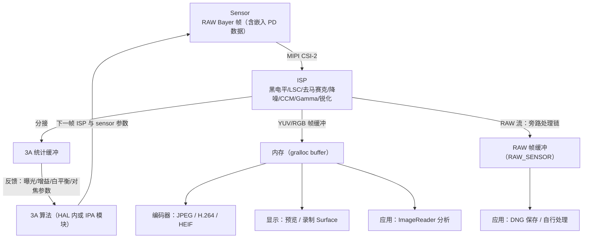
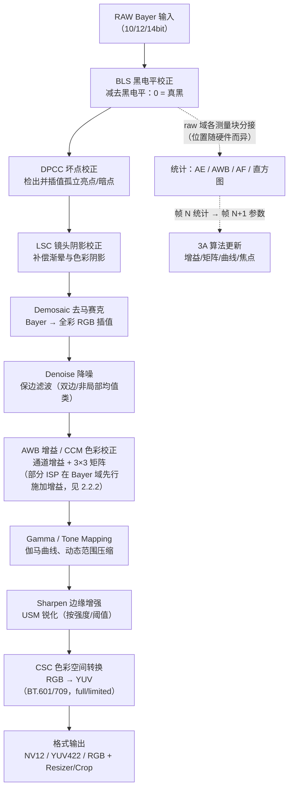
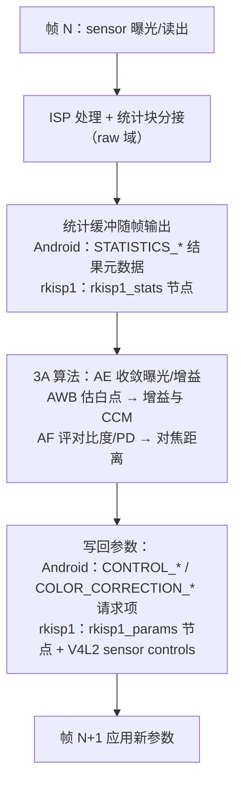
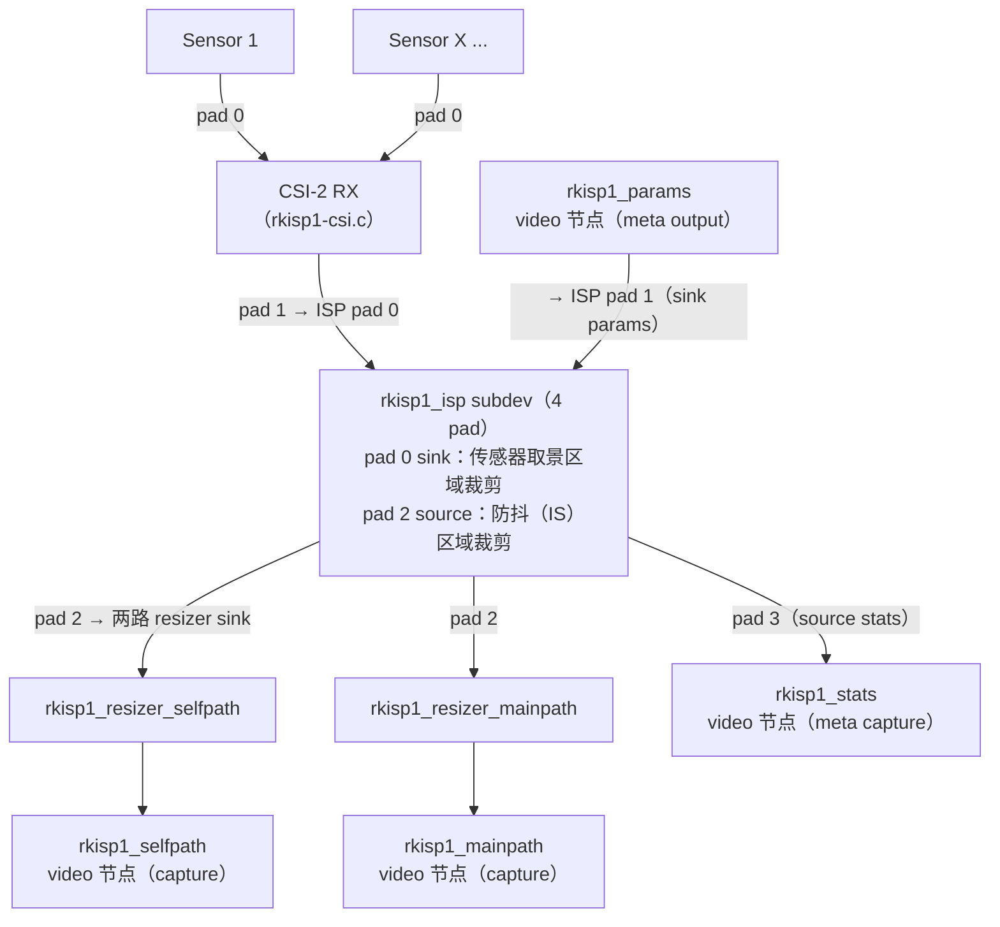
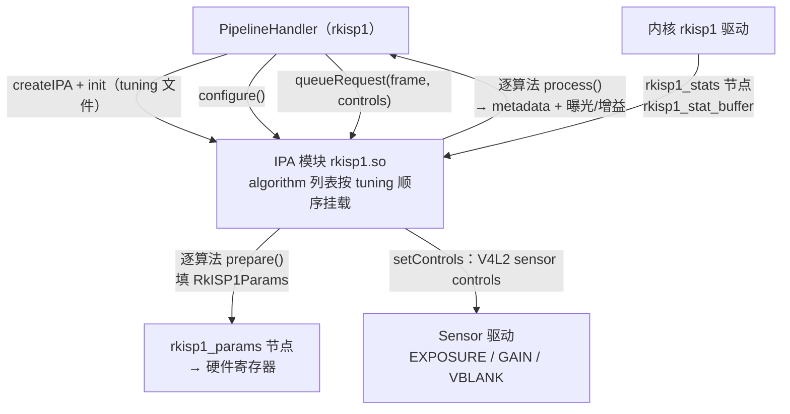

# 第 2 章 ISP 管线与图像处理算法

本章面向学习 Android 相机底层 / ISP 的工程师，讲清"RAW 帧如何在 ISP 里一步步变成可用的 YUV/RGB 图像、3A 统计如何驱动参数闭环、以及这一切在 mainline 内核（rkisp1）与 libcamera IPA 框架中的真实形态"。第 1 章的 sensor 输出（RAW Bayer + 黑电平/噪声元数据）正是本章处理链的输入。

**材料可信度分层约定**与第 1 章相同：A 层 = 可验证官方资料（内核文档/源码、AOSP 元数据定义、libcamera 官方文档、仓库内文档），B 层 = 公开架构资料与行业通行描述，C 层 = 社区研究（须标注出处）。

---

## 2.1 ISP 在相机系统中的位置

> 来源：A 层——仓库内文档：Android/Android_Camera_学习文档.md（1.3.3 相机管道虚拟模型、2.5.1 输出流、2.5.3 重新处理）、Android/Android_Camera_接口文档.md（第 1.3 节、1.7 节、第 5.3/5.4 节）、[AOSP metadata_definitions.xml](https://android.googlesource.com/platform/system/media/+/refs/heads/main/camera/docs/metadata_definitions.xml)（main 分支，本文写作时抓取解析）；B 层——sensor→ISP→编码/显示的数据流为行业通行描述

### 2.1.1 数据流全景（B 层）

sensor 按 1.2 节曝光模型出帧后，RAW Bayer 数据经 MIPI CSI-2 进入 ISP；ISP 在 raw domain 完成黑电平、阴影校正、去马赛克、降噪、色彩校正等处理，同时从数据流中"分接"出 3A 统计；处理后的 YUV/RGB 缓冲写入内存（gralloc），再分流给显示（预览）、编码器（视频/JPEG）或应用分析。RAW 流则旁路 ISP 处理链，原样落盘：



### 2.1.2 AOSP 的虚拟管道模型（A 层）

Android HAL3 文档对相机管道给出的是**虚拟模型**：不直接对应任何真实 ISP，但要足够接近真实处理管道以便映射到硬件。其关键假设（A 层，仓库内文档：Android/Android_Camera_学习文档.md 第 1.3.3 节）：

- RAW Bayer 输出在 ISP 内部不做处理；
- **统计信息（statistics）基于原始传感器数据（raw）生成**——这是 2.3 节所有统计元数据的域基准；
- RAW→YUV 的各处理块可按任意顺序排列（所以 2.2 节的 stage 顺序只是行业通行排布，各厂商实现不同）；
- 处理块有三种模式：OFF（去马赛克、色彩校正、色调曲线**不可停用**）、FAST（不降帧率）、HIGH_QUALITY（允许降帧率换质量）——对应 `NOISE_REDUCTION_MODE` / `EDGE_MODE` / `SHADING_MODE` 等键的模式枚举。

### 2.1.3 能力通告与后处理能力（A 层）

设备"能不能输出 RAW、能不能重处理、后处理能不能手动控制"由 `android.request.availableCapabilities` 通告（A 层，metadata_definitions.xml 官方定义摘译）：

| 能力位 | 官方定义（摘译） |
|---|---|
| `RAW` | "The camera device supports outputting RAW buffers and metadata for interpreting them"——支持 `RAW_SENSOR` 输出格式、可存 DNG、也可由应用直接处理 raw 图像 |
| `MANUAL_POST_PROCESSING` | "The camera device post-processing stages can be manually controlled"——保证支持手动 tonemap（`tonemap.curve`/`gamma`）、手动白平衡（`colorCorrection.transform`/`gains`）、手动 lens shading 等后处理控制。FULL 级设备必须具备（RAW 非必需，见仓库内文档：Android/Android_Camera_学习文档.md 第 1.4.5 节） |
| `PRIVATE_REPROCESSING` | 支持 Zero Shutter Lag 重处理用例：支持 1 个输入流（`maxNumInputStreams == 1`），`ImageFormat.PRIVATE` 可作为输入/输出格式 |
| `YUV_REPROCESSING` | 同上风格，`YUV_420_888` 作为输入/输出格式的重处理用例 |

注意：Android **没有**名为"PROCESS_RAW"的能力位。RAW→YUV 处理是虚拟管道的本体（所有非 LEGACY 设备都必须具备）；`RAW` 能力位只负责"把 raw 输出暴露出来"，而"把重处理输入（YUV/PRIVATE）再喂回管道重新走一遍 RAW→YUV 链"由两个 REPROCESS 能力位承载（A 层，XML 枚举可复现验证）。重处理的输入侧配套机制：应用把之前捕获的 RAW/YUV 缓冲与其结果元数据（`TotalCaptureResult`）交给 `CameraDevice.createReprocessCaptureRequest()` 构造重处理请求（A 层，仓库内文档：Android/Android_Camera_接口文档.md 第 1.7 节末、Android/Android_Camera_学习文档.md 第 2.5.3 节"相机管道可处理之前捕获的 RAW 缓冲区和元数据，生成重新渲染的 YUV 或 JPEG 输出"）；`REPROCESS` 元数据 section 的 `effectiveExposureFactor`/`maxCaptureStall` 承载重处理专属参数（A 层，仓库内文档：Android/Android_Camera_接口文档.md 第 5.3.2 节）。

---

## 2.2 通用 ISP 管线 stage 全景图

> 来源：stage 处理顺序与算法原理为 B 层行业通行描述；各 stage 的块名、寄存器级参数形态以 mainline rkisp1 UAPI（[rkisp1-config.h](https://android.googlesource.com/kernel/common/+/refs/heads/android-mainline/include/uapi/linux/rkisp1-config.h)，android-mainline 分支，本文抓取解析）为 A 层实例

### 2.2.1 管线全景（B 层顺序 + A 层分接）



各 stage 的职责与关键调参概念（顺序为通行排布；右列给出 rkisp1 中对应硬件块的官方命名，A 层）：

| Stage | 一句职责 | 关键调参概念 | rkisp1 块（官方注释名） |
|---|---|---|---|
| 黑电平校正 | 减去 sensor 黑电平底偏，使"0"代表真黑，否则暗部发灰、噪声模型失准 | 固定值 vs 光学黑区自动实测（第 1 章 `sensor.opticalBlackRegions`）；per-CFA 通道独立 | `BLS`（Black Level Subtraction）：支持固定值或测量窗口自动模式 |
| 坏点校正 | 检出与邻域严重不符的孤立亮点/暗点并插值替换 | 阈值族（绝对差/梯度/排序邻差）、G 通道与 R/B 通道分开配 | `DPCC`（Defect Pixel Cluster Detection）：多方法集、G/RB 独立阈值 |
| 镜头阴影校正 | 补偿镜头渐晕（亮度衰减）与色彩阴影（color shading，边缘偏色） | 中心到边缘的增益表、按色温分套（2.6 节 tuning 实例） | `LSC`（Lens Shade Control）：4 通道 17×17 采样表 + x/y 尺寸/梯度表 |
| 白平衡增益 | 按通道乘增益，把中性色拉平（通行排布与 CCM 同列于去马赛克后的 RGB 域；rkisp1 等硬件实际在 Bayer 域、去马赛克前施加，见 2.2.2） | 通道增益比、与 AWB 统计闭环（2.3） | `AWB_GAIN`（Auto White Balance Gain）：10bit，`out = (gain×in + 128) >> 8` |
| 去马赛克 | 从单通道 Bayer 插值出全彩 RGB；双线性插值最简单，高质量方案利用色差恒定假设（R-G/B-G 平滑）沿梯度方向插值以减少拉链伪影与彩边 | 纹理/平坦区检测阈值、边缘自适应开关 | `BDM`（Bayer Demosaic）：`demosaic_th` 纹理检测阈值 |
| 降噪 | 去除随增益增大的噪声；双域（空域滤波如双边滤波、非局部均值类）保边降噪，raw 域降噪可利用 `noiseProfile` 噪声模型 | 强度-亮度曲线、色度/亮度分离强度、与锐化的互斥权衡 | `FLT`（Filter）：模糊因子 fac_bl0/bl1 与锐化因子 fac_sh0/sh1 同块；`DPF`（去噪预滤波，demosaic 前，NLF 17 系数 + 空域 6 系数） |
| 白平衡/CCM | 把"sensor 原生色域"变换到目标色域：CCM 3×3 矩阵校正通道串扰与光源偏色 | 按光源/色温多套矩阵、饱和度与色相保持（色彩保真 vs 讨喜风格） | `CTK`（Cross Talk）：3×3 系数 11bit 定点（4 整数位 + 7 小数位）+ 偏移 |
| Gamma/ToneMapping | 线性亮度映射到显示域；同时承担动态范围压缩（tone curve，HDR 场景） | 曲线节点数/形状、log vs 等距采样、与 WDR 曲线关系 | `GOC`（Gamma Out Curve）：17/34 点曲线，LOGARITHMIC/EQUIDISTANT 采样；`WDR`：32 区间 tone curve |
| 锐化 | 增强边缘对比，抵消降噪/去马赛克/OIS 残余的模糊 | 强度、阈值（强边缘少锐化防振铃）、与降噪强度联动 | `FLT` 的 fac_sh0/fac_sh1、thresh_sh0/thresh_sh1 |
| 色彩/对比调整 | YUV 域亮度/饱和度/色相/对比度快速调整 | 对比度、饱和度、色相角度 | `CPROC`（Color Processing）：contrast/brightness/sat/hue |
| 色彩空间转换 | RGB→YUV 矩阵（BT.601/709）与量化范围（full/limited） | 色彩空间标准、range 通告一致性 | rkisp1 经 `rkisp1_isp:2` pad 的 CSC API 设置，limited 为默认（A 层，rkisp1.html） |
| 缩放/格式输出 | Resizer/Crop 与打包输出（NV12/NV21/YUV422/RGB 等） | 缩放质量、crop 与数字变焦/EIS 坐标系（第 1 章 1.5.4） | `rkisp1_resizer_mainpath/selfpath` + capture 节点 |

### 2.2.2 顺序差异：通行排布 ≠ 硬件现实（A 层证据）

rkisp1 UAPI 的模块位序（`RKISP1_CIF_ISP_MODULE_*`，bit 0→17）为：DPCC→BLS→SDG（Sensor De-gamma）→HST（直方图统计配置）→LSC→AWB_GAIN→FLT→BDM→CTK→GOC→CPROC→AFC（AF 统计配置）→AWB（AWB 统计配置）→IE（Image Effects）→AEC（AE 统计配置）→WDR→DPF→DPF_STRENGTH。可见两点与通行排布不同：**AWB 增益施加在去马赛克之前**（Bayer 域），**DPF 是去马赛克前的去噪预滤波**（A 层，rkisp1-config.h）。这正是 2.1.2 节"RAW→YUV 各处理块可按任意顺序排列"的现实注脚——学习时记 stage 的**职责与输入输出域**（raw 域 vs RGB 域 vs YUV 域）比死记顺序更重要。

---

## 2.3 统计模块：AE / AWB / AF / LSC 统计与 ANDROID_STATISTICS_*

> 来源：A 层——[AOSP metadata_definitions.xml](https://android.googlesource.com/platform/system/media/+/refs/heads/main/camera/docs/metadata_definitions.xml)（statistics/statisticsInfo/control section，main 分支抓取解析）、仓库内文档：Android/Android_Camera_学习文档.md（1.3.3）、Android/Android_Camera_接口文档.md（第 1.6/1.7 节、第 5.3 节）、mainline rkisp1 UAPI（本文抓取解析）；"分区测光窗口、白块筛选、对比度对焦"等算法描述为 B 层

### 2.3.1 统计闭环的时序（B 层流程 + A 层锚点）

ISP 的统计块与本帧图像数据并行工作：算法拿帧 N 的统计算出参数，作用于帧 N+1，如此循环收敛。HAL 虚拟模型明确"统计基于 raw 传感器数据生成"（A 层，仓库文档 1.3.3）：



### 2.3.2 AE 统计：直方图与分区测光（A 层定义 + B 层算法）

AE 需要回答"画面有多亮、哪里亮"：**直方图**给全局亮度分布，**分区测光**（把画面切成网格、每区报平均亮度）给空间分布，3A 算法按权重（中央加权、人脸优先等）算出当前 EV 与目标 EV 的偏差，再折算为曝光时间/增益调整（B 层）。

Android 标准化的 AE 相关统计元数据（A 层，XML 定义摘译）：

| Tag | 官方定义 | 备注 |
|---|---|---|
| `statistics.histogram` | "A 3-channel histogram based on the raw sensor data"（基于 raw 传感器数据的 3 通道直方图） | 开关为请求项 `statistics.histogramMode`（boolean 型 OFF/ON）；**注意三者（histogram/histogramMode/sharpnessMapMode）在 XML 中均标 `FUTURE` tag——预留键，实际设备普遍未实现**，主流 3A 统计留在 HAL 内部（见 2.3.5 末段）；桶数由静态 `statisticsInfo.histogramBucketCount`（"Number of histogram buckets supported"）与 `maxHistogramCount` 限定 |
| `control.aeRegions` | "List of metering areas to use for auto-exposure adjustment"（用于自动曝光调整的测光区域列表） | 最多 3 个区域，坐标基于 activeArraySize；权重字段控制该区话语权 |
| `statistics.sceneFlicker` | "The camera device estimated scene illumination lighting frequency"（设备估计的场景照明频率：50Hz/60Hz/NONE） | AE 防闪烁按市电半周期对齐曝光 |

rkisp1 硬件实例（A 层，rkisp1-config.h）：AE 统计 `rkisp1_cif_isp_ae_stat` 为 `exp_mean[]` 分区均值——**V10 是 5×5=25 区、V12 是 9×9=81 区**（注释原文 "Image is divided into 5x5 blocks on V10 and 9x9 blocks on V12"），并附带 `bls_val`（黑电平实测值）；直方图 `rkisp1_cif_isp_hist_stat` 为 16（V10）/32（V12）个 bin，测量窗口切成 5×5/9×9 子窗**独立统计后加权平均**，各子窗权重可配（`rkisp1_cif_isp_hst_config`）——正是"分区测光 + 可调权重"的硬件化。

### 2.3.3 AWB 统计：白块统计（A 层定义 + B 层算法）

AWB 的经典做法是"白块统计"：把画面分成小块，筛掉过亮（接近高光溢出）、过暗、彩度过高的块，剩下的近似灰块的 R/G/B 均值即当前光源色偏，据此推通道增益与 CCM（B 层，灰世界/白块法通行描述）。Android 标准元数据（A 层）：

| Tag | 官方定义 | 备注 |
|---|---|---|
| `control.awbRegions` | "List of metering areas to use for auto-white-balance illuminant estimation"（用于自动白平衡光源估计的测光区域列表） | 同 aeRegions 的区域模型 |
| `statistics.predictedColorGains` | "The best-fit color channel gains calculated by the camera device's statistics units for the current output frame"（设备统计单元为本帧算出的最佳拟合通道增益） | `hidden` 可见性——HAL 内部 3A 使用，不进公开 API |
| `statistics.predictedColorTransform` | "The best-fit color transform matrix estimate ... for the current output frame"（本帧最佳拟合色彩变换矩阵估计） | 同上 hidden |
| `colorCorrection.gains` / `colorCorrection.transform` | 实际生效的白平衡增益/色变换矩阵（结果元数据） | A 层，仓库内文档：Android/Android_Camera_接口文档.md 第 1.7 节 |

rkisp1 硬件实例（A 层）：AWB 统计 `rkisp1_cif_isp_awb_stat` 输出测量窗口内 `cnt`（参与统计的像素数）+ `mean_y_or_g / mean_cb_or_b / mean_cr_or_r`（YCbCr 或 RGB 均值，模式可选）；其配置 `rkisp1_cif_isp_awb_meas_config` 正是白块筛选参数——`min_y/max_y`（亮度上下限）、`max_csum`（Cb+Cr 上限）、`min_c`（最小彩度）、`frames`（跨帧平均帧数 1–8）、`awb_ref_cr/awb_ref_cb`（AWB 调节目标参考值）。

### 2.3.4 AF 统计：对比度曲线与 PD 数据（A 层定义 + B 层算法）

反差对焦靠"对比度曲线"爬坡：统计块对测量窗口持续输出锐度值，算法移动镜头、找锐度峰值再回位（B 层）。Android 标准元数据（A 层）：

- `control.afRegions`："List of metering areas to use for auto-focus"（用于自动对焦的测光区域列表）；
- `statistics.sharpnessMap`："A 3-channel sharpness map, based on the raw sensor data"（基于 raw 数据的 3 通道锐度图；静态 `statisticsInfo.sharpnessMapSize`/`maxSharpnessMapValue` 描述其尺寸与量程，`statistics.sharpnessMapMode` 控制开关）——同样标 `FUTURE`（见 2.3.2）。

rkisp1 硬件实例（A 层）：AF 统计 `rkisp1_cif_isp_af_stat` 在**最多 3 个可配窗口**（`RKISP1_CIF_ISP_AFM_MAX_WINDOWS`）内各输出 `sum`（注释原文 "sharpness value"，锐度和）与 `lum`（亮度值）。

PD 数据方面：第 1 章 1.3.4 已讲明 **Android 公开元数据没有标准 PD 原始数据 tag**，PD/defocus 走厂商 vendor tag；本章补充对应关系：标准侧 AF 只输出区域与锐度类统计，PD 原始数据的搬运、标定查表全部落在厂商 ISP/统计块与 vendor tag 体系内（A 层结论 + B 层推断，同第 1 章）。

### 2.3.5 LSC 统计与其他统计（A 层）

| Tag | 官方定义（摘译） | 与 LSC 块的关系 |
|---|---|---|
| `statistics.lensShadingMap` | "The shading map is a low-resolution floating-point map that lists the coefficients used to correct for vignetting and color shading, for each Bayer color channel of RAW image data"（对每 Bayer 通道校正渐晕与色彩阴影的低分辨率浮点系数表） | RAW 后处理用它反向补偿（RAW 流旁路 ISP 时）；请求项 `statistics.lensShadingMapMode`（"Whether the camera device will output the lens shading map in output result metadata"）控制是否输出，静态 `statisticsInfo.availableLensShadingMapModes` 通告能力 |
| `statistics.lensShadingCorrectionMap` | "The shading map is a low-resolution floating-point map that lists the coefficients used to correct for vignetting, for each Bayer color channel"（仅渐晕版，byte 型） | float 版含 color shading 且面向 RAW 处理，byte 版为 Java 侧简化投影 |

其他标准化统计（A 层，XML 定义摘译）：`statistics.faces`（"List of the faces detected through camera face detection in this capture"，配 `faceDetectMode`（SIMPLE/FULL/OFF）与 `faceIds/faceLandmarks/faceRectangles/faceScores`，静态 `availableFaceDetectModes`/`maxFaceCount`）——人脸检测结果同时反哺 AE/AWB/AF 的测光偏好（B 层通行做法）；`statistics.hotPixelMap`（"List of (x, y) coordinates of hot/defective pixels on the sensor"，坏点坐标表）；`statistics.oisSamples` 等 OIS 位置采样（配 `oisDataMode`），供防抖与多帧对齐分析。

把 2.3.1–2.3.5 串起来看：Android 标准元数据对统计的**直接暴露其实很克制**——直方图与锐度图还是 FUTURE 预留键，应用可见的多是测光区域、人脸、shading 表这类"结果面"；逐帧高频的 AE/AWB/AF 原始统计主要在 HAL/ISP 内部闭环（这正是 vendor tag 与厂商私有统计模块存在的原因，机制见仓库内文档：Android/Android_Camera_接口文档.md 第 5.5 节）。rkisp1 恰好把这条内部路径以标准 V4L2 元数据节点公开了出来，因此成为学习统计设计的最佳公开样本（本段为 B 层归纳，所引定义均为 A 层）。

---

## 2.4 mainline 实例：rkisp1 驱动的管线结构

> 来源：A 层——[内核文档 rkisp1.html](https://docs.kernel.org/admin-guide/media/rkisp1.html)、mainline 驱动源码（drivers/media/platform/rockchip/rkisp1/，android.googlesource kernel/common android-mainline 分支，本文抓取解析；rkisp1-dev.c 顶部注释含框图与拓扑图，本文 Mermaid 图按其注释归纳转绘）

### 2.4.1 驱动与硬件概览（A 层）

rkisp1 驱动位于 `drivers/media/platform/rockchip/rkisp1`，"uses the Media-Controller API"，支持 Rockchip ISP1 系列：`RKISP1_V10`（rk3288/rk3399）、`RKISP1_V11`（"declared in the original vendor code, but not used"）、`RKISP1_V12`（rk3326/px30）、`RKISP1_V13`（rk1808），另有 `RKISP1_V_IMX8MP`（i.MX8MP）；版本号运行期经 `MEDIA_IOC_DEVICE_INFO` 的 `hw_revision` 读出。UAPI 头为 `include/uapi/linux/rkisp1-config.h`。

驱动文件分工（A 层，目录清单）：`rkisp1-dev.c`（平台/基础）、`rkisp1-csi.c`（CSI-2 接收）、`rkisp1-isp.c`（ISP subdev）、`rkisp1-resizer.c`（缩放）、`rkisp1-capture.c`（DMA video 节点）、**`rkisp1-params.c`（参数 video 节点）**、**`rkisp1-stats.c`（统计 video 节点）**、`rkisp1-common.h/regs.h/debug.c`。

### 2.4.2 Media 拓扑：三个 subdev + 四个 video 节点（A 层）

按 rkisp1-dev.c 顶部注释的 Media Topology 归纳转绘（原图为字符画）：



四个 video 节点的角色（A 层，rkisp1.html 原文要点）：

| 节点 | 类型 | 职责与限制 |
|---|---|---|
| `rkisp1_mainpath` | capture | 主路采集，"usually in higher resolution"；支持 Bayer 与 YUV，**不支持 RGB** |
| `rkisp1_selfpath` | capture | 自路采集（小分辨率）；支持 YUV/RGB（内部 YUV→RGB），**不能采集 Bayer** |
| `rkisp1_stats` | metadata capture | 输出 3A 统计 + 直方图；缓冲格式 `struct rkisp1_stat_buffer`，用户态设 `V4L2_META_FMT_RK_ISP1_STAT_3A` |
| `rkisp1_params` | metadata output | 接收用户态参数，流式期间逐帧应用；两种格式：固定式 `struct rkisp1_params_cfg`（`V4L2_META_FMT_RK_ISP1_PARAMS`）与可扩展式 `struct rkisp1_ext_params_cfg`（`V4L2_META_FMT_RK_ISP1_EXT_PARAMS`） |

ISP subdev 共 4 个 pad（A 层，rkisp1-common.h `enum rkisp1_isp_pad`）：0 = `SINK_VIDEO`（接 CSI-2 RX，或直连 sensor 的 parallel 接口经 MUX）、1 = `SINK_PARAMS`（params 节点流入，link 为 IMMUTABLE）、2 = `SOURCE_VIDEO`（**同时**链接到两个 resizer 的 sink，dev.c 的 createLinks 循环建立）、3 = `SOURCE_STATS`（stats 节点流出，IMMUTABLE）。两个 resizer subdev 只工作在 YUV 4:2:2（`MEDIA_BUS_FMT_YUYV8_2X8`），支持缩放（如 4:2:2→4:2:0 采样变更）与 sink pad 裁剪；Bayer 采集时 mainpath resizer 处于旁路（bypass）模式。`rkisp1_isp` 的 sink pad 0 格式必须与 sensor 匹配，否则起流报 `-EPIPE`（A 层，rkisp1.html）。

### 2.4.3 "参数 / 统计"两路 video node 的控制模型（A 层）

rkisp1 把 3A 控制面与数据面分开：图像走 mainpath/selfpath，控制面走两个元数据节点。**统计节点**的缓冲 `struct rkisp1_stat_buffer { meas_type; frame_id; params; }`：`meas_type` 按位报告本帧有效统计（`RKISP1_CIF_ISP_STAT_AWB` / `AUTOEXP` / `AFM` / `HIST`），`frame_id` 用于与图像帧同步，`params` 是 `rkisp1_cif_isp_stat` 联合体（awb/ae/af/hist 四组，见 2.3 节）。**参数节点**的固定式缓冲用三个掩码精确表达"改什么"：

```c
struct rkisp1_params_cfg {
    __u32 module_en_update;   /* 哪些模块的使能位需要更新 */
    __u32 module_ens;         /* 这些模块更新后的使能值 */
    __u32 module_cfg_update;  /* 哪些模块的配置要随本缓冲下发 */
    struct rkisp1_cif_isp_isp_meas_cfg  meas;    /* 4 组统计块配置 */
    struct rkisp1_cif_isp_isp_other_cfg others;  /* 13 组处理块配置 */
};
```

可扩展式 `struct rkisp1_ext_params_cfg { version; data_size; data[]; }` 只携带变化的块，头部与通用 V4L2 参数框架（`v4l2_isp_params_buffer`）二进制兼容（`static_assert` 保证，A 层）。18 个模块使能位（A 层，UAPI 头注释原文）：

| 位 | 宏 | 官方注释 | 位 | 宏 | 官方注释 |
|---|---|---|---|---|---|
| 0 | `MODULE_DPCC` | Defect Pixel Cluster Detection | 9 | `MODULE_GOC` | Gamma Out Curve |
| 1 | `MODULE_BLS` | Black Level Subtraction | 10 | `MODULE_CPROC` | Color Processing |
| 2 | `MODULE_SDG` | Sensor De-gamma | 11 | `MODULE_AFC` | Auto Focus Control statistics configuration |
| 3 | `MODULE_HST` | Histogram statistics configuration | 12 | `MODULE_AWB` | （AWB 测量统计配置） |
| 4 | `MODULE_LSC` | Lens Shade Control | 13 | `MODULE_IE` | （Image Effects） |
| 5 | `MODULE_AWB_GAIN` | Auto White Balance Gain | 14 | `MODULE_AEC` | （AE 测量统计配置） |
| 6 | `MODULE_FLT` | Filter | 15 | `MODULE_WDR` | （宽动态 tone curve） |
| 7 | `MODULE_BDM` | Bayer Demosaic | 16/17 | `MODULE_DPF` / `_DPF_STRENGTH` | （去噪预滤波 / 强度） |
| 8 | `MODULE_CTK` | Cross Talk | | | |

内核文档明确描述了这个闭环：应用从 `rkisp1_stats` 读统计、跑算法、再经 `rkisp1_params` 重参数化以在流式过程中改善画质；并警告若跳过这一步直接采集，"frames will probably won't have a good quality, and can even look dark and greenish"（画面质量差、甚至偏暗偏绿）——这正是 ISP 参数缺席时欠曝光 + 无白平衡的直观症状（A 层，rkisp1.html）。

### 2.4.4 mediatek ISP 驱动的 mainline 状态（如实报告）

截至本文写作时（2026-09），Android mainline 内核 `kernel/common` android-mainline 分支与 torvalds 主线的 `drivers/media/platform/mediatek/` 目录内容一致，仅含：**jpeg、mdp、mdp3、vcodec、vpu** 五个子目录（A 层，两侧 Gitiles/cgit 目录清单均已核对）——即只有 JPEG 编解码、MDP 显示数据通路与视频编解码/VPU 驱动，**没有合入任何相机 ISP（Pass 1 类）驱动**。历史脉络：MediaTek 曾以 RFC 补丁提交基于 V4L2/media-controller 的 ISP Pass 1（P1）驱动（`drivers/staging/media/mtk-isp`，2019–2020 年邮件列表评审，见 C 层出处 [LWN：media: platform: mtk-isp: Add Mediatek ISP Pass 1 driver](https://lwn.net/Articles/795631/)），该 staging 代码未转正、后续从 staging 移除；MediaTek 平台的相机 ISP 至今主要随厂商内核树（Android BSP）交付，不通过 mainline rkisp1 这类路径暴露。因此第 2.4 节以 rkisp1 为 mainline 教学样本（C 层出处仅 LWN 一条，其余为目录清单可复现事实）。

---

## 2.5 libcamera IPA 框架：算法如何以独立模块挂进 pipeline

> 来源：A 层——[libcamera IPA Writer's Guide](https://docs.libcamera.org/master/guides/ipa.html)（v0.7.2，本文抓取）、libcamera 源码（GitHub 镜像 [libcamera-org/libcamera](https://github.com/libcamera-org/libcamera) master 分支：src/ipa/libipa/algorithm.h、src/ipa/rkisp1/、src/libcamera/pipeline/，本文抓取解析）

### 2.5.1 IPA 模块与接口（A 层）

libcamera 官方指南定义："**IPA modules are Image Processing Algorithm modules. They provide functionality that the pipeline handler can use for image processing.**"（IPA 模块是图像处理算法模块，为 pipeline handler 提供图像处理能力）。IPA **接口**定义 pipeline handler 与 IPA 之间的约定：IPA 暴露的函数（Main interface，同步调用如 init/configure/start）、IPA 发出的信号（Event interface，异步回调如统计就绪），以及双方传递的自定义数据结构；接口用 mojom 描述、编译生成 C++ 头（`<libcamera/ipa/rkisp1_ipa_interface.h>` 与专用代理 `IPAProxyRkISP1` 风格的头）。pipeline handler 侧经 `PipelineHandler::createIPA<IPAProxy>()` 构造代理对象，连接 Event 信号槽后像调用普通成员函数一样调用 `init()`/`configure()`/`start()`（A 层，指南原文流程）。同一 IPA 接口可复用于不同平台：指南举例 rkisp1 pipeline handler 同时覆盖 RK3399 与 i.MX8MP——"as they integrate the same ISP"。

### 2.5.2 Algorithm 基类：算法插件的统一骨架（A 层）

`src/ipa/libipa/algorithm.h` 定义了所有具体算法继承的模板基类 `Algorithm<Module>`，五个虚函数钩子覆盖算法生命周期：

| 钩子 | 时机 | 典型工作 |
|---|---|---|
| `init(context, tuningData)` | IPA init | 从 tuning 文件（ValueNode）读本算法参数 |
| `configure(context, configInfo)` | 相机 configure | 按分辨率/格式初始化运行参数 |
| `queueRequest(context, frame, frameContext, controls)` | 每个请求入队 | 解析应用下发的控制项 |
| `prepare(context, frame, frameContext, params)` | 帧参数下发前 | **填 ISP 参数缓冲**（rkisp1 即 RkISP1Params） |
| `process(context, frame, frameContext, stats, metadata)` | 统计到达后 | **消费统计、产出结果元数据**（如算出的曝光/增益） |

算法用 `REGISTER_IPA_ALGORITHM(algorithm, name)` 静态注册进工厂（`AlgorithmFactory`）；`Module` 由 `ipa::Module<IPAContext, IPAFrameContext, ...>` 模板实例化——rkisp1 的实例化是 `ipa::Module<IPAContext, IPAFrameContext, IPACameraSensorInfo, RkISP1Params, rkisp1_stat_buffer>`（A 层，src/ipa/rkisp1/module.h），即：**算法与具体 ISP 解耦，只跟 Context（全局状态）、FrameContext（逐帧状态）、Params（参数缓冲）、Stats（统计缓冲）四个抽象打交道**。

### 2.5.3 rkisp1 IPA 的算法模块清单（A 层）

`src/ipa/rkisp1/algorithms/` 目录（GitHub master 分支清单）共 14 个算法 + 基类头：

| 文件 | 算法 | 对应 2.2 节 stage |
|---|---|---|
| `blc.cpp/.h` | BlackLevelCorrection 黑电平校正 | BLS |
| `dpcc.cpp/.h` | 坏点校正 | DPCC |
| `lsc.cpp/.h` | 镜头阴影校正 | LSC |
| `gsl.cpp/.h` | GammaSensorLinearization（Gamma Sensor Linearization control）：sensor 线性化/去 gamma 曲线 | SDG（Sensor De-gamma） |
| `awb.cpp/.h` | 自动白平衡 | AWB Gain / CCM |
| `ccm.cpp/.h` | 色彩校正矩阵 | CCM |
| `compress.cpp/.h` | Compand 压缩曲线 | Gamma/压缩 |
| `dpf.cpp/.h` | 去噪预滤波 | Denoise（DPF） |
| `filter.cpp/.h` | 滤波（降噪 + 锐化） | Denoise / Sharpen（FLT） |
| `goc.cpp/.h` | Gamma Out 曲线 | Gamma |
| `cproc.cpp/.h` | 色彩处理（对比度/饱和度/亮度） | CPROC |
| `wdr.cpp/.h` | 宽动态 tone curve | ToneMapping（WDR） |
| `agc.cpp/.h` | 自动增益/曝光控制（AE） | 3A：AE |
| `lux.cpp/.h` | 亮度（lux）估计 | 3A 辅助量 |
| `algorithm.h` | 算法基类 | —— |

IPA 模块主文件 `rkisp1.cpp` 的运行流（A 层，源码函数清单）：`init()` 解析 tuning 文件的 `algorithms` 列表并 `createAlgorithms()` 逐个实例化 → `configure()` 逐算法 configure（并禁用不支持当前 raw 格式的算法）→ `queueRequest()` 逐算法透传控制项 → **`computeParams()` 逐算法 `prepare()` 填 RkISP1Params**（即写 2.4.3 节的参数缓冲）→ **`processStats()` 逐算法 `process()` 消费 `rkisp1_stat_buffer` 并产出元数据** → `setControls()` 把 AGC 算出的曝光/增益/vblank 经 V4L2 controls 写到 sensor。libcamera 仓库 `src/libcamera/pipeline/` 现有 pipeline handler：imx8-isi、ipu3、mali-c55、rkisp1、rpi、simple、uvcvideo、vimc、virtual——同一套 IPA 框架跨 ISP 复用（A 层，目录清单）。



---

## 2.6 Tuning 概念：什么是 tuning、AISP 与 HAL 的关系

> 来源：B 层——tuning 的工程定义与流程为行业通行描述；A 层——libcamera tuning 文件为可验证实例；C 层——"AISP"社区用法标注出处

### 2.6.1 什么是 tuning（B 层 + A 层实例）

同一颗 ISP 换一颗 sensor（或镜头模组），图像质量就完全不同：LSC 增益表、坏点位置、白点/CCM、gamma 曲线、降噪强度、锐化策略都随光学与工艺而变。**tuning 就是针对特定 sensor+镜头+ISP 组合产出整套 ISP 参数包的工程过程**：在标准光源/图卡下逐模块标定（LSC 表、黑电平、坏点表）、按色温抓拍标定 AWB 白点与 CCM（典型按 D65/D50/A/TL84 等光源做几套，运行期插值）、再逐轮主观/客观迭代降噪-锐化-色彩风格，最终固化为一版参数，随固件/HAL 发布（B 层，通行描述）。

可验证的实例（A 层）：libcamera 的 tuning 文件按 sensor 一文件交付（`src/ipa/rkisp1/data/` 下 imx219.yaml、imx258.yaml、ov2685.yaml、ov4689.yaml、ov5640.yaml、ov5695.yaml、ov8858.yaml、uncalibrated.yaml）。以 `imx219.yaml` 为例，顶层即 `algorithms` 列表（`Agc`、`Awb`、`BlackLevelCorrection`、`LensShadingCorrection`），其中 LSC 参数按色温分组（`sets: - ct: 5800` 后跟 r/gr/gb/b 四通道 17×17 增益表）——2.6.1 所述"按色温分套 + 逐模块参数"的最小可读样本，也正是 2.5.3 节 `init(tuningData)` 读入的数据。

### 2.6.2 Tuning 与 HAL 的关系（B 层）

在 Android 生态中，tuning 产出的参数由**厂商 HAL/3A 私有层**加载（HAL 启动或 configureStreams 时初始化），运行期 3A 算法按场景（色温、亮度、人脸、变焦倍率）在参数表之间查表/插值，经标准元数据（`COLOR_CORRECTION_*`、`TONEMAP_*`、`NOISE_REDUCTION_MODE` 等）或 vendor tag 落到 ISP；应用只见标准接口， tuning 细节全部封装在 HAL 内（B 层推断，机制同第 1 章 1.3.4 与仓库内文档 Android/Android_Camera_接口文档.md 第 5.5 节 vendor tag 机制）。libcamera 把这一层显式化：tuning 文件 + IPA 算法模块 + pipeline handler 三者公开可读（A 层），是理解"厂商 HAL 里那套黑盒"的最好参考实现。

### 2.6.3 AISP 调优（B/C 层，点到为止）

近年厂商在传统 ISP 硬件之外引入学习型/AI 参与的图像处理（AI 降噪、超分辨率、夜景多帧融合、人脸/语义分区调色等），社区资料常以"AISP"（AI-ISP）统称。这类模块多运行在 ISP 邻接的 NPU/DSP 上，其标定与模型同样进入厂商 HAL/tuning 体系，但 Android 标准元数据**不暴露其内部**——应用能感知的仍只是 `NOISE_REDUCTION_MODE`、`EDGE_MODE`、scene mode 等标准键或 extensions 接口（B 层）。注意：**"AISP"一词没有统一的官方定义**，不同厂商对 AI 参与的位置（raw 域/RGB 域/YUV 域、在线推理 vs 离线生成参数）叫法不一，且各资料口径差异较大（C 层，社区用法，无单一可引出处；学习时以厂商具体技术材料为准），本文点到为止。

---

<!-- ch2 done -->
