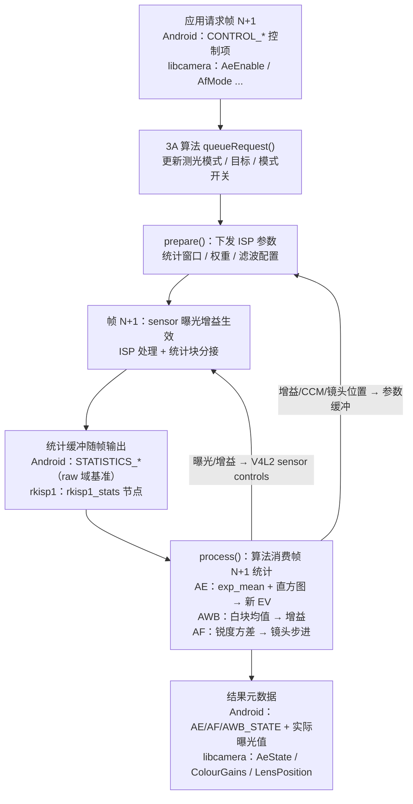
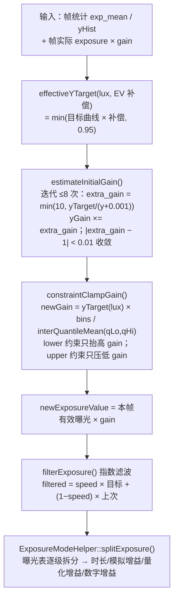
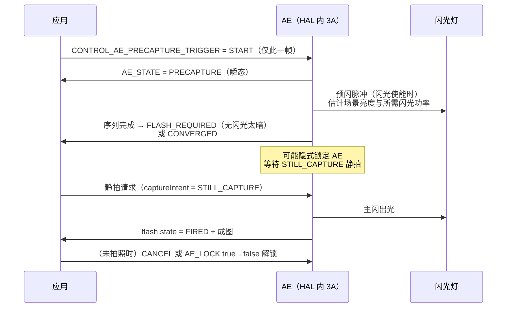
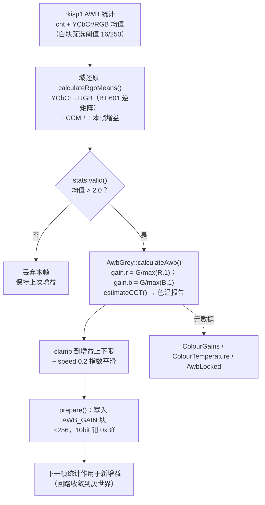
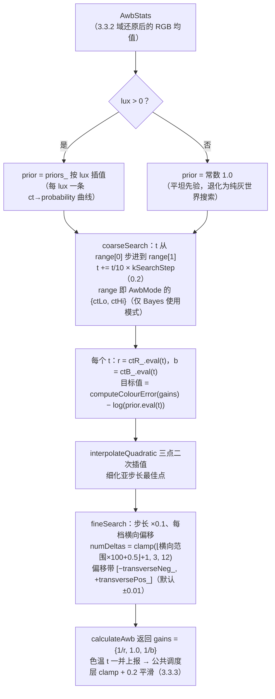
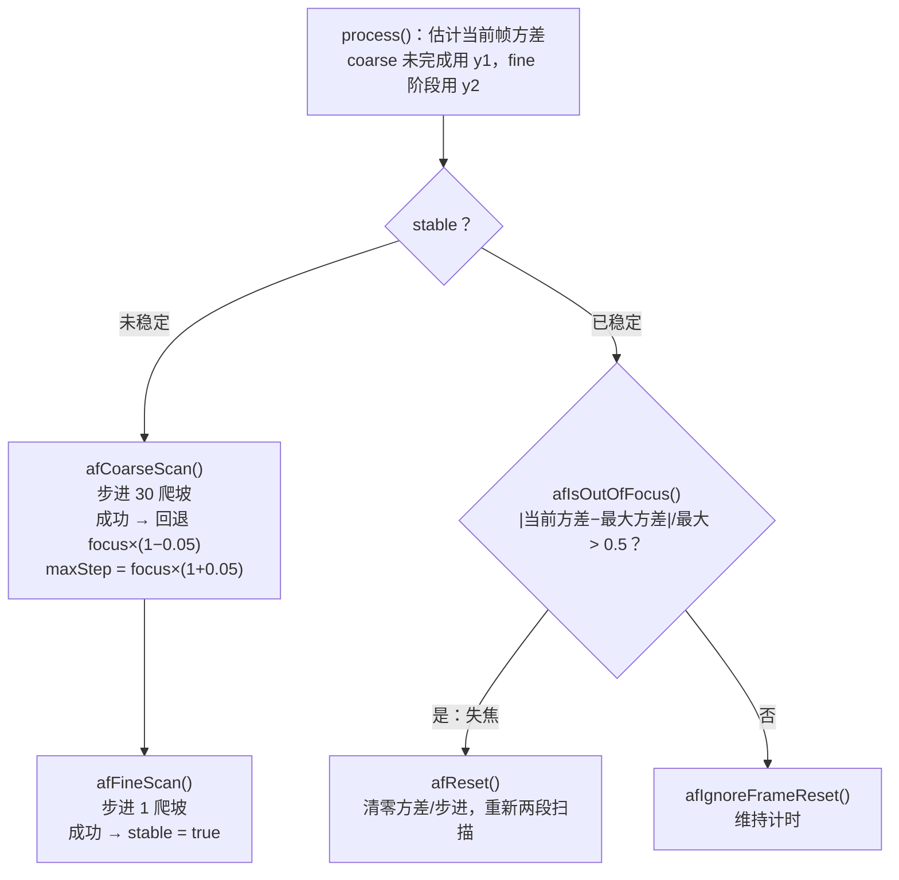
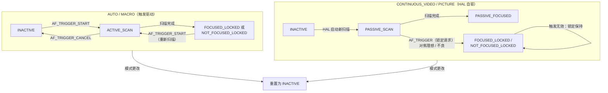

# 第 3 章 3A 算法深入（AE / AWB / AF）

> 本文为分章源文件，供单章阅读；若与主文档不一致，以主文档最新版为准。

本章面向学习 Android 相机底层 / ISP 的工程师，讲清 3A（AE 自动曝光 / AWB 自动白平衡 / AF 自动对焦）"统计采集 → 算法计算 → 参数下发"的闭环如何工作。第 2 章 2.3 节已讲过统计元数据与 rkisp1 统计块，2.5 节已讲过 libcamera IPA 的 Algorithm 框架；本章在此基础上往下钻一层——**直接读开源算法源码**。libcamera 的 rkisp1 / IPU3 IPA 模块是公开生态中少有的"完整可读"的 3A 参考实现，是理解厂商 HAL 里那套黑盒的最佳教材。

**材料可信度分层约定**与第 1、2 章相同：A 层 = 可验证官方资料（libcamera 开源算法源码、内核文档、AOSP API 参考与元数据、仓库内文档），B 层 = 公开通行知识（算法原理、厂商公开材料、公开学术资料），C 层 = 社区研究（须标注出处，谨慎采信）。

> 说明：libcamera rkisp1 IPA 的 `algorithms/` 目录经 GitHub API 目录清单核实**不含 AF 算法**（共 14 个算法：agc、awb、blc、ccm、compress、cproc、dpcc、dpf、filter、goc、gsl、lsc、lux、wdr），因此本章 AF 部分采用 Intel IPU3 IPA 的 `af.cpp`（A 层，同仓库 master 分支抓取）。libcamera 的控制项名与 Android 元数据一一对应（`AeEnable` ↔ `CONTROL_AE_MODE` 等，源出 Android HAL3 规范），行文时两套名字并给出。本章所引 libcamera 源码均抓取于 2026-09（GitHub 镜像 master 分支）；另核实其 `control_ids_core.yaml` 未定义任何闪光灯控制项（A 层，可复现），3.2.7 节闪光灯内容以 Android 元数据体系为准。

---

## 3.1 3A 闭环总览：统计 → 算法 → 参数 的反馈回路

> 来源：A 层——仓库内文档：Android/Android_Camera_学习文档.md（1.3.3 相机管道虚拟模型、2.1 3A 模式和状态转换）、Android/Android_Camera_接口文档.md（1.6/1.7 节、5.3 节）、libcamera 源码（src/ipa/rkisp1/rkisp1.cpp，第 2 章 2.5.3 已引）；B 层——反馈控制/闭环收敛的通行描述

### 3.1.1 反馈回路结构（B 层框架 + A 层锚点）

3A 本质是三个并联的**负反馈控制系统**：ISP 统计块测量"画面当前状态"（亮度分布、白点位置、对焦锐度），算法比较测量值与目标值的偏差，算出下一帧的传感器/ISP 参数。与一般控制系统不同，这个回路有两点特殊性（B 层）：

1. **大延迟**：从"参数生效的那帧曝光"到"该帧统计回到算法手里"至少隔 1–2 帧（曝光 + 读出 + 统计输出 + 算法处理），增益设置过激会震荡；
2. **非平稳场景**：测光对象（场景亮度）本身在变，算法必须区分"场景变了"与"我的参数还没生效"——这也是 Android 为何规定"每个请求的 3A 状态必须逐帧回报"（见 3.4.4）。



libcamera 侧这条回路的骨架在第 2 章 2.5.3 节已经给出：`rkisp1.cpp` 的 `queueRequest()` → `computeParams()`（逐算法 `prepare()`）→ 硬件 → `rkisp1_stats` → `processStats()`（逐算法 `process()`）→ `setControls()`（AE 结果经 V4L2 controls 写回 sensor）。**逐帧状态**放在 `IPAFrameContext` 里（每帧一份，统计与产生它的参数配对），**跨帧算法状态**放在 `IPAContext.activeState` 里（如 AF 的当前步进/最大方差，AE 的滤波后曝光值）——这两个 context 的分工是读任何 libcamera 算法源码前必须建立的地图（A 层，第 2 章 2.5.2/2.5.3 节）。

### 3.1.2 Android 元数据与 3A 回路的对应（A 层）

Android HAL3 的请求-结果模型天然承载这条回路（仓库内文档：Android/Android_Camera_接口文档.md 1.7 节："请求里能设置的所有 Key 都能在结果里查到最终生效值"）。三段对应关系（A 层定义，详见 3.5 节语义表）：

| 回路段 | Android 控制面（请求） | Android 观测面（结果） | libcamera 对应 |
|---|---|---|---|
| 算法配置 | `CONTROL_AE_MODE` / `AE_REGIONS` / `AF_MODE` / `AWB_MODE` / `AE_TARGET_FPS_RANGE` 等 | —— | `AeEnable` / `AeMeteringMode` / `AfMode` / `AwbMode` 等（control_ids_core.yaml） |
| 参数生效 | `SENSOR_EXPOSURE_TIME` / `SENSOR_SENSITIVITY` / `LENS_FOCUS_DISTANCE` / `COLOR_CORRECTION_GAINS` | ——（HAL 内部写入 sensor/ISP） | `ExposureTime` / `AnalogueGain` / `LensPosition` / `ColourGains` |
| 统计观测 | —— | `STATISTICS_*`（直方图/锐度图为 FUTURE 预留键，见 2.3.5） | `AeState` / `AwbLocked` / `AfState` / `Lux` / `FocusFoM` 等结果元数据 |

注意一个容易误解的点：Android 标准元数据**并不逐帧公开 AE/AWB/AF 的原始统计**（直方图、锐度图是 FUTURE 键，2.3.5 节），应用看到的是 3A 的"状态面"（STATE 枚举）与"结果面"（实际曝光值、增益、白平衡矩阵）。原始统计主要在 HAL/ISP 内部闭环——vendor tag 体系（仓库内文档：Android/Android_Camera_接口文档.md 5.5 节）正是为这类私有数据流存在。而 rkisp1/libcamera 把这条内部路径以 `rkisp1_stats` 节点 + IPA 算法完整公开，这就是本章能"读源码学 3A"的前提（B 层归纳，所引定义均为 A 层）。

---

## 3.2 AE 深入：测光、目标亮度、收敛与曝光表

> 来源：A 层——libcamera 源码（GitHub 镜像 master 分支，本文抓取解析）：src/ipa/rkisp1/algorithms/agc.cpp、src/ipa/libipa/agc_mean_luminance.cpp、src/ipa/libipa/exposure_mode_helper.cpp、src/ipa/libipa/histogram.cpp、src/libcamera/control_ids_core.yaml；B 层——测光/收敛/防闪烁原理为通行描述；仓库内文档：Android/Android_Camera_学习文档.md（2.1.5 AE 模式与状态）

rkisp1 的 AE 算法类名是 **Agc**（"AGC/AEC mean-based control algorithm"，agc.cpp 文件头注释）。核心计算已抽取到 libipa 公共基类 `AgcMeanLuminance`（rkisp1 的 `Agc` 成员 `agc_` 是其上的 `AgcAlgorithm` 包装，rkisp1/agc.h），所以 3.2.2–3.2.4 的逻辑对所有使用该基类的平台通用。

### 3.2.1 测光：分区均值 + 直方图（A 层实现 + B 层原理）

AE 要回答"画面有多亮、哪里亮"。rkisp1 硬件给两份统计（A 层，rkisp1-config.h，第 2 章 2.3.2 节）：**分区亮度均值** `exp_mean[]`（V10 5×5=25 区 / V12 9×9=81 区）与**直方图** `hist_bins`（16/32 bin，5×5/9×9 子窗独立统计后加权平均）。libcamera 在其上做了三件事（A 层，agc.cpp）：

- **测光权重表**：`Agc::parseMeteringModes()` 从 tuning 文件读 `AeMeteringMode` 字典（如 `MeteringCentreWeighted` / `MeteringSpot` / `MeteringMatrix`），每种模式是长度 = 分区数的权重向量（V10 25 个、V12 81 个）；`prepare()` 时按当前 `AeMeteringMode` 把权重写入 `hstConfig->hist_weight`。tuning 缺失时默认 Matrix 全 1（源码："defaulting to matrix"）。控制项枚举 `AeMeteringMode`（CentreWeighted/Spot/Matrix/Custom）由 tuning 实际提供的模式动态生成（`context.ctrlMap[&controls::AeMeteringMode]`）。
- **直方图测窗与预分频**：AE 测量窗口 `measureWindow` 默认覆盖整幅输出；`computeHistogramPredivider()` 按 `ceil(sqrt(width × height × 通道数 / 65536))` 计算预分频值（clamp 到 3–127）——因为硬件每个 bin 计数器只有 16 bit，全图像素 ×3 通道会溢出，预分频按 x/y 方向等比跳采样。直方图选 **RGB_COMBINED 模式**，源码注释解释得很清楚：Y 模式取自 ISP 输出端（gamma 与 WDR 之后，算法难做），RGB 模式取在 CCM（xtalk）之后、与 gamma/WDR 解耦，"在测试中提供了更好的算法稳定性"。
- **直方图小数位**：`hist_bins` 低 4 位是小数（`(x) { return x >> 4; }` 变换丢弃），喂给 libipa 的 `Histogram` 类。

libipa `Histogram`（histogram.cpp）是约束计算的基础设施：以**累积频率表**存储，`quantile(q)` 二分查找分位点，`interQuantileMean(lo, hi)` 计算"两个分位点之间像素的均值"——3.2.3 的约束钳位就靠它。

### 3.2.2 目标亮度与约束系统（A 层）

`AgcMeanLuminance` 类文档把算法概括为"把归一化平均亮度推向目标"的**两段式过程**：第一段对全图均值求初始增益，第二段用直方图约束钳位增益，最后按曝光表把曝光值拆分为时长与增益（A 层，agc_mean_luminance.cpp 类文档原文要点）。

**目标亮度**不是常数，而是随照度变化的 PWL 曲线（B 层通行做法：人眼暗处相对灵敏度不同，暗场景目标亮度可下调）：

- tuning 键 `relativeLuminanceTarget`（lux → 目标亮度 PWL）；缺失时用默认 **0.16**——源码注释："这个值应选得使相机对着灰卡时，成图亮度看起来'正常'"（kDefaultRelativeLuminanceTarget = 0.16，即标准 18% 灰的邻居）；
- 目标上限 kMaxRelativeLuminanceTarget = **0.95**：目标过高会追求饱和，"无法正常调节"（源码原话）；
- EV 补偿直接乘在目标上：`effectiveYTarget()` 返回 `min(luminanceTarget(lux) × exposureCompensation, 0.95)`。libcamera 的 `ExposureValue` 控制项定义为 log2 语义（EV=1 即 2 倍曝光，control_ids_core.yaml 原文）；
- lux 来自 Lux 算法（rkisp1 algorithms/lux.cpp，第 2 章清单），无测量时回退 kDefaultLuxLevel = 500 并告警（源码同时提醒："Lux 算法必须排在 Agc 之前"）。

**约束系统**（AeConstraintMode）：控制项枚举 `ConstraintNormal` / `ConstraintHighlight` / `ConstraintShadows`（control_ids_core.yaml 官方定义：Highlight 模式"调整曝光以避免最亮部分过曝，代价是其他部分欠曝"，Shadows 反之）。tuning 中每个模式由若干约束描述，每个约束是三元组 `{bound: lower/upper, qLo, qHi, yTarget}`——语义是"直方图 [qLo, qHi] 分位区间的均值必须 ≥/≤ yTarget(lux)"。tuning 缺失时有一个内置默认约束（源码注释：集中化之前 IPU3/RkISP1 算法本来就遵守它）：**lower、qLo=0.98、qHi=1.0、yTarget=0.5——"强迫直方图最亮 2% 的均值至少 0.5"**，即高光不过暗。

### 3.2.3 收敛策略：迭代求初始增益 → 约束钳位 → 指数滤波（A 层实现，B 层归类）

`calculateNewEv()` 的完整流程（A 层，函数名均为 agc_mean_luminance.cpp 实名）：



三个值得注意的实现细节：

- **迭代求增益而非一步比例控制**（B 层归类）：因为高光饱和后"乘增益"与"加亮度"不再是线性关系——`AgcTraits::estimateLuminance(gain)`（rkisp1/agc.cpp 匿名命名空间类）对每个分区先做 `min(expMean × gain, 255)` 再加权平均，模拟"调增益后饱和像素不再变亮"。所以循环最多 8 次、每步增益限幅 10 倍、`|extra_gain − 1| < 0.01` 才收敛。这是**带饱和修正的比例收敛**，比朴素"目标/实测 × 旧曝光"更稳（前半句 A 层实现，后半句为通行结论）。
- **约束钳位**：`constraintClampGain()` 对每个约束算 `newGain = yTarget(lux) × bins / interQuantileMean(qLo, qHi)`（"把该分位区间拉到 yTarget 所需的增益"），lower 约束只允许**抬高**增益、upper 约束只允许**压低**增益——初始增益经所有约束后单调修正。
- **指数滤波限速**（B 层归类：一阶低通）：`filterExposure()` 中 speed = 0.2（每次只走 20%）；启动前 kNumStartupFrames = **10** 帧 speed = 1.0（冷启动全速收敛，源码注释："防止大而突兀的逐帧曝光变化"）；当滤波输出距目标 ±20% 以内时 speed = sqrt(0.2) ≈ 0.45（"接近结果时加速，避免多次微调"）。滤波的是**曝光值**（EV 域），拆分后才落到时长/增益。

### 3.2.4 曝光表（exposure table）：时长/增益的拆分策略（A 层）

收敛得到"需要的总曝光值"后，`ExposureModeHelper::splitExposure()` 负责拆成曝光时间与增益。tuning 的 `AeExposureMode` 字典按模式给出 **(曝光时间, 增益) 阶梯数组**（源码文档示例：`exposureTime: [100, 10000, 30000, 60000, 120000]`，`gain: [2.0, 4.0, 6.0, 8.0, 10.0]`），控制项枚举 `ExposureNormal` / `ExposureShort`（"只允许短曝光时间"）/ `ExposureLong`（"允许长曝光时间"）。`splitExposure()` 的阶梯逻辑（A 层，源码文档原文要点）：

1. 增益从 1.0 起；对第 k 级，先看 `stageTime[k] × 上一级增益` 是否够——够则**固定该增益、尽量压曝光时间**；
2. 不够再看 `stageTime[k] × stageGain[k]`——够则**固定该曝光时间、调增益**；仍不够进入下一级；
3. 所有级都不够 → 兜底：先最大化曝光时间、再模拟增益、最后数字增益；
4. tuning 无阶梯（空 stages）时退化为"先把曝光时间拉满再碰增益"（源码："simply driving the exposure time as high as possible before touching gain"）。

两个工程细节：**量化增益**——`clampExposureTime()` 把时长按 sensor 行时长取整（`floor(t/lineDuration) × lineDuration`），损失的比例记为 `quantizationGain` 由数字侧补回；`clampGain()` 经 `CameraSensorHelper::quantizeGain()` 按 sensor 寄存器档位取整。源码特别说明 quantization gain **不并入**数字增益上报（"要精确施加给定曝光，量化增益与数字增益都要应用"，rkisp1 agc.cpp 的 `process()` 把它并入增益时也注明"不含应向用户上报的 HDR 增益"）。

### 3.2.5 flicker 防护（B 层原理 + A 层接口）

市电驱动的光源（白炽/荧光/部分 LED 调光）亮度以**市电频率两倍**波动（50Hz 市电 → 100Hz 亮度波动；60Hz → 120Hz）。曝光时间若不是该波动周期的整数倍，不同行/帧接收的光能不同，成图出现**带状明暗（banding）**，视频里则表现为逐帧闪烁。防闪烁的经典做法就是**把曝光时间钳到波动周期（市电半周期）的整数倍**（B 层，第 1 章 1.2.3 卷帘与 banding 的呼应）。

- libcamera（A 层，control_ids_core.yaml）：`AeFlickerMode` 三态——`FlickerOff` / `FlickerManual`（配合 `AeFlickerPeriod`，微秒；"取消 50Hz 市电闪烁应设 10000 即 100Hz，60Hz 市电设 8333 即 120Hz"）/ `FlickerAuto`（"自动测定最可能的闪烁周期并规避"）；结果元数据 `AeFlickerDetected` 报告检测到的周期（0 = 无闪烁）。
- Android（A 层，CaptureRequest 官方参考）：`CONTROL_AE_ANTIBANDING_MODE` 枚举 `OFF` / `50HZ` / `60HZ` / `AUTO`，官方定义点明其目的——消除由电源频率亮度波动造成的带状伪影（摘译）；请求项 `statistics.sceneFlicker`（第 2 章 2.3.2）由设备报告估计的照明频率，供应用在 antibanding AUTO 失效时自行决策。

### 3.2.6 AE 与帧率、ISO 的权衡（B 层 + A 层接口）

曝光值 = 时间 × 增益，拆分方式就是一组工程权衡：

| 权衡 | 倾向曝光时间 | 倾向增益 |
|---|---|---|
| 帧率 | 长曝光直接压低帧率（帧时长 ≥ 曝光时间） | 增益不影响帧率 |
| 运动模糊 | 拖影随时间增大 | 不引入模糊 |
| 噪声 | 快门越高（时间短）光子越少，但放大前信噪比不变 | 增益放大读出噪声（第 1 章 1.2.2：应先用满模拟增益再数字增益） |
| 频闪 | 长曝光时间易于对齐半周期倍数 | 无帮助 |

曝光表（3.2.4）正是这套权衡的**可调参编码**——ExposureModeHelper 类文档原话："这个方法让用户在'曝光良好的图像'与'可接受的帧率'之间取得平衡"（A 层）。Android 侧的标准接口是请求项 `CONTROL_AE_TARGET_FPS_RANGE`：官方定义为"自动曝光例程为维持良好曝光可调整采集帧率的范围"（摘译），且"只约束 AE 算法，不约束手动设置的 `sensor.exposureTime` 与 `sensor.frameDuration`"（A 层，[CaptureRequest API 参考](https://developer.android.google.cn/reference/android/hardware/camera2/CaptureRequest)）；libcamera 对应概念是 `FrameDurationLimits`（经 `AgcMeanLuminance::setLimits()` 进入 `ExposureModeHelper` 的 min/max 限制）。ISO 权衡则落在 `sensor.info.maxAnalogSensitivity`（第 1 章 1.2.2）与曝光表的增益档位上。

### 3.2.7 闪光灯：AE 闭环的联动子系统（A 层接口 + B 层原理）

> 来源：A 层——[CaptureRequest / CaptureResult 官方参考](https://developer.android.google.cn/reference/android/hardware/camera2/CaptureRequest)（SDK sources android-36 Javadoc，本文摘译）、[AOSP metadata_definitions.xml](https://android.googlesource.com/platform/system/media/+/refs/heads/main/camera/docs/metadata_definitions.xml)（aeMode / aePrecaptureTrigger 条目，本文抓取）；B 层——闪光与环境曝光合成的通行描述；A 层对照——libcamera `control_ids_core.yaml` 经抓取核实**未定义任何闪光灯控制项**（2026-09，可复现）

3A 的文献与开源样本常把第四个参与方略过：**闪光灯**。它不是独立的自动算法，而是 AE 闭环上的一个联动子系统——AE 负责决策"要不要闪、闪多强"，precapture 序列负责在正式拍照前把决策做准。

**AE 模式的三个闪光变体**（A 层，metadata_definitions.xml 摘译）：

| `CONTROL_AE_MODE` 值 | 官方定义（摘译） |
|---|---|
| `ON_AUTO_FLASH` | "与 ON 相同，此外相机设备还控制闪光单元，在低照度条件下出光" |
| `ON_ALWAYS_FLASH` | "与 ON 相同，此外相机设备还控制闪光单元，静拍时总是出光" |
| `ON_AUTO_FLASH_REDEYE` | "与 ON_AUTO_FLASH 相同，但带自动红眼消除"；"若设备判定必要，红眼消除预闪会在 precapture 序列中出光" |

**"要不要闪"的判定落点**是 `CONTROL_AE_STATE`：官方状态转移表明确——AE 扫描或 precapture 序列完成后，"已收敛但**无闪光会太暗**"（"Converged but too dark w/o flash"）即进入 `FLASH_REQUIRED`，场景变亮后经新扫描回到 `CONVERGED`（A 层，CaptureResult 参考）。应用据此可在零快门延迟队列里预判"这一帧需不需要闪光"。

**precapture 序列**（`CONTROL_AE_PRECAPTURE_TRIGGER`）的官方语义（A 层，CaptureRequest 参考）：

- **目的**："在启动高质量静拍之前触发……以做出最终测光决策；闪光使能时，还会**出预闪脉冲以估计场景亮度与正式拍摄所需的闪光功率**"——序列本身就是 AE 为闪光曝光做的标定阶段；
- **序列中闪光使能的三种情况**：`AE_MODE=ON_ALWAYS_FLASH`；`ON_AUTO_FLASH` 且场景"无闪光过暗"；`AE_MODE=ON` 且 `flash.mode=TORCH/SINGLE`；
- **使用规则**：`START` 只在单个请求中设置，应用**须等序列完成**（`AE_STATE` 离开 `PRECAPTURE`）再提交静拍；序列完成后设备"可能在内部锁定 AE，以精确曝光随后的静拍"（`captureIntent=STILL_CAPTURE`）——若应用最终不拍照，需用 `AE_LOCK=true→false` 或 `CANCEL`（API 23+）解锁，否则 AE 可能停在锁定态不恢复扫描；
- **LEGACY 设备**不支持该触发：拍摄高分辨率 JPEG 时框架自动代触发 precapture（含预闪）；
- **与 `AF_TRIGGER` 并发**：允许同请求下发，设备按最优顺序处理（可能推迟处理后到的触发）。



**执行侧元数据**（A 层，CaptureRequest/CaptureResult 参考；`firingPower/firingTime` 存在于 AOSP 元数据定义但未进入公开 Java/NDK API——SDK sources 与 NDK 头文件核实均无，属 HAL 层条目）：

| Key | 方向 | 语义（摘译） |
|---|---|---|
| `flash.mode` | 请求 | `OFF`（本次不出光）/ `SINGLE`（**无视 AE 结论**出光，官方提醒"应配合 precapture 序列使用，否则图像可能曝光错误"）/ `TORCH`（持续点亮，供预览/对焦辅助/录像）。仅在 `AE_MODE=ON/OFF` 时生效，AE 的闪光变体会覆盖它 |
| `flash.state` | 结果 | `UNAVAILABLE` / `CHARGING`（充电中不可出光）/ `READY` / `FIRED`（本次已出光）/ `PARTIAL`（部分出光）；无闪光设备恒为 UNAVAILABLE；LEGACY 设备仅 `TORCH` 与 `ON_ALWAYS_FLASH` 恒报 `FIRED` |
| `flash.firingPower` / `flash.firingTime` | 非公开 | 闪光出光功率（0 = 未出光）与出光时刻（相机时间戳域），供上层对齐闪光事件与曝光窗口（键存在性 A 层可复现；通行语义为 B 层描述） |

对照开源参考实现：libcamera 的核心控制清单（`control_ids_core.yaml`）没有任何闪光灯/手电筒控制项（A 层，2026-09 抓取核实）——预闪标定、功率决策、红眼消除这条成熟链条是厂商 HAL 的私有资产，学习时以官方元数据语义 + 手上平台实现为准（B 层收束）。

---

## 3.3 AWB 深入：灰世界、白块统计与增益计算

> 来源：A 层——libcamera 源码（GitHub 镜像 master 分支，本文抓取解析）：src/ipa/rkisp1/algorithms/awb.cpp、src/ipa/libipa/awb.cpp、awb.h、awb_grey.cpp、colours.cpp、control_ids_core.yaml；B 层——灰世界假设、色温（Planckian 轨迹）与 McCamy 公式为公开色彩科学知识；仓库内文档：Android/Android_Camera_学习文档.md（2.1.6 AWB 模式与状态）

libcamera 的 AWB 被拆成三层（A 层）：平台层 `rkisp1/algorithms/awb.cpp`（硬件统计 + 域还原）→ 公共调度层 `libipa/awb.cpp` 的 `AwbAlgorithmBase`（模式/手动控制/平滑）→ 具体算法层 `libipa/awb_grey.cpp`（GreyWorld）与 `awb_bayes.cpp`（Bayes）。tuning 键 `algorithm: grey|bayes` 选择实现，缺省 grey（awb.cpp 源码："No AWB algorithm specified, using grey world"）。本节先以 GreyWorld 为主线，3.3.5 节再以同样深度展开 Bayes 实现。

### 3.3.1 灰世界假设与白块筛选（B 层原理 + A 层硬件参数）

**灰世界假设**：一般场景中物体的反射率平均接近中性灰，因此整幅图的 R、G、B 均值应大致相等；若实测 R/G 均值比 ≠ 1，则把该比值视为光源色偏，反向施加通道增益（如 `gain.r = G均值/R均值`）。它的**局限**同样著名：大面积单色场景（绿草地、蓝天、夕阳）的均值本身不是灰色，灰世界会"纠正"出灾难性偏色；因此工程上从不裸用全图均值，而是先筛选"可能真的是灰色的像素"（B 层，通行描述）。

**白块统计**（第 2 章 2.3.3 节的硬件化）：rkisp1 AWB 统计块按阈值筛掉过亮（高光溢出）、过暗（噪声主导）、彩度过高（真正彩色物体）的像素，只对剩下的近似灰块累加均值。libcamera rkisp1 awb.cpp 的实测配置（A 层，`prepare()` 函数）：

- 测量窗口：居中矩形，宽高各 **3/4**（`configure()`：`h_offs = w/8`，`h_size = 3w/4`）；
- **YCbCr 模式**（默认）：`min_y = 16`、`max_y = 250`（亮度窗）、`min_c = 16`、`max_csum = 250`（彩度上限）、参考白 `awb_ref_cb/cr = 128`；源码注释明确"可接受亮度为 [16, 250] 区间、彩度以 Cb+Cr 总和上限 250 约束"；
- **RGB 模式**：三个阈值（`awb_ref_cr` / `min_y` / `awb_ref_cb`）全部设 250 作各通道上限（源码注释：RGB 模式下这些字段充当最大值阈值）；
- 统计 `cnt == 0`（没有像素通过筛选）时直接放弃本帧（`process()` 的 "AWB statistics are empty"），`frames` 跨帧平均设为 0（即单帧）。

### 3.3.2 rkisp1 awb.cpp 的实现要点：统计域还原（A 层）

硬件给出的均值是**处理过的**：先施加了白平衡增益、又过了 CCM。若直接拿它算增益，反馈回路会把增益重复叠加。`calculateRgbMeans()` 因此做了两步逆变换（A 层，函数实名，注释原文）：

1. **YCbCr → RGB**：硬件定点公式按 limited-range BT.601（Q1.6 精度）计算（源码列出系数：`Y = 16 + 0.25R + 0.5G + 0.1094B` 等），算法侧用其逆矩阵转换；因硬件舍入可能得到负均值，`max(0.0)` 钳位；
2. **除以 CCM 逆矩阵、再除以本帧增益**：`rgbMeans = ccm⁻¹ × rgbMeans` 之后 `rgbMeans /= frameContext.awb.gains.max(0.01)`——"ISP 在施加增益与 CCM **之后**计算 AWB 均值，我们要还原施加前的 raw 均值"（源码注释转述）。除零保护取 0.01。

还原出的 RGB 均值封装为 `RkISP1AwbStats`（实现 libipa 的 `AwbStats` 接口），预计算 `rg = R/G`、`bg = B/G`，并提供 `computeColourError(gains) = (gain.r×rg − 1)² + (gain.b×bg − 1)²`——"非灰度"（non-greyness）平方误差，即"施加该增益后场景离灰世界多远"，注释说明它对应贝叶斯估计中的对数似然项。`valid()` 要求均值 > 2.0（"AWB 无法在更低信号下工作"）。

### 3.3.3 libipa AwbGrey：增益计算、色温估计与平滑（A 层）

`AwbGrey::calculateAwb()` 是灰世界增益的最小实现（A 层，awb_grey.cpp）：

```
result.gains.r() = means.g() / max(means.r(), 1.0);   // 除零保护
result.gains.g() = 1.0;                               // 绿通道锚定
result.gains.b() = means.g() / max(means.b(), 1.0);
result.colourTemperature = estimateCCT(means);        // 色温只是估计输出
```

`estimateCCT()`（colours.cpp）演示色温的工程估计：RGB 先乘矩阵转到 CIE XYZ、归一化得 xy 色度坐标，再用**麦克亚当（McCamy）三次多项式近似** `CCT = 449n³ + 3525n² + 6823.3n + 5520.33`（其中 `n = (x − 0.3320)/(0.1858 − y)`）。McCamy 公式是公开色彩科学中对普朗克轨迹窄区间的通行近似（B 层，源码注释引用 Color temperature 近似条目）。注意在 GreyWorld 里色温**只用于元数据报告，不参与增益计算**（源码："The colour temperature is not taken into account when calculating the gains"）。

公共调度层 `AwbAlgorithmBase`（libipa/awb.cpp）补齐工程闭环（A 层）：

- **增益钳位与平滑**：`process()` 把结果 clamp 到 `[gainMin_, gainMax_]`（来自平台量化位宽/能力），然后做 `speed = 0.2` 的指数平滑——`gains = 新值×0.2 + 旧值×0.8`（源码："Smooth color gains adjustments"），色温同样平滑。这与 AE 的 `filterExposure()` 同型（B 层归类：一阶低通，防白平衡逐帧跳变）。
- **模式与手动控制**：`queueRequest()` 消费 `AwbEnable` / `AwbMode` / `ColourGains` / `ColourTemperature`。`AwbEnable=false` 后 `ColourGains`（R/B 增益对）或 `ColourTemperature`（经 `gainsFromColourTemperature()` 反查增益）生效；`AwbMode` 的每个枚举在 tuning 中是 `{lo, hi}` 色温搜索范围（源码文档示例：`AwbAuto: lo 2500 hi 8000`），**但源码注明 AwbModes 仅被 Bayes 实现使用**，GreyWorld 固定使用 `AwbGreyMode {0,0}`（源码："AwbGrey does not support modes"）。
- **色温→增益曲线**：`AwbGrey::init()` 从 tuning 读 `colourGains`（`ct → gains` 插值表，`Interpolator`），即第 2 章 2.6 节 tuning 概念中的"白点按色温分套 + 运行期插值"的最小实例；曲线缺失时手动色温不可用（源码告警："manual colour temperature will not work properly"）。



### 3.3.4 色温曲线与预设模式（B 层理论 + A 层对照）

色温（CCT）描述与给定光源色度最接近的黑体辐射体温度（开尔文）：烛光 ~1900K、白炽灯 ~2700K、日光 ~5500–6500K、阴天 ~6500–7500K、蓝天阴影 ~7500K 以上——这些正是 Android `CONTROL_AWB_MODE` 预设枚举的标定锚点（仓库内文档：Android/Android_Camera_学习文档.md 2.1.6：`INCANDESCENT` 约 2700K、`FLUORESCENT` 约 5000K、`DAYLIGHT` 约 5500K、`CLOUDY_DAYLIGHT` 约 6500K、`SHADE` 约 7500K、`TWILIGHT` 约 15000K）。tuning 中的 `colourGains` 曲线即"沿色温轴采样的白点标定表"：产线在若干标准光源下标出白点增益，运行期按估计色温插值——这是所有商用 AWB 共用的骨架，区别只在"白点估计"与"增益合成"的精细度（B 层，通行描述）。

作为对照：libcamera tuning 文件里 `src/ipa/rkisp1/data/imx219.yaml` 的 `Awb:` 段是**空的**（本文抓取核实）——即 imx219 直接运行"无 tuning 的 GreyWorld 默认行为"；而 Bayes 实现用贝叶斯推断把"灰世界证据"与"色温曲线先验"加权融合，属于灰世界局限的通行改进方向，其完整实现在 3.3.5 节逐函数展开（B 层通行描述）。

### 3.3.5 AWB Bayes：色温轴上的贝叶斯估计（A 层）

> 来源：A 层——libcamera 源码（GitHub 镜像 master 分支，2026-09 抓取解析）：src/ipa/libipa/awb_bayes.cpp、src/ipa/libipa/awb.cpp（公共调度层，3.3.3 已引）；B 层——"目标函数 = 对数似然"与普朗克轨迹两侧偏移的通行解释

3.3.3 的 GreyWorld 把色温当"附赠报告"；Bayes 把色温变成**决策变量**。`AwbBayes` 类文档开宗明义（A 层，原文摘译）："贝叶斯 AWB 在估计中引入**基于 lux 的光源可能性**——例如画面很亮时，可以假设在户外，优先考虑 6500K 附近的色温"；并强调"没有先验时搜索本身效果已经很好"。

**tuning 输入**（A 层，init()/readPriors()）：

- `colourGains`（与 3.3.3 同键）：`ct → [gain_r, gain_b]` 插值表（绿通道锚 1.0）。Bayes 从它构建两条**逆增益曲线** `ctR_`（ct→1/g_r）与 `ctB_`（ct→1/g_b）及其反函数——搜索在逆增益域进行，最终增益由取倒数得到；
- `priors`：每组先验绑定一个 `lux`（不可重复），内含平行的 `ct` / `probability` 数组构成 ct→probability 的 Pwl 曲线；"先验概率必须大于 1e-6"；tuning 未提供 priors 时 init 返回 -EINVAL（Bayes 必须有先验表，无默认）。

**计算流程**（A 层，函数实名）：



三个实现要点：

- **目标函数的含义**（表达式 A 层，解释 B 层）：`computeColourError(gains)` 正是 3.3.2 的"非灰度"平方误差——施加候选增益后场景偏离灰世界的程度；`− log(prior)` 是对数先验。两者相加取最小 = 最大化"灰世界似然 × 光源先验"，即最大后验（MAP）估计在色温一维轴上的实现；
- **横向偏移搜索**是 Bayes 的独门细节：真实光源色度并不严格落在普朗克轨迹（CCT 轴）上，fineSearch 的 transverse 方向取 CT 曲线切向的单位正交向量，`transversePos_` 官方注释为"偏离 CT 曲线向'更紫'"、`transverseNeg_` 为"向'更绿'"（默认各 0.01）——允许最终白点在轨迹两侧的窄带内游走（A 层注释；背景为 B 层色彩科学：荧光灯偏绿、部分 LED 偏紫红，不在黑体轨迹上）；
- **诚实边界**：源码 todo 区如实列出继承自 Raspberry Pi 原版**未实现**的部分——`min_pixels`（有效区域最小像素占比）、`min_g`（G 最小值）、`min_regions`（最少有效区域数）、`deltaLimit`（颜色误差钳位）、`bias_proportion`/`bias_ct`（搜索偏置）、`sensitivityR/B`（传感器响应比校正）。即**像素级白块质量筛选不在此算法内**，仍依赖 3.3.1 的硬件统计阈值；另注意 `gainsFromColourTemperature()` 纯查表无统计参与（手动色温路径，源码注明 Raspberry Pi 原版在白点倒数域插值而本版改在增益域）。

与 GreyWorld 的对照（A 层实现归纳）：

| 维度 | AwbGrey（3.3.3） | AwbBayes（本节） |
|---|---|---|
| 决策变量 | 直接算通道增益 | 色温 t（经 ctR_/ctB_ 曲线映射回增益） |
| 先验 | 无 | lux → ct 概率表（tuning priors） |
| 搜索 | 一步比值 | 色温范围粗搜 + 轨迹横向带细搜 |
| 色温的角色 | 只用于元数据报告 | 决策变量 + 报告 |
| AwbMode 模式 | 固定 {0,0}（源码注明不支持） | {ctLo, ctHi} 即搜索范围 |

对 3.6 节"厂商 AWB = 多白点证据融合 + 色温曲线先验"而言，AwbBayes 就是这句话的**最小可读样本**：证据 = 灰世界误差，先验 = 按照度挑选的色温分布，融合 = 对数域相加取最小。厂商实现把"证据"换成多区域/多光源统计、把"先验"做得更细，骨架不变（B 层归纳）。

---

## 3.4 AF 深入：反差对焦、PDAF 算法侧与 AF 状态机

> 来源：A 层——libcamera 源码（GitHub 镜像 master 分支，本文抓取解析）：src/ipa/ipu3/algorithms/af.cpp（rkisp1 算法目录经 GitHub API 清单核实无 AF 算法）、control_ids_core.yaml；仓库内文档：Android/Android_Camera_学习文档.md（2.1.3/2.1.4 AF 模式与状态转换表）；B 层——反差对焦与 PDAF 算法通行描述（像素原理见第 1 章 1.3 节）

### 3.4.1 反差对焦与锐度度量（B 层原理 + A 层硬件）

反差对焦（contrast AF / CDAF）依据一个观察：**清晰图像的局部对比度高于模糊图像**（af.cpp 类注释原话："for a clear image, it has a relatively higher contrast than a blurred one"）。算法沿镜头行程逐点测量"对焦品质函数"（FoM，figure of merit——方差、梯度能量、拉普拉斯能量等，属 B 层通行术语），FoM–镜头位置曲线在对焦点附近呈单峰，找峰即对焦。

IPU3 的 AF 硬件统计（A 层，af.cpp 与其引用的 ipu3 UAPI）：可配置 **AF 网格**（宽 16–32 块、高 16–24 块，每块 2^4×2^3 像素起），libcamera 的 `Af::configure()` 用最小网格 16×16 并**居中放置在 BDS 输出上**（源码："Position the AF grid in the center of the BDS output"）；每块输出**两路滤波值 y1/y2**——`afFilterConfigDefault` 配置两组 7 抽头系数（y1 粗评、y2 细评，源码注释："Y1 and Y2 filters ... to support coarse (Y1) and fine (Y2) calculations of the contrast"）。这组常数的出处源码注释如实交代：取自 ChromiumOS Intel Camera HAL 与 ia_imaging 库（af.cpp 顶部引用 chromium.googlesource.com 链接，A 层）。

### 3.4.2 两段扫描算法：粗扫 + 细扫（A 层）

IPU3 `Af::process()` 每帧执行 `afEstimateVariance()`：对整格 y 值表求均值再求方差（FoM = 方差），然后按稳定性分流（A 层，函数实名）：



核心爬坡 `afScan(min_step)` 的判据（A 层，源码原式）：

- 若 `(currentVariance − maxVariance) ≥ −(maxVariance × 0.1)`：视为**上升或持平**（10% 容差吸收统计抖动）→ 记录 `bestFocus_ = focus_`，`focus_ += min_step`，更新 `maxVariance`；
- 否则为**负导数**——"方差开始下降，说明上一步刚越过峰值"（源码注释）→ 回移到 `bestFocus_` 并返回成功。

两段参数与保护机制（均为 af.cpp 顶部常量，A 层）：`kMaxFocusSteps = 1023`（VCM 行程上限，源码 `\todo should be obtained from the VCM driver`——即该实现目前把步进直接当马达驱动值）、粗扫步长 `kCoarseSearchStep = 30`、细扫步长 `kFineSearchStep = 1`、细扫范围 `kFineRange = 0.05`（在粗扫峰值 ±5% 内细找）、失焦判据 `kMaxChange = 0.5`、**扫描启动后忽略 kIgnoreFrame = 10 帧**（`afNeedIgnoreFrame()`——等镜头机械到位与统计流水线排空，B 层注解）。爬坡思想的出处源码注释直接引用 Hill Climbing Algorithm（Wikipedia 词条，A 层源码注释原文）。注意这个实现是**纯反差 AF**：PD 数据未参与（ipu3 平台的 PD 支持不在本算法内，B 层观察）。

### 3.4.3 PDAF 算法侧：从 PD 数据到镜头步进（B 层为主）

第 1 章 1.3 节已讲 PD 像素与数据通路；本节补算法侧的通行流程（B 层，公开架构资料与行业通行描述）：

1. **PD 统计提取**：ISP（或 sensor 内建）对成对 PD 信号做预处理（黑电平/shading/增益一致性校正——色彩阴影会使左右 PD 产生系统性偏移，第 1 章 1.3.4），再按窗口做互相关，得相位差与**置信度**；
2. **散焦估计（defocus）**：相位差经模组标定查表换算为 defocus 值（镜头行程单位）；低置信度窗口（低照度、低纹理、大面积运动）被剔除或降权，多窗口按置信度/测光权重融合出单一散焦估计；
3. **镜头步进融合**：目标镜头位置 = 当前位置 + defocus 换算步数，VCM 一步到位（或分两步大步+小步）；随后用 CDAF FoM 做确认/微调——PDAF 负责"方向与距离"，CDAF 负责"最后一微米"与无 PD 场景兜底。这与 3.4.2 的纯爬山形成互补：PDAF 把 O(行程/步长) 次试探压缩为 1–2 次，代价是依赖标定与 PD 信号质量（B 层）。

工程现实（呼应第 1 章 1.3.4，A 层结论）：Android 标准元数据没有 PD 原始数据 tag，PD/defocus 数据流与算法全部落在厂商 ISP 与 vendor tag 体系内；公开代码库里能读到的 PDAF 算法侧实现极少（各家旗舰 PDAF 调优属核心竞争力）。社区对 PDAF 工作方式的了解多来自拆解与逆向分析二手资料（C 层，如 GCam/HDR+ 移植社区对多摄与对焦行为的经验性记录，出处：[GCam 移植社区站 celsoazevedo.com](https://www.celsoazevedo.com/files/android/google-camera/)，谨慎采信）。

### 3.4.4 AF 状态机（A 层，引仓库内文档）

Android 在元数据层面标准化了 AF 的"决策状态面"，算法内部怎么爬山由 HAL 自定（仓库内文档：Android/Android_Camera_学习文档.md 2.1.1："HAL 实现负责控制 3A 模式设置和状态转换的 3A 算法"）。**AF 模式**（`CONTROL_AF_MODE`）六种：`OFF`（应用直接控镜头）、`AUTO`/`MACRO`（单次扫描，触发驱动）、`CONTINUOUS_VIDEO`/`CONTINUOUS_PICTURE`（连续对焦，前者平顺后者快切）、`EDOF`（无扫描）；**状态**（`CONTROL_AF_STATE`）七种：`INACTIVE`、`PASSIVE_SCAN`、`PASSIVE_FOCUSED`、`PASSIVE_UNFOCUSED`、`ACTIVE_SCAN`、`FOCUSED_LOCKED`、`NOT_FOCUSED_LOCKED`；触发 `CONTROL_AF_TRIGGER`：`IDLE`/`START`/`CANCEL`。按仓库文档 2.1.4 节 AF 状态转换表（节选）转绘：



配套的镜头状态在 `LENS_STATE`（`STATIONARY`/`MOVING`）与 `LENS_FOCUS_DISTANCE`（屈光度）上报（仓库内文档：Android/Android_Camera_接口文档.md 1.7 节）。libcamera 的对应控制集（A 层，control_ids_core.yaml，源自同一 Android 规范传统）：`AfMode`（Manual/Auto/Continuous）、`AfTrigger`（Start/Cancel）、`AfState`（Idle/Scanning/Focused/Failed）、外加 Android 之外的控制：`AfRange`（Normal/Macro/Full）、`AfSpeed`、`AfMetering`/`AfWindows`（多对焦窗，多窗时"典型实现为每窗找最优焦距，最后选离相机最近的那个"——源码文档原话）、连续模式专用的 `AfPause`（Immediate/Deferred/Resume）与 `AfPauseState`、`LensPosition`（屈光度，默认值建议为超焦距）。对照可发现：Android 的 `PASSIVE_*` 前缀对应 libcamera Continuous 模式的自驱扫描，`ACTIVE_SCAN` 对应 Auto 模式的触发扫描——两套状态机同构（前半句 A 层定义对照，后半句为归纳）。

---

## 3.5 Android 3A 控制接口回顾

> 来源：A 层——仓库内文档：Android/Android_Camera_学习文档.md（2.1 3A 模式和状态转换、1.3.5 3A 控件与管道交互）、Android/Android_Camera_接口文档.md（1.6/1.7 节、5.3 节）、[CaptureRequest / CaptureResult API 参考](https://developer.android.google.cn/reference/android/hardware/camera2/CaptureRequest)（本文抓取）；B 层——控制项到 ISP 统计/算法参数的映射推断

### 3.5.1 AE 控制项与状态（A 层）

| Key | 类型 | 语义（官方定义要点） |
|---|---|---|
| `CONTROL_AE_MODE` | enum | `OFF`（手动曝光三件套前提，需 `MANUAL_SENSOR` 能力）/ `ON` / `ON_AUTO_FLASH` / `ON_ALWAYS_FLASH` / `ON_AUTO_FLASH_REDEYE` / `ON_LOW_LIGHT_BOOST_BRIGHTNESS_PRIORITY`（弱光增强，帧率须 ≥10fps）（仓库内文档：学习文档 2.1.5） |
| `CONTROL_AE_LOCK` | bool | "将 AE 锁定在最近一次计算值上"；官方给出的手动切换流程：先 `AE_LOCK=true`，等结果中 `AE_STATE=LOCKED`，再把锁定值复制进手动参数（[CaptureRequest 参考](https://developer.android.google.cn/reference/android/hardware/camera2/CaptureRequest)） |
| `CONTROL_AE_PRECAPTURE_TRIGGER` | enum | `IDLE`/`START`：拍照前预拍序列（如闪光预闪测光）触发，对应 `AE_STATE=PRECAPTURE`（仓库内文档：学习文档 2.1.5/2.1.7） |
| `CONTROL_AE_TARGET_FPS_RANGE` | int32×2 | "AE 例程为维持良好曝光可调整采集帧率的范围"；只约束 AE，不约束手动 `sensor.exposureTime/frameDuration`（A 层，API 参考） |
| `CONTROL_AE_REGIONS` | 区域数组 | "用于自动曝光调整的测光区域列表"，最多 3 个，坐标基于 activeArraySize，权重 0–1000（A 层，API 参考 + 第 2 章 2.3.2） |
| `CONTROL_AE_EXPOSURE_COMPENSATION` | int | EV 步数补偿，范围查 `CONTROL_AE_COMPENSATION_RANGE`（仓库内文档：接口文档 1.6） |
| `CONTROL_AE_ANTIBANDING_MODE` | enum | `OFF`/`50HZ`/`60HZ`/`AUTO`：3.2.5 节防闪烁的标准开关（A 层，API 参考） |
| `CONTROL_AE_STATE`（结果） | enum | `INACTIVE`/`SEARCHING`/`CONVERGED`/`LOCKED`/`FLASH_REQUIRED`/`PRECAPTURE`（仓库内文档：学习文档 2.1.5） |

### 3.5.2 AWB 控制项与状态（A 层）

| Key | 语义 |
|---|---|
| `CONTROL_AWB_MODE` | `OFF` + `AUTO` + 七个色温预设（`INCANDESCENT` ~2700K … `SHADE` ~7500K，见 3.3.4）（仓库内文档：学习文档 2.1.6） |
| `CONTROL_AWB_LOCK` | 冻结当前白平衡估计；状态机与 AE 同构（`AWB_STATE`：INACTIVE/SEARCHING/CONVERGED/LOCKED）（仓库内文档：学习文档 2.1.7） |
| `CONTROL_AWB_REGIONS` | "用于自动白平衡光源估计的测光区域列表"（第 2 章 2.3.3） |
| `COLOR_CORRECTION_GAINS` / `COLOR_CORRECTION_TRANSFORM`（结果） | AWB 计算结果的实际落地：通道增益 + 3×3 矩阵（仓库内文档：接口文档 1.7；libcamera 对应 `ColourGains` / `ColourCorrectionMatrix`） |

### 3.5.3 AF 控制项与状态（A 层）

`CONTROL_AF_MODE` / `CONTROL_AF_TRIGGER` / `CONTROL_AF_STATE` / `CONTROL_AF_REGIONS` / `LENS_FOCUS_DISTANCE` / `LENS_STATE` 的语义见 3.4.4 节，不再重复。

### 3.5.4 从控制项到 ISP 统计与算法参数（B 层映射 + A 层实例）

一帧请求里的 3A 控制项，在 HAL 内部翻译为三类动作（B 层推断，各厂商实现不同；右列给 libcamera rkisp1 实例）：

| 控制项 | 翻译为 | libcamera rkisp1 实例（A 层） |
|---|---|---|
| `AE_REGIONS` / `AWB_REGIONS` / `AF_REGIONS` | 统计块测量窗口/子窗权重重配 | AWB 测窗固定中心 3/4（awb.cpp `configure()`）；**注意**：rkisp1 Agc 与 ipu3 Af 目前都不解析区域类控制——af.cpp 留有 `\todo Set the ROI based on any input controls`（如实说明：测光区域在开源实现中尚未闭环，属已知 TODO） |
| `AE_METERING` 类偏好（libcamera `AeMeteringMode`） | 直方图子窗权重表 | agc.cpp `prepare()` 写 `hist_weight` |
| `AE_MODE=OFF` + 手动三件套 | 直写 sensor controls | rkisp1.cpp `setControls()` 同路径；`ExposureTimeMode/AnalogueGainMode=Manual` 跳过算法 |
| `AE_LOCK` / `AWB_LOCK` | 冻结算法输出（保持滤波器状态） | libcamera：AE 冻结的等价操作是把 `ExposureTimeMode`/`AnalogueGainMode` 切到 Manual（libipa/agc.cpp `AgcAlgorithm::queueRequest()` 消费，A 层）；AWB 冻结的等价操作是 `AwbEnable=false`（`AwbLocked` 只作结果报告） |
| `AE_TARGET_FPS_RANGE` | 约束曝光分配上限 | `AgcMeanLuminance::setLimits()` → `ExposureModeHelper`（3.2.4） |
| `AF_TRIGGER` | 启动/取消一次扫描 | ipu3 af.cpp 未消费 `AfTrigger` 控制（该算法为连续自驱 + 失焦重扫，A 层源码如实观察） |
| `AF_MODE=OFF` + `LENS_FOCUS_DISTANCE` | 直写镜头马达 | libcamera `LensPosition`（屈光度） |

另一个横切项是 `CONTROL_CAPTURE_INTENT`：官方语义为"向相机设备 3A 例程提供信息……帮助决定最优 3A 策略"（A 层，[CaptureRequest 参考](https://developer.android.google.cn/reference/android/hardware/camera2/CaptureRequest)）——预览/录像/拍照/ZSL 各模板预置不同 intent（仓库内文档：接口文档 1.4 节 Template 一览），3A 据此调收敛速度与偏好（如录像避免激进曝光跳变，B 层通行做法）。

### 3.5.5 多摄场景下的 3A：同步元数据与变焦切换（A 层 + B 层）

> 来源：A 层——[CameraCharacteristics / CaptureRequest 官方参考](https://developer.android.google.cn/reference/android/hardware/camera2/CameraCharacteristics)（SDK sources android-36 Javadoc 摘译）、[AOSP 多摄像头支持文档](https://source.android.google.cn/docs/core/camera/multi-camera?hl=zh-cn)（本文抓取）；仓库内文档：Android/Android_Camera_学习文档.md 第 7.1 节（逻辑多摄像头概念）；B 层——跨相机 3A 一致性的通行描述

逻辑多摄像头（学习文档 7.1：多个物理相机挂在同一个 `CameraDevice` 下）把 3A 从"单回路"变成"多回路协同"：变焦跨越物理相机切换点时，AE/AWB/AF 要从一颗 sensor 的参数连续过渡到另一颗。Android 标准化的只有**能力通告与坐标语义**，协同算法本身在 HAL 内。

**物理相机时间戳同步能力**：静态元数据 `logicalMultiCamera.sensorSyncType`（A 层，官方定义摘译）：

| 值 | 官方语义（摘译） |
|---|---|
| `APPROXIMATE` | 帧时间戳同步精度较低——两 sensor 通常运行在 **leader/leader** 模式，"各自使用自己的时序发生器，曝光开始之间可能存在偏移"；AOSP 文档概括为"主主模式下不执行硬件快门/曝光同步" |
| `CALIBRATED` | 帧时间戳同步精度高——通常运行在 **leader/follower** 模式，"一个 sensor 为另一个产生时序信号，使快门时刻同步"；AOSP 文档概括为"主辅模式下执行硬件快门/曝光同步" |

官方同时强调：无论哪种模式，"同一 capture request 生成的所有图像仍携带相同的时间戳"（供查帧号与 `onCaptureStarted` 回调）；该键仅在逻辑相机支持多物理相机并发流时适用。对应用的意义（B 层归纳）：双摄融合类用例（景深、双景录像、变焦中段拼接）在 `CALIBRATED` 设备上可假设两路帧近似同时曝光，`APPROXIMATE` 设备则须容忍帧间偏移——这是 1.5.3 时间戳语义在多摄下的延伸。

**一个常见误读**（A 层定义辨析）：`sync.maxLatency` 与 `sync.frameNumber` 名字里带 sync，但与多摄时间戳同步**无关**——官方定义分别是"新控制提交后、结果状态完全同步前最多经过的帧数"（枚举 `PER_FRAME_CONTROL` / `UNKNOWN`）与"该结果的全部控制与缓冲已完全对齐到的帧号"（`CONVERGING` / 非负帧号 / `UNKNOWN`，@hide）。它们描述的是**请求→结果的管线同步延迟**，不是物理相机间的时间戳对齐。

**变焦切换时框架规定的 3A 相关义务**（A 层，AOSP 多摄像头文档）：`CONTROL_ZOOM_RATIO` 变化时 HAL 必须**换算** crop 区域、AE/AWB/AF 测光区域与人脸框坐标系；若超广角固定对焦而长焦支持 AF，逻辑相机必须**模拟超广角的 AF 状态机**使应用透明；配置了 RAW 流时"不得切换到传感器尺寸不同的物理子相机"。3A 参数本身（两颗模组的曝光表、白点曲线、对焦行程）在切换瞬间的连续性无标准元数据承载——全部封装在 HAL 内部（B 层，与 3.6 节、4.2.6 节"3A 在用户态 HAL"的边界一致）。

---

## 3.6 厂商 3A 与开源 3A 的差距

> 来源：B 层——厂商 HAL/tuning 通行描述、厂商公开材料与公开学术资料（见文内标注）；A 层——Android 接口边界（仓库内文档：Android/Android_Camera_接口文档.md 5.5 节 vendor tag 机制）；C 层——社区研究（文内标注出处）

把本章读过的 libcamera 算法与商用旗舰的 3A 放在一起，差距大致在四层（B 层归纳）：

1. **算法复杂度**：开源参考实现刻意保持最小可用——单目标亮度均值 AE、GreyWorld AWB、纯反差 AF。商用 HAL 的 AE 通常叠加多区域智能测光（人脸/主体优先、场景分类）、AEB/HDR 曝光序列决策；AWB 是多白点证据融合 + 色温曲线先验（3.3.5 节的 Bayes 实现是其最小公开样本）；AF 是 CDAF+PDAF+OIS 三系统协同的调度问题。Android 只标准化接口语义（3.5 节），实现全部封装在 HAL 内——学习文档 2.1.1 的"HAL 实现负责控制 3A 算法"一句即此边界（A 层）。
2. **统计与数据流**：厂商 ISP 的统计块远比公开的 rkisp1 丰富（多区直方图阵列、场景亮度/频闪检测、PD 数据链路），并通过 vendor tag 在 HAL 内私有流转（A 层机制，接口文档 5.5 节；2.3.5 节已总结"原始统计主要在 HAL 内部闭环"）。
3. **tuning 体量**：libcamera 的 tuning 文件是"每个 sensor 一个 YAML、每算法几十个参数"的量级（第 2 章 2.6 节），厂商 tuning 是"数百参数 × 场景矩阵 × 模组个体差异"的产线工程，且常伴量产老化/温漂补偿——这部分没有公开样本，是开源与商用最实质的差距（B 层通行描述）。
4. **AI 3A 趋势**：近年厂商把学习型模型引入 3A 与其邻接环节——语义分割驱动的分区测光/白平衡（如 Qualcomm 官方对 Snapdragon 8 Gen 2 "Cognitive ISP" 语义分割实时运行的宣传，B 层，厂商公开材料）、多帧计算摄影重塑 AE 策略（Google 的 HDR+ 以欠曝光短帧 + 后期融合替代单帧长曝光决策，Hasinoff et al., "Burst photography for high dynamic range and low-light imaging on mobile cameras", SIGGRAPH Asia 2016，B 层公开学术资料）。社区围绕移植这些闭源算法的生态（GCam ports）也反向证明：相机产品力的核心在 HAL 内的 3A/后处理算法而非接口（C 层，社区现象观察，出处：GCam 移植社区站 celsoazevedo.com，谨慎采信）。对学习者而言，本章这样的开源参考实现教会的是**反馈控制的结构与工程细节**（约束、滤波、量化、状态机）；至于旗运气质，仍然只能在厂商 tuning 与私有算法的黑盒之外体会（B 层收束）。

---

<!-- ch3 done -->
