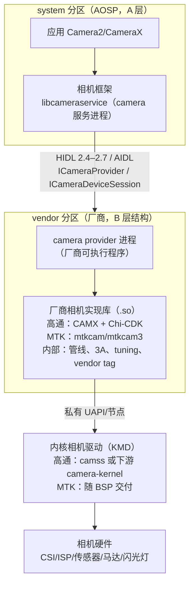
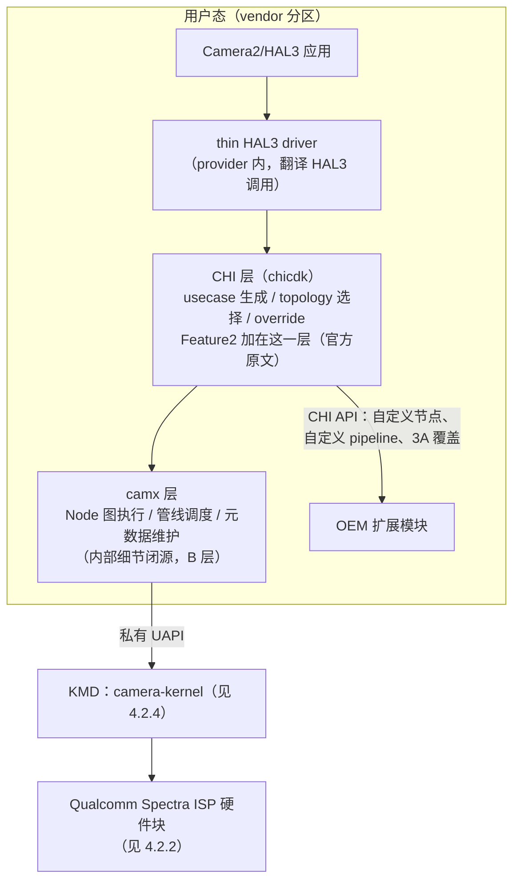
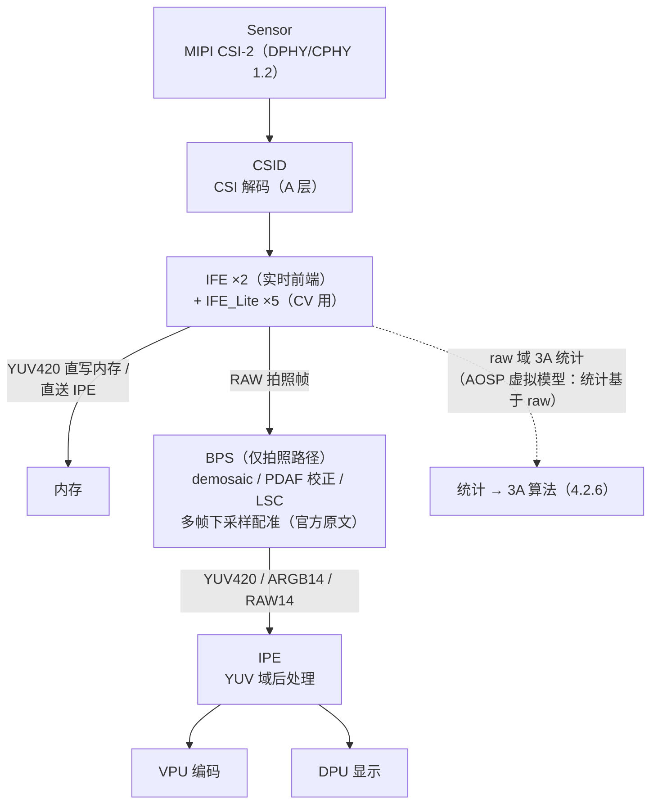
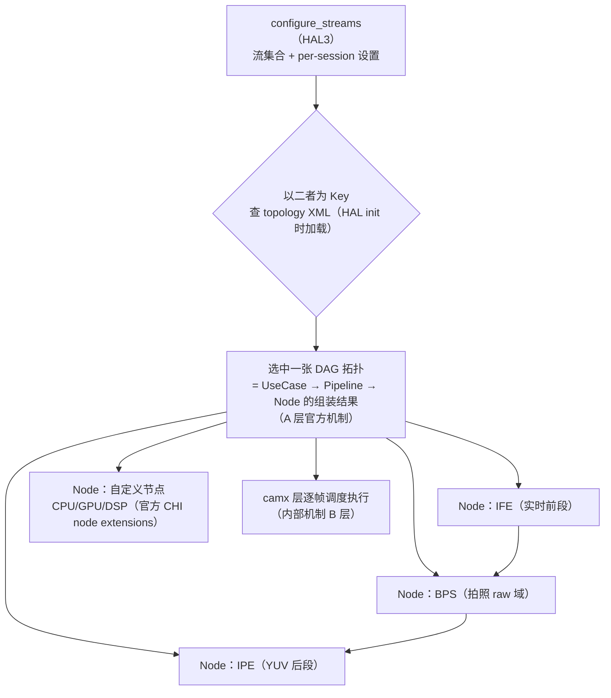
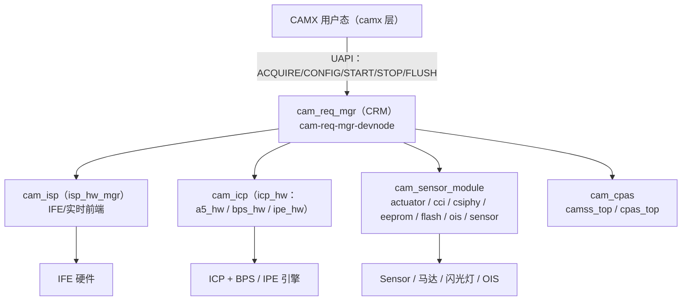
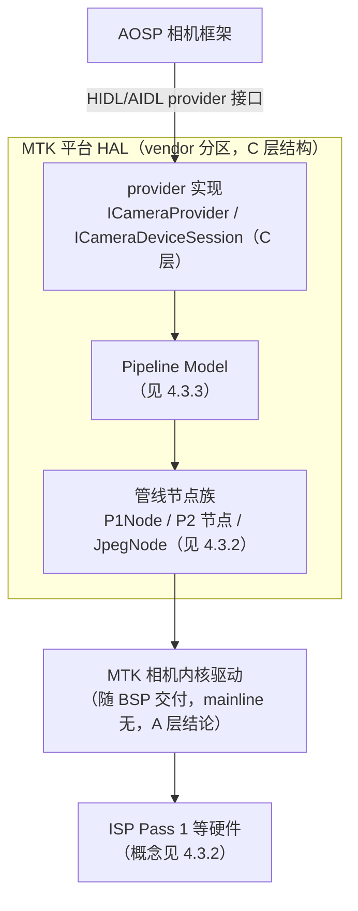
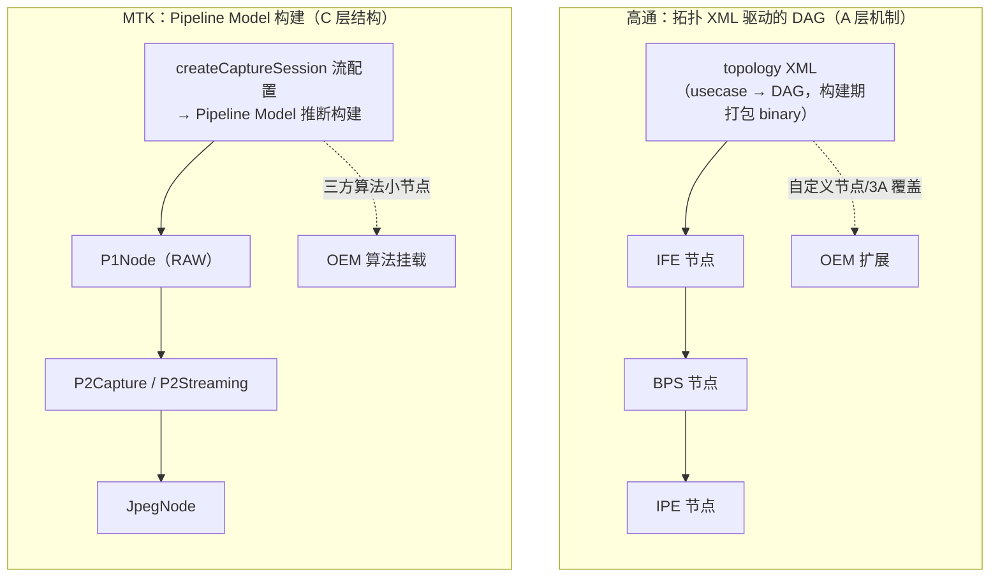

# 第 4 章 平台 HAL：高通 CAMX/Chi-CDK 与 MTK mtkcam

本章面向学习 Android 相机底层 / ISP 的工程师，讲清"AOSP provider 接口之上，高通与 MTK 各自的平台 HAL 如何组织管线、3A、tuning 与扩展"。前三章的 sensor、ISP 管线与 3A 知识在这里落地为真实平台形态：第 1 章 CAMSS 内核驱动、第 2 章统计闭环与 tuning 概念、第 3 章 3A 接口语义，都是本章各层的"通用原理参照物"。

**本章材料可信度声明**（阅读前必读）：平台 HAL 的**用户态实现是闭源/半开源的**（CAMX、mtkcam 均随厂商 BSP 交付，不在 AOSP 主线），因此本章严格分层，且比前三章更克制：

| 层级 | 本章含义 | 本章中的实例 |
|---|---|---|
| A 层 | 可抓取验证的官方资料 | [Qualcomm 官方文档站（RB5 相机文档组）](https://docs.qualcomm.com/doc/80-88500-4/topic/122_Camera.html)、[CodeLinaro 官方托管的相机内核驱动](https://git.codelinaro.org/clo/la/kernel/msm-extra_group/camera-kernel)（cam_req_mgr/cam_isp/cam_icp 等目录与 UAPI 头已逐一核对）、[AOSP camera provider 与 Camera Extensions 官方文档](https://source.android.com/docs/core/camera/camerax-vendor-extensions)、[AOSP 相机调试官方文档](https://source.android.com/docs/core/camera/debugging)、[内核 CAMSS 文档](https://www.kernel.org/doc/html/latest/admin-guide/media/qcom_camss.html)（第 1 章已引）、mainline mediatek 目录清单（第 2 章已核实） |
| B 层 | 公开架构资料 | Qualcomm 官方新闻/博客（Spectra ISP、Cognitive ISP）、厂商发布会材料、行业通行结构描述（无单一 URL 可指） |
| C 层 | 社区研究 | 全部给出 URL；只采用多来源相互印证的模块名/概念，单源孤证一律不用 |

> 本章主动**不写**的内容（宁缺毋滥，读者勿自行脑补）：CAMX/mtkcam 内部具体类名、函数名、文件路径（闭源，仅社区镜像流传，无法核验）；`UsecaseQuadRT` 之类的具体 usecase 名（本文写作时未能在可验证的公开资料中确认，不采用）；mtkcam 的 Pipeline Policy/HwInfo 细节划分与"mtkcam6"目录演进（公开资料无可靠来源，见 4.3.3 的如实说明）；MTK tuning 工具名与参数文件格式（无公开文档）；CAMX 调试属性/开关的具体取值（社区口径混乱，不给出来源就不写）。凡本章给出的模块名，要么出自 A 层源码/文档，要么给出 C 层出处。

---

## 4.1 为什么会有平台 HAL

> 来源：A 层——[AOSP camera/provider README](https://android.googlesource.com/platform/hardware/interfaces/+/refs/heads/main/camera/provider/README.md)、[AOSP camera/README.md](https://android.googlesource.com/platform/hardware/interfaces/+/refs/heads/main/camera/README.md)、[AOSP 相机版本支持文档](https://source.android.com/docs/core/camera/versioning)（以上均为本文写作时抓取）；仓库内文档：Android/Android_Camera_学习文档.md（1.3 节 HAL3 管道模型）；B 层——provider 进程加载厂商 SO 的通行结构、平台 HAL 内容物归类

### 4.1.1 AOSP 留给厂商的空间（A 层边界）

第 1 章 1.5 节已讲明 HAL3 的请求-结果模型：Android 只规定**接口语义**（每个 CaptureRequest 控制什么、每个 CaptureResult 必须回报什么、统计基于 raw 生成等），不规定 ISP 内部结构、3A 算法与 tuning 数据形态（A 层，仓库内文档第 1.3.3 节与第 2 章 2.1.2 节）。AOSP 对"Camera HAL"的官方定义也点明了归属："The camera module layer implemented by SoC vendors"（由 SoC 厂商实现的相机模块层）——AOSP 相机版本支持文档原文（A 层）。这就是平台 HAL 存在的原因：**同一套 HAL3 接口语义之下，ISP 硬件、管线组织、3A 算法、tuning 数据全部是厂商私有资产**，需要一层"平台 HAL"把它们装进 Android 的进程与接口结构里。

### 4.1.2 provider 进程与厂商实现（A 层接口 + B 层结构）

Treble 之后，相机 HAL 运行在独立的 **camera provider 进程**（vendor 分区）里，与系统框架经 HIDL/AIDL binder 通信：AOSP `hardware/interfaces/camera/provider/` 下的接口版本清单为 2.4/2.5/2.6/2.7 + `aidl`（A 层，本文写作时核对目录清单）；provider README 的官方描述是："The camera.provider HAL is used by the Android camera service to discover, query, and open individual camera devices"（相机服务用它来发现、查询并打开各个相机设备），另含手电筒（torch mode）控制（A 层）。

在此接口之上，厂商如何填充是自由的。通行结构（B 层）是：

- provider 进程由厂商自己的可执行程序承载，**进程内加载厂商相机实现库（.so）**——高通平台为 CAMX/Chi-CDK 一族，MTK 平台为 mtkcam 一族；
- 厂商实现库内部完成：HAL3 会话/流管理、管线构建、逐帧请求调度、3A 算法、tuning 数据加载、vendor tag 元数据扩展；
- 库再向下驱动内核（KMD），向上通过标准 ICameraProvider/ICameraDeviceSession 回调框架。



一个重要的现实（B 层）：高通官方对 CAMX 的定位在官方仓库 README 中可直接验证—— Qualcomm Linux 的 camera-service 项目自述为"loads the CamX libraries to interact with the camera hardware module"，并说明其"utilizing HAL3 API to interact with the camera backend (CamX) and camera driver for hardware configuration"（经 HAL3 API 与相机后端 CamX 及相机驱动交互）（A 层，[qualcomm/camera-service](https://github.com/qualcomm/camera-service) README，Qualcomm 官方 GitHub 组织）。即：**HAL3 之下是 CAMX，CAMX 之下是相机内核驱动**——这一句官方自述就是 4.2 节分层图的骨架。

### 4.1.3 平台 HAL 的内容物（B 层归类）

对比第 2、3 章的 rkisp1/libcamera 开源参考实现，平台 HAL 多出的"私货"大致四类（B 层通行归纳，与第 3 章 3.6 节的差距分析一致）：

1. **图/管线管理**：把 HAL3 流配置翻译成内部管线拓扑（CAMX 用 topology XML 描述 DAG，mtkcam 用 Pipeline Model，见 4.2/4.3）；
2. **3A 算法库**：第 3 章讲过商用 3A 的复杂度远超开源参考实现，算法以私有库形态链接进平台 HAL；
3. **tuning 数据体系**：产线标定 + 调优工具产出的参数包（高通 Chromatix，见 4.2.7）；
4. **厂商扩展**：vendor tag 元数据（第 1 章 1.3.4、第 2 章 2.3.5 的机制）+ 多帧计算摄影 feature + Camera Extensions 实现（见 4.2.5）。

---

## 4.2 高通 CAMX/Chi-CDK 架构

> 来源：A 层——Qualcomm 官方文档站 RB5 软件参考手册相机组（[Camera](https://docs.qualcomm.com/doc/80-88500-4/topic/122_Camera.html)、[Qualcomm Spectra 480](https://docs.qualcomm.com/doc/80-88500-4/topic/124_Qualcomm_Spectra_480.html)、[ISP tuning process](https://docs.qualcomm.com/doc/80-88500-4/topic/125_ISP_tuning_process.html)、[CHI](https://docs.qualcomm.com/doc/80-88500-4/topic/126_CHI.html)、[CHI architecture model](https://docs.qualcomm.com/doc/80-88500-4/topic/127_CHI_architecture_model.html)、[Topology graph XML](https://docs.qualcomm.com/doc/80-88500-4/topic/128_Topology_graph_XML.html)、[CamX](https://docs.qualcomm.com/doc/80-88500-4/topic/129_CamX.html)，均本文写作时抓取原文）、[CodeLinaro camera-kernel 源码树](https://git.codelinaro.org/clo/la/kernel/msm-extra_group/camera-kernel)、[内核 CAMSS 文档](https://www.kernel.org/doc/html/latest/admin-guide/media/qcom_camss.html)；C 层——[RidgeRun RB5 捕获子系统 wiki](https://developer.ridgerun.com/wiki/index.php/Qualcomm_Robotics_RB5/Capture_Subsystem/Hardware_Capture_Components)（数据通路描述，与官方文档相互印证）；B 层——用户态内部机制（Node 调度、Metadata 管理细节）为公开架构资料通行描述

### 4.2.1 官方文档里的分层：camx + chicdk（A 层）

Qualcomm 官方文档（RB5 平台软件参考手册）对组件分层的原话极少而关键（A 层）：

- "The **CamX** component contains the **camx** and **chicdk** layers. Feature2 is added in the chicdk layer."（CamX 组件包含 camx 与 chicdk 两层，Feature2 加在 chicdk 层）——[CamX](https://docs.qualcomm.com/doc/80-88500-4/topic/129_CamX.html)；
- "The camera HAL interface (**CHI**) API aims to separate the Camera2/HAL3 interface for using a camera and supplement it with a fully flexible image processing driver... a **thin HAL3 driver** converts HAL3 calls into the appropriate CHI calls. The HAL3 driver works on generating a **camera use case** that is implemented via the CHI API calls."（CHI API 旨在把"使用相机的 Camera2/HAL3 接口"与"完全灵活的图像处理驱动"分离；一个薄的 HAL3 驱动把 HAL3 调用翻译为相应的 CHI 调用，并生成经 CHI API 实现的相机用例）——[CHI](https://docs.qualcomm.com/doc/80-88500-4/topic/126_CHI.html)；
- 相机子系统组件清单（[Camera](https://docs.qualcomm.com/doc/80-88500-4/topic/122_Camera.html)）：QMMF（多媒体框架服务）、Camera adaptation layers、**Camera HAL3**、**CamX**、Codec2、VPU、"Feature-rich ISP drivers"。

据此可画出官方口径下的分层（图按官方文字归纳转绘，A 层；"Node/Topology/Usecase"术语本身来自官方 128 号文档，见 4.2.3）：



注意两点（B 层说明，避免过度解读）：其一，官方文档把 CHI 表述为"camera HAL interface (CHI) API"（A 层引文），社区资料常展开为 Camera Hardware Interface（C 层，如 [知乎 camx HAL 架构笔记](https://zhuanlan.zhihu.com/p/258453407)）；其二，camx 层内部的请求调度、缓冲管理、元数据（metadata）维护细节**没有官方公开文档**，社区文章普遍以"Node 图 + Metadata 管理"描述其结构（B 层通行描述），本文不引任何内部类名。

### 4.2.2 硬件块与 Spectra 480 管线（A 层）

Qualcomm 的 ISP 硬件在官方文档中称为 **Qualcomm Spectra ISP**。RB5 平台（QRB5165，Snapdragon 865 同代）的 Spectra 480 官方架构构成（A 层，[Qualcomm Spectra 480](https://docs.qualcomm.com/doc/80-88500-4/topic/124_Qualcomm_Spectra_480.html) 原文清单）：

- **CSID**（Camera Serial Interface Decoder）：CSI 解码；
- **IFE（Image Front End）×2**：实时图像前端，官方规格"2x full IFE processing – 25 MP (4:3)"；
- **IFE_Lite ×5**：面向机器视觉的小型前端（"Mono/YUV interface for miscellaneous CV use cases"）；
- **BPS（Bayer Processing Segment）**：官方明确其定位是 **"Snapshot path only"（仅拍照路径）**，职责为"Bayer processing, for example, demosaic, PDAF pixel correction (including 2x1/2x2 OCL), lens shading correction, and so on"+"Downscaling for registration and alignment of sequential frames for multi-frame processing"（Bayer 域处理——去马赛克、PDAF 像素校正、镜头阴影校正；以及为多帧处理做逐帧下采样配准），并注明 "No HNR in BPS"；
- **IPE（Image Processing Engine）**：图像处理引擎（YUV 域后处理）；
- **VPU**（编解码）、**DPU**（显示）；
- 其他画质特性（官方规格表）：PDPC（PD 像素校正，R/B/G）、PDLib（2PD/sparse PD）、机器学习人脸检测硬件、MCTF（运动补偿时域滤波）、自适应镜头阴影校正、binning 校正、视频超分、quadCFA binning 等。

第三方 RidgeRun wiki 对同一子系统的数据通路描述与官方一致（C 层，[RidgeRun RB5 wiki](https://developer.ridgerun.com/wiki/index.php/Qualcomm_Robotics_RB5/Capture_Subsystem/Hardware_Capture_Components)）：sensor → CSID（在 IFE 内）→ IFE 输出三路——RAW 给 Hexagon DSP 的 HVX 流、RAW 直写内存、YUV420 直写内存/送 IPE；**RAW 拍照帧送 BPS → BPS 输出 YUV/ARGB/RAW 给 IPE → IPE 输出给 VPU（编码）与 DPU（显示）**。



对应关系（与第 2 章通用 ISP stage 对照，B 层归纳）：IFE 承担 raw 域实时处理与统计分接；BPS 承担拍照路径的 Bayer 域重处理（第 2 章 2.2 节的 demosaic/LSC 等 stage 落点）；IPE 承担 YUV 域后处理（降噪/锐化/色彩调整等 stage 落点）。块名在不同代平台沿用（社区资料中 IFE/BPS/IPE 是 CAMX 节点名的常见来源，B 层）。

### 4.2.3 UseCase → Pipeline → Node：topology XML（A 层）

CAMX 最核心的公开设计是**用 XML 描述的 DAG 拓扑**。官方 [Topology graph XML](https://docs.qualcomm.com/doc/80-88500-4/topic/128_Topology_graph_XML.html) 的完整表述（A 层，摘译/原文）：

- "The hardware and software image processing nodes are required to produce desired output, and the connections between those nodes determine how data flows through the camera subsystem. This set of nodes and connections is called a **topology**."（硬件与软件图像处理节点及其连接关系称为拓扑）；
- "A **use case** is defined by a set of targets to be processed, and a set of per-session settings... Each use case is represented by a topology... The list of all the use cases and their corresponding topologies are encoded in an **XML file**. A use case is selected during **configure_streams** based on two sections in the XML and an XSD schema... Tools are provided to package the XML files as an **offline binary** for consumption by the CHI driver."（每个 use case 由一张拓扑表示；全部 use case 及拓扑编入 XML 文件，configure_streams 时按 XML 的两个 section 选择；另有工具把 XML 打包为离线二进制供 CHI 驱动消费）；
- 官方同时给出参考文档编号：*Qualcomm Spectra ISP Camera CHI API Reference*（80-PC212-1）与 *CHI Customization Guide*（80-PN984-4）（A 层，编号为官方引用，正文未公开）。

[CHI architecture model](https://docs.qualcomm.com/doc/80-88500-4/topic/127_CHI_architecture_model.html) 补充（A 层原文要点）：CHI topology XML 是"单个 XML，集合了不同相机用例的拓扑"，在 **HAL 进程初始化时加载**；本质是"Key + Data 存储"——**数据是 DAG（拓扑），键是 per-session 设置 + 流集合**；Qualcomm 为常见用例提供默认拓扑，厂商"可编辑默认 XML 并创建包含自定义拓扑的 topology XML"，CHI API 提供显式选择自定义拓扑的接口。



**CHI 的五大可定制组件**（A 层，[CHI](https://docs.qualcomm.com/doc/80-88500-4/topic/126_CHI.html) 原文归纳）——这就是 OEM 在 CAMX 里插入自有算法的公开机制：

1. **CHI override module**：补充 Google HAL3 接口，允许"显式的图像处理管线生成、显式引擎选择、多帧控制"（供任何 HAL3 应用使用）；
2. **CHI pipeline**：可构造任意计算管线，成员可以是高通提供的"fixed function ISP (FF-ISP) blocks"，也可以是"extended nodes"；Camera2/HAL3 实现下由 XML helper 文件描述图；
3. **CHI node extensions**：为 CPU、GPU（OpenCL/OpenGL ES）、DSP 编写的自定义节点提供挂钩；"Custom nodes can specify the private vendor tags"（自定义节点可指定私有 vendor tag）；
4. **CHI stats overrides including 3A**："allow mechanisms to override any of the default stats algorithms without the need for driver changes. External stats algorithms can store private data, which is also accessible by custom nodes."（**无需改驱动即可覆盖任何默认统计算法**；外部统计算法可存私有数据供自定义节点访问）；
5. **CHI sensor XML**：让设备厂商为相机模组、image sensor、actuator（马达）、EEPROM、flash 等部件定义"参数驱动的驱动"。

### 4.2.4 内核侧：mainline camss 与下游 camera-kernel（A 层）

高通相机内核驱动有**两套形态**，第 1 章 1.4.4 已讲过第一套：

- **mainline CAMSS**（drivers/media/platform/qcom/camss，V4L2/Media Controller 标准 UAPI）：只覆盖 MSM8916/MSM8996 等旧平台，块为 CSIPHY/CSID/ISPIF/VFE，mainline 文档**不含 ICP**（A 层，[qcom_camss.html](https://www.kernel.org/doc/html/latest/admin-guide/media/qcom_camss.html) 与源码目录，第 1 章核对）——这是内核社区维护的**教学/上游样本**，不是手机平台实际使用的驱动；
- **下游 camera-kernel**（随高通 LA/BSP 交付，Qualcomm 官方 CodeLinaro 站可见）：本文写作时核对 [clo/la/kernel/msm-extra_group/camera-kernel](https://git.codelinaro.org/clo/la/kernel/msm-extra_group/camera-kernel) 源码树（A 层，目录与 UAPI 头逐一核对），结构为：

| KMD 模块（drivers/ 下目录名，A 层） | 内容（按目录清单归纳） |
|---|---|
| `cam_req_mgr` | **CRM（Camera Request Manager）**：请求跨设备调度核心；含 cam_mem_mgr（内存管理）、cam_req_mgr_dev（设备节点）等 |
| `cam_isp` | ISP 硬件管理（isp_hw_mgr、cam_ife_hw_mgr），对应实时前端 |
| `cam_icp` | **ICP 协处理器**子目录 icp_hw 下含 **a5_hw、bps_hw、ipe_hw**（A 层目录名）——即 BPS/IPE 引擎经 ICP 管理 |
| `cam_cpas` | 相机子系统资源/性能管理（camss_top、cpas_top 子目录） |
| `cam_sensor_module` | 传感器外设族：cam_actuator（马达）、cam_cci（I2C 控制接口）、cam_csiphy、cam_eeprom、cam_flash、cam_ois、cam_sensor 等 |
| `cam_cdm`、`cam_sync`、`cam_lrme`、`cam_fd`、`cam_jpeg`、`cam_cust` | CDM（命令/数据搬运）、sync（跨进程缓冲同步）、LRME、人脸检测、JPEG 等 |
| `include/uapi/media/` | UAPI 头：cam_req_mgr.h、cam_defs.h、cam_isp.h（含 ife/tfe/vfe 变体）、cam_icp.h、cam_ope.h、cam_cpas.h、cam_sensor.h、cam_sync.h 等（A 层清单） |

UAPI 的形态也验证了"CAMX 用户态 ↔ KMD"的契约（A 层，cam_defs.h/cam_req_mgr.h 原文）：设备类型枚举覆盖 `CAM_VNODE/SENSOR/IFE/ICP/LRME/JPEG/FD/CPAS/CSIPHY/ACTUATOR/CCI/FLASH/EEPROM/OIS/CUSTOM`；操作码为 `CAM_QUERY_CAP / CAM_ACQUIRE_DEV / CAM_START_DEV / CAM_STOP_DEV / CAM_CONFIG_DEV / CAM_RELEASE_DEV / CAM_FLUSH_REQ`（以及 v2 的 `CAM_ACQUIRE_HW/CAM_RELEASE_HW`）；CRM 设备节点名为 `cam-req-mgr-devnode`。**可见 KMD 的抽象不是"一个 video 节点出图"，而是"一个请求管理器 + 多个硬件域设备"**——HAL3 的逐帧请求语义在 KMD 由 CRM 统一编排（模块分工为 A 层目录/头文件事实；"CRM 编排请求"的机制描述为 B 层通行归纳）。



### 4.2.5 扩展机制：CHI 扩展与 Camera Extensions（A 层）

OEM 自有 feature 对外暴露有两条公开通道，层级不同：

1. **CHI 层内部扩展**（4.2.3 的五大组件）：自定义 topology XML、自定义节点（CPU/GPU/DSP）、3A 覆盖——影响的是 HAL 内部管线（A 层机制 + B 层实现）；
2. **Camera Extensions 接口**（AOSP 官方定义）：让第三方应用用到厂商私有算法。AOSP 官方文档（[Camera extensions](https://source.android.com/docs/core/camera/camerax-vendor-extensions)，A 层）明确：设备厂商通过 **OEM vendor library** 实现 `extensions-interface`，向 Camera2 Extensions API 与 CameraX Extensions API 暴露 bokeh（虚化）、night（夜景）、HDR、face retouch（美颜）、auto 等扩展；厂商需实现 `ExtensionVersionImpl`/`InitializerImpl` 及各扩展的 Extender 类（Basic Extender 或 Advanced Extender 两种类型）；官方特别注明"the OEM vendor library runs as part of a third-party app process"（OEM 库运行在第三方应用进程内，不得要求系统权限）。

两条通道的关系（B 层归纳）：CHI 内部扩展负责"在 CAMX 管线里实现算法"，Camera Extensions 负责"把算法能力以标准接口卖给应用"——同一夜景算法往往两头都要写。这正是第 3 章 3.6 节"AI 3A/多帧计算摄影封装在 HAL 内"的接口落点。

### 4.2.6 3A 在 CAMX 中的位置（A 层接口 + B 层实现）

把第 3 章的 3A 闭环放进 CAMX 地图（分层标注）：

- **统计采集**：实时前端 IFE 在 raw 域产生 3A 统计（AOSP 虚拟模型"统计基于 raw 生成"的落地，第 2 章 2.3 节；IFE 为实时前端为 A 层官方文档）。统计经 CAMX 内部通路送到算法（内部通路 B 层）；
- **算法运行位置**：**用户态 CAMX/CHI 内**。官方证据是 CHI stats override 机制本身——"override any of the default stats algorithms without the need for driver changes"（A 层，126 号文档引文，见 4.2.3）：默认 3A 统计算法存在、且可被外部算法整体替换，外部算法还能存私有数据——这只有算法跑在用户态、与硬件驱动解耦时才可能（A 层文档 + B 层推论）；
- **算法本体**：私有算法库闭源（B 层）。Qualcomm 官方对 3A/画质能力的公开表述见其新闻与博客：如 Snapdragon 8 Gen 2 起"Cognitive ISP"宣传为"first ever AI-powered camera processor"，支持实时语义分割（人像/头发/衣服/背景分区优化）（B 层，厂商公开材料：[Snapdragon 8 Gen 2 发布新闻稿](https://www.qualcomm.com/news/releases/2022/11/snapdragon-8-gen-2-defines-a-new-standard-for-premium-smartphone)、[OnQ 博客 Meet the Snapdragon 8 Gen 2 Super Cameras](https://www.qualcomm.com/news/onq/2023/07/meet-the-snapdragon-8-gen-2-super-cameras)；本文写作时 qualcomm.com 产品页原 URL 已 404，内容以新闻稿/博客为准）；
- **参数下发**：算法输出经 CAMX 节点配置写入硬件，sensor 曝光/增益经 KMD 传感器模块下发（机制同第 3 章 3.1 图的闭环，落点换成本章各层，B 层归纳）。

### 4.2.7 Tuning：Chromatix（A 层流程 + B 层数据形态）

Qualcomm 的 ISP 调优体系官方名称是 **Chromatix**。官方 [ISP tuning process](https://docs.qualcomm.com/doc/80-88500-4/topic/125_ISP_tuning_process.html) 描述的流程（A 层，原文归纳）：

- "The camera tuning is done using an image signal processor (ISP) and an **on-device image tuning tool**"——调优用 **Qualcomm Chromatix Camera Calibration Tool**（官方名称）在设备上迭代进行；
- 流程：前提条件（建项目、把设置装入设备、抓图）→ 初始调优（多轮迭代，随时用**仿真功能**看某组参数对 raw 图的影响，逐模块定位问题）→ 图像质量评估（客观量化测量）→ "generate **binary files** that contain tuned parameters and load the settings on the device"（**生成包含调优参数的二进制文件**装载到设备）。

即高通 tuning 的交付物是 Chromatix 工程产出的**二进制参数包**（具体文件格式、模块参数明细未公开，B 层）。这印证了第 2 章 2.6 节的 tuning 概念：参数按模块组织、随模组标定、在 HAL 内加载；libcamera 的 YAML tuning 文件正是这条工程链的"开源极简版"。

---

## 4.3 MTK mtkcam 架构

> 来源：C 层——社区研究为主（多来源相互印证后才采用）：[知乎 MTK Cam3 架构学习](https://zhuanlan.zhihu.com/p/258924699)、[GitHub wjky2014/AndroidStudy：Mtk-Camera MtkCam3 架构学习](https://github.com/wjky2014/AndroidStudy/blob/master/Mtk-Camera-MtkCam3%25E6%259E%25B6%25E6%259E%2584%25E5%25AD%25A6%25E4%25B9%25A0.md)、[CSDN：Mtk Camera MtkCam3 架构学习](https://blog.csdn.net/TaylorPotter/article/details/105707181)、[CSDN：MTK camera 打开流程](https://blog.csdn.net/frank_zyp/article/details/104433977)（PipelineModel 三份独立资料口径一致）；P1 概念另有官方补丁佐证（C 层转引：[LWN：media: platform: mtk-isp: Add Mediatek ISP Pass 1 driver](https://lwn.net/Articles/795631/)，MediaTek 主线 RFC 补丁系列报道，第 2 章 2.4.4 已引）；A 层——mainline mediatek 目录无 ISP 驱动的结论（第 2 章 2.4.4，可复现）；C 层——内核模块公开镜像 [MiCode/mtkcam-kernel_device_modules](https://github.com/MiCode/mtkcam-kernel_device_modules)（小米官方 GitHub 组织镜像，目录清单本文核对）

### 4.3.1 分层与源码位置（C 层）

MTK 平台 HAL 通称 **mtkcam**。多份独立社区资料口径一致（C 层，引文见节首）：HAL3 时代的实现位于 vendor 树 `vendor/mediatek/proprietary/hardware/mtkcam3/`（旧实现为 `.../mtkcam/`），在其中实现 AOSP 的 ICameraProvider/ICameraDevice/ICameraDeviceSession 接口族——即 4.1 节"B 层通行结构"的 MTK 实例。公开资料对更细的目录/类名各家摘录不一，本文不复述（宁缺毋滥）。



### 4.3.2 P1/P2：Pass 1 硬件与管线节点（C 层 + 官方补丁佐证）

"**P1（Pass 1）**"指 MTK 的 ISP 前端处理硬件——这一命名有超出社区的依据：MediaTek 向主线提交的 ISP 驱动 RFC 补丁系列标题即"Add Mediatek **ISP Pass 1** driver"（2019–2020 年 linux-media 邮件列表评审，C 层转引 [LWN 报道](https://lwn.net/Articles/795631/)；该 staging 驱动未转正，第 2 章 2.4.4 已核实 mainline 至今无 MTK 相机 ISP 驱动，A 层目录清单可复现）。社区资料对软件侧节点族的描述相互印证（C 层，三份独立资料口径一致）：

- **P1Node**：包住 ISP Pass 1 硬件的节点，负责从 sensor 接收并输出 **RAW 帧**（raw 域前段，对应第 2 章 2.2 节 raw domain 各 stage 的硬件承担者）；
- **P2 系列节点**：Pass 2 后处理概念，社区资料普遍列出 **P2CaptureNode**（拍照路径处理）与 **P2StreamingNode**（预览/录像流处理），及 **JpegNode**（主图 + 缩略图编码 JPEG）；
- 三方算法以"小节点"挂载在管线节点内（C 层，知乎/社区笔记口径）。

上述节点分工与高通 IFE/BPS/IPE 的角色划分同构（实时 raw 前段 / 拍照后处理 / 编码输出），差异在组织方式（见 4.4）。

### 4.3.3 Pipeline Model（C 层，多源印证）

mtkcam3 公开资料中被引用最多、且多份独立资料口径一致的构件是 **Pipeline Model**（C 层）：

- **open/close 阶段**：负责 sensor 的上电/下电（power on/off）；
- **config 阶段**：根据应用 `createCaptureSession` 传入的 surface 列表**推断输出配置、据此构建 pipeline**；
- 定位概括："向上暴露用于 Pipeline 创建和操作的 API，向下构建 Pipeline 并管理其生命周期"（C 层，[CSDN frank_zyp](https://blog.csdn.net/frank_zyp/article/details/104433977)）。

**如实说明**：社区资料中还常见"Pipeline Policy""HwInfo（硬件信息查询）"等更细的构件划分，以及"mtkcam6"这样的目录演进说法——这些**没有**能与 mtkcam 官方文档或多个独立来源相互印证的可靠公开出处（本文写作时检索未获），按要求**不展开、不给细节**。读者在真实源码中自会见到相应结构，届时以源码为准。

### 4.3.4 与 AOSP 的对接、内核与 tuning（C 层 + A 层结论）

- **对接**：mtkcam3 以标准 provider 接口接入 AOSP（4.3.1），扩展能力同样经 Camera Extensions OEM 库暴露（A 层机制同 4.2.5，MTK 侧实现细节无公开文档）；vendor tag 承载 MTK 私有元数据（机制同第 1 章 1.3.4，A 层机制 + C 层实例）；
- **内核**：mainline 无 MTK 相机 ISP 驱动（A 层结论，第 2 章 2.4.4）。真实的 MTK 相机 KMD 随 BSP 交付；小米在其官方 GitHub 组织公开的内核模块镜像 [MiCode/mtkcam-kernel_device_modules](https://github.com/MiCode/mtkcam-kernel_device_modules)（C 层镜像，目录清单本文核对）可见 `camsys`、`imgsys`、`imgsensor`、`cam_cal`、`mtk-aie`（AI 引擎）、`mtk-dpe`、`mtk-hcp`、`mtk-ipesys-me` 等模块目录——可与 4.3.2 的 P1 概念互为印证（模块与硬件块的对应关系无官方文档，不展开）；
- **tuning**：MTK 同样存在模组级标定与调优工程（第 2 章 2.6 节通用流程），但其工具名、参数文件格式**无公开可靠来源，本文不写**（B 层仅确认"私有 tuning 体系存在"这一通行事实）。

---

## 4.4 两平台对比

> 来源：B/C 层——公开架构资料与社区研究的通行对比归纳；每格标注层级，A 层可验证事实单独注明

| 维度 | 高通 CAMX/Chi-CDK | MTK mtkcam |
|---|---|---|
| 架构思想 | **拓扑（DAG）驱动**：usecase → topology XML 描述的 Node 图，configure_streams 时按 Key 选择拓扑（A 层官方机制，4.2.3） | **管线模型驱动**：Pipeline Model 按 app 流配置推断并构建 pipeline，节点族（P1/P2/Jpeg）串接（C 层，4.3.3/4.3.2） |
| 图描述载体 | topology XML（可编辑、可自定义，构建期可打包为离线 binary）（A 层官方） | 代码内构建 pipeline（公开资料未显示有等价 XML 描述层；不确定的不写）（C 层口径） |
| 硬件块命名 | IFE/IFE_Lite/BPS/IPE/CSID + KMD 域 SENSOR/ICP/CPAS 等（A 层，4.2.2/4.2.4） | P1（ISP Pass 1）硬件 + P2 后处理概念；内核模块 camsys/imgsys 等（C 层 + A 层镜像目录名） |
| 扩展机制 | CHI 五大可定制组件：override module、自定义 pipeline、自定义节点（CPU/GPU/DSP）、3A 覆盖、sensor XML（A 层官方，4.2.3） | 三方算法以节点形式挂载（C 层）；对外统一走 Camera Extensions OEM 库（A 层机制） |
| 对第三方应用的扩展接口 | Camera Extensions OEM vendor library（A 层 AOSP 机制） | 同左（A 层机制） |
| 3A 位置 | 用户态 CAMX/CHI；统计在 IFE（raw 域）；官方支持外部算法整体覆盖默认统计算法（A 层接口 + B 层实现闭源） | 用户态 mtkcam 内；节点挂载三方算法（C 层）；细节无公开文档 |
| Tuning 交付物 | Chromatix 调优工具 → 二进制参数包装载设备（A 层官方流程，4.2.7） | 私有 tuning 体系（存在为通行事实，B 层；工具与格式不写） |
| 内核驱动 | mainline camss（旧平台、V4L2 标准接口，教学样本）+ 下游 camera-kernel（CRM/ISP/ICP/CPAS 私有 UAPI）（A 层，4.2.4） | mainline 无 ISP 驱动（A 层结论）；KMD 随 BSP，公开镜像 MiCode/mtkcam-kernel_device_modules（C 层镜像） |
| 官方公开文档量 | 较多：docs.qualcomm.com 相机组 + 官方 GitHub（camera-service 等） | 极少：仅主线补丁系列（未合入）与零散社区资料 |

一张图总结两种"图"的差别（B/C 层归纳，节点名取自上文已标注来源）：



学习提示（B 层归纳）：两家的差异是**配置面**的差异大于**能力面**的差异——能把"usecase/流配置 → 硬件管线"这段映射放在 XML（数据驱动）还是代码（逻辑驱动），决定了 OEM 调整产品形态的成本结构；而 3A、tuning、多帧计算摄影这些核心资产在两家都是闭源黑盒。

---

## 4.5 如何学习平台 HAL

> 来源：A 层——[AOSP 相机调试官方文档](https://source.android.com/docs/core/camera/debugging)、[Camera extensions 官方文档](https://source.android.com/docs/core/camera/camerax-vendor-extensions)；C 层——logtag 与社区资源出处见文内 URL；B 层——公司环境工程习惯为通行做法

### 4.5.1 在有设备的公司环境拿到代码、找到入口（B 层 + C 层路径）

- **代码位置**：平台 HAL 不在 AOSP 树里，随厂商 BSP/SDK 交付，通常在 vendor 树：高通为 `vendor/qcom/proprietary/` 下的 `camx`、`chi-cdk` 等目录（C 层，社区镜像广泛存在此结构，如 [知乎 camx 笔记](https://zhuanlan.zhihu.com/p/258453407) 引用的 chi-cdk topology/usecase XML 路径），MTK 为 `vendor/mediatek/proprietary/hardware/mtkcam3/`（C 层，4.3.1 出处）。公司环境里向系统组/BSP 组要 **BSP 源码包或对应的 vendor 分区源码**；
- **从接口往下读**：入口固定是 provider——先读 ICameraProvider 实现（枚举相机、打开设备），再顺 ICameraDeviceSession 的 `configure_streams` / `processCaptureRequest` 往下，找到"流配置 → 内部管线构建"的翻译点（高通即 topology 选择，MTK 即 Pipeline Model 构建处）——具体类名以手中源码为准（B 层方法；各平台命名不同，本文不给未验证类名）；
- **读配置**：高通平台找 topology/usecase XML 与 sensor XML（CHI sensor XML 覆盖 sensor/actuator/EEPROM/flash 参数化驱动，A 层机制见 4.2.3），它们是理解"产品支持哪些 usecase"的地图；MTK 平台对照 Pipeline Model 的构建逻辑；
- **对照硬件文档**：读 SoC 的 ISP 硬件概述（本章 Spectra 480 官方文档即是范本），把块名（IFE/BPS/IPE 或 P1/P2）与第 2 章的 ISP stage、第 3 章的 3A 统计落点对上。

### 4.5.2 日志与调试（A 层官方命令 + C 层 logtag）

AOSP 官方文档给出了不依赖厂商资料的标准调试手段（A 层，[Camera debugging](https://source.android.com/docs/core/camera/debugging)，Android 13+）：

```bash
# 监视指定 tag 的请求/结果元数据（3a 是 android.control.* 中 AE/AF/AWB 的简写）
adb shell cmd media.camera watch start -m 3a -c com.google.android.GoogleCamera
adb shell cmd media.camera watch dump      # 输出缓存与活动客户端的监视记录
adb shell cmd media.camera watch live -n 250   # 实时预览（250ms 刷新）
# dumpsys 相机服务信息（官方文档与 watch 并列提及）
adb shell dumpsys media.camera
```

厂商侧 logtag（C 层，社区通行做法）：高通平台常以 `CAMX`/`CHI` 关键字过滤 logcat（如 [知乎 camx 笔记](https://zhuanlan.zhihu.com/p/258453407)、[CSDN Camera high level Software Architecture](https://blog.csdn.net/weixin_39732855/article/details/139448049) 等社区资料的使用习惯）；MTK 平台社区资料记录的 HAL3 日志 tag 如 `mtkcam-dev3`（C 层，[博客园：MTK 平台 Camera 基本流程与日志](https://www.cnblogs.com/york-zhou/p/18055193)）。各厂商的日志开关/级别属性名社区口径不一，本文不列具体属性，使用时以手中平台资料验证（宁缺毋滥）。

### 4.5.3 公开资源清单（全部为本文写作时核实过可访问或内容可查证的 URL）

**A 层（官方，可抓取验证）**

- Qualcomm 官方文档·RB5 相机组（CHI/topology/tuning/Spectra 480）：[Camera](https://docs.qualcomm.com/doc/80-88500-4/topic/122_Camera.html)、[124 Spectra 480](https://docs.qualcomm.com/doc/80-88500-4/topic/124_Qualcomm_Spectra_480.html)、[125 ISP tuning process](https://docs.qualcomm.com/doc/80-88500-4/topic/125_ISP_tuning_process.html)、[126 CHI](https://docs.qualcomm.com/doc/80-88500-4/topic/126_CHI.html)、[127 CHI architecture model](https://docs.qualcomm.com/doc/80-88500-4/topic/127_CHI_architecture_model.html)、[128 Topology graph XML](https://docs.qualcomm.com/doc/80-88500-4/topic/128_Topology_graph_XML.html)、[129 CamX](https://docs.qualcomm.com/doc/80-88500-4/topic/129_CamX.html)
- Qualcomm 官方 GitHub：[qualcomm/camera-service](https://github.com/qualcomm/camera-service)（CamX 作为 HAL3 后端的官方自述）
- Qualcomm 官方源码托管（CodeLinaro）：[camera-kernel 内核驱动](https://git.codelinaro.org/clo/la/kernel/msm-extra_group/camera-kernel)（cam_* 模块树与 `include/uapi/media/cam_*.h`）；站点内检索关键词 `camera-kernel`、`camera-devicetree`
- 内核文档：[qcom_camss.html](https://www.kernel.org/doc/html/latest/admin-guide/media/qcom_camss.html)（第 1 章 1.4.4 的教学样本）；mainline mediatek 目录（无 ISP 驱动，第 2 章 2.4.4）
- AOSP：[Camera extensions](https://source.android.com/docs/core/camera/camerax-vendor-extensions)、[Camera debugging](https://source.android.com/docs/core/camera/debugging)、[Camera version support](https://source.android.com/docs/core/camera/versioning)、[Camera HAL3](https://source.android.com/docs/core/camera/camera3)、[hardware/interfaces/camera/provider](https://android.googlesource.com/platform/hardware/interfaces/+/refs/heads/main/camera/provider/README.md)

**B 层（厂商公开材料）**

- [Snapdragon 8 Gen 2 发布新闻稿（Cognitive ISP / 语义分割）](https://www.qualcomm.com/news/releases/2022/11/snapdragon-8-gen-2-defines-a-new-standard-for-premium-smartphone)、[OnQ：Meet the Snapdragon 8 Gen 2 Super Cameras](https://www.qualcomm.com/news/onq/2023/07/meet-the-snapdragon-8-gen-2-super-cameras)、[Qualcomm Spectra ISP 摄影综述](https://www.qualcomm.com/snapdragon/news/How-Snapdragon-technology-is-revolutionizing-smartphone-photography-with-the-Qualcomm-Spectra-ISP)

**C 层（社区研究，多源印证）**

- CAMX：[知乎：camx HAL 架构知识点](https://zhuanlan.zhihu.com/p/258453407)、[CSDN：Camera high level Software Architecture description](https://blog.csdn.net/weixin_39732855/article/details/139448049)、[RidgeRun RB5 Capture Subsystem wiki](https://developer.ridgerun.com/wiki/index.php/Qualcomm_Robotics_RB5/Capture_Subsystem/Hardware_Capture_Components)
- mtkcam：[知乎：MTK Cam3 架构学习](https://zhuanlan.zhihu.com/p/258924699)、[GitHub：Mtk-Camera MtkCam3 架构学习笔记](https://github.com/wjky2014/AndroidStudy/blob/master/Mtk-Camera-MtkCam3%25E6%259E%25B6%25E6%259E%2584%25E5%25AD%25A6%25E4%25B9%25A0.md)、[CSDN：Mtk Camera MtkCam3 架构学习](https://blog.csdn.net/TaylorPotter/article/details/105707181)、[CSDN：MTK camera 打开流程（PipelineModel）](https://blog.csdn.net/frank_zyp/article/details/104433977)、[博客园：MTK Camera 流程与日志](https://www.cnblogs.com/york-zhou/p/18055193)、[LWN：mtk-isp Pass 1 主线补丁报道](https://lwn.net/Articles/795631/)
- 源码镜像检索（GitHub 搜索关键词）：`mtkcam`（如 [MiCode/mtkcam-kernel_device_modules](https://github.com/MiCode/mtkcam-kernel_device_modules)——小米官方组织公开的 MTK 相机内核模块镜像）、`vendor/mediatek/proprietary`、`chi-cdk`、`vendor/qcom/proprietary camx`；镜像仅供学习对照，无法保证与商用版本一致（C 层）。

最后回到第 2 章结尾的话：rkisp1/libcamera 教你"机制"，本章教你"地图"——真实平台 HAL 里每一层都有开源世界的一个对照物（topology XML ↔ tuning/配置文件、Node 图 ↔ Algorithm 模块、CRM ↔ request 调度、Chromatix ↔ tuning 文件），拿着对照物进黑盒，才知道该在哪一层找答案。

---

<!-- ch4 done -->
