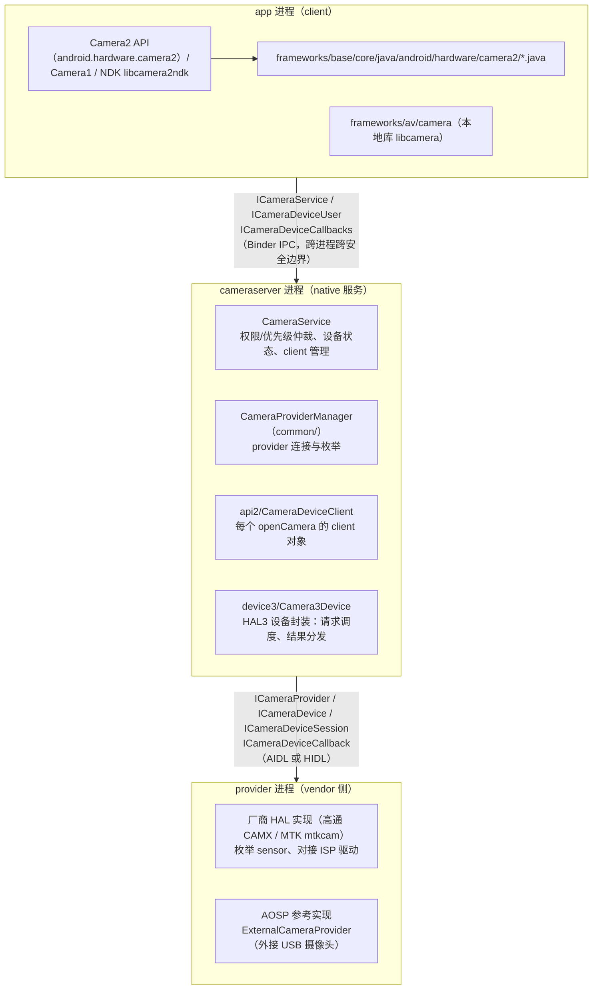
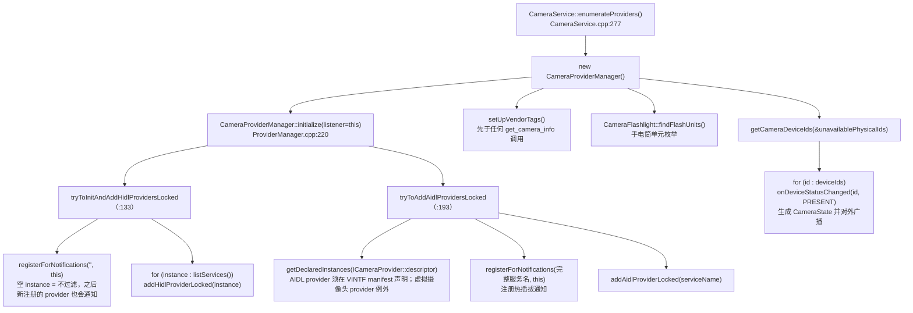
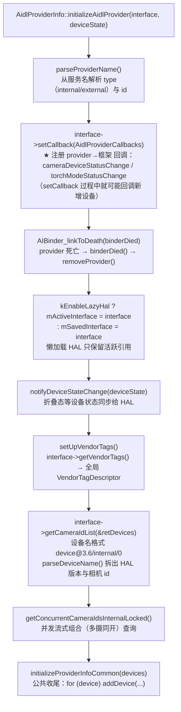

# 第 1 章 进程模型、源码地图与服务启动

> 本章基于 AOSP main 分支（2026-09 时点）真实源码整理，所有函数名、行为均出自所列源文件。与旧资料的一个显著差异是：main 分支上 libcameraservice 完成了"HIDL/AIDL 双栈适配"重构，文件布局与 Android 11~13 时代差别较大，文中会明确标注。流程图均为 Mermaid 语法。

## 1.1 三个进程模型

Android 相机系统的运行时由三个关键进程组成，每层之间用 Binder 通信，形成"客户端 → 服务 → HAL"的两段 IPC 链：



- **app 进程**只持有两个远端代理：`ICameraService`（服务入口）和 `ICameraDeviceUser`（每台已打开相机的会话句柄）；同时暴露一个回调 `ICameraDeviceCallbacks` 供 cameraserver 回调结果。
- **cameraserver 进程**是权力中心：所有权限检查（`CAMERA` 权限、appops）、client 优先级仲裁（前后台）、设备状态广播都发生在这里。它向下通过 `CameraProviderManager` 与一个或多个 provider 进程通信。
- **provider 进程**运行厂商 HAL，负责把 sensor/ISP 驱动包装成 `ICameraProvider/ICameraDevice/ICameraDeviceSession` 接口。它与 cameraserver 之间同样有反向回调 `ICameraDeviceCallback`（帧结果、shutter、错误）。

> 进程边界即安全边界：应用永远无法直接触碰 HAL，cameraserver 挡在中间做沙箱隔离与资源仲裁。

## 1.2 源码地图

| 目录 | 职责 | 代表文件 |
|---|---|---|
| `frameworks/base/core/java/android/hardware/camera2` | Java 框架层：Camera2 API 的实现本体 | `CameraManager.java`（内含 `CameraManagerGlobal` 单例）、`CameraDeviceImpl.java`、`CameraCaptureSessionImpl.java` |
| `frameworks/av/camera` | 相机本地库 `libcamera`：Binder 代理、元数据封送、Camera1 实现 | `aidl/android/hardware/ICameraService.aidl`、`CameraMetadata.cpp`、`Camera.cpp`（API1） |
| `frameworks/av/camera/ndk` | NDK libcamera2ndk 实现 | `NdkCameraManager.cpp` 等 |
| `frameworks/av/services/camera/libcameraservice` | cameraserver 服务本体（见下） | `CameraService.cpp/h` |
| └ `common/` | 跨 API 层复用的公共组件 | `CameraProviderManager.cpp/h`、`common/aidl/AidlProviderInfo.*`、`common/hidl/HidlProviderInfo.*`、`Camera2ClientBase.*`、`CameraDeviceBase.*` |
| └ `aidl/`、`hidl/` | **main 分支新增**：框架↔HAL 的 AIDL/HIDL 双栈适配器 | `aidl/AidlCameraDeviceUser.cpp`、`hidl/HidlCameraDeviceUser.cpp` |
| └ `api1/`、`api2/` | Camera1 / Camera2 两种 client 实现 | `api2/CameraDeviceClient.cpp`、`api1/Camera2Client.cpp` |
| └ `device3/` | HAL3 设备的框架侧封装 | `Camera3Device.cpp/h`、`device3/aidl/`、`device3/hidl/`、`device3/deprecated/` |
| `hardware/interfaces/camera` | HAL 接口定义（AIDL + HIDL 兼容层） | `provider/aidl/android/hardware/camera/provider/ICameraProvider.aidl`、`device/aidl/...` |
| `system/media/camera` | 元数据定义与 C API | `include/system/camera_metadata*.h`、`docs/metadata_definitions.xml` |

**main 分支重构要点**（阅读旧资料时需注意）：

1. `CameraProviderManager` 从 libcameraservice 根目录移到了 `common/` 子目录；HIDL/AIDL 两套 `ProviderInfo` 拆分为 `common/hidl/HidlProviderInfo.*` 与 `common/aidl/AidlProviderInfo.*`。
2. HAL 的 AIDL/HIDL 差异被封装进独立的适配器类（`aidl/`、`hidl/` 子目录，以及 `device3/aidl`、`device3/hidl`、`device3/deprecated`），`Camera3Device` 本体不再直接感知传输层。
3. `hardware/interfaces/camera/provider/default/` 现在**只剩外接 USB 摄像头 provider**（`ExternalCameraProvider` + `external-service.cpp`）；内置摄像头的 provider 默认实现已下沉到各设备/厂商树（模拟器、Pixel 均有各自实现）。
4. 新增 `FwkOnlyMetadataTags.h`：框架私有的元数据 tag 集中在此。

## 1.3 cameraserver 进程启动

来源：[main_cameraserver.cpp](https://android.googlesource.com/platform/frameworks/av/+/refs/heads/main/camera/cameraserver/main_cameraserver.cpp)、[CameraService.cpp](https://android.googlesource.com/platform/frameworks/av/+/refs/heads/main/services/camera/libcameraservice/CameraService.cpp)

`main_cameraserver.cpp` 全文不到 50 行，流程一目了然：

```cpp
int main(int argc, char** argv) {
    signal(SIGPIPE, SIG_IGN);
    hardware::configureRpcThreadpool(5, /*willjoin*/ false);   // HIDL binder 线程池：5 线程
    ABinderProcess_setThreadPoolMaxThreadCount(5);             // AIDL binder 线程池：5 线程

    sp<ProcessState> proc(ProcessState::self());               // 初始化 binder 进程状态
    sp<IServiceManager> sm = defaultServiceManager();
    CameraService::instantiate();                              // 核心：注册 "media.camera" 服务
    ProcessState::self()->startThreadPool();                   // 启动 HIDL binder 线程池
    ABinderProcess_startThreadPool();                          // 启动 AIDL binder 线程池

    IPCThreadState::self()->joinThreadPool();                  // 主线程加入 HIDL 线程池
    ABinderProcess_joinThreadPool();                           // 主线程加入 AIDL 线程池
}
```

要点：

- **双栈线程池**：cameraserver 同时服务 HIDL 与 AIDL 两种 binder 调用（HIDL 面向旧 vendor HAL 与 VNDK 客户端，AIDL 面向框架与新一代 HAL），各配 5 个线程。
- `CameraService::instantiate()`（CameraService.cpp:211）只是调用 `CameraService::publish(true)`——`BinderService` 模板把 `new CameraService()` 并以 **`"media.camera"`** 为名 `addService` 到 servicemanager；`publish(true)` 允许隔离 AID（isolated 进程）的 binder 调用。
- `instantiate()` 触发首次强引用 → **`CameraService::onFirstRef()`**（CameraService.cpp:224）执行真正的初始化，见下一节。

`onFirstRef()` 的关键步骤（CameraService.cpp:224-275）：

```mermaid
flowchart TD
    A["CameraService::onFirstRef()"] --> B["BnCameraService::onFirstRef()"]
    A --> C["BatteryNotifier::noteResetCamera/Flashlight<br/>服务重启时重置电量统计"]
    A --> D["enumerateProviders()<br/>★ 初始化 provider 管理器并枚举设备（见 1.4）"]
    A --> E["mUidPolicy->registerSelf()<br/>注册 UidObserver：跟踪前后台 → client 优先级"]
    A --> F["mSensorPrivacyPolicy->registerSelf()<br/>摄像头物理隐私开关监听"]
    A --> G["mInjectionStatusListener = new InjectionStatusListener(this)"]
    A --> H["checkService(appops)<br/>失败则 registerForNotifications 等待"]
    A --> I["HidlCameraService::registerAsService()<br/>VNDK HIDL 接口 2.2（已废弃，失败仅告警）"]
    A --> J["AidlCameraService::registerService()<br/>VNDK AIDL 接口（vendor 客户端用）"]
    A --> K["pingCameraServiceProxy()<br/>源码注释：刻意放最后，尽量贴近 addService 时刻"]
```



## 1.4 provider 注册与设备枚举链路（本章重点）

来源：[CameraService.cpp](https://android.googlesource.com/platform/frameworks/av/+/refs/heads/main/services/camera/libcameraservice/CameraService.cpp)、[CameraProviderManager.cpp](https://android.googlesource.com/platform/frameworks/av/+/refs/heads/main/services/camera/libcameraservice/common/CameraProviderManager.cpp)、[AidlProviderInfo.cpp](https://android.googlesource.com/platform/frameworks/av/+/refs/heads/main/services/camera/libcameraservice/common/aidl/AidlProviderInfo.cpp)、[external-service.cpp](https://android.googlesource.com/platform/hardware/interfaces/+/refs/heads/main/camera/provider/default/external-service.cpp)

### 1.4.1 provider 侧：服务如何注册

以 AOSP 自带的外接摄像头 provider 为例（`external-service.cpp`，内置摄像头 provider 的注册方式完全相同）：

```cpp
int main() {
    ABinderProcess_setThreadPoolMaxThreadCount(6);
    std::shared_ptr<ExternalCameraProvider> defaultProvider =
            ndk::SharedRefBase::make<ExternalCameraProvider>();
    const std::string serviceName =
            std::string(ExternalCameraProvider::descriptor) + "/external/0";
    // 普通服务 or lazy 服务（LAZY_SERVICE 宏控制，lazy HAL 空闲时可被杀、用时拉起）
    AServiceManager_addService(defaultProvider->asBinder().get(), serviceName.c_str());
    ABinderProcess_joinThreadPool();
}
```

服务名格式为 **`接口描述符/实例名`**，例如：
- `android.hardware.camera.provider.ICameraProvider/external/0`（外接）
- `android.hardware.camera.provider.ICameraProvider/internal/0`（内置，由各设备树实现）
- HIDL 时代则是 `android.hardware.camera.provider@2.6/legacy/0` 等旧格式，框架同时兼容。

### 1.4.2 框架侧：发现与连接 provider

`onFirstRef()` → `enumerateProviders()`（CameraService.cpp:277）触发整条链：



`addAidlProviderLocked`（ProviderManager.cpp:2471）的处理值得细读：

- 为防 provider 升级期间新旧实例短暂并存，每个实例名追加 `"-<序号>"` 后缀（`mProviderInstanceId` 计数）；
- 同名 provider 已存在时：懒加载 HAL（external lazy HAL）或已知 binder 直接返回 `ALREADY_EXISTS`，否则等待旧实例移除后再初始化新实例；
- 真正的连接在 `tryToInitializeAidlProviderLocked`（:2409）：**`tryGetService`（非阻塞）** 而非 `waitForService`——懒加载 provider 不在此处唤醒；拿到 `ICameraProvider` binder 后调用 `AidlProviderInfo::initializeAidlProvider(interface, mDeviceState)`，并（在 watchdog flag 打开时）记录 provider 进程 pid 供 CameraServiceWatchdog 监控。

### 1.4.3 与单个 provider 的握手：枚举相机设备

`AidlProviderInfo::initializeAidlProvider`（AidlProviderInfo.cpp:109）是与一个 provider 完整握手的全过程：



`addDevice`（ProviderManager.cpp:2637）为每个设备名创建对应的 `DeviceInfo3`（AIDL 栈为 `AidlDeviceInfo3`），通过 `getCameraDeviceInterface` 取到 `ICameraDevice` 句柄并拉取 `CameraCharacteristics`，最终挂入 `provider->mDevices`。`getCameraDeviceIds()`（ProviderManager.cpp:274）遍历所有 provider 的 `mUniqueCameraIds` 汇总成全局设备表——这就是 `onDeviceStatusChanged(id, PRESENT)` 的数据来源。

### 1.4.4 热插拔与 provider 死亡

- **新 provider 出现**（如插入 USB 摄像头、lazy HAL 首次启动）：servicemanager 的通知回调 `onRegistration` → `addAidlProviderLocked/addHidlProviderLocked` → 初始化成功后回调 `CameraService::onNewProviderRegistered()`（CameraService.cpp:369）→ **重新执行 `enumerateProviders()`**，把增量设备以 `PRESENT` 状态广播给所有 listener。
- **provider 进程死亡**：`AIBinder_linkToDeath` 注册的 `binderDied()`（AidlProviderInfo.cpp:203）→ `removeProvider()` → 该 provider 名下所有设备状态变为 `NOT_PRESENT`，正在使用它们的 client 收到断连错误（详见第 4 章）。
- **provider 回调新增/移除设备**：`setCallback` 注册的 `AidlProviderCallbacks` 在收到 `cameraDeviceStatusChange` 时直接触发 `addDevice`（ProviderManager.cpp:2919）或状态变更，无需重新枚举。

## 1.5 ICameraService.aidl：app 进程看到的服务接口

来源：[ICameraService.aidl](https://android.googlesource.com/platform/frameworks/av/+/refs/heads/main/camera/aidl/android/hardware/ICameraService.aidl)

这是 `CameraManager`（Java）与 `libcamera2ndk`（NDK）在 app 进程中持有的服务代理。main 分支全部方法如下：

| 方法 | 作用 | 典型调用方 |
|---|---|---|
| `getNumberOfCameras(type, attribution, devicePolicy)` | API1 相机数量（type: CAMERA_TYPE_ALL/FIRST/BACKWARD…） | Camera1 API |
| `getCameraInfo(cameraId, rotationOverride, attribution)` | API1 相机朝向等信息 | Camera1 API |
| `connect(ICameraClient, …)` | **API1** 打开相机，返回 `ICamera` | Camera1 |
| `connectDevice(ICameraDeviceCallbacks, cameraId, …)` | **API2/NDK** 打开相机，返回 `ICameraDeviceUser` | Camera2 / NDK |
| `addListener(ICameraServiceListener)` | 注册状态监听，**返回值即当前全部设备状态快照** | CameraManager / NDK |
| `removeListener(listener)` | 注销监听 | 同上 |
| `getCameraCharacteristics(cameraId, targetSdkVersion, rotationOverride, attribution)` | 静态元数据（能力查询） | CameraManager.getCameraCharacteristics |
| `getCameraVendorTagDescriptor()` / `getCameraVendorTagCache()` | vendor tag 描述符 | 框架元数据层 |
| `supportsCameraApi(cameraId, apiVersion)` | 该 id 是否支持 CAMERA2/API |
| `isHiddenPhysicalCamera(cameraId)` | 是否为隐藏物理摄像头 | 多摄支持 |
| `getConcurrentCameraIds()` | 可并发流式打开的相机组合 | 多摄同开 |
| `isConcurrentSessionConfigurationSupported(…)` | 并发会话配置检查 | 同上 |
| `setTorchMode(cameraId, enabled, clientBinder, attributions)` | 手电筒（无需 openCamera） | CameraManager.setTorchMode |
| `turnOnTorchWithStrengthLevel(...)` / `getTorchStrengthLevel(...)` | 手电筒亮度调节 | Android 13+ |
| `injectCamera(packageName, internalCamId, externalCamId, client, callback)` / `injectSessionParams(...)` | 相机注入（测试/虚拟设备） | CTS / 虚拟摄像头 |
| `notifySystemEvent(eventId, args)` | 系统事件广播（oneway） | 框架内部 |
| `notifyDisplayConfigurationChange()` | 屏幕配置变化通知（oneway） | 框架内部 |
| `notifyDeviceStateChange(newState)` | 折叠屏等设备状态变化（oneway） | 框架内部 |
| `createDefaultRequest(cameraId, templateId, …)` | 在服务侧构造某 template 的默认请求 | 隐藏 API（快速路径） |
| `isSessionConfigurationWithParametersSupported(...)` / `getSessionCharacteristics(...)` | 会话参数预检查 | Android 15+ |

**一个容易误解的点**：`ICameraService.aidl` 中**没有 `getCameraIdList` 方法**。API2 应用调用 `CameraManager.getCameraIdList()` 时，数据并不来自一次 binder 查询，而是来自 `CameraManagerGlobal` 在 `registerListener()` 时调用 `addListener()` 拿到的**状态快照**（`addListenerHelper` 返回 `CameraStatus[]`，CameraService.cpp:3423），再加上此后持续收到的 `onStatusChanged` 回调维护的本地缓存。`getNumberOfCameras`/`getCameraInfo` 则是 API1 专用的独立查询（CameraService.cpp:808）。

---

> 下一章（第 2 章）将从 `openCamera()` 出发，沿 `connectDevice` 深入 cameraserver 的 client 创建与优先级仲裁。
