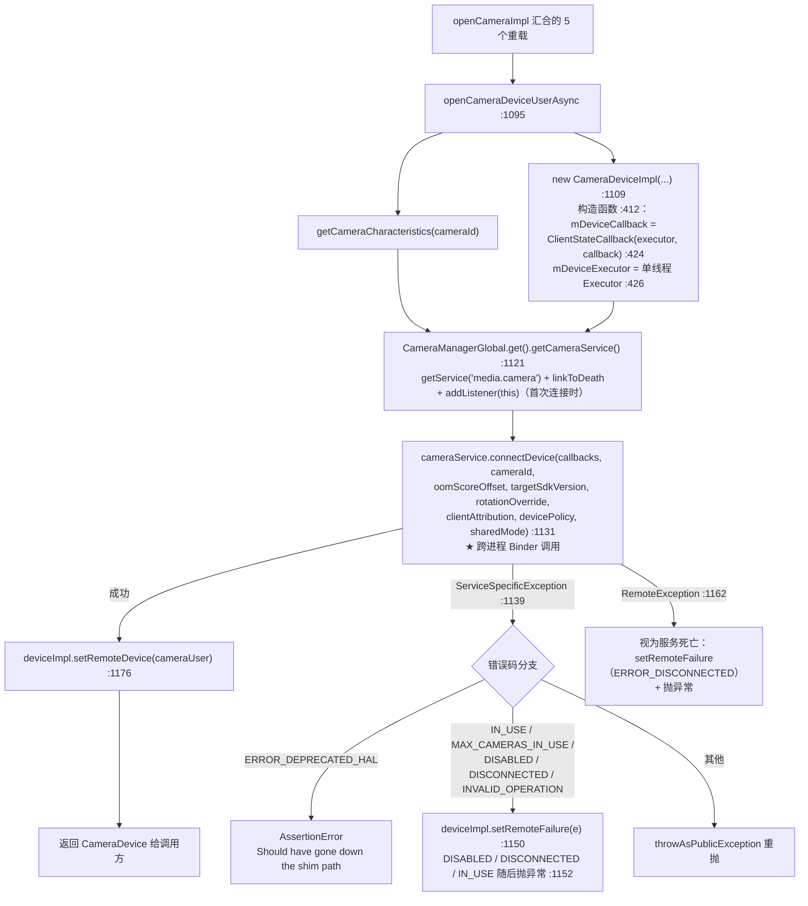
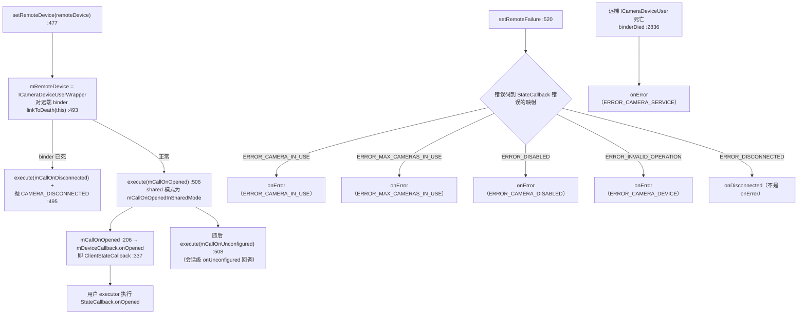
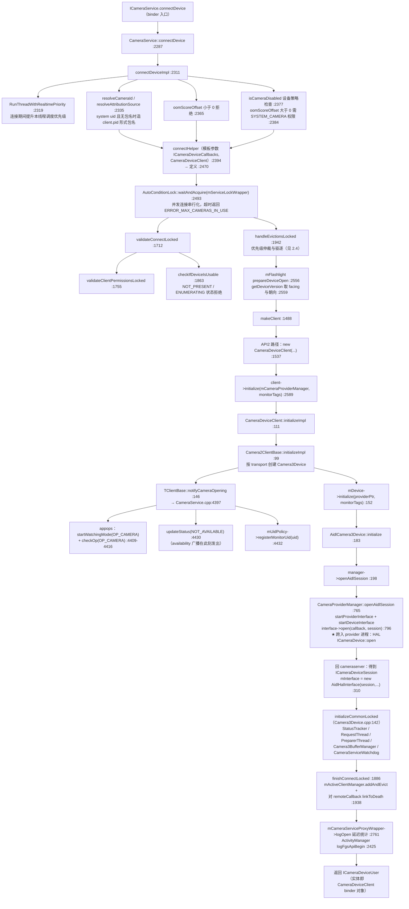
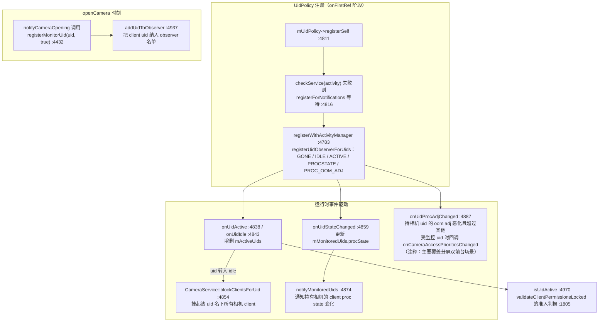
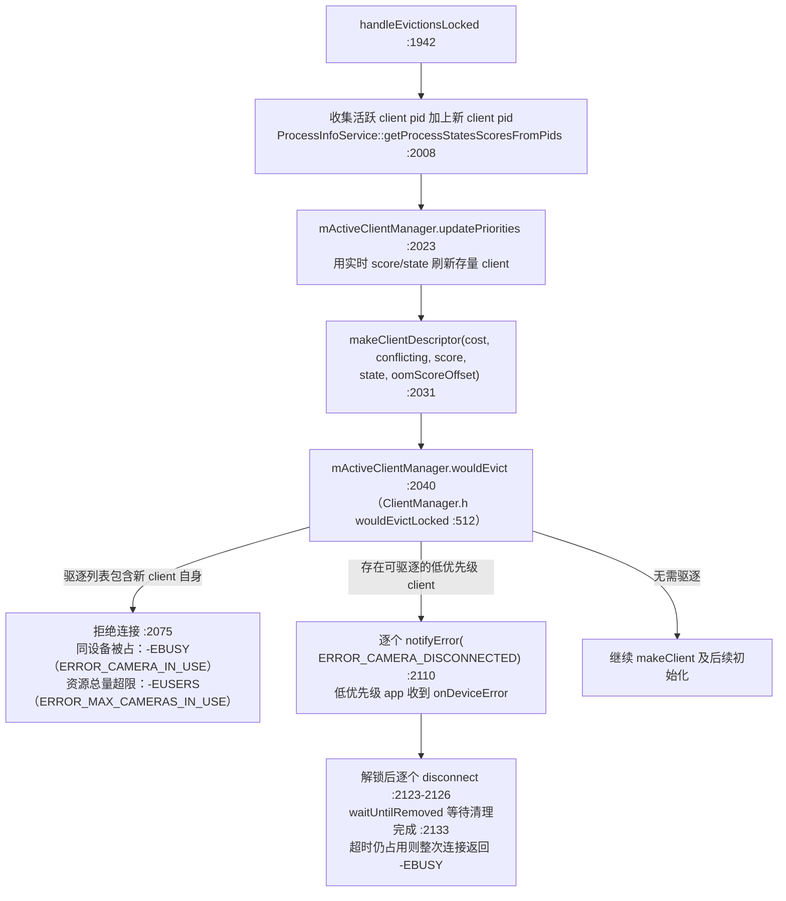
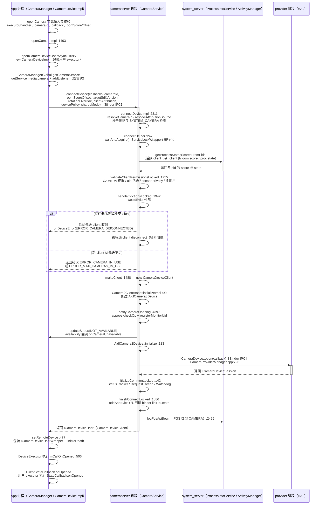

# 第 2 章 openCamera 完整调用链

> 本文为分章源文件，供单章阅读；若与主文档不一致，以主文档最新版为准。

> 本章基于 AOSP main 分支（2026-09 时点）真实源码整理，所有函数名、行号均出自所列源文件。沿一次 `openCamera()` 从 Java 层一路走到 provider 进程的 HAL `ICameraDevice::open`，并完整拆解 cameraserver 的权限校验、优先级仲裁与驱逐逻辑。流程图均为 Mermaid 语法。

## 2.1 Java 层：CameraManager.openCamera 与 openCameraDeviceUserAsync

> 来源：[CameraManager.java](https://android.googlesource.com/platform/frameworks/base/+/refs/heads/main/core/java/android/hardware/camera2/CameraManager.java)、[CameraDeviceImpl.java](https://android.googlesource.com/platform/frameworks/base/+/refs/heads/main/core/java/android/hardware/camera2/impl/CameraDeviceImpl.java)

应用可用的 `openCamera` 是一组重载，全部收敛到 `openCameraImpl`：

| 公开/隐藏入口 | 行号 | 说明 |
|---|---|---|
| `openCamera(String, StateCallback, Handler)` | CameraManager.java:1261 | Handler 版；`checkAndWrapHandler` 把 Handler 包成 Executor |
| `openCamera(String, Executor, StateCallback)` | CameraManager.java:1344 | Executor 版（公开 API 主路径） |
| `openSharedCamera(String, Executor, StateCallback)` | CameraManager.java:1389 | SystemApi，shared 模式打开（多 client 共享） |
| `openCamera(String, int oomScoreOffset, Executor, StateCallback)` | CameraManager.java:1456 | SystemApi，可主动降低自身仲裁优先级 |
| `openCameraImpl(cameraId, callback, executor, oomScoreOffset, rotationOverride, sharedMode)` | CameraManager.java:1493 | 全部重载的汇合点 |

**入参校验**（按代码实际顺序）：

1. Executor 版与 shared 版在入口处检查 `executor == null` 抛 `IllegalArgumentException`（CameraManager.java:1348）；`oomScoreOffset < 0` 直接抛异常（:1462，注释明确"cannot increase priority of camera client"）。
2. Handler 版经 `CameraDeviceImpl.checkAndWrapHandler(handler)`（CameraDeviceImpl.java:2770）→ `checkHandler`（:2782）：handler 为 null 时取当前线程 `Looper.myLooper()`，当前线程没有 Looper 则抛 `IllegalArgumentException`；随后包装成 `CameraHandlerExecutor`。
3. `openCameraImpl`（:1498）检查 `cameraId == null`、`callback == null`；`CameraManagerGlobal.sCameraServiceDisabled` 为 true（系统属性 `config.disable_cameraservice`）则抛 `"No cameras available on device"`（:1503）。

`openCameraDeviceUserAsync`（CameraManager.java:1095）是 Java 层核心，全程持有 `mLock`：



`CameraManagerGlobal` 是进程内单例（`gCameraManager` 静态常量，CameraManager.java:2258；`get()` :2314），内部持有 `mCameraService` 并实现 `ICameraServiceListener.Stub`。`getCameraService()`（:2357）→ `connectCameraServiceLocked()`（:2373）：按服务名 `"media.camera"`（:2264）`getService`、对 binder `linkToDeath`、然后 `addListener(this)` 拿设备状态快照——所以打开相机前服务代理通常已就绪，`openCamera` 只是调用它。

**onOpened / onDisconnected / onError 的触发时机**（全部在 app 进程内、经 `mDeviceExecutor` 单线程串行派发）：



要点：

- **onOpened 的时机在 `connectDevice` 返回之后**：`setRemoteDevice` 把返回的 `ICameraDeviceUser` 包一层 `ICameraDeviceUserWrapper`，注册死亡监听，然后投递 `mCallOnOpened`。所以"打开成功"的回调永远晚于 binder 返回，且与后续所有设备回调共享同一个单线程 executor。
- **onDisconnected** 有两个来源：`setRemoteFailure` 收到 `ERROR_DISCONNECTED`（例如设备被拔出、被更高优先级驱逐后服务拒绝），或 `setRemoteDevice` 中 `linkToDeath` 立刻失败。
- **onError** 映射由 `setRemoteFailure`（:524-544）的 switch 完成；`binderDied`（:2836，远端 cameraserver 侧对象死亡）固定上报 `ERROR_CAMERA_SERVICE`。
- `onError` 与异常并不互斥：`ERROR_DISABLED/DISCONNECTED/CAMERA_IN_USE` 这三种既触发回调又抛 `CameraAccessException`（源码注释："Per API docs, these failures call onError and throw"）。

## 2.2 跨进程：ICameraService.connectDevice 的参数与返回值

> 来源：[ICameraService.aidl](https://android.googlesource.com/platform/frameworks/av/+/refs/heads/main/camera/aidl/android/hardware/ICameraService.aidl)

main 分支的实际签名（ICameraService.aidl:162）：

```aidl
ICameraDeviceUser connectDevice(ICameraDeviceCallbacks callbacks,
        @utf8InCpp String cameraId,
        int oomScoreOffset,
        int targetSdkVersion,
        int rotationOverride,
        in AttributionSourceState clientAttribution,
        int devicePolicy,
        boolean sharedMode);
```

| 参数 | 方向 | 含义 |
|---|---|---|
| `callbacks` | app → service | app 侧 `CameraDeviceImpl` 内的 `CameraDeviceCallbacks` stub，cameraserver 用它回调错误/结果 |
| `cameraId` | app → service | 字符串相机 id（可能为虚拟设备映射前的 id，服务侧会 resolve） |
| `oomScoreOffset` | app → service | 请求服务侧给本 client 的 oom score 偏移，必须 ≥ 0 |
| `targetSdkVersion` | app → service | 应用 targetSdk，服务侧按版本走兼容行为 |
| `rotationOverride` | app → service | `ROTATION_OVERRIDE_NONE/ROTATION_OVERRIDE_OVERRIDE_TO_PORTRAIT/ROTATION_OVERRIDE_ROTATION_ONLY`（:88-90） |
| `clientAttribution` | app → service | `AttributionSourceState`：uid、pid、packageName、attributionTag、deviceId 等（旧版的 packageName+featureId 已被它取代） |
| `devicePolicy` | app → service | 上下文设备策略，决定虚拟相机是否可见 |
| `sharedMode` | app → service | 是否以 shared 模式打开（需 SYSTEM_CAMERA 权限，仅 system-only 相机支持，见 2.3） |

**返回值与错误传播**：成功返回 `ICameraDeviceUser`；失败不通过返回值，而是以 AIDL service-specific error 传出，Java 侧表现为 `ServiceSpecificException`，错误码即 ICameraService.aidl:48-57 的常量：

| 错误码 | 值 | 典型场景 |
|---|---|---|
| `ERROR_PERMISSION_DENIED` | 1 | 无 CAMERA/SYSTEM_CAMERA 权限 |
| `ERROR_ALREADY_EXISTS` | 2 | 资源已存在 |
| `ERROR_ILLEGAL_ARGUMENT` | 3 | cameraId 非法、oomScoreOffset < 0 |
| `ERROR_DISCONNECTED` | 4 | 设备不存在/已断连 |
| `ERROR_TIMED_OUT` | 5 | 连接超时 |
| `ERROR_DISABLED` | 6 | 设备策略禁用、后台 uid、隐私开关 |
| `ERROR_CAMERA_IN_USE` | 7 | 更高优先级 client 占用 |
| `ERROR_MAX_CAMERAS_IN_USE` | 8 | 资源总量超限 |
| `ERROR_DEPRECATED_HAL` | 9 | 旧 HAL（main 分支已直接拒绝） |
| `ERROR_INVALID_OPERATION` | 10 | 其他异常 |

服务侧 native 实现中这些码经 `STATUS_ERROR` 宏变成 `Status::fromServiceSpecificError`。返回的 `ICameraDeviceUser` 实体就是 cameraserver 里的 `CameraDeviceClient` 对象——`CameraDeviceClientBase : public CameraService::BasicClient, public hardware::camera2::BnCameraDeviceUser`（CameraDeviceClient.h:48-51），即框架自动生成的 binder stub。

## 2.3 cameraserver 侧完整链路：connectDevice → HAL ICameraDevice::open

> 来源：[CameraService.cpp](https://android.googlesource.com/platform/frameworks/av/+/refs/heads/main/services/camera/libcameraservice/CameraService.cpp)、[CameraService.h](https://android.googlesource.com/platform/frameworks/av/+/refs/heads/main/services/camera/libcameraservice/CameraService.h)、[CameraDeviceClient.cpp](https://android.googlesource.com/platform/frameworks/av/+/refs/heads/main/services/camera/libcameraservice/api2/CameraDeviceClient.cpp)、[Camera2ClientBase.cpp](https://android.googlesource.com/platform/frameworks/av/+/refs/heads/main/services/camera/libcameraservice/common/Camera2ClientBase.cpp)、[Camera3Device.cpp](https://android.googlesource.com/platform/frameworks/av/+/refs/heads/main/services/camera/libcameraservice/device3/Camera3Device.cpp)、[AidlCamera3Device.cpp](https://android.googlesource.com/platform/frameworks/av/+/refs/heads/main/services/camera/libcameraservice/device3/aidl/AidlCamera3Device.cpp)、[CameraProviderManager.cpp](https://android.googlesource.com/platform/frameworks/av/+/refs/heads/main/services/camera/libcameraservice/common/CameraProviderManager.cpp)

main 分支把入口拆成三层：`connectDevice`（:2287，framework 客户端）与 `connectDeviceVendor`（:2299，VNDK vendor 客户端）都只是给 `connectDeviceImpl`（:2311）传不同的 `isVendorClient`。



分步说明：

1. **validateConnectLocked → validateClientPermissionsLocked**（CameraService.cpp:1712、:1755）。前者先做权限，再查 `mInitialized`、`getCameraState(cameraId)` 是否存在、`checkIfDeviceIsUsable`（:1863：状态为 `NOT_PRESENT` 返回 `-ENODEV`、`ENUMERATING` 返回 `-EBUSY`）。后者按序检查：
   - `shouldRejectSystemCameraConnection` / `getSystemCameraKind`：system-only 相机的准入（:1765-1776）；
   - `flags::camera_multi_client() && sharedMode` 时设备必须是 `SYSTEM_ONLY_CAMERA`（:1778）；
   - **CAMERA 权限**：`hasPermissionsForCamera(cameraId, clientAttributionWithDeviceId)`，非 cameraserver 自身调用（`callingPid != getpid()`）且非 system-only 设备时，无权限返回 `ERROR_PERMISSION_DENIED`（:1794-1802）；
   - **uid 状态检查**：`mUidPolicy->isUidActive(callingUid, clientName)`，不活跃（后台）直接 `ERROR_DISABLED`，日志附带当前 proc state（:1805-1814）；
   - **sensor privacy**：隐私开关打开时拒绝（automotive 例外，:1819-1826）；
   - **多用户**：`mAllowedUsers` 白名单检查（:1835-1843）；headless system user 模式额外要求 `CAMERA_HEADLESS_SYSTEM_USER` 权限（:1845-1858）。
   > 注意：appops 的 `OP_CAMERA` 不在这里查，而在 client 创建后的 `notifyCameraOpening`（:4397）里 `checkOp`，权限被 appops 忽略/报错时连接直接失败。

2. **handleEvictionsLocked**（:1942）：优先级仲裁主战场，详见 2.4。API1 的 MediaRecorder 同 binder 重复 connect 会直接返回既有 client（:1958-1972），API2 没有这条捷径。

3. **makeClient**（:1488）：HIDL 栈先校验设备版本（3.0~3.7 可用，1.0 返回 `ERROR_DEPRECATED_HAL`）；API2 路径 `new CameraDeviceClient(cameraService, tmp, ..., rotationOverride, originalCameraId, sharedMode, isVendorClient)`（:1537），构造函数（CameraDeviceClient.cpp:81）委托 `Camera2ClientBase`（Camera2ClientBase.cpp:55，打印 `Camera %s: Opened. Client: ...`）。

4. **client->initialize**（:2589）内部两层：
   - `Camera2ClientBase::initializeImpl`（Camera2ClientBase.cpp:99）：先 `getCameraIdIPCTransport` 问清该设备走 HIDL 还是 AIDL，据此创建 `HidlCamera3Device` 或 `AidlCamera3Device`（shared 模式为 `AidlCamera3SharedDevice`，:112-133）；然后 `notifyCameraOpening`（:146）、`mDevice->initialize`（:152）、`setNotifyCallback`（:161）。
   - `CameraDeviceClient::initializeImpl`（CameraDeviceClient.cpp:111）：基类成功后启动 `FrameProcessorBase` 线程（:121-123）并注册监听，读取 physical request keys 等静态能力。

5. **AidlCamera3Device::initialize**（AidlCamera3Device.cpp:183）：
   - `manager->openAidlSession(mId, mCallbacks, &session)`（:198），其中 `mCallbacks` 是框架侧 `AidlCameraDeviceCallbacks`（HAL → 框架的反向回调封装，:180）。
   - `CameraProviderManager::openAidlSession`（CameraProviderManager.cpp:765）：`startProviderInterface` → `startDeviceInterface` 拿到 HAL 的 `ICameraDevice`，然后 **`interface->open(callback, session)`（:796）——这就是跨入 provider 进程的那一次 binder 调用**，返回 `ICameraDeviceSession`。HIDL 栈对称：`openHidlSession`（:847）同样调用 `interface->open`。
   - 拿到 session 后：拉取 `getCameraCharacteristics`（:209）、与 HAL 交换请求/结果 FMQ 元数据队列（:264-291）、创建 `AidlHalInterface`（:310），最后 `initializeCommonLocked`（:352 → Camera3Device.cpp:142）。
   - `initializeCommonLocked`：启动 `StatusTracker` 线程（:145）、创建 `Camera3BufferManager`（:159）、启动请求队列线程 `RequestThread`（:194-198，线程名 `C3Dev-<id>-ReqQueue`）、创建 `PreparerThread`（:209）、状态置 `STATUS_UNCONFIGURED`（:211）、启动 `CameraServiceWatchdog`（:260）。

6. **finishConnectLocked**（:1886）：`makeClientDescriptor(client, partial, oomScoreOffset, systemNativeClient)` 构造正式描述符 → `mActiveClientManager.addAndEvict`（:1893，此时驱逐列表应为空，否则视为内部状态错误并 FATAL）→ camera_multi_client 打开时做 primary/secondary 仲裁（:1909-1929）→ 最后对 `remoteCallback`（app 侧回调 binder）`linkToDeath`（:1938），client 进程死亡才能被服务感知。

整个流程中 `mServiceLock` 只在 `connectHelper` 的花括号作用域内持有（:2491-2754），驱逐与 disconnect 刻意放到锁外执行，避免慢速 HAL 清理阻塞其他连接。

## 2.4 client 优先级体系：UidPolicy 前后台监听、优先级分数与驱逐

> 来源：[CameraService.cpp](https://android.googlesource.com/platform/frameworks/av/+/refs/heads/main/services/camera/libcameraservice/CameraService.cpp)（UidPolicy :4783-5080、handleEvictionsLocked :1942）、[CameraService.h](https://android.googlesource.com/platform/frameworks/av/+/refs/heads/main/services/camera/libcameraservice/CameraService.h)（UidPolicy :833-889）、[ClientManager.h](https://android.googlesource.com/platform/frameworks/av/+/refs/heads/main/services/camera/libcameraservice/utils/ClientManager.h)

### 2.4.1 优先级分数

优先级由 `resource_policy::ClientPriority`（ClientManager.h:63）表达：**score（即 oom_adj，数值越小优先级越高）+ state（proc state）+ isVendorClient 标记**。比较规则（:107-113）：先比 score，score 相同比 state。两个要点：

- `setScore`（:81-92）：`INVALID_ADJ` 一律折算为 `UNKNOWN_ADJ`（1001）；app 传入的 `oomScoreOffset` 直接加到 score 上（`mScore = mScoreOffset + score`），这正是"主动降级"的实现。
- system native client（vndk 直连 cameraserver 的进程）固定使用 `kSystemNativeClientScore = PERCEPTIBLE_APP_ADJ`（200）与 `PROCESS_STATE_PERSISTENT_UI`（CameraService.cpp:175-177）。

ClientManager.h:39-61 罗列了与 `frameworks/base/services/core/java/com/android/server/am/ProcessList.java` 对齐的 oom_adj 常量谱系：`FOREGROUND_APP_ADJ = 0`、`VISIBLE_APP_ADJ = 100`、`PERCEPTIBLE_APP_ADJ = 200`、`CACHED_APP_MIN_ADJ = 900`、`NATIVE_ADJ = -1000` 等——分数体系完全就是 AMS 的进程分级。

### 2.4.2 两套状态来源：UidPolicy 与 ProcessInfoService

- **UidPolicy**（前后台准入与监控）：`CameraService::onFirstRef` 时 `mUidPolicy->registerSelf()`（:4811），`checkService("activity")` 不可用则 `registerForNotifications` 等服务就绪，最终 `registerWithActivityManager`（:4783）调用 `registerUidObserverForUids`，订阅 `UID_OBSERVER_GONE | IDLE | ACTIVE | PROCSTATE | PROC_OOM_ADJ` 五类事件。
- **ProcessInfoService**（逐 client 的 oom score）：`handleEvictionsLocked` 每次连接时对所有活跃 client pid + 新 client pid 批量查询 `getProcessStatesScoresFromPids`（:2008），并 `mActiveClientManager.updatePriorities`（:2023，ClientManager.h:688）刷新存量 client 的分数——保证驱逐决策用的是实时值而非连接时的旧值。



`isUidActiveLocked`（:4978）的判定顺序：uid < `FIRST_APPLICATION_UID` 或 observer 未注册 → 视为活跃；`mOverrideUids` 命中 → 用覆盖值；`mActiveUids` 命中 → 活跃；否则进入一段**最长 300ms 的轮询兜底**（50ms 间隔直接问 `am.isUidActive`，:4994-5014）——源码注释自嘲是 hack（b/109950150）：修 uid 转前台与 Activity resume 之间的竞态，保证活跃应用第一次 openCamera 就能成功。

### 2.4.3 驱逐链路（handleEvictionsLocked + ClientManager）



`wouldEvictLocked`（ClientManager.h:512-623）的判定规则，逐条对照源码：

1. **冲突定义**（:556-563）：同 key（同一相机）或互为 conflicting（设备声明的互斥相机集合）；`camera_multi_client` 打开时 shared 模式两端都为 shared 则同 key 不冲突。
2. **同 owner**（:568-581）：同 pid 再次打开同一设备 → 新开替换旧开（MRU wins，旧 client 进驱逐列表）；同 pid 打开另一台冲突设备 → 反向拒绝新 client。
3. **冲突且对方优先级更高**（:582-586，`curPriority < priority` 即对方 score/state 更小）→ 把新 client 自身放进"驱逐列表"表示拒绝。
4. **需要驱逐存量**（:587-598）：与己冲突，或"加入后总 cost 超过 `mMaxCost` 且对方 cost 非零、优先级不高于己、且不是同 owner 最高优先级" → 对方进驱逐列表。
5. **总量兜底**（:615-619）：算完所有驱逐后总 cost 仍超限、且新 client 不是最高优先级 owner → 拒绝自身。
6. `getIncompatibleClients`（:504，`wouldEvictLocked` 的 `returnIncompatibleClients` 分支）专用于拒绝时生成诊断信息：逐个列出"Blocked by existing device ... (score/state)"写入事件日志（CameraService.cpp:2053-2069）。

真正落地的驱逐在 `handleEvictionsLocked`：先对每个待驱逐 client 调 `clientSp->notifyError(ERROR_CAMERA_DISCONNECTED, ...)`（:2110）——这是**被驱逐应用收到 `onDeviceError(0)` / `onDisconnected` 的时刻**——随后释放 `mServiceLock`、`clearCallingIdentity` 后逐个 `disconnect()`（:2123-2126，阻塞直到 HAL 清理完毕），并 `waitUntilRemoved` 确认 client 从 `mActiveClientManager` 摘除（:2133）。

另有两条相邻机制容易混淆，一并澄清：

- **finishConnectLocked 时的 addAndEvict**（:1893）：正常流程中该驱逐已完成，若此处再出现驱逐项说明 disconnect 漏删，直接 `LOG_ALWAYS_FATAL`（:1905）。
- **CameraClientManager::remove**（:5360）：client 正常断开时，若它正巧是 shared 模式的 primary client，会在剩余 client 中挑最高优先级者接班并回调 `notifyClientSharedAccessPriorityChanged`（:5386-5387）。

## 2.5 ICameraDeviceUser.aidl 与 ICameraDeviceCallbacks.aidl 接口方法表

> 来源：[ICameraDeviceUser.aidl](https://android.googlesource.com/platform/frameworks/av/+/refs/heads/main/camera/aidl/android/hardware/camera2/ICameraDeviceUser.aidl)、[ICameraDeviceCallbacks.aidl](https://android.googlesource.com/platform/frameworks/av/+/refs/heads/main/camera/aidl/android/hardware/camera2/ICameraDeviceCallbacks.aidl)

`openCamera` 成功后 app 持有的就是 `ICameraDeviceUser` 的代理（`CameraDeviceImpl.mRemoteDevice`，外面包一层 `ICameraDeviceUserWrapper`）。main 分支全部方法：

| 方法 | 作用 |
|---|---|
| `disconnect()` | 断开相机（对应 `CameraDevice.close()` 的服务侧入口） |
| `submitRequest(request, streaming)` | 提交单条 CaptureRequest，返回 `SubmitInfo`（requestId 与最后一帧号） |
| `submitRequestList(requestList, streaming)` | 批量提交请求 |
| `cancelRequest(requestId)` | 取消 repeating 请求，返回其最后一帧号；无帧产出返回常量 `NO_IN_FLIGHT_REPEATING_FRAMES = -1` |
| `beginConfigure()` | 开始流配置（须先于 create/deleteStream，且设备非 busy） |
| `endConfigure(operatingMode, sessionParams, startTimeMs)` | 结束流配置；返回可用于 offline 模式的 stream id 列表 |
| `isSessionConfigurationSupported(sessionConfiguration)` | 预检某会话配置是否被设备支持 |
| `deleteStream(streamId)` | 删除流 |
| `createStream(outputConfiguration)` | 创建输出流，返回新 stream id |
| `createInputStream(width, height, format, isMultiResolution)` | 创建输入流（reprocessing 用） |
| `getInputSurface()` | 取输入流的 Surface（须在 endConfigure 成功之后） |
| `createDefaultRequest(templateId)` | 生成某 template 的默认请求元数据 |
| `getCameraInfo()` | 取设备元数据 |
| `waitUntilIdle()` | 阻塞等待设备空闲 |
| `flush()` | 冲刷全部在途请求，返回最近帧号 |
| `prepare(streamId)` / `prepare2(maxCount, streamId)` | 预分配流缓冲（prepare2 可限制预分配上限） |
| `tearDown(streamId)` | 释放 prepare 预分配的缓冲 |
| `updateOutputConfiguration(streamId, outputConfiguration)` | 更新输出流配置（如可变分辨率 Surface） |
| `finalizeOutputConfigurations(streamId, outputConfiguration)` | 固化延迟配置的 Surface |
| `getCaptureResultMetadataQueue()` | 取结果元数据 FMQ 描述符（大元数据免 binder 拷贝的快速通道） |
| `setCameraAudioRestriction(mode)` / `getGlobalAudioRestriction()` | 设置/查询本设备音频限制；后者是全局查询 |
| `switchToOffline(callbacks, offlineOutputIds)` | 把指定输出流转入 offline 会话，返回 `ICameraOfflineSession` |
| `isPrimaryClient()` | shared 模式下本 client 是否 primary |

文件内常量：`NORMAL_MODE = 0`、`CONSTRAINED_HIGH_SPEED_MODE = 1`、`SHARED_MODE = 2`、`VENDOR_MODE_START = 0x8000`；`TEMPLATE_PREVIEW/STILL_CAPTURE/RECORD/VIDEO_SNAPSHOT/ZERO_SHUTTER_LAG/MANUAL`（1~6）；`AUDIO_RESTRICTION_NONE/VIBRATION/VIBRATION_SOUND`（0/1/3）。

反向回调 `ICameraDeviceCallbacks`（app 侧 `CameraDeviceImpl.CameraDeviceCallbacks` 实现，全部 oneway）：

| 方法 | 作用 |
|---|---|
| `onDeviceError(errorCode, resultExtras)` | 设备级错误；错误码 `ERROR_CAMERA_DISCONNECTED=0`、`ERROR_CAMERA_DEVICE=1`、`ERROR_CAMERA_SERVICE=2`、`ERROR_CAMERA_REQUEST=3`、`ERROR_CAMERA_RESULT=4`、`ERROR_CAMERA_BUFFER=5`、`ERROR_CAMERA_DISABLED=6`、`ERROR_CAMERA_INVALID_ERROR=-1` |
| `onDeviceIdle()` | 设备回到 idle（无在途请求） |
| `onCaptureStarted(resultExtras, timestamp)` | 一帧开始曝光（shutter 通知） |
| `onResultReceived(resultInfo, resultExtras, physicalCaptureResultInfos)` | 收到一帧结果（含物理相机结果） |
| `onPrepared(streamId)` | prepare 预分配完成 |
| `onRepeatingRequestError(lastFrameNumber, repeatingRequestId)` | repeating 请求出错停止 |
| `onRequestQueueEmpty()` | 请求队列清空 |
| `onClientSharedAccessPriorityChanged(primaryClient)` | shared 模式下 primary/secondary 角色切换通知 |

被驱逐时低优先级 client 收到的正是 `onDeviceError(ERROR_CAMERA_DISCONNECTED)`（CameraService.cpp:2110），Java 层由此进入 `onDisconnected` 流程。

## 2.6 全链路时序图：从 openCamera 到 onOpened

> 来源：同 2.1-2.4 所列文件



阅读这份时序图时的几个关键点：

- **进程边界共三次跨过**：app → cameraserver 的 `connectDevice`；cameraserver → system_server 的 score 查询（以及 UidPolicy 的事件注册，图中省略）；cameraserver → provider 的 `ICameraDevice::open`。
- **onCameraUnavailable 早于 onOpened**：`notifyCameraOpening` 在 HAL open 之前就把该设备状态置为 `NOT_AVAILABLE` 并广播（CameraService.cpp:4430），所以其他进程的 AvailabilityCallback 先动，本进程的 `onOpened` 要等 binder 返回后才触发。
- **失败的形态有两种**：优先级不足时 `connectDevice` 直接返回错误码（Java 层 `setRemoteFailure` → `onError` + 抛异常）；而被驱逐方是被动收到 `onDeviceError(ERROR_CAMERA_DISCONNECTED)`，走 `onDisconnected` 清理。
- `connectDevice` 返回的是 `CameraDeviceClient` 本体（`BnCameraDeviceUser` 子类），app 侧再包一层 `ICameraDeviceUserWrapper` 做 wrapper 化的异常翻译——app 与 cameraserver 之间从此只有这一个会话句柄加一条回调通道（`ICameraDeviceCallbacks`）。

---

> 下一章将从会话建立出发：`createCaptureSession` → `endConfigure` → 流创建与 HAL `configureStreams`。

<!-- ch2 done -->
