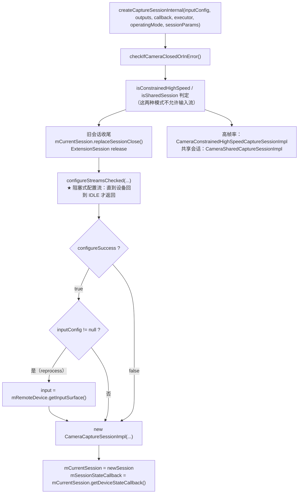
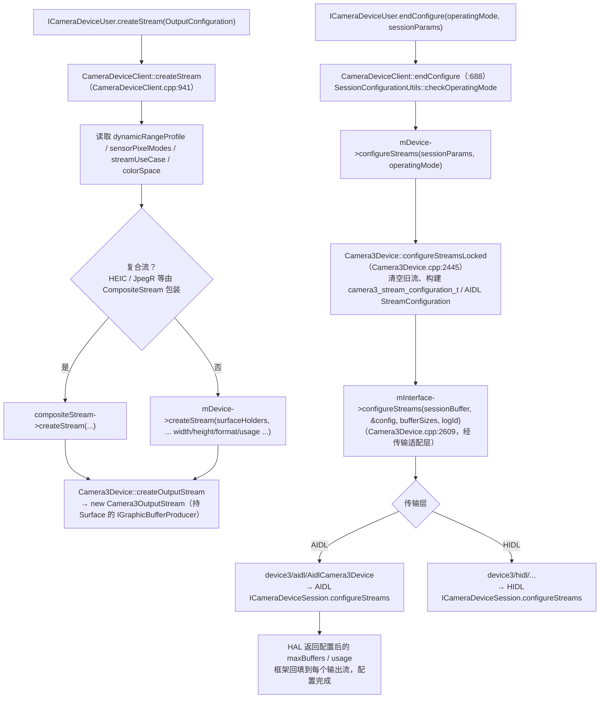
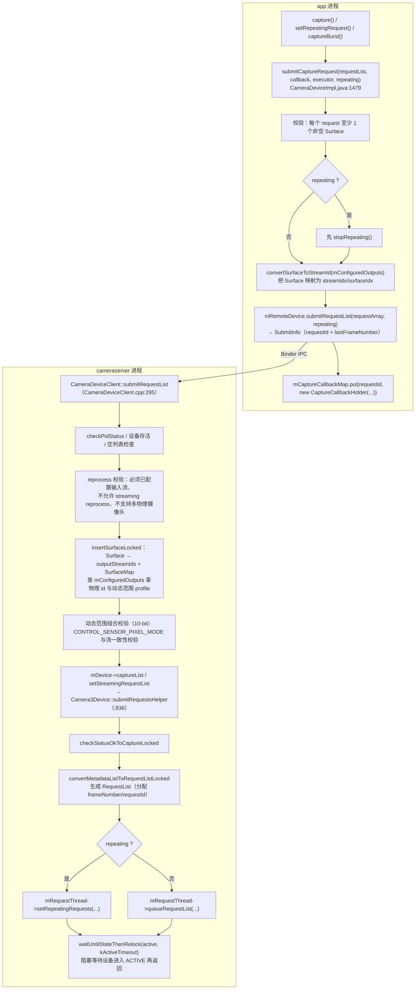
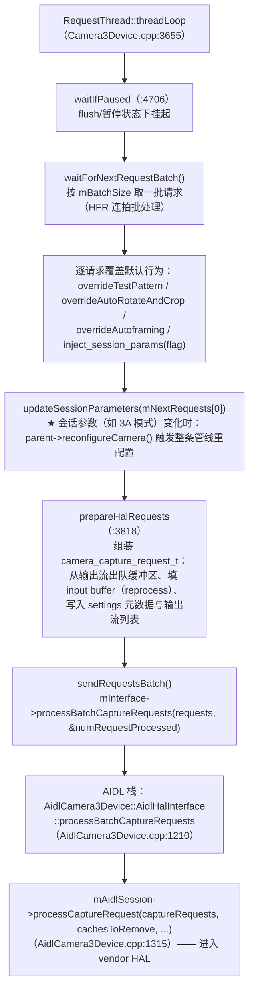
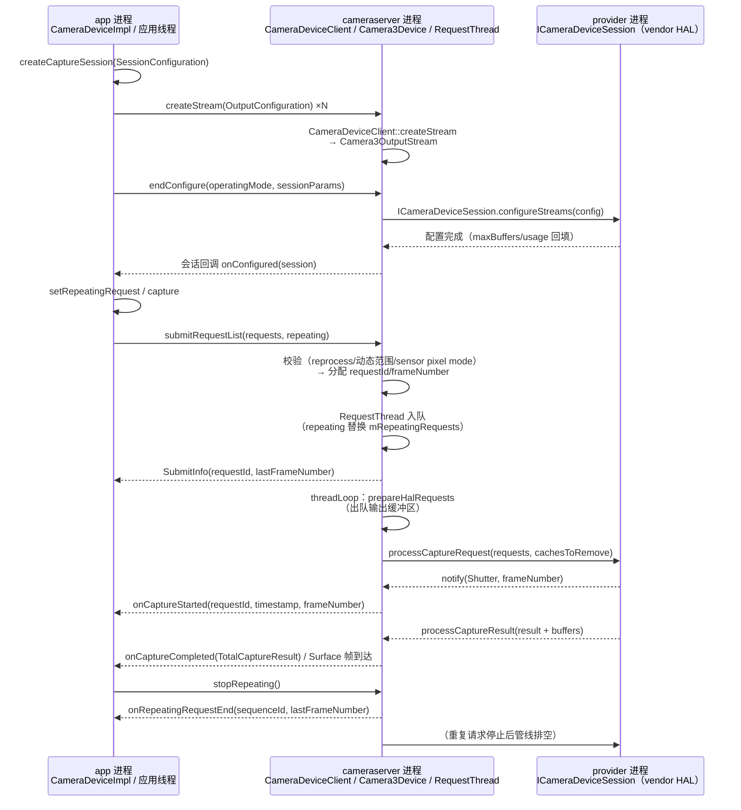

# 第 3 章 createCaptureSession 与请求提交链路

> 本文为分章源文件，供单章阅读；若与主文档不一致，以主文档最新版为准。

> 本章基于 AOSP main 分支真实源码整理，函数名与行为均出自所列源文件，行号为当前 main 分支时点。所有图为 Mermaid 语法。

## 3.1 Java 层：createCaptureSession

来源：[CameraDeviceImpl.java](https://android.googlesource.com/platform/frameworks/base/+/refs/heads/main/core/java/android/hardware/camera2/impl/CameraDeviceImpl.java)

应用层的所有会话创建重载最终都汇入一条私有路径：

- `createCaptureSession(List<Surface>)`（:727）、`createCaptureSessionByOutputConfigurations`（:740）、带输入流的 reprocess 版本（:771、:800）、`SessionConfiguration` 版本（:886）→ 全部调用 **`createCaptureSessionInternal`**（:912）。

`createCaptureSessionInternal` 的关键动作：

`configureStreamsChecked`（:602）内部顺序：先 `stopRepeating()`（:642，配置变更前必须停掉旧重复请求），然后对每个 `OutputConfiguration` 调 `mRemoteDevice.createStream(outConfig)`（:680），最后 `mRemoteDevice.endConfigure(operatingMode, sessionParams, ...)`（:687）阻塞等待配置结果。

会话对象分三种实现：普通 `CameraCaptureSessionImpl`、受限高帧率 `CameraConstrainedHighSpeedCaptureSessionImpl`、共享会话 `CameraSharedCaptureSessionImpl`；`onConfigured/onConfigureFailed` 回调由 `CameraCaptureSessionImpl` 构造函数依据 `configureSuccess` 直接分发（CameraCaptureSessionImpl.java:125-129）。

> 注意：Java 层的会话**不是**跨进程对象——真正配置流发生在 `configureStreamsChecked` 阻塞期间；`CameraCaptureSessionImpl` 只是持有回调与引用计数的本地包装。

## 3.2 cameraserver 侧：流构建与 configureStreams

来源：[CameraDeviceClient.cpp](https://android.googlesource.com/platform/frameworks/av/+/refs/heads/main/services/camera/libcameraservice/api2/CameraDeviceClient.cpp)、[Camera3Device.cpp](https://android.googlesource.com/platform/frameworks/av/+/refs/heads/main/services/camera/libcameraservice/device3/Camera3Device.cpp)

要点：

- `createStream` 阶段（binder 调用逐个进行）只做**流对象构建**；真正的 HAL 重配置集中在 `endConfigure` 一次性触发，这就是官方文档"会话参数只在 configure 时生效"的由来。
- `configureStreamsLocked`（:2445）负责：按 operatingMode（NORMAL/HIGH_SPEED/SHARED…）组装流配置、处理输入流（reprocess）、把框架侧的 `dynamicRangeProfile/streamUseCase` 写入流配置，最后经 `mInterface`（AIDL/HIDL 适配器）下发 HAL。
- main 分支传输适配独立成类：AIDL 栈在 `device3/aidl/AidlCamera3Device`，HIDL 栈在 `device3/hidl/`，旧 API1 栈在 `device3/deprecated/`。

## 3.3 请求提交：从 capture() 到 HAL

来源：[CameraDeviceImpl.java](https://android.googlesource.com/platform/frameworks/base/+/refs/heads/main/core/java/android/hardware/camera2/impl/CameraDeviceImpl.java)、[CameraDeviceClient.cpp](https://android.googlesource.com/platform/frameworks/av/+/refs/heads/main/services/camera/libcameraservice/api2/CameraDeviceClient.cpp)、[Camera3Device.cpp](https://android.googlesource.com/platform/frameworks/av/+/refs/heads/main/services/camera/libcameraservice/device3/Camera3Device.cpp)

## 3.4 RequestThread：单线程请求泵与关键机制

来源：[Camera3Device.cpp](https://android.googlesource.com/platform/frameworks/av/+/refs/heads/main/services/camera/libcameraservice/device3/Camera3Device.cpp)

`Camera3Device` 内部有一个专职的 **RequestThread** 线程，所有请求都经它下发 HAL：

关键机制（均在源码中核实）：

- **线程模型**：应用 `submitRequestList` 只是把请求入队并等待设备切到 ACTIVE；真正与 HAL 的交互全部在 RequestThread 单线程内串行进行，避免多线程竞态。
- **queue 与 repeating 双队列**：单发请求走 `queueRequestList`，重复请求由 `setRepeatingRequests` 替换 `mRepeatingRequests` 列表——每次循环取"最新单发请求优先 + 最新 repeating 请求垫底"（`waitForNextRequestBatch` 的注释明确说明了稳态单 repeating 的优化路径）。
- **会话参数热更新**：`updateSessionParameters` 检测到无法旁路的会话参数变化时，会调用 `parent->reconfigureCamera()` 走完整重配置（这解释了部分参数为何"改了没反应"——它们本质是会话参数）。
- **标识符语义**：`requestId`（Java 回调匹配，`mCaptureCallbackMap` 的 key）、`frameNumber`（该设备单调递增，结果与 shutter 匹配的 key）、`sequenceId`（一个 repeating 序列的标识，repeating 停止时经 `onRepeatingRequestEnd(sequenceId, lastFrameNumber)` 通知 Java 层清理回调表）。
- **异常路径**：`prepareHalRequests` 取输出缓冲区超时只清理该批请求（`cleanUpFailedRequests(sendRequestError=true)`）并 `checkAndStopRepeatingRequest()`，不杀死线程；`cleanUpFailedRequests` 内部会清空 `mRepeatingRequests`（:3258、:3296）。

## 3.5 全链路时序图

---

> 下一章（第 4 章）讲结果的回程：`processCaptureResult`/`notify` 如何穿过 RequestThread 与 Camera3Device 回到应用回调，缓冲区的出队与归还全生命周期，以及错误处理与恢复机制。
