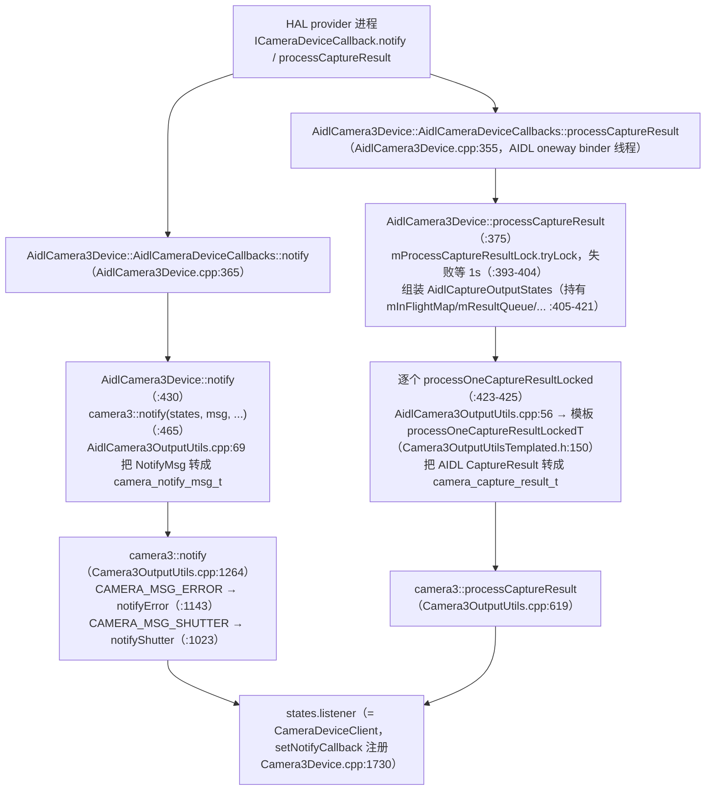
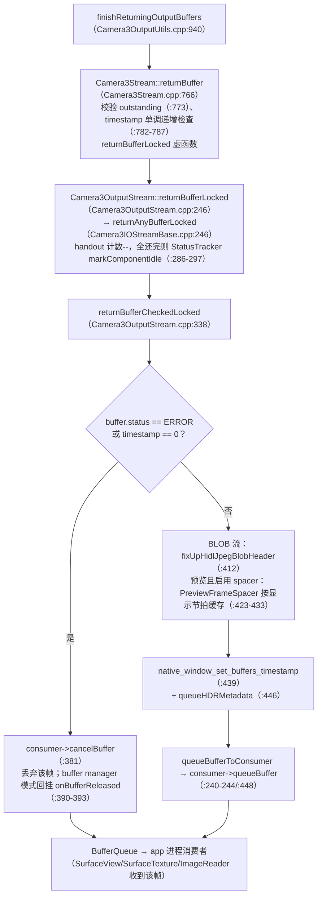
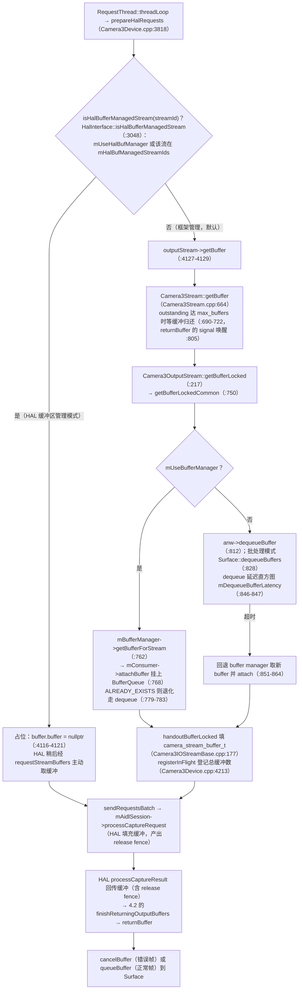
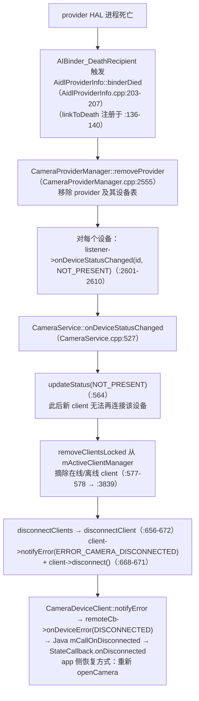
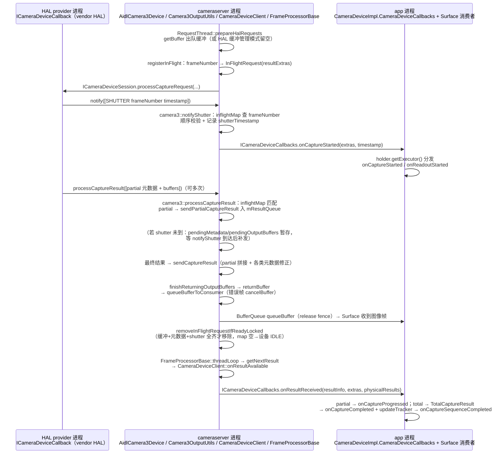
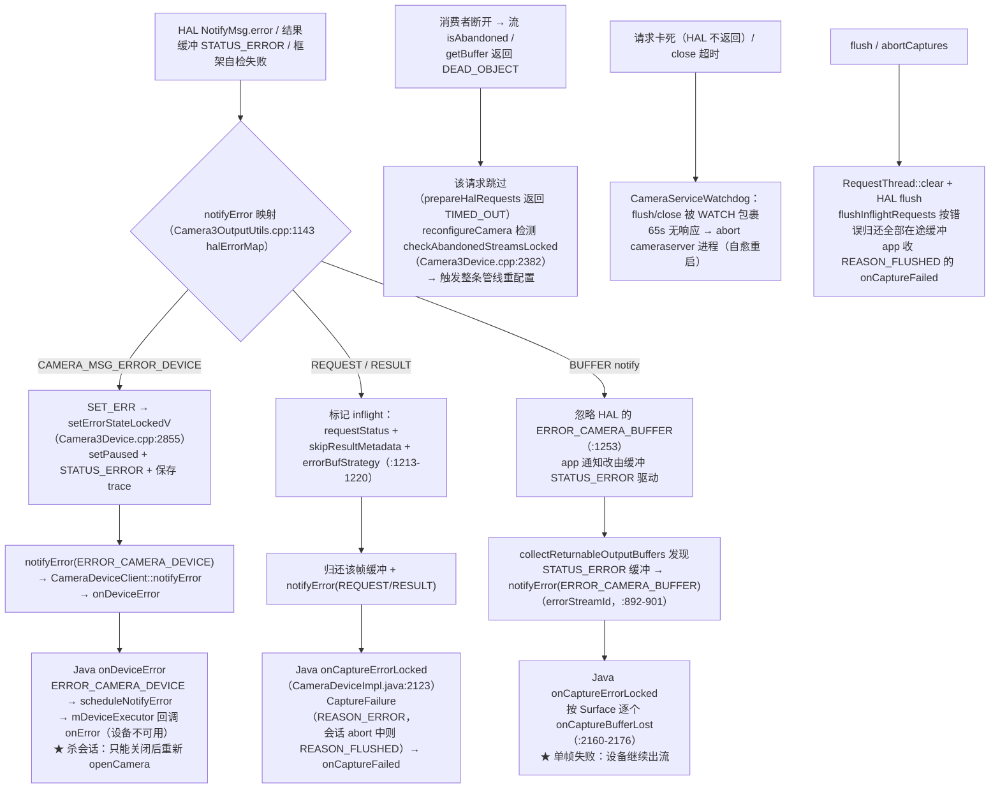

# 第 4 章 结果返回链路、缓冲区管理与错误恢复

> 本文为分章源文件，供单章阅读；若与主文档不一致，以主文档最新版为准。

> 本章基于 AOSP main 分支（2026-09 时点）真实源码整理，函数名与行为均出自所列源文件，行号为当前 main 分支时点。承接第 3 章：请求已经由 RequestThread 下发 HAL，本章沿同一帧走完回程——shutter/结果两条回调通道、in-flight 匹配、缓冲区出队与归还全生命周期，以及错误分类与恢复机制。所有图为 Mermaid 语法。

## 4.1 结果回程总览：notify 与 processCaptureResult 双通道 + in-flight 匹配

> 来源：[ICameraDeviceCallback.aidl](https://android.googlesource.com/platform/hardware/interfaces/+/refs/heads/main/camera/device/aidl/android/hardware/camera/device/ICameraDeviceCallback.aidl)、[ICameraDeviceCallbacks.aidl](https://android.googlesource.com/platform/frameworks/av/+/refs/heads/main/camera/aidl/android/hardware/camera2/ICameraDeviceCallbacks.aidl)、[AidlCamera3Device.cpp](https://android.googlesource.com/platform/frameworks/av/+/refs/heads/main/services/camera/libcameraservice/device3/aidl/AidlCamera3Device.cpp)、[Camera3OutputUtils.cpp](https://android.googlesource.com/platform/frameworks/av/+/refs/heads/main/services/camera/libcameraservice/device3/Camera3OutputUtils.cpp)、[InFlightRequest.h](https://android.googlesource.com/platform/frameworks/av/+/refs/heads/main/services/camera/libcameraservice/device3/InFlightRequest.h)

HAL → 框架的回调接口是 AIDL 的 `ICameraDeviceCallback`（@VintfStability，hardware/interfaces 仓库），方法表只有 4 个：

| 方法 | 行号 | 语义 |
|---|---|---|
| `notify(in NotifyMsg[] msgs)` | ICameraDeviceCallback.aidl:69 | 异步消息：SHUTTER / ERROR。契约要求框架 5ms 内处理完每条消息 |
| `processCaptureResult(in CaptureResult[] results)` | ICameraDeviceCallback.aidl:151 | 结果：元数据 + 输出缓冲（可多次、可部分；同一流缓冲必须 FIFO 顺序返回） |
| `requestStreamBuffers(...)` / `returnStreamBuffers(...)` | ICameraDeviceCallback.aidl:189/:201 | HAL 缓冲区管理模式下的主动取/还缓冲（见 4.3） |

关键契约（源码注释原文摘要）：**缓冲区在收到该帧的 SHUTTER notify 之前不得派发给应用层**（:42-46）；一次请求可对应多次 `processCaptureResult`（元数据+低分辨率缓冲先回、JPEG 后回，:76-83）；同一流的缓冲与元数据必须按帧号 FIFO（:92-97）；整体失败时也必须用 STATUS_ERROR 缓冲 + 空元数据调用本方法，并 notify(ERROR_REQUEST)（:132-138）。

app 进程侧对应的 AIDL 是 `ICameraDeviceCallbacks`（frameworks/av 的 camera/aidl）：`onDeviceError`（:37）、`onDeviceIdle`（:38）、`onCaptureStarted`（:39）、`onResultReceived`（:40）、`onPrepared`（:43）、`onRepeatingRequestError`（:51）、`onRequestQueueEmpty`（:53，即历史上的"capture queue empty"，main 分支已更名）等。

**两条通道在 cameraserver 的入口**（AIDL 栈，HIDL 栈结构对称在 device3/hidl/）：

**in-flight map：frameNumber → 一切**。请求下发时 `RequestThread::prepareHalRequests` 按帧注册：`registerInFlight(...)`（调用点 Camera3Device.cpp:4213，实现 :2888）把 `InFlightRequest` 放入 `mInFlightMap`（`KeyedVector<uint32_t frameNumber, InFlightRequest>`，InFlightRequest.h:263）。`InFlightRequest`（InFlightRequest.h:106-260）持有：`resultExtras`（requestId/burstId/subsequenceId——requestId 正是 Java 回调匹配键）、`numBuffersLeft`、`shutterTimestamp`、`pendingMetadata`（shutter 未到前缓存的最终元数据）、`collectedPartialResult`、`pendingOutputBuffers`（shutter 未到前缓存的缓冲）、`errorBufStrategy`、`outputSurfaces`（Surface 共享映射）等。

匹配过程（Camera3OutputUtils.cpp）：

- **shutter 通道**：`notifyShutter`（:1023）用 `msg.frame_number` 查 `inflightMap`（:1035），先做顺序校验（reprocess/ZSL/普通帧分别维护 `nextReprocShutterFrameNum`/`nextZslShutterFrameNum`/`nextShutterFrameNum`，:1043-1067），写入 `r.shutterTimestamp`，随后若该帧有回调（`hasCallback`，HFR 批处理中间帧为 false）→ `states.listener->notifyShutter(...)`（:1099）→ **`CameraDeviceClient::notifyShutter` → `remoteCb->onCaptureStarted`**（CameraDeviceClient.cpp:2265-2270）。之后补发"先到结果"：`sendCaptureResult(r.pendingMetadata, ...)`（:1105）+ `collectAndRemovePendingOutputBuffers`（:1112）。
- **结果通道**：`processCaptureResult`（:619）同样用 `result->frame_number` 查 `inflightMap`（:655）；查不到即 fatal（`SET_ERR("Unknown frame number...")`，:656-660）。收到最终元数据则 `request.haveResultMetadata = true` 并把 `errorBufStrategy` 升级为 `ERROR_BUF_RETURN_NOTIFY`（:782-783）；`numBuffersLeft` 按 `num_output_buffers`（+input buffer）递减（:786-801）。完成判定在 `removeInFlightRequestIfReadyLocked`（:511）：**所有缓冲返回且（跳过元数据 或 元数据+shutter 都已到）才从 map 移除**（:527-529）。
- 元数据并不会直接发给 app：`sendCaptureResult`/`sendPartialCaptureResult` 最终都走 `insertResultLocked`（:213）把 `CaptureResult` 追加进 `mResultQueue`。真正送到 app 的是另一个线程——`FrameProcessorBase::threadLoop`（FrameProcessorBase.cpp:119，10ms 轮询 `waitForNextFrame`，FrameProcessorBase.h:61）→ `processNewFrames` 循环 `device->getNextResult()`（:146，实现在 Camera3Device.cpp:1761）→ `processListeners` 回调 `onResultAvailable`（:233）→ **`CameraDeviceClient::onResultAvailable` → `remoteCb->onResultReceived`**（CameraDeviceClient.cpp:2401/2428）。

> 小结：**shutter/错误走 binder 线程直发（onCaptureStarted/onDeviceError），元数据先进 mResultQueue 再由 FrameProcessorBase 线程异步派发（onResultReceived）**；缓冲区则不经 Java，直接在 native 侧归还 Surface。Java 层再用 `frameNumber`/`requestId` 双键匹配：`onCaptureStarted`/`onResultReceived` 先 `mCaptureCallbackMap.get(requestId)` 拿到 `CaptureCallbackHolder`（CameraDeviceImpl.java:2370/:2504），并利用 extras 里的 `lastCompletedRegularFrameNumber` 等三项清理已完成的回调表（`removeCompletedCallbackHolderLocked`，:2366）。

## 4.2 partial/total result 语义与缓冲区流回 Surface

> 来源：[Camera3OutputUtils.cpp](https://android.googlesource.com/platform/frameworks/av/+/refs/heads/main/services/camera/libcameraservice/device3/Camera3OutputUtils.cpp)、[Camera3OutputStream.cpp](https://android.googlesource.com/platform/frameworks/av/+/refs/heads/main/services/camera/libcameraservice/device3/Camera3OutputStream.cpp)、[CameraDeviceClient.cpp](https://android.googlesource.com/platform/frameworks/av/+/refs/heads/main/services/camera/libcameraservice/api2/CameraDeviceClient.cpp)、[CameraDeviceImpl.java](https://android.googlesource.com/platform/frameworks/base/+/refs/heads/main/core/java/android/hardware/camera2/impl/CameraDeviceImpl.java)

**partial/total 判定**（Camera3OutputUtils.cpp:728-749）：支持 partial 时（`usePartialResult`，`numPartialResults` 来自 HAL 特性），`result->partial_result < numPartialResults` 即 partial。partial 元数据累积进 `request.collectedPartialResult`（:742），且只要该帧有回调就**立即**经 `sendPartialCaptureResult`（:256，带 `partialResultCount`）入队发给 app；`partial_result == numPartialResults` 才是最终结果：把收集到的 partial 拼接到完整结果（`sendCaptureResult` :350-352），校验 `ANDROID_SENSOR_TIMESTAMP`（:357-363），依次做畸变校正/变焦比/rotate-and-crop/闪光灯强度/autoframing/黑白等元数据修正（:376-488），最后 `insertResultLocked` 入队。不支持的 HAL 上 `partial_result != 1` 直接 fatal（:632-639）。

Java 侧的对应语义（CameraDeviceImpl.java:2454-2651）：`isPartialResult = resultExtras.getPartialResultCount() < mTotalPartialCount`（:2507-2508）——partial 分发 `onCaptureProgressed`（:2573），total 分发 `TotalCaptureResult` + `onCaptureCompleted`（:2597-2629），total 时用 `mFrameNumberTracker.popPartialResults(frameNumber)` 把之前收到的 partial 附进 TotalCaptureResult（:2584），并 `updateTracker` + `checkAndFireSequenceComplete()` 触发 `onCaptureSequenceCompleted`（:2644-2648）。

**缓冲区回程（与元数据并行）**：`processCaptureResult` 携带的输出缓冲先暂存 `request.pendingOutputBuffers`，**只有 shutter 已到才取出发还**（:810-820）；发还动作是 `collectReturnableOutputBuffers`（:876，把每个缓冲包成 `BufferToReturn`，同时处理 STATUS_ERROR 的上报策略）+ `finishReturningOutputBuffers`（:940）。后者调用 `stream->returnBuffer(...)`，进入流层：

要点：

- **应用"收帧"与"收结果"是两条独立路径**：缓冲经 BufferQueue 直接到消费者；元数据经 `onResultReceived`。`onCaptureCompleted` 携带的是 `TotalCaptureResult` 元数据，不携带图像。
- 错误缓冲若此时 HAL 元数据未失败（`errorBufStrategy == ERROR_BUF_RETURN_NOTIFY`，即最终结果已到，:783），会在 `collectReturnableOutputBuffers` 里主动 `notifyError(ERROR_CAMERA_BUFFER)` 并带上 `errorStreamId`（:892-901）。
- `return_buffers_outside_locks`（aconfig flag）为 true 时，归还缓冲被挪到 inflightLock 之外执行（:845-854、:1096-1099、:1130-1139），避免 Surface 阻塞拖住 in-flight 处理。
- 共享 Surface 场景下 `returnBuffer` 超时会 cancel 缓冲并发 `ERROR_CAMERA_BUFFER`（:969-987）。

## 4.3 缓冲区全生命周期：出队 → HAL 填充 → 归还 → queue 到 Surface

> 来源：[Camera3Device.cpp](https://android.googlesource.com/platform/frameworks/av/+/refs/heads/main/services/camera/libcameraservice/device3/Camera3Device.cpp)、[Camera3Stream.cpp](https://android.googlesource.com/platform/frameworks/av/+/refs/heads/main/services/camera/libcameraservice/device3/Camera3Stream.cpp)、[Camera3OutputStream.cpp](https://android.googlesource.com/platform/frameworks/av/+/refs/heads/main/services/camera/libcameraservice/device3/Camera3OutputStream.cpp)、[Camera3BufferManager.cpp](https://android.googlesource.com/platform/frameworks/av/+/refs/heads/main/services/camera/libcameraservice/device3/Camera3BufferManager.cpp)、[AidlCamera3OutputUtils.cpp](https://android.googlesource.com/platform/frameworks/av/+/refs/heads/main/services/camera/libcameraservice/device3/aidl/AidlCamera3OutputUtils.cpp)

**Camera3BufferManager 仍然存在且在用**（并非废弃）：`Android.bp` 仍在编译 `device3/Camera3BufferManager.cpp`（Android.bp:170）；`Camera3Device` 构造时 `mBufferManager = new Camera3BufferManager()`（Camera3Device.cpp:159），每个新输出流创建后 `newStream->setBufferManager(mBufferManager)` 注入（:1223），`disconnectImpl` 时释放（:368）。

- **超时语义**：`getBuffer` 等待时长来自请求的超时预算（`waitDuration`）；dequeue 超时常见原因是消费者（app）长时间不释放缓冲——这正是 4.2 末尾"共享 Surface 归还超时→cancel+上报"的镜像场景。
- **HAL 缓冲区管理模式（AIDL）按源码实际流程**：仅当设备声明支持（`INFO_SUPPORTED_BUFFER_MANAGEMENT_VERSION`）且流加入 `mHalBufManagedStreamIds` 时可用。HAL 经 `ICameraDeviceCallback.requestStreamBuffers`（同步双向 binder）取缓冲：`AidlCamera3Device::requestStreamBuffers`（AidlCamera3Device.cpp:698）→ `camera3::requestStreamBuffers`（AidlCamera3OutputUtils.cpp:131），实现要点：按流校验（重复/未开启该模式的流直接 `FAILED_ILLEGAL_ARGUMENTS`，:166-181）；`reqBufferIntf.startRequestBuffer()` 与 configureStreams 互斥，配置期间返回 `FAILED_CONFIGURING`（:183-188）；逐缓冲 `outputStream->getBuffer`（:239），累计 outstanding 超过 `max_buffers` 报 `MAX_BUFFER_EXCEEDED`（:214-226）；取到的 buffer 用 `pushInflightRequestBuffer` 登记（:292，此后经 `getInflightRequestBufferKeys`/`popInflightRequestBuffer` 可在 flush 时找回，见 4.4）。整体状态返回 `OK / FAILED_PARTIAL / FAILED_UNKNOWN`（:337-339）。这类缓冲不绑定具体帧，HAL 若用于某帧输出，随该帧的 `processCaptureResult` 返回；其余经 `returnStreamBuffers` 归还（`AidlCamera3Device.cpp:726` → `camera3::returnStreamBuffers` → 模板 `returnStreamBuffersT`，Camera3OutputUtilsTemplated.h:300），此时 timestamp 为 0，在 Surface 侧按丢弃处理（AidlCamera3OutputUtils.cpp:123-130 注释明确说明）。

## 4.4 错误处理与恢复：错误分类、provider 死亡、flush 与 Watchdog

> 来源：[Camera3OutputUtils.cpp](https://android.googlesource.com/platform/frameworks/av/+/refs/heads/main/services/camera/libcameraservice/device3/Camera3OutputUtils.cpp)、[Camera3Device.cpp](https://android.googlesource.com/platform/frameworks/av/+/refs/heads/main/services/camera/libcameraservice/device3/Camera3Device.cpp)、[CameraDeviceClient.cpp](https://android.googlesource.com/platform/frameworks/av/+/refs/heads/main/services/camera/libcameraservice/api2/CameraDeviceClient.cpp)、[CameraDeviceImpl.java](https://android.googlesource.com/platform/frameworks/base/+/refs/heads/main/core/java/android/hardware/camera2/impl/CameraDeviceImpl.java)、[CameraService.cpp](https://android.googlesource.com/platform/frameworks/av/+/refs/heads/main/services/camera/libcameraservice/CameraService.cpp)、[AidlProviderInfo.cpp](https://android.googlesource.com/platform/frameworks/av/+/refs/heads/main/services/camera/libcameraservice/common/aidl/AidlProviderInfo.cpp)、[CameraServiceWatchdog.cpp](https://android.googlesource.com/platform/frameworks/av/+/refs/heads/main/services/camera/libcameraservice/CameraServiceWatchdog.cpp)

**HAL 错误上报**：`NotifyMsg.error` → `camera3::notify` → `notifyError`（Camera3OutputUtils.cpp:1143）。先用静态表 `halErrorMap` 把 HAL 错误码映射为 `ICameraDeviceCallbacks` 错误码（:1147-1158）：`CAMERA_MSG_ERROR_DEVICE/REQUEST/RESULT/BUFFER`（InFlightRequest.h:80-85）→ `ERROR_CAMERA_DEVICE/REQUEST/RESULT/BUFFER`。分类处置：

- **ERROR_CAMERA_DEVICE（设备级，杀会话）**：走 `SET_ERR("Camera HAL reported serious device error")`（:1182）——宏最终调 `Camera3Device::setErrorStateLockedV`（Camera3Device.cpp:2855）：记录 `mErrorCause`、`mRequestThread->setPaused(true)`、状态切 `STATUS_ERROR`、`listener->notifyError(ERROR_CAMERA_DEVICE)`（:2874）、`CameraTraces::saveTrace()`。此后设备不可用，app 只能关闭重开。**框架自检发现的不一致（未知 frameNumber、乱序 shutter/result、畸形 partial 等）也一律 SET_ERR 走同一条致死路径**（如 :656-660、:1043-1067、:756-766）。
- **ERROR_CAMERA_REQUEST / ERROR_CAMERA_RESULT（单帧失败）**：在 inflight 表中标记 `r.requestStatus`、`skipResultMetadata = true`（:1213），并把 `errorBufStrategy` 设为 `ERROR_BUF_RETURN` / `ERROR_BUF_RETURN_NOTIFY`（:1216-1220），随后 `removeInFlightRequestIfReadyLocked` 归还该帧已到缓冲并尝试移除条目（:1224），最后 `listener->notifyError(errorCode, resultExtras)`（:1246）。物理摄像头子结果失败则只标记对应物理 id（:1196-1210）。
- **ERROR_CAMERA_BUFFER（缓冲丢失）**：**HAL 的这条 notify 被故意忽略**（:1253-1256 注释："Do not depend on HAL ERROR_CAMERA_BUFFER..."）；app 的 buffer-lost 回调改为由**缓冲的 STATUS_ERROR 状态**驱动（4.2 中 `collectReturnableOutputBuffers` :892-901）。
- 错误缓冲的三种策略枚举 `ERROR_BUF_CACHE / ERROR_BUF_RETURN / ERROR_BUF_RETURN_NOTIFY`（InFlightRequest.h:96-104）：请求/结果失败时错误缓冲也要还回 buffer queue，避免缓冲泄漏卡死流。

**Java 层错误分发**（CameraDeviceImpl.java）：`onDeviceError`（:2055，由 BinderCallback :2278 转发）分支处理——`ERROR_CAMERA_DISCONNECTED` → `mDeviceExecutor.execute(mCallOnDisconnected)` 触发 `StateCallback.onDisconnected`（:2076-2083）；`REQUEST/RESULT/BUFFER` → `onCaptureErrorLocked`（:2088/:2123）：BUFFER 按流找 Surface 逐个分发 `onCaptureBufferLost`（:2140-2176）；REQUEST/RESULT 构造 `CaptureFailure`，**reason 取决于会话是否正在 abort**（`mCurrentSession.isAborting()` → `REASON_FLUSHED`，否则 `REASON_ERROR`，:2184-2194），分发 `onCaptureFailed`（:2200），并更新 `mFrameNumberTracker` 触发 `onCaptureSequenceCompleted`（:2211-2224）；`ERROR_CAMERA_DEVICE/DISABLED` → `scheduleNotifyError`（:2091/:2094/:2103）在 `mDeviceExecutor` 上回调 `onError`（:2114-2118）。cameraserver 侧源头是 `CameraDeviceClient::notifyError`（CameraDeviceClient.cpp:2201）：先让复合流（HEIC/JpegR）内部消化 `onError`（可能 `skipClientNotification`），再 `remoteCb->onDeviceError`（:2219）。

**provider 死亡 → client 断连的完整链路**（已逐行核实）：

补充与勘误：

- **恢复**：provider 重启后由服务注册回调重新枚举（AIDL 走 `CameraService::onServiceRegistration` → `addAidlProviderLocked`，CameraProviderManager.cpp:953-968），设备状态翻回 PRESENT（CameraService.cpp:586-591），此后可重新打开；USB 外置摄像头走 `usbDeviceDetached` → `removeAllDevices` → 同样的 NOT_PRESENT 链路（:709 起）。
- main 分支的 `CameraService` 中**没有名为 `serviceDied` 的方法**：服务/进程死亡场景分别是（1）app client 的回调 binder 死亡 → `CameraService::binderDied`（CameraService.cpp:5858，linkToDeath 注册在 connect 完成时 :1938）→ `evictClientIdByRemote`（:3779）清理 client；（2）provider 死亡即上面的 `AidlProviderInfo::binderDied`；（3）Java 侧 CameraService 本体死亡由 CameraManagerGlobal 的 binderDied 兜底（第 2 章已述，ERROR_CAMERA_SERVICE）。
- `CameraService` 的 UidPolicy/SensorPrivacyPolicy 也已并入 CameraService.cpp（如 `UidPolicy::binderDied` :5054 监听 ActivityManager 死亡），与结果链路无直接交互。

**flush 语义**：`CameraDeviceClient::detachDevice`（断连/关闭前）会先 `mDevice->flush()` + `waitUntilDrained()`（CameraDeviceClient.cpp:2330-2337）。`Camera3Device::flush`（Camera3Device.cpp:1846）：`mRequestThread->clear(frameNumber)` 清掉排队请求并返回 lastFrameNumber（:1860，Java 侧由此收到 `onRepeatingRequestError`，CameraDeviceClient.cpp:2223）→ `mCameraServiceWatchdog->WATCH(mRequestThread->flush())`（:1866）→ `AidlCamera3Device::AidlHalInterface::flush`（AidlCamera3Device.cpp:766）调 `ICameraDeviceSession.flush()` 通知 HAL 立即作废在途请求。随后在回调侧由 `flushInflightRequests`（Camera3Device.cpp:2962 → Camera3OutputUtils.cpp:1280）兜底回收：把 in-flight 表中暂存的 pending 缓冲全部按错误归还、清空 `mInFlightMap`（:1307）、再通过 `popInflightBuffer`/`popInflightRequestBuffer` 找回已交给 HAL 但未归还的缓冲（:1316-1351），全部以 `CAMERA_BUFFER_STATUS_ERROR` 还给流（:1361-1376）。app 感知即 `CaptureFailure.REASON_FLUSHED` + Surface 不再出帧。

**CameraServiceWatchdog（卡死自愈）**：每台设备在 `Camera3Device::initializeCommonLocked` 里创建并启动（Camera3Device.cpp:260-262），开关由 `connectDevice` 时 `client->setCameraServiceWatchdog(...)` 决定（CameraService.cpp:2637-2638，可用 `cmd media.camera set-watchdog [0/1]` 动态切换，:6220）。`WATCH` 宏（CameraServiceWatchdog.h:43）包裹被监控调用（目前是 flush :1866 与 close :358 两处慢调用）：threadLoop 每 `kCycleLengthMs=100ms` 给该线程的 cycle +1（CameraServiceWatchdog.cpp:44-49），连续 `kMaxCycles=650` 个周期（约 65s）未结束即 `android_set_abort_message` + **abort() 整个 cameraserver 进程**（:53-63，可选地对 provider pid 发 SIGABRT，受 `enable_hal_abort_from_cameraservicewatchdog` flag 控制），由系统重启服务实现自愈；无监控对象时线程休眠（:18-24）。它与 4.1 的 in-flight 超时告警互补：`checkInflightMapLengthLocked`（Camera3Device.cpp:2932，阈值 Camera3Device.h:390-392：总时长 >5s 且帧数 >30/HighSpeed >256）只是打 warning，不做强杀。

## 4.5 一帧的完整回程（sequenceDiagram）

## 4.6 错误分类决策（flowchart）

---

> 本章把"结果怎么回来、缓冲怎么流转、出错怎么办"三条线收拢到 in-flight 表上：frameNumber 是贯穿 HAL→cameraserver→app 的唯一主线，requestId 只在 Java 回调匹配时才登场。配合第 3 章的请求下行链路，Camera2 API2 的一次完整拍帧闭环至此讲完。

<!-- ch4 done -->
