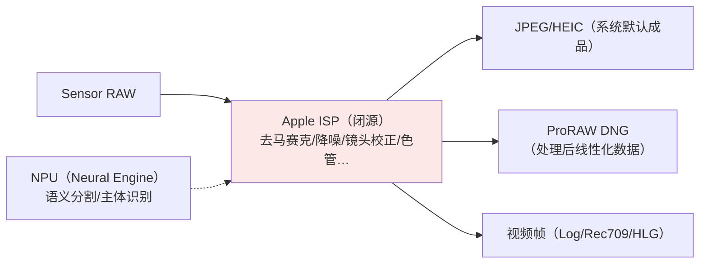
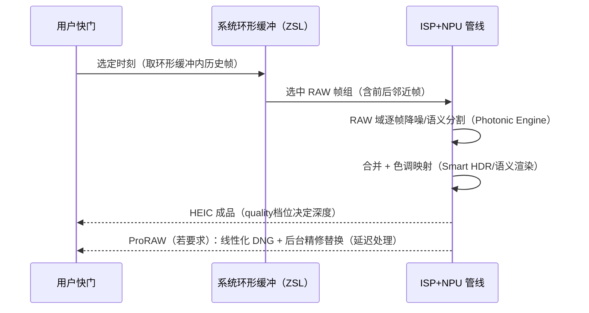
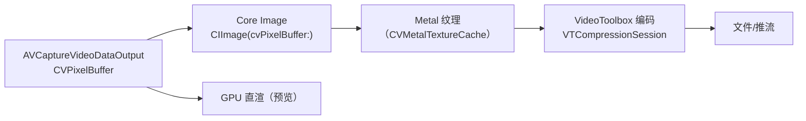
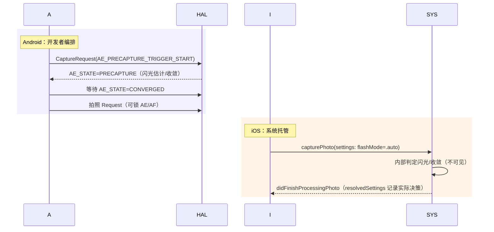
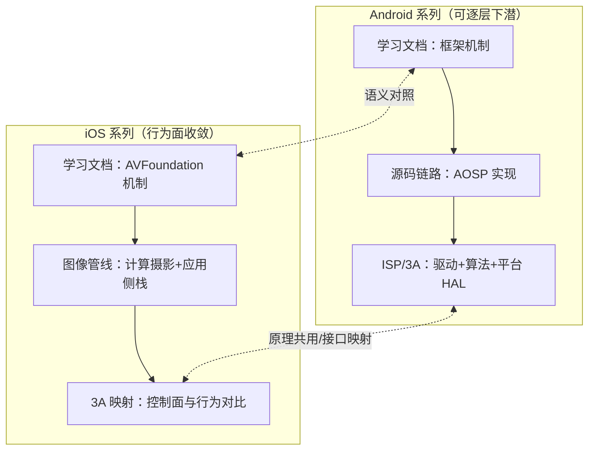

# Camera ISP 与图像管线学习文档（Apple 计算摄影 / 应用侧处理栈 / 3A 映射）

> 本文档是相机学习系列的第七份，与《Android_Camera_ISP_3A文档》同位对照：Android 版从 HAL 边界向下讲驱动/ISP/3A/平台实现；Apple 全栈闭源，本篇讲**可确认的 Apple 链路公开知识、系统级计算摄影体系、开发者自己的应用侧处理栈，以及 3A 控制面的两平台映射**。
>
> 官方文档入口：<https://developer.apple.com/documentation/avfoundation>、<https://developer.apple.com/documentation/coreimage>
> 整理日期：2026-09-19。全文按 A/B/C 三级标注材料可信度（A = Apple 官方公开资料；B = 公开通行知识；C = 社区研究须注出处）。

## 与 Android ISP/3A 文档的关系

- 算法原理共用：AE/AWB/AF 的算法原理与 libcamera 开源实现分析在《Android_Camera_ISP_3A文档》第 3 章，本篇不重复，只做**接口面与行为面映射**（第 4 章）；
- 材料面差异：Android 版能引用内核驱动与开源源码（A 层）；Apple 版 A 层只剩官方文档/WWDC 与标准格式（DNG），故各章先声明"能确认什么、不能确认什么"；
- 组织差异：Android 版按"传感器→ISP 管线→3A→平台 HAL"分层下潜；本篇按"链路边界→系统计算摄影→应用侧栈→3A 映射"收敛到开发者可作用的层面。

## 文档结构

| 章节 | 内容 | 材料层级 |
|---|---|---|
| 第 1 章 从 Sensor 到像素 | 传感器公开口径、ISP 闭源黑盒的可观测行为、DNG 通道 | A（规格/DNG）+ B/C |
| 第 2 章 Apple 计算摄影体系 | Smart HDR/深融合/Photonic Engine/夜间模式/语义渲染、ProRAW 与 Log 的色彩科学定位、可影响开关清单 | A（WWDC/官方）+ C（Halide 等实证） |
| 第 3 章 应用侧图像处理栈 | CVPixelBuffer/IOSurface 总线、Core Image、Metal、VideoToolbox、Vision、典型管线配方 | A 层为主 |
| 第 4 章 3A 接口映射与平台对比 | AE/AF/AWB 完整映射表、行为层差异、precapture 两种世界观、系列学习地图合并 | A + B/C |

## 建议阅读路径

- 先读《Android_Camera_ISP_3A文档》第 1~3 章建立管线与 3A 原理（本篇不重复原理）；
- 本篇顺序通读：第 1 章（认清 Apple 链路的可/不可观测边界）→ 第 2 章（计算摄影体系）→ 第 3 章（动手层）→ 第 4 章（两平台合流）；
- 配合《iOS_Camera_学习文档》第 3 章（3A API 机制）与《iOS_Camera_接口文档》第 5 章（元数据对照表）使用。

---

# 第 1 章 从 Sensor 到像素：Apple 链路公开知识

> 本文为分章源文件，供单章阅读；若与主文档不一致，以主文档最新版为准。
>
> 本章与《Android_Camera_ISP_3A文档》第 1 章同位：Android 版能引用内核驱动与 libcamera 源码（A 层），Apple 版的 sensor/ISP 全部闭源，A 层材料只剩 Apple 的产品级公开口径（技术规格页、WWDC）与 DNG 标签（Adobe 公开规范）——本章如实践分层标注，先给"能确认什么、不能确认什么"的边界。

**本章可信度边界声明**（与 Android ISP 文档 A/B/C 体系同源）：

- A 层：Apple 官方技术规格（iPhone 技术规格页）、WWDC 中对管线的官方描述、Adobe DNG 规范、`AVCaptureDevice.Format` 公开属性；
- B 层：传感器/ISP 的行业通行原理（Bayer、像素合并、HDR 合并等）套用到 Apple 机型；
- C 层：开发者社区实证（Halide 团队博客等对 ProRAW/Smart HDR 的分析），均已注明出处。

## 1.1 传感器：公开口径下的 Apple CMOS

> A 层来源：[iPhone 技术规格页](https://www.apple.com/iphone/compare/)（Apple 官方机型规格对比）、Apple Newsroom 各代产品稿。

Apple 不公开传感器型号与模组厂细节，但官方规格页给出可确认的能力口径：

| 公开口径 | 官方表述 | 开发者可观察的 API 落点 |
|---|---|---|
| 主摄 48MP（iPhone 14 Pro 起） | "48MP 主摄，四合一像素" | `supportedMaxPhotoDimensions`（48MP 列表）、`activeFormat.dimensions`（12MP 视频口径） |
| 四合一像素合并（quad-pixel） | 官方新闻稿长期表述 | 12MP 默认输出、48MP 可选输出（第 4 章照片管线） |
| 全系自动对焦主摄（13 起） | 官方规格 | `minimumFocusDistance` 骤降（微距） |
| 传感器位移防抖（部分机型） | 官方规格 | 无独立 API（防抖在 connection 模式内） |
| LiDAR（Pro 机型） | 官方规格 | `builtInLiDARDepthCamera` 设备类型 |

B 层原理补齐（行业通行，Apple 机型同样适用）：quad-pixel = 2×2 同色像素组在默认输出下合并为 1 个大像素（等效更大感光面积），高光场景可选全像素输出（remosaic）；这解释了 iOS 照片管线的两个 API 行为——**默认 12MP、显式抬 maxPhotoDimensions 才 48MP**，与 Android `SENSOR_PIXEL_MODE` 的 binning/remosaic 双模式语义同构。

## 1.2 ISP：闭源黑盒的可观测行为

> B/C 层为主。Android 版文档能逐模块讲 ISP 管线（BLS→LSC→去马赛克→…）；Apple 的 ISP 单元与处理顺序不公开，只有"输出行为"可观测。

可确认的边界（归纳自 A 层官方描述 + C 层社区实证）：

关键认知（与 Android 的根本不同）：

1. **没有 raw ISP 统计元数据可读**。Android 有 `ANDROID_STATISTICS_*`（直方图、AE/AWB 统计、scene flicker）；iOS 应用层拿不到任何 ISP 统计——行为只能通过成品推断；
2. **处理链不可插拔**。Android 部分平台提供 vendor tap 点/部分离线处理；Apple 的 ISP 是"输入 RAW、输出成品"的封闭函数，开发者唯一选择是**选择拿哪一级输出**（HEIC 成品 / ProRAW 线性 DNG / 纯 RAW DNG）；
3. **帧级处理对 App 透明**。逐帧路线（VideoDataOutput）拿到的已经是 ISP 处理后的帧（相当于 Android 上 HAL 内部完成 3A 的 preview 流输出）；想拿处理前数据只能走 RAW 照片管线。

C 层佐证（社区实证一致，见 Halide 团队对 ProRAW 的技术解析——ben-sandofsky/黄赟等 Halide 工程师博客与 WWDC 问答）：ProRAW 的 DNG 内含 Apple 全处理链结果（含降噪与合并），与"纯 RAW"的差异可以用同一场景两档输出对比复现。

## 1.3 DNG 通道：唯一可"拆开看"的窗口

> A 层来源：Adobe [DNG 规范](https://helpx.adobe.com/camera-raw/digital-negative.html)、`AVCapturePhoto` 交付数据。

开发者能对 Apple ISP 做的最深观测是解析 ProRAW/RAW 的 DNG 文件：

- DNG 标签给出传感器响应、黑电平、白点、线性化表——**这是 Apple 公开的传感器标定数据**（等价于 Android OEM 的 tuning 私有数据，Apple 通过标准格式部分公开）；
- ProRAW 与纯 RAW 的 DNG 差异可直接 diff（ProRAW 内嵌 Apple 处理结果的线性化数据 + 半成品噪声特征）；
- 这也是第三方 RAW 处理 App（Halide、Darkroom）的工作基础：绕过/补充系统成品管线，自建显影链。

## 1.4 与 Android 文档第 1 章的学习路径对照

| Android ISP 文档第 1 章主题 | Apple 版对应与位置 |
|---|---|
| CMOS 原理/Bayer/曝光模型 | 行业通用知识直接复用（B 层），本文不重复 |
| PDAF 像素与数据通路 | Apple 未公开（全像素双核对焦为官方口径）；行为级见本系列《学习文档》第 3 章（对焦接口） |
| V4L2/media-controller 驱动层 | **无对应**（iOS 无内核驱动可查），以 camerad 黑盒替代（学习文档 1.1） |
| QCOM CAMSS 驱动实例 | 无对应 |
| ANDROID_SENSOR_* 元数据 | `AVCaptureDevice` 曝光属性 + `resolvedSettings`（接口文档第 5 章总表） |

> 结论：iOS 的"底层学习"从驱动/寄存器层上移到**行为观测层**（API 行为 + DNG 解析 + 成品对比）。这个约束决定了后续三章的组织方式：讲系统级计算摄影（第 2 章）、应用侧处理栈（第 3 章）、3A 接口映射（第 4 章），而不是 ISP 模块分解。
# 第 2 章 Apple 计算摄影体系：Smart HDR、Photonic Engine 与 ProRAW

> 本文为分章源文件，供单章阅读；若与主文档不一致，以主文档最新版为准。
>
> 本章讲"Apple 照片为什么长这样"。A 层材料是 WWDC 与 Apple 官方技术文档对功能行为的描述；具体算法内部（权重、融合策略）Apple 从未公开，社区分析（C 层）仅用于建立心智模型。

## 2.1 功能代际总览

> A 层来源：各代 iPhone 发布稿与 WWDC（[WWDC19 Session 503? 摄像头相关]、各年 camera session），版本归属以 Apple 官方新闻稿为准。

| 能力 | 引入 | 一句话定位 | 开发者可见性 |
|---|---|---|---|
| Smart HDR | iPhone XS（2018） | 多帧融合 + 语义识别，保证逆光人像天空与面部同亮 | 不可关；质量档位经 `photoQualityPrioritization` 间接表达 |
| 深度融合（Deep Fusion） | iPhone 11（2019） | 中低光的中亮度区域逐像素 NPU 融合（纹理优先） | 不可直接开关 |
| 夜间模式（Night mode） | iPhone 11（2019） | 长曝光多帧 + 对齐合并（手持秒级曝光） | 系统相机 UI 有开关；第三方 API 无显式开关 |
| Apple ProRAW | iPhone 12 Pro（iOS 14.3） | ISP 全处理链的线性 DNG 交付 | `isAppleProRAWSupported`（公开 API） |
| Photonic Engine | iPhone 14（2022） | 光像引擎：把深融合前移到 RAW 域逐帧处理（管线重排） | 无 API；效果经 quality 档位体现 |
| 语义渲染/PR（Photographic Styles） | iPhone 13 起 | 可复现的色彩风格（非滤镜，作用于管线的色调映射） | 系统相机功能，第三方仅可读取成品 |
| Night mode 人像/微距 HDR 等 | 13/14/15 渐进 | 上述能力的组合扩展 | 同上 |

代际演进的本质（B 层归纳）：**每代都在把"后处理"前移到"RAW 域逐帧处理"**——Smart HDR 是成品域多帧融合，Photonic Engine 把处理提前到像素合并前的 RAW 帧，用 NPU 在每帧上跑语义分割与降噪，再进入合并。这与 Android OEM 的"多帧 HDR in HAL"同构，但 Apple 的语义分割（人/天/发/肤分离调优）由自家 NPU 与模型统一实现，跨机型行为一致。

## 2.2 拍照时的处理时序（可观测行为模型）

> B/C 层：依据公开行为（快门延迟特征、resolvedSettings、社区实测）建立的模型，Apple 未公开时序。

对 API 行为的解释力：

- **`.speed` 与 `.quality` 的巨大差异**：不是"压缩质量"而是**处理链深度**（是否进 Photonic Engine/深融合）——对应 Android OEM 的 HDR 档位私有行为，Apple 把它 API 化了；
- **快门零延迟 + 出片延迟**：iOS 17 起延迟照片处理（deferred processing）把"秒回预览成品"与"后台精修替换"拆成两步（`AVCapturePhotoOutput` 的 deferred 相关 API）；
- **闪光与夜间模式互斥的表象**：两者都由系统在管线内决策，`flashMode = .auto` 的判定融合了场景光估计（不可读但可测）。

## 2.3 ProRAW 与 ProRes 的色彩科学定位

> A 层来源：[Apple ProRAW 官方支持文档](https://support.apple.com/zh-cn/118497)（Apple 关于 ProRAW 的说明）、Apple Log 官方资料（WWDC23/产品稿）。

| 交付 | 色彩科学定位 | 后期空间 |
|---|---|---|
| HEIC/JPEG 成品 | 显示域（OETF 已套用，Display P3/sRGB） | 直接分发，调节空间小 |
| ProRAW（DNG） | **线性显示参考**（处理后但线性化、16bit），已含降噪合并 | 后期调色空间大，直出需自己显影 |
| Apple Log（视频） | 对数域（Log OETF），广色域（BT.2020） | 影视级调色标准工作流 |
| Apple Log 2 | Log 2.0（更新曲线与工作流，17 Pro） | 同上，CST 工具链配套 |
| ProRes RAW | RAW 视频帧容器 | 最大自由度，17 Pro 起 |

与 Android 对照（对应《Android_Camera_ISP_3A文档》第 2 章 tuning 话题）：Android 上"成品的观感"由 OEM tuning（CCM、tonemap 曲线、local tone mapping 私有参数）决定，机型间差异大且不可迁移；Apple 的"观感"是**系统统一色调映射 + 语义渲染**，第三方拿到的是同样的观感基线，差异竞争在 ProRAW/Log 的后期空间——这是 iOS 相机 App 生态"调色类工具繁荣"的结构原因。

## 2.4 开发者可以影响的开关清单

> A 层归纳：全部来自公开 API，控制面确实很窄，但每项都有明确语义。

| 目标 | 可用开关 |
|---|---|
| 处理深度 | `photoQualityPrioritization`（.speed/.balanced/.quality） |
| 跨镜头融合 | `isAutoVirtualDeviceFusionEnabled`（关掉可拍单镜头原生视角） |
| 计算摄影与否 | ProRAW（系统处理链）vs 纯 RAW DNG（绕过）vs HEIC（全算）——三档"算力投入"选择 |
| 降噪/锐化 | 无 API（成品域不可调；需要自己的处理链时用 RAW + 自建显影） |
| 色彩风格 | 不可编程（系统相机功能）；成品后处理用 Core Image 自建 |
| 夜间/深融合 | 无直接开关（quality 档位间接影响） |

C 层实践共识（Halide/社区）：要做"比系统更讨喜的直出"，唯一完整路线是**纯 RAW 捕获 + 自建 ISP（去马赛克/降噪/色彩/色调）**，工程量大；多数产品选择"ProRAW 或 HEIC + Core Image 局部增强"的混合路线。

## 2.5 视频侧的系统处理

> A 层来源：视频防抖与电影效果相关 WWDC；B 层归纳。

- 视频默认管线同样有系统级处理（防抖裁切、色调映射、HLG/SDR 动态选择），`AVCaptureConnection.preferredVideoStabilizationMode` 是少数可编程点；
- 电影效果（Cinematic）在 iOS 26 前仅系统相机可用，26 起开放捕获 API（见《学习文档》第 4 章 4.6）；
- 空间视频（15 Pro+）：双镜头立体 + 系统对齐，第三方捕获支持随版本渐进开放。

> 本章小结：Apple 计算摄影的学习法是"行为实证 + 输出三通道（成品/ProRAW/Log）"，而不是 Android 式的"统计元数据 + tuning 参数"。能改变结果的 API 面窄，但每个开关的语义被 Apple 定义得很清楚——先认清"不可控的部分"，把工程力气花在可控制的交付格式与后期链路上。
# 第 3 章 应用侧图像处理栈：Core Image、Metal 与 VideoToolbox

> 本文为分章源文件，供单章阅读；若与主文档不一致，以主文档最新版为准。
>
> Android 版文档第 2 章讲 ISP 内部的处理算法；iOS 上这些在系统闭源侧，开发者自己的"ISP"是应用侧处理栈——本章对应 Android 版第 2 章与第 3 章的部分主题（应用侧如何处理像素数据）。A 层来源：[Core Image](https://developer.apple.com/documentation/coreimage)、[Metal](https://developer.apple.com/documentation/metal)、[VideoToolbox](https://developer.apple.com/documentation/videotoolbox) 官方文档与 WWDC。

## 3.1 像素数据总线：CVPixelBuffer 与 IOSurface

> B 层（系统机制）+ A 层（API 行为）。

iOS 全部图像数据流经一条统一总线：`CVPixelBuffer`（用户态句柄，底层是 `IOSurface` 共享内存）。这解释了 iOS 管线的"零拷贝文化"：

- 相机逐帧 → Core Image → Metal → 编码器全程**同一块 IOSurface 显存**，无 CPU 内存拷贝（对比 Android：CameraX/ImageReader 的 Image → GL_OES_EGL_image_external 或 YUV 转换，路径常碎）；
- CPU 侧访问用 `CVPixelBufferLockBaseAddress`；GPU 侧经 `CVMetalTextureCache`；
- 这个统一总线是 iOS 视频特效 App 性能的结构优势——Android 上 YUV_420_888 布局在 vendor 间不一致的历史包袱，iOS 没有（Apple 限定 bicoplanar 两种布局）。

## 3.2 Core Image：Apple 的应用侧 ISP

> A 层来源：[Core Image 编程指南](https://developer.apple.com/library/archive/documentation/GraphicsImaging/Conceptual/CoreImaging/ci_intro/ci_intro.html)（官方存档仍为权威）、各 filter 文档页。

Core Image 在概念上就是"暴露给 App 的可编程 ISP"：

| 能力 | 代表接口 | 对应传统 ISP stage |
|---|---|---|
| 色彩管理 | `CIContext` workingColorSpace/outputColorSpace | CSC/色管（默认 Display P3 感知） |
| 色调映射 | `CIColorControls`、`CIToneCurve` | Gamma/Contrast |
| 去噪 | `CINoiseReduction`、ML 增强系列 | NR（比系统 ISP 简单） |
| 锐化 | `CISharpenLuminance`、`CIUnsharpMask` | Sharpen |
| 几何/镜头 | `CILensDistortion`、透视矫正 | LSC/几何校正的应用侧补充 |
| RAW 显影 | `CIRAWFilter`（解码 DNG/ProRAW） | 完整 RAW 管线（Adobe DNG 处理器封装） |

要点：

- filter 链是**声明式惰性**的（CIImage 图构建后一次性由 GPU 融合执行），与 Android 上"自写 GLSL 一级级 render"相比省优化功夫；
- `CIRAWFilter` 是处理 ProRAW/RAW 的官方路径（内部为 Apple DNG 处理器），自建显影不必从去马赛克写起；
- 性能三原则（官方性能指南）：复用单个 `CIContext`、避免 CPU 侧 `CGImage` 中转、控制 working space（处理用线性、输出用显示 space）。

## 3.3 Metal：自定义像素处理

> A 层来源：[Metal 文档](https://developer.apple.com/documentation/metal)、[Metal Performance Shaders](https://developer.apple.com/documentation/metalperformanceshaders)。

需要 Core Image 表达不了的处理（自定义降噪、风格化、AI 后处理）时：

- 纹理直通：`CVMetalTextureCacheCreateTextureFromImage` 把相机帧变 `MTLTexture` → 自写 compute kernel → 结果写回 CVPixelBuffer 给编码器（全程零拷贝）；
- `Metal Performance Shaders`（MPS）提供优化过的卷积/直方图/重采样等原语（对应 Android 上"自写 RenderScript/Vulkan compute"的官方原语库）；
- 与 CoreML 组合：分割/超分模型（CoreML）的输入输出同样是 `CVPixelBuffer`/`MTLTexture`，与相机帧同总线——这是 iOS "NPU 参与应用侧管线"的现实路径（系统 Photonic Engine 的应用层复刻）。

## 3.4 VideoToolbox：编码器直连

> A 层来源：[VideoToolbox 文档](https://developer.apple.com/documentation/videotoolbox)。

逐帧路线自管编码时，VideoToolbox 是 Apple 的 MediaCodec：

| 接口 | 角色 | Android 对应 |
|---|---|---|
| `VTCompressionSession` | 视频硬编码（H.264/HEVC/ProRes） | MediaCodec 编码器 |
| `VTDecompressionSession` | 硬解码 | MediaCodec 解码器 |
| `VTSessionSetProperty` | 码率/profile/帧率/色彩属性 | MediaFormat |
| 编码输出 sample buffer → AVAssetWriter/自封装 | 收尾 | MediaMuxer |

实践要点：编码器色彩属性（色彩矩阵/传输函数/色域标签）必须与像素数据一致标注，否则 HDR/广色域成品发灰——常见坑位；ProRes 编码同样经 VideoToolbox（codec 属性选择），不吃 CPU 软编。

## 3.5 Vision：感知原语

> A 层来源：[Vision 框架](https://developer.apple.com/documentation/vision)。

相机 App 常用的感知能力在 Vision 框架（NPU 加速）：人脸/人体姿态/矩形/文字检测、图像相似度等。与相机管线的衔接是"sample buffer → Vision request → 结果标注/驱动 3A 交互"（如点击人脸优先对焦）。对照 Android：CameraX 的 ML Kit 分析用例同位；差异是 Vision 的输入直接接 CVPixelBuffer 且默认 NPU，无需 Android 的 ImageProxy 格式转换层。

## 3.6 典型管线配方速查

| 需求 | 配方 |
|---|---|
| 实时滤镜相机 | VideoDataOutput → CIImage(filter 链) → previewLayer/Metal 渲染；录制分支接 AssetWriter |
| 人像虚化（自控） | 深度交付（DepthDataOutput）+ 自定义 bokeh kernel（Metal）或 CIRenderDestination |
| 直播推流 | VideoDataOutput（420f）→ 编码（VT）→ 协议封装；美颜节点用 Metal/MPS |
| RAW 显影 App | ProRAW/RAW 捕获 → CIRAWFilter → 自调色 → 导出 |
| 帧级 AI 后处理 | CoreML(分割/超分) + Metal 混合，输入输出保持 CVPixelBuffer 总线 |
# 第 4 章 3A 接口映射与平台对比

> 本文为分章源文件，供单章阅读；若与主文档不一致，以主文档最新版为准。
>
> 本章对应《Android_Camera_ISP_3A文档》第 3 章（3A 算法深入）：Android 版逐函数分析了 libcamera 的 AE/AWB/AF 开源实现；Apple 的 3A 闭源且无统计元数据，本章做两件事——把"3A 的 Apple 控制面"与"Android 3A 元数据"完整对齐（接口层），并对比两平台 3A 行为差异（行为层）。算法原理（AE 收敛、AWB 色温估计、AF 爬山）请回读 Android 版第 3 章，两平台共用同一套原理。

## 4.1 3A 控制面完整映射

> A 层归纳：来自 AVFoundation 文档与 Android camera metadata 文档（`/camera/docs/metadata`）的语义对齐。

**AE（自动曝光）**：

| Android | iOS | 映射注意点 |
|---|---|---|
| `AE_MODE_ON/ON_AUTO_FLASH/ON_ALWAYS_FLASH/OFF` | `exposureMode`（autoExpose/continuousAutoExposure/custom）+ 照片 `flashMode` | Android 闪光与 AE 同键耦合；iOS 拆开（曝光在 device、闪光在 settings） |
| `AE_EXPOSURE_COMPENSATION`（step + index） | `exposureTargetBias`（连续 EV） | iOS 连续值需 UI 侧自行吸附档位 |
| `AE_PRECAPTURE_TRIGGER` | 无 | 拍照收敛由系统管线内部处理（见 4.3） |
| `AE_STATE`（含闪烁检测） | `adjustingExposure` + 无状态 | 无 flicker 元数据；防频闪完全系统内 |
| `AE_LOCK`（regions/lock） | `exposureMode = .locked` | 锁定语义相同 |
| `SENSOR_EXPOSURE_TIME/SENSITIVITY` | `setExposureModeCustom(duration:iso:)` | 单位差异（ns vs CMTime 秒） |

**AF（自动对焦）**：

| Android | iOS | 映射注意点 |
|---|---|---|
| `AF_MODE_AUTO/CONTINUOUS_PICTURE/MACRO/EDOF` | `focusMode`（autoFocus/continuousAutoFocus） | EDOF 无对应（虚拟设备融合内部处理） |
| `AF_TRIGGER_START/CANCEL` | 无显式触发 | 惯用法：切 `.autoFocus` → 观察 `adjustingFocus` 收敛 → 切回连续 |
| `LENS_FOCUS_DISTANCE`（屈光度） | `lensPosition`（0~1） | iOS 无物理单位标定；电影级跟焦能力弱于 Android 手动路线 |
| `AF_STATE` | `adjustingFocus` + `subjectAreaDidChangeNotification` | iOS 无 state 细分 |
| `AF_REGIONS` | `focusPointOfInterest`（单点） | 多区域加权不可表达 |

**AWB（自动白平衡）**：

| Android | iOS | 映射注意点 |
|---|---|---|
| `AWB_MODE_AUTO/INCANDESCENT/…` | `continuousAutoWhiteBalance` | iOS 无场景枚举预设 |
| `COLOR_CORRECTION_MODE`（TRANSFORM_MATRIX 等） | `whiteBalanceMode = .locked` + `deviceWhiteBalanceGains` | iOS 增益含系统标定换算（温/色→RGB） |
| `COLOR_CORRECTION_TRANSFORM`（CCM） | 不可控 | Apple 内部 |
| `NEUTRAL_COLOR_POINT`（结果） | 无直接读取 | 可从 `resolvedSettings`/成品 EXIF 推断 |

## 4.2 行为层差异：谁来"负责"3A

> B/C 层归纳（行为来自两平台公开文档与社区实证的长期观察）。

| 维度 | Android | iOS |
|---|---|---|
| 3A 策略实现 | OEM HAL（质量分化） | Apple 统一（跨机型行为一致） |
| 可观测性 | 全量统计与状态机元数据 | 仅模式/收敛布尔 + 成品推断 |
| 手动控制深度 | 深（逐帧逐键，含 CCM/bokeh/touch） | 浅（模式 + 锁定，无 CCM） |
| 触发时序控制 | 开发者编排（precapture/trigger） | 系统托管（拍照时内部收敛） |
| 结果验证 | meta 对比 + ITS | 成品对比 + resolvedSettings |

工程含义：

1. **Android 3A 调试方法论**（meta trace、逐帧状态机分析）在 iOS 失效——iOS 的调试是**成品导向**（拍系列照片看行为、diff DNG、对比 quality 档位）；
2. iOS 上"3A 异常"的分层排查：先排除 App 侧（模式被锁、坐标换算错、KVO 没跟上），再判断系统行为（真机矩阵复测），最后是硬件限制（无 AF 的镜头、微距边界）；
3. 写跨平台相机产品时的 3A 对齐策略：**以 iOS 的窄控制面为公共分母设计 UI**（模式切换 + 单点 + 补偿滑条），Android 的富控制（手动 CCM、区域矩阵、precapture 时序）作为平台增强层——反之（按 Android 全控设计 UI）会在 iOS 永远缺功能。

## 4.3 拍照收敛时序对照（precapture 的两种世界观）

> B 层（Android 侧为公开协议，iOS 侧为行为模型）。

Android 的 precapture 序列是 HAL 协议（《Android_Camera_ISP_3A文档》3.2 有逐状态分析）；iOS 把同样的物理过程（闪光预闪估计、曝光收敛）藏在照片管线内，开发者唯一影响是 `flashMode` 与 `photoQualityPrioritization`。**Apple 用"快门延迟换开发者简单"**——`.quality` 档位的出片延迟本质是系统版 precapture + 多帧处理的总时长。

## 4.4 两平台学习地图合并（系列总结）

把本仓库 Android 与 iOS 两个系列放回一张图：

- 共用底层：成像原理、3A 算法原理、多帧计算摄影思想（Android ISP 文档讲透了，iOS 侧直接复用）；
- 分叉点：Android 深在**开放与逐层可控**（HAL/驱动/算法均可下潜），iOS 深在**系统级整合与交付质量**（计算摄影/专业格式/统一行为）；
- 人才画像：Android 相机工程师向 tuning/平台纵深发展，iOS 相机工程师向图像处理/产品体验纵深——两个系列文档的章节结构就是按这个分工组织的。
