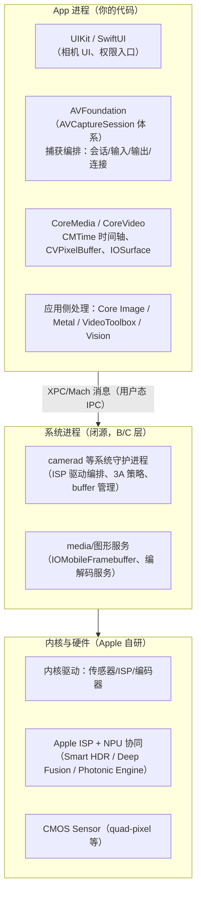
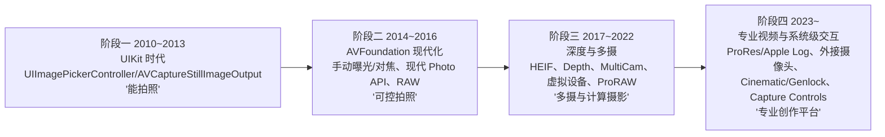
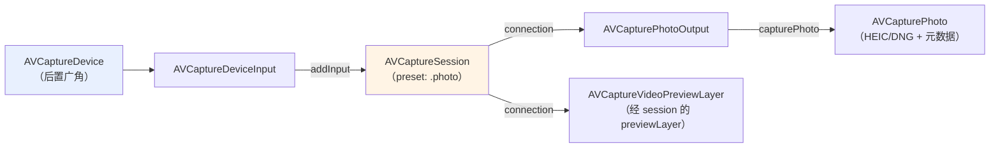
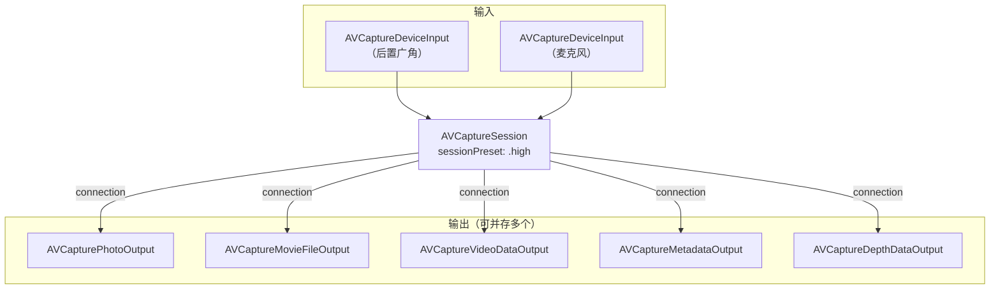
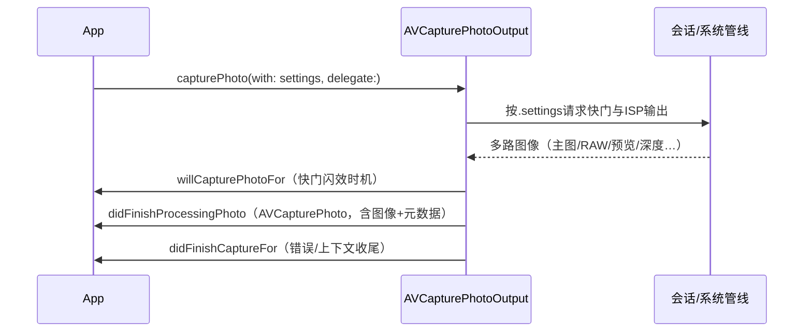
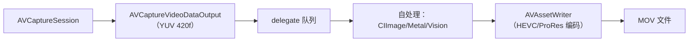
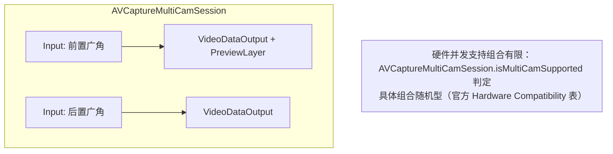
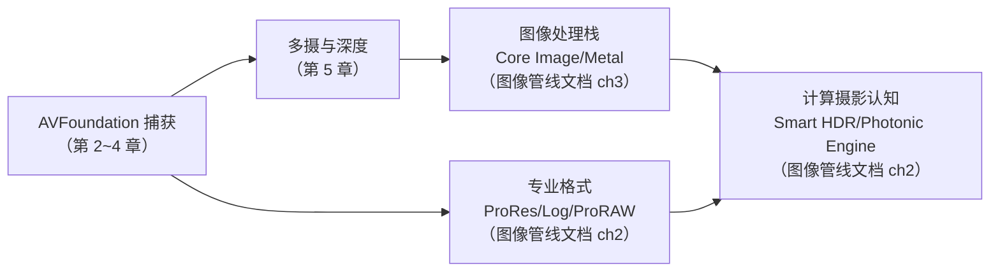

# iOS Camera 框架学习文档

> 本文档是相机学习系列的第五份（Android 系列四份之后），面向已熟悉 Android 相机框架、希望系统掌握 **iOS 相机体系**的工程师。内容依据 Apple 官方文档（developer.apple.com）、WWDC 视频与 Apple 官方样例整理，逐节附来源链接。
>
> 官方文档入口：<https://developer.apple.com/documentation/avfoundation>
> 整理日期：2026-09-19（Apple 文档持续更新，API 可用版本以官方页面为准）

## 与 Android 系列的根本差异（先读这一段）

iOS 全栈闭源：没有 AOSP 源码可逐行核对、没有 HAL 边界可考察、没有 CTS 可查。因此本系列 iOS 文档采用与《Android_Camera_ISP_3A文档》相同的**材料可信度分层**（A 层 = Apple 官方资料；B 层 = 公开通行知识；C 层 = 社区研究须注出处），且不设《源码链路》对应文档。Android 文档讲"HAL 协议长什么样"，iOS 文档讲"Apple 把哪些能力 API 化了、行为由谁保证"。

## 文档结构

| 章节 | 内容 | 对应 Android 系列 |
|---|---|---|
| 第 1 章 架构概览与版本演进 | iOS 相机软件栈分层（与 Android 三进程模型对照）、版本时间线（iOS 8→26）、API 体系总览与对照阅读地图 | 学习文档第 1、4 章 |
| 第 2 章 AVFoundation 捕获核心 | 会话—输入—输出模型、配置原子性、设备发现、中断恢复、权限隐私 | 学习文档第 1~2 章 |
| 第 3 章 设备控制：3A 接口面 | 对焦/曝光/白平衡的模式与锁定、闪光灯、变焦、系统压力（对照 Android CONTROL_* 元数据） | 学习文档第 2 章 + ISP/3A 文档第 3 章接口部分 |
| 第 4 章 拍照与录像管线 | Photo settings 对象模型、格式体系（HEIC/DNG/ProRAW）、高分辨率与延迟处理、视频双路线、ProRes/Log/Cinematic | 学习文档第 2、5~7 章 |
| 第 5 章 多摄、深度与硬件特性 | 虚拟设备、MultiCamSession、AVDepthData 三源、微距/Center Stage/Capture Controls、外接摄像头 | 学习文档第 5~7 章 |
| 第 6 章 生态、扩展与合规 | 为什么没有第三方相机 HAL、ScreenCaptureKit、系统相机边界、测试与合规 | 学习文档第 1 章 + 版本控制章 |

## 建议学习路径

1. **建立差异认知**：第 1 章，理解"没有 HAL、没有逐帧元数据、计算摄影默认在场"三个结构差异；
2. **掌握会话模型**：第 2 章的对象图是全部 iOS 相机代码的骨架，对照 Android 的 session/stream 记忆成本最低；
3. **3A 对照着学**：第 3 章每节都有 Android 元数据对照表，用已知的 CONTROL_* 体系映射；
4. **管线按需深入**：第 4 章拍照/录像两条路线，写代码前精读；第 5~6 章按需选读；
5. **横向配合**：《iOS_Camera_接口文档》速查方法签名，《iOS_Camera_ISP_图像管线文档》解释行为背后的图像处理。

---

# 第 1 章 iOS 相机系统架构概览与版本演进

> 本文为分章源文件，供单章阅读；若与主文档不一致，以主文档最新版为准。

> 本章内容整理自 Apple 官方文档与 WWDC 视频（文中逐节附链接），面向已熟悉 Android 相机框架、希望系统学习 iOS 相机体系的工程师。流程图均为 Mermaid 语法。

**材料可信度分层约定**（与《Android_Camera_ISP_3A文档》同一套体系，来源不同）：

| 层级 | 含义 | 典型来源 |
|---|---|---|
| A 层 | Apple 官方公开资料，可抓取验证 | developer.apple.com 文档站（AVFoundation/AVCam 示例）、WWDC 视频与幻灯片、Technical Notes、Apple Newsroom |
| B 层 | 公开通行知识 | 行业通用的系统架构描述、Apple 未逐条出处的公开行为（如系统服务的存在性） |
| C 层 | 社区研究 | 开发者博客（Halide/Ben Sandofsky 等）、逆向研究；须给出出处且注明不确定度 |

与 Android 文档系列的一个根本差异：**iOS 全栈闭源**，不存在 AOSP 式的"源码逐行核对"，因此本系列 iOS 文档的"源码链路"一栏天然缺位，以**官方 API 行为文档 + WWDC 一手材料**为最可信来源，层级标注帮助读者区分"Apple 说了什么（A）"与"社区推测了什么（C）"。

## 1.1 分层架构：从 App 到 Sensor

> 来源（A 层）：[AVFoundation 官方文档总览](https://developer.apple.com/documentation/avfoundation)、[AVCam: Building a camera app](https://developer.apple.com/documentation/avfoundation/capture_setup/avcam_building_a_camera_app)、WWDC 系列捕获 session（如 [WWDC19 Session 234: Advances in Camera Capture](https://developer.apple.com/videos/play/wwdc2019/234/)）。

iOS 相机软件栈同样可以画出"应用 → 框架 → 系统服务 → 内核/驱动 → 硬件"的分层，但与 Android 相比每层的所有权和开放程度完全不同：



各层要点（A 层为 API 事实，B/C 层为架构性描述）：

| 层 | iOS 组件 | Android 对应物 | 所有权 |
|---|---|---|---|
| 应用框架 | AVFoundation（`AVCaptureSession`）+ CoreMedia/CoreVideo | Camera2/CameraX API + libcamera 本地库 | Apple |
| 系统服务 | camerad 等守护进程（闭源） | CameraService（AOSP 开源）+ vendor HAL | Apple 全部 |
| HAL 接口 | **不存在公开 HAL 接口**，第三方无法实现相机 HAL（macOS 例外，见第 6 章 Camera Extensions） | camera3.h / AIDL camera HAL（OEM/第三方可实现） | — |
| 图像处理 | Apple ISP（自研，配合 NPU 做计算摄影） | 高通 Spectra / MTK ISP（OEM 实现，tuning 交给厂商） | Apple |
| 传感器 | Apple 定制 CMOS（与 Sony/Samsung 代工合作） | OEM 采购 Sony/Samsung 等模组 | Apple 定制 |
| 出厂调校 | Apple 出厂统一 tuning，机型间行为一致 | OEM 各自 tuning，同代芯片不同机型表现差异大 | Apple |

> C 层补充：camerad 是 iOS 用户态的相机守护进程，承担 ISP 控制、3A 与缓冲区管理（社区普遍认知，参见对 iOS 系统的公开研究与崩溃日志中频繁出现的 `camerad`；Apple 不公开其实现）。Android 的对应角色被拆分在 CameraService 与 vendor HAL 进程中。

**与 Android 最大的三点结构差异**（理解这三点，后面所有章节都会顺畅）：

1. **没有 HAL 边界**。Android 文档系列花了整章讲 HAL3 的"请求/结果"协议；iOS 中这条协议线在 Apple 内部（App ⇄ camerad），对开发者不可见。开发者看到的"协议"就是 AVFoundation API。
2. **没有请求/结果元数据表**。Android 用 `CaptureRequest/TotalCaptureResult` 的键值元数据驱动每一帧；iOS 用**属性 + 模式**驱动（`AVCaptureDevice` 上的一组 mode 属性 + lock/unlock），每帧逐键控制的能力面窄得多——这是 API 哲学差异：Android 面向逐帧精确控制，iOS 面向"把控制权交给系统"。
3. **计算摄影默认在场**。Android 上 HDR/夜景/OEM 算法是否介入取决于 OEM；iOS 上 Smart HDR/Photonic Engine 等对所有 App 的默认输出生效，且**没有公开开关**（有限例外见第 5 章）。

## 1.2 版本演进时间线

> 来源（A 层）：各版本 WWDC session 与 Apple 官方文档的 API 可用性标注（每个 API 页面的 Availability 栏）；部分硬件关联特性参考 Apple Newsroom 产品页。

按"对开发者可用的 API"梳理主线（硬件功能只在系统相机可用的会单独注明）：

| iOS 版本（发布） | 相机相关关键变化 | 代表 API |
|---|---|---|
| 8（2014） | 手动曝光/对焦控制、帧率控制，AVFoundation 捕获体系成型 | `ExposureModeCustom`、`setExposureModeCustom(duration:iso:)` |
| 10（2016） | 现代拍照 API 取代 stillImageOutput；RAW（DNG）拍照 | `AVCapturePhotoOutput`、`AVCapturePhotoSettings`、`rawPhotoPixelFormatType` |
| 11（2017） | HEIF/HEVC 默认编码、深度数据管线（iPhone X TrueDepth） | `AVCaptureDepthDataOutput`、`AVDepthData`、`AVVideoCodecType.hevc` |
| 13（2019） | 多摄并发、虚拟/融合设备、照片质量优先级、人像蒙版 | `AVCaptureMultiCamSession`、`isVirtualDevice`、`photoQualityPrioritization`、portrait effects matte |
| 14（2020） | 相机使用隐私指示（绿点）；14.3 起 Apple ProRAW（12 Pro） | `isAppleProRAWSupported`（ProRAW） |
| 15（2021） | 系统相机电影效果模式（iPhone 13）；15.4 LiDAR 设备类型 | `builtInLiDARDepthCamera` |
| 16（2022） | 高分辨率拍照尺寸控制（48MP 机型） | `supportedMaxPhotoDimensions` / `maxPhotoDimensions` |
| 17（2023） | 连接旋转角替代方向枚举；零快门延迟的延迟照片处理；**第三方 ProRes/Apple Log**（iPhone 15 Pro）；iPadOS 外接 USB 摄像头；空间视频（15 Pro，系统相机）；Action Button 捕获事件 | `videoRotationAngle`、deferred photo processing、`AVVideoCodecType.proRes422`、`.external` 设备类型、`AVCaptureEventInteraction` |
| 18（2024） | Camera Control 硬件两段式快门（iPhone 16）接入第三方 | `AVCaptureEventInteraction`（Camera Control 事件） |
| 26（2025） | 捕获控制扩展（AirPods 远程快门）；**Cinematic 捕获 API**（第三方电影效果模式）；iPhone 17 Pro 的 ProRes RAW / Apple Log 2 / Genlock；Center Stage 前摄低延迟防抖 | `AVCaptureEventInteraction`（remote control）、Cinematic capture session API、Genlock/ProRes RAW API |
| WWDC26 预览（2026，对应秋季新版本，撰写时未 GA） | 超高分辨率拍照三种选项（RAW/曝光包围/全处理）；相机启动响应大幅优化；Center Stage 前摄 API 完善 | 见 [WWDC26 Session 304](https://developer.apple.com/videos/play/wwdc2026/304)、[Session 303](https://developer.apple.com/videos/play/wwdc2026/303) |

时间线图（开发者视角的四个阶段）：



阅读提示：本系列文档以 **iOS 17~26 的稳定 API** 为主线撰写，历史 API（`AVCaptureStillImageOutput` 等）不再展开；每个 API 页面官方标注的可用版本，以 developer.apple.com 为准。

## 1.3 API 体系总览：AVFoundation 捕获家族

> 来源（A 层）：[AVFoundation 相机捕获文档组](https://developer.apple.com/documentation/avfoundation/capture_setup)、[AVCam 示例工程](https://developer.apple.com/documentation/avfoundation/capture_setup/avcam_building_a_camera_app)。

学习 iOS 相机开发，核心是掌握 AVFoundation 中一条"会话—输入—输出"的对象图，其余能力（深度、元数据、多摄）都是这条对象图上的扩展。与 Android 的概念映射：

| AVFoundation 概念 | 一句话职责 | Android Camera2 对应 |
|---|---|---|
| `AVCaptureSession` | 捕获编排中枢：连接输入与输出，管理质量预设 | `CameraDevice` + `CameraCaptureSession` 的合体 |
| `AVCaptureDevice` | 物理相机设备及其控制（3A、变焦、格式） | `CameraCharacteristics` + `CaptureRequest` 控制 |
| `AVCaptureDeviceInput` | 设备接入会话的输入端点 | （无对应，Android 直接把 device 绑到 session） |
| `AVCapturePhotoOutput` | 拍照输出（HEIC/JPEG/DNG/ProRAW/Live Photo） | ImageReader(JPEG/RAW) + JPEG 应用侧管线 |
| `AVCaptureMovieFileOutput` | 一站式视频文件输出（容器/编码/元数据全托管） | MediaRecorder 路线 |
| `AVCaptureVideoDataOutput` | 逐帧 sample buffer 输出（自处理/自编码） | ImageReader(YUV) 自管线 |
| `AVCaptureDepthDataOutput` | 深度图流输出 | Depth 相关 ImageFormat（HUAWEI/部分设备）或 HeifDepth |
| `AVCaptureMetadataOutput` | 人脸/二维码等元数据检测流 | Face Detection metadata + ML Kit 自建 |
| `AVCaptureConnection` | 输入到输出的具体连接（方向、镜像、旋转） | CaptureRequest 的方向键 + SurfaceTransform |
| `AVCaptureVideoPreviewLayer` | 预览层（CALayer 子类） | SurfaceView/TextureView + 预览流 |



一次典型捕获 App 的搭建步骤（详细 API 见《iOS_Camera_接口文档》）：

1. 请求权限（`AVCaptureDevice.authorizationStatus(for: .video)`）；
2. `AVCaptureDevice.DiscoverySession` 发现设备 → 建立 `AVCaptureDeviceInput`；
3. 创建 `AVCaptureSession`，`beginConfiguration` → 加 input/output → `commitConfiguration`；
4. 启动（`startRunning()`，同步阻塞，务必放后台队列）；
5. 按 output 类型收数据（delegate 回调 / delegate 链）。

> 与 Android 的顺序差异：Android 是 openCamera → createCaptureSession → setRepeatingRequest（显式开启重复流）；iOS 没有"请求"概念，`startRunning()` 之后预览与各输出即持续供流，拍照是对 photo output 的**单次动作**而非流状态切换。

## 1.4 与 Android 学习文档的对照阅读地图

本仓库 Android 系列共四份文档，iOS 系列对应关系与差异说明：

| Android 文档 | iOS 对应 | 对应关系说明 |
|---|---|---|
| 学习文档（AOSP 官方 31 页整理） | 《iOS_Camera_学习文档》（本篇） | 架构/机制/版本/功能四条主线对齐；Android 有 HAL 子系统章，iOS 无公开 HAL，以"系统服务黑盒 + API 行为"替代 |
| 接口文档（Camera2/CameraX/NDK + HAL） | 《iOS_Camera_接口文档》 | 应用层速查对齐；Android 的 HAL 层在 iOS 无公开对应物，改为"元数据与色彩管理对照"章 |
| 源码链路文档（AOSP 逐行） | **无对应** | iOS 闭源，不写不可溯源的内容；系统内部机制以 B/C 层标注少量分布于学习文档各章 |
| ISP/3A 文档（libcamera/平台 HAL） | 《iOS_Camera_ISP_图像管线文档》 | Apple ISP 闭源但官方行为文档完备（A 层多），以"计算摄影体系 + 应用侧处理栈 + 3A 接口映射"替代平台 HAL 章 |

建议阅读顺序（有 Android 背景的读者）：先读本篇第 1 章建立分层与差异认知 → 第 2 章 AVFoundation 会话模型（等价于 Android 的 session 模型）→ 第 3 章 3A 接口面（对照 Android 的 CONTROL_* 元数据）→ 按需进入第 4~6 章；写代码前通读《接口文档》第 1 章；理解"照片为什么好看/为什么和系统相机不一样"读《图像管线》第 2 章。
# 第 2 章 AVFoundation 捕获核心：会话、设备与输入输出

> 本文为分章源文件，供单章阅读；若与主文档不一致，以主文档最新版为准。

> 本章内容整理自 Apple 官方文档（文中逐节附链接），是全部后续章节的基础。代码示例为 Swift（AVFoundation API 在 Objective-C/Swift 下同构）。

## 2.1 会话—输入—输出模型

> 来源（A 层）：[AVCaptureSession](https://developer.apple.com/documentation/avfoundation/avcapturesession)、[AVCam: Building a camera app](https://developer.apple.com/documentation/avfoundation/capture_setup/avcam_building_a_camera_app)。

AVFoundation 捕获的核心是一个**对象图**：`AVCaptureSession` 作为中枢，把一个或多个 `AVCaptureDeviceInput`（设备输入）连接到一个或多个具体输出。数据不经过应用代码的"逐帧请求"，而是由会话持续供流给每个输出：



与 Android 模型的三点对应与差异：

| 维度 | AVFoundation | Camera2 | 说明 |
|---|---|---|---|
| 会话创建 | addInput/addOutput + commit | configureSurface + createCaptureSession | iOS 的"输出"自带缓冲策略，Android 显式传 Surface |
| 流配置 | sessionPreset 一键选择质量组合；个别 output 上做格式微调 | createCaptureSession 显式枚举每条 stream（尺寸/格式/fps） | iOS 是"预设优先"，Android 是"逐流声明"；iOS 换 preset 无需重建会话 |
| 供流方式 | startRunning 后持续供流 | setRepeatingRequest 显式开启重复请求 | iOS 无"请求"对象，会话跑起来即出帧 |

**`AVCaptureConnection` 是隐藏的关键角色**：每对输入↔输出之间由系统建立一条连接，方向（`videoRotationAngle`，iOS 17 起）、镜像（`isVideoMirrored`）、稳定（`preferredVideoStabilizationMode`）、缩放等**每路输出独立的属性**都挂在 connection 上——等价于 Android 里"同一相机到不同 Surface 的不同 stream use case 配置"。查方向/防抖问题时应先看 connection，而不是 session。

## 2.2 会话配置的原子性与生命周期

> 来源（A 层）：[AVCaptureSession 官方讨论页](https://developer.apple.com/documentation/avfoundation/avcapturesession)（Configuring a session 一节）。

`AVCaptureSession` 的所有结构性修改（增删 input/output、改 preset）必须在 `beginConfiguration()` / `commitConfiguration()` 之间完成，系统在 `commitConfiguration()` 时一次性生效（不中断正在运行的会话）——这是 Apple 版的"事务性流重配置"，对应 Android 里"改流必须重建 session"的沉重操作，iOS 做成了运行时可变：

```swift
session.beginConfiguration()
session.sessionPreset = .photo
if let input = try? AVCaptureDeviceInput(device: wideCamera) , session.canAddInput(input) {
    session.addInput(input)
}
if session.canAddOutput(photoOutput) { session.addOutput(photoOutput) }
session.commitConfiguration()
```

生命周期规则（A 层，官方文档明确行为）：

- **`startRunning()` 是同步阻塞调用**，耗时随 preset/输出组合可达数百毫秒，官方文档明确要求**不要在主线程调用**；`stopRunning()` 同理。这与 Android `openCamera` 的异步回调模型不同——iOS 是"调用即完成，你自己选线程"。
- 会话可反复 start/stop；进入后台建议 stop（系统也会因中断替你做，见 2.4）。
- 一个会话同一时刻只能跑一个 preset；`canSetSessionPreset(_:)` 预检兼容性。
- **格式与 preset 的关系**：`AVCaptureDevice.Format`（设备能力）是"菜单"，`sessionPreset` 是"点单"。设备支持 4K 但 preset 选 `.high` 时，实际输出由 preset 决定；要拿到 4K 需 `.hd4K3840x2160` 或 `.inputPriority`（让 input 的 activeFormat 决定，配 `AVCaptureVideoDataOutput` 做逐帧处理时常用）。

会话对象图的常见坑（官方示例 AVCam 与文档均有对应处理）：

1. 在 commit 前用 `canAddInput/canAddOutput` 预检，直接 add 失败时是静默不生效；
2. 预览层 `AVCaptureVideoPreviewLayer` 从 `session` 取（`previewLayer(session:)`）而不是 addOutput；
3. 配置与 `startRunning` 之间不要交叉 UI 主线程长任务——会话启动耗时是卡顿告警的高发点。

## 2.3 设备发现与选择

> 来源（A 层）：[AVCaptureDevice](https://developer.apple.com/documentation/avfoundation/avcapturedevice)、[AVCaptureDevice.DiscoverySession](https://developer.apple.com/documentation/avfoundation/avcapturedevice/discoverysession)。

设备发现用 `DiscoverySession`（一次声明想要的类型列表，系统按优先级返回可用设备），等价于 Android 的 `getCameraIdList` + `CameraCharacteristics` 过滤，但**按"类型意图"而非"cameraId 字符串"寻址**——这是"垂直整合"在 API 上的体现：Apple 保证每个机型上 `builtInWideAngleCamera` 的语义一致。

主流 deviceTypes（A 层，来自官方枚举定义）：

| deviceType | 引入 | 物理含义 |
|---|---|---|
| `builtInWideAngleCamera` | iOS 10 | 主广角（多数机型的默认主摄） |
| `builtInTelephotoCamera` | iOS 10 | 长焦 |
| `builtInUltraWideCamera` | iOS 13 | 超广角 |
| `builtInDualCamera` / `builtInDualWideCamera` | 10 / 13 | 双摄虚拟设备（广+长 / 广+超广） |
| `builtInTripleCamera` | iOS 13 | 三摄虚拟设备（超广+广+长） |
| `builtInTrueDepthCamera` | iOS 11.1 | 前置结构光深度模组（Face ID 硬件复用） |
| `builtInLiDARDepthCamera` | iOS 15.4 | LiDAR 深度传感器 |
| `.external`（iPadOS/iOS 17，前身 iOS 16 `continuityCamera`） | 17 | 外接摄像头（USB/Continuity Camera） |

选中设备后关键属性：

- `formats: [AVCaptureDevice.Format]`：该设备全部输出格式（分辨率、帧率范围、色彩空间、防抖能力、最大照片尺寸等），等价于 Android `StreamConfigurationMap` + `CameraCharacteristics` 的合集；
- `activeFormat`：当前生效格式；逐帧处理路线（`AVCaptureVideoDataOutput` + `.inputPriority` preset）下通过 `lockForConfiguration` 切换 `activeFormat` 来锁帧率/分辨率（Android 里对应选择 stream 尺寸 + `CONTROL_AE_TARGET_FPS_RANGE`）；
- `isVirtualDevice` / `constituentDevices` / `activePrimaryConstituentDevice`：虚拟设备与其成员（多摄行为详见第 5 章）；
- `uniqueID`：持久标识，跨启动稳定（对应 cameraId）。

## 2.4 中断、恢复与多会话规则

> 来源（A 层）：[AVCaptureSession.interruptionNotification](https://developer.apple.com/documentation/avfoundation/avcapturesession/1388291-interruptionnotification)、[AVCaptureSessionErrorKey 相关通知族](https://developer.apple.com/documentation/avfoundation/avcapturesession)、WWDC 捕获 session 问答。

iOS 会话的生命周期**不归 App 完全所有**：来电、Siri、其他 App 抢占、多任务画中画、FaceTime 接管等都会造成系统中断。必须处理的通知族：

| 通知 | 时机 | 建议动作 |
|---|---|---|
| `interruptionNotification` | 系统抢占中断（reason 在 userInfo） | 暂停 UI 状态；reason 为 videoRecordingNotSupported 等需禁用录制按钮 |
| `interruptionEndedNotification` | 中断结束 | 自动或提示用户 `startRunning()` 恢复 |
| `errorNotification` | 运行时错误（如高温、媒介错误） | 按错误码降级或重启会话 |
| `AVCaptureDevice.subjectAreaDidChangeNotification` | 场景大变（对应 Android AF/AE 场景变化回调） | 提示用户或重启连续 3A |

> 与 Android 的对应：Android 用 `CameraDevice.StateCallback.onDisconnected/onError` + `CameraManager.AvailabilityCallback` 表达抢占；iOS 把"别的 App 拿走相机"完全交给系统仲裁，App 只收中断通知。两边都要把"会话可能随时消失"作为常态来设计。

**多会话并发规则**：iOS 不鼓励（部分系统版本禁止）同时运行多个 `AVCaptureSession`；同一相机的多用途通过**一个会话多输出**解决（拍照+预览+逐帧处理并存是默认形态）。真正的双摄并发（前后同录、双主摄）不靠两个 session，而靠 `AVCaptureMultiCamSession`（第 5 章）。

## 2.5 权限与隐私模型

> 来源（A 层）：[Requesting authorization to capture and save media](https://developer.apple.com/documentation/avfoundation/capture_setup/requesting_authorization_to_capture_and_save_media)、[App Privacy 清单](https://developer.apple.com/documentation/bundleresources/privacy_manifest_files)。

权限流程是一次性对话式（授权后无需 Android 的运行时反复检查模式）：

```swift
switch AVCaptureDevice.authorizationStatus(for: .video) {
case .notDetermined:
    AVCaptureDevice.requestAccess(for: .video) { granted in /* 回调线程再搭会话 */ }
case .authorized: break           // 直接搭会话
case .denied, .restricted:        // 引导去设置页
default: break
}
```

规则与 Android 差异点：

- Info.plist **必须**预置 `NSCameraUsageDescription` 用途文案，缺失直接崩溃（Android 是 manifest 权限声明 + 运行时动态申请）；
- 授权是**应用级一次授权**，无 Android 13+ 的"仅这一次"细粒度选项；用户可在设置页随时改，运行时状态通过 `authorizationStatus` 轮询/重查；
- 系统级隐私指示（状态栏绿点）在 iOS 14+ 对所有相机使用常驻生效，无 API 可关；
- 麦克风（`.audio`）与照片库（PHPicker / `NSPhotoLibraryAddUsageDescription`）各自独立授权，拍照 App 要处理三套权限的组合状态；
- 2024 起 App 需提供 Privacy Manifest（隐私清单），相机 API 本身不在必申报的 fingerprinting 类 API 之列，但涉及其依赖的 user defaults 等系统 API 时按官方清单要求申报。

> 设计提示：Android 上"相机权限被拒"是常态路径（可重试动态授权），iOS 上被拒后只能引导去设置页——把 `denied` 态的 UI 当成一级状态设计，而不是错误处理。
# 第 3 章 设备控制：3A 的 Apple 接口面

> 本文为分章源文件，供单章阅读；若与主文档不一致，以主文档最新版为准。

> 本章整理自 Apple 官方文档 `AVCaptureDevice` 及其扩展（逐节附链接），讲"Android 3A 元数据在 iOS 上的对应物"。3A 算法本体在系统内闭源（见《iOS_Camera_ISP_图像管线文档》第 2 章），本章只讲开发者可见的控制面。

## 3.1 控制模型总览：模式 + 锁定，而非逐帧元数据

> 来源（A 层）：[AVCaptureDevice 文档](https://developer.apple.com/documentation/avfoundation/avcapturedevice)、[AVCam 示例](https://developer.apple.com/documentation/avfoundation/capture_setup/avcam_building_a_camera_app)。

Android 的 3A 控制是**逐帧键值**：每条 `CaptureRequest` 携带 `CONTROL_AF_MODE/AE_MODE/AWB_MODE` 等键，结果帧带回 3A 状态。iOS 的 3A 控制是**设备属性**：在 `AVCaptureDevice` 上设置模式与参数，一旦生效即持续作用，直到再次修改。两个关键机制：

1. **写锁**：所有配置修改必须包在 `lockForConfiguration()` / `unlockForConfiguration()` 之间（或 Swift 的 `device.lockForConfiguration { ... }`）；不锁直接写会抛异常。对应 Android 没有这个概念——Android 的"锁"隐含在"请求是原子提交"里。
2. **观察者**：3A 状态变化通过 KVO 与 NotificationCenter 观察（如 `adjustingFocus`、`subjectAreaDidChangeNotification`），对应 Android 的 `CaptureResult.CONTROL_AF_STATE` 轮询。

三大 3A 模式与 Android 元数据的对照（详细方法表见《接口文档》第 1 章）：

| 能力 | iOS 模式枚举 | Android 元数据对应 |
|---|---|---|
| 对焦 | `focusMode`: locked / autoFocus / continuousAutoFocus | `CONTROL_AF_MODE`: OFF / AUTO / CONTINUOUS_PICTURE（语义对齐） |
| 曝光 | `exposureMode`: locked / autoExpose / continuousAutoExposure / **custom** | `CONTROL_AE_MODE`: OFF / ON / ON_AUTO_FLASH…（custom ≈ AE OFF + 手动曝光） |
| 白平衡 | `whiteBalanceMode`: locked / continuousAutoWhiteBalance | `CONTROL_AWBC_MODE` / `COLOR_CORRECTION_MODE` |

iOS 没有独立的"3A 触发"接口——Android 的 `CONTROL_AF_TRIGGER_START/CANCEL` 与 precapture 序列（`AE_PRECAPTURE_TRIGGER`）在 iOS API 面上不存在；Apple 把"何时收敛"完全交给系统（拍照时照片管线内部自动处理收敛，开发者只选 flashMode 与 photoQualityPrioritization）。

## 3.2 对焦控制

> 来源（A 层）：[对焦相关 API](https://developer.apple.com/documentation/avfoundation/avcapturedevice)、[AVCaptureDevice.focusPointOfInterest](https://developer.apple.com/documentation/avfoundation/avcapturedevice/1624621-focuspointofinterest)。

| 接口 | 类型 | 说明 |
|---|---|---|
| `focusMode` | 读写 | 三态模式；`continuousAutoFocus` 是预览默认 |
| `focusPointOfInterest` | 读写 | 归一化坐标 (0~1)，**原点在左上**；仅 `isFocusPointOfInterestSupported` 时有效 |
| `adjustingFocus` | 只读 KVO | 当前是否正在收敛（对应 AF_STATE SCANNING） |
| `isLockingFocusWithCustomLensPositionSupported` / `setFocusModeLocked(lensPosition:)` | 接口 | 手动镜头位置；**Apple 未公开 lens position 的绝对标定**（Android 有 `LENS_FOCUS_DISTANCE` 屈光度值） |
| `lensPosition` | 只读 | 当前镜头位置 (0.0~1.0) |
| `minimumFocusDistance` | 只读（iOS 15+） | 最近对焦距离（毫米），微距判定依据 |

与 Android 的实质差异：

- **触发语义缺失**：Android 单次对焦是 AF_TRIGGER + 等 AF_STATE_FOCUSED_LOCKED；iOS 惯用做法是"切到 autoFocus 模式触发一次收敛，收完（KVO 观察 `adjustingFocus` 变 false）再切回 continuousAutoFocus"——这是社区通行模式，Apple 示例 AVCam 亦然；
- **点击对焦的坐标换算**：`focusPointOfInterest` 用**设备传感器坐标系**（landscape 左上原点），与 UI 坐标（portrait）之间要做旋转换算；`videoRotationAngle`/previewLayer 的 `metadataOutputRectConverted` 系列可辅助换算。Android 的 `METERING_REGIONS` 用活动阵列 (0~1000) 且需自行乘方向。
- **手动对焦**：iOS 17 起部分机型支持锁定镜头位置（`setFocusModeLocked(lensPosition:)`），但无屈光度单位；要"焦点呼吸补偿/跟焦"这类电影级控制，能力面仍窄于 Android 手动路线。

## 3.3 曝光控制

> 来源（A 层）：[AVCaptureDevice 曝光 API](https://developer.apple.com/documentation/avfoundation/avcapturedevice)、`setExposureModeCustom` 文档页。

曝光是 iOS 控制面最完整的一块，`ExposureModeCustom` 提供了接近 Android 手动 AE 的能力：

| 接口 | 说明 | Android 对应 |
|---|---|---|
| `exposureMode = .custom` + `setExposureModeCustom(duration:iso:)` | 手动锁定曝光时间与增益（参数传 `AVCaptureExposureDurationCurrent`/`AVCaptureCurrentISO` 表示"只锁一项"） | `CONTROL_AE_MODE=OFF` + `SENSOR_EXPOSURE_TIME` + `SENSOR_SENSITIVITY` |
| `exposureDuration` / `ISO`（min/max） | 只读边界查询 | `SENSOR_INFO_EXPOSURE_TIME_RANGE` 等 |
| `exposureTargetBias` / `minExposureTargetBias` / `maxExposureTargetBias` | 曝光补偿（EV，档位连续） | `CONTROL_AE_EXPOSURE_COMPENSATION` |
| `exposurePointOfInterest` + `exposurePointOfInterestSupported` | 点测光位置 | `CONTROL_AE_REGIONS` |
| `adjustingExposure`（KVO） | 收敛中标志 | AE_STATE |
| `exposureTargetOffset`（只读） | 当前实测与目标的偏差 | AE_STATE 里的目标差 |

要点：

- 手动曝光参数在**会话运行中**即时生效且持续到更改（Android 手动曝光通常配 `OFF` 模式 + 每帧请求；iOS 是"设置一次，锁定直到解锁"）；
- 与 Android 相同的坑：锁死曝光后场景变化会过曝/欠曝，滑动条 UI 应在用户松手后提供"回自动"入口；
- `exposureTargetBias` 是连续值（浮点 EV），Android 是步进（step）；换算 UI 时注意取整策略。

## 3.4 白平衡控制

> 来源（A 层）：[AVCaptureDevice.WhiteBalanceGains](https://developer.apple.com/documentation/avfoundation/avcapturedevice/whitebalancegains)、`deviceWhiteBalanceGains` 文档。

| 接口 | 说明 |
|---|---|
| `whiteBalanceMode` | locked / continuousAutoWhiteBalance 两态 |
| `deviceWhiteBalanceGains` | 手动 RGB 增益三元组（1.0 ~ `maxWhiteBalanceGain`），仅 locked 模式下可写 |
| `captureDeviceWhiteBalanceGains(for:)` | 把**色温+色调**（`AVCaptureDevice.WhiteBalanceTemperatureAndTintValues`）换算为 RGB 增益 |
| `chromaticityValues(for:)` / `temperatureAndTintValues(for:)` | 色度坐标 (x,y) 与温/色调、RGB 增益互转 |

对照 Android：`COLOR_CORRECTION_GAINS`（R/G_B even四通道）与 `COLORCORRECTION_TRANSFORM`（3×3 CCM）两个层级在 iOS 合并为一个"设备 RGB 增益"概念，CCM 不可第三方控制；"色温滑条"类 UI 直接用 `captureDeviceWhiteBalanceGains(for: temperatureAndTint)` 换算即可，Apple 已把_sensor 响应下的温色→增益标定_做进系统（Android 上这需要 OEM 标定或自算）。

## 3.5 闪光灯、手电筒与变焦

> 来源（A 层）：[torch/flash API](https://developer.apple.com/documentation/avfoundation/avcapturedevice)、[变焦与虚拟设备](https://developer.apple.com/documentation/avfoundation/avcapturedevice/virtual_device_support)（Virtual Device Support 文档组）。

**闪光灯/手电筒**（对照 Android `FLASH_MODE`/`TORCH_MODE`）：

- 手电筒：`torchMode`（off/on/auto）+ `torchLevel`（0~1 亮度，iOS 部分机型支持多级）；是**设备属性**，与会话无关（不搭会话也能开灯）；
- 拍照闪光：`AVCapturePhotoSettings.flashMode`（off/on/auto），由照片管线决策（auto 的判定算法不可见，对应 Android `AE_MODE_ON_AUTO_FLASH` 交给 HAL）；
- 外部闪光同步：`AVCapturePhotoOutput.externalFlash?`——iOS 无 Android 的 `STROBE` 热靴协议，仅有"检测外部闪光可用"级别的支持。

**变焦**（对照 Android `CONTROL_ZOOM_RATIO`，iOS 17 也加入了 `zoomFactor` 每帧语义统一，此处讲设备属性路线）：

| 接口 | 说明 |
|---|---|
| `videoZoomFactor` | 当前变焦倍率，1.0 = 该设备的全视场（广角基准）；`ramp(toVideoZoomFactor:withRate:)` 平滑变焦 |
| `activeFormat.videoMaxZoomFactor` | 数字变焦上限（混合变焦上限机型上另由虚拟设备行为决定） |
| `displayVideoZoomUpFactor` | 预览显示口径的倍率（UI 显示用） |
| `virtualDeviceSwitchOverVideoZoomFactors` | 虚拟设备镜头切换的倍率锚点（对应 Android `SCALER_AVAILABLE_ZOOM_RATIO` 中跨镜头的跳变点） |
| `centerStageControlMode` / Center Stage 相关（iOS 16+） | 中心舞台（人像居中裁切跟随）开关 |

虚拟设备的变焦行为是 Apple 特色：`builtInDualWideCamera` 等虚拟设备上改 `videoZoomFactor`，系统在镜头切换锚点处自动完成**跨镜头无缝切换**（含曝光/色彩匹配），App 无感——Android 的 `CONTROL_ZOOM_RATIO` 由 OEM 实现类似行为但无系统保证。写拍照 App 时应**默认使用虚拟设备**而不是手动拼接多路镜头。

## 3.6 系统压力与散热（iOS 特色控制面）

> 来源（A 层）：[AVCaptureDevice.SystemPressureState](https://developer.apple.com/documentation/avfoundation/avcapturedevice/systempressurestate)。

iOS 提供系统压力状态查询（`systemPressureState`，KVO 可观察），`level` 从 nominal 到 critical、`factors` 含 systemTemperature 等——相机长时间 4K 录制降帧/中断前，系统会先给出压力信号。Android 无统一对应 API（热管理在各自 HAL 内部）。做长录/直播类 App 应把压力状态接进码率/分辨率降级策略。
# 第 4 章 拍照与录像管线

> 本文为分章源文件，供单章阅读；若与主文档不一致，以主文档最新版为准。

> 本章整理自 Apple 官方文档（逐节附链接）：照片管线以 [AVCapturePhotoOutput](https://developer.apple.com/documentation/avfoundation/avcapturephotooutput) 为核心，视频管线覆盖文件输出与逐帧输出两条路线，并讲清 ProRes/Apple Log/空间视频等专业格式的 API 面。

## 4.1 照片管线：一次 capturePhoto 的完整旅程

> 来源（A 层）：[AVCapturePhotoOutput](https://developer.apple.com/documentation/avfoundation/avcapturephotooutput)、[AVCapturePhotoSettings](https://developer.apple.com/documentation/avfoundation/avcapturephotosettings)、[Capturing photos 官方样章](https://developer.apple.com/documentation/avfoundation/capture_setup/capturing_still_and_video_photos)。

拍照是**单次动作对象模型**：每次拍照构造一个 `AVCapturePhotoSettings` 描述"要什么"，回调链交付"得到了什么"：



`AVCapturePhoto` 聚合了成品与全过程信息（对应 Android 里 ImageReader 的 Image + `TotalCaptureResult` 的合体）：

- 图像数据：`fileDataRepresentation()`（可直接写盘，含 EXIF/色彩配置/DNG）、`cgImageRepresentation()`；
- 元数据：`metadata`（EXIF/TIFF 字典）、`resolvedSettings`（实际用的曝光/闪光/对焦参数——**这就是 iOS 版的 CaptureResult**）、`cameraCalibrationData`（标定与深度变换）；
- 附属交付：Live Photo 配对视频、深度数据（`depthData`）、人像蒙版（`portraitEffectsMatte`）。

**Settings 的构建规则**（官方文档明确）：settings 对象在拍照开始后即被"固化"，复用同一实例连续拍照是允许的；一个 settings 可要求**多格式并行交付**（如 HEIC 主图 + DNG RAW 同时出——对应 Android 上"一个 request 双 ImageReader"）。

## 4.2 照片格式体系

> 来源（A 层）：各格式的文档页与 [AVVideoCodecType](https://developer.apple.com/documentation/avfoundation/avvideocodectype)。

| 格式 | 开关 | 场景与 Android 对应 |
|---|---|---|
| HEIC | `format: [AVVideoCodecKey: .hevc]` | 默认照片编码，对应 Android `JPEG_APP_SEGMENTS`/HEIC ImageFormat |
| JPEG | 同上用 `.jpeg` | 兼容场景 |
| DNG（RAW） | `rawPhotoPixelFormatType` 从 `availableRawPhotoPixelFormatTypes` 选 | 对应 `RAW_SENSOR` ImageReader |
| **Apple ProRAW** | `isAppleProRAWSupported`（iOS 14.3+）+ `AVFileType.dng` 交付 | **Android 无对应物**：系统全处理链（含降噪/HDR 合并）的线性 DNG |
| Live Photo | `isLivePhotoCaptureEnabled`（先查 `isLivePhotoCaptureSupported`） | 对应部分 OEM 的 Motion Photo，API 化程度更高 |

ProRAW 的关键理解（详见《图像管线》第 2 章）：它不是"纯 RAW"——DNG 里装的是 **Apple ISP 全处理后的线性化数据**，保留后期调色空间但已含系统降噪/合并；想要传感器原生 RAW 用 DNG 交付的 raw 通道。这两条线 Android 都没有系统级等价物（Android 的处理后格式是 JPEG/HEIC）。

## 4.3 高分辨率与延迟处理

> 来源（A 层）：[Capturing maximum-quality photos](https://developer.apple.com/documentation/avfoundation/capture_setup/capturing_maximum_quality_photos)（quality prioritization 与 dimensions 文档组）、WWDC23 相机 session（iOS 17 延迟照片处理）。

48MP 时代（iPhone 14 Pro 起）照片管线引入两个独立维度的控制：

1. **尺寸维度**：`AVCaptureDevice.Format.supportedMaxPhotoDimensions`（设备格式支持的尺寸列表）→ `AVCapturePhotoOutput.maxPhotoDimensions`（本次输出上限）→ settings 里每张再收窄。默认输出是像素合并后的 12MP；要 48MP 需显式抬高 dimensions（对应 Android 上部分平台的 `SENSOR_PIXEL_MODE` remosaic 路线，iOS 是统一 API）。
2. **质量/延迟维度**：`photoQualityPrioritization`（.speed / .balanced / .quality，iOS 13 起）声明"多快出片 vs 算多深"；iOS 17 起配合**延迟照片处理**（deferred photo processing，`isDeferredPhotoProcessingEnabled`）：先秒回预合成 JPEG，系统后台继续精修后替换——这是 Apple 版零快门延迟（ZSL）的官方化，Android 上 ZSL 是 HAL 内部行为、无公开 API。

> 与 Android 的语义对照：Android `COLOR_CORRECTION_MODE/HDR` + OEM 私有扩展决定计算摄影深度；iOS 用 qualityPrioritization 把这个选择标准化成三档公开 API。这是"垂直整合换来的 API 简洁"的典型例子。

## 4.4 视频管线：文件输出与逐帧输出

> 来源（A 层）：[AVCaptureMovieFileOutput](https://developer.apple.com/documentation/avfoundation/avcapturemoviefileoutput)、[AVCaptureVideoDataOutput](https://developer.apple.com/documentation/avfoundation/avcapturevideooutput)、[Media services 官方样章](https://developer.apple.com/documentation/avfoundation/media_recording)。

两条路线对应 Android 的 MediaRecorder 路线与 ImageReader 自管线路线：

**路线 A：`AVCaptureMovieFileOutput`（托管）**——startRecording(to:recordingDelegate:) 即出完整 MOV 文件，容器/轨道/元数据系统托管；可设置 `maxRecordedDuration/maxRecordedFileSize`、录制中断与暂停。快速出片、直播以外场景首选。

**路线 B：`AVCaptureVideoDataOutput`（逐帧）**——`setSampleBufferDelegate` 每帧回调 `AVCaptureSampleBuffer`（CVPixelBuffer + `CMSampleTimingInfo`），App 自行处理或经 `AVAssetWriter` 落盘。关键配置：

- `videoSettings` 指定像素格式（`kCVPixelBufferPixelFormatTypeKey`；420f/bi-planar 是处理管线常用）；
- `alwaysDiscardsLateVideoFrames = true`（实时优先，对应 Android 丢帧策略）；
- 帧率控制在设备 `activeFormat` + `activeVideoMin/MaxFrameDuration`（对应 `CONTROL_AE_TARGET_FPS_RANGE`）；
- 逐帧数据自带 `CMTime` 时间轴，多路（多摄/深度/音频）对齐靠 `CMSampleBuffer` 的 presentationTimeStamp。



## 4.5 专业视频格式：ProRes、Apple Log、ProRes RAW、Genlock

> 来源（A 层）：[AVVideoCodecType](https://developer.apple.com/documentation/avfoundation/avvideocodectype)（proRes 系列）、WWDC23/WWDC25 相机相关 session、Apple Newsroom（iPhone 15/17 Pro 产品页）。

| 能力 | 版本/机型 | API 面 |
|---|---|---|
| ProRes 422/HQ/422/LT/4444 编码 | 第三方 API 自 iOS 17（iPhone 15 Pro 起） | `AVVideoCodecType.proRes422/.proRes422HQ/.proRes4444` + `AVAssetWriter`/MovieFileOutput |
| Apple Log 色彩 | iPhone 15 Pro（iOS 17） | 色彩空间/日志配置经捕获管线格式能力暴露（设备格式中查询 Apple Log 支持） |
| Apple Log 2 / ProRes RAW / Genlock | iPhone 17 Pro（iOS 26） | WWDC25/Apple 官方资料：AVFoundation 暴露 ProRes RAW 交付、Log 2 色彩与**多机位 Genlock 同步**（多台 iPhone 与专业摄影机帧级同步，影视工业场景） |
| 空间视频 | iPhone 15 Pro+（系统相机 iOS 17；第三方逐步开放） | 双镜头立体录制，配 visionOS 回放生态 |

> 与 Android 对照：专业视频是 Apple 明显领先 API 化程度的领域——Android 上 10-bit Log（各 OEM HDR 视频）散落在 `REQUEST_AVAILABLE_CAPABILITIES` 私有扩展里；Apple 把 Log/ProRes/Genlock 做成跨机型一致的公开能力并配套 Final Cut/Resolve 生态。C 层参考：影视社区（CineD 等评测）对 Log 2/Genlock 行为的实测一致。

## 4.6 Cinematic 捕获 API（iOS 26）

> 来源（A 层）：[Capture cinematic video in your app（WWDC25 Session 319）](https://developer.apple.com/videos/play/wwdc2025/319)。

iOS 15 的电影效果模式仅存在于系统相机；iOS 26 把它开放为 **Cinematic capture API**：App 可配置电影效果捕获会话，获得系统级的主体识别、焦点过渡（rack focus）、录制中切换焦点主体等能力（此前只有播放端 API）。对多摄虚拟设备来说，这是"系统把 fusion 路线的算法能力输出给第三方"的又一例（前例是 ProRAW）。

## 4.7 音频与多路同步

> 来源（A 层）：[AVCaptureAudioDataOutput](https://developer.apple.com/documentation/avfoundation/avcaptureaudiodataoutput)、媒体同步相关 WWDC 材料。

- 音频输入同样是"设备 → input → output"对象图（`AVCaptureDevice` mediaType `.audio`），逐帧路线用 `AVCaptureAudioDataOutput`，其 sample buffer 的 PTS 与视频在同一 `CMTime` 基准下，混流交给 AVAssetWriter 即天然对齐；
- 视频会议类双路（视频逐帧 + 音频逐帧）建议**不同串行队列**收 delegate，避免相互阻塞（官方示例做法）；
- 录制中断（电话来电）在 MovieFileOutput 路线下由 delegate 收到 error/finished 回调，文件已保全；逐帧路线需自行处理 PTS 跳变——这是 Android `MediaMuxer` 自管线路线的同款坑。
# 第 5 章 多摄、深度与硬件特性

> 本文为分章源文件，供单章阅读；若与主文档不一致，以主文档最新版为准。

> 本章整理自 Apple 官方文档（逐节附链接）：多摄并发、虚拟设备、深度数据管线、硬件交互与外接摄像头。

## 5.1 多摄系统：虚拟设备与并发会话

> 来源（A 层）：[Capturing photos on multiple cameras simultaneously（MultiCam 文档）](https://developer.apple.com/documentation/avfoundation/capture_setup/capturing_photos_on_multiple_cameras_simultaneously)、[AVCaptureMultiCamSession](https://developer.apple.com/documentation/avfoundation/avcapturemulticamsession)、虚拟设备文档组。

iOS 多摄有两个不同层次，对应 Android 的"逻辑多摄（logical camera）"与"并发多流（concurrent streams）"：

**层次一：虚拟设备（virtual device，iOS 13+）**——`builtInDualCamera/builtInDualWideCamera/builtInTripleCamera` 是系统合成的逻辑设备：

- 一个 `AVCaptureDeviceInput` 接入，输出由系统在成员镜头间**自动切换与融合**（`constituentDevices` 是成员物理镜头，`activePrimaryConstituentDevice` 是当前主镜头）；
- 变焦跨过 `virtualDeviceSwitchOverVideoZoomFactors` 锚点时自动换镜头，曝光/色彩已匹配（Android 逻辑相机的等价物，行为质量由 Apple 统一保证）；
- 融合行为可细调：照片上 `isAutoVirtualDeviceFusionEnabled`（默认开）——关闭后单 settings 拍照退化为单镜头输出。

**层次二：`AVCaptureMultiCamSession`（iOS 13+）**——真正同时取多路：



硬性规则（A 层，官方文档与 AVCamMulti 示例明确）：

- 用 `isMultiCamSupported` 预检硬件；具体"哪些镜头组合可并发"是机型相关的官方表格（iPhone XS 起支持部分组合；Pro 机型组合更全）；
- 多路同时**录制 + 深度 + 高分辨率照片**的组合限制最多，逐帧小分辨率预览最宽松；
- Android 的并发能力由 `CameraCharacteristics` 显式给出（`SCALER_MULTI_RESOLUTION_STREAM_CONFIGURATION_MAP` 等），iOS 是"表格 + 运行时试错（配置失败报错）"。

> 对应关系总结：Android logical camera ≈ virtual device；Android 多相机并发 session ≈ MultiCamSession。差异在于 Apple 的融合算法是系统内置（无法关闭跨镜匹配质量），Android 的逻辑相机行为是 OEM 实现质量参差。

## 5.2 深度数据管线：TrueDepth、LiDAR 与 AVDepthData

> 来源（A 层）：[Capturing depth data](https://developer.apple.com/documentation/avfoundation/capture_setup/capturing_depth_data)、[AVDepthData](https://developer.apple.com/documentation/avfoundation/avdepthdata)、[AVCaptureDepthDataOutput](https://developer.apple.com/documentation/avfoundation/avcapturedepthdataoutput)。

三个深度来源（均为系统管线，App 只面对 `AVDepthData`）：

| 来源 | 硬件 | 数据特征 |
|---|---|---|
| 双摄立体匹配 | 多摄机型（虚拟设备） | 视差图，分辨率较低，远景不稳 |
| TrueDepth 前置 | 结构光（Face ID 模组复用） | 近距高质量深度（人像自拍/AR 前置） |
| LiDAR | `builtInLiDARDepthCamera`（iOS 15.4，Pro 机型） | 大范围稠密深度，低光可用 |

管线要点：

- 流式深度：`AVCaptureDepthDataOutput`（delegate 每 `CMSampleBuffer` 交付 `AVDepthData`）；深度帧率通常低于视频帧率，需按 PTS 对齐；
- 照片深度：settings 的 `isDepthDataDeliveryEnabled` 交付 `AVCapturePhoto.depthData`；
- `AVDepthData` 的格式世界：disparity（视差，1/m）vs depth（米）互转（`converting(toDepthData:)`）、精度（Float32/Float16）、滤波（`AVDepthDataFilterType`）；
- 人像蒙版：`portraitEffectsMatte`（iOS 13，人像分割掩码）与深度是两个独立交付物；
- 标定数据：`AVCameraCalibrationData`（内参/外参/畸变），多摄 AR 场景必需。

> 与 Android 对照：Android 深度能力是 OEM 分化区（DEPTH16 ImageFormat、Heif depth metadata），没有跨机型的深度输出保证；iOS 的三源统一到 `AVDepthData` 且 iPhone 12 起 Pro 机型全系有 LiDAR，深度类 App（人像虚化、3D 扫描、AR 测量）在 iOS 上是一等公民。
> 隐私边界（A 层明确）：Face ID 的红外点阵原始数据**任何 App（包括 Apple 官方相机 API 路径）都不可得**，TrueDepth 第三方只能拿到处理后的深度图。

## 5.3 微距、Center Stage 与预览稳定

> 来源（A 层）：`AVCaptureDevice` 微距与 Center Stage 相关 API、[Support the Center Stage front camera（WWDC26 Session 341）](https://developer.apple.com/videos/play/wwdc2026/341)。

- **微距**（iPhone 13 Pro 起，超广角自动对焦）：`minimumFocusDistance` 小于阈值即可判定微距能力；虚拟设备在近距离自动切换到超广角执行微距，App 无感（对应 Android OEM 各自的微距实现，无统一 API）；
- **Center Stage**：前摄人像居中跟随（iPad 优先、iPhone 渐进支持），`AVCaptureDevice` 上有控制模式（开关/宽高比），iOS 26 起前摄 Center Stage 支持实时低延迟防抖与手动宽高比控制；
- **预览稳定**：视频防抖模式挂在 `AVCaptureConnection.preferredVideoStabilizationMode`（off/standard/cinematic/cinematicExtended/previewAuto），对应 Android `CONTROL_VIDEO_STABILIZATION_MODE`（Android 15 起才统一 APP 级预览防抖语义）。

## 5.4 硬件交互：Capture Controls、Action Button 与 AirPods 远程快门

> 来源（A 层）：[Enhancing your camera experience with capture controls（WWDC25 Session 253）](https://developer.apple.com/videos/play/wwdc2025/253)、[AVCaptureEventInteraction](https://developer.apple.com/documentation/avfoundation/avcaptureeventinteraction)。

- **Camera Control**（iPhone 16 硬件两段式快门，iOS 18）：`AVCaptureEventInteraction` 接收按压事件（轻按/重按两段），实现自定义拍照流程；
- **Action Button**（iPhone 15+）：用户可绑定为"启动相机/拍照"，App 侧处理启动参数；
- **AirPods 远程快门**（iOS 26）：`AVCaptureEventInteraction` 扩展支持 AirPods 按键触发拍照——远程自拍/固定机位场景；
- 这些事件 API 的共同设计：**事件注入到 App 的捕获流程，而不是模拟点击**，与 Android 的硬件快门（部分机型的 private intent）相比是系统级标准化。

## 5.5 外接摄像头：iPadOS/iOS 17 与 Continuity Camera

> 来源（A 层）：[AVCaptureDeviceType.external](https://developer.apple.com/documentation/avfoundation/avcapturedevicetype/external)、WWDC23 iPadOS 摄像头更新材料。

iOS 17 起支持外接 USB 摄像头（iPadOS 全量、iPhone 随 Pro 机型推进），通过 `.external` 设备类型进入 DiscoverySession——**这是 Android `ExternalCameraProvider`（USB 相机）的对应物**：

- 外接设备同样走 AVFoundation 全套（格式/控制/输出），但控制面收窄（如手动曝光支持取决于设备 UVC 描述符）；
- Continuity Camera（iPhone 当 Mac 摄像头）在 iOS 16 引入 `continuityCamera` 类型，iOS 17 合并入 `.external`；
- 热插拔通知：`AVCaptureDevice.wasConnectedNotification / wasDisconnectedNotification`（对应 Android USB device attach/detach）。

macOS 上更进一步的 **Camera Extensions**（第三方可用 DriverKit 实现系统级摄像头）见第 6 章。

## 5.6 功能矩阵总表：iOS vs Android

> 汇总本章与前述章节，做一张"开发者可见能力"对照表（面向功能选型；A 层归纳）。

| 能力 | iOS（统一 API） | Android（分化现状） |
|---|---|---|
| 逻辑多摄/无缝变焦 | 虚拟设备，系统保证 | logical camera，OEM 质量 |
| 并发多流 | MultiCamSession + 官方组合表 | concurrent camera capability |
| 深度 | AVDepthData 三源统一 | OEM 分化（DEPTH16 等） |
| 系统计算摄影 | 默认在场，qualityPrioritization 三档 | OEM 私有（部分暴露开关） |
| RAW | DNG + ProRAW（系统处理链） | RAW_SENSOR 纯 RAW |
| 专业视频 | ProRes/Log/ProRes RAW/Genlock | OEM 私有 10-bit Log |
| 手动 3A | 模式 + 锁定（lens position 有限） | 逐帧元数据（全量） |
| 外接摄像头 | .external（iOS 17+） | ExternalCameraProvider |
| 硬件快门事件 | AVCaptureEventInteraction | 无统一 API |
| 相机 HAL 扩展 | 仅 macOS（DriverKit） | AIDL/HAL 全开放 |
# 第 6 章 生态、扩展与合规

> 本文为分章源文件，供单章阅读；若与主文档不一致，以主文档最新版为准。

> 本章整理自 Apple 官方文档（逐节附链接），覆盖"Android 工程师最容易带着错误预期进入"的三块：相机 HAL 扩展、屏幕捕获、系统相机替换与合规。

## 6.1 Camera Extensions：为什么 iOS 上没有"第三方相机 HAL"

> 来源（A 层）：[Core Media I/O 与 DriverKit Camera Extensions 文档](https://developer.apple.com/documentation/driverkit)、[CMIOExtensionProvider 相关 API](https://developer.apple.com/documentation/coremediaio)。

Android 学习文档花整章讲 AIDL camera HAL（OEM/第三方实现 provider）；iOS 的对应物要分平台说清：

- **iOS/iPadOS：不存在**。相机 HAL 完全封闭，任何 App（包括系统级合作方）都无法为 iPhone 增加摄像头或替换相机栈——对应 Android 上"第三方 HAL 进程注入"这条路在 iOS 架构上就不存在；
- **macOS：Camera Extensions（DriverKit/CoreMedia IO）**。第三方设备厂商可用 DriverKit 写用户态相机驱动（CMIOExtension），把硬件（如专业采集卡、虚拟摄像头）注册为系统摄像头，Zoom/FaceTime 全系可用。这是 Android "USB 相机 provider" 与"虚拟相机方案"的 macOS 高级形态；
- iOS 上"虚拟相机"的合法替代是**Broadcast Upload Extension**（ReplayKit 直播推流）与 Application Group 内的图像注入——都不能伪装成摄像头设备。

> 结论：Android 上"实现一个 camera provider"这类工作在 iOS 无对应职业角色；iOS 相机开发的深度在**应用层管线**与**图像处理**，平台侧工作只有 Apple 自己。

## 6.2 ScreenCaptureKit 与相机的边界

> 来源（A 层）：[ScreenCaptureKit](https://developer.apple.com/documentation/screencapturekit)。

iOS/macOS 的屏幕捕获是独立框架（ScreenCaptureKit，macOS 12.5+ / iOS 26 起屏幕录制 API 整合），与相机捕获（AVFoundation）平行：

- 数据形态一致（`CMSampleBuffer` 流），但授权模型、系统 UI（屏幕录制指示）完全独立；
- 合成场景（相机+屏幕双流，如会议 App）：各自建会话，App 侧用同一套 CoreMedia 时间轴对齐——对照 Android 的 `MediaProjection`（屏幕）与 Camera2（相机）双管线，结构同构；
- iOS 26 起 App 能获得更完整的屏幕捕获流控制（WWDC25/26 相关 session），与相机新 API（Cinematic/Capture Controls）同代演进。

## 6.3 系统相机替换与生态位

> 来源（A 层）：iOS 平台行为与 App Store 审核指南（[App Review Guidelines](https://developer.apple.com/app-store/review/guidelines/)）。

Android 有 `SYSTEM_CAMERA` 能力与"默认相机 App 可替换"生态；iOS 的边界是刚性的：

- 锁屏/硬件快捷键永远启动**系统相机**，第三方不可注册；
- 第三方相机 App（Halide、ProCamera 等）的生存位是**更强的控制与更好的处理**（RAW 管线、手动对焦、直出调色），而不是系统级接管；
- 系统开放给第三方的"系统能力输出"呈渐进趋势：ProRAW（14.3）→ 第三方 ProRes/Log（17）→ Cinematic 捕获（26）——每次都是"把系统相机的内部能力 API 化"，学习时应关注 WWDC 相机 session 的这个主线。

## 6.4 测试、合规与质量保障

> 来源（A 层）：[XCTest](https://developer.apple.com/documentation/xctest)、[App Review 指南](https://developer.apple.com/app-store/review/guidelines/)、AVCam 系列示例工程。

Android 有 CTS/VTS 相机专项（`CameraITS` 等）验证 OEM 实现；iOS 上没有对应物，原因是**实现只有一家**——合规压力转移到 App 侧：

| Android 概念 | iOS 对应 | 差异 |
|---|---|---|
| CTS 相机用例 | 无（Apple 自测） | 开发者不参与 |
| 兼容性测试套件（App 侧） | XCTest + 多真机矩阵 | 需自建机型回归（iPhone 机型碎片化低于 Android 但仍在） |
| 权限合规（运行时拒绝路径） | 审核指南 5.1.1 要求最小权限与合理用途描述 | 审核门禁，不合规被拒上架 |
| 隐私清单 | Privacy Manifest（2024 起） | Android 对应是 Data safety 表单（声明式） |

实践建议（从 Android 工程经验迁移）：

1. **真机矩阵按"芯片代 + 镜头组合"选型**（iPhone 13/15/17 Pro 各留一台即可覆盖主要分叉：多摄组合、LiDAR、微距、Log 支持）；
2. 中断/恢复用例（来电、后台、拔耳机线供电波动）必须进 CI——iOS 会话中断比 Android 抢占更高频；
3. 用 Apple 官方示例工程（[AVCam](https://developer.apple.com/documentation/avfoundation/capture_setup/avcam_building_a_camera_app)、[AVCamMulti](https://developer.apple.com/documentation/avfoundation/capture_setup/avcammulticam_capturing_photos_and_video_on_multiple_cameras_simultaneously)）作为基线参考实现，Apple 对其持续维护。

## 6.5 本章小结：iOS 相机工程师的知识地图



到此，机制层结束。写代码查 API 见《iOS_Camera_接口文档》；理解"Apple 的照片为什么长这样"见《iOS_Camera_ISP_图像管线文档》。
