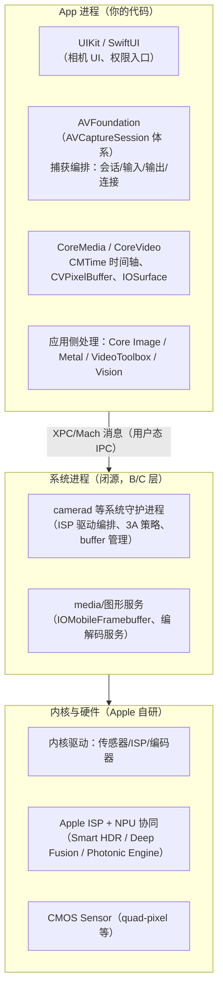
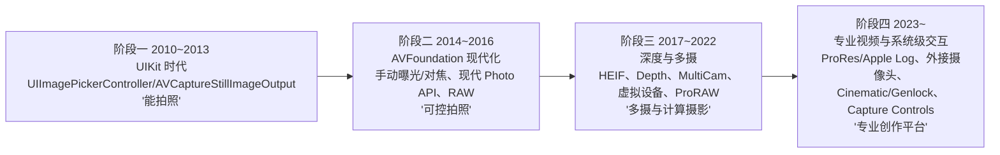
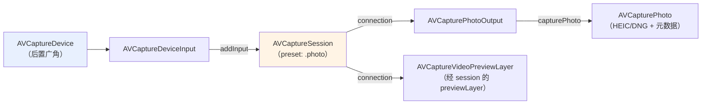

# 第 1 章 iOS 相机系统架构概览与版本演进

> 本文为分章源文件，供单章阅读；若与主文档不一致，以主文档最新版为准。

> 本章内容整理自 Apple 官方文档与 WWDC 视频（文中逐节附链接），面向已熟悉 Android 相机框架、希望系统学习 iOS 相机体系的工程师。流程图均为 Mermaid 语法。

**材料可信度分层约定**（与《Android_Camera_ISP_3A文档》同一套体系，来源不同）：

| 层级 | 含义 | 典型来源 |
|---|---|---|
| A 层 | Apple 官方公开资料，可抓取验证 | developer.apple.com 文档站（AVFoundation/AVCam 示例）、WWDC 视频与幻灯片、Technical Notes、Apple Newsroom |
| B 层 | 公开通行知识 | 行业通用的系统架构描述、Apple 未逐条出处的公开行为（如系统服务的存在性） |
| C 层 | 社区研究 | 开发者博客（Halide/Ben Sandofsky 等）、逆向研究；须给出出处且注明不确定度 |

与 Android 文档系列的一个根本差异：**iOS 全栈闭源**，不存在 AOSP 式的"源码逐行核对"，因此本系列 iOS 文档的"源码链路"一栏天然缺位，以**官方 API 行为文档 + WWDC 一手材料**为最可信来源，层级标注帮助读者区分"Apple 说了什么（A）"与"社区推测了什么（C）"。

## 1.1 分层架构：从 App 到 Sensor

> 来源（A 层）：[AVFoundation 官方文档总览](https://developer.apple.com/documentation/avfoundation)、[AVCam: Building a camera app](https://developer.apple.com/documentation/avfoundation/capture_setup/avcam_building_a_camera_app)、WWDC 系列捕获 session（如 [WWDC19 Session 234: Advances in Camera Capture](https://developer.apple.com/videos/play/wwdc2019/234/)）。

iOS 相机软件栈同样可以画出"应用 → 框架 → 系统服务 → 内核/驱动 → 硬件"的分层，但与 Android 相比每层的所有权和开放程度完全不同：

各层要点（A 层为 API 事实，B/C 层为架构性描述）：

| 层 | iOS 组件 | Android 对应物 | 所有权 |
|---|---|---|---|
| 应用框架 | AVFoundation（`AVCaptureSession`）+ CoreMedia/CoreVideo | Camera2/CameraX API + libcamera 本地库 | Apple |
| 系统服务 | camerad 等守护进程（闭源） | CameraService（AOSP 开源）+ vendor HAL | Apple 全部 |
| HAL 接口 | **不存在公开 HAL 接口**，第三方无法实现相机 HAL（macOS 例外，见第 6 章 Camera Extensions） | camera3.h / AIDL camera HAL（OEM/第三方可实现） | — |
| 图像处理 | Apple ISP（自研，配合 NPU 做计算摄影） | 高通 Spectra / MTK ISP（OEM 实现，tuning 交给厂商） | Apple |
| 传感器 | Apple 定制 CMOS（与 Sony/Samsung 代工合作） | OEM 采购 Sony/Samsung 等模组 | Apple 定制 |
| 出厂调校 | Apple 出厂统一 tuning，机型间行为一致 | OEM 各自 tuning，同代芯片不同机型表现差异大 | Apple |

> C 层补充：camerad 是 iOS 用户态的相机守护进程，承担 ISP 控制、3A 与缓冲区管理（社区普遍认知，参见对 iOS 系统的公开研究与崩溃日志中频繁出现的 `camerad`；Apple 不公开其实现）。Android 的对应角色被拆分在 CameraService 与 vendor HAL 进程中。

**与 Android 最大的三点结构差异**（理解这三点，后面所有章节都会顺畅）：

1. **没有 HAL 边界**。Android 文档系列花了整章讲 HAL3 的"请求/结果"协议；iOS 中这条协议线在 Apple 内部（App ⇄ camerad），对开发者不可见。开发者看到的"协议"就是 AVFoundation API。
2. **没有请求/结果元数据表**。Android 用 `CaptureRequest/TotalCaptureResult` 的键值元数据驱动每一帧；iOS 用**属性 + 模式**驱动（`AVCaptureDevice` 上的一组 mode 属性 + lock/unlock），每帧逐键控制的能力面窄得多——这是 API 哲学差异：Android 面向逐帧精确控制，iOS 面向"把控制权交给系统"。
3. **计算摄影默认在场**。Android 上 HDR/夜景/OEM 算法是否介入取决于 OEM；iOS 上 Smart HDR/Photonic Engine 等对所有 App 的默认输出生效，且**没有公开开关**（有限例外见第 5 章）。

## 1.2 版本演进时间线

> 来源（A 层）：各版本 WWDC session 与 Apple 官方文档的 API 可用性标注（每个 API 页面的 Availability 栏）；部分硬件关联特性参考 Apple Newsroom 产品页。

按"对开发者可用的 API"梳理主线（硬件功能只在系统相机可用的会单独注明）：

| iOS 版本（发布） | 相机相关关键变化 | 代表 API |
|---|---|---|
| 8（2014） | 手动曝光/对焦控制、帧率控制，AVFoundation 捕获体系成型 | `ExposureModeCustom`、`setExposureModeCustom(duration:iso:)` |
| 10（2016） | 现代拍照 API 取代 stillImageOutput；RAW（DNG）拍照 | `AVCapturePhotoOutput`、`AVCapturePhotoSettings`、`rawPhotoPixelFormatType` |
| 11（2017） | HEIF/HEVC 默认编码、深度数据管线（iPhone X TrueDepth） | `AVCaptureDepthDataOutput`、`AVDepthData`、`AVVideoCodecType.hevc` |
| 13（2019） | 多摄并发、虚拟/融合设备、照片质量优先级、人像蒙版 | `AVCaptureMultiCamSession`、`isVirtualDevice`、`photoQualityPrioritization`、portrait effects matte |
| 14（2020） | 相机使用隐私指示（绿点）；14.3 起 Apple ProRAW（12 Pro） | `isAppleProRAWSupported`（ProRAW） |
| 15（2021） | 系统相机电影效果模式（iPhone 13）；15.4 LiDAR 设备类型 | `builtInLiDARDepthCamera` |
| 16（2022） | 高分辨率拍照尺寸控制（48MP 机型） | `supportedMaxPhotoDimensions` / `maxPhotoDimensions` |
| 17（2023） | 连接旋转角替代方向枚举；零快门延迟的延迟照片处理；**第三方 ProRes/Apple Log**（iPhone 15 Pro）；iPadOS 外接 USB 摄像头；空间视频（15 Pro，系统相机）；Action Button 捕获事件 | `videoRotationAngle`、deferred photo processing、`AVVideoCodecType.proRes422`、`.external` 设备类型、`AVCaptureEventInteraction` |
| 18（2024） | Camera Control 硬件两段式快门（iPhone 16）接入第三方 | `AVCaptureEventInteraction`（Camera Control 事件） |
| 26（2025） | 捕获控制扩展（AirPods 远程快门）；**Cinematic 捕获 API**（第三方电影效果模式）；iPhone 17 Pro 的 ProRes RAW / Apple Log 2 / Genlock；Center Stage 前摄低延迟防抖 | `AVCaptureEventInteraction`（remote control）、Cinematic capture session API、Genlock/ProRes RAW API |
| WWDC26 预览（2026，对应秋季新版本，撰写时未 GA） | 超高分辨率拍照三种选项（RAW/曝光包围/全处理）；相机启动响应大幅优化；Center Stage 前摄 API 完善 | 见 [WWDC26 Session 304](https://developer.apple.com/videos/play/wwdc2026/304)、[Session 303](https://developer.apple.com/videos/play/wwdc2026/303) |

时间线图（开发者视角的四个阶段）：

阅读提示：本系列文档以 **iOS 17~26 的稳定 API** 为主线撰写，历史 API（`AVCaptureStillImageOutput` 等）不再展开；每个 API 页面官方标注的可用版本，以 developer.apple.com 为准。

## 1.3 API 体系总览：AVFoundation 捕获家族

> 来源（A 层）：[AVFoundation 相机捕获文档组](https://developer.apple.com/documentation/avfoundation/capture_setup)、[AVCam 示例工程](https://developer.apple.com/documentation/avfoundation/capture_setup/avcam_building_a_camera_app)。

学习 iOS 相机开发，核心是掌握 AVFoundation 中一条"会话—输入—输出"的对象图，其余能力（深度、元数据、多摄）都是这条对象图上的扩展。与 Android 的概念映射：

| AVFoundation 概念 | 一句话职责 | Android Camera2 对应 |
|---|---|---|
| `AVCaptureSession` | 捕获编排中枢：连接输入与输出，管理质量预设 | `CameraDevice` + `CameraCaptureSession` 的合体 |
| `AVCaptureDevice` | 物理相机设备及其控制（3A、变焦、格式） | `CameraCharacteristics` + `CaptureRequest` 控制 |
| `AVCaptureDeviceInput` | 设备接入会话的输入端点 | （无对应，Android 直接把 device 绑到 session） |
| `AVCapturePhotoOutput` | 拍照输出（HEIC/JPEG/DNG/ProRAW/Live Photo） | ImageReader(JPEG/RAW) + JPEG 应用侧管线 |
| `AVCaptureMovieFileOutput` | 一站式视频文件输出（容器/编码/元数据全托管） | MediaRecorder 路线 |
| `AVCaptureVideoDataOutput` | 逐帧 sample buffer 输出（自处理/自编码） | ImageReader(YUV) 自管线 |
| `AVCaptureDepthDataOutput` | 深度图流输出 | Depth 相关 ImageFormat（HUAWEI/部分设备）或 HeifDepth |
| `AVCaptureMetadataOutput` | 人脸/二维码等元数据检测流 | Face Detection metadata + ML Kit 自建 |
| `AVCaptureConnection` | 输入到输出的具体连接（方向、镜像、旋转） | CaptureRequest 的方向键 + SurfaceTransform |
| `AVCaptureVideoPreviewLayer` | 预览层（CALayer 子类） | SurfaceView/TextureView + 预览流 |

一次典型捕获 App 的搭建步骤（详细 API 见《iOS_Camera_接口文档》）：

1. 请求权限（`AVCaptureDevice.authorizationStatus(for: .video)`）；
2. `AVCaptureDevice.DiscoverySession` 发现设备 → 建立 `AVCaptureDeviceInput`；
3. 创建 `AVCaptureSession`，`beginConfiguration` → 加 input/output → `commitConfiguration`；
4. 启动（`startRunning()`，同步阻塞，务必放后台队列）；
5. 按 output 类型收数据（delegate 回调 / delegate 链）。

> 与 Android 的顺序差异：Android 是 openCamera → createCaptureSession → setRepeatingRequest（显式开启重复流）；iOS 没有"请求"概念，`startRunning()` 之后预览与各输出即持续供流，拍照是对 photo output 的**单次动作**而非流状态切换。

## 1.4 高层封装生态：iOS 没有 CameraX 等价物

> 来源（A 层）：[AVCam: Building a camera app](https://developer.apple.com/documentation/avfoundation/capture_setup/avcam_building_a_camera_app)（官方示例含 SwiftUI 变体）、SwiftUI 与 AVFoundation 文档可用性标注。

Android 用 CameraX 解决了"生命周期绑定、设备兼容、用例抽象"三大痛点；**iOS 官方没有对应物**——AVFoundation 本身就是唯一官方路线，Apple 用别的方式回应同样的问题：

| CameraX 解决的问题 | iOS 的官方回应 |
|---|---|
| 生命周期感知（LifecylceOwner 绑定） | 系统中断通知 + AppDelegate 生命周期（第 2 章 2.4），无声明式绑定 |
| 兼容性抽象（CameraXConfig） | 不需要：硬件行为跨机型一致（垂直整合） |
| 用例抽象（Preview/ImageCapture/VideoCapture） | 输出对象体系本身就是用例（Photo/MovieFile/VideoDataOutput） |
| CameraController（Kotlin 便捷层） | 无官方等价物；SwiftUI **没有官方相机捕获组件** |

SwiftUI 集成现状（A 层事实）：官方示例 AVCam 提供 SwiftUI 实现变体，但结构仍是 `UIViewControllerRepresentable` 包装 UIKit 相机视图控制器；预览可单独用 `AVCaptureVideoPreviewLayer` 包进 `UIViewRepresentable`。截至 iOS 26，SwiftUI 没有官方的会话/输出组件，社区封装库是"易用层"的事实角色（自建或选库，注意其维护度与 AVFoundation 新特性跟进速度）。

工程含义：Android 上"CameraX vs Camera2"的选型讨论在 iOS 不存在——直接学 AVFoundation 本体，本文档系列即按此定位撰写。

## 1.5 与 Android 学习文档的对照阅读地图

本仓库 Android 系列共四份文档，iOS 系列对应关系与差异说明：

| Android 文档 | iOS 对应 | 对应关系说明 |
|---|---|---|
| 学习文档（AOSP 官方 31 页整理） | 《iOS_Camera_学习文档》（本篇） | 架构/机制/版本/功能四条主线对齐；Android 有 HAL 子系统章，iOS 无公开 HAL，以"系统服务黑盒 + API 行为"替代 |
| 接口文档（Camera2/CameraX/NDK + HAL） | 《iOS_Camera_接口文档》 | 应用层速查对齐；Android 的 HAL 层在 iOS 无公开对应物，改为"元数据与色彩管理对照"章 |
| 源码链路文档（AOSP 逐行） | **无对应** | iOS 闭源，不写不可溯源的内容；系统内部机制以 B/C 层标注少量分布于学习文档各章 |
| ISP/3A 文档（libcamera/平台 HAL） | 《iOS_Camera_ISP_图像管线文档》 | Apple ISP 闭源但官方行为文档完备（A 层多），以"计算摄影体系 + 应用侧处理栈 + 3A 接口映射"替代平台 HAL 章 |

建议阅读顺序（有 Android 背景的读者）：先读本篇第 1 章建立分层与差异认知 → 第 2 章 AVFoundation 会话模型（等价于 Android 的 session 模型）→ 第 3 章 3A 接口面（对照 Android 的 CONTROL_* 元数据）→ 按需进入第 4~6 章；写代码前通读《接口文档》第 1 章；理解"照片为什么好看/为什么和系统相机不一样"读《图像管线》第 2 章。
