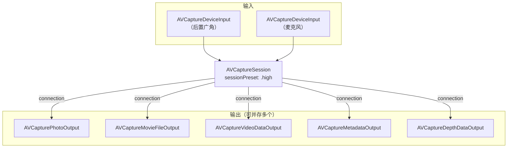

# 第 2 章 AVFoundation 捕获核心：会话、设备与输入输出

> 本文为分章源文件，供单章阅读；若与主文档不一致，以主文档最新版为准。

> 本章内容整理自 Apple 官方文档（文中逐节附链接），是全部后续章节的基础。代码示例为 Swift（AVFoundation API 在 Objective-C/Swift 下同构）。

## 2.1 会话—输入—输出模型

> 来源（A 层）：[AVCaptureSession](https://developer.apple.com/documentation/avfoundation/avcapturesession)、[AVCam: Building a camera app](https://developer.apple.com/documentation/avfoundation/capture_setup/avcam_building_a_camera_app)。

AVFoundation 捕获的核心是一个**对象图**：`AVCaptureSession` 作为中枢，把一个或多个 `AVCaptureDeviceInput`（设备输入）连接到一个或多个具体输出。数据不经过应用代码的"逐帧请求"，而是由会话持续供流给每个输出：



与 Android 模型的三点对应与差异：

| 维度 | AVFoundation | Camera2 | 说明 |
|---|---|---|---|
| 会话创建 | addInput/addOutput + commit | configureSurface + createCaptureSession | iOS 的"输出"自带缓冲策略，Android 显式传 Surface |
| 流配置 | sessionPreset 一键选择质量组合；个别 output 上做格式微调 | createCaptureSession 显式枚举每条 stream（尺寸/格式/fps） | iOS 是"预设优先"，Android 是"逐流声明"；iOS 换 preset 无需重建会话 |
| 供流方式 | startRunning 后持续供流 | setRepeatingRequest 显式开启重复请求 | iOS 无"请求"对象，会话跑起来即出帧 |

**`AVCaptureConnection` 是隐藏的关键角色**：每对输入↔输出之间由系统建立一条连接，方向（`videoRotationAngle`，iOS 17 起）、镜像（`isVideoMirrored`）、稳定（`preferredVideoStabilizationMode`）、缩放等**每路输出独立的属性**都挂在 connection 上——等价于 Android 里"同一相机到不同 Surface 的不同 stream use case 配置"。查方向/防抖问题时应先看 connection，而不是 session。

## 2.2 会话配置的原子性与生命周期

> 来源（A 层）：[AVCaptureSession 官方讨论页](https://developer.apple.com/documentation/avfoundation/avcapturesession)（Configuring a session 一节）。

`AVCaptureSession` 的所有结构性修改（增删 input/output、改 preset）必须在 `beginConfiguration()` / `commitConfiguration()` 之间完成，系统在 `commitConfiguration()` 时一次性生效（不中断正在运行的会话）——这是 Apple 版的"事务性流重配置"，对应 Android 里"改流必须重建 session"的沉重操作，iOS 做成了运行时可变：

```swift
session.beginConfiguration()
session.sessionPreset = .photo
if let input = try? AVCaptureDeviceInput(device: wideCamera) , session.canAddInput(input) {
    session.addInput(input)
}
if session.canAddOutput(photoOutput) { session.addOutput(photoOutput) }
session.commitConfiguration()
```

生命周期规则（A 层，官方文档明确行为）：

- **`startRunning()` 是同步阻塞调用**，耗时随 preset/输出组合可达数百毫秒，官方文档明确要求**不要在主线程调用**；`stopRunning()` 同理。这与 Android `openCamera` 的异步回调模型不同——iOS 是"调用即完成，你自己选线程"。
- 会话可反复 start/stop；进入后台建议 stop（系统也会因中断替你做，见 2.4）。
- 一个会话同一时刻只能跑一个 preset；`canSetSessionPreset(_:)` 预检兼容性。
- **格式与 preset 的关系**：`AVCaptureDevice.Format`（设备能力）是"菜单"，`sessionPreset` 是"点单"。设备支持 4K 但 preset 选 `.high` 时，实际输出由 preset 决定；要拿到 4K 需 `.hd4K3840x2160` 或 `.inputPriority`（让 input 的 activeFormat 决定，配 `AVCaptureVideoDataOutput` 做逐帧处理时常用）。

会话对象图的常见坑（官方示例 AVCam 与文档均有对应处理）：

1. 在 commit 前用 `canAddInput/canAddOutput` 预检，直接 add 失败时是静默不生效；
2. 预览层 `AVCaptureVideoPreviewLayer` 从 `session` 取（`previewLayer(session:)`）而不是 addOutput；
3. 配置与 `startRunning` 之间不要交叉 UI 主线程长任务——会话启动耗时是卡顿告警的高发点。

## 2.3 设备发现与选择

> 来源（A 层）：[AVCaptureDevice](https://developer.apple.com/documentation/avfoundation/avcapturedevice)、[AVCaptureDevice.DiscoverySession](https://developer.apple.com/documentation/avfoundation/avcapturedevice/discoverysession)。

设备发现用 `DiscoverySession`（一次声明想要的类型列表，系统按优先级返回可用设备），等价于 Android 的 `getCameraIdList` + `CameraCharacteristics` 过滤，但**按"类型意图"而非"cameraId 字符串"寻址**——这是"垂直整合"在 API 上的体现：Apple 保证每个机型上 `builtInWideAngleCamera` 的语义一致。

主流 deviceTypes（A 层，来自官方枚举定义）：

| deviceType | 引入 | 物理含义 |
|---|---|---|
| `builtInWideAngleCamera` | iOS 10 | 主广角（多数机型的默认主摄） |
| `builtInTelephotoCamera` | iOS 10 | 长焦 |
| `builtInUltraWideCamera` | iOS 13 | 超广角 |
| `builtInDualCamera` / `builtInDualWideCamera` | 10 / 13 | 双摄虚拟设备（广+长 / 广+超广） |
| `builtInTripleCamera` | iOS 13 | 三摄虚拟设备（超广+广+长） |
| `builtInTrueDepthCamera` | iOS 11.1 | 前置结构光深度模组（Face ID 硬件复用） |
| `builtInLiDARDepthCamera` | iOS 15.4 | LiDAR 深度传感器 |
| `.external`（iPadOS/iOS 17，前身 iOS 16 `continuityCamera`） | 17 | 外接摄像头（USB/Continuity Camera） |

选中设备后关键属性：

- `formats: [AVCaptureDevice.Format]`：该设备全部输出格式（分辨率、帧率范围、色彩空间、防抖能力、最大照片尺寸等），等价于 Android `StreamConfigurationMap` + `CameraCharacteristics` 的合集；
- `activeFormat`：当前生效格式；逐帧处理路线（`AVCaptureVideoDataOutput` + `.inputPriority` preset）下通过 `lockForConfiguration` 切换 `activeFormat` 来锁帧率/分辨率（Android 里对应选择 stream 尺寸 + `CONTROL_AE_TARGET_FPS_RANGE`）；
- `isVirtualDevice` / `constituentDevices` / `activePrimaryConstituentDevice`：虚拟设备与其成员（多摄行为详见第 5 章）；
- `uniqueID`：持久标识，跨启动稳定（对应 cameraId）。

## 2.4 中断、恢复与多会话规则

> 来源（A 层）：[AVCaptureSession.interruptionNotification](https://developer.apple.com/documentation/avfoundation/avcapturesession/1388291-interruptionnotification)、[AVCaptureSessionErrorKey 相关通知族](https://developer.apple.com/documentation/avfoundation/avcapturesession)、WWDC 捕获 session 问答。

iOS 会话的生命周期**不归 App 完全所有**：来电、Siri、其他 App 抢占、多任务画中画、FaceTime 接管等都会造成系统中断。必须处理的通知族：

| 通知 | 时机 | 建议动作 |
|---|---|---|
| `interruptionNotification` | 系统抢占中断（reason 在 userInfo） | 暂停 UI 状态；reason 为 videoRecordingNotSupported 等需禁用录制按钮 |
| `interruptionEndedNotification` | 中断结束 | 自动或提示用户 `startRunning()` 恢复 |
| `errorNotification` | 运行时错误（如高温、媒介错误） | 按错误码降级或重启会话 |
| `AVCaptureDevice.subjectAreaDidChangeNotification` | 场景大变（对应 Android AF/AE 场景变化回调） | 提示用户或重启连续 3A |

> 与 Android 的对应：Android 用 `CameraDevice.StateCallback.onDisconnected/onError` + `CameraManager.AvailabilityCallback` 表达抢占；iOS 把"别的 App 拿走相机"完全交给系统仲裁，App 只收中断通知。两边都要把"会话可能随时消失"作为常态来设计。

**多会话并发规则**：iOS 不鼓励（部分系统版本禁止）同时运行多个 `AVCaptureSession`；同一相机的多用途通过**一个会话多输出**解决（拍照+预览+逐帧处理并存是默认形态）。真正的双摄并发（前后同录、双主摄）不靠两个 session，而靠 `AVCaptureMultiCamSession`（第 5 章）。

## 2.5 权限与隐私模型

> 来源（A 层）：[Requesting authorization to capture and save media](https://developer.apple.com/documentation/avfoundation/capture_setup/requesting_authorization_to_capture_and_save_media)、[App Privacy 清单](https://developer.apple.com/documentation/bundleresources/privacy_manifest_files)。

权限流程是一次性对话式（授权后无需 Android 的运行时反复检查模式）：

```swift
switch AVCaptureDevice.authorizationStatus(for: .video) {
case .notDetermined:
    AVCaptureDevice.requestAccess(for: .video) { granted in /* 回调线程再搭会话 */ }
case .authorized: break           // 直接搭会话
case .denied, .restricted:        // 引导去设置页
default: break
}
```

规则与 Android 差异点：

- Info.plist **必须**预置 `NSCameraUsageDescription` 用途文案，缺失直接崩溃（Android 是 manifest 权限声明 + 运行时动态申请）；
- 授权是**应用级一次授权**，无 Android 13+ 的"仅这一次"细粒度选项；用户可在设置页随时改，运行时状态通过 `authorizationStatus` 轮询/重查；
- 系统级隐私指示（状态栏绿点）在 iOS 14+ 对所有相机使用常驻生效，无 API 可关；
- 麦克风（`.audio`）与照片库（PHPicker / `NSPhotoLibraryAddUsageDescription`）各自独立授权，拍照 App 要处理三套权限的组合状态；
- 2024 起 App 需提供 Privacy Manifest（隐私清单），相机 API 本身不在必申报的 fingerprinting 类 API 之列，但涉及其依赖的 user defaults 等系统 API 时按官方清单要求申报。

> 设计提示：Android 上"相机权限被拒"是常态路径（可重试动态授权），iOS 上被拒后只能引导去设置页——把 `denied` 态的 UI 当成一级状态设计，而不是错误处理。
