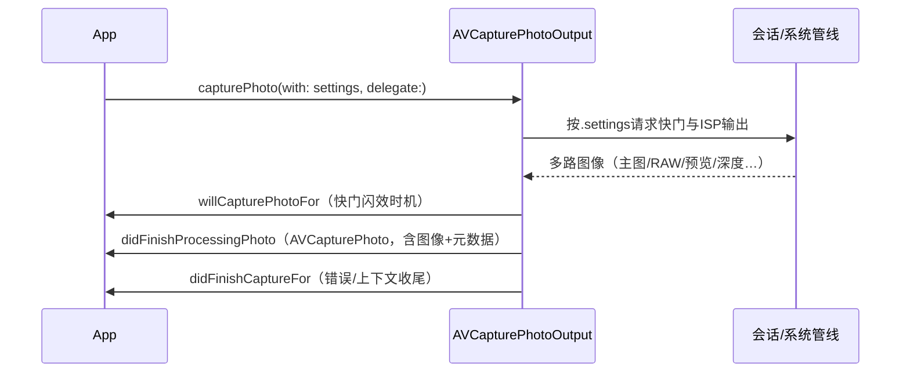
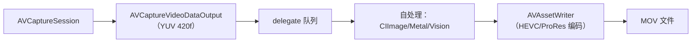

# 第 4 章 拍照与录像管线

> 本文为分章源文件，供单章阅读；若与主文档不一致，以主文档最新版为准。

> 本章整理自 Apple 官方文档（逐节附链接）：照片管线以 [AVCapturePhotoOutput](https://developer.apple.com/documentation/avfoundation/avcapturephotooutput) 为核心，视频管线覆盖文件输出与逐帧输出两条路线，并讲清 ProRes/Apple Log/空间视频等专业格式的 API 面。

## 4.1 照片管线：一次 capturePhoto 的完整旅程

> 来源（A 层）：[AVCapturePhotoOutput](https://developer.apple.com/documentation/avfoundation/avcapturephotooutput)、[AVCapturePhotoSettings](https://developer.apple.com/documentation/avfoundation/avcapturephotosettings)、[Capturing photos 官方样章](https://developer.apple.com/documentation/avfoundation/capture_setup/capturing_still_and_video_photos)。

拍照是**单次动作对象模型**：每次拍照构造一个 `AVCapturePhotoSettings` 描述"要什么"，回调链交付"得到了什么"：

`AVCapturePhoto` 聚合了成品与全过程信息（对应 Android 里 ImageReader 的 Image + `TotalCaptureResult` 的合体）：

- 图像数据：`fileDataRepresentation()`（可直接写盘，含 EXIF/色彩配置/DNG）、`cgImageRepresentation()`；
- 元数据：`metadata`（EXIF/TIFF 字典）、`resolvedSettings`（实际用的曝光/闪光/对焦参数——**这就是 iOS 版的 CaptureResult**）、`cameraCalibrationData`（标定与深度变换）；
- 附属交付：Live Photo 配对视频、深度数据（`depthData`）、人像蒙版（`portraitEffectsMatte`）。

**Settings 的构建规则**（官方文档明确）：settings 对象在拍照开始后即被"固化"，复用同一实例连续拍照是允许的；一个 settings 可要求**多格式并行交付**（如 HEIC 主图 + DNG RAW 同时出——对应 Android 上"一个 request 双 ImageReader"）。

## 4.2 照片格式体系

> 来源（A 层）：各格式的文档页与 [AVVideoCodecType](https://developer.apple.com/documentation/avfoundation/avvideocodectype)。

| 格式 | 开关 | 场景与 Android 对应 |
|---|---|---|
| HEIC | `format: [AVVideoCodecKey: .hevc]` | 默认照片编码，对应 Android `JPEG_APP_SEGMENTS`/HEIC ImageFormat |
| JPEG | 同上用 `.jpeg` | 兼容场景 |
| DNG（RAW） | `rawPhotoPixelFormatType` 从 `availableRawPhotoPixelFormatTypes` 选 | 对应 `RAW_SENSOR` ImageReader |
| **Apple ProRAW** | `isAppleProRAWSupported`（iOS 14.3+）+ `AVFileType.dng` 交付 | **Android 无对应物**：系统全处理链（含降噪/HDR 合并）的线性 DNG |
| Live Photo | `isLivePhotoCaptureEnabled`（先查 `isLivePhotoCaptureSupported`） | 对应部分 OEM 的 Motion Photo，API 化程度更高 |

ProRAW 的关键理解（详见《图像管线》第 2 章）：它不是"纯 RAW"——DNG 里装的是 **Apple ISP 全处理后的线性化数据**，保留后期调色空间但已含系统降噪/合并；想要传感器原生 RAW 用 DNG 交付的 raw 通道。这两条线 Android 都没有系统级等价物（Android 的处理后格式是 JPEG/HEIC）。

## 4.3 高分辨率与延迟处理

> 来源（A 层）：[Capturing maximum-quality photos](https://developer.apple.com/documentation/avfoundation/capture_setup/capturing_maximum_quality_photos)（quality prioritization 与 dimensions 文档组）、WWDC23 相机 session（iOS 17 延迟照片处理）。

48MP 时代（iPhone 14 Pro 起）照片管线引入两个独立维度的控制：

1. **尺寸维度**：`AVCaptureDevice.Format.supportedMaxPhotoDimensions`（设备格式支持的尺寸列表）→ `AVCapturePhotoOutput.maxPhotoDimensions`（本次输出上限）→ settings 里每张再收窄。默认输出是像素合并后的 12MP；要 48MP 需显式抬高 dimensions（对应 Android 上部分平台的 `SENSOR_PIXEL_MODE` remosaic 路线，iOS 是统一 API）。
2. **质量/延迟维度**：`photoQualityPrioritization`（.speed / .balanced / .quality，iOS 13 起）声明"多快出片 vs 算多深"；iOS 17 起配合**延迟照片处理**（deferred photo processing，`isDeferredPhotoProcessingEnabled`）：先秒回预合成 JPEG，系统后台继续精修后替换——这是 Apple 版零快门延迟（ZSL）的官方化，Android 上 ZSL 是 HAL 内部行为、无公开 API。

> 与 Android 的语义对照：Android `COLOR_CORRECTION_MODE/HDR` + OEM 私有扩展决定计算摄影深度；iOS 用 qualityPrioritization 把这个选择标准化成三档公开 API。这是"垂直整合换来的 API 简洁"的典型例子。

## 4.4 视频管线：文件输出与逐帧输出

> 来源（A 层）：[AVCaptureMovieFileOutput](https://developer.apple.com/documentation/avfoundation/avcapturemoviefileoutput)、[AVCaptureVideoDataOutput](https://developer.apple.com/documentation/avfoundation/avcapturevideooutput)、[Media services 官方样章](https://developer.apple.com/documentation/avfoundation/media_recording)。

两条路线对应 Android 的 MediaRecorder 路线与 ImageReader 自管线路线：

**路线 A：`AVCaptureMovieFileOutput`（托管）**——startRecording(to:recordingDelegate:) 即出完整 MOV 文件，容器/轨道/元数据系统托管；可设置 `maxRecordedDuration/maxRecordedFileSize`、录制中断与暂停。快速出片、直播以外场景首选。

**路线 B：`AVCaptureVideoDataOutput`（逐帧）**——`setSampleBufferDelegate` 每帧回调 `AVCaptureSampleBuffer`（CVPixelBuffer + `CMSampleTimingInfo`），App 自行处理或经 `AVAssetWriter` 落盘。关键配置：

- `videoSettings` 指定像素格式（`kCVPixelBufferPixelFormatTypeKey`；420f/bi-planar 是处理管线常用）；
- `alwaysDiscardsLateVideoFrames = true`（实时优先，对应 Android 丢帧策略）；
- 帧率控制在设备 `activeFormat` + `activeVideoMin/MaxFrameDuration`（对应 `CONTROL_AE_TARGET_FPS_RANGE`）；
- 逐帧数据自带 `CMTime` 时间轴，多路（多摄/深度/音频）对齐靠 `CMSampleBuffer` 的 presentationTimeStamp。

## 4.5 专业视频格式：ProRes、Apple Log、ProRes RAW、Genlock

> 来源（A 层）：[AVVideoCodecType](https://developer.apple.com/documentation/avfoundation/avvideocodectype)（proRes 系列）、WWDC23/WWDC25 相机相关 session、Apple Newsroom（iPhone 15/17 Pro 产品页）。

| 能力 | 版本/机型 | API 面 |
|---|---|---|
| ProRes 422/HQ/422/LT/4444 编码 | 第三方 API 自 iOS 17（iPhone 15 Pro 起） | `AVVideoCodecType.proRes422/.proRes422HQ/.proRes4444` + `AVAssetWriter`/MovieFileOutput |
| Apple Log 色彩 | iPhone 15 Pro（iOS 17） | 色彩空间/日志配置经捕获管线格式能力暴露（设备格式中查询 Apple Log 支持） |
| Apple Log 2 / ProRes RAW / Genlock | iPhone 17 Pro（iOS 26） | WWDC25/Apple 官方资料：AVFoundation 暴露 ProRes RAW 交付、Log 2 色彩与**多机位 Genlock 同步**（多台 iPhone 与专业摄影机帧级同步，影视工业场景） |
| 空间视频 | iPhone 15 Pro+（系统相机 iOS 17；第三方逐步开放） | 双镜头立体录制，配 visionOS 回放生态 |

> 与 Android 对照：专业视频是 Apple 明显领先 API 化程度的领域——Android 上 10-bit Log（各 OEM HDR 视频）散落在 `REQUEST_AVAILABLE_CAPABILITIES` 私有扩展里；Apple 把 Log/ProRes/Genlock 做成跨机型一致的公开能力并配套 Final Cut/Resolve 生态。C 层参考：影视社区（CineD 等评测）对 Log 2/Genlock 行为的实测一致。

## 4.6 Cinematic 捕获 API（iOS 26）

> 来源（A 层）：[Capture cinematic video in your app（WWDC25 Session 319）](https://developer.apple.com/videos/play/wwdc2025/319)。

iOS 15 的电影效果模式仅存在于系统相机；iOS 26 把它开放为 **Cinematic capture API**：App 可配置电影效果捕获会话，获得系统级的主体识别、焦点过渡（rack focus）、录制中切换焦点主体等能力（此前只有播放端 API）。对多摄虚拟设备来说，这是"系统把 fusion 路线的算法能力输出给第三方"的又一例（前例是 ProRAW）。

## 4.7 音频与多路同步

> 来源（A 层）：[AVCaptureAudioDataOutput](https://developer.apple.com/documentation/avfoundation/avcaptureaudiodataoutput)、媒体同步相关 WWDC 材料。

- 音频输入同样是"设备 → input → output"对象图（`AVCaptureDevice` mediaType `.audio`），逐帧路线用 `AVCaptureAudioDataOutput`，其 sample buffer 的 PTS 与视频在同一 `CMTime` 基准下，混流交给 AVAssetWriter 即天然对齐；
- 视频会议类双路（视频逐帧 + 音频逐帧）建议**不同串行队列**收 delegate，避免相互阻塞（官方示例做法）；
- 录制中断（电话来电）在 MovieFileOutput 路线下由 delegate 收到 error/finished 回调，文件已保全；逐帧路线需自行处理 PTS 跳变——这是 Android `MediaMuxer` 自管线路线的同款坑。
