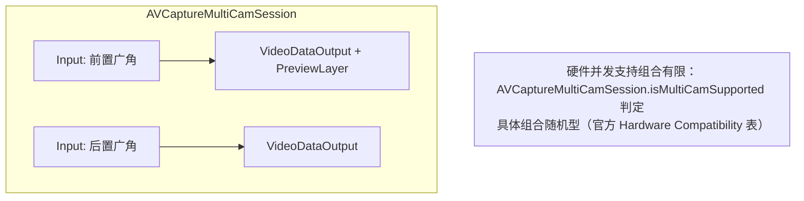

# 第 5 章 多摄、深度与硬件特性

> 本文为分章源文件，供单章阅读；若与主文档不一致，以主文档最新版为准。

> 本章整理自 Apple 官方文档（逐节附链接）：多摄并发、虚拟设备、深度数据管线、硬件交互与外接摄像头。

## 5.1 多摄系统：虚拟设备与并发会话

> 来源（A 层）：[Capturing photos on multiple cameras simultaneously（MultiCam 文档）](https://developer.apple.com/documentation/avfoundation/capture_setup/capturing_photos_on_multiple_cameras_simultaneously)、[AVCaptureMultiCamSession](https://developer.apple.com/documentation/avfoundation/avcapturemulticamsession)、虚拟设备文档组。

iOS 多摄有两个不同层次，对应 Android 的"逻辑多摄（logical camera）"与"并发多流（concurrent streams）"：

**层次一：虚拟设备（virtual device，iOS 13+）**——`builtInDualCamera/builtInDualWideCamera/builtInTripleCamera` 是系统合成的逻辑设备：

- 一个 `AVCaptureDeviceInput` 接入，输出由系统在成员镜头间**自动切换与融合**（`constituentDevices` 是成员物理镜头，`activePrimaryConstituentDevice` 是当前主镜头）；
- 变焦跨过 `virtualDeviceSwitchOverVideoZoomFactors` 锚点时自动换镜头，曝光/色彩已匹配（Android 逻辑相机的等价物，行为质量由 Apple 统一保证）；
- 融合行为可细调：照片上 `isAutoVirtualDeviceFusionEnabled`（默认开）——关闭后单 settings 拍照退化为单镜头输出。

**层次二：`AVCaptureMultiCamSession`（iOS 13+）**——真正同时取多路：

硬性规则（A 层，官方文档与 AVCamMulti 示例明确）：

- 用 `isMultiCamSupported` 预检硬件；具体"哪些镜头组合可并发"是机型相关的官方表格（iPhone XS 起支持部分组合；Pro 机型组合更全）；
- 多路同时**录制 + 深度 + 高分辨率照片**的组合限制最多，逐帧小分辨率预览最宽松；
- Android 的并发能力由 `CameraCharacteristics` 显式给出（`SCALER_MULTI_RESOLUTION_STREAM_CONFIGURATION_MAP` 等），iOS 是"表格 + 运行时试错（配置失败报错）"。

> 对应关系总结：Android logical camera ≈ virtual device；Android 多相机并发 session ≈ MultiCamSession。差异在于 Apple 的融合算法是系统内置（无法关闭跨镜匹配质量），Android 的逻辑相机行为是 OEM 实现质量参差。

## 5.2 深度数据管线：TrueDepth、LiDAR 与 AVDepthData

> 来源（A 层）：[Capturing depth data](https://developer.apple.com/documentation/avfoundation/capture_setup/capturing_depth_data)、[AVDepthData](https://developer.apple.com/documentation/avfoundation/avdepthdata)、[AVCaptureDepthDataOutput](https://developer.apple.com/documentation/avfoundation/avcapturedepthdataoutput)。

三个深度来源（均为系统管线，App 只面对 `AVDepthData`）：

| 来源 | 硬件 | 数据特征 |
|---|---|---|
| 双摄立体匹配 | 多摄机型（虚拟设备） | 视差图，分辨率较低，远景不稳 |
| TrueDepth 前置 | 结构光（Face ID 模组复用） | 近距高质量深度（人像自拍/AR 前置） |
| LiDAR | `builtInLiDARDepthCamera`（iOS 15.4，Pro 机型） | 大范围稠密深度，低光可用 |

管线要点：

- 流式深度：`AVCaptureDepthDataOutput`（delegate 每 `CMSampleBuffer` 交付 `AVDepthData`）；深度帧率通常低于视频帧率，需按 PTS 对齐；
- 照片深度：settings 的 `isDepthDataDeliveryEnabled` 交付 `AVCapturePhoto.depthData`；
- `AVDepthData` 的格式世界：disparity（视差，1/m）vs depth（米）互转（`converting(toDepthData:)`）、精度（Float32/Float16）、滤波（`AVDepthDataFilterType`）；
- 人像蒙版：`portraitEffectsMatte`（iOS 13，人像分割掩码）与深度是两个独立交付物；
- 标定数据：`AVCameraCalibrationData`（内参/外参/畸变），多摄 AR 场景必需。

> 与 Android 对照：Android 深度能力是 OEM 分化区（DEPTH16 ImageFormat、Heif depth metadata），没有跨机型的深度输出保证；iOS 的三源统一到 `AVDepthData` 且 iPhone 12 起 Pro 机型全系有 LiDAR，深度类 App（人像虚化、3D 扫描、AR 测量）在 iOS 上是一等公民。
> 隐私边界（A 层明确）：Face ID 的红外点阵原始数据**任何 App（包括 Apple 官方相机 API 路径）都不可得**，TrueDepth 第三方只能拿到处理后的深度图。

## 5.3 微距、Center Stage 与预览稳定

> 来源（A 层）：`AVCaptureDevice` 微距与 Center Stage 相关 API、[Support the Center Stage front camera（WWDC26 Session 341）](https://developer.apple.com/videos/play/wwdc2026/341)。

- **微距**（iPhone 13 Pro 起，超广角自动对焦）：`minimumFocusDistance` 小于阈值即可判定微距能力；虚拟设备在近距离自动切换到超广角执行微距，App 无感（对应 Android OEM 各自的微距实现，无统一 API）；
- **Center Stage**：前摄人像居中跟随（iPad 优先、iPhone 渐进支持），`AVCaptureDevice` 上有控制模式（开关/宽高比），iOS 26 起前摄 Center Stage 支持实时低延迟防抖与手动宽高比控制；
- **预览稳定**：视频防抖模式挂在 `AVCaptureConnection.preferredVideoStabilizationMode`（off/standard/cinematic/cinematicExtended/previewAuto），对应 Android `CONTROL_VIDEO_STABILIZATION_MODE`（Android 15 起才统一 APP 级预览防抖语义）。

## 5.4 硬件交互：Capture Controls、Action Button 与 AirPods 远程快门

> 来源（A 层）：[Enhancing your camera experience with capture controls（WWDC25 Session 253）](https://developer.apple.com/videos/play/wwdc2025/253)、[AVCaptureEventInteraction](https://developer.apple.com/documentation/avfoundation/avcaptureeventinteraction)。

- **Camera Control**（iPhone 16 硬件两段式快门，iOS 18）：`AVCaptureEventInteraction` 接收按压事件（轻按/重按两段），实现自定义拍照流程；
- **Action Button**（iPhone 15+）：用户可绑定为"启动相机/拍照"，App 侧处理启动参数；
- **AirPods 远程快门**（iOS 26）：`AVCaptureEventInteraction` 扩展支持 AirPods 按键触发拍照——远程自拍/固定机位场景；
- 这些事件 API 的共同设计：**事件注入到 App 的捕获流程，而不是模拟点击**，与 Android 的硬件快门（部分机型的 private intent）相比是系统级标准化。

## 5.5 外接摄像头：iPadOS/iOS 17 与 Continuity Camera

> 来源（A 层）：[AVCaptureDeviceType.external](https://developer.apple.com/documentation/avfoundation/avcapturedevicetype/external)、WWDC23 iPadOS 摄像头更新材料。

iOS 17 起支持外接 USB 摄像头（iPadOS 全量、iPhone 随 Pro 机型推进），通过 `.external` 设备类型进入 DiscoverySession——**这是 Android `ExternalCameraProvider`（USB 相机）的对应物**：

- 外接设备同样走 AVFoundation 全套（格式/控制/输出），但控制面收窄（如手动曝光支持取决于设备 UVC 描述符）；
- Continuity Camera（iPhone 当 Mac 摄像头）在 iOS 16 引入 `continuityCamera` 类型，iOS 17 合并入 `.external`；
- 热插拔通知：`AVCaptureDevice.wasConnectedNotification / wasDisconnectedNotification`（对应 Android USB device attach/detach）。

macOS 上更进一步的 **Camera Extensions**（第三方可用 DriverKit 实现系统级摄像头）见第 6 章。

## 5.6 功能矩阵总表：iOS vs Android

> 汇总本章与前述章节，做一张"开发者可见能力"对照表（面向功能选型；A 层归纳）。

| 能力 | iOS（统一 API） | Android（分化现状） |
|---|---|---|
| 逻辑多摄/无缝变焦 | 虚拟设备，系统保证 | logical camera，OEM 质量 |
| 并发多流 | MultiCamSession + 官方组合表 | concurrent camera capability |
| 深度 | AVDepthData 三源统一 | OEM 分化（DEPTH16 等） |
| 系统计算摄影 | 默认在场，qualityPrioritization 三档 | OEM 私有（部分暴露开关） |
| RAW | DNG + ProRAW（系统处理链） | RAW_SENSOR 纯 RAW |
| 专业视频 | ProRes/Log/ProRes RAW/Genlock | OEM 私有 10-bit Log |
| 手动 3A | 模式 + 锁定（lens position 有限） | 逐帧元数据（全量） |
| 外接摄像头 | .external（iOS 17+） | ExternalCameraProvider |
| 硬件快门事件 | AVCaptureEventInteraction | 无统一 API |
| 相机 HAL 扩展 | 仅 macOS（DriverKit） | AIDL/HAL 全开放 |
