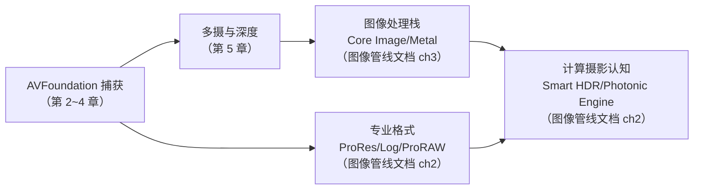

# 第 6 章 生态、扩展与合规

> 本文为分章源文件，供单章阅读；若与主文档不一致，以主文档最新版为准。

> 本章整理自 Apple 官方文档（逐节附链接），覆盖"Android 工程师最容易带着错误预期进入"的三块：相机 HAL 扩展、屏幕捕获、系统相机替换与合规。

## 6.1 Camera Extensions：为什么 iOS 上没有"第三方相机 HAL"

> 来源（A 层）：[Core Media I/O 与 DriverKit Camera Extensions 文档](https://developer.apple.com/documentation/driverkit)、[CMIOExtensionProvider 相关 API](https://developer.apple.com/documentation/coremediaio)。

Android 学习文档花整章讲 AIDL camera HAL（OEM/第三方实现 provider）；iOS 的对应物要分平台说清：

- **iOS/iPadOS：不存在**。相机 HAL 完全封闭，任何 App（包括系统级合作方）都无法为 iPhone 增加摄像头或替换相机栈——对应 Android 上"第三方 HAL 进程注入"这条路在 iOS 架构上就不存在；
- **macOS：Camera Extensions（DriverKit/CoreMedia IO）**。第三方设备厂商可用 DriverKit 写用户态相机驱动（CMIOExtension），把硬件（如专业采集卡、虚拟摄像头）注册为系统摄像头，Zoom/FaceTime 全系可用。这是 Android "USB 相机 provider" 与"虚拟相机方案"的 macOS 高级形态；
- iOS 上"虚拟相机"的合法替代是**Broadcast Upload Extension**（ReplayKit 直播推流）与 Application Group 内的图像注入——都不能伪装成摄像头设备。

> 结论：Android 上"实现一个 camera provider"这类工作在 iOS 无对应职业角色；iOS 相机开发的深度在**应用层管线**与**图像处理**，平台侧工作只有 Apple 自己。

## 6.2 ScreenCaptureKit 与相机的边界

> 来源（A 层）：[ScreenCaptureKit](https://developer.apple.com/documentation/screencapturekit)。

iOS/macOS 的屏幕捕获是独立框架（ScreenCaptureKit，macOS 12.5+ / iOS 26 起屏幕录制 API 整合），与相机捕获（AVFoundation）平行：

- 数据形态一致（`CMSampleBuffer` 流），但授权模型、系统 UI（屏幕录制指示）完全独立；
- 合成场景（相机+屏幕双流，如会议 App）：各自建会话，App 侧用同一套 CoreMedia 时间轴对齐——对照 Android 的 `MediaProjection`（屏幕）与 Camera2（相机）双管线，结构同构；
- iOS 26 起 App 能获得更完整的屏幕捕获流控制（WWDC25/26 相关 session），与相机新 API（Cinematic/Capture Controls）同代演进。

## 6.3 系统相机替换与生态位

> 来源（A 层）：iOS 平台行为与 App Store 审核指南（[App Review Guidelines](https://developer.apple.com/app-store/review/guidelines/)）。

Android 有 `SYSTEM_CAMERA` 能力与"默认相机 App 可替换"生态；iOS 的边界是刚性的：

- 锁屏/硬件快捷键永远启动**系统相机**，第三方不可注册；
- 第三方相机 App（Halide、ProCamera 等）的生存位是**更强的控制与更好的处理**（RAW 管线、手动对焦、直出调色），而不是系统级接管；
- 系统开放给第三方的"系统能力输出"呈渐进趋势：ProRAW（14.3）→ 第三方 ProRes/Log（17）→ Cinematic 捕获（26）——每次都是"把系统相机的内部能力 API 化"，学习时应关注 WWDC 相机 session 的这个主线。

## 6.4 测试、合规与质量保障

> 来源（A 层）：[XCTest](https://developer.apple.com/documentation/xctest)、[App Review 指南](https://developer.apple.com/app-store/review/guidelines/)、AVCam 系列示例工程。

Android 有 CTS/VTS 相机专项（`CameraITS` 等）验证 OEM 实现；iOS 上没有对应物，原因是**实现只有一家**——合规压力转移到 App 侧：

| Android 概念 | iOS 对应 | 差异 |
|---|---|---|
| CTS 相机用例 | 无（Apple 自测） | 开发者不参与 |
| 兼容性测试套件（App 侧） | XCTest + 多真机矩阵 | 需自建机型回归（iPhone 机型碎片化低于 Android 但仍在） |
| 权限合规（运行时拒绝路径） | 审核指南 5.1.1 要求最小权限与合理用途描述 | 审核门禁，不合规被拒上架 |
| 隐私清单 | Privacy Manifest（2024 起） | Android 对应是 Data safety 表单（声明式） |

实践建议（从 Android 工程经验迁移）：

1. **真机矩阵按"芯片代 + 镜头组合"选型**（iPhone 13/15/17 Pro 各留一台即可覆盖主要分叉：多摄组合、LiDAR、微距、Log 支持）；
2. 中断/恢复用例（来电、后台、拔耳机线供电波动）必须进 CI——iOS 会话中断比 Android 抢占更高频；
3. 用 Apple 官方示例工程（[AVCam](https://developer.apple.com/documentation/avfoundation/capture_setup/avcam_building_a_camera_app)、[AVCamMulti](https://developer.apple.com/documentation/avfoundation/capture_setup/avcammulticam_capturing_photos_and_video_on_multiple_cameras_simultaneously)）作为基线参考实现，Apple 对其持续维护。

## 6.5 本章小结：iOS 相机工程师的知识地图

到此，机制层结束。写代码查 API 见《iOS_Camera_接口文档》；理解"Apple 的照片为什么长这样"见《iOS_Camera_ISP_图像管线文档》。
