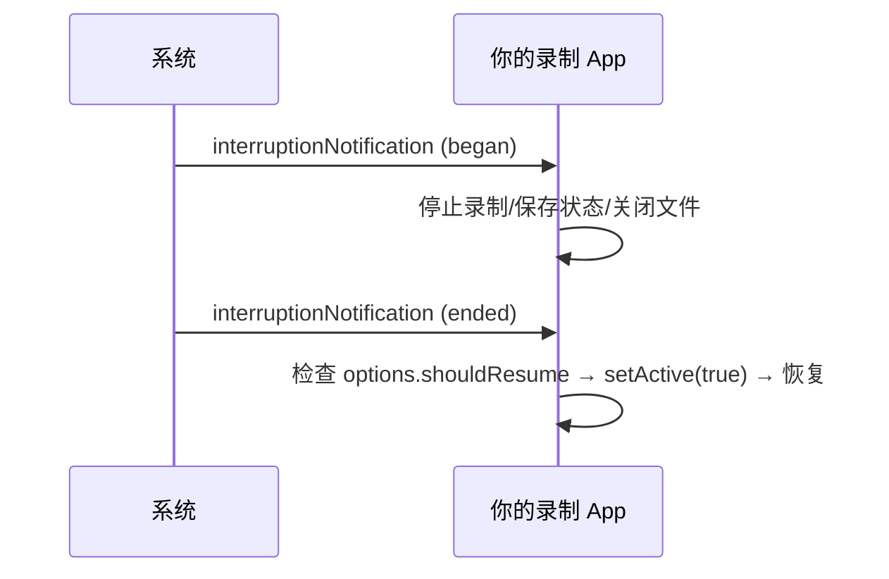

# 第 8 章 音频会话与录制闭环（AVAudioSession）

> 本文为分章源文件，供单章阅读；若与主文档不一致，以主文档最新版为准。

> 录视频的音画问题（没声音、声音从听筒出、来电后录不上）九成出在 AVAudioSession 配置。本章讲清音频会话与相机会话的协作，对应 Android 的 AudioRecord/AudioFocus/AudioManager 体系。出处：[AVAudioSession](https://developer.apple.com/documentation/avfaudio/avaudiosession)（AVFAudio 框架）。

## 8.1 定位：单例策略对象，而非捕获组件

`AVAudioSession` 是**进程级单例的策略对象**：它声明"本 App 要怎么用音频硬件"（类别、模式、路由偏好），系统据此仲裁多 App 音频（电话优先级最高）。相机 App 里它与 AVCaptureSession 平行存在——AVCaptureSession 管采集，AVAudioSession 管"硬件怎么配给采集"：

| Android 概念 | iOS 对应 |
|---|---|
| AudioManager.setMode/setSpeakerphoneOn | category + mode + overrideOutputAudioPort |
| 音频焦点（AudioFocusRequest） | 系统自动仲裁 + interruption 通知（无主动请求 API） |
| AudioRecord 采样配置 | category/mode 决定输入路径（采集参数在 AVCaptureDeviceInput/AudioDataOutput） |
| ACTION_HEADSET_PLUG / AudioDeviceCallback | routeChangeNotification |

## 8.2 类别与模式：相机 App 的标准配置

> 出处：[Audio categories 文档](https://developer.apple.com/documentation/avfaudio/avaudiosession/category)（各类别行为矩阵）。

录视频（MovieFileOutput/VideoDataOutput + 音频 input）的标准配置：

```swift
let session = AVAudioSession.sharedInstance()
try session.setCategory(.playAndRecord, mode: .videoRecording,
                        options: [.defaultToSpeaker, .allowBluetooth])
try session.setActive(true)
```

| 配置项 | 取值 | 说明 |
|---|---|---|
| category | `.playAndRecord` | 边录边播（回显/特效监听）；纯录音 `.record`；纯播放 `.playback` |
| mode | `.videoRecording` | 针对视频录制的信号处理（对应 Android setMode(MODE_IN_COMMUNICATION) 邻近语义） |
| `.defaultToSpeaker` | option | 扬声器出声（否则录音时输出走听筒——经典坑） |
| `.allowBluetooth` / `.allowBluetoothA2DP` | option | 蓝牙麦克风（HFP）/仅蓝牙音箱 |
| `.mixWithOthers` | option | 不打断其他 App 音频（社交类 App 常用；会让音频仲裁变弱） |

要点：

- **`setActive(true)` 是声明开始使用**，对应焦点获得；`setActive(false, with: .notifyOthersOnDeactivation)` 归还——与 Android 显式 requestAudioFocus/abandon 相比，iOS 的仲裁更"隐形"但同样存在（电话来电必然打断你）；
- 配置**越早越好**：在搭相机会话之前配好音频会话，避免先建 session 再改路由导致的重路由噪声（蓝牙切换的"咔哒"声会被录进音轨）；
- 类别/模式只能在**非激活**状态下改的部分属性有限制，改配置的完整模式是 setCategory → setMode → setActive。

## 8.3 路由：外设切换与监听

> 出处：[AVAudioSession.routeChangeNotification](https://developer.apple.com/documentation/avfaudio/avaudiosession/routechangenotification)、`currentRoute` 文档。

- `currentRoute`：当前输入/输出设备（`AVAudioSessionPortDescription`：builtInMic/bluetoothHFP/headphones 等）；
- **routeChangeNotification**：插拔耳机、连接 AirPods、蓝牙断连时触发（userInfo 含 oldDeviceUnavailable 与旧设备描述）——蓝牙耳机断连瞬间录音会自动落到内置麦克风，录制 App 应在此暂停或提示（对应 Android AudioDeviceCallback + 蓝牙 SCO 掉线的同款坑）；
- 输入优先级：有线耳机麦 > 蓝牙 HFP > 内置麦（连接即切换）；要强制内置麦需 option `.interruptionSpokenAudioAndMixWithOthers`? 不对——用 `overrideOutputAudioPort` 管输出侧，输入侧没有逐端口选择 API（macOS 才有完整选择），这是 iOS 音频路由的常见误解点。

## 8.4 中断：电话、Siri 与其他 App

> 出处：[Handling audio interruptions](https://developer.apple.com/documentation/avfaudio/handling_audio_interruptions)。



与相机中断（学习文档 2.4）是**两套独立通知**：来电会同时打断音频与相机（两个通知都到），但"其他 App 播音乐"只影响音频会话（相机会话不中断）。恢复逻辑要分开处理，录制中来电的文件保全靠 MovieFileOutput 的 delegate error 回调 + AVAudioSession 中断处理共同完成。

## 8.5 与相机会话协作的检查清单

1. 录制前：音频会话配置（category/mode/options）→ setActive(true) → 搭/启动 AVCaptureSession；
2. 录制中：监听 routeChange（外设切换降级）+ interruption（来电暂停）+ systemPressureState（热降级，学习文档 3.6）；
3. 录制后：setActive(false, notifyOthersOnDeactivation) 归还硬件；
4. 回显监听（耳机里听实时画面音）：category .playAndRecord + 耳机路由，**扬声器路径禁止监听**（啸叫）；
5. 多会话 App（聊天+相机）：全局只配一次音频会话，不要每个页面重复 setCategory 抢改。

> 与 Android 的总对照：iOS 的 AVAudioSession 把 Android 散在 AudioManager/AudioFocus/AudioRecord 三处的职责合并成单例策略对象，仲裁由系统代劳但通知不可省——"焦点思维"从主动请求变成被动响应，迁移时最容易漏的就是 interruption/routeChange 两条通知链。
