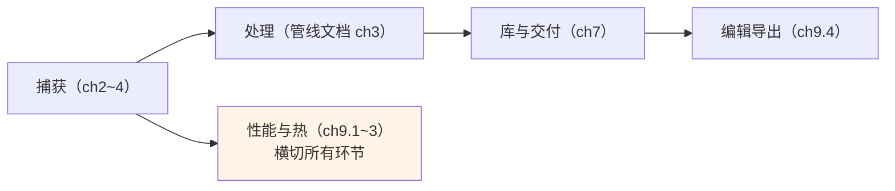

# 第 9 章 性能、导出与新形态交付

> 本文为分章源文件，供单章阅读；若与主文档不一致，以主文档最新版为准。

> 对应 Android 系列的学习文档第 3 章（性能优化）与编辑导出生态。出处：[AVAssetExportSession](https://developer.apple.com/documentation/avfoundation/avassetexportsession)、[AVComposition](https://developer.apple.com/documentation/avfoundation/avcomposition)、[AVAssetImageGenerator](https://developer.apple.com/documentation/avfoundation/avassetimagegenerator)、[Immersive Media Support](https://developer.apple.com/documentation/immersivemediasupport)（WWDC25 Session 403）。

## 9.1 帧管线性能：sample buffer 生命周期

> 出处：AVCaptureVideoDataOutput 文档对 delegate 生命周期的明确说明（A 层）。

逐帧管线的第一条铁律：**sample buffer 不得在回调作用域之外长期持有**。相机到输出的缓冲池是有限环（隐式管理），App 持住 buffer 不还，供流会停摆（帧不再到达，等价 Android 忘调 `Image.close()` 后 ImageReader 卡死，但 iOS 是隐式环、没有显式 close 调用，坑更隐蔽）。需要异步处理时：

- 拷贝需要的部分（`CIImage(cvPixelBuffer:)` 引用同一 IOSurface 但轻量；真正延迟处理用 `CVPixelBuffer` 的 retain 语义受 Core Image/CVBuffer 管理规则约束）——最稳妥的做法是**在回调内完成重活或复制到自有 buffer**；
- `alwaysDiscardsLateVideoFrames = true`（实时优先）时丢帧发生在输出侧，App 感知不到（无逐帧丢弃回调，与 Android 丢帧策略 API 相比不可观测）；
- delegate 队列必须**串行**，重活分流到其他队列，避免回调堆积触发系统丢帧。

性能预算参考（B 层通行经验）：预览走 `AVCaptureVideoPreviewLayer`（系统直渲零成本）；手动渲染（Metal/Core Image）才有逐帧预算——1080p30 的全链 GPU 处理要控制在一帧 33ms 内，4K 下先考虑降采样处理再回填。

## 9.2 热管理：压力驱动的降级矩阵

> 出处：[AVCaptureDevice.systemPressureState](https://developer.apple.com/documentation/avfoundation/avcapturedevice/systempressurestate)（学习文档 3.6 已介绍机制）。

长录/直播 App 的降级矩阵应挂在 `systemPressureState` 的 KVO 上（A 层定义了 level 与 factors；具体降级策略是工程决策）：

| 压力级别 | 建议动作 |
|---|---|
| nominal / fair | 全量运行（4K + ProRes + 实时滤镜） |
| serious | 关实时滤镜/降帧率/关监听；ProRes 降码率或转 HEVC |
| critical | 停止高负载输出，仅保预览；提示用户 |

与 Android 差异：Android 的热信号散在 OEM 私有 API 与系统广播（各机型行为不一），iOS 提供统一相机专用压力源——**降级策略可以做成跨机型一致的工程资产**。

## 9.3 后台与续录

> 出处：[UIKit 后台执行文档](https://developer.apple.com/documentation/uikit/app_and_environment/scenes_preparing_your_ui_to_run_in_the_background/extending_your_app_s_background_execution_time)。

- 进入后台：相机会话收到中断（2.4），预览冻结；**视频录制**可借 `beginBackgroundTask`（约 30 秒级余量）完成收尾落盘，**不能**无限后台录制（对应 Android 前台服务录制的差异——Android 可合法后台长录，iOS 没有等价能力）；
- "后台长录"的合法近似：保持会话在前台 + `AVCaptureSession` 与 UI 分离（锁屏前系统可能仍然中断，需实测各 iOS 版本行为，C 层经验：锁屏中断率随版本变化，不能作为产品依赖）；
- PIP（画中画）视频播放不受此限——播放与捕获的后台待遇不同，这是 iOS 多媒体的固定规则。

## 9.4 导出与编辑：Asset 体系

> 出处：[AVAssetExportSession](https://developer.apple.com/documentation/avfoundation/avassetexportsession)、[AVMutableComposition](https://developer.apple.com/documentation/avfoundation/avmutablecomposition)、[AVAssetImageGenerator](https://developer.apple.com/documentation/avfoundation/avassetimagegenerator)。

拍照 App 的"后期车间"三件套（对应 Android 的 Transformer/Media3 编辑器体系）：

| 组件 | 用途 | Android 对应 |
|---|---|---|
| `AVAssetExportSession` | 转码/压缩/格式转换（preset 驱动） | Media3 Transformer |
| `AVMutableComposition` + `AVVideoComposition` | 多轨拼接、时间线编辑、转场与自定义合成器 | Transformer 的序列编辑/Effect |
| `AVAssetImageGenerator` | 指定时间点出帧（封面/缩略图） | MediaMetadataRetriever |

要点：

- ExportSession 的 preset 是**声明式质量选择**（`.presetHighestQuality`、`.presetHEVCHighestQuality`、`.passthrough` 不重编码直拷容器）；精确控制码率/分辨率走 `AVAssetReader + AVAssetWriter` 自管线（等价 Android 的 MediaExtractor→Codec→Muxer 链）；
- `AVComposition` 编辑的是**时间线引用**（不复制数据，渲染时按引用合成）——导出时才落盘成品；ProRes 素材编辑注意重编码成本（`.passthrough` 不支持跨参数拼接时必须全重编）；
- 视频元数据（位置、拍摄时间、方向）写入经 `AVAssetWriter` 的 `metadata` 或导出时的 `metadataItemFilter`——对应 Android MediaMuxer 无元数据接口的痛点，iOS 这层是完整的；
- HDR 视频（HLG/Dolby Vision）导出保持色彩属性一致（preset 选择 HDR 支持项），SDR 化导出是显式选择而非默认。

## 9.5 新形态交付：空间视频与 Immersive Media

> 出处：[WWDC25 Session 403: Learn about Apple Immersive Video technologies](https://developer.apple.com/videos/play/wwdc2025/403)、[Immersive Media Support framework](https://developer.apple.com/documentation/immersivemediasupport)。

- **空间视频**（iPhone 15 Pro 起，双镜头立体 MV-HEVC）：系统相机录制；读取/回放侧经 AVFoundation/ImageIO 对 MV-HEVC 的支持对第三方开放，捕获端第三方 API 随版本渐进开放（以官方文档为准）；
- **Apple Immersive Video**：visionOS 生态的制作格式（含空间音频、宽视场沉浸式内容），WWDC25 引入 Immersive Media Support framework 与 AVFoundation 的新读写 API，面向内容制作工具链；
- 与 Android 对照：立体/沉浸视频在 Android 无系统级格式与管线支持（OEM 各自为政），Apple 把"拍摄设备 → 格式 → 回放设备"垂直打通——这是继 ProRAW/Log 之后又一例"系统能力 API 化"路线，值得跟踪其开放节奏。

## 9.6 本章小结

性能与热管理是横切关注点：sample buffer 生命周期、压力降级、后台边界三条规则先于功能设计确定，返工成本最低。
