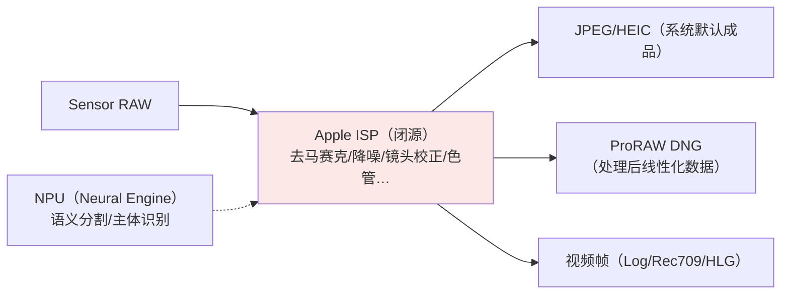

# 第 1 章 从 Sensor 到像素：Apple 链路公开知识

> 本文为分章源文件，供单章阅读；若与主文档不一致，以主文档最新版为准。
>
> 本章与《Android_Camera_ISP_3A文档》第 1 章同位：Android 版能引用内核驱动与 libcamera 源码（A 层），Apple 版的 sensor/ISP 全部闭源，A 层材料只剩 Apple 的产品级公开口径（技术规格页、WWDC）与 DNG 标签（Adobe 公开规范）——本章如实践分层标注，先给"能确认什么、不能确认什么"的边界。

**本章可信度边界声明**（与 Android ISP 文档 A/B/C 体系同源）：

- A 层：Apple 官方技术规格（iPhone 技术规格页）、WWDC 中对管线的官方描述、Adobe DNG 规范、`AVCaptureDevice.Format` 公开属性；
- B 层：传感器/ISP 的行业通行原理（Bayer、像素合并、HDR 合并等）套用到 Apple 机型；
- C 层：开发者社区实证（Halide 团队博客等对 ProRAW/Smart HDR 的分析），均已注明出处。

## 1.1 传感器：公开口径下的 Apple CMOS

> A 层来源：[iPhone 技术规格页](https://www.apple.com/iphone/compare/)（Apple 官方机型规格对比）、Apple Newsroom 各代产品稿。

Apple 不公开传感器型号与模组厂细节，但官方规格页给出可确认的能力口径：

| 公开口径 | 官方表述 | 开发者可观察的 API 落点 |
|---|---|---|
| 主摄 48MP（iPhone 14 Pro 起） | "48MP 主摄，四合一像素" | `supportedMaxPhotoDimensions`（48MP 列表）、`activeFormat.dimensions`（12MP 视频口径） |
| 四合一像素合并（quad-pixel） | 官方新闻稿长期表述 | 12MP 默认输出、48MP 可选输出（第 4 章照片管线） |
| 全系自动对焦主摄（13 起） | 官方规格 | `minimumFocusDistance` 骤降（微距） |
| 传感器位移防抖（部分机型） | 官方规格 | 无独立 API（防抖在 connection 模式内） |
| LiDAR（Pro 机型） | 官方规格 | `builtInLiDARDepthCamera` 设备类型 |

B 层原理补齐（行业通行，Apple 机型同样适用）：quad-pixel = 2×2 同色像素组在默认输出下合并为 1 个大像素（等效更大感光面积），高光场景可选全像素输出（remosaic）；这解释了 iOS 照片管线的两个 API 行为——**默认 12MP、显式抬 maxPhotoDimensions 才 48MP**，与 Android `SENSOR_PIXEL_MODE` 的 binning/remosaic 双模式语义同构。

## 1.2 ISP：闭源黑盒的可观测行为

> B/C 层为主。Android 版文档能逐模块讲 ISP 管线（BLS→LSC→去马赛克→…）；Apple 的 ISP 单元与处理顺序不公开，只有"输出行为"可观测。

可确认的边界（归纳自 A 层官方描述 + C 层社区实证）：

关键认知（与 Android 的根本不同）：

1. **没有 raw ISP 统计元数据可读**。Android 有 `ANDROID_STATISTICS_*`（直方图、AE/AWB 统计、scene flicker）；iOS 应用层拿不到任何 ISP 统计——行为只能通过成品推断；
2. **处理链不可插拔**。Android 部分平台提供 vendor tap 点/部分离线处理；Apple 的 ISP 是"输入 RAW、输出成品"的封闭函数，开发者唯一选择是**选择拿哪一级输出**（HEIC 成品 / ProRAW 线性 DNG / 纯 RAW DNG）；
3. **帧级处理对 App 透明**。逐帧路线（VideoDataOutput）拿到的已经是 ISP 处理后的帧（相当于 Android 上 HAL 内部完成 3A 的 preview 流输出）；想拿处理前数据只能走 RAW 照片管线。

C 层佐证（社区实证一致，见 Halide 团队对 ProRAW 的技术解析——ben-sandofsky/黄赟等 Halide 工程师博客与 WWDC 问答）：ProRAW 的 DNG 内含 Apple 全处理链结果（含降噪与合并），与"纯 RAW"的差异可以用同一场景两档输出对比复现。

## 1.3 DNG 通道：唯一可"拆开看"的窗口

> A 层来源：Adobe [DNG 规范](https://helpx.adobe.com/camera-raw/digital-negative.html)、`AVCapturePhoto` 交付数据。

开发者能对 Apple ISP 做的最深观测是解析 ProRAW/RAW 的 DNG 文件：

- DNG 标签给出传感器响应、黑电平、白点、线性化表——**这是 Apple 公开的传感器标定数据**（等价于 Android OEM 的 tuning 私有数据，Apple 通过标准格式部分公开）；
- ProRAW 与纯 RAW 的 DNG 差异可直接 diff（ProRAW 内嵌 Apple 处理结果的线性化数据 + 半成品噪声特征）；
- 这也是第三方 RAW 处理 App（Halide、Darkroom）的工作基础：绕过/补充系统成品管线，自建显影链。

## 1.4 与 Android 文档第 1 章的学习路径对照

| Android ISP 文档第 1 章主题 | Apple 版对应与位置 |
|---|---|
| CMOS 原理/Bayer/曝光模型 | 行业通用知识直接复用（B 层），本文不重复 |
| PDAF 像素与数据通路 | Apple 未公开（全像素双核对焦为官方口径）；行为级见本系列《学习文档》第 3 章（对焦接口） |
| V4L2/media-controller 驱动层 | **无对应**（iOS 无内核驱动可查），以 camerad 黑盒替代（学习文档 1.1） |
| QCOM CAMSS 驱动实例 | 无对应 |
| ANDROID_SENSOR_* 元数据 | `AVCaptureDevice` 曝光属性 + `resolvedSettings`（接口文档第 5 章总表） |

> 结论：iOS 的"底层学习"从驱动/寄存器层上移到**行为观测层**（API 行为 + DNG 解析 + 成品对比）。这个约束决定了后续三章的组织方式：讲系统级计算摄影（第 2 章）、应用侧处理栈（第 3 章）、3A 接口映射（第 4 章），而不是 ISP 模块分解。
