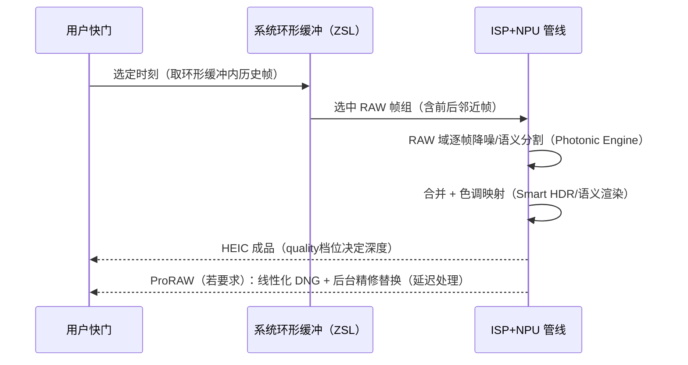

# 第 2 章 Apple 计算摄影体系：Smart HDR、Photonic Engine 与 ProRAW

> 本文为分章源文件，供单章阅读；若与主文档不一致，以主文档最新版为准。
>
> 本章讲"Apple 照片为什么长这样"。A 层材料是 WWDC 与 Apple 官方技术文档对功能行为的描述；具体算法内部（权重、融合策略）Apple 从未公开，社区分析（C 层）仅用于建立心智模型。

## 2.1 功能代际总览

> A 层来源：各代 iPhone 发布稿与 WWDC（[WWDC19 Session 503? 摄像头相关]、各年 camera session），版本归属以 Apple 官方新闻稿为准。

| 能力 | 引入 | 一句话定位 | 开发者可见性 |
|---|---|---|---|
| Smart HDR | iPhone XS（2018） | 多帧融合 + 语义识别，保证逆光人像天空与面部同亮 | 不可关；质量档位经 `photoQualityPrioritization` 间接表达 |
| 深度融合（Deep Fusion） | iPhone 11（2019） | 中低光的中亮度区域逐像素 NPU 融合（纹理优先） | 不可直接开关 |
| 夜间模式（Night mode） | iPhone 11（2019） | 长曝光多帧 + 对齐合并（手持秒级曝光） | 系统相机 UI 有开关；第三方 API 无显式开关 |
| Apple ProRAW | iPhone 12 Pro（iOS 14.3） | ISP 全处理链的线性 DNG 交付 | `isAppleProRAWSupported`（公开 API） |
| Photonic Engine | iPhone 14（2022） | 光像引擎：把深融合前移到 RAW 域逐帧处理（管线重排） | 无 API；效果经 quality 档位体现 |
| 语义渲染/PR（Photographic Styles） | iPhone 13 起 | 可复现的色彩风格（非滤镜，作用于管线的色调映射） | 系统相机功能，第三方仅可读取成品 |
| Night mode 人像/微距 HDR 等 | 13/14/15 渐进 | 上述能力的组合扩展 | 同上 |

代际演进的本质（B 层归纳）：**每代都在把"后处理"前移到"RAW 域逐帧处理"**——Smart HDR 是成品域多帧融合，Photonic Engine 把处理提前到像素合并前的 RAW 帧，用 NPU 在每帧上跑语义分割与降噪，再进入合并。这与 Android OEM 的"多帧 HDR in HAL"同构，但 Apple 的语义分割（人/天/发/肤分离调优）由自家 NPU 与模型统一实现，跨机型行为一致。

## 2.2 拍照时的处理时序（可观测行为模型）

> B/C 层：依据公开行为（快门延迟特征、resolvedSettings、社区实测）建立的模型，Apple 未公开时序。

对 API 行为的解释力：

- **`.speed` 与 `.quality` 的巨大差异**：不是"压缩质量"而是**处理链深度**（是否进 Photonic Engine/深融合）——对应 Android OEM 的 HDR 档位私有行为，Apple 把它 API 化了；
- **快门零延迟 + 出片延迟**：iOS 17 起延迟照片处理（deferred processing）把"秒回预览成品"与"后台精修替换"拆成两步（`AVCapturePhotoOutput` 的 deferred 相关 API）；
- **闪光与夜间模式互斥的表象**：两者都由系统在管线内决策，`flashMode = .auto` 的判定融合了场景光估计（不可读但可测）。

## 2.3 ProRAW 与 ProRes 的色彩科学定位

> A 层来源：[Apple ProRAW 官方支持文档](https://support.apple.com/zh-cn/118497)（Apple 关于 ProRAW 的说明）、Apple Log 官方资料（WWDC23/产品稿）。

| 交付 | 色彩科学定位 | 后期空间 |
|---|---|---|
| HEIC/JPEG 成品 | 显示域（OETF 已套用，Display P3/sRGB） | 直接分发，调节空间小 |
| ProRAW（DNG） | **线性显示参考**（处理后但线性化、16bit），已含降噪合并 | 后期调色空间大，直出需自己显影 |
| Apple Log（视频） | 对数域（Log OETF），广色域（BT.2020） | 影视级调色标准工作流 |
| Apple Log 2 | Log 2.0（更新曲线与工作流，17 Pro） | 同上，CST 工具链配套 |
| ProRes RAW | RAW 视频帧容器 | 最大自由度，17 Pro 起 |

与 Android 对照（对应《Android_Camera_ISP_3A文档》第 2 章 tuning 话题）：Android 上"成品的观感"由 OEM tuning（CCM、tonemap 曲线、local tone mapping 私有参数）决定，机型间差异大且不可迁移；Apple 的"观感"是**系统统一色调映射 + 语义渲染**，第三方拿到的是同样的观感基线，差异竞争在 ProRAW/Log 的后期空间——这是 iOS 相机 App 生态"调色类工具繁荣"的结构原因。

## 2.4 开发者可以影响的开关清单

> A 层归纳：全部来自公开 API，控制面确实很窄，但每项都有明确语义。

| 目标 | 可用开关 |
|---|---|
| 处理深度 | `photoQualityPrioritization`（.speed/.balanced/.quality） |
| 跨镜头融合 | `isAutoVirtualDeviceFusionEnabled`（关掉可拍单镜头原生视角） |
| 计算摄影与否 | ProRAW（系统处理链）vs 纯 RAW DNG（绕过）vs HEIC（全算）——三档"算力投入"选择 |
| 降噪/锐化 | 无 API（成品域不可调；需要自己的处理链时用 RAW + 自建显影） |
| 色彩风格 | 不可编程（系统相机功能）；成品后处理用 Core Image 自建 |
| 夜间/深融合 | 无直接开关（quality 档位间接影响） |

C 层实践共识（Halide/社区）：要做"比系统更讨喜的直出"，唯一完整路线是**纯 RAW 捕获 + 自建 ISP（去马赛克/降噪/色彩/色调）**，工程量大；多数产品选择"ProRAW 或 HEIC + Core Image 局部增强"的混合路线。

## 2.5 视频侧的系统处理

> A 层来源：视频防抖与电影效果相关 WWDC；B 层归纳。

- 视频默认管线同样有系统级处理（防抖裁切、色调映射、HLG/SDR 动态选择），`AVCaptureConnection.preferredVideoStabilizationMode` 是少数可编程点；
- 电影效果（Cinematic）在 iOS 26 前仅系统相机可用，26 起开放捕获 API（见《学习文档》第 4 章 4.6）；
- 空间视频（15 Pro+）：双镜头立体 + 系统对齐，第三方捕获支持随版本渐进开放。

> 本章小结：Apple 计算摄影的学习法是"行为实证 + 输出三通道（成品/ProRAW/Log）"，而不是 Android 式的"统计元数据 + tuning 参数"。能改变结果的 API 面窄，但每个开关的语义被 Apple 定义得很清楚——先认清"不可控的部分"，把工程力气花在可控制的交付格式与后期链路上。
