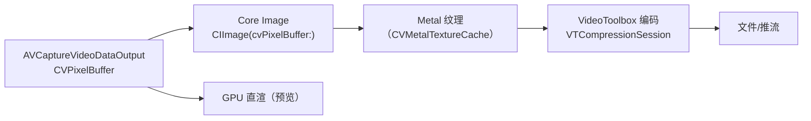

# 第 3 章 应用侧图像处理栈：Core Image、Metal 与 VideoToolbox

> 本文为分章源文件，供单章阅读；若与主文档不一致，以主文档最新版为准。
>
> Android 版文档第 2 章讲 ISP 内部的处理算法；iOS 上这些在系统闭源侧，开发者自己的"ISP"是应用侧处理栈——本章对应 Android 版第 2 章与第 3 章的部分主题（应用侧如何处理像素数据）。A 层来源：[Core Image](https://developer.apple.com/documentation/coreimage)、[Metal](https://developer.apple.com/documentation/metal)、[VideoToolbox](https://developer.apple.com/documentation/videotoolbox) 官方文档与 WWDC。

## 3.1 像素数据总线：CVPixelBuffer 与 IOSurface

> B 层（系统机制）+ A 层（API 行为）。

iOS 全部图像数据流经一条统一总线：`CVPixelBuffer`（用户态句柄，底层是 `IOSurface` 共享内存）。这解释了 iOS 管线的"零拷贝文化"：

- 相机逐帧 → Core Image → Metal → 编码器全程**同一块 IOSurface 显存**，无 CPU 内存拷贝（对比 Android：CameraX/ImageReader 的 Image → GL_OES_EGL_image_external 或 YUV 转换，路径常碎）；
- CPU 侧访问用 `CVPixelBufferLockBaseAddress`；GPU 侧经 `CVMetalTextureCache`；
- 这个统一总线是 iOS 视频特效 App 性能的结构优势——Android 上 YUV_420_888 布局在 vendor 间不一致的历史包袱，iOS 没有（Apple 限定 bicoplanar 两种布局）。

## 3.2 Core Image：Apple 的应用侧 ISP

> A 层来源：[Core Image 编程指南](https://developer.apple.com/library/archive/documentation/GraphicsImaging/Conceptual/CoreImaging/ci_intro/ci_intro.html)（官方存档仍为权威）、各 filter 文档页。

Core Image 在概念上就是"暴露给 App 的可编程 ISP"：

| 能力 | 代表接口 | 对应传统 ISP stage |
|---|---|---|
| 色彩管理 | `CIContext` workingColorSpace/outputColorSpace | CSC/色管（默认 Display P3 感知） |
| 色调映射 | `CIColorControls`、`CIToneCurve` | Gamma/Contrast |
| 去噪 | `CINoiseReduction`、ML 增强系列 | NR（比系统 ISP 简单） |
| 锐化 | `CISharpenLuminance`、`CIUnsharpMask` | Sharpen |
| 几何/镜头 | `CILensDistortion`、透视矫正 | LSC/几何校正的应用侧补充 |
| RAW 显影 | `CIRAWFilter`（解码 DNG/ProRAW） | 完整 RAW 管线（Adobe DNG 处理器封装） |

要点：

- filter 链是**声明式惰性**的（CIImage 图构建后一次性由 GPU 融合执行），与 Android 上"自写 GLSL 一级级 render"相比省优化功夫；
- `CIRAWFilter` 是处理 ProRAW/RAW 的官方路径（内部为 Apple DNG 处理器），自建显影不必从去马赛克写起；
- 性能三原则（官方性能指南）：复用单个 `CIContext`、避免 CPU 侧 `CGImage` 中转、控制 working space（处理用线性、输出用显示 space）。

## 3.3 Metal：自定义像素处理

> A 层来源：[Metal 文档](https://developer.apple.com/documentation/metal)、[Metal Performance Shaders](https://developer.apple.com/documentation/metalperformanceshaders)。

需要 Core Image 表达不了的处理（自定义降噪、风格化、AI 后处理）时：

- 纹理直通：`CVMetalTextureCacheCreateTextureFromImage` 把相机帧变 `MTLTexture` → 自写 compute kernel → 结果写回 CVPixelBuffer 给编码器（全程零拷贝）；
- `Metal Performance Shaders`（MPS）提供优化过的卷积/直方图/重采样等原语（对应 Android 上"自写 RenderScript/Vulkan compute"的官方原语库）；
- 与 CoreML 组合：分割/超分模型（CoreML）的输入输出同样是 `CVPixelBuffer`/`MTLTexture`，与相机帧同总线——这是 iOS "NPU 参与应用侧管线"的现实路径（系统 Photonic Engine 的应用层复刻）。

## 3.4 VideoToolbox：编码器直连

> A 层来源：[VideoToolbox 文档](https://developer.apple.com/documentation/videotoolbox)。

逐帧路线自管编码时，VideoToolbox 是 Apple 的 MediaCodec：

| 接口 | 角色 | Android 对应 |
|---|---|---|
| `VTCompressionSession` | 视频硬编码（H.264/HEVC/ProRes） | MediaCodec 编码器 |
| `VTDecompressionSession` | 硬解码 | MediaCodec 解码器 |
| `VTSessionSetProperty` | 码率/profile/帧率/色彩属性 | MediaFormat |
| 编码输出 sample buffer → AVAssetWriter/自封装 | 收尾 | MediaMuxer |

实践要点：编码器色彩属性（色彩矩阵/传输函数/色域标签）必须与像素数据一致标注，否则 HDR/广色域成品发灰——常见坑位；ProRes 编码同样经 VideoToolbox（codec 属性选择），不吃 CPU 软编。

## 3.5 Vision：感知原语

> A 层来源：[Vision 框架](https://developer.apple.com/documentation/vision)。

相机 App 常用的感知能力在 Vision 框架（NPU 加速）：人脸/人体姿态/矩形/文字检测、图像相似度等。与相机管线的衔接是"sample buffer → Vision request → 结果标注/驱动 3A 交互"（如点击人脸优先对焦）。对照 Android：CameraX 的 ML Kit 分析用例同位；差异是 Vision 的输入直接接 CVPixelBuffer 且默认 NPU，无需 Android 的 ImageProxy 格式转换层。

## 3.6 典型管线配方速查

| 需求 | 配方 |
|---|---|
| 实时滤镜相机 | VideoDataOutput → CIImage(filter 链) → previewLayer/Metal 渲染；录制分支接 AssetWriter |
| 人像虚化（自控） | 深度交付（DepthDataOutput）+ 自定义 bokeh kernel（Metal）或 CIRenderDestination |
| 直播推流 | VideoDataOutput（420f）→ 编码（VT）→ 协议封装；美颜节点用 Metal/MPS |
| RAW 显影 App | ProRAW/RAW 捕获 → CIRAWFilter → 自调色 → 导出 |
| 帧级 AI 后处理 | CoreML(分割/超分) + Metal 混合，输入输出保持 CVPixelBuffer 总线 |
