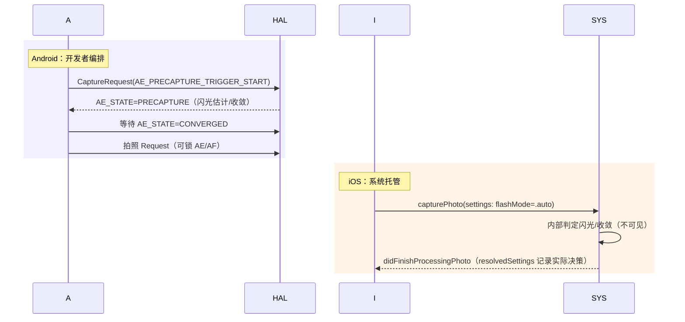
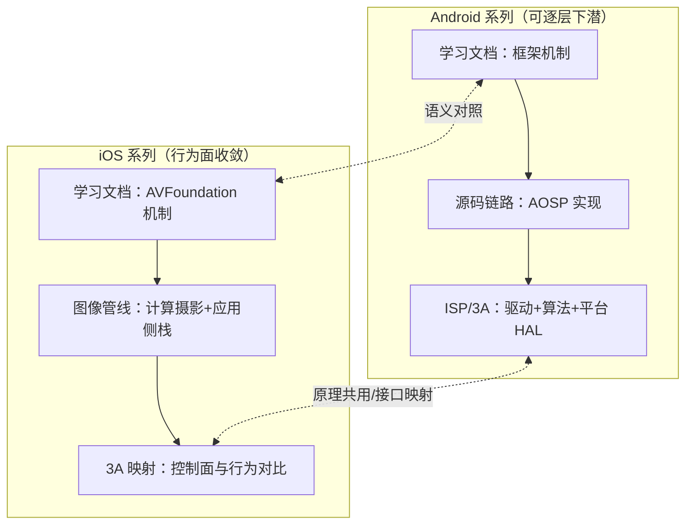

# 第 4 章 3A 接口映射与平台对比

> 本文为分章源文件，供单章阅读；若与主文档不一致，以主文档最新版为准。
>
> 本章对应《Android_Camera_ISP_3A文档》第 3 章（3A 算法深入）：Android 版逐函数分析了 libcamera 的 AE/AWB/AF 开源实现；Apple 的 3A 闭源且无统计元数据，本章做两件事——把"3A 的 Apple 控制面"与"Android 3A 元数据"完整对齐（接口层），并对比两平台 3A 行为差异（行为层）。算法原理（AE 收敛、AWB 色温估计、AF 爬山）请回读 Android 版第 3 章，两平台共用同一套原理。

## 4.1 3A 控制面完整映射

> A 层归纳：来自 AVFoundation 文档与 Android camera metadata 文档（`/camera/docs/metadata`）的语义对齐。

**AE（自动曝光）**：

| Android | iOS | 映射注意点 |
|---|---|---|
| `AE_MODE_ON/ON_AUTO_FLASH/ON_ALWAYS_FLASH/OFF` | `exposureMode`（autoExpose/continuousAutoExposure/custom）+ 照片 `flashMode` | Android 闪光与 AE 同键耦合；iOS 拆开（曝光在 device、闪光在 settings） |
| `AE_EXPOSURE_COMPENSATION`（step + index） | `exposureTargetBias`（连续 EV） | iOS 连续值需 UI 侧自行吸附档位 |
| `AE_PRECAPTURE_TRIGGER` | 无 | 拍照收敛由系统管线内部处理（见 4.3） |
| `AE_STATE`（含闪烁检测） | `adjustingExposure` + 无状态 | 无 flicker 元数据；防频闪完全系统内 |
| `AE_LOCK`（regions/lock） | `exposureMode = .locked` | 锁定语义相同 |
| `SENSOR_EXPOSURE_TIME/SENSITIVITY` | `setExposureModeCustom(duration:iso:)` | 单位差异（ns vs CMTime 秒） |

**AF（自动对焦）**：

| Android | iOS | 映射注意点 |
|---|---|---|
| `AF_MODE_AUTO/CONTINUOUS_PICTURE/MACRO/EDOF` | `focusMode`（autoFocus/continuousAutoFocus） | EDOF 无对应（虚拟设备融合内部处理） |
| `AF_TRIGGER_START/CANCEL` | 无显式触发 | 惯用法：切 `.autoFocus` → 观察 `adjustingFocus` 收敛 → 切回连续 |
| `LENS_FOCUS_DISTANCE`（屈光度） | `lensPosition`（0~1） | iOS 无物理单位标定；电影级跟焦能力弱于 Android 手动路线 |
| `AF_STATE` | `adjustingFocus` + `subjectAreaDidChangeNotification` | iOS 无 state 细分 |
| `AF_REGIONS` | `focusPointOfInterest`（单点） | 多区域加权不可表达 |

**AWB（自动白平衡）**：

| Android | iOS | 映射注意点 |
|---|---|---|
| `AWB_MODE_AUTO/INCANDESCENT/…` | `continuousAutoWhiteBalance` | iOS 无场景枚举预设 |
| `COLOR_CORRECTION_MODE`（TRANSFORM_MATRIX 等） | `whiteBalanceMode = .locked` + `deviceWhiteBalanceGains` | iOS 增益含系统标定换算（温/色→RGB） |
| `COLOR_CORRECTION_TRANSFORM`（CCM） | 不可控 | Apple 内部 |
| `NEUTRAL_COLOR_POINT`（结果） | 无直接读取 | 可从 `resolvedSettings`/成品 EXIF 推断 |

## 4.2 行为层差异：谁来"负责"3A

> B/C 层归纳（行为来自两平台公开文档与社区实证的长期观察）。

| 维度 | Android | iOS |
|---|---|---|
| 3A 策略实现 | OEM HAL（质量分化） | Apple 统一（跨机型行为一致） |
| 可观测性 | 全量统计与状态机元数据 | 仅模式/收敛布尔 + 成品推断 |
| 手动控制深度 | 深（逐帧逐键，含 CCM/bokeh/touch） | 浅（模式 + 锁定，无 CCM） |
| 触发时序控制 | 开发者编排（precapture/trigger） | 系统托管（拍照时内部收敛） |
| 结果验证 | meta 对比 + ITS | 成品对比 + resolvedSettings |

工程含义：

1. **Android 3A 调试方法论**（meta trace、逐帧状态机分析）在 iOS 失效——iOS 的调试是**成品导向**（拍系列照片看行为、diff DNG、对比 quality 档位）；
2. iOS 上"3A 异常"的分层排查：先排除 App 侧（模式被锁、坐标换算错、KVO 没跟上），再判断系统行为（真机矩阵复测），最后是硬件限制（无 AF 的镜头、微距边界）；
3. 写跨平台相机产品时的 3A 对齐策略：**以 iOS 的窄控制面为公共分母设计 UI**（模式切换 + 单点 + 补偿滑条），Android 的富控制（手动 CCM、区域矩阵、precapture 时序）作为平台增强层——反之（按 Android 全控设计 UI）会在 iOS 永远缺功能。

## 4.3 拍照收敛时序对照（precapture 的两种世界观）

> B 层（Android 侧为公开协议，iOS 侧为行为模型）。

Android 的 precapture 序列是 HAL 协议（《Android_Camera_ISP_3A文档》3.2 有逐状态分析）；iOS 把同样的物理过程（闪光预闪估计、曝光收敛）藏在照片管线内，开发者唯一影响是 `flashMode` 与 `photoQualityPrioritization`。**Apple 用"快门延迟换开发者简单"**——`.quality` 档位的出片延迟本质是系统版 precapture + 多帧处理的总时长。

## 4.4 两平台学习地图合并（系列总结）

把本仓库 Android 与 iOS 两个系列放回一张图：

- 共用底层：成像原理、3A 算法原理、多帧计算摄影思想（Android ISP 文档讲透了，iOS 侧直接复用）；
- 分叉点：Android 深在**开放与逐层可控**（HAL/驱动/算法均可下潜），iOS 深在**系统级整合与交付质量**（计算摄影/专业格式/统一行为）；
- 人才画像：Android 相机工程师向 tuning/平台纵深发展，iOS 相机工程师向图像处理/产品体验纵深——两个系列文档的章节结构就是按这个分工组织的。
